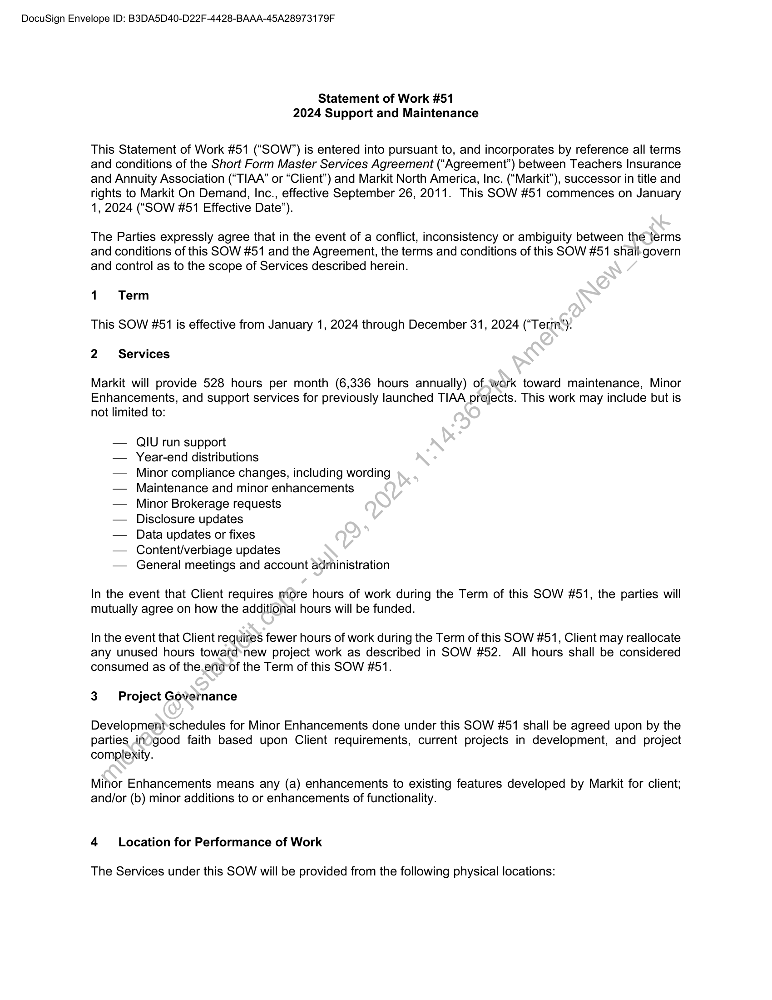
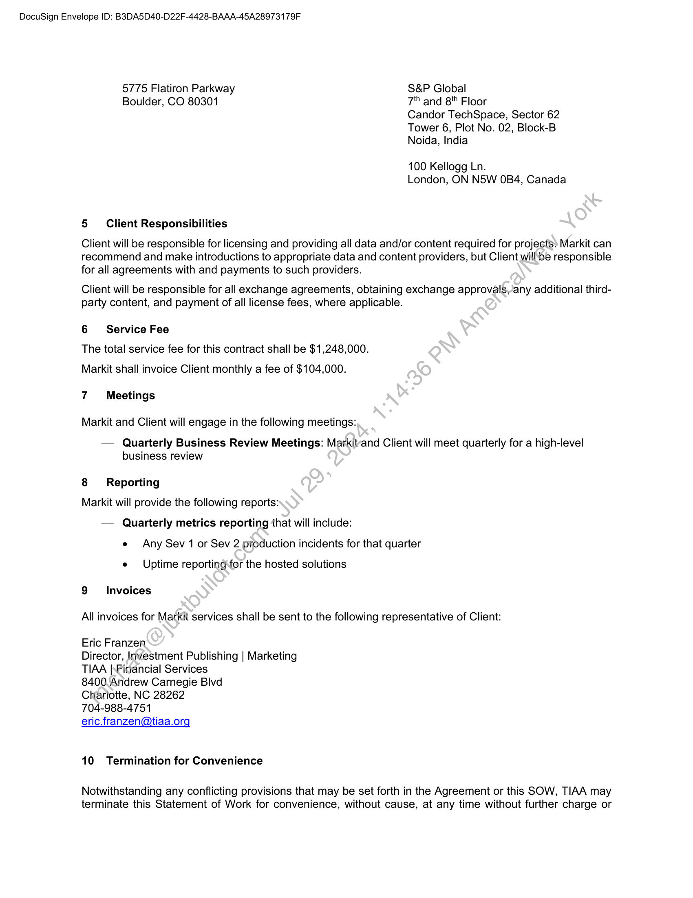
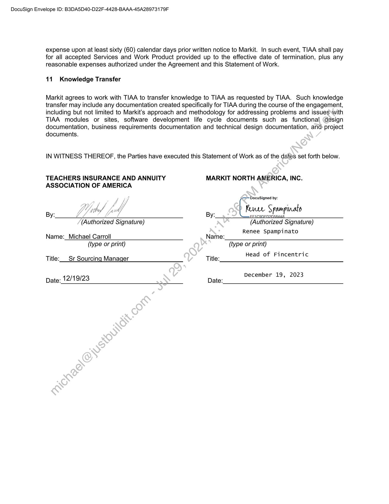

##### Statement of Work #51 - 2024 Support and Maintenance]

  
````col
```col-md
flexGrow=.5
===
> [!info] [Page 1](_attachments/images_TIAA-3.6.1.13.100207675.pdf_210156/page_1.png)
> 
```  
```col-md
DocuSign Envelope ID: B3DA5D40-D22F-4428-BAAA-45A28973179F  
Statement of Work #51
2024 Support and Maintenance  
This Statement of Work #51 (“SOW”) is entered into pursuant to, and incorporates by reference all terms
and conditions of the Short Form Master Services Agreement (“Agreement”) between Teachers Insurance
and Annuity Association (“TIAA” or “Client’) and Markit North America, Inc. (“Markit”), successor in title and
rights to Markit On Demand, Inc., effective September 26, 2011. This SOW #51 commences on January
1, 2024 (“SOW #51 Effective Date”).  
The Parties expressly agree that in the event of a conflict, inconsistency or ambiguity between the terms
and conditions of this SOW #51 and the Agreement, the terms and conditions of this SOW #51 shail: govern
and control as to the scope of Services described herein.  
1 Term
This SOW #51 is effective from January 1, 2024 through December 31, 2024 (“Term”).
2 ~~ Services  
Markit will provide 528 hours per month (6,336 hours annually) of.work toward maintenance, Minor
Enhancements, and support services for previously launched TIAA projects. This work may include but is
not limited to:  
— Q|U run support  
— Year-end distributions  
— Minor compliance changes, including wording
— Maintenance and minor enhancements  
— Minor Brokerage requests  
— Disclosure updates  
— Data updates or fixes  
— Content/verbiage updates  
— General meetings and account administration  
In the event that Client requires more hours of work during the Term of this SOW #51, the parties will
mutually agree on how the additional hours will be funded.  
In the event that Client requires fewer hours of work during the Term of this SOW #51, Client may reallocate
any unused hours towafd*new project work as described in SOW #52. All hours shall be considered
consumed as of the.end-of the Term of this SOW #51.  
3 Project Governance  
Developmenit:schedules for Minor Enhancements done under this SOW #51 shall be agreed upon by the
parties inogood faith based upon Client requirements, current projects in development, and project
complexity.  
Minor Enhancements means any (a) enhancements to existing features developed by Markit for client;
and/or (b) minor additions to or enhancements of functionality.  
4 Location for Performance of Work  
The Services under this SOW will be provided from the following physical locations:  
```
````
Notes:    
````col
```col-md
flexGrow=.5
===
> [!info] [Page 2](_attachments/images_TIAA-3.6.1.13.100207675.pdf_210156/page_2.png)
> 
```  
```col-md
DocuSign Envelope ID: B3DA5D40-D22F-4428-BAAA-45A28973179F  
5775 Flatiron Parkway S&P Global  
Boulder, CO 80301 7" and 8" Floor
Candor TechSpace, Sector 62
Tower 6, Plot No. 02, Block-B
Noida, India  
100 Kellogg Ln.
London, ON N5W OB4, Canada  
5 Client Responsibilities  
Client will be responsible for licensing and providing all data and/or content required for projects» Markit can
recommend and make introductions to appropriate data and content providers, but Client willbe responsible
for all agreements with and payments to such providers.  
Client will be responsible for all exchange agreements, obtaining exchange approvals,’any additional thirdparty content, and payment of all license fees, where applicable.  
6 Service Fee  
The total service fee for this contract shall be $1,248,000.  
Markit shall invoice Client monthly a fee of $104,000.  
7 Meetings  
Markit and Client will engage in the following meetings:  
— Quarterly Business Review Meetings: Markitand Client will meet quarterly for a high-level
business review  
8 Reporting
Markit will provide the following reports:
— Quarterly metrics reporting that will include:
e Any Sev 1 or Sev 2 production incidents for that quarter  
e Uptime reporting for the hosted solutions
9 Invoices
All invoices for Markit services shall be sent to the following representative of Client:  
Eric Franzen  
Director, Investment Publishing | Marketing
TIAA |\Firancial Services  
8400.Andrew Carnegie Blvd  
Charlotte, NC 28262  
704-988-4751  
eric.franzen@tiaa.org  
10 Termination for Convenience  
Notwithstanding any conflicting provisions that may be set forth in the Agreement or this SOW, TIAA may
terminate this Statement of Work for convenience, without cause, at any time without further charge or  
```
````
Notes:    
````col
```col-md
flexGrow=.5
===
> [!info] [Page 3](_attachments/images_TIAA-3.6.1.13.100207675.pdf_210156/page_3.png)
> 
```  
```col-md
DocuSign Envelope ID: B3DA5D40-D22F-4428-BAAA-45A28973179F  
expense upon at least sixty (60) calendar days prior written notice to Markit. In such event, TIAA shall pay
for all accepted Services and Work Product provided up to the effective date of termination, plus any
reasonable expenses authorized under the Agreement and this Statement of Work.  
11. Knowledge Transfer  
Markit agrees to work with TIAA to transfer knowledge to TIAA as requested by TIAA. Such knowledge
transfer may include any documentation created specifically for TIAA during the course of the engagement,
including but not limited to Markit’s approach and methodology for addressing problems and issues with
TIAA modules or sites, software development life cycle documents such as functional design
documentation, business requirements documentation and technical design documentation, and: project
documents.  
IN WITNESS THEREOF, the Parties have executed this Statement of Work as of the dates set forth below.  
TEACHERS INSURANCE AND ANNUITY MARKIT NORTH AMERICA, INC.
ASSOCIATION OF AMERICA  
DocuSigned by:  
By: A By: EEICOnen2nsaaaa
(Authorized Signature) (Authorized Signature)
Renee Spampinato
Name:_Michael Carroll Name:
(type or print) (type or print)
Head of Fi tri
Title:___Sr Sourcing Manager Title: fad oF Fincentric  
December 19, 2023
Date: 12/19/23 Date:  
```
````
Notes:  


![[_attachments/TIAA-3.6.1.13.1 00207675.pdf]