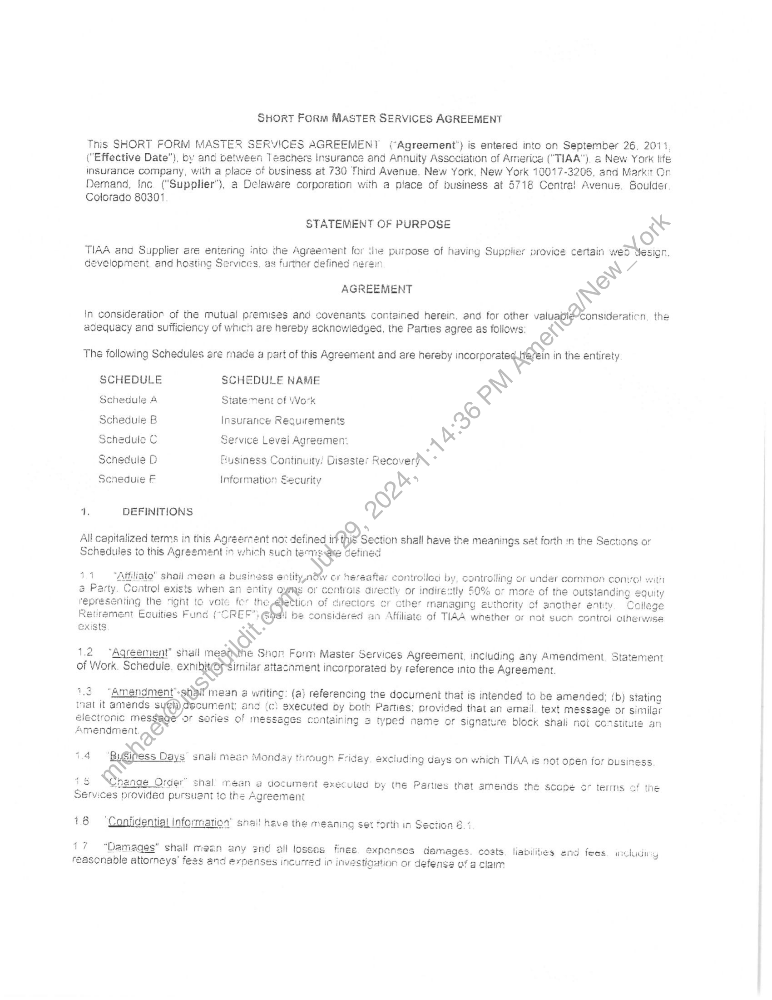
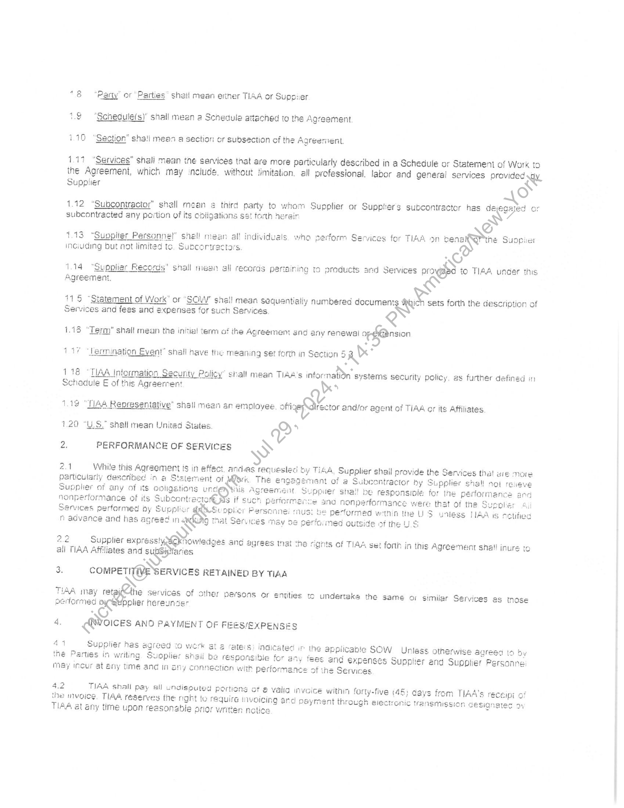
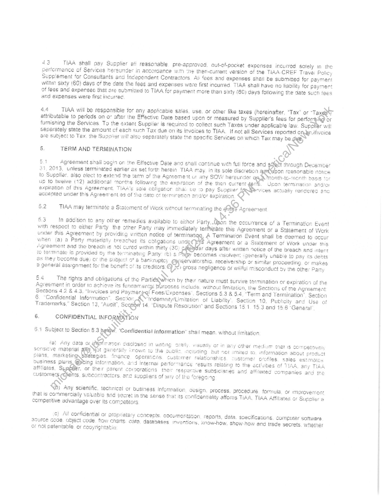
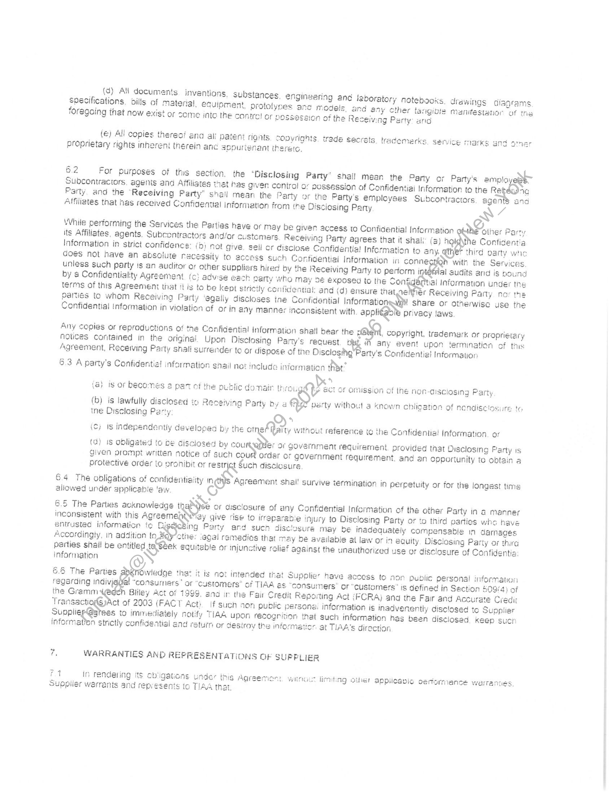
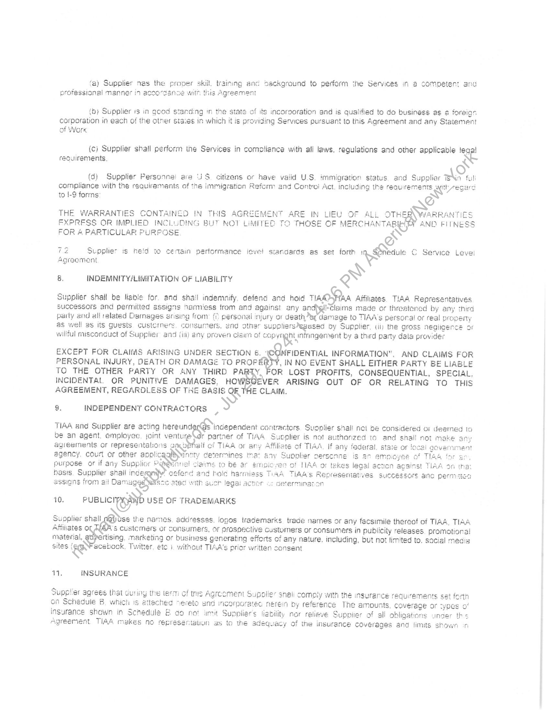
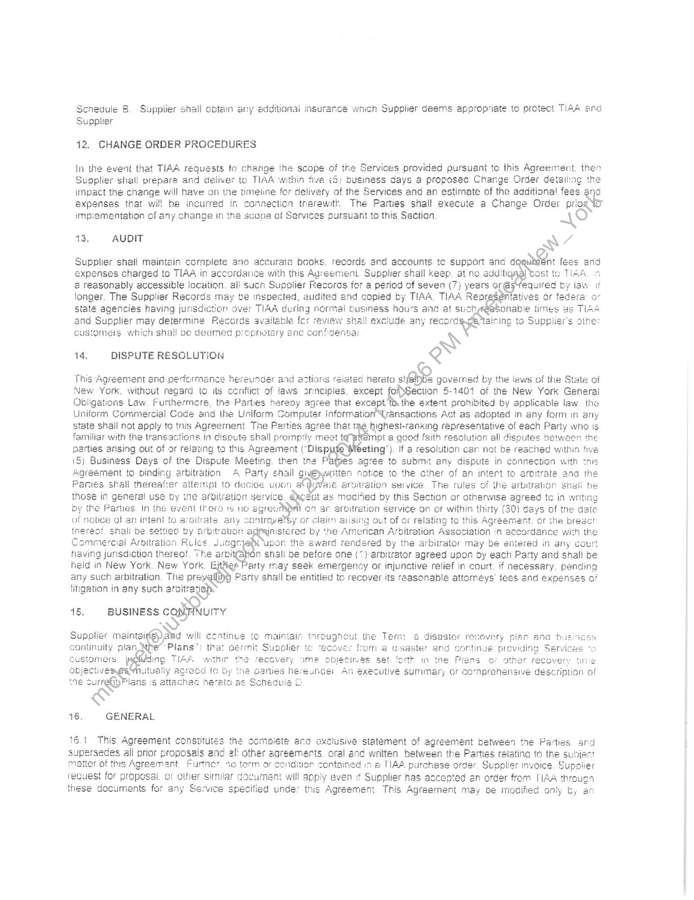
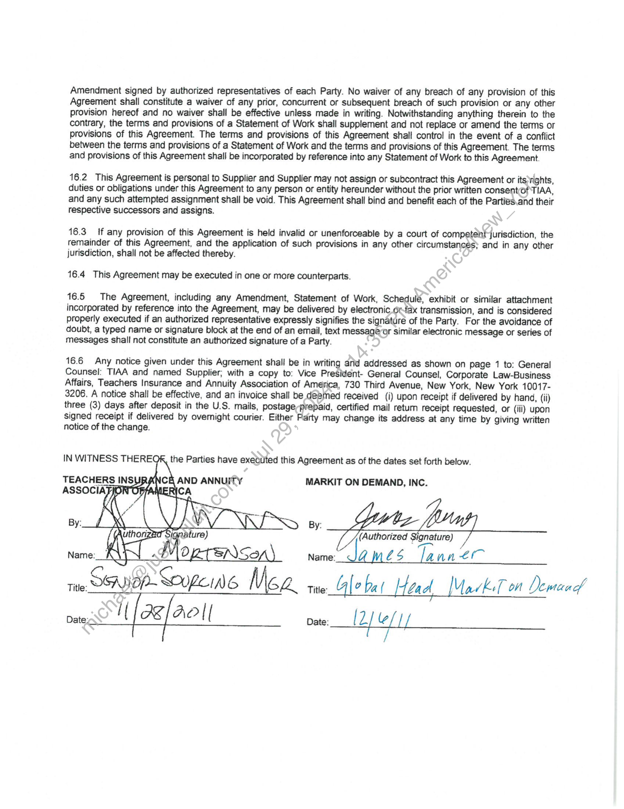
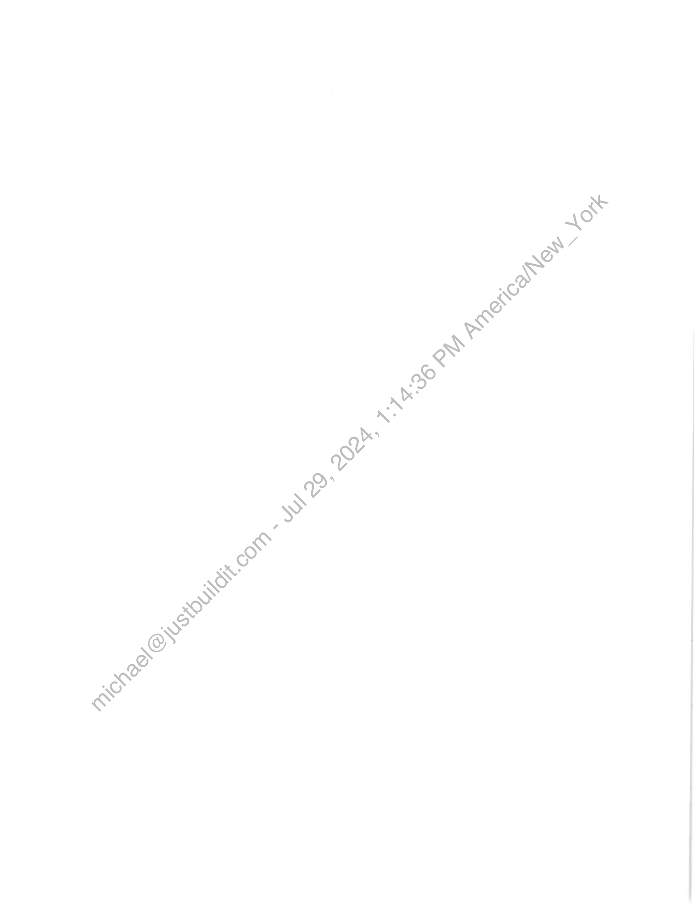

##### SHORT FORM MASTER SERVICES AGREEMENT]

  
````col
```col-md
flexGrow=.5
===
> [!info] [Page 1](_attachments/images_TIAA-3.6.1.13.220110926MSAFullySigned.pdf_212823/page_1.png)
> 
```  
```col-md
SHORT Form MASTER SERVICES AGREEMENT  
This SHORT FORM MASTER SERVICES AGREEMENT (Agreement'’) is entered into on September 26, 2011,
("Effective Date"), by and between Teachers Insurance and Annuity Association of America ("TIAA"), @ New York life
insurance company, with a place of business et 730 Third Avenue. New York, New York 10017-3206, and Markit On
Demand, Inc ("Supplier"), a Delaware corporation with a piace of business at 5718 Centra! Avenus. Boulder.  
Colorado 80301
STATEMENT OF PURPOSE RS  
TIAA and Supplier are entering into the Agreement for the purpose of having Supplier provice certain wed Nesign.  
development. and hosting Services, as further defined nere:
AGREEMENT w  
In consideration of the mutual premises and covenanis contained herein. and for other valuagleonsideration the
adequacy ana sufficiency of which are hereby acknowledged, the Parties agree as follows: ES  
The following Schedules are rade a part of this Agreement and ere hereby corrraeg ih in the entirety  
SCHEDULE SCHEDULE NAME ~)
Schedule A Statement of Work Q  
Schedule B Insurance Requirements &
NX  
Schedule C Service Level Agreemen:
Schedule D Ruginess Continuny; Disaster Recoverd\ *
Seneduie F Information Security Y  
TV. DEFINITIONS Vv  
All capitalized terms in this Agréernent noz defined wasn shall have the meanings set forth in the Sections or
Schedules to this Agreement in which such ter Gefined  
44 Affiliate" shail mean a busi
a y. Control exists when an er
repr niing the right to voie fer th
Retirement Eauities Fund (*CREE”  
exists “Ke  
Rey
1.2 “Agreement” shail mei & Shon Form Master Services Agreemeni, including any Amendment, Staternent
of Work. Schedule. exni Similar attacnment incorporated by reference into the Agreement.  
1.2 “Amendment” age inese a writing: (@} referencing the document that is intended to be amended; {b) stating
sxecuied oy both Parties; provided that an email. text message or similar  
inal it amends sate cument and
electronic mes: or series of mes taining 2 typed name or signature block shall not constitute an  
Amendment eo  
1.4 ‘ByOhess Da
w  
1s GQrenae Order” shal’ mean a document executed by tne Parties that amends the scope o- terms of the  
Services provided pursuant to the Agreement  
ath or ini “tly 508% or more of the outstanding ¢ equity
ather managing authority cf another entity. College
Affiliate of TIAA whether or not sucn control otherwise  
Hl be considered <  
segces  
snali meen Monday through Fridey excluding days on which TIAA is not open for ousiness  
1.6 “Confidential Information’ snai! have the meaning sex forth in Section 6.4  
17 “Damages” shall meen any snd all losses fines expanses damages. costs. liabilities and fees. aicludit y  
reasonable attorneys’ fess and expenses incurred in investigation or defense of a claim  
```
````
Notes:    
````col
```col-md
flexGrow=.5
===
> [!info] [Page 2](_attachments/images_TIAA-3.6.1.13.220110926MSAFullySigned.pdf_212823/page_2.png)
> 
```  
```col-md
“8 “Party” or * Parties” shall mean either TIAA or Suppier
1.9 “Schedulefs)" shail mean a Schedule attached to the Agreement
110 “Sesgtion” sha!i mean a section or subsection cf the Agreement.  
1.17 “Services” snali mean tne services that are more particularly described in a Schedule or Statement of Work to
ine Agreement, which may include. without fimitation. all professional. labor and generai services provided qv
Supplier e)
1.12 “Subcontractor” shall mean 4 third party to whorn Supplier or Suppliers subcontractor nas dé: caged or
subcontracted any portion of its obligations sst torth herein NY  
1.13 “Supplier Personne!” shel! mean al! individuals. who perform Services for TIAA on ber he Suopier
inciuding but not lirnited ts. Supcertractars. Ci  
1.14 “Supplier Records" shall niear all records pertaining to products and Services pre pase to TIAA under this  
Agreement.  
115 “Statement of Work" or “SOCW" shal! mean sequentially numbered documer sets forth the description of  
Services and fees and expenses for such Services.  
1.15 “Term” shall mean the initial term of the Agreement end any renewal op fasion  
:
11% ‘Lermination Event” shall have the meaning set forth in Section 5a  
118 “TIAA Intermation Security Policy” shall mean TIAA's information systems security policy. as further defined in
Schedule E of this Agreerrent  
1.20 “U.S.” shall mean United States. ¥ 4
2) PERFORMANCE OF SERVICES >
21 While this Agreement is in effect. ands requested by TISA, Supplier shail provide the Services thal ere more  
YS  
t of a Subcontractor by Supplier shall  
puler shai! be responsiote: for the performa  
Oo nonperformance were that of the Surpl Mi  
oper Par i © performed within the US unless HAA is sctfied
Thal Services may se perfaimed outside of the US  
NOt reeve  
nd  
particularly described in a Statement of Mork. The en
Supplier of any of its ooligations ws)
nonpertormance of its Subcontracts S  
Services performed by Sup aR
n advance and has agreed Na 9  
if such p  
2.2 Supplier express! oknowledges ang agrees tnat che rights of TIAA set forth in this Agreement shal! inurs to
all TIAA Affiliates and subGigYaries  
3. COMPETITIVE BERVICES RETAINED BY TIAA  
TIAA may retafCtie services of sther persons or emities to undertake the same or similar Services as tnose
performed OCs plier hereunser
4. voices AND PAYMENT OF FIEES/EXPENSES  
the appiicable SOW Unless otherwise agreed to by
es and expenses Supplier and Supplier Personne
of the Services  
44 Supplier has agreed :o werk at a raters
the Parties in writing Suoplier shaii be responsible for a  
may incur at eny time and in any connection with performe  
4.2 TIAA shall pay all undisputed portions ot & valia invoice within forty-five (48; days from TIAA's TECEIpi of
the invoice, TIAA reserves the nght to require invoicing ard payment through electronic transmission designated oy
TIAA at any time upon reasonable prior written notice -  
```
````
Notes:    
````col
```col-md
flexGrow=.5
===
> [!info] [Page 3](_attachments/images_TIAA-3.6.1.13.220110926MSAFullySigned.pdf_212823/page_3.png)
> 
```  
```col-md
43 TIAA shall pay Supplier 2! reasonable pre-approved, out-of-pocket expenses incurred solely in the
performance of Services nersunder in accordance w.th “ne then-current version of the TIAA-CREF Travei Policy
Supplement for Consultants and independent Contractors Ali fees and expenses shatl be submitted for payment
within sixty !60) days of the date the fees and expenises were first incurred TIAA shall have no lability for payment
of fees and expenses thet ere submitted to TIAA for payment more than sixty (60) days following the date such tees
and expenses were first incurrec  
4.4 TIAA will be responsible for any applicabie sales, use, or other like taxes (hereinafter, *Tax" or “Taxes
attributable to periods on o: after ihe Effective Rate based upon or measured by Supplier's fees for mn or
furnishing the Services. To the extent Supplier is required to colleet such Taxes under applicable flaw. Supoliér wil!
separately state the amount cf each such Tax due on its invoices to TIAA. If not all Services reported on&nifvoice
ar€é subject to Tex. the Sugpiier wil! also separately state the specific Services on which Tax may be “By  
5: TERM AND TERMINATION ~
©  
ae through December
pon reasonable no
Month-to-rnontt
Jron termination and/or
ces actually rend  
5.1 Agreement shall oegin on the Efisctive Dale and shall continue with ‘ull force and 94
21, 2013, unless terminated earlier as s: ‘herein TIAA may. in its sole discretion
to Supplier. also elect to extead the term of the Agreement ur any SOW! hereunder
Up to tweive (12) additional norths following the ation of the then current
expiration of this Agreement. TIAA's sole 10 pay Suppiier
accepted under this Agreement as of tie of  
52 TIAA may terminate 2 Statement of Work without terminating the nye Agreement
:  
3 In addition ta any ather remedies available to siher Part n the occurrence of a Termination Event
with respect to either Party the other Party may immediately terfinate this Agreement or a Statement of Work
under this Agreement by provid ten notice of terminatiqg, A Termination Event shall be deemed to occur
when (a) a Party materiaily breaches its cbdligations un iS Agreement or a Statement of Work under this
Agreement and the breacti is 10% cured within thirty (3C sr days after written notice of the breach and intent
to terminate is provided py the inating Party: rb} & ” DEcomes insolven: \genéraily unable to pay its dents
as they become due) or the sidy & bankruptcy igervatorship. receivership or similar proceeding, or makes
2 general ass:gnment for the bene its Creditors Oo gross negligence or willful misconduct dy the other Party  
64 The rights and obtigations of the Parties hen by their nature must survive termination or expiration of the
Agreement in order to achieve its funaamental Sure includs. without limitation, the Sections of the Agreement
Sections 4.2 & 4.3. “Invoices and Paymer, ‘Expenses . Sections 5.3 & 5.4, “Term and Termination’ Section
6 “Confidential Information". Sectior: “indemnity/Limitetion of Liability’. Section 10, Publicity anc Use of
Trademarks,” Section 13, “Audit”, Sega 14 ‘Dispute Resolution" and Sections 15.1 15.3 and 14.6 "General  
Rw
6. CONFIDENTIAL. INFORMATION
\
8.1 Subject to Section 5 3 bey Confidential {nformation” shail mean. without limitation  
Closed in wri wisuaily or ir  
@  
fa) Any data or ay  
sensitive matsrial ey gz rOWwN to iuding but
operatic ralatio  
plans, opens Oe tegies
ousingss plans, @jiting in  
éeffiliates, Su ror ther
customers ccNents, sube:
S)  
ation, avd interna: pedormance -esuits rela
ent conmorations th @ subsicis
Mors. ANG supphers of sin, egcing  
1eS and atfiltated companies and the  
IGN. process. procedure formula. or improvement  
¥ Any scientific, technical or business information. de
dentiality affores TIAA. TIAA Affiliates or Supolier a  
that Is commercially va! and secret in the sense that its co
Competitive advantage over its comsetitars  
c) All confidential or Proprsiary concepts. cocumentation reports, data. soecifications, computer software
SOUIGE Code. Object code flow chens cate. databases inven ons, Know-how, show-how and trade secrets. whether
Or Nol patentable or cosyrightabie  
```
````
Notes:    
````col
```col-md
flexGrow=.5
===
> [!info] [Page 4](_attachments/images_TIAA-3.6.1.13.220110926MSAFullySigned.pdf_212823/page_4.png)
> 
```  
```col-md
7 (a) All documents inventions, substances, engineering and laboratory notebooks, drawings diagrams
specifications. dills of material, ecuipment, orotolyses anc model nd any cther tangible manitestatior ‘of the
foragaing that now exist or seme inte the contre! or pes. 1on of the Receiving Party: and  
(€) Ali copies thereof ana al patent rignts. copyrights. trade secrets. tracemerks Service Marks and otner
proprietary rights inherent therein an ppurisnant iherero.  
6.2 For purposes of this section. the “Disclosing Party’ shail mean the Party or Party’s amplo a
Subcontractors, agents and Affilistes that has given contro! ar possession of Confidentiai Information to the Re i) iG
Party, and the “Receiving Party” shail mean the Party or the Party's empicyees Subcontractors agentS and
Affiliates that nas received Confiaertel Information from the Disciosing Pany RY 7  
2)  
While performing the Services the Parties have or may be given access to Confidential Infermation © Other Party
tts Affiliates, agents, Subcontractors and/or customers. Receiving Party agrees that it shal! (a) hi @ Confidentia
Information in strict confidence: (D} not give. sell er disclose Confidentia! Information to any. ther third party wie
does not have an absolute recessity to access such Confidential Information in connecnon with the Services.
unless such party 1s an auclifor or other suppliers hired by the Receiving Party to perform i al audits and is pound
by & Confidentiality Agreement. (c} advise each: Party who May de exposed to the Conti lal Information under the
terms of this Agreement that fiis to be kept st cily confidential: and (d) ensure that ee Receiving Panty nor the
partes to whom Receiving Party ‘egally discloses tne Confidential Informations iv share or otherwise use the
Confidential information in violation of or in any manner inconsistent with applica} Privacy laws.  
Any copies or reproductions of the Confidential information shall bear the apn copyright, trademark or proprietary
notices coritained in the originai Upon Disclosing Pary's request wn any event upon termination of this
Agreement, Receiving Party snali surrender to or dispose of the Disclosihg arty's Confidential Information  
. *
oration Rt  
@ct of omission of Ihe non-aisclosing Party  
8.3 A party's Confidentie! information snail not include  
(a) is or becomes 2 pant of the public domain thot
(b) is lawfully disclosed io 2 aceiving Party by a &e verty without a known chligation of nendisclosure to
tne Disclosing Party: 5  
(c; Is independently developed by the otr ef Raity without reference to ihe Confidential Information. or  
(d) 1s obligated to be disclosed by cou > * Or government requirement. provided that Disclosing Party is
given prompt written notice of such cour order or government requirement. and an opportunity to obtain a
protective order to pronibit or ns Such disclosure  
6.4 The obligations of confidentiality in Agreement shal! survive termination in perpetuity or for the longest tims
allowed under applicabie ‘aw  
6.5 The Parties acknowledge the SS or aisciosure of any Confidential Information of the other Party in a manner
inconsistent with this Agreem aN fay give rise to irreparabie inury to Disclosing Party or to third parties whe have
entrusted information te Pary and such disclosure May be inadequately compensable in damages
Accordingly, in addition to “agal remedies that may be available at law or in eguity, Disclosing Party of thirg
parties shail be entitled tos ek equitable or injunctive relief against the unauthorized usé or disclosure of Confidentia:
information S  
6.8 The Parties TOwledge that it is met intended that Supplier have access to non public personal informauon
regarding indivjgifat “consumers ’ or “customers” of TIAA @s “consumers’ or “customers” is defined in Saction 09/4) of
the Gramm h Bliley Act of 1999. and ir the Fait Credit Reporting Act {FCRA) and the Fair and Accurate Credit
TransactiogSyAct of 2003 (FACT Acti. If Such non public persona: information is inadvenently disclosed to Supplier
Super ees to immediately notify TIAA upon recognition that such information has been disclosed, keep such
information strictly confidential and rsturn or desiroy the information at TIAA's direction  
is WARRANTIES AND REPRESENTATIONS OF SUPPLIER
74 in rendeting its obligations under this Agreement wing limiting other appileavic oerformance warre  
Supplier warrants and represents to TIAA that.  
```
````
Notes:    
````col
```col-md
flexGrow=.5
===
> [!info] [Page 5](_attachments/images_TIAA-3.6.1.13.220110926MSAFullySigned.pdf_212823/page_5.png)
> 
```  
```col-md
fa) Supplier nas the proper skill. training and oackground to perform the Services in a competent ang
professional MENnEr 11 acco*tance MIh us Agreement  
(b} Supplier 1s in gcod standing 'n the state of its incorooration and is qualified to do business as a foreign
corporation in each of the otner staces in which it is providing Senuces pursuant to this Agreement and any Statemen!
of Work  
(c) Supplier shall perform the Services in compliance with all laws, regulations and other applicable !eqal
requirements, oO  
(4) Supplier Personne! are JS. citizens or have valid U.S. immigration status and Supplier ws full
compliance with the requiremerits of the immigration Referm and Contre Act, including the requirements ithsegarc
to I-9 forms: 2)  
ENT ARE IN LIEU OF ALL OTHER VARRANTIES
Y AND FITNESS  
THE WARRANTIES CONTAINED IN THIS AGRE
FXPRESS OR IMPLIED INCLUDING BUT NOT LIMITED TO THOSE OF MERCHANTABIE  
FOR & PARTICULAR PURPOSE es  
ie Supplier is held to certain pertormance ievel standards as set forth : Snedule C Service Level
Agreement  
8. INDEMNITY/LIMITATION OF LIABILITY Q .  
Supplier shall be liable for. and shail indemnify, defend and hoid TIAA MAA Affiliates. TIAA Representatives
successors and permitted assigns Narmiess from and against any and)gli*Claims made or threatened by any third
paily and all related Damages a from: fi: personal injury o death er damage to TIAA's persoral or real propery
as well as its guests Customers. consumers, end othsr suppliers*eaused oy Supplier, (il) the gross negligence or
willful misconduct of Supplier and (ii) eny proven claim of c pp yngR nmngement by a third party data provider  
EXCEPT FOR CLAIMS ARISING UNDER SECTION 6. ° FIDENTIAL INFORMATION”, AND CLAIMS FOR
PERSONAL INJURY, DEATH OR DAMAGE TO PROP , IN NO EVENT SHALL EITHER PARTY BE LIABLE  
INCIDENTAL OR PUNITIVE DAMAGES, HO EVER ARISING OUT OF OR RELATING TO THIS  
TO THE OTHER PARTY OR ANY THIRD oWSbE OR LOST PROFITS, CONSEQUENTIAL, SPECIAL.
AGREEMENT, REGARDLESS OF THE BASIS — CLAIM.  
9. INDEPENDENT CONTRACTORS > S  
TIAA and Supplier are acting hereunder i
be an agent. employee, joint veniu Ir  
agreements or representations SK
agency. court or other apolic \
purpese or if any Supplier PS
basis. Supplier shail inde
assians from aii D: such legal 2  
10. ruavieregaNb USE OF TRADEMARKS  
Dise the names, addresses. logos trademarks trade names or any facsimile thereof of TIAA, TIAA  
te of TIAA. If any federal, stare
upolier oersonne is an  
fot determinanon  
Supplier shalt
Affiliates o § customers or consumers, OF prospective Customers or consumers in publicity releases. promotional
material, ttising, marketing or business generating efforts of any nature. including, but not limited to. sacial meaia  
written Sonsent  
acebook. Twitter, ete i, without TIAA's prior  
sites iS  
Ms INSURANCE  
with thé insurance requirements set forth
ence The amounts, coverage or tyocs 0”
é Suppiier of all obligations unaer ths
acy Of the insurance coverages and limits shown on  
Supplier agrees that during the term of tms Agrcement Supolies snali com
on Schedule B. which is attached ~ereto and incorporated: nere:
insurance shown in Schedule & do not mit Suppiier's
Agreement. TIAA makes no representation as to the adequ  
```
````
Notes:    
````col
```col-md
flexGrow=.5
===
> [!info] [Page 6](_attachments/images_TIAA-3.6.1.13.220110926MSAFullySigned.pdf_212823/page_6.png)
> 
```  
```col-md
Schedule B. Supplier shall obtain any additional msurance which Suppiier deems appropriate to protect TIAA ard
Supplier  
12. CHANGE ORDER PROCEDURES  
In the event that TIAA requests to change ihe scope of the Services provided pursuant to this Agreement. ther
Supplier shall prepare and deliver to TIAA within five (&: business days a proposec Change Order detailing the
impact the change will have on the timetine for delivery of the Services and an estirnate of the additional fees and
expenses that wil! be incurred in connection therewith The Parties shall execute a Change Order prion
impigmentation of any change in the scone of Services pursuant to this Section. \'  
43) AUDIT RY 7  
nt fees and  
Supplier shall maintain cornplete ano accurate books, records and accounts tc support anc d  
expenses charged to TIAA in accordance with this Agreermeni. Supplier shall keep, at no additigga) vost to TIAA  
@ reasonably accessible location. all sucn Supplier Records for a period of seven (7) years or @svfequired by law it
longer. The Supplier Records may be inspected, audited and copied by TIAA. TIAA Reor, ‘atives or federa o
State agencies having jurisdiction over TIAA during normal business hours ana at such s TIAA
and Supplier may determine Records available fer review $ exclude any record otner
customers which shal! be deemed propnietery ne co *  
Sonabie umes
airing to Suppl  
14, DISPUTE RESOLUTION  
This Agreement and performance hereunder and actions reiated nereto siiai)be governed by the lews of the State of
New York. without regard to its conflict of laws onnciples. except jo Section 5-1401 of the New York General
Obligations Law. Furthermore, the Parties hereny agree that except Td the extent prohibited by applicable law. the
Uniform Commercial Code and the Uniform Computer information transactions Act as adopted in any form in any
state shail not apply to this Agreement. The Parties agree that tae highest-ranking representative of each Party wno is  
familiar with the transactions in cispute shall promptly meet t pt a good faith resolution all disputes between the
parties arising out of or relaing to this Agreement (“Disp! eting’). If a resolution can not bé reached within five  
(S) Business Days of tne Dispute Meeting. then the P’ S agree to submit any dispute in connection with cnis
Agreement to binding arbitration A Party shail gi mcitten notice to the other of an intent to arbitrate and the
Parties shall thereafter atlempi to deciag upon on) = aroitration service. The rules of the arbitration shell be
those in general use by ine arbitration service mocitied by this Section or othenvise agreed te in wri
by the Parties In the event there 1s no agr ation service on or within thirty (30) days of tne
of nolice of an intent to aroitrate any controyersy or g out of or relating to this Agreement. or the breact
nistered by the American Arbitration Association in accordance with the
s‘upon the eward rendered by the arbitrator may be entered in any court
having jurisdiction thereof. | n shall be before one {*} arbitrator agreed upon oy each Party and shall be
held in New York. New York ep Party may seek emergency or injunctive relief in court, if necessary. pending
any such arbitration. The prevell Party shall be entitled to recover its reasonable attorneys’ fees and expenses of
litigation in any such arbitratishs  
415. BUSINESS castury  
nut the Term a disaster recovery plan and b
fom aa ter and 5  
Supplier maintai Sad will continue to mainiair tarou
continuity plan it Suoplier te
customers ip g Tl recovery um
eblectve eS utually agrecd to by ihe panies hereunder  
1
ine surrey lans '$ attached hereto as Schedule &  
16. GENERAL  
ntinus previding §$
Ss set “orth in the Plans. or other re voume
An executive summery or comprehensive description of  
16.1 This Agreement constitutes the comoiete and exclusive statement of agreement between tne Parties. ard
supersedes all prior proposals and al! other aqrsemerts. oral and written between the Parties reiating to the subject
matier of this Agreement. Further, xo term or conditor centaimed in a TIAA purchase order Supplier invoice. Supptier
reguest for proposal. or other similar cocument will apply even :f Supplier has accepted an order from TIAA throug
these documents for any Service specified under this Agreement. This Agreement may be modified only by an  
```
````
Notes:    
````col
```col-md
flexGrow=.5
===
> [!info] [Page 7](_attachments/images_TIAA-3.6.1.13.220110926MSAFullySigned.pdf_212823/page_7.png)
> 
```  
```col-md
Amendment signed by authorized representatives of each Party. No waiver of any breach of any provision of this
Agreement shall constitute a waiver of any prior, concurrent or subsequent breach of such provision or any other
provision hereof and no waiver shall be effective unless made in writing. Notwithstanding anything therein to the
contrary, the terms and provisions of a Statement of Work shall supplement and not replace or amend the terms or
provisions of this Agreement. The terms and provisions of this Agreement shall control in the event of a conflict
between the terms and provisions of a Statement of Work and the terms and provisions of this Agreement. The terms
and provisions of this Agreement shall be incorporated by reference into any Statement of Work to this Agreement  
16.2 This Agreement is personal to Supplier and Supplier may not assign or subcontract this Agreement or its rights,
duties or obligations under this Agreement to any person or entity hereunder without the prior written consentof TIAA,
and any such attempted assignment shall be void. This Agreement shall bind and benefit each of the Parties.and their  
respective successors and assigns.  
16.3 If any provision of this Agreement is held invalid or unenforceable by a court of competent jurisdiction, the
remainder of this Agreement, and the application of such provisions in any other circumstances) and in any other
jurisdiction, shall not be affected thereby.  
16.4 This Agreement may be executed in one or more counterparts.  
16.5 The Agreement, including any Amendment, Statement of Work, Schedulé, exhibit or similar attachment
incorporated by reference into the Agreement, may be delivered by electronic or-iax transmission, and is considered
properly executed if an authorized representative expressly signifies the signaturé of the Party. For the avoidance of
doubt, a typed name or signature block at the end of an email, text messag@or similar electronic message or series of
messages shall not constitute an authorized signature of a Party.  
16.6 Any notice given under this Agreement shall be in writing and addressed as shown on page 1 to: General
Counsel: TIAA and named Supplier; with a copy to: Vice President- General Counsel, Corporate Law-Business
Affairs, Teachers Insurance and Annuity Association of America, 730 Third Avenue, New York, New York 100173206. A notice shall be effective, and an invoice shall be deemed received (i) upon receipt if delivered by hand, (ii)
three (3) days after deposit in the U.S. mails, postage-prebaid, certified mail retum receipt requested, or (iii) upon
signed receipt if delivered by overnight courier. Either Party may change its address at any time by giving written
notice of the change.  
MARKIT ON DEMAND, INC.  
By:  
(Authorized § ignature)
Title: Title: Ale bat _[4ead, MarkiTon De kif on Dem aadf
Date: i Cg AO || Date: Zp eff  
```
````
Notes:    
````col
```col-md
flexGrow=.5
===
> [!info] [Page 8](_attachments/images_TIAA-3.6.1.13.220110926MSAFullySigned.pdf_212823/page_8.png)
> 
```  
```col-md  
```
````
Notes:  


![[_attachments/TIAA-3.6.1.13.2 20110926 MSA Fully Signed.pdf]