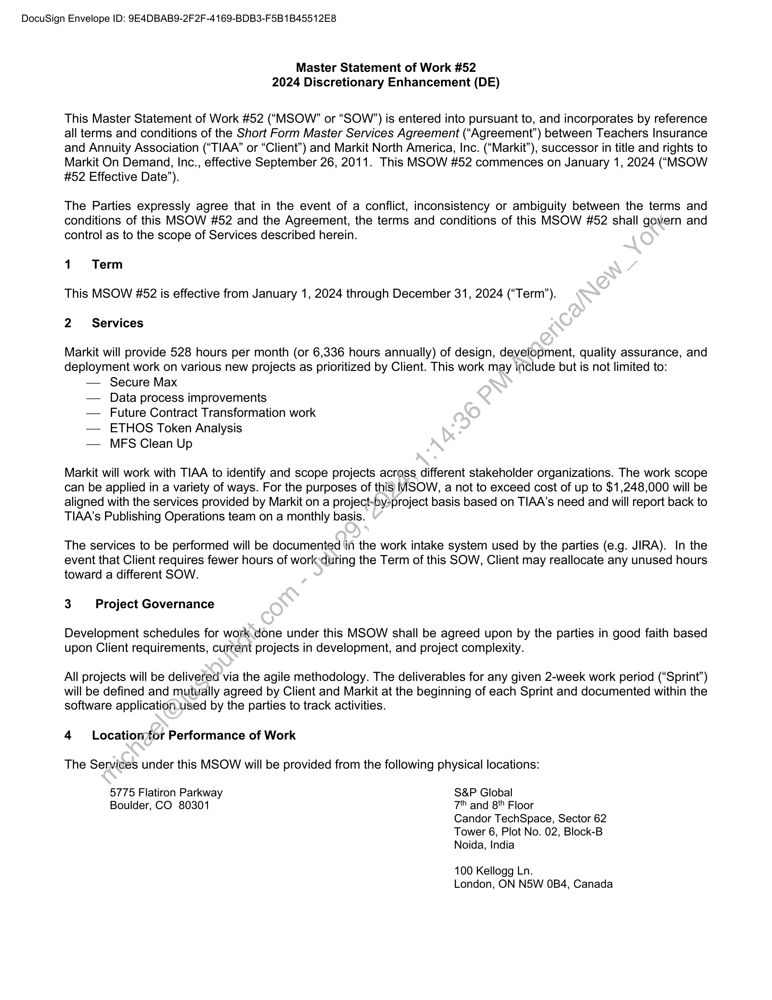
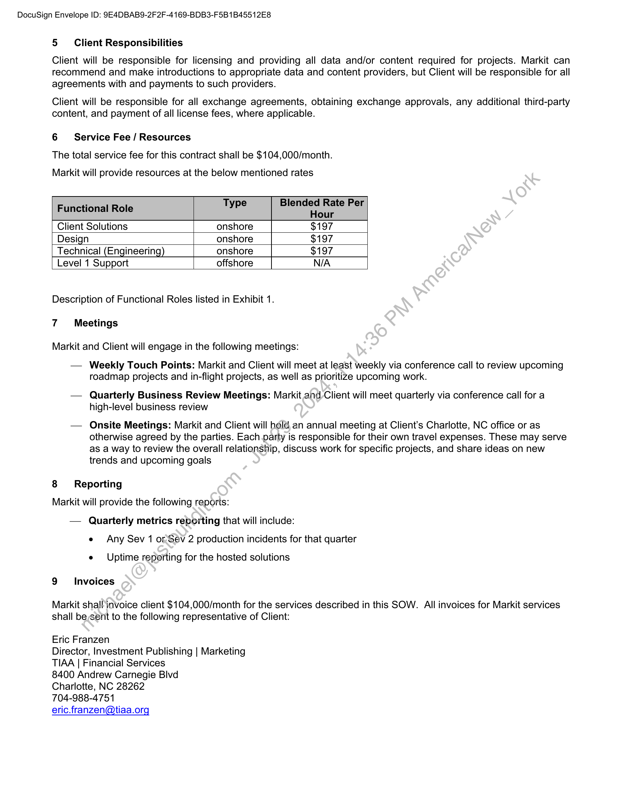
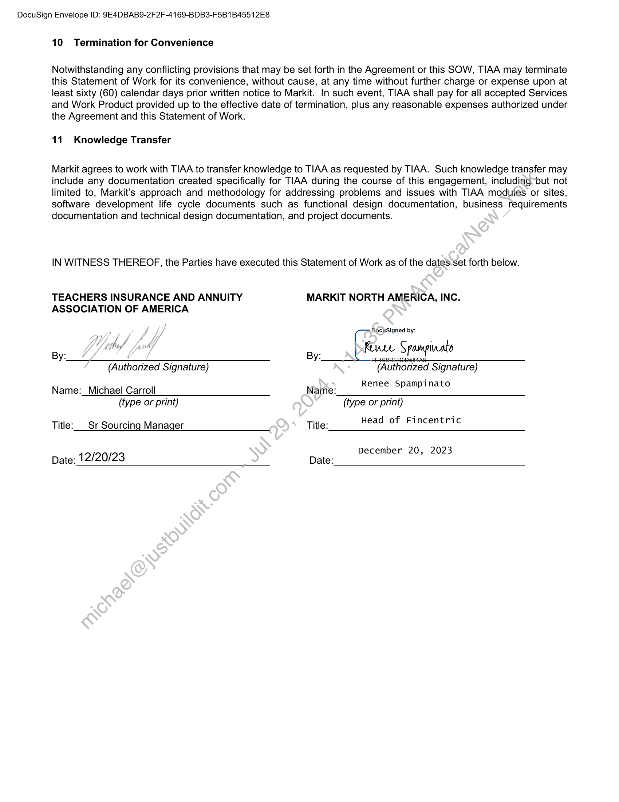
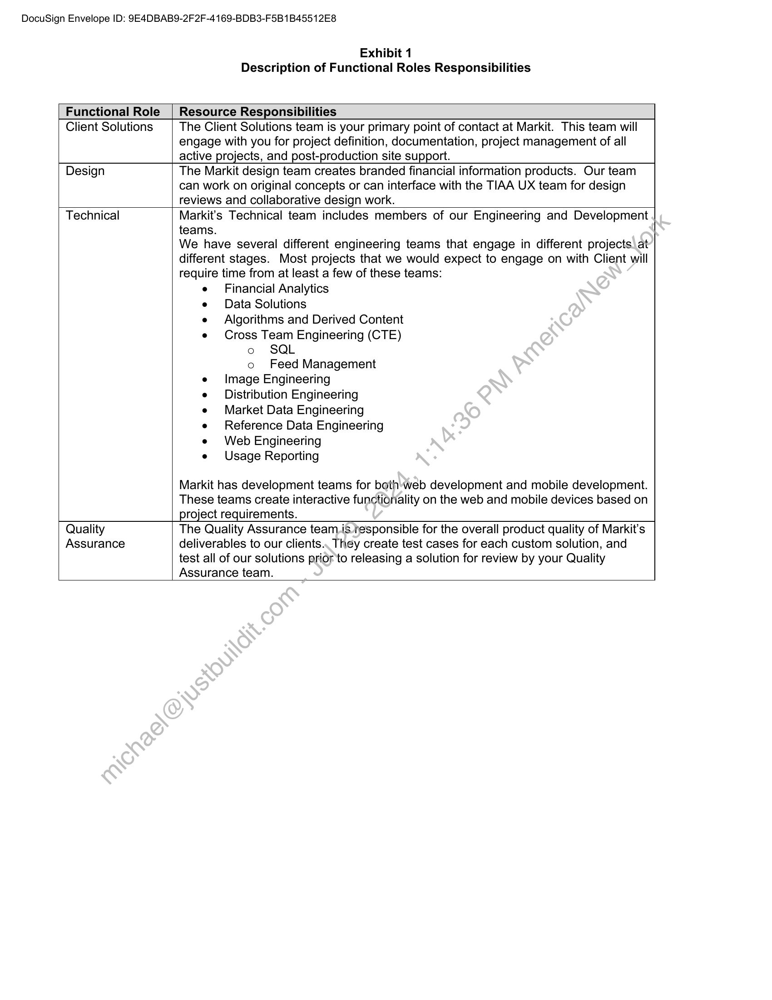

##### Master Statement of Work #52 - 2024 Discretionary Enhancement (DE)]

  
````col
```col-md
flexGrow=.5
===
> [!info] [Page 1](_attachments/images_TIAA-3.6.1.13.300157256.pdf_212318/page_1.png)
> 
```  
```col-md
DocuSign Envelope ID: 9E4DBAB9-2F2F-4169-BDB3-F5B1B45512E8  
Master Statement of Work #52
2024 Discretionary Enhancement (DE)  
This Master Statement of Work #52 (“MSOW’” or “SOW’”) is entered into pursuant to, and incorporates by reference
all terms and conditions of the Short Form Master Services Agreement (“Agreement”) between Teachers Insurance
and Annuity Association (“TIAA” or “Client”) and Markit North America, Inc. (“Markit”), successor in title and rights to
Markit On Demand, Inc., effective September 26, 2011. This MSOW #52 commences on January 1, 2024 (“MSOW
#52 Effective Date”).  
The Parties expressly agree that in the event of a conflict, inconsistency or ambiguity between the terms and
conditions of this MSOW #52 and the Agreement, the terms and conditions of this MSOW #52 shall govern and
control as to the scope of Services described herein.  
1 Term
This MSOW #82 is effective from January 1, 2024 through December 31, 2024 (“Term”).
2 ~ Services  
Markit will provide 528 hours per month (or 6,336 hours annually) of design, development, quality assurance, and
deployment work on various new projects as prioritized by Client. This work may include but is not limited to:  
— Secure Max  
— Data process improvements  
— Future Contract Transformation work  
— ETHOS Token Analysis  
— MFS Clean Up  
Markit will work with TIAA to identify and scope projects across different stakeholder organizations. The work scope
can be applied in a variety of ways. For the purposes of this IMSOW, a not to exceed cost of up to $1,248,000 will be
aligned with the services provided by Markit on a project-by2project basis based on TIAA’s need and will report back to
TIAA’s Publishing Operations team on a monthly basis.  
The services to be performed will be documented in the work intake system used by the parties (e.g. JIRA). In the
event that Client requires fewer hours of work:during the Term of this SOW, Client may reallocate any unused hours
toward a different SOW.  
3 Project Governance  
Development schedules for work.done under this MSOW shall be agreed upon by the parties in good faith based
upon Client requirements, current projects in development, and project complexity.  
All projects will be delivered via the agile methodology. The deliverables for any given 2-week work period (“Sprint”)
will be defined and mutually agreed by Client and Markit at the beginning of each Sprint and documented within the
software application.used by the parties to track activities.  
4  Locationfor Performance of Work
The Services under this MSOW will be provided from the following physical locations:  
5775 Flatiron Parkway S&P Global  
Boulder, CO 80301 7 and 8'" Floor
Candor TechSpace, Sector 62
Tower 6, Plot No. 02, Block-B
Noida, India  
100 Kellogg Ln.
London, ON N5W 0B4, Canada  
```
````
Notes:    
````col
```col-md
flexGrow=.5
===
> [!info] [Page 2](_attachments/images_TIAA-3.6.1.13.300157256.pdf_212318/page_2.png)
> 
```  
```col-md
DocuSign Envelope ID: 9E4DBAB9-2F2F-4169-BDB3-F5B1B45512E8  
5 Client Responsibilities  
Client will be responsible for licensing and providing all data and/or content required for projects. Markit can
recommend and make introductions to appropriate data and content providers, but Client will be responsible for all
agreements with and payments to such providers.  
Client will be responsible for all exchange agreements, obtaining exchange approvals, any additional third-party
content, and payment of all license fees, where applicable.  
6 Service Fee / Resources  
The total service fee for this contract shall be $104,000/month.  
Markit will provide resources at the below mentioned rates  
. Type Blended Rate Per
Functional Role Hour
Client Solutions onshore $197
Design onshore $197
Technical (Engineering) onshore $197
Level 1 Support offshore N/A  
Description of Functional Roles listed in Exhibit 1.
7 Meetings  
Markit and Client will engage in the following meetings:  
— Weekly Touch Points: Markit and Client will meet at least weekly via conference call to review upcoming
roadmap projects and in-flight projects, as well as prioritize upcoming work.  
— Quarterly Business Review Meetings: Markit and Client will meet quarterly via conference call for a
high-level business review  
— Onsite Meetings: Markit and Client will hold, an annual meeting at Client's Charlotte, NC office or as
otherwise agreed by the parties. Each party is responsible for their own travel expenses. These may serve
as a way to review the overall relationship, discuss work for specific projects, and share ideas on new
trends and upcoming goals  
8 Reporting
Markit will provide the following reports:
— Quarterly metrics reporting that will include:
e Any Sev 1 or Sev 2 production incidents for that quarter  
e Uptime reporting for the hosted solutions
9 Invoices  
Markit shall invoice client $104,000/month for the services described in this SOW. All invoices for Markit services
shall be;sent to the following representative of Client:  
Eric Franzen  
Director, Investment Publishing | Marketing
TIAA | Financial Services  
8400 Andrew Carnegie Blvd  
Charlotte, NC 28262  
704-988-4751  
eric.franzen@tiaa.org  
```
````
Notes:    
````col
```col-md
flexGrow=.5
===
> [!info] [Page 3](_attachments/images_TIAA-3.6.1.13.300157256.pdf_212318/page_3.png)
> 
```  
```col-md
DocuSign Envelope ID: 9E4DBAB9-2F 2F-4169-BDB3-F5B1B45512E8
10 Termination for Convenience  
Notwithstanding any conflicting provisions that may be set forth in the Agreement or this SOW, TIAA may terminate
this Statement of Work for its convenience, without cause, at any time without further charge or expense upon at
least sixty (60) calendar days prior written notice to Markit. In such event, TIAA shall pay for all accepted Services
and Work Product provided up to the effective date of termination, plus any reasonable expenses authorized under
the Agreement and this Statement of Work.  
11. Knowledge Transfer  
Markit agrees to work with TIAA to transfer knowledge to TIAA as requested by TIAA. Such knowledge transfer may
include any documentation created specifically for TIAA during the course of this engagement, including-but not
limited to, Markit’s approach and methodology for addressing problems and issues with TIAA modules or sites,
software development life cycle documents such as functional design documentation, business requirements
documentation and technical design documentation, and project documents.  
IN WITNESS THEREOF, the Parties have executed this Statement of Work as of the dates-set forth below.  
TEACHERS INSURANCE AND ANNUITY MARKIT NORTH AMERICA, INC.
ASSOCIATION OF AMERICA  
DécuSigned by:  
VY eth, fad Reve Spampinato  
By: 7/7 U By: panssans
uthorized Signature, uthorized Signature,
Authorized Signat ‘Authorized Signat
R S inat
Name:_Michael Carroll Naine: enee Spampinato
(type or print) (type or print)
Title:___ Sr Sourcing Manager Title: Head of Fincentric  
Date: 12/20/23 Date: December 20, 2023  
```
````
Notes:    
````col
```col-md
flexGrow=.5
===
> [!info] [Page 4](_attachments/images_TIAA-3.6.1.13.300157256.pdf_212318/page_4.png)
> 
```  
```col-md
DocuSign Envelope ID: 9E4DBAB9-2F2F-4169-BDB3-F5B1B45512E8  
Exhibit 1
Description of Functional Roles Responsibilities  
Functional Role _| Resource Responsibilities  
Client Solutions The Client Solutions team is your primary point of contact at Markit. This team will
engage with you for project definition, documentation, project management of all
active projects, and post-production site support.  
Design The Markit design team creates branded financial information products. Our team
can work on original concepts or can interface with the TIAA UX team for design
reviews and collaborative design work.  
Technical Markit’s Technical team includes members of our Engineering and Development
teams.  
We have several different engineering teams that engage in different projects at
different stages. Most projects that we would expect to engage on with Client will
require time from at least a few of these teams:
e Financial Analytics
e Data Solutions
e Algorithms and Derived Content
e Cross Team Engineering (CTE)
o SQL
o Feed Management
e Image Engineering
e Distribution Engineering
e Market Data Engineering
e Reference Data Engineering
e Web Engineering
e Usage Reporting
Markit has development teams for bothweb development and mobile development.
These teams create interactive functionality on the web and mobile devices based on
project requirements.  
Quality The Quality Assurance team.is.responsible for the overall product quality of Markit’s  
Assurance deliverables to our clients.  
 They create test cases for each custom solution, and
test all of our solutions prior to releasing a solution for review by your Quality
Assurance team.  
```
````
Notes:  


![[_attachments/TIAA-3.6.1.13.3 00157256.pdf]