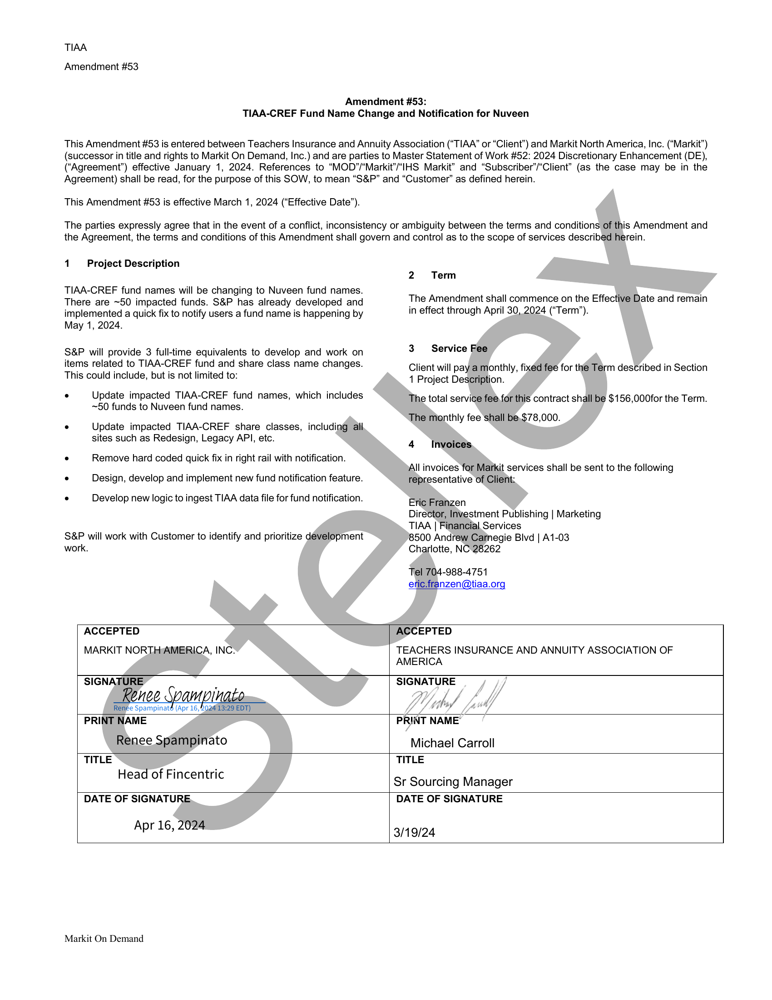

##### Amendment #53: TIAA-CREF Fund Name Change and Notification for Nuveen]

  
````col
```col-md
flexGrow=.5
===
> [!info] [Page 1](_attachments/images_TIAA-3.6.1.13.400255964.pdf_212030/page_1.png)
> 
```  
```col-md
TIAA
Amendment #53  
Amendment #53:
TIAA-CREF Fund Name Change and Notification for Nuveen  
This Amendment #53 is entered between Teachers Insurance and Annuity Association (“TIAA” or “Client”) and Markit North America, Inc. (“Markit”)
(successor in title and rights to Markit On Demand, Inc.) and are parties to Master Statement of Work #52: 2024 Discretionary Enhancement (DE),
(“Agreement”) effective January 1, 2024. References to “MOD’/“Markit’/“IHS Markit” and “Subscriber’/“Client” (as the case may be in the  
Agreement) shall be read, for the purpose of this SOW, to mean “S&P” and “Customer” as defined herein.  
This Amendment #53 is effective March 1, 2024 (“Effective Date”).  
The parties expressly agree that in the event of a conflict, inconsistency or ambiguity between the terms and conditions of this Amendment and  
the Agreement, the terms and conditions of this Amendment shall govern and control as to the scope of services described herein.  
1 Project Description  
TIAA-CREF fund names will be changing to Nuveen fund names.
There are ~50 impacted funds. S&P has already developed and
implemented a quick fix to notify users a fund name is happening by
May 1, 2024.  
S&P will provide 3 full-time equivalents to develop and work on
items related to TIAA-CREF fund and share class name changes.
This could include, but is not limited to:  
. Update impacted TIAA-CREF fund names, which includes
~50 funds to Nuveen fund names.  
. Update impacted TIAA-CREF share classes, including all
sites such as Redesign, Legacy API, etc.  
. Remove hard coded quick fix in right rail with notification.Design, develop and implement new fund notification feature.Develop new logic to ingest TIAA data file for fund notification.  
S&P will work with Customer to identify and prioritize development
work.  
2 Term  
The Amendment shall commence on the Effective Date and remain  
in effect through April 30, 2024 (“Term”).  
3 Service Fee  
Client will pay a monthly, fixed fee for the Term described in Section  
1 Project Description.  
The total service fee.for this contract shall be $156,000for the Term.  
The monthly fee shall be.$78,000.  
4 Invoices,  
All invoices for Markit services shall be sent to the following
representative of Client:  
Eric Franzen  
Director, Investment Publishing | Marketing
TIAA | Financial, Services  
8500 Andrew Carnegie Blvd | A1-03
Charlotte, NC 28262  
Tel 704-988-4751
efic.franzen@tiaa.org  
ACCEPTED
MARKIT NORTHiAMERICA, INC-  
ACCEPTED  
TEACHERS INSURANCE AND ANNUITY ASSOCIATION OF
AMERICA  
Renee Spampinato  
SIGNATURE . SIGNATURE
Renee Spampinato Wi, jy
Renee Spampinaté (Apr 16, 2024993:29 EDT) JA by Z
PRINT NAME PRINT NAME’  
Michael Carroll  
TITLE
Head of Fincentric  
TITLE  
Sr Sourcing Manager  
DATE OF SIGNATURE,  
Apr 16, 2024  
DATE OF SIGNATURE  
3/19/24  
Markit On Demand  
```
````
Notes:  


![[_attachments/TIAA-3.6.1.13.4 00255964.pdf]