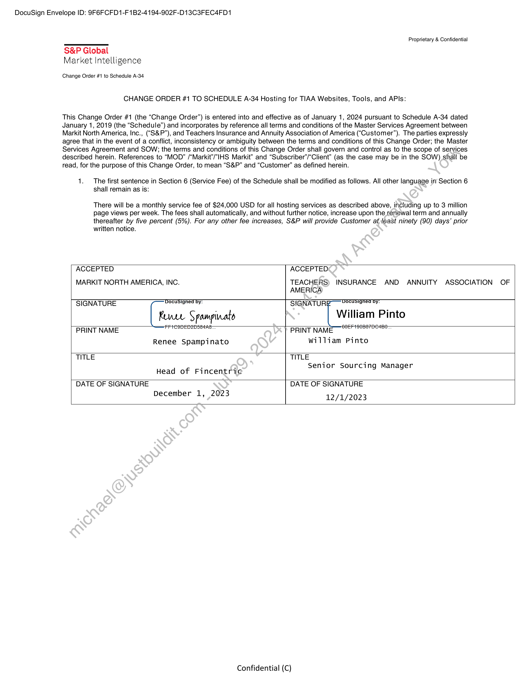

##### Change Order #1 to Schedule A-34 Hosting for TIAA Websites, Tools, and APIs]

  
````col
```col-md
flexGrow=.5
===
> [!info] [Page 1](_attachments/images_TIAA-3.6.1.13.500207650.pdf_210011/page_1.png)
> 
```  
```col-md
DocuSign Envelope ID: 9F6FCFD1-F1B2-4194-902F-D13C3FEC4FD1  
S&P Global
Market Intelligence  
Change Order #1 to Schedule A-34.  
Proprietary & Confidential  
CHANGE ORDER #1 TO SCHEDULE A-34 Hosting for TIAA Websites, Tools, and APIs:  
This Change Order #1 (the “Change Order”) is entered into and effective as of January 1, 2024 pursuant to Schedule A-34 dated
January 1, 2019 (the “Schedule”) and incorporates by reference all terms and conditions of the Master Services Agreement between
Markit North America, Inc., (“S&P”), and Teachers Insurance and Annuity Association of America (“Customer”). The parties expressly
agree that in the event of a conflict, inconsistency or ambiguity between the terms and conditions of this Change Order; the Master
Services Agreement and SOW; the terms and conditions of this Change Order shall govern and control as to the scope of services
described herein. References to “MOD” /“Markit’/"IHS Markit” and “Subscriber’/“Client” (as the case may be in the SOW) shail be
read, for the purpose of this Change Order, to mean “S&P” and “Customer” as defined herein.  
1. The first sentence in Section 6 (Service Fee) of the Schedule shall be modified as follows. All other language in Section 6  
shall remain as is:  
There will be a monthly service fee of $24,000 USD for all hosting services as described above, including up to 3 million
page views per week. The fees shall automatically, and without further notice, increase upon the renewal term and annually
thereafter by five percent (5%). For any other fee increases, S&P will provide Customer atleast ninety (90) days’ prior  
written notice.  
ACCEPTED
MARKIT NORTH AMERICA, INC.  
ACCEPTED  
TEACHERS) INSURANCE AND ANNUITY ASSOCIATION OF
AMERICA  
Renee Spampinato  
SIGNATURE DocuSigned by: SIGNATUR' Docusigned by:
Kure Spompinato William Pinto
PRINT NAME FFTCSDED2B584: PRINT NAME GOEFTSEBS7TDE4BI  
william Pinto  
December 1, 2023  
TITLE TITLE. Senior Sourcing Manager
Head of Fincentric 9 g
DATE OF SIGNATURE DATE OF SIGNATURE  
12/1/2023  
Confidential (C)  
```
````
Notes:    
````col
```col-md
flexGrow=.5
===
> [!info] [Page 2](_attachments/images_TIAA-3.6.1.13.500207650.pdf_210011/page_2.png)
> 
```  
```col-md
DocuSign Envelope ID: 9F6FCFD1-F1B2-4194-902F-D13C3FEC4FD1  
Certificate Of Completion  
Envelope Id: 4C9350DFFD5544509C5CB8DB380F6BD6  
Subject: Complete with DocuSign: CO#1 to Schedule A-34 Hosting.docx
Source Envelope:  
Document Pages: 1 Signatures: 1
Certificate Pages: 1 Initials: 0  
AutoNav: Disabled  
Envelopeld Stamping: Disabled  
Time Zone: (UTC-05:00) Eastern Time (US & Canada)  
Record Tracking  
Status: Original Holder: William Pinto
12/1/2023 10:03:05 AM wpinto @tiaa.org  
Signer Events Signature  
William Pinto DocuSigned by:  
wpinto @tiaa.org William Pinto  
Senior Sourcing Manager SORF 19088700480  
TIAA  
Security Level: Email, Account Authentication  
Electronic Record and Signature Disclosure:
Not Offered via DocuSign  
In Person Signer Events Signature
Editor Delivery Events Status  
Agent Delivery Events Status
Intermediary Delivery Events Status
Certified Delivery Events Status
Carbon Copy Events Status
Witness Events Signature
Notary Events Signature
Envelope Summary Events Status
Envelope Sent Hashed/Encrypted
Certified Delivered Security Checked
Signing Complete Security Checked
Completed Security Checked  
Payment Events Status  
Signature Adoption: Pre-selected Style
(None) Using IP Address: 73.33.20.75  
DocuSign  
Status: Completed  
Envelope Originator:  
William Pinto  
8500 Andrew Carnegie Boulevard
Charlotte, NC 28262  
wpinto @tiaa.org  
IP Address: 73.33.20.75  
Location: DocuSign  
Timestamp  
Sent: 12/4/2023 10:03:35 AM
Viewed12/1/2023 10:03:40 AM
Sigried: 12/1/2023 10:04:04 AM
Freeform Signing  
Timestamp
Timestamp
Timestamp
Timestamp
Timestamp
Timestamp
Timestamp
Timestamp
Timestamps
12/1/2023 10:03:35 AM
12/1/2023 10:03:40 AM  
12/1/2023 10:04:04 AM
12/1/2023 10:04:04 AM  
Timestamps  
```
````
Notes:  


![[_attachments/TIAA-3.6.1.13.5 00207650.pdf]