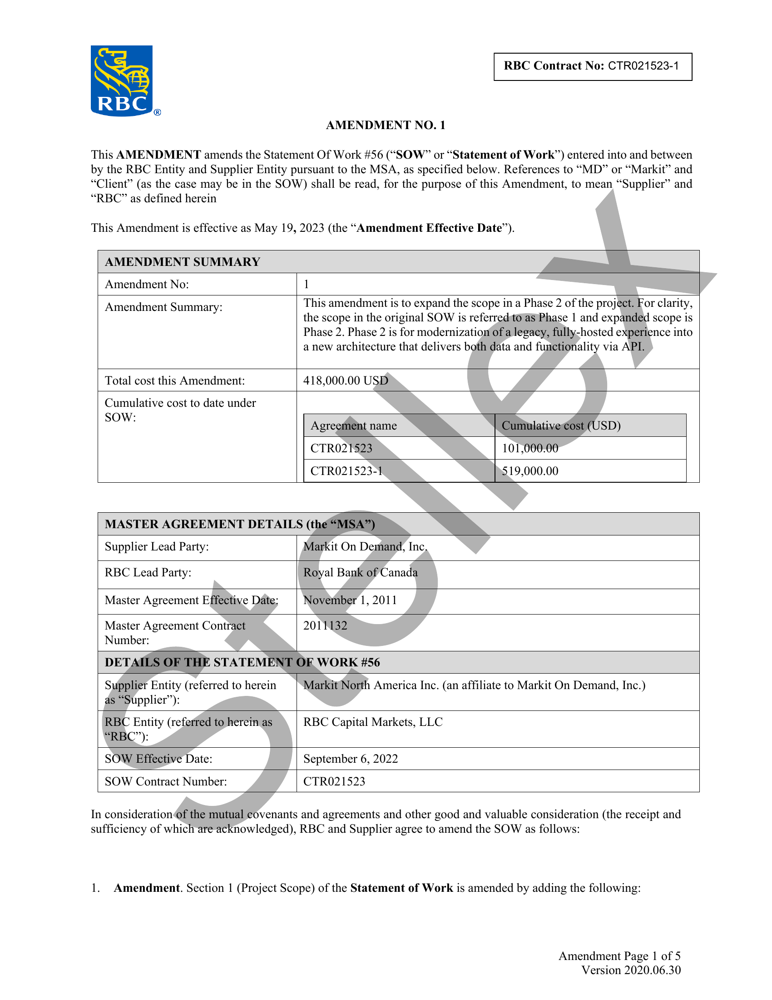
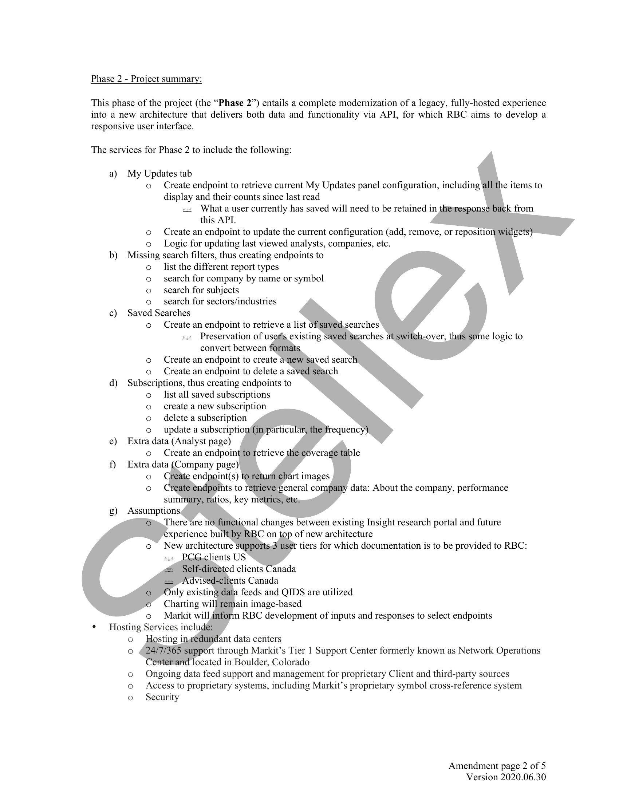
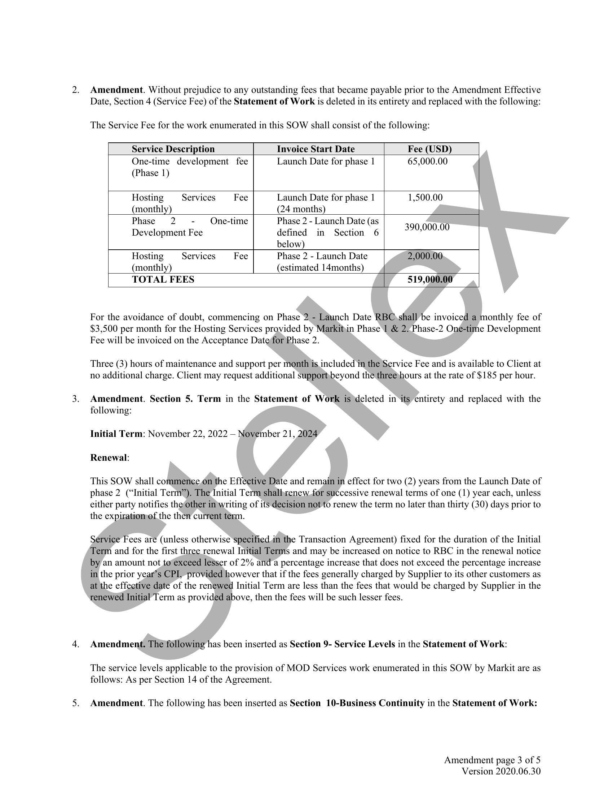
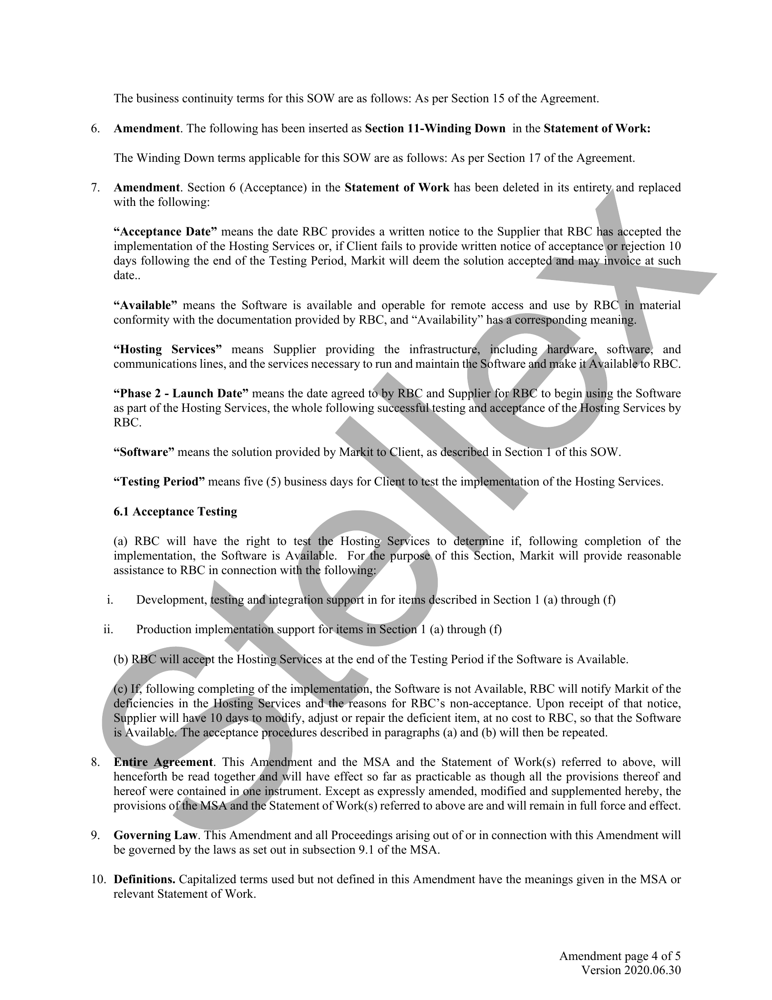
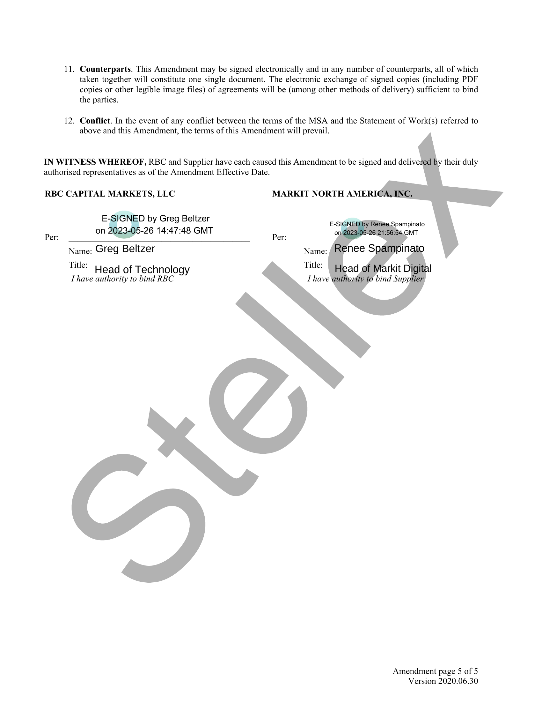

##### No title found]


````col
```col-md
flexGrow=.5
===
> [!info] [Page 1](_attachments/images_RBC-Cap-Mkts-3.6.1.14.1.100222368.pdf_235836/page_1.png)
> 
```  
```col-md
RBC  
®  
RBC Contract No: CTRO21523-1  
AMENDMENT NO. 1  
This AMENDMENT amends the Statement Of Work #56 (“SOW?” or “Statement of Work”) entered into and between
by the RBC Entity and Supplier Entity pursuant to the MSA, as specified below. References to “MD” or “Markit” and
“Client” (as the case may be in the SOW) shall be read, for the purpose of this Amendment, to mean “Supplier” and  
“RBC” as defined herein  
This Amendment is effective as May 19, 2023 (the “Amendment Effective Date”).  
AMENDMENT SUMMARY  
Amendment No:  
1  
Amendment Summary:  
This amendment is to expand the #legal/Scope in a Phase 2 of the project. For clarity,
the #legal/Scope in the original SOW is referredstovas/Phase 1 and expanded #legal/Scope is
Phase 2. Phase 2 is for modernization/of a legacy, fully-hosted experience into
a new architecture that delivers both data and functionality via APL  
Total cost this Amendment:  
418,000.00 USD  
Cumulative cost to date under
SOW:  
Agreement name Cumiulativeost (USD)
CTRO21523 101,000.00
CTR021523-1 519,000.00  
MASTER AGREEMENT DETAIL;  
S (the “MSA”)  
Supplier Lead Party:  
Markit On Demand, Inc,  
RBC Lead Party:  
Royal Bank of Canada  
Master Agreement Effective Date;  
November 1, 2011  
Master Agreement Contract 2011132
Number:
DETAILS OF THE STATEMENT OF WORK #56  
Supplier Entity (referred to herein
as “Supplier”):  
MarkitNorth America Inc. (an affiliate to Markit On Demand, Inc.)  
RBC Entity (referred to herein as
“RBC”):  
RBC Capital Markets, LLC  
SOW Effective Date:  
September 6, 2022  
SOW Contract Number:  
CTRO21523  
In consideration f the mutual covenants and agreements and other good and valuable consideration (the receipt and
sufficiency of which are acknowledged), RBC and Supplier agree to amend the SOW as follows:  
1. Amendment. Section | (Project #legal/Scope) of the Statement of Work is amended by adding the following:  
Amendment Page | of 5
Version 2020.06.30  
```
````
Notes:    
````col
```col-md
flexGrow=.5
===
> [!info] [Page 2](_attachments/images_RBC-Cap-Mkts-3.6.1.14.1.100222368.pdf_235836/page_2.png)
> 
```  
```col-md
Phase 2 - Project summary:  
This phase of the project (the “Phase 2”) entails a complete modernization of a legacy, fully-hosted experience
into a new architecture that delivers both data and functionality via API, for which RBC aims to develop a
responsive user interface.  
The services for Phase 2 to include the following:  
a) My Updates tab
o Create endpoint to retrieve current My Updates panel configuration, including all the items to
display and their counts since last read
<2 What a user currently has saved will need to be retained in thewesponse back from
this API.
o Create an endpoint to update the current configuration (add, remove, or reposition widgets)
o Logic for updating last viewed analysts, companies, etc.
b) Missing search filters, thus creating endpoints to
o list the different report types
o search for company by name or symbol
o search for subjects
o search for sectors/industries
c) Saved Searches
o Create an endpoint to retrieve a list of saved.searches
«= Preservation of user's existing saved Searches at switch-over, thus some logic to
convert between formats.
o Create an endpoint to create anew Saved search
o Create an endpoint to delete a saved search
d) Subscriptions, thus creating endpoints to
o list all saved subscriptions
© create a new subscription
o delete a subscription
© update a subscription((in particular, the frequency)
e) Extra data (Analyst page)
o Create an endpoint to retrieve the coverage table
f) Extra data (Company page)
o Create endpoint(s) to return chart images
o Create endpoints to retrieve general company data: About the company, #legal/Performance
summary, ratios, key metrics, ete.
g) Assumptions
Oj, There are no functional #legal/Changes between existing Insight research portal and future
experience built by RBC on top of new architecture
o New architecture supports,3 user tiers for which documentation is to be provided to RBC:
== PCGclients US
& Self-direeted clients Canada
«= Advised-clients Canada
© Only existing data feeds and QIDS are utilized
© Charting will remain image-based
o Markit will inform RBC development of inputs and responses to select endpoints
¢ Hosting Services include:
o Hosting inzedundant data centers
o €24/7/365 support through Markit’s Tier 1 Support Center formerly known as Network Operations
Center and located in Boulder, Colorado
o Ongoing data feed support and management for proprietary Client and #legal/Third-Party sources
Access to proprietary systems, including Markit’s proprietary symbol cross-reference system
o Security  
O°  
Amendment page 2 of 5
Version 2020.06.30  
```
````
Notes:    
````col
```col-md
flexGrow=.5
===
> [!info] [Page 3](_attachments/images_RBC-Cap-Mkts-3.6.1.14.1.100222368.pdf_235836/page_3.png)
> 
```  
```col-md
2.  
Amendment. Without prejudice to any outstanding #legal/Fees that became payable prior to the Amendment Effective
Date, Section 4 (Service Fee) of the Statement of Work is deleted in its entirety and replaced with the following:
The Service Fee for the work enumerated in this SOW shall consist of the following:  
Service Description Invoice Start Date Fee (USD)  
One-time development fee Launch Date for phase | 65,000.00  
(Phase 1)  
Hosting Services Fee Launch Date for phase | 1,500.00  
(monthly) (24 months)  
Phase 2 - One-time Phase 2 - Launch Date (as  
Development Fee defined in Section 6 390,000.00  
below)  
Hosting Services Fee Phase 2 - Launch Date 2,000.00  
(monthly) (estimated 14months)  
TOTAL #legal/Fees 519,000.00  
For the a#legal/Voidance of doubt, commencing on Phase 2 - Launch Date RBO,shall be invoiced a monthly fee of
$3,500 per month for the Hosting Services provided by Markitin Phase & 2. Phase-2 One-time Development
Fee will be invoiced on the Acceptance Datefor Phase 2.  
Three (3) hours of maintenance and support per month is included in the Service Fee and is available to Client at
no additional charge. Client may request additional supportbeyond the thre@hours at the rate of $185 per hour.  
Amendment. Section 5. Term in the Statement of Work is)deleted in its entirety and replaced with the
following:  
#legal/Initial_Term: November 22, 2022 — November 21, 2024
#legal/Renewal:  
This SOW shall commence,on the Effective Date and remain in effect for two (2) years from the Launch Date of
phase 2 (“#legal/Initial_Term”). The #legal/Initial_Term shalh#legal/Renew.for successive #legal/Renewal terms of one (1) year each, unless
either party notifies theother injwriting of its decision not to #legal/Renew the term no later than thirty (30) days prior to
the expiratiomof the then current term.  
Service #legal/Fees are (unless otherwise specified.in the Transaction Agreement) fixed for the duration of the Initial
Term and for the first three #legal/Renewal #legal/Initial_Terms and may be increased on notice to RBC in the #legal/Renewal notice
by an amount not tov#legal/Exceed lesser of 2% and a percentage increase that does not #legal/Exceed the percentage increase
in the prior year’s CPI, provided however that if the #legal/Fees generally charged by Supplier to its other customers as
at the effective date of the #legal/Renewed #legal/Initial_Term are less than the #legal/Fees that would be charged by Supplier in the
#legal/Renewed #legal/Initial_Term as provided above, then the #legal/Fees will be such lesser #legal/Fees.  
Amendment. Theifollowing has been inserted as Section 9- Service Levels in the Statement of Work:  
The service levels applicable to the provision of MOD Services work enumerated in this SOW by Markit are as
follows: As per Section 14 of the Agreement.  
Amendment. The following has been inserted as Section 10-Business Continuity in the Statement of Work:  
Amendment page 3 of 5
Version 2020.06.30  
```
````
Notes:    
````col
```col-md
flexGrow=.5
===
> [!info] [Page 4](_attachments/images_RBC-Cap-Mkts-3.6.1.14.1.100222368.pdf_235836/page_4.png)
> 
```  
```col-md
i.  
ii.  
10.  
The business continuity terms for this SOW are as follows: As per Section 15 of the Agreement.
Amendment. The following has been inserted as Section 11-Winding Down in the Statement of Work:
The Winding Down terms applicable for this SOW are as follows: As per Section 17 of the Agreement.  
Amendment. Section 6 (Acceptance) in the Statement of Work has been deleted in its entirety, and replaced
with the following:  
“Acceptance Date” means the date RBC provides a written notice to the Supplier that RBC has accepted the
implementation of the Hosting Services or, if Client fails to provide written notice of acceptance'or rejection 10
days following the end of the Testing Period, Markit will deem the solution acceptedfandsmay invoice at such
date.  
  
“Available” means the Software is available and operable for remote access and use by RBC in material
conformity with the documentation provided by RBC, and “Availability” hasy@ Corresponding meaning.  
“Hosting Services” means Supplier providing the infrastructure, including jnardware, software, and
communications lines, and the services necessary to run and maintain the Software and make itAvailable to RBC.  
“Phase 2 - Launch Date” means the date agreed to by RBC and Supplier forRBC to begin using the Software
as part of the Hosting Services, the whole following successful,testing and acceptance of the Hosting Services by
RBC.
“Software” means the solution provided by Markit to\Client, as described in Section 1 of this SOW.
“Testing Period” means five (5) business days for Client to test the implementation of the Hosting Services.
6.1 Acceptance Testing
(a) RBC will have the right to test the Hosting Services to determine if, following completion of the
implementation, the Software is Available. For dhe purpos® of this Section, Markit will provide reasonable
assistance to RBC in connection with the following:  
Development, testing and)integration support in for items described in Section | (a) through (f)  
Production implementation, support for items in/Section | (a) through (f)
(b) RBC will accept the Hosting Services at the end of the Testing Period if the Software is Available.
(c) If, following completing of the implementation, the Software is not Available, RBC will notify Markit of the
deficiencies in the Hosting Services and the reasons for RBC’s non-acceptance. Upon receipt of that notice,
Supplier will have 10 days to modify, adjust or repair the deficient item, at no cost to RBC, so that the Software
is Available#The acceptance procedures described in paragraphs (a) and (b) will then be repeated.
Entire Agreement. This Amendment and the MSA and the Statement of Work(s) referred to above, will
henceforth be read together and will have effect so far as practicable as though all the provisions thereof and
hereof were contained in one instrument. Except as expressly amended, modified and supplemented hereby, the  
provisions ofthe MSAcand the Statement of Work(s) referred to above are and will remain in full force and effect.  
#legal/Governing_Law. This Amendment and all Proceedings arising out of or in connection with this Amendment will
be governed by the laws as set out in subsection 9.1 of the MSA.  
Definitions. Capitalized terms used but not defined in this Amendment have the meanings given in the MSA or
relevant Statement of Work.  
Amendment page 4 of 5
Version 2020.06.30  
```
````
Notes:    
````col
```col-md
flexGrow=.5
===
> [!info] [Page 5](_attachments/images_RBC-Cap-Mkts-3.6.1.14.1.100222368.pdf_235836/page_5.png)
> 
```  
```col-md
11. Counterparts. This Amendment may be signed electronically and in any number of counterparts, all of which
taken together will constitute one single document. The electronic ex#legal/Change of signed copies (including PDF
copies or other legible image files) of agreements will be (among other methods of delivery) sufficient to bind
the parties.  
12. Conflict. In the event of any conflict between the terms of the MSA and the Statement of Work(s) referred to
above and this Amendment, the terms of this Amendment will prevail.  
IN WITNESS WHEREOF, RBC and Supplier have each caused this Amendment to be signed and deliver
authorised representatives as of the Amendment Effective Date.  
RBC CAPITAL MARKETS, LLC MARKIT NORTH AMERI  
E. D by Greg Beltzer
on -26 14:47:48 GMT
Per: Per:
Name: Greg Beltzer  
Title: Head of Technology
I have authority to bind RBC  
Amendment page 5 of 5
Version 2020.06.30  
```
````
Notes:  


![[_attachments/RBC-Cap-Mkts-3.6.1.14.1.1 00222368.pdf]