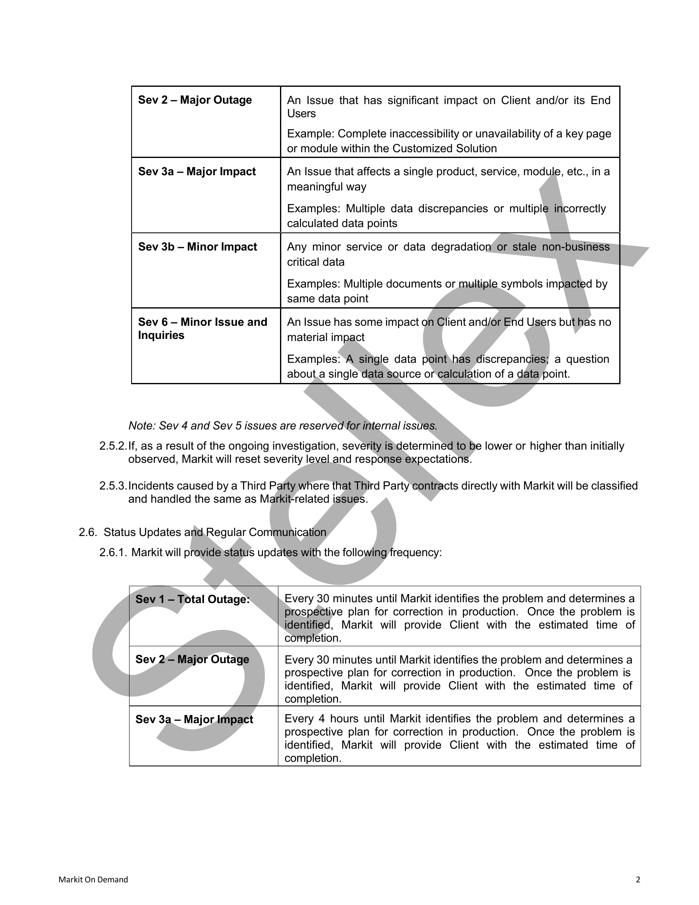
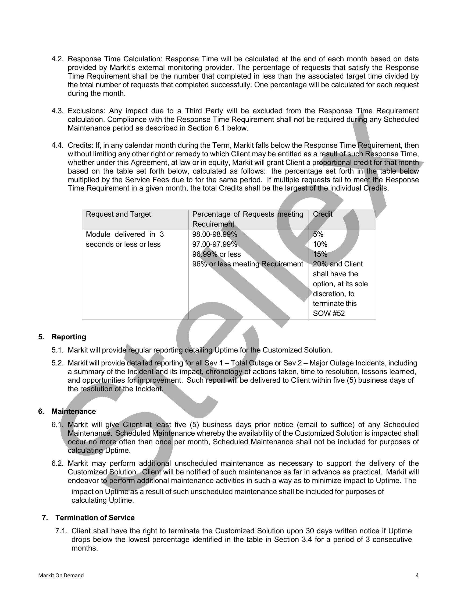

##### No title found]


````col
```col-md
flexGrow=.5
===
> [!info] [Page 1](_attachments/images_RBC-Parent-3.6.1.14.2.100205059.pdf_235829/page_1.png)
> 
```  
```col-md
Royal Bank of Canada
Statement of Work #57  
STATEMENT OF WORK #57:
HOSTING AND #legal/Dedicated_Team  
This Statement of Work #57 (“SOW #57”) is entered into
pursuant to, and incorporates by reference all terms and
conditions of the Master Service Agreement (“Agreement”)
between Royal Bank of Canada (“Client” or “RBC”) and
Markit North America Inc. (successor in title and rights to
Markit On Demand, Inc.) (“Markit”), effective November 1,
2011 (RBC Ref. #2011132).  
This SOW #57 commences on December 1, 2022 (“Effective
Date”).  
This SOW #67 is intended to supplement the Agreement
and is subject in all respects to the terms of the Agreement.
The parties expressly agree that in the event of a conflict,
inconsistency or ambiguity between the terms and
conditions of this SOW and the Agreement, the terms and
conditions of this SOW shall govern and control as to the
#legal/Scope of services described herein.  
As of the Effective Date, the #legal/Fees and services described in
SOW #52, Hosting and #legal/Dedicated_Team, effective
December 1, 2020, and all amendments thereto,ais
superseded by this SOW #57.  
1 #legal/Scope of Services / Specifications  
All websites, tools, APIs, mobile applications, and other
services that Markit provides to RBC Direct Investing.(“DI”)
prior to the Effective Date are referred to collectively as the
“RBC DI Services,” and are described in Sections 1(A)-(G)
below. As of the execution of this SOW #57, ongoing hosting
and support for the RBC DI Services is included under the’
Monthly Service Fee, described in Section 6.  
The parties expect that additional RBC, DI Services will
launch during the course of this engagement. In addition,
RBC DI may opt to decommission any of the RBC DI
Services listed herein during the course of this engagement.
The parties will work together to update this list.on a regular
basis or as needed.  
A. Maintenance of Existing Websites  
Markit will provide Hosting.Services (as defined in Section
10 below) and maintainthe existing Quotes & Research and
Community websites and all pages within those sites, as
described below:  
Quotes & Research
e Markets
o © Markets,Overview
Market Commentary
Sectors & Industries
Market News (News and Headlines)
Technical Analysis
Earnings and Events Calendar  
oo000  
Markit On Demand  
Proprietary & #legal/Confidential  
RBC Contract No: CTR021732  
e Investment Products
e Quotes & Research  
°
°  
o
fe}  
oo00  
Stock Overview
Watchlists
= Quote and quote streaming
= #legal/Performance
= Fundamentals
Global Watchlist Widget
Symbol Lookup
Detailed Quote for stocks, mutual funds,
ETFs, indices, and | miscellaneous
securities
= Overview (Stocks, ETFs,
indices, MFs, miscellaneous)
"w=_Charts (Stocks, ETFs, indices,
MFs),miscellaneous)
= News (Stocks, ETFs, MFs)
= « Options (Stocks, ETFs)
= Fundamentals (Stocks)Research (Stocks, ETFs)
= Financials (Stocks)
"Technicals (Stocks, ETFs)
= #legal/Performance (ETFs, MFs)
= “Holdings (ETFs, MFs)
= #legal/Fees & Taxes (ETFs, MFs)
«Risk (ETFs)
» Fund Details (MFs)
= Quote streaming
Stock Screener
Screeners
= Stocks (October 2020 release)
e Saved Screens
e Create a Screen
e Predefined Screens
= ETFs (November 2020 release)
e Saved Screens
e Create a Screen
e Predefined Screens
= Mutual Funds (December 2020
release)
e Saved Screens
e Create a Screen
e Predefined Screens
IPO Center
Fixed Income Screener
Analyst Pick List
Investors Toolkit
= Learning
= Tools  
```
````
Notes:    
````col
```col-md
flexGrow=.5
===
> [!info] [Page 2](_attachments/images_RBC-Parent-3.6.1.14.2.100205059.pdf_235829/page_2.png)
> 
```  
```col-md
Royal Bank of Canada
Statement of Work #57  
Holdings & Home Page  
e Holdings Page
o Portfolio Quotes
o Portfolio News
o Asset Mix  
e Home Page
o Market Snapshot
o MIND (personalized insights)  
Community  
e Forums  
o Forum Search
Connections  
o Connection Search
Investing Summary
Edit Profile
See What Others See  
B. Maintenance of Existing Tools  
Markit will provide Hosting Services for and maintain the
existing Active Trader Dashboard, Portfolio Builder, and
Admin Portal tools, as described below:  
Portfolio Analyzer
Admin Portal  
C. Maintenance of Existing Mobile Applications  
Markit will provide Hosting Services for and maintain the
existing mobile applications, as described below:  
Mobile Application - Legacy
e — Symbol Lookup
¢ Quote Summary
o Overview | (Stocks,» ETFs, Indices,
miscellaneous)
o Chart (Stocks, ETFs, Indices,
miscellaneous)
o_<@News (Stocks, ETFs, Indices,
miscellaneous)
© Options (Stocks, ETFs, Indices,
miscellaneous)
o Level 2 (NASDAQ, TSX)TSXV)
o #legal/Performance (MFs)
e ~Mutual.Fund Overview
e Mutual Fund #legal/Performance  
e Markets
o Overview
o =©News  
e Watchlists  
e = Alerts  
Mobile Application - New  
Markit On Demand  
Proprietary & #legal/Confidential  
RBC Contract No: CTR021732  
e¢ Quote and quote streaming  
e — Chartworks  
e Watchlists  
e = Option Chains  
e RBC-Options  
e RBC-Quote  
e —RBC-Charting  
e —RBC-Inspired Investor  
e RBC-Recent Symbols  
e RBC-Direct Investing Detailed Quote
e RBC-Xref  
¢ —RBC-Direct Investing Community  
e¢ RBC-Trading Central Technical Insight
e RBC-Direct Investing  
e RBC-News  
D. Maintenance of Existing APIs  
Markit will provide Hosting Services for and maintain the  
existing APIs, as\listed below:
e Equity Quote and quote streaming
e » Intraday Chart
e PMAG
e Level 2
e — Store Article Content
e¢ Get Community Thread Url
e¢ Get Post Count
«Option Quote
e¢ “Qption,Chains
e — Ivr Watchlis'
o Get All Watchlist
o Get Watchhlist
o Get Watchlist By Id
e Submit Trade
e #legal/Cancel Trade
e Get Transactions
e = Markitify Trade
e — Session Kill
e Trading Switch Flags
e = 10k Chart
e — Price Chart
e Mutual Funds Price Chart
e Get Events List
e Get S&P Reports Manifest
e — DI Options Chart
e News Search
e — Symbol Lookup
e — Symbol Rollover
e Investing
o Add To Watchlist
o Remove From Watchlist  
```
````
Notes:    
````col
```col-md
flexGrow=.5
===
> [!info] [Page 3](_attachments/images_RBC-Parent-3.6.1.14.2.100205059.pdf_235829/page_3.png)
> 
```  
```col-md
Royal Bank of Canada
Statement of Work #57  
o Edit Watchlist
e Trading Dashboard (note: to be decommissioned
2021)
e — Add To Watchlist
o Remove From Watchlist
o Edit Watchlist
o Symbol Lookup
e APIs to interface with Sprinklr
e Create Screen Get #legal/Matches (Stocks, ETFs, and
Mutual Funds)
e Screen Results Get Results (Stocks, ETFs, and
Mutual Funds)
e Get Chart (Advanced Chart)
e RBC API Catalog
Charting
Direct Investing
Direct Investing Community
Direct Investing Markets
Direct Investing Detailed Quote
Inspired Investor
News
Options
Quote
Quote streaming
Recent Symbols
Xref
Trading Central Technical Insight
MIND (personalized insights)  
0000000000000 0  
E. Quote Usage and Aggregation Services  
Markit shall continue to provide Client with: daily ingestion
and processing of RBC quote usage files; aggregation with
Markit-sourced quote usage datajymonthly usage report for
each ex#legal/Change to RBC; and periodic usage reports for real
time quotes highlighting aggregation atythe client, security,
and ex#legal/Change level.  
F. Notifications Project  
Markit will provide RBC DI with daily data files on ajvariety
of pre-determined data points to_allow RBC to send out
targeted notifications to clients!  
G. | #legal/Dedicated_Team  
Markit will provide a team of 15.5 #legal/Dedicated_Full-Time
Equivalent (“FTE”) resources (“#legal/Dedicated_Team”) to support
the RBC DI account. An FTE is defined as one or more
employees contributing one hundred thirty (130) hours per
month. The Dedicated/Téampwill provide maintenance and
enhancement services for previously launched RBC DI
Services, as well as work on new initiatives as directed and
prioritized by RBC DI. Markit will make best efforts to ensure
that all projects done by the #legal/Dedicated_Team comply with  
Markit On Demand  
Proprietary & #legal/Confidential  
RBC Contract No: CTR021732  
Accessibility for Ontarians with Disabilities Act (“AODA”)
requirements i.e. WCAG 2.0AA certification.  
Markit personnel may be based in the following Markit
offices: Boulder, Colorado, United States; London, Ontario,
Canada; Noida, India offices; remote locations the United
States, Canada and India.  
2 Browser Support  
Markit will provide support for the RBC DI Services in the
following browsers:  
Windows | Edge
J  
Windows/Mac | Firefox  
Mac Safari  
Windows/Mac | Chrome  
Markit willymake reasonable efforts to support the most
recent browser, versions as they become available. Legacy
versions will be retired in due course.  
3 Redundancy  
The RBC Dl Services will be fully operational in all of Markit’s
managed data,centers.  
4<Reporting  
Markit will provide our standard reporting packing with the
RBC DI Services are running in production.  
5 Client Responsibilities  
Client will be responsible for licensing and providing all data,
content, and fonts required for this project, other than as
described in Section 6 below. Markit can recommend and
make introductions to appropriate providers, but Client will
be responsible for all agreements with and payments to such
providers.  
6 Monthly Service Fee  
The Monthly Service Fee for the services subscribed to
herein shall be:  
a) $ 325,084 USD per month from the Effective Date
through December 31, 2022; then  
b) $ 397,084 USD per month from January 1, 2023
through October 31, 2024.  
```
````
Notes:    
````col
```col-md
flexGrow=.5
===
> [!info] [Page 4](_attachments/images_RBC-Parent-3.6.1.14.2.100205059.pdf_235829/page_4.png)
> 
```  
```col-md
Royal Bank of Canada
Statement of Work #57  
For the a#legal/Voidance of doubt, the Monthly Service Fee shall
be calculated as follows:  
A. $44,476 USD/month for Hosting Services (as
described immediately below and in Section 10)
for all RBC DI Services and RBC projects
launched during the term of this SOW #52.
Hosting services include:  
- Hosting in redundant data centers  
- 24/7/365 support through Markit’s Tier 1
Support Center formerly known as Network
Operations Center and located in Boulder,
Colorado  
- Ongoing data feed support and
management for proprietary Client and third
party sources  
- Access to proprietary systems, including
Markit’s proprietary symbol cross-reference
system  
- Security  
The Monthly Service Fee includes up to 20 million
(20,000,000) page views or direct API requests
per week. Should Client traffic #legal/Exceed
20,000,000 page views or direct API requests per
week, the parties shall mutually agree on a
revised fee structure to account for increased
traffic;  
B. For the first month of the #legal/Initial_Term (December 1, 2022
— December 31, 2022), $279,000 USD/month®for the
#legal/Dedicated_Team of 15.5 FTEs to support new
development efforts and maintenance of existing sites;  
C. For the rest of the #legal/Initial_Term (January 1, 2023 —
October 31, 2024), $351,000 USD/month \ for the
#legal/Dedicated_Team of 19.5)FTEs) to supporty new
development efforts and maintenance of existing sites;  
D. $ 1,333 USD/month pass through for Acquire Media
Feed #1 (North American’ Press Release Package,
Business Wife, PR Newswire, PrimeNewswire, Market
Wired, Ganada Newswsire, Market Wired Canada) and
Feed” #2 (GlobeNewswire Canada, ~Accesswire,
Newsfile, TheNewswire.ca, Filing,Services Canada).  
E. $275 USD/month pass‘through to Canhex for NAV data
or Canadian mutual funds.  
7 Term  
This SOW shall commence on the Effective Date and remain
in effect for one (1) yeamnand eleven (11) months thereafter
(“#legal/Initial_Term”). Following thé #legal/Initial_Term, RBC has the right
to #legal/Renew this SOW under the same terms and conditions for
a maximum of one (1) period of one (1) year (“#legal/Renewal
Term”) by providing 30 days’ notice to Markit. #legal/Renewal is
subject to increase in fee by a percentage no greater than  
Markit On Demand  
Proprietary & #legal/Confidential  
RBC Contract No: CTR021732  
the lesser of (i) 5% and (ii) the average CPI for the 12
months ending two months before the date of the increase.  
Notwithstanding anything else in this SOW, RBC may at any
time end this SOW for convenience at its sole and absolute
discretion. This ending will be effective 180 days after RBC
provides notice to Markit.  
8 Increase or Decrease in Size of #legal/Dedicated_Team  
Client may elect to increase or decrease the number of
resources on the #legal/Dedicated_Team by providing Markit 60
days’ written notice; email shall.suffice for this purpose.  
Should RBC wish to increase the number of Dedicated
Team resources, the fee for incremental #legal/Dedicated_Team
members above the original number of FTEs per Section 6
shall be 18,000/FTE/month, regardless of the number of
FTEs.  
Should RBC/ wish to decrease the number of Dedicated
Team resources, the savings shall,be.$18,000 per FTE per
month.  
For those projects for which Client does not want to utilize
the #legal/Dedicated_Team, separate SOWs may be issued on a
one-time basis. Continued@ Hosting Services and
maintenance related to such projects may be governed
under the terms of this SOW, and this SOW may be
amended to reference newly-launched projects.  
9 #legal/Change Management  
Markit reserves the right, in its sole discretion, to make
#legal/Changes andyenhancements to the equipment and software
used to provide the services from time to time to maintain
operations and as required for problem management and/or
system security. Markit will use commercially reasonable
efforts to implement #legal/Changes during non-peak hours, except
for #legal/Changes required for emergency purposes, which may
be made at any time. To the extent reasonable and
commercially practicable, Client will be notified in advance
of any expected outages.  
10 Hosting Services  
“Hosting Services” means providing, either by Markit or a
third party hosting provider selected by Markit, the
infrastructure, including hardware,  sortware, and
communications lines and the services necessary to run and
maintain the RBC DI Services for remote access from any
location by any customer, advisors, employees, consultants
and suppliers of RBC and its Affiliates and any other third
parties (collectively, the “Users”) requiring access.  
Markit will provide the Hosting Services to Users 24 hours a
day, 7 days a week, subject to the provisions of this SOW.  
Per Markit’s Business Continuity Plan, Markit shall be
capable of resuming the Hosting Services, after they have
been interrupted to any material extent, within 24 hours,
barring any incident that does not allow Markit to resume
services within this timeframe. To the extent Markit has  
```
````
Notes:    
````col
```col-md
flexGrow=.5
===
> [!info] [Page 5](_attachments/images_RBC-Parent-3.6.1.14.2.100205059.pdf_235829/page_5.png)
> 
```  
```col-md
Royal Bank of Canada
Statement of Work #57  
redundant back-up systems, the Business Continuity Plan
will be capable of enabling Markit to resume providing the
Hosting Services immediately.  
11 Ownership of Service Materials  
RBC shall have, from their creation, all ownership rights,
including but not #legal/Limited to copyright, in the Services
Materials.  
“Services Materials” means all items, in any form, whether
written or electronic, produced by Markit solely and
exclusively for Client in performing the Services under this
Statement of Work. These items include without #legal/Limitation
specifications, diagrams, flowcharts, data, web page
designs and documents. Markit waives any moral rights that
it may have in the Services Materials at law (including but
not #legal/Limited to the Copyright Act, Canada) or in equity. Markit
may use the Services Materials only to perform its
obligations under this Statement of Work.  
12 Representations and Warranties  
Each party represents and #legal/Warrants that: (i) when executed
and delivered, this SOW shall constitute the legal, valid, and
binding obligation of such party, enforceable against it
pursuant to its terms; (ii) it shall comply with all applicable
federal and state laws, regulations, and statutes in the
#legal/Performance of its obligations hereunder; (iii) it has full
power and authority to enter into and perform its obligations
under this SOW; (iv) it has obtained all necessary corporate
approvals to enter into and execute this SOW; and (v) its
#legal/Performance under this SOW does not and shall not,conflict
with any other material agreement or obligation towwhich it is
a party or by which it is bound.  
13 Invoices  
All invoices for MARKIT services Shall bé,sent to the
following representative of Client:  
Curtis Ryan, Director, Initiatives & Implementation
155 Wellington St\W = 19'.Floor  
Toronto, On
Phone: 416-974-0054
Email: Gurtis.ryan@rbc.com  
14 Service Level Agreement  
Please see Exhibit A for details of the Service Level
Agreement (“SLA”).  
15 Security  
Markit represents and #legal/Warrants that it has policies and
procedures and systems reasonably designed to detect,
prevent and respond to cyberattacks to ensure (i) the
#legal/Confidentiality and security of Client's #legal/Confidential  
Markit On Demand  
Proprietary & #legal/Confidential  
RBC Contract No: CTR021732  
Information including by #legal/Limiting, tracking and monitoring
access to Client's #legal/Confidential_Information by Markit
Personnel and preventing and detecting a Security #legal/Breach;
(ii) protect Client's #legal/Confidential_Information against loss,
destruction, unintended alteration, or any anticipated threats
‘o security or integrity; (iii) prevent and detect unauthorized
access by third parties to its computer software, systems,
programs and files, including through metwork penetration
esting by an external vendor; and (iv)otherwise prevent and
protect against unauthorized access to or use of Client's
#legal/Confidential_Information in its possession or transmitted to or
rom its computers or systems. Markit will provide training to
appropriate employees withwrespect_to cybersecurity and
monitoring compliance with its cybersecurity policieswand.
procedures. Further, Markit agrees that it will promptly notify
he client of any cybersecurity #legal/Breach which may affect the
duties of Markit under.this SOW and the Agreement. Markit
is responsible for’Security Measures and for the prevention
of Security #legal/Breaches relating to Markit Systems and Client
Data. Markit must at all times in the #legal/Performance of its
obligations under this SOW complywith and meet or #legal/Exceed
all Industry Security Standards and applicable Law described
below.  
“Industry Security Standards” means security measures,
practices.and proceduresprescribed in at least one of the
following (each as may be updated, modified or replaced
from time tos time):(a) ISO / IEC 27000-series- see
https://www.iso27001security.com/; and/or (b) COBIT [5]
[20149] - http:/Awww.isaca.org/cobit/; and/or (c) Cyber
Security Framework - see
http:/Awww.nist.gov/cyberframework/.  
Security Incident #legal/Breach Report. In the event of a
Technology or Security Incident, Markit will: (i) notify Client
immediately (and in any event within 24 hours of becoming
aware of such Incident) by telephone and in writing at the
address provided for such purpose in the SOW or otherwise
designated by Client in writing, including a description of the
incident (an “Incident Report’); (ii) assist Client in the
management of any consequences arising from it; (iii) take
any reasonable steps necessary to mitigate any harm
resulting from it; (iv) take appropriate steps to prevent its
recurrence and notify Client of those steps; and (v) notify
Client in advance of making, and provide Client with a copy
of, any media release regarding the Technology or Security
Incident. Upon receipt of the Incident Report, Client may
request, and Markit will provide as soon as possible, such
additional information as is available to Markit (and persons
Markit engages in relation to the investigation of the
Technology or Security Incident) concerning the Technology
or Security Incident, including as is reasonably required by
Client to satisfy its regulatory reporting requirements
(“Incident Reporting Information”). If any Incident Reporting
Information is not available when requested, Markit will so
indicate and will provide best known estimates and all other
details available at the time. Markit will provide regular
updates to Client until all Incident Reporting Information has
been provided or the Technology or Security Incident is
contained or resolved. Nothing in this section 15 #legal/Limits any  
```
````
Notes:    
````col
```col-md
flexGrow=.5
===
> [!info] [Page 6](_attachments/images_RBC-Parent-3.6.1.14.2.100205059.pdf_235829/page_6.png)
> 
```  
```col-md
Royal Bank of Canada
Statement of Work #57  
other obligation in the SOW, a service level agreement, or
other agreement of the parties, for Markit to notify Client and
take other action in connection with an incident impacting
Client’s #legal/Confidential_Information or the provision of Services.  
Penetration Test. Please see Exhibit B for procedure of
Penetration test on RBC DI Services and RBC projects by
Markit.  
16 Accessibility  
“Accessibility Guidelines’ means the Web _ Content
Accessibility Guidelines (“WWCAG”) for digital technology, as
published by the Web Accessibility Initiative (“WAI”) of the
World Wide Web Consortium (“W3C”), at the version and
conformance level required by the legislation in effect in any
jurisdiction in which Client operates that digital technology.
Legislation governing the WCAG includes but is not #legal/Limited
to, the following: the Accessibility for Ontarians with
Disabilities Act (“AODA”), the regulations set forth by the
Accessible Canada Act (“ACA”) and the Americans with
Disabilities Act of 1990 (“ADA”). If the WCAG are not part of
the legislation for any jurisdiction in which Client operates the
digital technology, the conformance level for that jurisdiction
will be deemed to be Level AA under the latest WCAG
version.  
Conformance with Accessibility Guidelines. Markit
#legal/Warrants that the services work performed by Dedicated
Team will continue to comply with the Accessibility
Guidelines for the duration of the #legal/Initial_Term of this SOW.  
Markit will perform an annual #legal/Audit of adherence to
Accessibility Guidelines for any services or work performed
for the Client, at no additional cost. Markit will provide to
Client a report describing the findings of the annual #legal/Audit
within 30 days of completion of #legal/Audit. If the #legal/Audit results in
any gap to adherence to Accessibility guidelines or
Accessibility Deficiencies. Markit will/modify the services or
work at no additional cost to the Client to correct the
Accessibility Deficiencies or «the gapin Accessibility
Guidelines, in accordancewith an implementation plan to be
agreed upon with Client. All such remediation work will be
performed ,by the #legal/Dedicated_Team and Client will)need to
prioritize this work against other projects.  
Markit On Demand  
Proprietary & #legal/Confidential  
RBC Contract No: CTR021732  
```
````
Notes:    
````col
```col-md
flexGrow=.5
===
> [!info] [Page 7](_attachments/images_RBC-Parent-3.6.1.14.2.100205059.pdf_235829/page_7.png)
> 
```  
```col-md
Royal Bank of Canada
Statement of Work #57  
Proprietary & #legal/Confidential  
RBC Contract No: CTR021732  
Catherine Allegra  
ACCEPTED ACCEPTED
MARKIT NORTH AMERICA, INC. ROYAL BANK OF CANADA
SIGNATURE SIGNATURE
E-SIGNED by Catherine Allegra E-SIGNED by Lori Darlington
on 2022-11-29 07:19:45 EST on 2022-11-28 13:22:28 EST
PRINT NAME PRINT NAME  
Lori Darlington  
TITLE  
Global Head, Markit Digital  
TITLE  
President & CEO, RBC Direct Investing  
DATE OF SIGNATURE  
2022-11-29  
DATE OF SIGNATURE  
2022-11-28  
ACCEPTED  
ROYAL BANK OF CANADA.  
SIGNATURE
E-SIGNED by Erica Nielsen  
on 2022-11-28 22:34:21 EST  
PRINT NAME
Erica Nielsen  
TITLE
SVP, Personal Savings and Investments  
DATE OF SIGNATURE  
2022-11-28  
Markit On Demand  
```
````
Notes:    
````col
```col-md
flexGrow=.5
===
> [!info] [Page 8](_attachments/images_RBC-Parent-3.6.1.14.2.100205059.pdf_235829/page_8.png)
> 
```  
```col-md
1)  
2.  
1.1.  
1.2.  
1.3.
14.  
1.5.  
1.6.  
1.7.
1.8.
1.9.  
Exhibit A to SOW #57: Service Level Agreement  
Definitions  
Credit(s): Percentage of monthly fee to be reimbursed to Client by Markit based on failure to meet established
metrics.  
Designated Technical Contact: Individual(s) (employed by Client) whom Markit will contact in the event that
Markit becomes aware of any issue with the Customized Solution.  
End User: The ultimate user of the Customized Solution in a production environment.  
Incident: Any issue that prevents the Customized Solution from functioning as intended in a production
environment.  
Incident Response: Markit’s standard process for handling Incidents, including internal and external
communication, documentation and resolution.  
Incident Manager: Markit staff trained in Incident Response; capable of coordinating Incident investigation
and responsible for communicating technical detailsjto Client and Markit staff.  
Project Manager: The individual at Markit acting as liaison between Markit and Client.
Third Party: Any service, data or contentprovider that is neither the Client norMarkit.  
#legal/Uptime: The percentage of time during a calendammonth that the\Customized Solution is available.  
Response and Escalation Services  
2.1.  
2.2.  
2.3.  
24,  
2.5.  
Markit will respond to any and all Incidentsyrequests for maintenance, support services escalations, or
queries via its Tier 1 Support Centern(“Tier 1”) 24 hours a day, 7 days per week, 365 days per year. Tier 1
can be reached at MOD-NOC@ihsmarkit.com or +1.303.583.4308. Response to any escalation will be from
a Technical Incident Responder on the Tier team and not an automated reply.  
Upon notice of any Incident related to any part of the services provided by Markit to Client, Tier 1 personnel
will initiate the Incident Response procedure and provide the Markit tracking ticket number within 15 minutes.
Tier 1 will respond within 45 minutes of receiving notice of the Incident, regardless of severity level.  
For all issues classified “Sev. 1 —Total Outage” or “Sev 2 — Major Outage” as per Section 2.5 below, Tier 1
will contact.an Incident Manager in conjunction with creating the initial tracking ticket. The Incident Manager
will join the investigation within 15 minutes during Markit’s core support hours (24 hours a day, Monday
through Friday, excluding U.S. holidays)jand within 30 minutes otherwise (including weekends). The
Incident Manager will provide Client with proactive status updates via email or phone.  
Markit will respond to Incidents, requests for maintenance, support service escalations, or queries from
Client or approved representatives of Client only. Should an End User contact Markit directly, Markit will (i)
instruct the End User to contact Client directly and (ii) request the Project Manager to follow up with Client.  
Incident Severity De#legal/Termination  
2.5.1.Markit will classifyescalation severity level for any Incident (whether reported by Client or via Markit
internal monitoring alert) according to the following criteria:  
Severity Level  
Sev 1 — Total Outage An Issue that has major widespread effect on all of a Client's End
Users.
Example: Complete inaccessibility or unavailability of the
Customized Solution  
Markit On Demand 1  
```
````
Notes:    
````col
```col-md
flexGrow=.5
===
> [!info] [Page 9](_attachments/images_RBC-Parent-3.6.1.14.2.100205059.pdf_235829/page_9.png)
> 
```  
```col-md
Sev 2 — Major Outage An Issue that has significant impact on Client and/or its End
Users  
Example: Complete inaccessibility or unavailability of a key page
or module within the Customized Solution  
Sev 3a — Major Impact An Issue that affects a single product, service, module, etc., ina
meaningful way  
Examples: Multiple data discrepancies or multiple incorrectly
calculated data points  
Sev 3b — Minor Impact Any minor service or data degradation’ or stale non-business.
critical data  
Examples: Multiple documents or multiple symbols impacted by
same data point  
Sev 6 — Minor Issue and | An Issue has some impact on Client and/or End Users but has no
Inquiries material impact  
Examples: ‘A single data pointyhas discrepancies; a question
about.a single data source or calculation of a data point.  
Note: Sev 4 and Sev 5 issues are reserved for internal issues.
2.5.2.If, as a result of the ongoing investigation, severity is\determined to be lower or higher than initially
observed, Markit will reset severity level and response expectations.  
2.5.3.Incidents caused by a Third Party where that Third Party contracts directly with Markit will be classified
and handled the same as Markit-related issues.  
2.6. Status Updates and,Regular Communication  
2.6.1. Markit will provide)status updates with the following frequency:  
Sev 1 — Total Outage: Every 30 minutes until Markit identifies the problem and determines a
Prospective plan for correction in production. Once the problem is
identified, Markit will provide Client with the estimated time of
completion.  
Sev 2=— Major Outage Every 30 minutes until Markit identifies the problem and determines a
prospective plan for correction in production. Once the problem is
identified, Markit will provide Client with the estimated time of
completion.  
Sev 3a — Major Impact Every 4 hours until Markit identifies the problem and determines a
prospective plan for correction in production. Once the problem is
identified, Markit will provide Client with the estimated time of
completion.  
Markit On Demand 2  
```
````
Notes:    
````col
```col-md
flexGrow=.5
===
> [!info] [Page 10](_attachments/images_RBC-Parent-3.6.1.14.2.100205059.pdf_235829/page_10.png)
> 
```  
```col-md
4.  
Sev 3b — Minor Impact Daily updates until Markit identifies the problem and determines a
prospective plan for correction in production. Once the problem is
identified, Markit will provide Client with the estimated time of
completion.  
Sev 6 — Minor Outage and | Once the problem is identified, Markit will provide Client with an
Inquiries estimated time of completion.  
2.6.2. The Markit Incident Manager will be available to join a bridge line or other such cooperative coordi#legal/Nation
effort to resolve a Sev 1 or Sev 2 Incident.  
2.6.3.Markit may proactively initiate conference calls or bridge lines where Markit deems it necessary or
helpful to resolving any Incident.  
2.7. Markit shall provide Client’s Designated Technical Contact with .noticepof any issue affecting the
#legal/Performance of the Customized Solution of which Markit becomes aware. In the event Markit believes such
issue to be the result of an act or omission of a Third Party, Markit shall cooperate with Client)and Third
Party to restore normal functionality of the Customized Solution in a timely manner.  
#legal/Uptime Requirement: Markit will ensure that the Customized Solution will bevavailable at least 99.7% of the
time as measured over each calendar month during the Term (“#legal/Uptime Requirement’).  
3.1. Monitoring Approach: Markit will choose one or more pages of the Customized Solution to monitor in order
to determine #legal/Uptime. Page selections will be reviewed withsthe Client to ensure appropriateness. Each
page will be monitored continuously from more)than one location outside of Markit’s network on a roundrobin basis at least once per minute. A page fails ajmonitoring test if,two monitoring locations fail to access
a page in two successive tries from each monitoring location.  
3.2. #legal/Uptime Calculation: #legal/Uptime will be calculated at the end ofeach month based on data provided by Markit’s
external monitoring provider. A page willberconsidered unavailable from the time of the first failure until the
first subsequent success. All such intervals will beyreviewed and,validated by Markit. #legal/Uptime will then be
calculated as the sum of all periods during which the page was available during the calendar month, divided
by the total time in the month. One percentage will be’ calculated per month. Scheduled Maintenance as
described in Section 6.1 below shall not be,included for purposes of calculating #legal/Uptime.  
3.3. #legal/Exclusions: Any failure due to an outage of a Third Party will be excluded from the #legal/Uptime calculation.  
3.4. Credits: If, in any calendar month during the Term,.#legal/Uptime falls below the #legal/Uptime Requirement, Markit will
grant Client a credit for that\month based on the table set forth below, calculated as follows: the percentage
set forth in.the table below multiplied by the Service #legal/Fees due for the same period.  
Service Level Metric #legal/Uptime Credit
#legal/Uptime 99.70-99.69% 10%
95.00-99.40% 15%
95.00% or less 20% and Client shall  
have the option, at
its sole discretion, to
terminate this SOW
#52  
Response Time Requirement: Markit will ensure that the Customized Solution meets specific targets as set
forth below (“Response Time Requirement”).  
4.1. Monitoring Approach: Each request will be continuously monitored from more than one location outside of
Markit’s network on a round-robin basis at least once per minute. Response time will be recorded by Markit’s
external monitoring provider. Failed responses will not be included in the Response Tim Requirement
(failures are addressed by the #legal/Uptime Requirement described in Section 3 above).  
Markit On Demand 3  
```
````
Notes:    
````col
```col-md
flexGrow=.5
===
> [!info] [Page 11](_attachments/images_RBC-Parent-3.6.1.14.2.100205059.pdf_235829/page_11.png)
> 
```  
```col-md
4.2.  
4.3.  
44.  
Response Time Calculation: Response Time will be calculated at the end of each month based on data
provided by Markit’s external monitoring provider. The percentage of requests that satisfy the Response
Time Requirement shall be the number that completed in less than the associated target time divided by
the total number of requests that completed successfully. One percentage will be calculated for each request
during the month.  
#legal/Exclusions: Any impact due to a Third Party will be excluded from the Response Time Requirement
calculation. Compliance with the Response Time Requirement shall not be required during any Scheduled
Maintenance period as described in Section 6.1 below.  
Credits: If, in any calendar month during the Term, Markit falls below the Response Time Requirement, then
without #legal/Limiting any other right or remedy to which Client may be entitled as a resultofsuch Response Time,
whether under this Agreement, at law or in equity, Markit will grant Client a proportional credit for that'month
based on the table set forth below, calculated as follows: the percentage set forth in\the table below
multiplied by the Service #legal/Fees due to for the same period. If multiple requests fail to meet the Response
Time Requirement in a given month, the total Credits shall be the largestiofithe individual Credits.  
Request and Target Percentage of Requests meeting | Credit
Requirement
Module delivered in 3 98.00-98.99% 5%  
seconds or less or less 97.00-97.99% 10%  
96:99% or less 15%  
96% or less meeting Requirement | 20% and Client
shall have the
option, at its sole
discretion, to
terminate this
SOW #52  
5. Reporting  
5.1.
5.2.  
Markit will provide regular reporting detailing #legal/Uptime for the Customized Solution.  
Markit will provide detailed reporting for all Sev 1 — Total Outage or Sev 2 — Major Outage Incidents, including
a summary of the Incident and its impact, chronology of actions taken, time to resolution, lessons learned,
and opportunities for improvement. Such report will be delivered to Client within five (5) business days of  
the resolution of,the Incident.  
6. Maintenance  
6.1.  
6.2.  
Markit will give’ Client at least five (5) business days prior notice (email to suffice) of any Scheduled
Maintenance. Scheduled Maintenance whereby the availability of the Customized Solution is impacted shall
Occuresnd more often than once per month, Scheduled Maintenance shall not be included for purposes of
calculating #legal/Uptime.  
Markit may perform additional unscheduled maintenance as necessary to support the delivery of the
Customized Solution.  
«Client will be notified of such maintenance as far in advance as practical. Markit will
endeavor to perform additional maintenance activities in such a way as to minimize impact to #legal/Uptime. The  
impact on #legal/Uptime as a result of such unscheduled maintenance shall be included for purposes of
calculating #legal/Uptime.  
7. #legal/Termination of Service  
7.1. Client shall have the right to terminate the Customized Solution upon 30 days written notice if #legal/Uptime  
drops below the lowest percentage identified in the table in Section 3.4 for a period of 3 consecutive
months.  
Markit On Demand 4  
```
````
Notes:    
````col
```col-md
flexGrow=.5
===
> [!info] [Page 12](_attachments/images_RBC-Parent-3.6.1.14.2.100205059.pdf_235829/page_12.png)
> 
```  
```col-md
7.2. In the event Client exercises such right of #legal/Termination, no payments will be due to Markit with respect to
any periods occurring after the date of #legal/Termination. If Client has prepaid any monies for periods after the
date of #legal/Termination, Markit shall issue a refund to Client.  
S
g
oO  
Markit On Demand 5  
```
````
Notes:    
````col
```col-md
flexGrow=.5
===
> [!info] [Page 13](_attachments/images_RBC-Parent-3.6.1.14.2.100205059.pdf_235829/page_13.png)
> 
```  
```col-md
1.1
1.2
1.3  
2.2  
2.3  
24  
3.2  
3.3  
3.4
3.5  
Markit On Demand  
Exhibit B to SOW #57: Penetration Test  
Definitions  
Test Provider
Markit engages the services of an external party to perform the Penetration Test.
Markit currently utilizes Trustwave Holdings Inc. as the Test Provider for the #legal/Performance of the Penetration Test.  
Markit may choose to #legal/Change Test Providers from time to time for a similar level of service and shall notify RB@jat
least 30 days in advance of a switch in vendor  
Penetration Test  
The Manager Security Testing (MST) penetration test that is performed/on the RBC DI Services,and RBC projects (to
be defined) by the test provider.  
Some Test Providers allow retesting of the same Penetration Test within a given’period of time; retesting shall be
considered a Penetration Test. At the Test Provider’s discretion, retesting may not apply to
applications/services/projects that were not included in the initialtest.  
Markit currently runs Trustwave Tier 3 application penetration test forthe RBC DI Services and RBC projects
provided by Markit.  
Markit may choose to #legal/Change Penetration Tests from time tojtime after consulation and agreement with RBC.  
Procedure  
Markit will perform the Penetration Test biannually during the #legal/Initial_Term on the date, April 1 and October 1 or the
closest business day after these dates./ Markit will obtain a quote from the test provider, if needed, and will share it
with RBC at least 30 days before the Penetration’Test date for RBC approval.  
Estimated price at the time of the effective\date is $8,840.00, USD; Markit provides no guarantee for the future price
of Penetration Tests.  
Upon RBC’s approval of the quote, Markit will schedule the test to be run with the test provider on the dates
mentioned.in,Section 3-1 above.  
Markit will provide the report provided by the test provider to RBC within 10 days of the completion of the test.  
Markit will invoice RBC for the Penetration Test once the test provider report has been sent to RBC.  
```
````
Notes:  


![[_attachments/RBC-Parent-3.6.1.14.2.1 00205059.pdf]