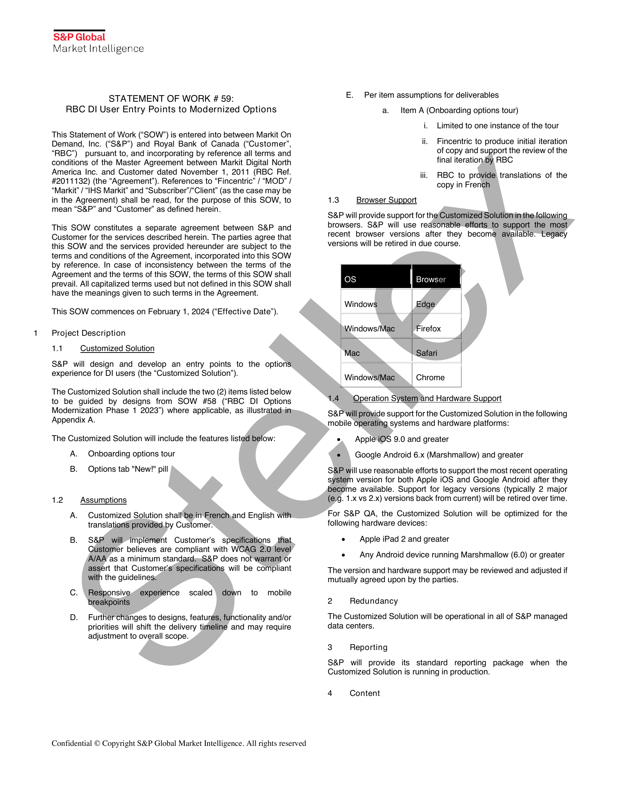
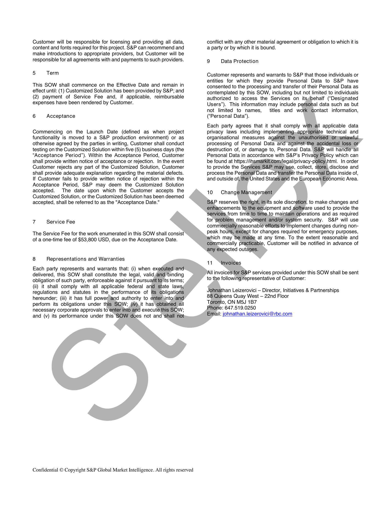
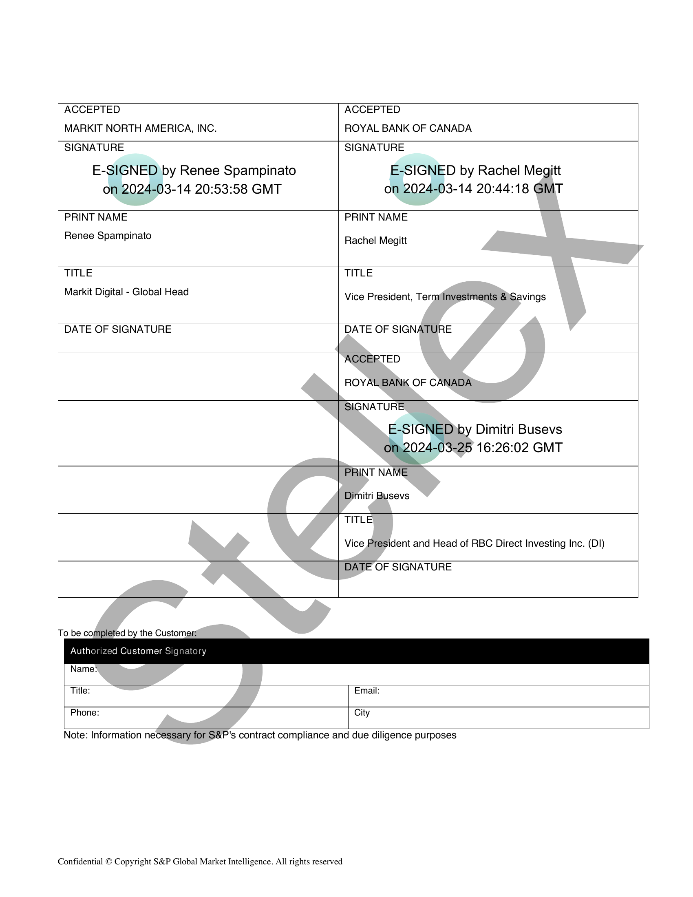
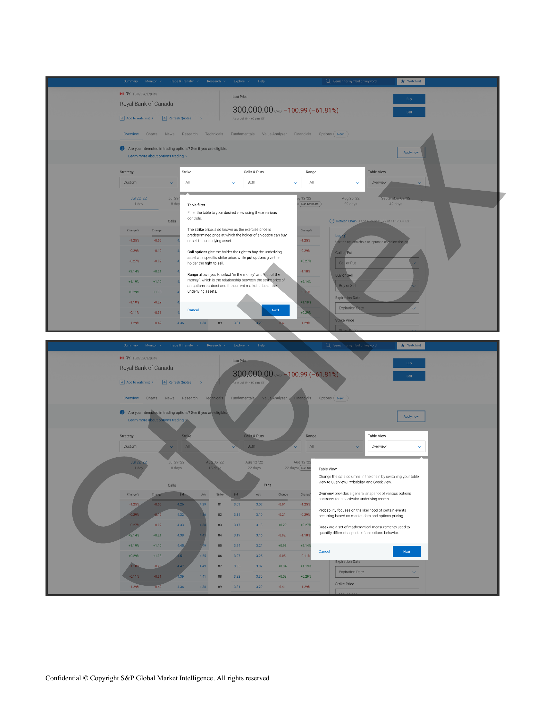
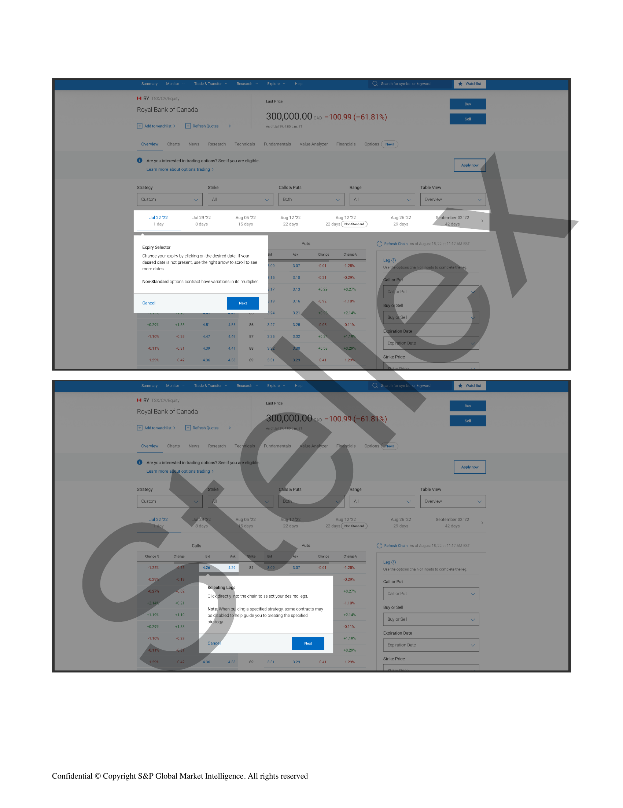
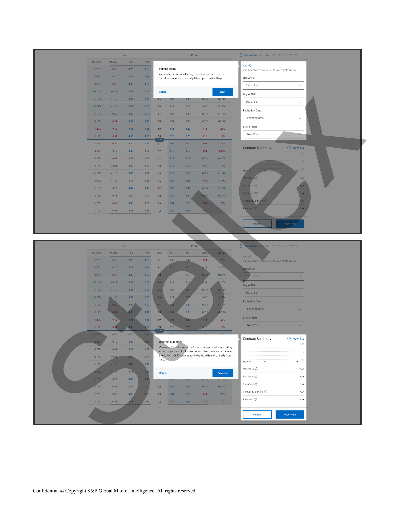
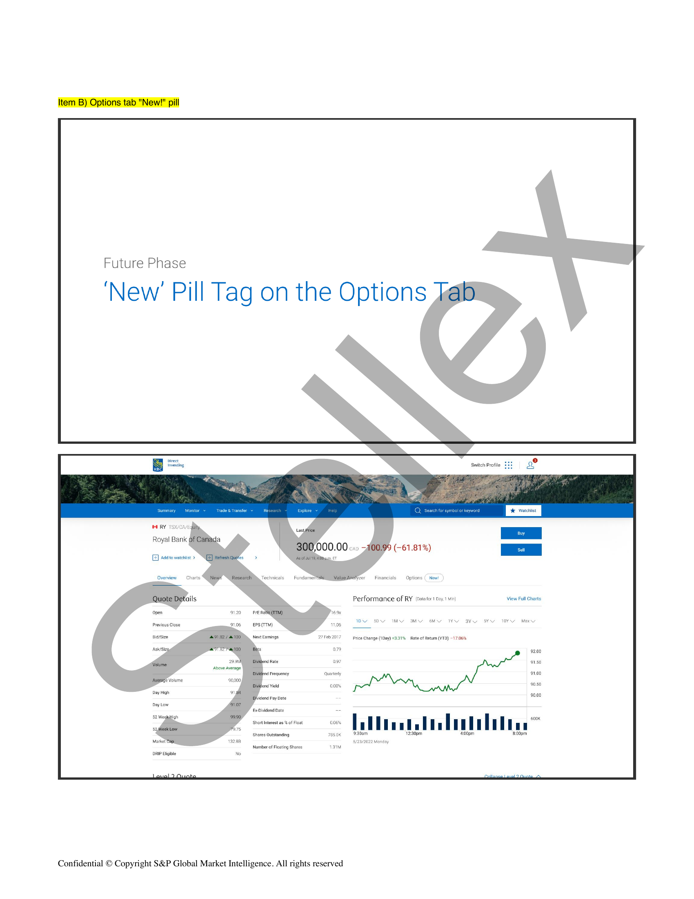

##### No title found]


````col
```col-md
flexGrow=.5
===
> [!info] [Page 1](_attachments/images_RBC-Parent-3.6.1.14.2.200258162.pdf_235818/page_1.png)
> 
```  
```col-md
S&P Global
Market Intelligence  
STATEMENT OF WORK 59:
RBC DI User Entry Points to Modernized Options  
This Statement of Work (“SOW”) is entered into between Markit On
Demand, Inc. (“S&P”) and Royal Bank of Canada (“Customer’,
“RBC’) pursuant to, and incorporating by reference all terms and
conditions of the Master Agreement between Markit Digital North
America Inc. and Customer dated November 1, 2011 (RBC Ref.
#2011132) (the “Agreement”). References to “Fincentric” / “MOD” /
“Markit” / “IHS Markit” and “Subscriber’/“Client” (as the case may be
in the Agreement) shall be read, for the purpose of this SOW, to
mean “S&P” and “Customer” as defined herein.  
This SOW constitutes a separate agreement between S&P and
Customer for the services described herein. The parties agree that
this SOW and the services provided hereunder are subject to the
terms and conditions of the Agreement, incorporated into this SOW
by reference. In case of inconsistency between the terms of the
Agreement and the terms of this SOW, the terms of this SOW shall
prevail. All capitalized terms used but not defined in this SOW shall
have the meanings given to such terms in the Agreement.  
This SOW commences on February 1, 2024 (“Effective Date”).  
Project Description  
14 Customized Solution  
S&P will design and develop an entry points to the options
experience for DI users (the “Customized Solution”).  
The Customized Solution shall include the two (2) items listed below
to be guided by designs from SOW #58 (“RBC DI Options
Modernization Phase 1 2023”) where applicable, as illustratedsin
Appendix A.  
The Customized Solution will include the features listed below:
A. Onboarding options tour  
B. Options tab "New!" pill  
1.2 Assumptions  
A. Customized Solution shall'be in French,and English with
translations provideéd,by Customer.  
B. S&P will implement Customer's specifications that
Customer believes are compliant with WCAG 2)0\level
AJAA as a minimum standardesS&P does not warrant or
assert that Customer's’ specifications will be compliant
with the guidelines¢  
C. \ Responsive experience scaled\ down to mobile
breakpoints  
D. Further#legal/Changes to designs, features, functionality and/or
priorities will shift the delivery timeline and may require
adjustment to overall #legal/Scope.  
#legal/Confidential © Copyright S&P Global Market Intelligence. All rights reserved  
E. Per item assumptions for deliverables
a. _ Item A (Onboarding options tour)
i. #legal/Limited to one instance of the tour  
ii. Fincentric to produce initial iteration
of copy and support the review of the
final iterationdby RBC  
iii. RBC to provide translations of the
copy in French  
1.3 Browser Support  
S&P will provide support for the‘Customized Solutioniinthe following
browsers. S&P will use reasonable efforts to support the most
recent browser versions after they become available.“ Legacy
versions will be retired in due course.  
Os Browser
Windows | Edge  
| Windows/Mac Firefox  
, Mac Safari
Windows/Mac  
Chrome  
1.4 Operation System and Hardware Support  
S&P will provide support for the Customized Solution in the following
mobile operating systems and hardware platforms:  
e. Apple iOS 9.0 and greater
e¢ \ Google Android 6.x (Marshmallow) and greater  
S&P will use reasonable efforts to support the most recent operating
system version for both Apple iOS and Google Android after they
become available. Support for legacy versions (typically 2 major
(e.g. 1.x vs 2.x) versions back from current) will be retired over time.  
For S&P QA, the Customized Solution will be optimized for the
following hardware devices:  
e — Apple iPad 2 and greater  
e — Any Android device running Marshmallow (6.0) or greater
The version and hardware support may be reviewed and adjusted if
mutually agreed upon by the parties.
2 Redundancy
The Customized Solution will be operational in all of S&P managed
data centers.
3 Reporting
S&P will provide its standard reporting package when the  
Customized Solution is running in production.  
4 Content  
```
````
Notes:    
````col
```col-md
flexGrow=.5
===
> [!info] [Page 2](_attachments/images_RBC-Parent-3.6.1.14.2.200258162.pdf_235818/page_2.png)
> 
```  
```col-md
Customer will be responsible for licensing and providing all data,
content and fonts required for this project. S&P can recommend and
make introductions to appropriate providers, but Customer will be
responsible for all agreements with and payments to such providers.  
5 Term  
This SOW shall commence on the Effective Date and remain in
effect until: (1) Customized Solution has been provided by S&P; and
(2) payment of Service Fee and, if applicable, reimbursable
expenses have been rendered by Customer.  
6 Acceptance  
Commencing on the Launch Date (defined as when project
functionality is moved to a S&P production environment) or as
otherwise agreed by the parties in writing, Customer shall conduct
testing on the Customized Solution within five (5) business days (the
“Acceptance Period”). Within the Acceptance Period, Customer
shall provide written notice of acceptance or rejection. In the event
Customer rejects any part of the Customized Solution, Customer
shall provide adequate expla#legal/Nation regarding the material defects.
If Customer fails to provide written notice of rejection within the
Acceptance Period, S&P may deem the Customized Solution
accepted. The date upon which the Customer accepts the
Customized Solution, or the Customized Solution has been deemed
accepted, shall be referred to as the "Acceptance Date."  
7 Service Fee  
The Service Fee for the work enumerated in this SOW shall consist
of a one-time fee of $53,800 USD, due on the Acceptance Date.  
8 Representations and Warranties  
Each party represents and #legal/Warrants that: (i) when executed and
delivered, this SOW shall constitute the legal, validyand binding
obligation of such party, enforceable against it pursuant to its terms;
(ii) it shall comply with all applicable federal and state laws
regulations and statutes in the #legal/Performance of its obligations
hereunder; (iii) it has full power and authority to enter \intorand
perform its obligations under this SQW; (iv), it has obtained all
necessary corporate approvals to enter into and execute this SOW;
and (v) its #legal/Performance under this SOW does not and ‘shall not  
#legal/Confidential © Copyright S&P Global Market Intelligence. All rights reserved  
conflict with any other material agreement or obligation to which it is
a party or by which it is bound.  
9 Data Protection  
Customer represents and #legal/Warrants to S&P that those individuals or
entities for which they provide Personal Data to S&P have
consented to the processing and transfer of their Personal Data as
contemplated by this SOW, including but not #legal/Limited to individuals
authorized to access the Services on its¢behalf (“Designated
Users”). This information may include pefsonal data such as but
not #legal/Limited to names, titles and work contact information,
(‘Personal Data’).  
Each party agrees that it shall comply with all applicable data
privacy laws including implementing,appropriate technical and
organisational measures against the unauthorised) orguniawful
processing of Personal Data and against the accidental loss or
destruction of, or damage to, Personal Data. S&P will handle all
Personal Data in accordance with S&P’s Privacy Policy which can
be found at https://insmarkiticom/legal/privacy-policy.html. In order
to provide the Services S&P may use, collect, store, disclose and
process the Personal Data and transfer the Personal Data inside of,
and outside of; the United States and the European Economic Area.  
10 #legal/Change Management  
S&P reserves the right, in its sole discretion, to make #legal/Changes and
enhancements to the equipment and software used to provide the
services, from time to time.to maintain operations and as required
for problem management and/or system security. S&P will use
commercially\reasonable efforts to implement #legal/Changes during nonpeak hours, except for #legal/Changes required for emergency purposes,
which may be made at any time. To the extent reasonable and
commercially practicable, Customer will be notified in advance of
any expected outages.  
11 “Invoices  
All invoices for S&P services provided under this SOW shall be sent
to the following representative of Customer:  
Johnathan Leizerovici — Director, Initiatives & Partnerships
88 Queens Quay West — 22nd Floor  
Toronto, ON M5J 1B7  
Phone: 647.519.0250  
Email: johnathan.leizerovici@rbc.com  
```
````
Notes:    
````col
```col-md
flexGrow=.5
===
> [!info] [Page 3](_attachments/images_RBC-Parent-3.6.1.14.2.200258162.pdf_235818/page_3.png)
> 
```  
```col-md
E-SIGNED by Renee Spampinato
on 2024-03-14 20:53:58 GMT  
ACCEPTED ACCEPTED
MARKIT NORTH AMERICA, INC. ROYAL BANK OF CANADA
SIGNATURE SIGNATURE  
E-SIGNED by Rachel Megitt
on 2024-03-14 20:44:18 GMT  
PRINT NAME  
Renee Spampinato  
PRINT NAME  
Rachel Megitt  
TITLE
Markit Digital - Global Head  
TITLE  
Vice President, Term Investments & Savings  
DATE OF SIGNATURE  
DATE OF SIGNATURE  
ACCERTED  
ROYAL BANK OF CANADA  
SIGNATURE  
E-SIGNED)by Dimitri Busevs
on.2024- 3-25 16:26:02 GMT  
PRINT NAME  
Dimitri Busevs  
TITLE  
Vice President and Head of RBC Direct Investing Inc. (Dl)  
DATE OF SIGNATURE
To be completed by the Customer:
Authorized Customer Signatory
Name:
Title: Email:
Phone: City  
Note: Information necessary for S&P's contract compliance and due diligence purposes  
#legal/Confidential © Copyright S&P Global Market Intelligence. All rights reserved  
```
````
Notes:    
````col
```col-md
flexGrow=.5
===
> [!info] [Page 4](_attachments/images_RBC-Parent-3.6.1.14.2.200258162.pdf_235818/page_4.png)
> 
```  
```col-md
Appendix A: Initial concepts per item  
Item A (Onboarding options tour)  
In Process Designs
Onboarding Options Tour wit
Coach Marks  
#legal/Confidential © Copyright S&P Global Market Intelligence. All rights reserved  
```
````
Notes:    
````col
```col-md
flexGrow=.5
===
> [!info] [Page 5](_attachments/images_RBC-Parent-3.6.1.14.2.200258162.pdf_235818/page_5.png)
> 
```  
```col-md
Calls & Puts  
3  
Table fier  
Filter the table to your desired view using these various
contr  
‘The strike price, also knawn as the exercise price is
predetermined price at which the holder of an option can buy
cr sell the underlying asset  
Call options give the holder the right to buy the underlying
asset ata specific strike price, while put options give the
hholder the right to sel,  
Range allows you to select “in the money’ and  
Which isthe relationship between the strik
‘an options contract and the current market price of th
underlying assets  
Table View  
Table View  
#legal/Change the data columns in the chain by switching your table
view to Overvi iy and Greek view.  
‘a general snapshot of various options
18 fora particular underlying assets  
Probability focuses on the likelihood of certain events
‘occurring based on market data and options pricin  
Greek are a set of mathematical measurements used to
‘quantify different aspects of an optior's behavior.  
#legal/Confidential © Copyright S&P Global Market Intelligence. All rights reserved  
```
````
Notes:    
````col
```col-md
flexGrow=.5
===
> [!info] [Page 6](_attachments/images_RBC-Parent-3.6.1.14.2.200258162.pdf_235818/page_6.png)
> 
```  
```col-md
sul 22:22 Jul29°2 ug 05 2 1222 ‘Aug 26 22
1 day 15 dey —"))  
Expiry Selector  
#legal/Change your expiry by clicking on the desired date. If your
ied date is not present, use the night artow to scroll to:
redates  
Non-Standard options contract have variations in its multiplier.  
io the chain to select your desired legs.  
ding a specified strategy, some contracts may
lp guide 9 the specified  
#legal/Confidential © Copyright S&P Global Market Intelligence. All rights reserved  
```
````
Notes:    
````col
```col-md
flexGrow=.5
===
> [!info] [Page 7](_attachments/images_RBC-Parent-3.6.1.14.2.200258162.pdf_235818/page_7.png)
> 
```  
```col-md
Manual Inputs the eptions chain ar inputs to complet  
‘Asan alternative to selecting the chain, you can use the
dropdown inouts to manually fill out your desired legs. Call or Put  
Call or Put v  
Buy or Sell  
Buy or Sell  
Expiration Date  
Strike Price  
Contract Summary VY Watchlist  
yy here before taking
ew the analyze page at  
Max Profit ©  
areakeven @
Probability of Profit @  
Premium @  
#legal/Confidential © Copyright S&P Global Market Intelligence. All rights reserved  
```
````
Notes:    
````col
```col-md
flexGrow=.5
===
> [!info] [Page 8](_attachments/images_RBC-Parent-3.6.1.14.2.200258162.pdf_235818/page_8.png)
> 
```  
```col-md
Future Phase  
‘New’ Pill Tag on the Options  
ore
Bo Switch Profile  
Royal Bank
9 (-61.81%)  
[E] Aad to watehist »
Technicals Fundamer 5 Financials Options (New! )
#legal/Performance of RY (lata fer pay.1 Min) View Full Charts
proiousch WY SD IM MY OM YY BY BY TOY Macy
Nest Eamings 27%eb 2017 pace #legal/Change (IDay) +3:91% Rate of Retum (YTD) ~17.065
o7
097
uetery  
00%  
ExcDividend Date  
PLU ee
a  
‘Shores Outstanding 9:30am ‘00pm
5/23/2022 Menday
‘Number of Flozting Shares  
#legal/Confidential © Copyright S&P Global Market Intelligence. All rights reserved  
```
````
Notes:  


![[_attachments/RBC-Parent-3.6.1.14.2.2 00258162.pdf]