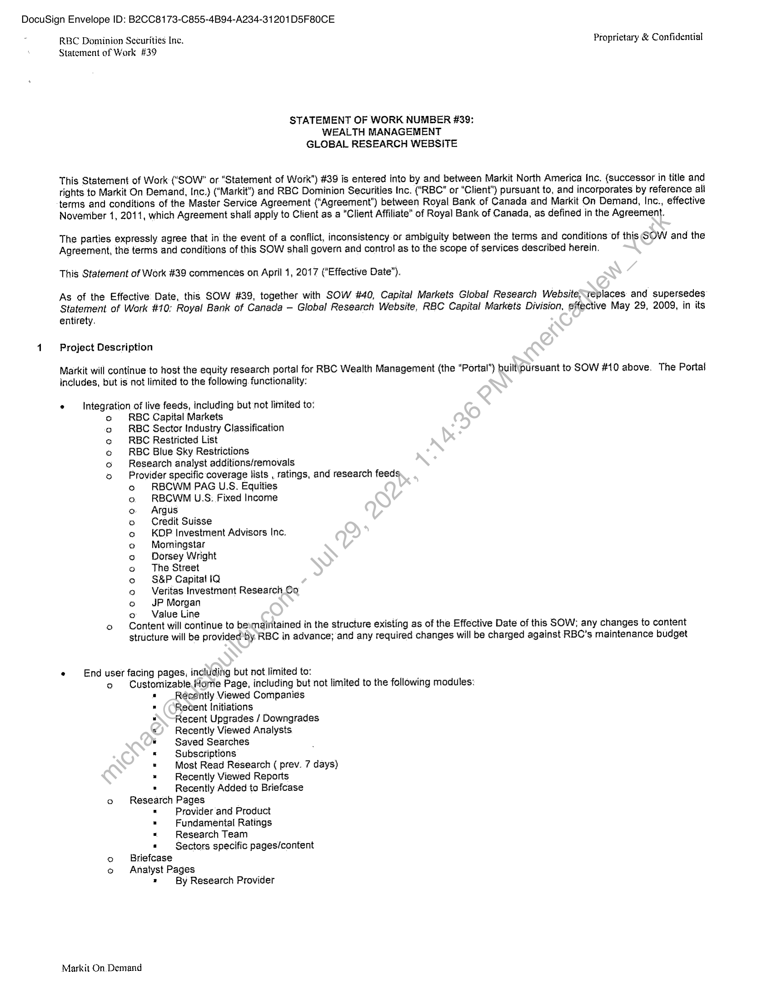
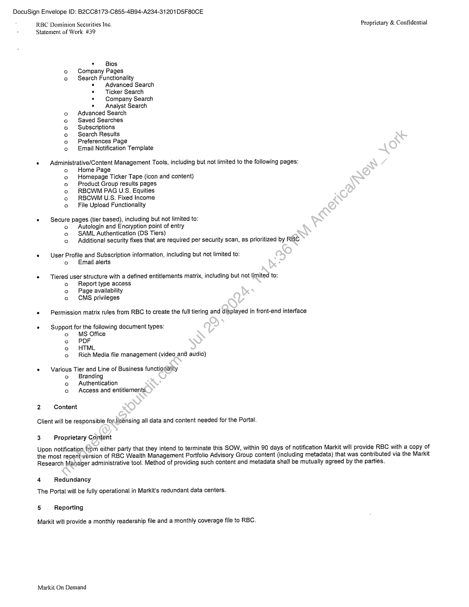
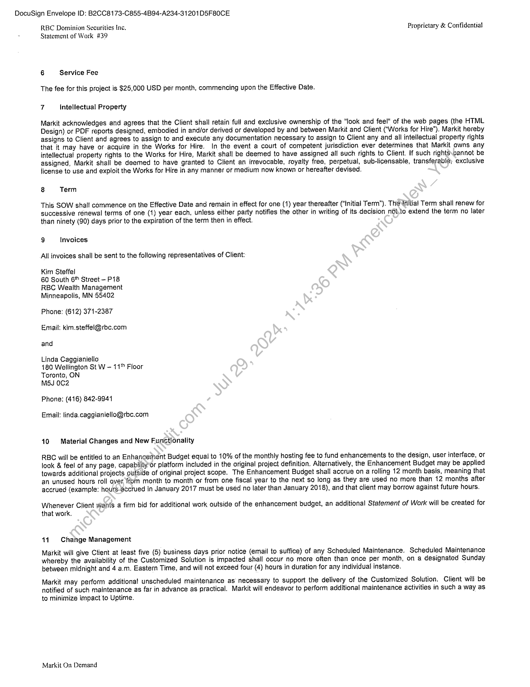
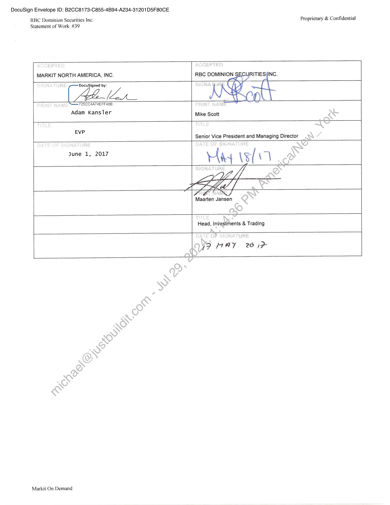
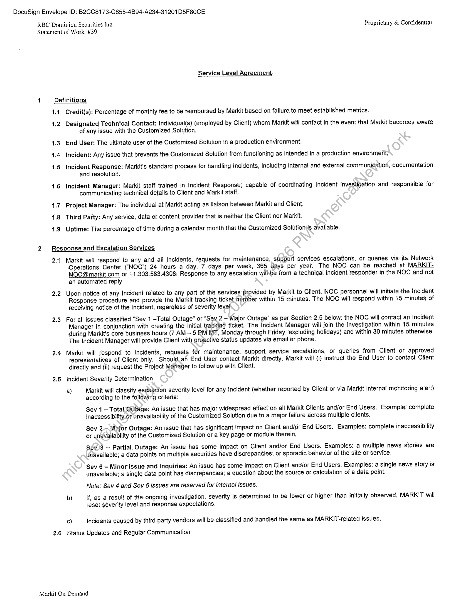
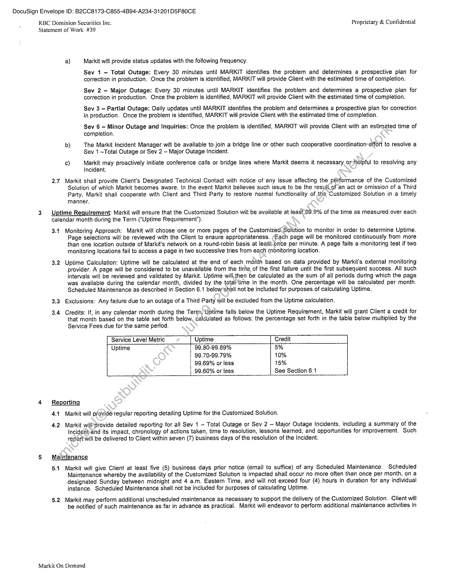
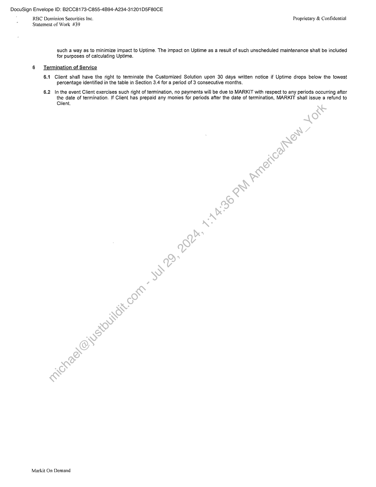

##### No title found]


````col
```col-md
flexGrow=.5
===
> [!info] [Page 1](_attachments/images_RBC-Parent-3.6.1.14.2.300205124.pdf_235823/page_1.png)
> 
```  
```col-md
DocuSign Envelope ID: B2CC8173-C855-4B94-A234-31201D5F80CE  
RBC Dominion Securities Inc. Proprietary & #legal/Confidential
Statement of Work #39  
STATEMENT OF WORK NUMBER #39:
WEALTH MANAGEMENT
GLOBAL RESEARCH WEBSITE  
This Statement of Work (‘SOW” or. “Statement of Work”) #39 is entered into by and between Markit North America Inc. (successor in title and
rights. to Markit On Demand, Inc.) (‘Markit’) and RBC Dominion Securities Inc. ("RBC” or “Client") pursuant to, and incorporates by reference all
terms and conditions of the Master Service Agreement ("Agreement") between Royal Bank of Canada and Markit On Demand, Inc., effective
November 1, 2011, which Agreement shall apply to Client as a "Client Affiliate" of Royal Bank of Canada, as defined in the Agreement.  
The parties expressly agree that in the event of a conflict, inconsistency or ambiguity between the terms and conditions of this SOW and the
Agreement, the terms and conditions of this SOW shall govern and contro! as to the #legal/Scope of services described herein.  
This Statement of Work #39 commences on April 1, 2017 ("Effective Date”).  
As of the Effective: Date, this SOW #39, together with SOW #40, Capital Markets Global Research Website\replaces and supersedes
Statement of Work #10: Royal Bank of Canada — Global Research Website, RBC Capital Markets Division, effective May 29, 2009, in its
entirety.  
1 Project Description  
Markit will continue to host the equity research portal for RBC Wealth Management (the “Portal”) built\pursuant to SOW #10 above. The Portal
includes, but is not #legal/Limited to the following. functionality:  
¢ Integration of live feeds, including but not #legal/Limited to:
o RBC Capital Markets  
RBC Sector Industry Classification  
RBC Restricted List  
RBC Blue Sky Restrictions  
Research analyst additions/removals  
Provider specific coverage lists , ratings, and research feeds  
o RBCWM PAG U.S. Equities  
RBCWM U.S. Fixed Income  
Argus  
Credit Suisse  
KOP Investment Advisors Inc.  
Morningstar  
Dorsey Wright  
The Street  
S&P Capital }Q  
Veritas Investment Research Co  
JP Morgan  
o Value Line
© Content will continue to besmaintained in the structure existing as of the Effective Date of this SOW; any #legal/Changes to content  
structure will be provided’by RBC in advance; and any required #legal/Changes will be charged against RBC's maintenance budget  
ocooo$n  
eogoagogcdnd  
« End user facing pages, including but not #legal/Limited to:
e@ Customizable ome Page, including but not #legal/Limited to the following modules:
« Recently Viewed Companies
Recent Initiations
Recent Upgrades / Downgrades
Recently Viewed Analysts.
Saved Searches
Subscriptions
Most Read Research ( prev. 7 days)
Recently Viewed ReportsRecently Added to Briefcase
o Research Pages
* Provider and ProductFundamental RatingsResearch TeamSectors specific pages/content
o Briefcase
o Analyst PagesBy Research Provider  
Markit On Demand  
```
````
Notes:    
````col
```col-md
flexGrow=.5
===
> [!info] [Page 2](_attachments/images_RBC-Parent-3.6.1.14.2.300205124.pdf_235823/page_2.png)
> 
```  
```col-md
DocuSign Envelope ID: B2CC8173-C855-4B94-A234-31201D5F80CE  
RBC Dominion Securities Inc. Proprietary & #legal/Confidential
Statement of Work #39  
. Bios
o Company Pages
© Search Functionality
= Advanced Search
«Ticker Search
* Company Search
» Analyst Search
Advanced Search
Saved Searches
Subscriptions
Search Results
Preferences Page
Email Notification Template  
ocoog 00  
«  Administrative/Content Management Tools, including but not #legal/Limited to the following pages:
o Home Page  
Homepage Ticker Tape (icon and content)  
Product Group results pages  
RBCWM PAG U.S. Equities  
RBCWM U.S. Fixed Income  
File Upload Functionality  
ooo00  
° Secure pages (tier based), including but not #legal/Limited to:
o Autologin and Encryption point of entry
o SAML Authentication (DS Tiers)
o Additional security fixes that are required per security scan, as prioritized by RBC  
e _User Profile and Subscription information, including but not #legal/Limited to:
o Email alerts  
e Tiered user.structure with a defined entitlements matrix, including but not #legal/Limited to:
o Report type access
o Page availability
o CMS privileges
e Permission matrix rules from RBC to create the full tiering and displayed in front-end interface  
¢ — Support forthe following document types:  
o MS Office  
o PDF  
o HTML  
o Rich Media file management (video and audio)  
e Various Tier and Line of Business functionality
a Branding
o Authentication
© Access and entitlements,  
2 Content
Client wil! be responsible for licensing all data and content needed for the Portal.  
3 Proprietary Content  
Upon notification, from either party that they intend to terminate this SOW, within 90 days of notification Markit wil! provide RBC with a copy of
the most recent-version of RBC Wealth Management Portfolio Advisory Group content (including metadata) that was contributed via the Markit
Research Manager administrative tool. Method of providing such content and metadata shall be mutually agreed by the parties.  
4 Redundancy
The Portal will be fully operational in Markit's redundant data centers.  
5 Reporting  
Markit will provide a monthly readership file and a monthly coverage file to RBC.  
Markit On Demand  
```
````
Notes:    
````col
```col-md
flexGrow=.5
===
> [!info] [Page 3](_attachments/images_RBC-Parent-3.6.1.14.2.300205124.pdf_235823/page_3.png)
> 
```  
```col-md
DocuSign Envelope ID: B2CC8173-C855-4B94-A234-31201D5F80CE  
RBC Dominion Securities Inc. Proprietary & #legal/Confidential
Statement of Work #39  
6 Service Fee  
The fee for this project is $25,000 USD per month, commencing upon the Effective Date.  
7 {ntellectual Property  
Markit acknowledges and agrees that the Client shail retain full and exclusive ownership of the "look and feel" of the web pages (the HTML
Design) or PDF reports designed, embodied in and/or derived or developed by and between Markit and Client (“Works for Hire"). Markit hereby
assigns to Client and agrees to assign to and execute any documentation necessary to assign to Client any and all #legal/Intellectual_Property rights
that it may have or acquire in the Works for Hire. In the event a court of competent jurisdiction ever determines that Markit owns any
#legal/Intellectual_Property rights to the Works for Hire, Markit shall be deemed to have assigned all such rights to Client. if such rights\cannot be
assigned, Markit shall be deemed to have granted to Client an irrevocable, royalty free, perpetual, sub-licensable, transferable; exclusive
license to use and exploit the Works for Hire in.any manner or medium now known or hereafter devised,  
8 Term  
Thig SOW shall commence on the Effective Date and remain in effect for one (1) year thereafter (“#legal/Initial_Term”). The nitial Term shall #legal/Renew for
successive rénewal terms of one (1) year each, unless either party notifies the other in writing of its decision nob.to extend the term no later
than ninety (90) days prior to the expiration of the term then in effect.  
9 Invoices
All invoices shall be sent to the following representatives of Client:  
Kim Steffel  
60 South 6" Street - P18
RBC Wealth Management
Minneapolis, MN 55402  
Phone: (612) 371-2387
Email: kim.steffel@rbc.com
and  
Linda Caggianiello  
180 Wellington St W — 11" Floor
Toronto, ON  
MSJ 0C2  
Phone: (416) 842-9941  
Email: linda.caggianiello@rbc.com  
10 Material #legal/Changes and New Functjonality  
RBC will be entitled to an Enhancement Budget equal to 10% of the monthly hosting fee to fund enhancements to the design, user interface, or
look & feel of any page, capabilityor platform included in the original project definition. Alternatively, the Enhancement Budget may be applied
towards additional projects outside of original project #legal/Scope. The Enhancement Budget shall accrue on a rolling 12 month basis, meaning that
an unused hours roll over from month to month or from one fisca! year to the next so long as they are used no more than 12 months after
accrued (example: hours-accrued in January 2017 must be used no later than January 2018), and that client may borrow against future hours.  
Whenever Client wariis a firm bid for additional work outside of the enhancement budget, an additional Statement of Work will be. created for
that work.  
W1 #legal/Change Management  
Markit will give Client at feast five (5) business days prior notice (email to. suffice) of any Scheduled Maintenance, Scheduled Maintenance
whereby the availability of the Customized Solution is impacted shall occur no more often than once per month, on a designated Sunday
between midnight and 4 a.m. Eastern Time, and will not #legal/Exceed four (4) hours in duration for any individual instance.  
Markit may perform additional unscheduled maintenance as necessary to support the delivery of the Customized Solution. Client will be
notified of such maintenance as far in advance as practical. Markit will endeavor to perform additional maintenance activities in such a way as  
to minimize impact to #legal/Uptime.  
Markit On Demand  
```
````
Notes:    
````col
```col-md
flexGrow=.5
===
> [!info] [Page 4](_attachments/images_RBC-Parent-3.6.1.14.2.300205124.pdf_235823/page_4.png)
> 
```  
```col-md
DocuSign Envelope ID: B2CC8173-C855-4B94-A234-31201D5F80CE  
RBC Dominion Securities Inc. Proprietary & #legal/Confidential
Statement of Work #39  
MARKIT NORTH AMERICA, INC. RBC DOMINION S$ RITIES (INC.  
DocuSigned by:  
AMA  
725CC4A7 4EFF40B  
Adam Kansler Mike Scott  
EVP.
Senior Vice President and Managing Director  
june 1, 2017 Hay \s( i  
Maarten Jansen  
Head, Investments & Trading  
7/9 HAY 201%  
Markit On Demand  
```
````
Notes:    
````col
```col-md
flexGrow=.5
===
> [!info] [Page 5](_attachments/images_RBC-Parent-3.6.1.14.2.300205124.pdf_235823/page_5.png)
> 
```  
```col-md
DocuSign Envelope ID: B2CC8173-C855-4B94-A234-31201D5F80CE  
RBC Dominion Securities Inc. Proprietary & #legal/Confidential
Statement of Work #39  
1  
2  
Service Level Agreement  
Definitions
1.1 Credit(s): Percentage of monthly fee to be reimbursed by Markit based on failure to meet established metrics.  
4,2 Designated Technical Contact: individual(s) (employed by Client) whom Markit will contact in the event that Markit becomes aware
of any issue with the Customized Solution.  
4.3 End User: The ultimate user of the Customized Solution in a production environment.
4.4 Incident: Any issue that prevents the Customized Solution from functioning as intended in a production environment,  
1.5 Incident Response: Markit's standard process for handling Incidents, including internal and external communic¢ation, documentation
and resolution.  
4.6 Incident Manager: Markit staff trained in Incident Response; capable of coordinating Incident investigation and responsible for
communicating technical details to Client and Markit staff.  
4.7. Project Manager: The individual at Markit acting as liaison between Markit and Client.
4.8 Third Party: Any service, data or content provider that is neither the Client nor Markit.  
4.9 #legal/Uptime: The percentage of time during a calendar month that the Customized Solutions available.  
Response and Escalation Services  
2.1. Markit will respond to any and. all Incidents, requests for maintenance, support services escalations, or queries via. its. Network
Operations Center ("NOC") 24 hours a day, 7 days per week, 365 days per year. The NOC can be reached at MARKITNOC@markit.com or +1:303.583,4308. Response to any escalation willbe from a technical incident responder in the NOC and not
an automated reply.  
2.2 Upon notice of any Incident related to any part of the services provided by Markit to Client, NOC personnel will initiate the Incident
Response procedure and provide the Markit tracking ticket number within 15 minutes. The NOC will respond within 15 minutes of
receiving notice of the Incident, regardless of severity level.  
2.3 For all issues classified “Sev 1 -Total Outage” or “Sev 2 - Major Outage” as per Section 2.5 below, the NOC will contact an Incident
Manager in conjunction with creating the initial tracking ticket. The Incident Manager will join the investigation within 15. minutes
during Markit's core business hours (7 AM — 5 PM I, Monday through Friday, excluding holidays) and within 30 minutes otherwise.
The Incident Manager will provide Client with proactive status updates via email or phone.  
2.4 Markit will respond to Incidents, requests for maintenance, support service escalations, or queries from Client or approved
representatives of Client only, Should an End User contact Markit directly, Markit will (i) instruct the End User to contact Client
directly and (ii) request the Project Manager to follow up with Client.  
2.5 incident Severity De#legal/Termination  
a) Markit-wil classify escalation severity level for any Incident (whether reported by Client or via Markit interna! monitoring alert)
according to the following criteria:  
Sev 1 ~ Total Outage: An issue that has major widespread effect on all Markit Clients and/or End Users. Example: complete
inaccessibility or unavailability of the Customized Solution due to a major failure across multiple clients.  
Sev 2 Major Outage: An issue that has. significant impact on Client and/or End Users. Examples: complete inaccessibility
or unaVuilability of the Customized Solution or a key page or module therein,  
Sdv13 - Partial Outage: An issue has some impact on Client and/or End Users. Examples: a multiple news stories are
Unavailable; a data points on multiple securities have discrepancies; or sporadic behavior of the site or service.  
Sev 6 - Minor issue and Inquiries: An issue has some impact on Client and/or End Users. Examples: a single news story is
unavailable; a single data point has discrepancies; a question about the source or calculation of a data point.  
Note: Sev 4 and Sev 5 issues are reserved for internal issues.  
b) If, as a result of the ongeing investigation, severity is determined to be lower or higher than initially observed, MARKIT will
reset severity level and response expectations,  
ce} Incidents caused by third party vendors will be:classified and handled the-same as MARKIT-related issues.  
2.6 Status Updates and Regular Communication  
Markit On Demand  
```
````
Notes:    
````col
```col-md
flexGrow=.5
===
> [!info] [Page 6](_attachments/images_RBC-Parent-3.6.1.14.2.300205124.pdf_235823/page_6.png)
> 
```  
```col-md
DocuSign Envelope ID: B2CC8173-C855-4B94-A234-31201D5F80CE  
RBC Dominion Securities Inc. Proprietary & Contidential
Statement of Work #39  
3  
4  
a) Markit will provide status updates with the following frequency:  
Sev 1 - Total Outage: Every 30 minutes until MARKIT identifies the problem and determines a prospective plan for
correction in production. Once the. problem is.identified, MARKIT will provide Client with the estimated time of completion.  
Sev 2 -— Major Outage: Every 30 minutes until MARKIT identifies the problem and determines a prospective plan for
correction in production. Once the problem is identified, MARKIT will provide Client with the estimated time of completion,  
Sev 3 - Partial Outage: Daily updates until MARKIT identifies the problem and determines a prospective plan for correction
in production. Once the problem is identified, MARKIT will provide Client with the estimated time of compietion.  
Sev 6 = Minor Outage and Inquiries: Once the problem is identified, MARKIT will provide Client with an estimated time of
completion.  
b) The Markit Incident Manager will be available to join a bridge line or other such cooperative coordi#legal/Nation-effort to. resolve a
Sev 1 —Total Outage or Sev 2 — Major Outage Incident.  
c) Markit may proactively initiate conference calls or bridge fines where Markit deems it necessary or-Helpful to. resolving any
Incident.  
2.7. Markit shail provide Client's Designated Technical Contact with notice of any issue affecting the #legal/Performance of the Customized
Solution of which Markit becomes aware. In the event Markit believes such issue to be the resull.of an act or omission of a Third
Party, Markit shall cooperate with Client and Third Party to restore normal functionality of the Customized Solution in a timely
manner,  
#legal/Uptime Requirement: Markit will ensure that the Customized Solution will be available at least99.9% of the time as measured over each
calendar month during the Term ("#legal/Uptime Requirement’).  
3.4 Monitoring Approach: Markit will choose one or more pages of the Customized Solution to monitor in order to determine #legal/Uptime,
Page selections will be reviewed with the Client to ensure appropriateness. (Each page will be monitored continuously from more
than one location outside of Markit's network on a round-robin basis at leaSt-once per minute. A page fails a monitoring test if two
monitoring locations fail to access a page in two successive tries from each monitoring location.  
3.2 #legal/Uptime Calculation: #legal/Uptime will be calculated at the end of each month based on data provided by Markit's external monitoring
provider. A page will be considered to be unavailable from the time of the first failure until the first subsequent success. All such
intervals will be reviewed and validated by Markit. #legal/Uptime will,then be calculated as the sum of all periods during which the page
was available during the calendar month, divided by the totaltime in the month. One percentage will be calculated per month.
Scheduled Maintenance as described in Section 6.1 below’shall not be included for purposes of calculating #legal/Uptime.  
3.3 #legal/Exclusions: Any failure due to an outage of a Third Party will be excluded from the #legal/Uptime calculation.  
3.4 Credits: If, in any calendar month during the Terny, #legal/Uptime falls below the #legal/Uptime Requirement, Markit will grant Client a credit for
that month based on the table set forth below, calculated as follows; the percentage set forth in the table below multiplied by the
Service #legal/Fees due for the same period.  
Senvice Level Matic  
99.80-99.89%
99.70-99.79%
99.69% or less
99.60% or less  
5%  
10%  
15%  
See Section 6.1  
Reporting
4.1 Markit will providé regular reporting detailing #legal/Uptime for the Customized Solution.  
4.2 Markit wilPprovide detailed reporting for all Sev 1 — Total Outage or Sev 2 — Major Outage Incidents, including a summary of the
Incidénb-and its impact, chronology of actions taken, time to resolution, lessons learned, and opportunities for improvement. Such
reportwill be delivered to Client within seven (7) business days of the resolution of the Incident.  
Maintenance  
5.1 Markit wil! give Client at least five (5) business days prior notice (email to suffice) of any Scheduled Maintenance. Scheduled
Maintenance whereby the availability of the Customized Solution is impacted shall occur no more often than once per month, on a
designated Sunday between midnight and 4 a.m. Eastern Time, and will not #legal/Exceed four (4). hours in duration for any individual
instance. Scheduled Maintenance shall not be included for purposes of calculating #legal/Uptime.  
5.2 Markit may perform additional unscheduled maintenance as necessary to support the delivery of the Customized Solution. Client will
be notified of such maintenance as far in advance as practical. Markit will endeavor to perform additional maintenance activities in  
Markit On Demand  
```
````
Notes:    
````col
```col-md
flexGrow=.5
===
> [!info] [Page 7](_attachments/images_RBC-Parent-3.6.1.14.2.300205124.pdf_235823/page_7.png)
> 
```  
```col-md
DocuSign Envelope ID: B2CC8173-C855-4B94-A234-31201D5F80CE  
RBC Dominion Securities Inc.  
Proprietary & #legal/Confidential
Statement of Wark 439  
such a way as to minimize impact to #legal/Uptime. The impact on #legal/Uptime as a result of such unscheduled maintenance shail be included
for purposes of calculating #legal/Uptime.  
6 #legal/Termination of Service  
6.1 Client shall have the right to terminate the Customized Solution upon 30 days written notice if #legal/Uptime drops below the towest
percentage identified in the table in Section 3.4 for a period of 3 consecutive months.  
6.2 In the event Client exercises such right of #legal/Termination, no payments will be due to MARKIT with respect to any periods occurring after  
the date of #legal/Termination. If Client has prepaid any monies for periods after the date of #legal/Termination, MARKIT shall issue a refund to
Client.  
Markit On Demand  
```
````
Notes:  


![[_attachments/RBC-Parent-3.6.1.14.2.3 00205124.pdf]