##### No title found]


````col
```col-md
flexGrow=.5
===
> [!info] [Page 1](_attachments/images_RBC-Parent-3.6.1.14.2.4RBC-MSA.pdf_235840/page_1.png)
> 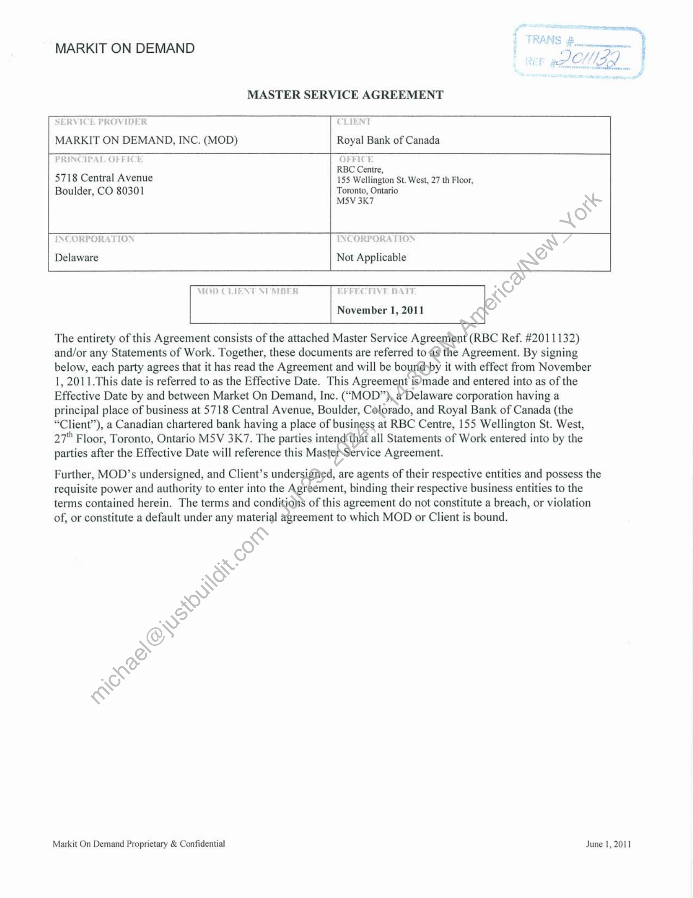
```  
```col-md
MARKIT ON DEMAND  
MASTER SERVICE AGREEMENT  
SERVICE PROVIDER  
MARKIT ON DEMAND, INC. (MOD)  
CLIENT
CLIENT  
Royal Bank of Canada  
PRINCIPAL OFFICE  
5718 Central Avenue
Boulder, CO 80301  
RBC Centre,
155 Wellington St. West, 27 th Floor,
Toronto, Ontario  
MSV 3K7  
INCORPORATION INCORPORATION  
Delaware Not Applicable  
November 1, 2011  
The entirety of this Agreement consists of the attached Master Service Agreenient (RBC Ref. #2011132)
and/or any Statements of Work. Together, these documents are referred to 4s the Agreement. By signing
below, each party agrees that it has read the Agreement and will be bourid»by it with effect from November
1, 2011.This date is referred to as the Effective Date. This Agreement is’made and entered into as of the
Effective Date by and between Market On Demand, Inc. (“MOD”), a Delaware corporation having a
principal place of business at 5718 Central Avenue, Boulder, Colorado, and Royal Bank of Canada (the
“Client”), a Canadian chartered bank having a place of business at RBC Centre, 155 Wellington St. West,
27" Floor, Toronto, Ontario MSV 3K7. The parties intend that all Statements of Work entered into by the
parties after the Effective Date will reference this MasterService Agreement.  
Further, MOD’s undersigned, and Client’s undersigned, are agents of their respective entities and possess the
requisite power and authority to enter into the Agreement, binding their respective business entities to the
terms contained herein. The terms and conditions of this agreement do not constitute a #legal/Breach, or violation
of, or constitute a default under any material agreement to which MOD or Client is bound.  
Markit On Demand Proprietary & #legal/Confidential June 1, 2011  
```
````
Notes:    
````col
```col-md
flexGrow=.5
===
> [!info] [Page 2](_attachments/images_RBC-Parent-3.6.1.14.2.4RBC-MSA.pdf_235840/page_2.png)
> 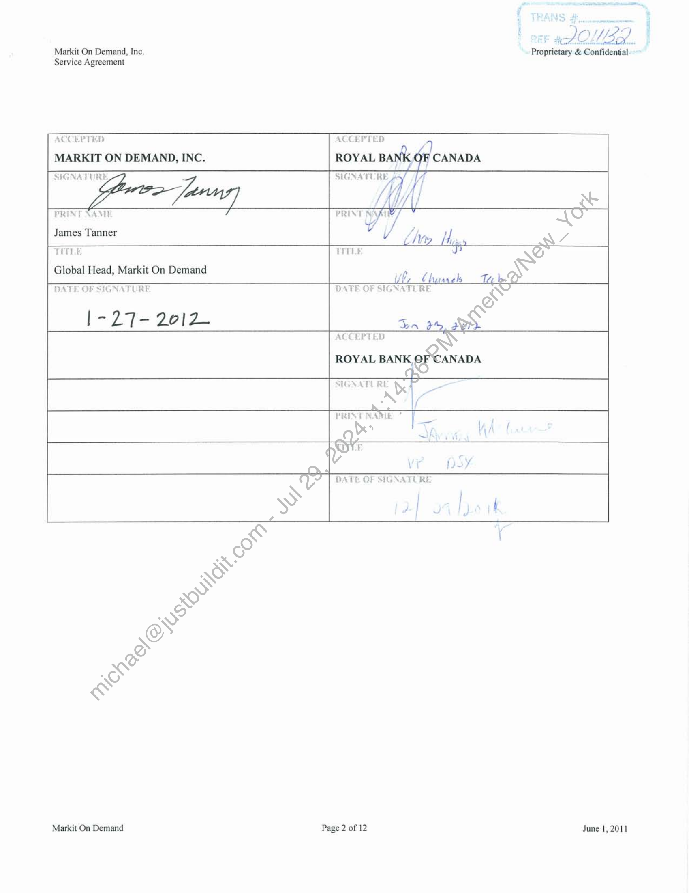
```  
```col-md
7) LOS /Markit On Demand, Inc. Proprietary & #legal/Confidential
Service Agreement  
ACCEPTED ACCEPTED  
MARKIT ON DEMAND, INC. ROYAL BA
SIGNATURE  
PRINT NAME  
James Tanner  
TiThé ~
Global Head, Markit On Demand 7 \
d ALIA
DATE OF SIGNATURE DATE OF SIGNATURE WS
@
|-27- 2012 in 139s
ACCEPTED
ROYAL BANK OF CANADA  
SIGNATURE 3
nde] -  
PRINT HE , |  
*e  
Markit On Demand Page 2 of 12 June 1, 2011  
```
````
Notes:    
````col
```col-md
flexGrow=.5
===
> [!info] [Page 3](_attachments/images_RBC-Parent-3.6.1.14.2.4RBC-MSA.pdf_235840/page_3.png)
> 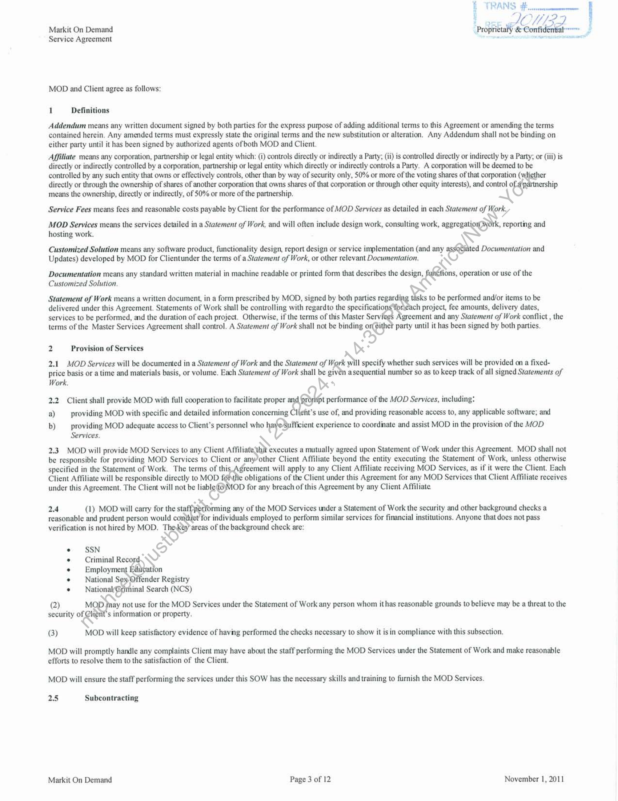
```  
```col-md
RANS cme
sce JOULE?
Markit On Demand Proprietary ALM OE  
Service Agreement  
erage  
MOD and Client agree as follows:  
1 Definitions  
Addendum means any written document signed by both parties for the express purpose of adding additional terms to this Agreement or amending the terms
contained herein. Any amended terms must expressly state the original terms and the new substitution or alteration. Any Addendum shall not be binding on
either party until it has been signed by authorized agents of both MOD and Client.  
Affiliate means any corporation, partnership or legal entity which: (i) controls directly or indirectly a Party; (ii) is controlled directly or indirectly by a Party; or (iii) is
directly or indirectly controlled by a corporation, partnership or legal entity which directly or indirectly controls a Party. A corporation will be deemed to be
controlled by any such entity that owns or effectively controls, other than by way of security only, 50% or more of the voting shares of that corporation (' er
directly or through the ownership of shares of another corporation that owns shares of that corporation or through other equity interests), and control es ership
means the ownership, directly or indirectly, of 50% or more of the partnership.  
Service #legal/Fees means #legal/Fees and reasonable costs payable by Client for the #legal/Performance of MOD Services as detailed in each Statement of (ork,  
MOD Services means the services detailed in a Statement of Work, and will often include design work, consulting work, aggregat ionpy k, reporting and
hosting work.  
Customized Solution means any software product, functionality design, report design or service implementation (and any ited Documentation and  
Updates) developed by MOD for Clientunder the terms of a Statement of Work, or other relevant Documentation, ws  
Documentation means any standard written material in machine readable or printed form that describes the design, fétions, operation or use of the
Customized Solution.  
Statement of Work means a written document, in a form prescribed by MOD, signed by both parties regarda Re to be performed and/or items to be
delivered under this Agreement. Statements of Work shall be controlling with regardto the specificatio: ch project, fee amounts, delivery dates,
services to be performed, and the duration of each project. Otherwise, if the terms of this Master Serv greement and any Statement of Work conflict , the
terms of the Master Services Agreement shall control. A Statement of Work shall not be binding on ithe! party until it has been signed by both parties.  
2 Provision of Services \& ¢  
2.1 MOD Services will be documented in a Statement of Work and the Statement of pe specify whether such services will be provided on a fixedprice basis or a time and materials basis, or volume. Each Statement of Work shall be givén asequential number so as to keep track of all signed Statements of  
Work, 4  
2.2 Client shall provide MOD with full cooperation to facilitate proper i #legal/Performance of the MOD Services, including:  
a) providing MOD with specific and detailed information concerning Clieht’s use of, and providing reasonable access to, any applicable software; and  
b) _ providing MOD adequate access to Client’s personnel who infin experience to coordinate and assist MOD in the provision of the MOD
Services.  
2.3. MOD will provide MOD Services to any Client Affilia oy executes a mutually agreed upon Statement of Work under this Agreement. MOD shall not
be responsible for providing MOD Services to Client or other Client Affiliate beyond the entity executing the Statement of Work, unless otherwise
specified in the Statement of Work, The terms of thi: greement will apply to any Client Affiliate receiving MOD Services, as if it were the Client. Each
Client Affiliate will be responsible directly to MOD f6 sth obligations of the Client under this Agreement for any MOD Services that Client Affiliate receives
under this Agreement. The Client will not be the MOD for any #legal/Breach of this Agreement by any Client Affiliate.  
2.4 (1) MOD will carry for the sta: F Serming any of the MOD Services under a Statement of Work the security and other background checks a
reasonable and prudent person would c for individuals employed to perform similar services for financial institutions. Anyone that does not pass
verification is not hired by MOD. T! areas of the background check are:
N  
* SSN . Re  
¢ — Criminal Reco) »  
« — Employme: tion  
« — #legal/National S fender Registry  
° #legal/National inal Search (NCS)
(2) Mop fri not use for the MOD Services under the Statement of Work any person whom ithas reasonable grounds to believe may be a threat to the
security of. s information or property.
(3) MOD will keep satisfactory evidence of having performed the checks necessary to show it isin compliance with this subsection.  
MOD will promptly handle any complaints Client may have about the staff performing the MOD Services under the Statement of Work and make reasonable
efforts to resolve them to the satisfaction of the Client.  
MOD will ensure the staff performing the services under this SOW has the necessary skills and training to furnish the MOD Services.  
2.5 #legal/Subcontracting  
Markit On Demand Page 3 of 12 November 1, 2011  
```
````
Notes:    
````col
```col-md
flexGrow=.5
===
> [!info] [Page 4](_attachments/images_RBC-Parent-3.6.1.14.2.4RBC-MSA.pdf_235840/page_4.png)
> 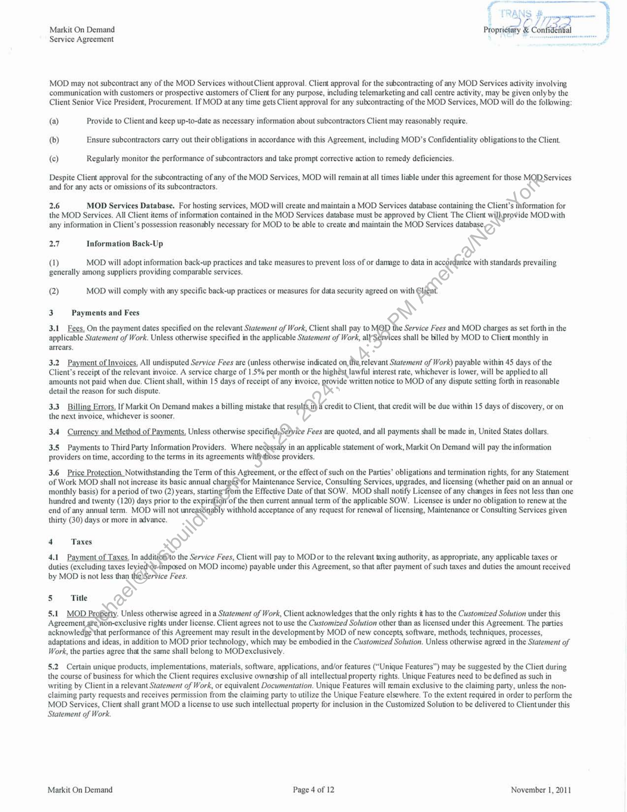
```  
```col-md
Wr
Markit On Demand Ponsa & Con
Service Agreement  
MOD may not #legal/Subcontract any of the MOD Services without Client approval. Client approval for the #legal/Subcontracting of any MOD Services activity involving
communication with customers or prospective aistomers of Client for any purpose, including telemarketing and call centre activity, may be given onlyby the
Client Senior Vice President, Procurement. If MOD atany time gets Client approval for any #legal/Subcontracting of the MOD Services, MOD will do the following:  
(a) Provide to Client and keep up-to-date as necessary information about #legal/Subcontractors Client may reasonably require.
(b) Ensure #legal/Subcontractors carry out their obligations in accordance with this Agreement, including MOD’s #legal/Confidentiality obligations to the Client.
(c) Regularly monitor the #legal/Performance of #legal/Subcontractors and take prompt corrective action to remedy deficiencies.  
Despite Client approval for the #legal/Subcontracting of any of the MOD Services, MOD will remain at all times liable under this agreement for those on
and for any acts or omissions of its #legal/Subcontractors.  
2.6 MOD Services Database. For hosting services, MOD will create and maintain a MOD Services database containing the Client’s 1 i for
the MOD Services. All Client items of information contained in the MOD Services database must be approved by Client The Client wil\provide MOD with
any information in Client's possession reasonably necessary for MOD to be able to create and maintain the MOD Services Cate,  
2.7 Information Back-Up \  
() MOD will adopt information back-up practices and take measures to prevent loss of or damage to data in mS ¢ with standards prevailing
generally among suppliers providing comparable services.  
(2) MOD will comply with any specific back-up practices or measures for data security agreed on with ee  
3 Payments and #legal/Fees >  
3.1 #legal/Fees. On the payment dates specified on the relevant Statement of Work, Client shall pay to $e Service #legal/Fees and MOD charges as set forth in the
applicable Statement of Work. Unless otherwise specified in the applicable Statement of Work, al ices shall be billed by MOD to Client monthly in
arrears.  
3.2. Payment of Invoices. All undisputed Service #legal/Fees are (unless otherwise indicated on, thie, relevant Statement of Work) payable within 45 days of the
Client’s receipt of the relevant invoice. A service charge of 1.5% per month or the highest lawful interest rate, whichever is lower, will be applied to all
amounts not paid when due. Client shall, within 15 days of receipt of any invoice, provide written notice to MOD of any dispute setting forth in reasonable
detail the reason for such dispute. i ‘  
3.3 Billing Errors. If Markit On Demand makes a billing mistake that res} credit to Client, that credit will be due within 15 days of discovery, or on
the next invoice, whichever is sooner.  
3.4 Currency and Method of Payments, Unless otherwise sre #legal/Fees are quoted, and all payments shall be made in, United States dollars,
Ul  
3.5 Payments to Third Party Information Providers. Where ne: in an applicable statement of work, Markit On Demand will pay the information
providers on time, according to the terms in its agreements wi se providers.  
3.6 Price Protection. Notwithstanding the Term of this Agreement, or the effect of such on the Parties’ obligations and #legal/Termination rights, for any Statement
of Work MOD shall not increase its basic annual char; for Maintenance Service, Consulting Services, upgrades, and licensing (whether paid on an annual or
monthly basis) for a period of two (2) years, startin; m the Effective Date of that SOW. MOD shall notify Licensee of any #legal/Changes in #legal/Fees not less than one
hundred and twenty (120) days prior to the expingig of the then current annual term of the applicable SOW. Licensee is under no obligation to #legal/Renew at the
end of any annual term. MOD will not unreas6nably withhold acceptance of any request for #legal/Renewal of licensing, Maintenance or Consulting Services given
thirty (30) days or more in advance.  
SS  
4 Taxes Ro  
4.1 Payment of Taxes, In addit & the Service #legal/Fees, Client will pay to MOD or to the relevant taxing authority, as appropriate, any applicable taxes or
duties (excluding taxes levi imposed on MOD income) payable under this Agreement, so that after payment of such taxes and duties the amount received
by MOD is not less ane ice #legal/Fees.  
5 Title  
5.1 MOD nr Unless otherwise agreed in a Statement of Work, Client acknowledges that the only rights it has to the Customized Solution under this
Agreement jon-exclusive rights under license. Client agrees not to use the Customized Solution other than as licensed under this Agreement. The parties
acknowle: at #legal/Performance of this Agreement may result inthe developmentby MOD of new concepts, software, methods, techniques, processes,
adaptations and ideas, in addition to MOD prior technology, which may be embodied in the Customized Solution. Unless otherwise agreed in the Statement of
Work, the parties agree that the same shall belong to MODexclusively.  
5.2 Certain unique products, implementations, materials, software, applications, and/or features (“Unique Features”) may be suggested by the Cliert during
the course of business for which the Client requires exclusive ownaship of all #legal/Intellectual_Property rights. Unique Features need to be defined as such in
writing by Clientin a relevant Statement of Work, or equivalent Documentation. Unique Features will remain exclusive to the claiming party, unless the nonclaiming party requests and receives permission from the claiming party to utilize the Unique Feature elsewhere. To the extent required in order to perform the
MOD Services, Client shall grant MOD a license to use such #legal/Intellectual_Property for inclusion in the Customized Solution to be delivered to Clientunder this
Statement of Work.  
Markit On Demand Page 4 of 12 November 1, 2011  
```
````
Notes:    
````col
```col-md
flexGrow=.5
===
> [!info] [Page 5](_attachments/images_RBC-Parent-3.6.1.14.2.4RBC-MSA.pdf_235840/page_5.png)
> 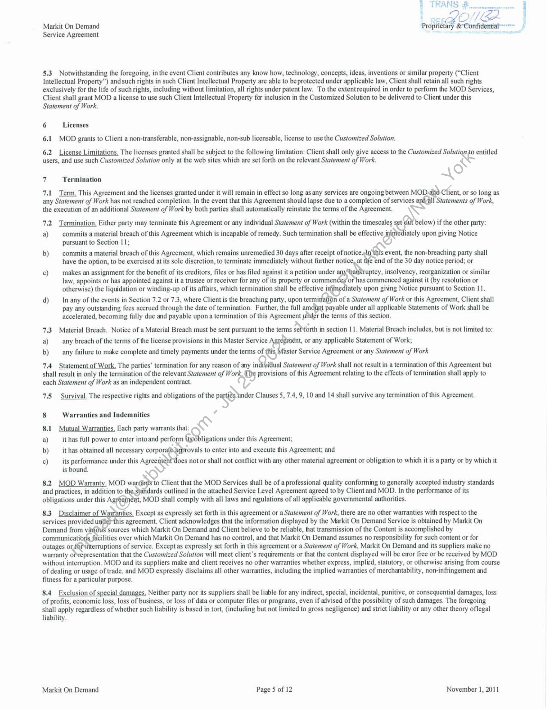
```  
```col-md
Markit On Demand
Service Agreement  
5.3 Notwithstanding the foregoing, in the event Client contributes any know how, technology, concepts, ideas, inventions or similar property (“Client
#legal/Intellectual_Property”) and such rights in such Client #legal/Intellectual_Property are able to be protected under applicable law, Client shall retain all such rights
exclusively for the life of such rights, including without #legal/Limitation, all rights under patent law. To the extentrequired in order to perform the MOD Services,
Client shall grant MOD a license to use such Client #legal/Intellectual_Property for inclusion in the Customized Solution to be delivered to Client under this
Statement of Work,  
6 Licenses
6.1 MOD grants to Client a non-transferable, non-assignable, non-sub licensable, license to use the Customized Solution.  
6.2 License #legal/Limitations. The licenses granted shall be subject to the following #legal/Limitation: Client shall only give access to the Customized Solution to entitled
users, and use such Customized Solution only at the web sites which are set forth on the relevant Statement of Work. NS  
7.1 Term. This Agreement and the licenses granted under it will remain in effect so long as any services are ongoing between MOD.2id Client, or so long as
any Statement of Work has not reached completion, In the event that this Agreement should lapse due to a completion of services I Statements of Work,
the execution of an additional Statement of Work by both parties shall #legal/Automatically reinstate the terms of the Agreement.  
7 #legal/Termination  
7.2. #legal/Termination. Either party may terminate this Agreement or any individual Statement of Work (within the timescales ser below) if the other party:
a) commits a material #legal/Breach of this Agreement which is incapable of remedy. Such #legal/Termination shall be effective i jiately upon giving Notice
pursuant to Section 11;  
b) commits a material #legal/Breach of this Agreement, which remains unremedied 30 days after receipt of notice, event, the non-#legal/Breaching party shall
have the option, to be exercised at its sole discretion, to terminate immediately without further notice, at tlfe end of the 30 day notice period; or  
c) makes an #legal/Assignment for the benefit of its creditors, files or has filed against it a petition under ptcy, insolvency, reorganization or similar
law, appoints or has appointed against it a trustee or receiver for any of its property or commenées or has commenced against it (by resolution or
otherwise) the liquidation or winding-up of its affairs, which #legal/Termination shall be effective ir jately upon giving Notice pursuant to Section 11.  
d) In any of the events in Section 7.2 or 7.3, where Client is the #legal/Breaching party, upon termi n of a Statement of Work or this Agreement, Client shall  
pay any outstanding #legal/Fees accrued through the date of #legal/Termination. Further, the full amoiint payable under all applicable Statements of Work shall be
accelerated, becoming fully due and payable upon a #legal/Termination of this Agreement uitder the terms of this section.  
7.3 Material #legal/Breach. Notice of a Material #legal/Breach must be sent pursuant to the terms se! forth in section 11. Material #legal/Breach includes, but is not #legal/Limited to:
a) any #legal/Breach of the terms of the license provisions in this Master Service Agpom or any applicable Statement of Work;
b) any failure to make complete and timely payments under the terms of ts aster Service Agreement or any Statement of Work  
7.4 Statement of Work. The parties’ #legal/Termination for any reason of any indi\idual Statement of Work shall not result in a #legal/Termination of this Agreement but
shall result in only the #legal/Termination of the relevant Statement of Work, Os provisions of this Agreement relating to the effects of #legal/Termination shall apply to
each Statement of Work as an independent contract. vy  
7.5 Survival. The respective rights and obligations of the pan Clauses 5, 7.4, 9, 10 and 14 shall survive any #legal/Termination of this Agreement.  
8 Warranties and Indemnities Se  
8.1 Mutual Warranties, Each party #legal/Warrants that: &
a) it has full power to enter into and perfo) fsa ligations under this Agreement;
b) it has obtained all necessary corpora' rovals to enter into and execute this Agreement; and  
c) its #legal/Performance under this Agree Joes notor shall not conflict with any other material agreement or obligation to which it is a party or by which it
is bound,  
8.2. MOD #legal/Warranty. MOD warns to Client that the MOD Services shall be of a professional quality conforming to generally accepted industry standards
and practices, in addition to eStandards outlined in the attached Service Level Agreement agreed to by Client and MOD. In the #legal/Performance of its
obligations under this ARQ) it, MOD shall comply with all laws and regulations of all applicable governmental authorities.  
8.3 Disclaimer of W; ties. Except as expressly set forth in this agreement or a Statement of Work, there are no other warranties with respect to the
services provided ur is agreement. Client acknowledges that the information displayed by the Markit On Demand Service is obtained by Markit On
Demand from v: sources which Markit On Demand and Client believe to be reliable, that transmission of the Content is accomplished by  
communicati cilities over which Markit On Demand has no control, and that Markit On Demand assumes no responsibility for such content or for
outages or foPnterruptions of service. Except as expressly set forth in this agreement or a Statement of Work, Markit On Demand and its suppliers make no
#legal/Warranty ofepresentation that the Customized Solution will meet client’s requirements or that the content displayed will be emor free or be received by MOD
without interruption. MOD and its suppliers make and client receives no other warranties whether express, implied, statutory, or otherwise arising from course
of dealing or usage of trade, and MOD expressly disclaims all other warranties, including the implied warranties of merchantability, non-infringement and
fitness for a particular purpose.  
8.4 #legal/Exclusion of special damages. Neither party nor its suppliers shall be liable for any indirect, special, incidental, punitive, or consequential damages, loss
of profits, economic loss, loss of business, or loss of data or computer files or programs, even if advised of the possibility of such damages. The foregoing
shall apply regardless of whether such #legal/Liability is based in tort, (including but not #legal/Limited to gross negligence) and strict #legal/Liability or any other theory oflegal
#legal/Liability.  
Markit On Demand Page 5 of 12 November 1, 2011  
```
````
Notes:    
````col
```col-md
flexGrow=.5
===
> [!info] [Page 6](_attachments/images_RBC-Parent-3.6.1.14.2.4RBC-MSA.pdf_235840/page_6.png)
> 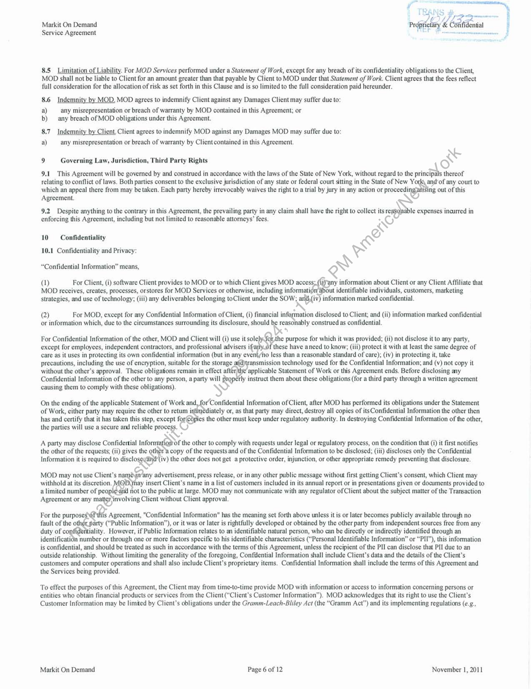
```  
```col-md
y
t  
Markit On Demand Prjpictary € #legal/Confidential  
Service Agreement  
8.5 #legal/Limitation of #legal/Liability. For MOD Services performed under a Statement of Work, except for any #legal/Breach of its #legal/Confidentiality obligations to the Client,
MOD shall not be liable to Client for an amount greater than that payable by Client to MOD under that Statement of Work. Client agrees that the #legal/Fees reflect
full consideration for the allocation of risk as set forth in this Clause and is so #legal/Limited to the full consideration paid hereunder.  
8.6 Indemnity by MOD. MOD agrees to #legal/Indemnify Client against any Damages Client may suffer due to:  
a) any misrepresentation or #legal/Breach of #legal/Warranty by MOD contained in this Agreement; or  
b) any #legal/Breach of MOD obligations under this Agreement.  
8.7 Indemnity by Client, Client agrees to #legal/Indemnify MOD against any Damages MOD may suffer due to:  
a) any misrepresentation or #legal/Breach of #legal/Warranty by Clientcontained in this Agreement.  
AS  
Ly #legal/Governing_Law, Jurisdiction, Third Party Rights re)  
9.1 This Agreement will be governed by and construed in accordance with the laws of the State of New York, without regard to the principals thereof
relating to conflict of laws. Both parties consent to the exclusive jurisdiction of any state or federal court sitting in the State of New York, and of any court to
which an appeal there from may be taken. Each party hereby irrevocably waives the right to a trial by jury in any action or proceedi ing out of this  
Agreement.
9.2 Despite anything to the contrary in this Agreement, the prevailing party in any claim shall have the right to collect its oe expenses incurred in
enforcing this Agreement, including but not #legal/Limited to reasonable attorneys’ #legal/Fees. AS)  
sail @
10 #legal/Confidentiality ~S
ve?  
10.1 #legal/Confidentiality and Privacy:  
“#legal/Confidential_Information” means, Ny  
(1) For Client, (i) software Client provides to MOD or to which Client gives MOD access; (\iyny information about Client or any Client Affiliate that
MOD receives, creates, processes, orstores for MOD Services or otherwise, including informati out identifiable individuals, customers, marketing
strategies, and use of technology; (iii) any deliverables belonging toClient under the SOW; arid ) information marked #legal/Confidential.
(2) For MOD, except for any #legal/Confidential_Information of Client, (i) financial in! mation disclosed to Client; and (ii) information marked #legal/Confidential
or information which, due to the circumstances surrounding its disclosure, should be reasonably construed as #legal/Confidential,  
4
For #legal/Confidential_Information of the other, MOD and Client will (i) use it sole! he purpose for which it was provided; (ii) not disclose it to any party,
except for employees, independent contractors, and professional advisers i these have aneed to know; (iii) protect it with at least the same degree of
care as it uses in protecting its own #legal/Confidential_Information (but in any event/no less than a reasonable standard of care); (iv) in protecting it, take
precautions, including the use of encryption, suitable for the storage ansmission technology used for the #legal/Confidential_Information; and (v) not copy it
without the other's approval, These obligations remain in effect a pa Statement of Work or this Agreement ends, Before disclosing ay
#legal/Confidential_Information of the other to any person, a party we rly instruct them about these obligations (for a third party through a written agreement
causing them to comply with these obligations).  
On the ending of the applicable Statement of Work and, for #legal/Confidential_Information of Client, after MOD has performed its obligations under the Statement
of Work, either party may require the other to retum i iately or, as that party may direct, destroy all copies of its#legal/Confidential_Information the other then
has and certify that it has taken this step, except fo ies the other must keep under regulatory authority. In destroying #legal/Confidential_Information of the other,
the parties will use a secure and reliable Pree  
A party may disclose Confidertial informa the other to comply with requests under legal or regulatory process, on the condition that (i) it first notifies
the other of the requests; (ii) gives the copy of the requests and of the #legal/Confidential_Information to be disclosed; (iii) discloses only the #legal/Confidential
Information it is required to discloe@y (iv) the other does not get a protective order, injunction, or other appropriate remedy preventing that disclosure.  
withhold at its discretion. ay insert Client’s name in a list of customers included in its annual report or in presentations given or documents provided to
a #legal/Limited number of pes not to the public at large. MOD may not communicate with any regulator of Client about the subject matter of the Transaction
Agreement or any matey, volving Client without Client approval.  
MOD may not use Client’s rash advertisement, press release, or in any other public message without first getting Client’s consent, which Client may  
jis Agreement, "#legal/Confidential_Information" has the meaning set forth above unless it is or later becomes publicly available through no
arty (“Public Information”), or it was or later is rightfully developed or obtained by the other party from independent sources free from any
iality. However, if Public Information relates to an identifiable natural person, who can be directly or indirectly identified through an
number or through one or more factors specific to his identifiable characteristics (“Personal Identifiable Information” or “PII”), this information
is #legal/Confidential, and should be treated as such in accordance with the terms of this Agreement, unless the recipient of the PII can disclose that PII due to an
outside relationship. Without #legal/Limiting the generality of the foregoing, Confilential Information shall include Client’s data and the details of the Client’s
customers and computer operations and shall also include Client’s proprietary items. #legal/Confidential_Information shall include the terms of this Agreement and
the Services being provided.  
To effect the purposes of this Agreement, the Client may from time-to-time provide MOD with information or access to information concerning persons or  
entities who obtain financial products or services from the Client (“Client's Customer Information”). MOD acknowledges that its right to use the Client’s
Customer Information may be #legal/Limited by Client’s obligations under the Gramm-Leach-Bliley Act (the “Gramm Act”) and its implementing regulations (e.¢.,  
Markit On Demand Page 6 of 12 November 1, 2011  
```
````
Notes:    
````col
```col-md
flexGrow=.5
===
> [!info] [Page 7](_attachments/images_RBC-Parent-3.6.1.14.2.4RBC-MSA.pdf_235840/page_7.png)
> 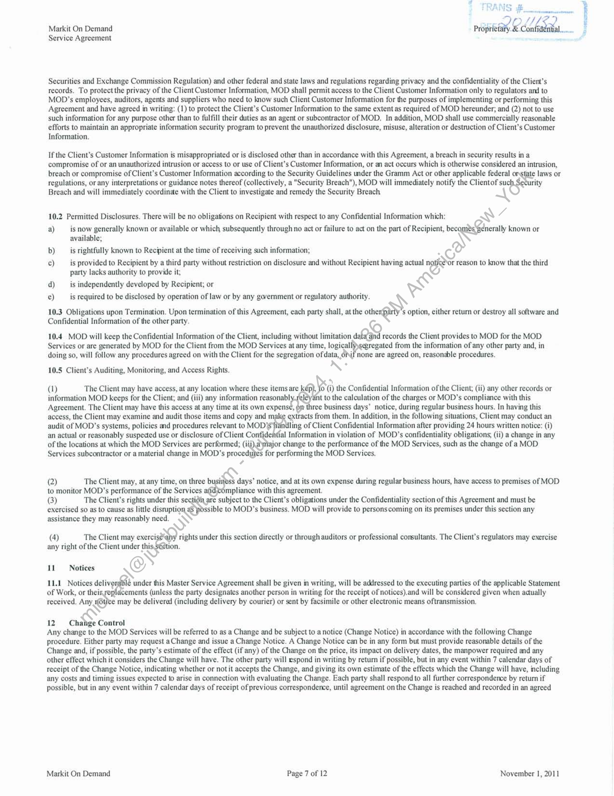
```  
```col-md
Markit On Demand Propifela, Sc fideniial.   
Service Agreement  
Securities and Ex#legal/Change Commission Regulation) and other federal and state laws and regulations regarding privacy and the #legal/Confidentiality of the Client's
records. To protect the privacy of the Client Customer Information, MOD shall permit access to the Client Customer Information only to regulators and to
MOD’s employees, #legal/Auditors, agents and suppliers who need to know such Client Customer Information for the purposes of implementing or performing this
Agreement and have agreed in writing: (1) to protect the Client’s Customer Information to the same extent as required of MOD hereunder; and (2) not to use
such information for any purpose other than to fulfill their duties as an agent or #legal/Subcontractor of MOD. In addition, MOD shall use commercially reasonable
efforts to maintain an appropriate information security program to prevent the unauthorized disclosure, misuse, alteration or destruction of Client’s Customer
Information,  
If the Client’s Customer Information is misappropriated or is disclosed other than in accordance with this Agreement, a #legal/Breach in security results in a
compromise of or an unauthorized intrusion or access to or use of Client's Customer Information, or an act occurs which is otherwise considered an intrusion,
#legal/Breach or compromise of Client’s Customer Information according to the Security Guidelines under the Gramm Act or other applicable federal ite laws or
regulations, or any interpretations or guidance notes thereof (collectively, a "Security #legal/Breach"), MOD will immediately notify the Clientof sucl rity
#legal/Breach and will immediately coordinae with the Client to investigate and remedy the Security #legal/Breach  
10.2 Permitted Disclosures. There will be no obligations on Recipient with respect to any #legal/Confidential_Information which:  
7
a) is now generally known or available or which subsequently through no act or failure to act on the part of Recipient, meas known or
available;  
b) is rightfully known to Recipient at the time of receiving such information; . &
c) is provided to Recipient by a third party without restriction on disclosure and without Recipient having actual nefeor reason to know that the third  
party lacks authority to provide it;
d) is independently developed by Recipient; or ~S
e) is required to be disclosed by operation of law or by any government or regulatory authority.
10.3 Obligations upon #legal/Termination. Upon #legal/Termination of this Agreement, each party shall, at the othe: S option, either return or destroy all software and
#legal/Confidential_Information of the other party.  
10.4 MOD will keep the #legal/Confidential_Information of the Client, including without #legal/Limitation dafegnd records the Client provides to MOD for the MOD
Services or are generated by MOD for the Client from the MOD Services at any time, logicall)segregated from the information of any other party and, in
doing so, will follow any procedures agreed on with the Client for the segregation of data, dit none are agreed on, reasondble procedures.  
10.5 Client’s #legal/Auditing, Monitoring, and Access Rights. XN °  
4
5) The Client may have access, at any location where these items are Kas (i) the #legal/Confidential_Information of the Client; (ii) any other records or
information MOD keeps for the Client; and (iii) any information reasonabl int to the calculation of the charges or MOD’s compliance with this  
Agreement. The Client may have this access at any time at its own expense, Op three business days’ notice, during regular business hours. In having this
access, the Client may examine and #legal/Audit those items and copy and be = ed from them. In addition, in the following situations, Client may conduct an
#legal/Audit of MOD’s systems, policies and procedures relevant to MOD* ling of Client #legal/Confidential_Information after providing 24 hours written notice: (i)
an actual or reasonably suspected use or disclosure of Client ba ial Information in violation of MOD’s #legal/Confidentiality obligations, (ii) a #legal/Change in any  
of the locations at which the MOD Services are performed; (' 4jor #legal/Change to the #legal/Performance of the MOD Services, such as the #legal/Change of a MOD
Services #legal/Subcontractor or a material #legal/Change in MOD’s procedutes for performing the MOD Services.  
¢
(2) The Client may, at any time, on three bi ie notice, and at its own expense during regular business hours, have access to premises of MOD
to monitor MOD’s #legal/Performance of the Services mpliance with this agreement.
(3) The Client’s rights under this section are subject to the Client’s obligations under the #legal/Confidentiality section of this Agreement and must be  
exercised so as to cause as little SSUUPSORS ssible to MOD’s business. MOD will provide to persons coming on its premises under this section any
assistance they may reasonably need. N>  
(4) The Client may exerci rights under this section directly or through #legal/Auditors or professional consultants. The Client’s regulators may exercise
any right of the Client under thi ion.  
11 Notices Koy  
under this Master Service Agreement shall be given in writing, will be addressed to the executing parties of the applicable Statement
cements (unless the party designates another person in writing for the receipt of notices),and will be considered given when actually
e may be delivered (including delivery by courier) or sent by facsimile or other electronic means oftransmission.  
12 #legal/Change Control  
Any #legal/Change to the MOD Services will be referred to as a #legal/Change and be subject to a notice (#legal/Change Notice) in accordance with the following #legal/Change
procedure. Either party may request a#legal/Change and issue a #legal/Change Notice. A #legal/Change Notice can be in any form but must provide reasonable details of the
#legal/Change and, if possible, the party’s estimate of the effect (if any) of the #legal/Change on the price, its impact on delivery dates, the manpower required and any
other effect which it considers the #legal/Change will have. The other party will espond in writing by return if possible, but in any event within 7 calendar days of
receipt of the #legal/Change Notice, indicating whether or not it accepts the #legal/Change, and giving its own estimate of the effects which the #legal/Change will have, including
any costs and timing issues expected to arise in connection with evaluating the #legal/Change. Each party shall respond to all further correspondence by retum if
possible, but in any event within 7 calendar days of receipt of previous correspondence, until agreement on the #legal/Change is reached and recorded in an agreed  
Markit On Demand Page 7 of 12 November 1, 2011  
```
````
Notes:    
````col
```col-md
flexGrow=.5
===
> [!info] [Page 8](_attachments/images_RBC-Parent-3.6.1.14.2.4RBC-MSA.pdf_235840/page_8.png)
> 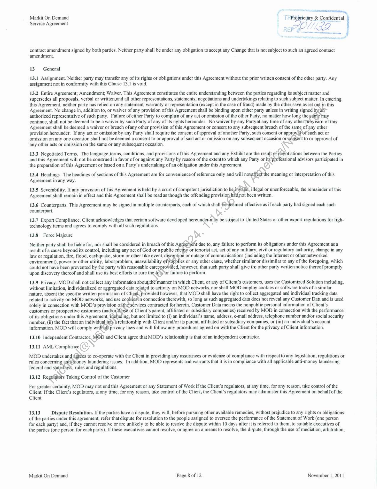
```  
```col-md
Markit On Demand | FPrbisetiry & #legal/Confidential \
Service Agreement SO // I j
re Ve 3  
contract amendment signed by both parties. Neither party shall be under any obligation to accept any #legal/Change that is not subject to such an agreed contract
amendment.  
13° General  
13.1 #legal/Assignment. Neither party may transfer any of its rights or obligations under this Agreement without the prior written consent of the other party. Any
#legal/Assignment not in conformity with this Clause 13.1 is #legal/Void.  
13.2 Entire Agreement; Amendment, Waiver. This Agreement constitutes the entire understanding between the parties regarding its subject matter and
supersedes all proposals, verbal or written,and all other representations, statements, negotiations and undertakings relating to such subject matter. In entering
this Agreement, neither party has relied on any statement, #legal/Warranty or representation (except in the case of fraud) made by the other save as set out jn this
Agreement. No #legal/Change in, addition to, or waiver of any provision of this Agreement shall be binding upon either party unless in writing signed by al~
authorized representative of such party, Failure of either Party to complain of any act or omission of the other Party, no matter how long thes: may
continue, shall not be deemed to be a waiver by such Party of any of its rights hereunder. No waiver by any Partyat any time of any other proyisia of this
Agreement shall be deemed a waiver or #legal/Breach ofany other provision of this Agreement or consent to any subsequent #legal/Breach of the same of any other
provision hereunder. If any act or omission by any Party shall require fhe consent of approval of another Party, such consent or approvaof such act or
omission on any one occasion shall not be deemed a consent to or approval of said act or omission on any subsequent occasion or¢duisent to or approval of
any other acts or omission on the same or any subsequent occasion. \  
13.3 Negotiated Terms. The language,terms, conditions, and provisions of this Agreement and any Exhibit are the result of teBotiations between the Parties
and this Agreement will not be construed in favor of or against any Party by reason of the extent to which any Party or its'professional advisors participated in
the preparation of this Agreement or based on a Party’s undertaking of an obligation under this Agreement. »  
13.4 Headings. The headings of sections of this Agreement are for convenience of reference only and will notaffect the meaning or interpretation of this
Agreement in any way. :  
13.5 #legal/Severability. If any provision of this Agreement is held by a court of competent jurisdiction to be inyalid, illegal or unenforceable, the remainder of this
Agreement shall remain in effect and this Agreement shall be read as though the offending provision hat{not been written.  
13.6 Counterparts. This Agreement may be signed in multiple counterparts, each of which shall 6e-deemed effective as if each party had signed each such
counterpart,  
13.7 Export Compliance. Client acknowledges that certain software developed hereunder may be subject to United States or other export regulations for lightechnology items and agrees to comply with all such regulations.  
13.8 #legal/Force_Majeure  
Neither party shall be liable for, nor shall be considered in #legal/Breach of this Agreement due to, any failure to perform its obligations under this Agreement as a
result of a cause beyond its control, including any act of God or a public erlemy or terrorist act, act of any military, civil or regulatory authority, #legal/Change in any
law or regulation, fire, flood, earthquake, storm or other like event, di tion or outage of communications (including the Internet or othernetworked
environment), power or other utility, laborproblem, unavailability @fstpplies or any other cause, whether similar or dissimilar to any of the foregoing, which
could not have been prevented by the party with reasonable caresprovided, however, that such party shall give the other party written notice thereof promptly
upon discovery thereof and shall use its best efforts to cure the o8s‘or failure to perform.  
13.9 Privacy. MOD shall not collect any information about,th€ manner in which Client, or any of Client’s customers, uses the Customized Solution including,
without #legal/Limitation, individualized or aggregated data reJated to activity on MOD networks, nor shall MOD employ cookies or software tods of a similar
nature, absent the specific written permission of Client; provided however, that MOD shall have the right to collect aggregated and individual tracking data
related to activity on MOD networks, and use cogkies)in connection therewith, so long as such aggregated data does not reveal any Customer Data and is used
solely in connection with MOD’s provision ofithe-services contracted for herein. Customer Data means the nonpublic personal information of Client’s
customers or prospective customers (and/orhiest of Client’s parent, affiliated or subsidiary companies) received by MOD in connection with the #legal/Performance
of its obligations under this Agreement, x ing, but not #legal/Limited to (i) an individual's name, address, e-mail address, telephone number and/or social security
number, (ii) the fact that an individual hay.’ relationship with Client and/or its parent, affiliated or subsidiary companies, or (iii) an individual’s account
information. MOD will comply withval) privacy laws and will follow any procedures agreed on with the Client for the privacy of Client information.  
13.10 Independent Contractor, MOD and Client agree that MOD’s relationship is that of an independent contractor.
13.11 AML Compliance(  
MOD undertakes and Sarees to co-operate with the Client in providing any assurances or evidence of compliance with respect to any legislation, regulaions or
rules concerning anficmoney laundering issues, In addition, MOD represents and #legal/Warrants that it is in compliance with all applicable anti-money laundering
federal and state-laws, rules and regulations.  
13.12 Regulators Taking Control of the Customer  
For greater certainty, MOD may not end this Agreement or any Statement of Work if the Client’s regulators, at any time, for any reason, ta&e control of the
Client. If the Client’s regulators, at any time, for any reason, take control of the Client, the Client’s regulators may administer this Agreement on behalf of the
Client.  
13.13 #legal/Dispute_Resolution. If the parties have a dispute, they will, before pursuing other available remedies, without prejudice to any rights or obligations
of the parties under this agreement, refer that dispute for resolution to the people assigned to oversee the #legal/Performance of the Statement of Work (one person
for each party) and, if they cannot resolve or are unlikely to be able to resoWve the dispute within 10 days after it is referred to them, to suitable executives of
the parties (one person for each party). If these executives cannot resolve, or agree on a means to resolve, the dispute, through the use of mediation, #legal/Arbitration,  
Markit On Demand Page 8 of 12 November 1, 2011  
```
````
Notes:    
````col
```col-md
flexGrow=.5
===
> [!info] [Page 9](_attachments/images_RBC-Parent-3.6.1.14.2.4RBC-MSA.pdf_235840/page_9.png)
> 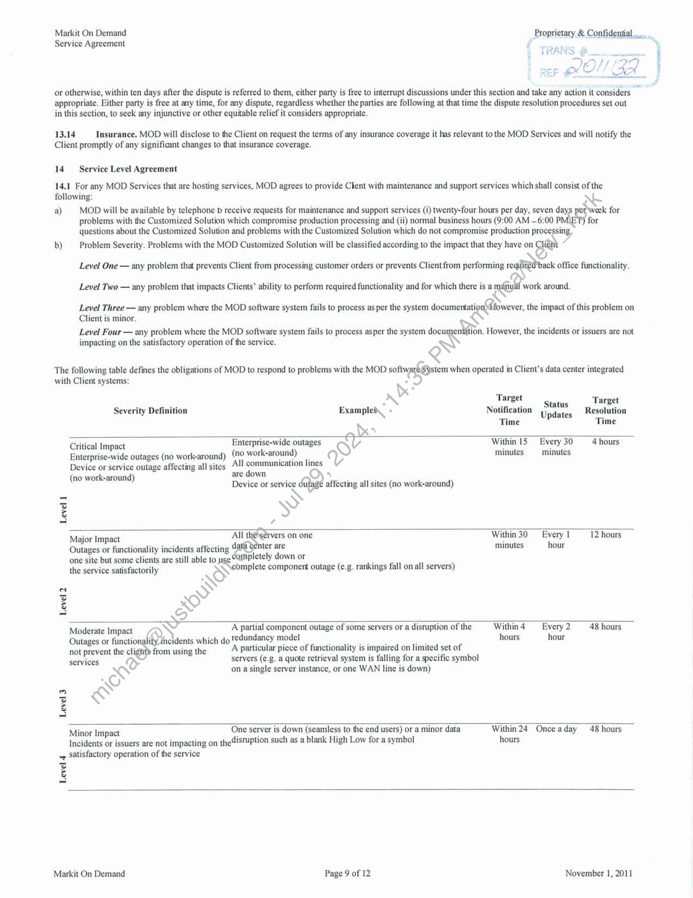
```  
```col-md
Markit On Demand Proprietary & #legal/Confidential.  .
Service Agreement d ‘,  
SEF XS CN.  
or otherwise, within ten days after the dispute is referred to them, either party is free to interrupt discussions under this section and take any action it considers 7
appropriate. Either party is free at any time, for any dispute, regardless whether the parties are following at that time the #legal/Dispute_Resolution procedures set out
in this section, to seek any injunctive or other equitable relief it considers appropriate.  
13.14 Insurance, MOD will disclose to the Client on request the terms of any insurance coverage it has relevant to the MOD Services and will notify the
Client promptly of any significant #legal/Changes to that insurance coverage.  
14 Service Level Agreement
14.1 For any MOD Services that are hosting services, MOD agrees to provide Clent with maintenance and support services which shall consist of the
following:  
a) MOD will be available by telephone b receive requests for maintenance and support services (i) twenty-four hours per day, seven day; ek for
problems with the Customized Solution which compromise production processing and (ii) normal business hours (9:00 AM —6:00 for
questions about the Customized Solution and problems with the Customized Solution which do not compromise production processing,  
b) Problem Severity. Problems with the MOD Customized Solution will be classified according to the impact that they have on Cli
Level One — any problem that prevents Client from processing customer orders or prevents Client from performing re back office functionality.
Level Two — any problem that impacts Clients’ ability to perform required functionality and for which there is a ego around.  
Level Three — any problem where the MOD software system fails to process as per the system decent res the impact of this problem on
Client is minor.  
Level Four — any problem where the MOD software system fails to process asper the system docume:
impacting on the satisfactory operation of the service. BS  
The following table defines the obligations of MOD to respond to problems with the MOD ds vale when operated in Client’s data center integrated
with Client systems: .  
\*°  
ion. However, the incidents or issuers are not  
. a Status Target
Severity Definition Examples . Notification Upd: Resolution
pdates ‘
Time Time
ys 4
Critical Impact Enterprise-wide outages 9g Within 15 Every 30 4 hours
Enterprise-wide outages (no work-around) (N0 work-around) Vv minutes minutes
Device or service outage affecting all sites Se —— lines
k-around re .
ine workceronnd) Device or semig’ affecting all sites (no work-around)
z y
:
Major Impact All Ts on one Within30 Every 1 12 hours
Outages or functionality incidents affecting 4 ter are minutes hour
one site but some clients are still able to pletely down or ;
the service satisfactorily S mplete component outage (e.g. rankings fall on all servers)
: ‘SS
z Ne)
A oe
Moderate Impact N A partial component outage of some servers or a disruption of the Withind —_ Every 2 48 hours
Outages or functio (QDrddents which do fedundancy model Tree eH hours hour
not prevent the cli from using the A particular piece of functionality is impaired on #legal/Limited set of
services servers (¢.g. a quote retrieval system is falling for a specific symbol
Le on a single server instance, or one WAN line is down)
Lc) &
7]
a
A
One server is down (seamless to the end users) or a minor data Within24 Onceaday 48 hours  
Minor Impact
Incidents or issuers are not impacting on the
satisfactory operation of the service  
disruption such as a blank High Low for a symbol hours  
Level 4  
Markit On Demand Page 9 of 12 November 1, 2011  
```
````
Notes:    
````col
```col-md
flexGrow=.5
===
> [!info] [Page 10](_attachments/images_RBC-Parent-3.6.1.14.2.4RBC-MSA.pdf_235840/page_10.png)
> 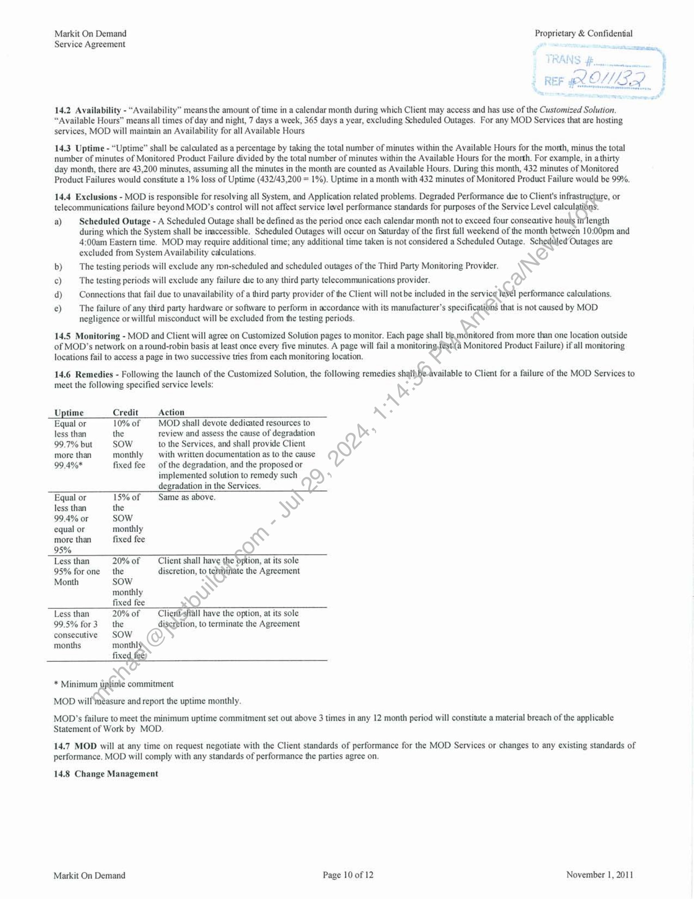
```  
```col-md
Markit On Demand Proprietary & #legal/Confidential
Service Agreement 7 since,  
14.2 Availability - “Availability” means the amount of time in a calendar month during which Client may access and has use of the Customized Solution.
“Available Hours” means all times of day and night, 7 days a week, 365 days a year, excluding Scheduled Outages. For any MOD Services that are hosting
services, MOD will maintain an Availability for all Available Hours  
14.3 #legal/Uptime - “#legal/Uptime” shall be calculated as a percentage by taking the total number of minutes within the Available Hours for the morth, minus the total
number of minutes of Monitored Product Failure divided by the total number of minutes within the Available Hours for the morth. For example, in a thirty
day month, there are 43,200 minutes, assuming all the minutes in the month are counted as Available Hours, During this month, 432 minutes of Monitored
Product Failures would constitute a 1% loss of #legal/Uptime (432/43,200 = 1%). #legal/Uptime in a month with 432 minutes of Monitored Product Failure would be 99%,  
14.4 #legal/Exclusions - MOD is responsible for resolving all System, and Application related problems. Degraded #legal/Performance die to Client's infras re, OF  
telecommunications failure beyond MOD’s control will not affect service level #legal/Performance standards for purposes of the Service Level catia Z  
a) Scheduled Outage - A Scheduled Outage shall be defined as the period once each calendar month not to #legal/Exceed four conseautive h length
during which the System shall be inaccessible. Scheduled Outages will occur on Saturday of the first full weekend of the month between 10:00pm and
4:00am Eastern time. MOD may require additional time; any additional time taken is not considered a Scheduled Outage. Schedhiled’C Outages are
excluded from System Availability calculations. @  
b) The testing periods will exclude any ron-scheduled and scheduled outages of the Third Party Monitoring Provider. Ss  
c) The testing periods will exclude any failure die to any third party telecommunications provider.
d) Connections that fail due to unayailability of a third party provider of the Client will notbe included in the servic Sei #legal/Performance calculations.  
e) The failure of any third party hardware or software to perform in accordance with its manufacturer’s specifi ite that is not caused by MOD
negligence or willful misconduct will be excluded from the testing periods. KS  
14.5 Monitoring - MOD and Client will agree on Customized Solution pages to monitor. Each page shall a itored from more than one location outside  
of MOD’s network on around-robin basis at least once every five minutes. A page will fail a monitorin; Monitored Product Failure) if all monitoring  
locations fail to access a page in two successive tries from each monitoring location.  
14.6 Remedies - Following the launch of the Customized Solution, the following remedies sha f2bvaabe to Client for a failure of the MOD Services to  
meet the following specified service levels: ®
_#legal/Uptime Credit Action  
Equal or 10% of MOD shall devote #legal/Dedicated_Resources to  
less than the review and assess the cause of degradation  
99.7% but SOW to the Services, and shall provide Client 7  
more than monthly with written documentation as to the cause Vv  
99,4%* fixed fee — of the degradation, and the proposed or  
implemented solution to remedy such Oy 4  
degradation in the Services. ) Z
Equal or 15% of Same as above. y)  
less than the S
99.4% or SOW D
equal or monthly
more than fixed fee &
95% O
Less than 20% of Client shall have the Erion, at its sole
95% forone the discretion, to wat the Agreement
Month sow \  
monthly sy  
fixed fee  
Less than 20% of — Cli Il have the option, at its sole
99.5% for3 the debi, to terminate the Agreement  
consecutive SOW  
months month! ©
fixe  
a Mini commitment
MOD wil! méasure and report the #legal/Uptime monthly.
MOD’s failure to meet the minimum #legal/Uptime commitment set out above 3 times in any 12 month period will constitute a material #legal/Breach of the applicable  
Statement of Work by MOD.  
14.7 MOD will at any time on request negotiate with the Client standards of #legal/Performance for the MOD Services or #legal/Changes to any existing standards of
#legal/Performance, MOD will comply with any standards of #legal/Performance the parties agree on.  
14.8 #legal/Change Management  
Markit On Demand Page 10 of 12 November 1, 2011  
```
````
Notes:    
````col
```col-md
flexGrow=.5
===
> [!info] [Page 11](_attachments/images_RBC-Parent-3.6.1.14.2.4RBC-MSA.pdf_235840/page_11.png)
> 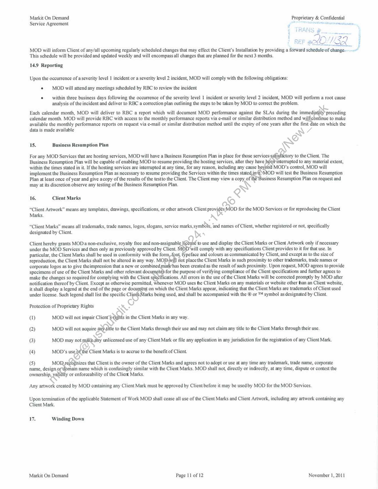
```  
```col-md
Markit On Demand Proprietary & #legal/Confidential
Service Agreement i — AES  
This schedule will be provided and updated weekly and will encompass all #legal/Changes that are planned for the next 3 months.  
14.9 Reporting  
Upon the occurrence of a severity level 1 incident or a severity level 2 incident, MOD will comply with the following obligations:
e MOD will attend any meetings scheduled by RBC to review the incident  
* — within three business days following the occurrence of the severity level 1 incident or severity level 2 incident, MOD will perform a root cause
analysis of the incident and deliver to RBC a correction plan outlining the steps to be taken by MOD to correct the problem.  
Each calendar month, MOD will deliver to RBC a report which will document MOD #legal/Performance against the SLAs during the immedi preceding
calendar month, MOD will provide RBC with access to the monthly #legal/Performance reports via e-mail or similar distribution method and wale inue to make
available the monthly #legal/Performance reports on request via e-mail or similar distribution method until the expiry of one years after the first date on which the
data is made available  
7
@
15. Business Resumption Plan S  
For any MOD Services that are hosting services, MOD will have a Business Resumption Plan in place for those services-satisfactory to the Client. The
Business Resumption Plan will be capable of enabling MOD to resume providing the hosting services, after they have interrupted to any material extent,
within the times stated in it. If the hosting services are interrupted at any time, for any reason, including any cause bj MOD’s control, MOD will
implement the Business Resumption Plan as necessary to resume providing the Services within the times stated.initMOD will test the Business Resumption
Plan at least once of year and give acopy of the results of the testto the Client. The Client may view a copy of usiness Resumption Plan on request and
may at its discretion observe any testing of the Business Resumption Plan.  
16. Client Marks ok  
“Client Artwork” means any templates, drawings, specifications, or other artwork Client proves OD for the MOD Services or for reproducing the Client  
Marks. iN  
“Client Marks” means all trademarks, trade names, logos, slogans, service marks,symbols, ‘and names of Client, whether registered or not, specifically
designated by Client. ® 4  
Client hereby grants MOD a non-exclusive, royalty free and non-assignable | to use and display the Client Marks or Client Artwork only if necessary
under the MOD Services and then only as previously approved by Client. will comply with any specifications Client provides to it for that use. In
particular, the Client Marks shall be used in conformity with the ope s peface and colours as communicated by Client, and except as to the size of
reproduction, the Client Marks shall not be altered in any way. MO} Hot place the Client Marks in such proximity to other trademarks, trade names or
corporate logos as to give theimpression that a new or combine as been created as the result of such proximity. Upon request, MOD agrees to provide
specimens of use of the Client Marks and other relevant doc for the purpose of verifying compliance of the Client specifications and further agrees to
make the #legal/Changes so required for complying with the Client s ications. All errors in the use of the Client Marks will be corrected promptly by MOD after
notification thereof by Client. Except as otherwise permitted, whenever MOD uses the Client Marks on any materials or website other than an Client website,
it shall display a legend at the end of the page or docung@nt on which the Client Marks appear, indicating that the Client Marks are trademarks of Client used  
under license. Such legend shall list the specific Cli arks being used, and shall be accompanied with the ® or ™ symbol as designated by Client.
Protection of Proprietary Rights ° «2  
ql) MOD will not impair Client’Sth in the Client Marks in any way.  
(2) MOD will not acquire aie to the Client Marks through their use and may not claim any title to the Client Marks through their use.  
(3) MOD may not aueny unlicensed use of any Client Mark or file any application in any jurisdiction for the registration of any Client Mark.
(4) MOD’s use. Client Marks is to accrue to the benefit of Client.  
(5) MO! nizes that Client is the owner of the Client Marks and agrees not to adopt or use at any time any trademark, trade name, corporate
name, design, ain name which is confusingly similar with the Client Marks. MOD shall not, directly or indirectly, at any time, dispute or contest the
ownership, or enforceability of the Client Marks.  
Any artwork created by MOD cantaining any Client Mark must be approved by Client before it may be used by MOD for the MOD Services.  
Upon #legal/Termination of the applicable Statement of Work MOD shall cease all use of the Client Marks and Client Artwork, including any artwork containing any
Client Mark.  
47: Winding Down  
Markit On Demand Page 11 of 12 November 1, 2011  
```
````
Notes:    
````col
```col-md
flexGrow=.5
===
> [!info] [Page 12](_attachments/images_RBC-Parent-3.6.1.14.2.4RBC-MSA.pdf_235840/page_12.png)
> 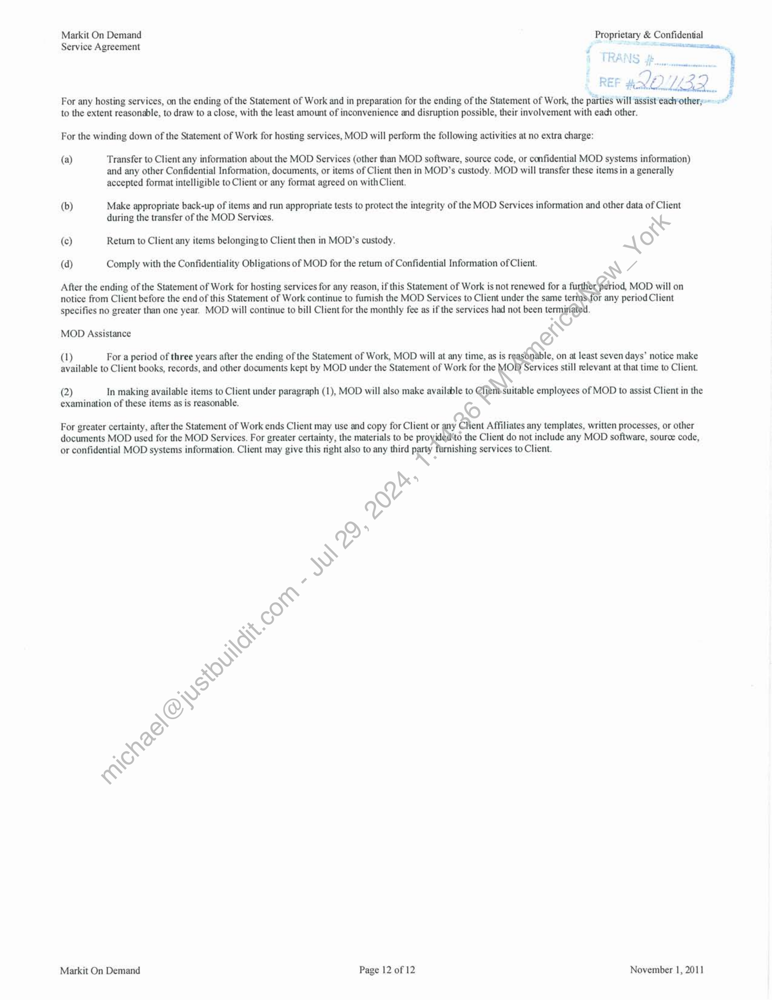
```  
```col-md
Markit On Demand Proprietary & #legal/Confidential  
ee ee  
Service Agreement  
For any hosting services, on the ending of the Statement of Work and in preparation for the ending of the Statement of Work, the parties will assist’each-othery
to the extent reasonable, to draw to a close, with the least amount of inconvenience and disruption possible, their involvement with each other.  
For the winding down of the Statement of Work for hosting services, MOD will perform the following activities at no extra charge:
(a) Transfer to Client any information about the MOD Services (other than MOD software, #legal/Source_Code, or #legal/Confidential MOD systems information)  
and any other #legal/Confidential_Information, documents, or items of Client then in MOD’s custody. MOD will transfer these items in a generally
accepted format intelligible to Client or any format agreed on with Client.  
(b) Make appropriate back-up of items and run appropriate tests to protect the integrity of the MOD Services information and other data of Client
during the transfer of the MOD Services. ‘ {  
(c) Retum to Client any items belonging to Client then in MOD’s custody. RX)  
(d) Comply with the #legal/Confidentiality Obligations of MOD for the retum of #legal/Confidential_Information of Client. WA  
After the ending of the Statement of Work for hosting services for any reason, if this Statement of Work is not #legal/Renewed for a iod, MOD will on
notice from Client before the end of this Statement of Work continue to fumish the MOD Services to Client under the same te: for any period Client
specifies no greater than one year. MOD will continue to bill Client for the monthly fee as if the services had not been termi  
MOD Assistance EN  
(1) For a period of three years after the ending of the Statement of Work, MOD will at any time, as is r le, on at least seven days’ notice make
available to Client books, records, and other documents kept by MOD under the Statement of Work for AS ervices still relevant at that time to Client.
(2) In making available items to Client under paragraph (1), MOD will also make available to @ Suitable employees of MOD to assist Client in the
exami#legal/Nation of these items as is reasonable. ©  
For greater certainty, after the Statement of Work ends Client may use and copy for Client or ent Affiliates any templates, written processes, or other
documents MOD used for the MOD Services. For greater certainty, the materials to be proyidedito the Client do not include any MOD software, #legal/Source_Code,
or #legal/Confidential MOD systems information. Client may give this night also to any third bed ishing services to Client.  
Y be)
e
P  
Markit On Demand Page 12 of 12 November 1, 2011  
```
````
Notes:  


![[_attachments/RBC-Parent-3.6.1.14.2.4 RBC - MSA.pdf]