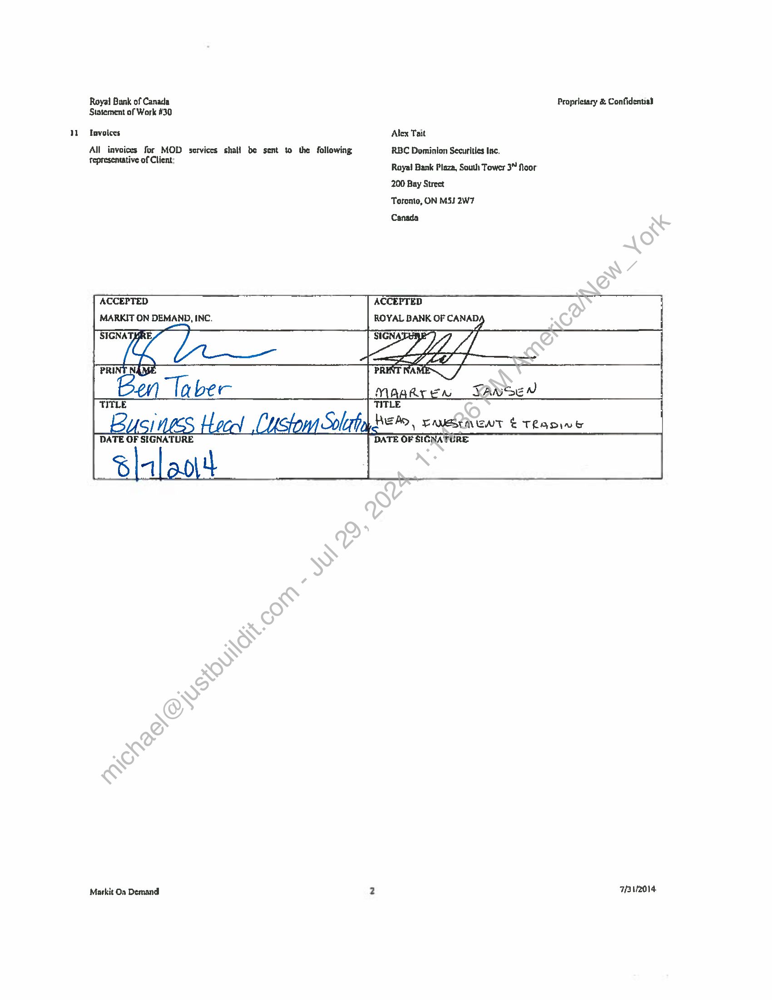

##### No title found]


````col
```col-md
flexGrow=.5
===
> [!info] [Page 1](_attachments/images_RBC-Parent-3.6.1.14.2.500205111.pdf_235850/page_1.png)
> 
```  
```col-md
Royal Bank of Canada
Statement of Work #30  
STATEMENT OF WORK NUMBER #30;
WEALTIE MANAGEMENT ENHANCEMENTS TITROUGHPUT
INCREASE  
This Statement of Work is entered into pursuant (o, and incorporates by
reference all terms and conditions of the Master Services Agreement
between Markil On Demand, Inc., formerly known as Wall Street On
Demand, Inc. (“MOD”), and Royal Bank of Canada (“Client”) effective
November }, 2011 (RBC Ref. #2011132).  
This Statement of Work commences on November }, 2014 (“SOW
Effecuve Date”), The parties expressly agree that in the event of a
conflict, inconsistency or ambiguity between the terms and conditions of
this SOW and the Agsecment, the terms and conditions of this SOW shall
govem and contro] as to the #legal/Scope of services described hercin.  
Project Description  
1.£ MOD Customized Solution  
MOD will increase throughput on maintenance and enhancements by 57
additional hours per month to complete items prioritized by RBC Wealth
Management for the Insight Partal (“Customized Solution")  
The planned enhancements List in Scetion 1.2 is preliminary and is
subject © #legal/Change based on the Client's priorities, The Client can reallocate the additional capacity outlined in SOW #30 to work on new
enhancements or priorities of similar #legal/Scope not listed in dhe planned
enhancemenis list.  
1.2 Planned Enhancements List  
‘The planned enhancements list includes but is not #legal/Limited to the
following:  
« Website enhancements  
« = New pages  
« New functionality or #legal/Changes to Functionality  
¢ — Updates to widgets, data, patlems and of business logic  
1.3 Assumptions  
e¢ MOD and RBC will mect to discuss the enhancements and
Projects performed by the MOD team, Both’partics shall
discuss the cnhancements, project deliversbles, time frames  
and project milestones during both partics regularly scheduled
mectings  
« — Planning and coordi#legal/Nation of alf praicct activities are included
as considerution for this sddivional enhancements budget.  
4.4 Browser Support  
MOD will provide support fur ihe Customized Solution in the following
browsers and versions:  
e — Interact Explorer. B O+  
« — Windows/Mac Firefox 28,0+  
* — Witdpws/Mac Safari 6.0+  
* ( Windows/Mac Chrome 30.0+
MOD Will support the most recent browser versions es they become
available, Legacy versians will be ecticed in due course,
Development Schedule  
The schedule for this project will be mutually agreed upan aller receipt of
detailed requirements from Client.  
Markit On Demand.  
Proprietary & #legal/Confidential  
Redundancy  
The Customized Solution will be fully operational in all of MOD's data
centers,  
Reporting.  
MOD wil provide our slandard reporting package when the Customized
Solution és cunning in production.  
Content  
Client will be responsible for ticensing and providing all data, content,
and fonts required for this project. MOD can recommend \and snake
introductions to apprapristo providers, but Client wilt be responsible for
all agreements with and payments to such providers.  
Term  
This SOW shall commence on the Effective Date-and remain in effect for
two ycars thereafter (“Initiat Term”). Thepininal Term shall #legal/Renew for
successive #legal/Renewal terms of one (1) yczr cach, unless either party notifies
the other in writing of its decision not to extend the term no Inter than
ninety (90) days prior to the expiration of the term then in effect.  
Service Fee  
In considerstion of (the increased MOD throughput described herein,
MOD shall invoice-the Client for the services rendered on a monthly
basis. The Servite Fee for the work enumerated in this SOW is $10, 000
per manth, contiencing on November 1, 2014  
Bug Fixes and Matertal #legal/Changes  
MOD will not charge any additional #legal/Fees for work done subsequent to the.
Jasinch to ensuce that the services conform Lo the original requirements
‘and functionat documentation ("Bug Fixes”).  
MOD will make any #legal/Changes beyond Bug Fixes and those covered by the
Enhancement Budget at the rate of $175 an hour, #legal/Changes requested afer
Client has given final approvat on designs will be billed at the rate of
$175 an hour for actuat hours worked,  
Whenever Clicnt wants a firm bid for additional werk, an additional
Statement of Work will be created for that work.  
Representations and Warrantics  
Each pany represents and #legal/Warrants that: (i) when executed and delivered,
this SOW shall constitute the legal, valid, and binding obfigation of such
party, cnforccabic agalnst it pursuant to ils terms; (ii) it shall comply with
all applicable federal and state laws, reg ns, and statutes in the
#legal/Performance of its obligations hercunder; it bas full power and
nuthorily to enter into and perform its obligations under this SOW; (iv) it
has obtained all necessary corporate approvals to enter into and execute
this SOW; and (v) its #legal/Performance under this SOW does not and shall not
Conflict with any other material agreement or obligation ta which it is 6
party or by which it is bound,  
#legal/Change Management  
MOD reserves the right, in its sole discretion, to make #legal/Changes and
onhuncements to the equipment and software uscd to provide the services
fram time to time to anaintain operations and as required for problem
management and/or system security, MOD will use commercially
reasonable efTurts to implement #legal/Changes during, nan-peak hours, except
for #legal/Changes required for emergency purposes, which may be made at any
time. To the extent reasonable and commercially practicable, Client will
be nolified in advance of any expected outages, equipment and sofware
enhancements,  
FBAQ014  
```
````
Notes:    
````col
```col-md
flexGrow=.5
===
> [!info] [Page 2](_attachments/images_RBC-Parent-3.6.1.14.2.500205111.pdf_235850/page_2.png)
> 
```  
```col-md
Royal Bank of Canada Propricsary & Confidenuall
Statement of Work #30  
Invoices Alex Tait
All invoices for MOD services shall be sent to the following RBC Dominion Securities Inc,
Ci EL Royal Bank Plaza, South Tower 3” Noor
200 Bay Street
Toronto, ON M5J 2W7
Canada
ACCEPTED ACCEPTED
MARKIT ON DEMAND, INC. ROYAL BANK OF CANAD,  
Ie LET
 Bysiness doce! Lucton Silat  
Markit On Demand. 2 Fav2or4  
```
````
Notes:  


![[_attachments/RBC-Parent-3.6.1.14.2.5 00205111.pdf]