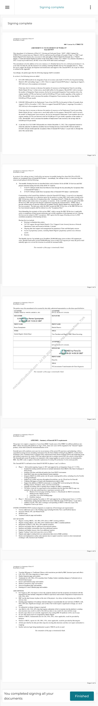

##### No title found]


````col
```col-md
flexGrow=.5
===
> [!info] [Page 1](_attachments/images_RBC-Parent-3.6.1.14.2.600203198.pdf_235854/page_1.png)
> 
```  
```col-md
Signing complete  
Signing complete  
Amendment #1 {0 Statement of Work #57
Royal Bank of Canada  
RBC Contract No: CTR021732  
AMENDMENT #1 TO STATEMENT OF WORK #57
Emerald MVP  
This Amendment #1 to Statement of Work #57: Hosting and #legal/Dedicated_Team (“SOW”) (RBC Contract No:
CTRO021732) is entered into as of March 4, 2023 by and between Royal Bank of Canada (“Client” or “RBC”) and
Markit Digital North America Inc. (successor in title and rights to Markit Digital On Demand, Inc.) (“Markit
Digital”). Client and Markit Digital are parties to the SOW (RBC Contract No: CTR021732), effective December 1,
2022. Except as provided herein, all other terms of the SOW shall remain un#legal/Changed.  
This amendment is for the addition of two new instances of a Monthly Service Fee for a defined period (items F, G),
a one-time fee (item H), and the increase to an existing, recurring Monthly Service Fee (amended item A) . These
#legal/Fees are to support the design, development and maintenance and support of the Emerald MVP, the #legal/Scope for which
is outlined in the Appendix.  
Accordingly, the parties agree that the following language shall be amended:
In section 6, the following items are added:  
F. $315,000 USD/month for the Integration Team of seventeen and a half (17.5) FTEs for the period starting
March 4, 2023 and ending August 3, 2023. This is to support Emerald MVP phase 1, targeting an August 4,
2023 delivery to the acceptance environment.  
Client may elect to increase or decrease the number of resources on the Integration Team by providing
Markit Digital 60 days’ written notice; email shall suffice for this purpose. Should RBC wish to increase
the number of Integration Team resources, the fee for incremental Integration Team members above the
original number of FTEs per Section 6 shall be $18,000 per FTE per month, regardless of the number of
FTEs. Should RBC wish to decrease the number of Integration Team resources, the savings shall be
$18,000 per FTE per month.  
G. $180,000 USD/month for the Deployment Team of ten (10) FTEs for the period of three (3) months from
August 4, 2023 to November 3, 2023. This is to support Emerald MVP phase 2, targeting a November 3,  
2023 delivery to the acceptance environment  
Client may elect to increase or decrease the number of resources on the Deployment Team by providing  
Markit Digital 60 days’ written notice; email shall suffice for this purpose. Should RBC wish to increase
the number of Deployment Team resources, the fee for incremental Deployment Team members above the
original number of FTEs per Section 6 shall be $18,000 per FTE per month, regardless of the number of
FTEs. Should RBC wish to decrease the number of Deployment Team resources, the savings shall be
$18,000 per FTE per month.  
H. A one-time fee of $215,000 USD payable on or before December 31, 2023. This a negotiated amount to
offset the reduction in additional monthly #legal/Fees for Hosting Services from $28,000 USD per month to
$15,000 USD per month upon the Acceptance Date of Emerald MVP phase | (as per item A) through the
end of the current term.  
Page 1 of 5
Amendment #1 to Statement of Work #57
Royal Bank of Canada
In section 6, the verbiage in item A shall reflect an increase in monthly hosting #legal/Fees from $44,476 to $59,476
effective on Acceptance Date of Emerald MVP phase 1. Accordingly, the verbiage in item A of section 6 shall be
removed and replaced with the following:  
A. The monthly Hosting Services (as described below and in Section 10) for all RBC DI Services and RBC
projects launched during the term of this SOW #57 shall be:  
I. $44,476 USD per month from the Effective Date through the day preceding the Acceptance Date
of Emerald MVP phase 1;  
Il $59,476 USD per month from Acceptance Date of Emerald MVP phase 1 and thereafter
Commencing on the Launch Date (defined as when the Emerald MVP phase | is moved to an integrated
acceptance environment or as otherwise agreed by the parties in writing, RBC shall conduct testing on the
RBC DI Services within five (5) business days (the “Acceptance Period”). Within the Acceptance Period,
RBC shall provide written notice of acceptance or rejection. In the event RBC rejects any part of the RBC
DI Services, RBC shall provide adequate expla#legal/Nation regarding the material defects. If RBC fails to
provide written notice of rejection within the Acceptance Period, Markit Digital may deem the RBC DI
Services accepted. The date upon which the RBC accepts the RBC DI Services, or the RBC DI Services
has been deemed accepted, shall be referred to as the "Acceptance Date."  
Notwithstanding the remainder of this section, RBC’s right to accept the RBC DI Services is applicable
solely to completion of listed project milestones and overall completion of development services. Hosting
Services are not subject to RBC’s acceptance. RBC agrees that the usage of hosting services by RBC
constitutes acceptance of the hosting services.
Hosting Services include:
© — Hosting in redundant data centers
© 24/7/365 support through Markit Digital’s Tier | Support Center formerly known as Network
Operations Center and located in Boulder, Colorado
© Ongoing data feed support and management for proprietary Client and #legal/Third-Party sources
© Access to proprietary systems, including Markit Digital’s proprietary symbol cross-reference
system
e = Security
The Monthly Service Fee includes up to 20 million (20,000,000) page views or direct API requests per
week. Should Client traffic #legal/Exceed 20,000,000 page views or direct AP] requests per week, the parties shall
mutually agree on a revised fee structure to account for increased traffic.
The remainder of this page is intentionally blank.
Page 2 of 5
Amendment #1 to Statement of Work #57
Royal Bank of Canada
The parties cause this amendment to be executed by their duly authorized representatives on the dates specified below.
ACCEPTED ACCEPTED
MARKIT DIGITAL NORTH AMERICA, INC. ROYAL BANK OF CANADA
SIGNATURE SIGNATURE
E-SIGNED by Renee Spampinato
on 2023-06-20 15:02:23 GMT
PRINT NAME PRINT NAME
Renee Spampinato Dimitri Busevs
TITLE ‘LE
Markit Digital- Global Head Vice President and Head of RBC Direct Investing
ACCEPTED.
ROYAL BANK OF CANADA
SIGNATURE
E-SIGNED by Flora Do
on 2023-06-20 14:50:30 GMT
PRINT NAME
Flora Do
TITLE
VP, Investments Transformation & Client Segments
The remainder of this page is intentionally blank.
Page 3 of 5
Amendment #1 to Statement of Work #57
Royal Bank of Canada
APPENDIX - Summary of Emerald MVP requirements
This project is to support a migration of users from HSBC Canada users of the HSBC InvestDirect platform onto
RBC’s Direct Investing (DI) platform on Aug 4, 2023. These new users will be migrated to the “Emerald” digital
product, which shall enable the inter#legal/Nationalization of DI
Emerald users will constitute a new user tier on an instance of the current DI experience and technology with an
expanded investing universe including instruments from the Stock Market of Hong Kong (HKEX), London Stock
Ex#legal/Change (LSE), Frankfurt Stock Ex#legal/Change (FRA) and Euronext Paris Stock Ex#legal/Change (EPA) and supporting quote
and research experiences for stocks, ETFs and indices that aim to emulate current DI to the extent in #legal/Scope below.
The Emerald and current-DI products are intended to fully merge together at a point in time to be determined by
RBC, thus RBC seeks to apply to Emerald a replication of existing DI architecture f to the extent possible
The Emerald MVP is defined as items listed IN #legal/Scope for phases | and 2 as follows:
© Phase I — Deliverable targeting August 4, 2023 and supported by an Integration Team of 17.5 FTEs
© Expand the existing symbol universe to include instruments from HKEX (The Stock Ex#legal/Change of
Hong Kong)
© Integrate real-time and delayed market data from HKEX instruments
© Map HKEX data into existing Detailed Quote templates
© Integrate HKEX fee-liable quotes into the quote counting deliverables, including from the FactSet
Trading Dashboard
© Support two symbol universes throughout the platform, one for DI and one for Emerald
© Translate DQ pages to French with translations provided by RBC
© Support the addition of HKEX instruments to existing RBC tools including the following:
Holdings drawer, Watchlist, Alerts, and Universal Search
© Upgrade of existing APIs to include above #legal/Changes for RBC’s consumption
© The below items are in #legal/Scope based on the assumption that the data from HKEX map very
similarly to the data underlying these experiences currently on DI
= Markets Overview page including: Sectors vs. Benchmark for HKEX instruments;
Market Events; Market Movers
= Asset Mix view of the Holdings page
= Portfolio Analyzer
© Phase 2 — Deliverable targeting November 4, 2023 and supported by an Deployment Team of 10 FTEs
© Maintenance, testing and fast-follows for items within the #legal/Scope of MVP phase 1 as per above
© Addition of LSE, FRA, EPA ex#legal/Changes corresponding to HKEX within the #legal/Scope of the
Integration Team as per above
UNDER CONSIDERATION (inclusion depends on complexity of final designs and requirements)  
* Various additional views of the Holdings page including Portfolio News and Portfolio Quotes  
* Screeners (Stock, ETF, and Mutual Fund)  
« MIND Events  
* Technical Analysis page and modules  
OUT OF #legal/Scope  
* Migrate existing HKEX, LSE, FRA, EPA alerts to RBC's alerting platform  
« Migrate existing HKEX, LSE, FRA, EPA watchlist data to RBC's watchlist platform  
* Integration of HKEX, LSE, FRA, EPA Options securities  
* Integrate and display data for additional inter#legal/National markets  
* Integrate and display commodities data from additional markets  
«Integrate and display treasury data from additional markets  
Support Trading Central alert types that exist in HSBC  
* Migrate and support existing book cost calculations that exist in HSBC platform  
© Quotes and fundamental, market and corporate data to support securities traded on select inter#legal/National
ex#legal/Changes: LSE, Euronext and Frankfurt  
Page 4 of 5
Amendment #1 to Statement of Work #57
Royal Bank of Canada  
¢ — Translate DQ pages to Traditional Chinese with translations provided by RBC (itemized quote and effort)  
« LSE, FRA, EPA data integration to legacy pages  
* Market Snapshot page and modules  
« — Technicals for LSE, FRA, EPA securities from Trading Central, including #legal/Changes to Technicals tab on
Detailed Quote pages  
© Sectors and Industries page and modules  
© Market Commentary page and modules  
«News & Headlines page and modules  
© Earnings & Events Calendar page and modules  
ASSUMPTIONS  
«For August 4, 2023, the target is to have the solutions deployed into the acceptance environment with the
Emerald MYP that includes integration of HKEX experiences and excludes integration of experiences for
LSE, FRA, EPA  
* RBC has the data licenses in place at the start of the project. Any delays in data licensing may shift the
delivery date.  
* Existing page templates will undergo minimal #legal/Changes to accommodate the new universe of HKEX, LSE,
FRA, EPA data. Significant #legal/Changes, such as those that would require a significant re-design, are out of
#legal/Scope.  
* No substantial re-design of pages is required  
«Any HKEX, LSE, FRA, EPA data that requires substantial effort to translate into the platform’s existing
data structures may result in a shift of the delivery date or may need to be removed from #legal/Scope  
+ Sccurity types that are not currently supported by the existing RBC DI platform will be out of #legal/Scope  
* No new data feeds need to be integrated by Markit Digital  
* Similar to HKEX, fundamentals data for LSE, FRA, EPA, where applicable, would be provided by
Refinitiv  
* — Similar to HKEX, reports for LSE, FRA, EPA, where applicable, would be provided by Morningstar  
«All data provided by the data providers map into existing data structures and does not require substantial remapping  
«Symbol universe logic being implemented as part of HKEX can be re-used  
The remainder of this page is intentionally blank.
Page 5 of 5  
You completed signing all your
documents  
Finished  
```
````
Notes:  


![[_attachments/RBC-Parent-3.6.1.14.2.6 00203198.pdf]