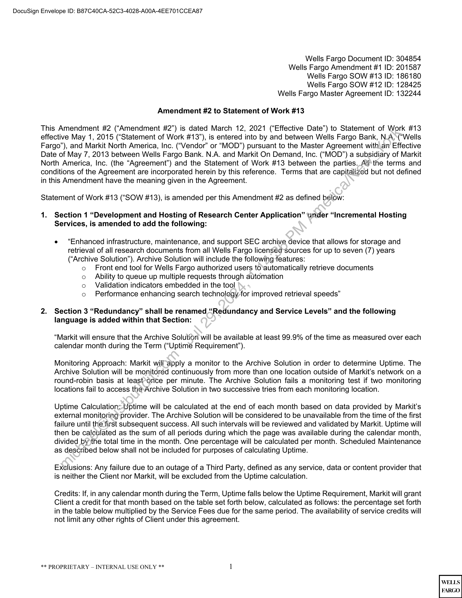
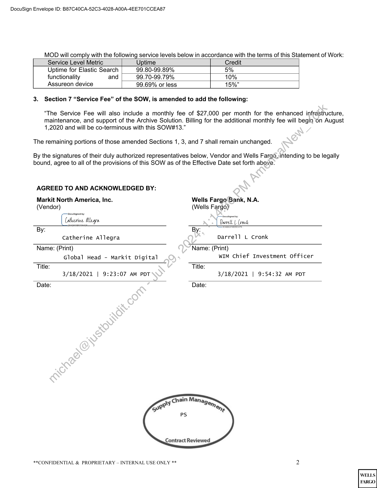

##### Amendment #2 to Statement of Work #13]

  
````col
```col-md
flexGrow=.5
===
> [!info] [Page 1](_attachments/images_WF-3.6.1.15.1.100190866.pdf_212026/page_1.png)
> 
```  
```col-md
DocuSign Envelope ID: B87C40CA-52C3-4028-A00A-4EE701CCEA87  
Wells Fargo Document ID: 304854  
Wells Fargo Amendment #1 ID: 201587
Wells Fargo SOW #13 ID: 186180  
Wells Fargo SOW #12 ID: 128425  
Wells Fargo Master Agreement ID: 132244  
Amendment #2 to Statement of Work #13  
This Amendment #2 (“Amendment #2”) is dated March 12, 2021 (“Effective Date”) to Statement of Work #13
effective May 1, 2015 (“Statement of Work #13”), is entered into by and between Wells Fargo Bank, N.A.\(“Wells
Fargo”), and Markit North America, Inc. (“Vendor” or “MOD”) pursuant to the Master Agreement with an Effective
Date of May 7, 2013 between Wells Fargo Bank. N.A. and Markit On Demand, Inc. (“MOD”) a subsidiary of Markit
North America, Inc. (the “Agreement”) and the Statement of Work #13 between the parties. All’the terms and
conditions of the Agreement are incorporated herein by this reference. Terms that are capitalized but not defined
in this Amendment have the meaning given in the Agreement.  
Statement of Work #13 (“SOW #13), is amended per this Amendment #2 as defined below:  
1.  
Section 1 “Development and Hosting of Research Center Application” tinder “Incremental Hosting
Services, is amended to add the following:  
e “Enhanced infrastructure, maintenance, and support SEC archive device that allows for storage and
retrieval of all research documents from all Wells Fargo licensed-sources for up to seven (7) years
(“Archive Solution”). Archive Solution will include the following features:  
o Front end tool for Wells Fargo authorized users to‘automatically retrieve documents
co Ability to queue up multiple requests through automation  
o Validation indicators embedded in the tool  
o Performance enhancing search technology for improved retrieval speeds”  
Section 3 “Redundancy” shall be renamed “Redundancy and Service Levels” and the following
language is added within that Section:  
“Markit will ensure that the Archive Solution will be available at least 99.9% of the time as measured over each
calendar month during the Term (“Uptime Requirement”).  
Monitoring Approach: Markit willapply a monitor to the Archive Solution in order to determine Uptime. The
Archive Solution will be monitored continuously from more than one location outside of Markit’s network on a
round-robin basis at least-once per minute. The Archive Solution fails a monitoring test if two monitoring
locations fail to access the-Archive Solution in two successive tries from each monitoring location.  
Uptime Calculation=-Uptime will be calculated at the end of each month based on data provided by Markit’s
external monitoring provider. The Archive Solution will be considered to be unavailable from the time of the first
failure until the first subsequent success. All such intervals will be reviewed and validated by Markit. Uptime will
then be calculated as the sum of all periods during which the page was available during the calendar month,
divided by)the total time in the month. One percentage will be calculated per month. Scheduled Maintenance
as described below shall not be included for purposes of calculating Uptime.  
Exclusions: Any failure due to an outage of a Third Party, defined as any service, data or content provider that
is neither the Client nor Markit, will be excluded from the Uptime calculation.  
Credits: If, in any calendar month during the Term, Uptime falls below the Uptime Requirement, Markit will grant
Client a credit for that month based on the table set forth below, calculated as follows: the percentage set forth
in the table below multiplied by the Service Fees due for the same period. The availability of service credits will
not limit any other rights of Client under this agreement.  
** PROPRIETARY — INTERNAL USE ONLY ** 1  
```
````
Notes:    
````col
```col-md
flexGrow=.5
===
> [!info] [Page 2](_attachments/images_WF-3.6.1.15.1.100190866.pdf_212026/page_2.png)
> 
```  
```col-md
DocuSign Envelope ID: B87C40CA-52C3-4028-A00A-4EE701CCEA87  
MOD will comply with the following service levels below in accordance with the terms of this Statement of Work:  
Service Level Metric Uptime Credit
Uptime for Elastic Search 99.80-99.89% 5%
functionality and 99.70-99.79% 10%
Assureon device 99.69% or less 15%”  
3. Section 7 “Service Fee” of the SOW, is amended to add the following:
“The Service Fee will also include a monthly fee of $27,000 per month for the enhanced infrastructure,
maintenance, and support of the Archive Solution. Billing for the additional monthly fee will begin on August
1,2020 and will be co-terminous with this SOW#13.”  
The remaining portions of those amended Sections 1, 3, and 7 shall remain unchanged.  
By the signatures of their duly authorized representatives below, Vendor and Wells Fargo,intending to be legally
bound, agree to all of the provisions of this SOW as of the Effective Date set forth above.  
AGREED TO AND ACKNOWLEDGED BY:  
Markit North America, Inc. Wells Fargo\Bank, N.A.
(Vendor) (Wells Fargo)  
Catlurine Weare
By: By:  
Catherine Allegra Darrell L Cronk
Name: (Print) Name: (Print)  
Global Head - Markit Digital WIM Chief Investment officer
Title: Title:  
3/18/2021 | 9:23:07 AM PDT 3/18/2021 | 9:54:32 AM PDT
Date: Date:  
Contract Reviewed  
**CONFIDENTIAL & PROPRIETARY — INTERNAL USE ONLY ** 2  
```
````
Notes:  


![[_attachments/WF-3.6.1.15.1.1 00190866.pdf]