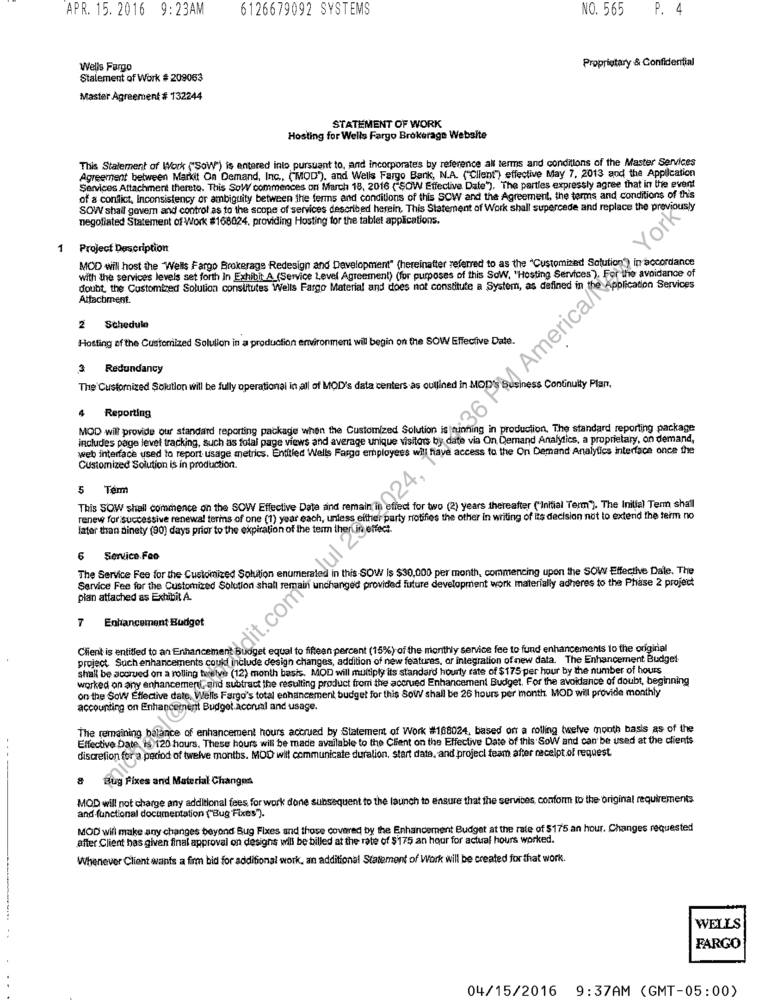
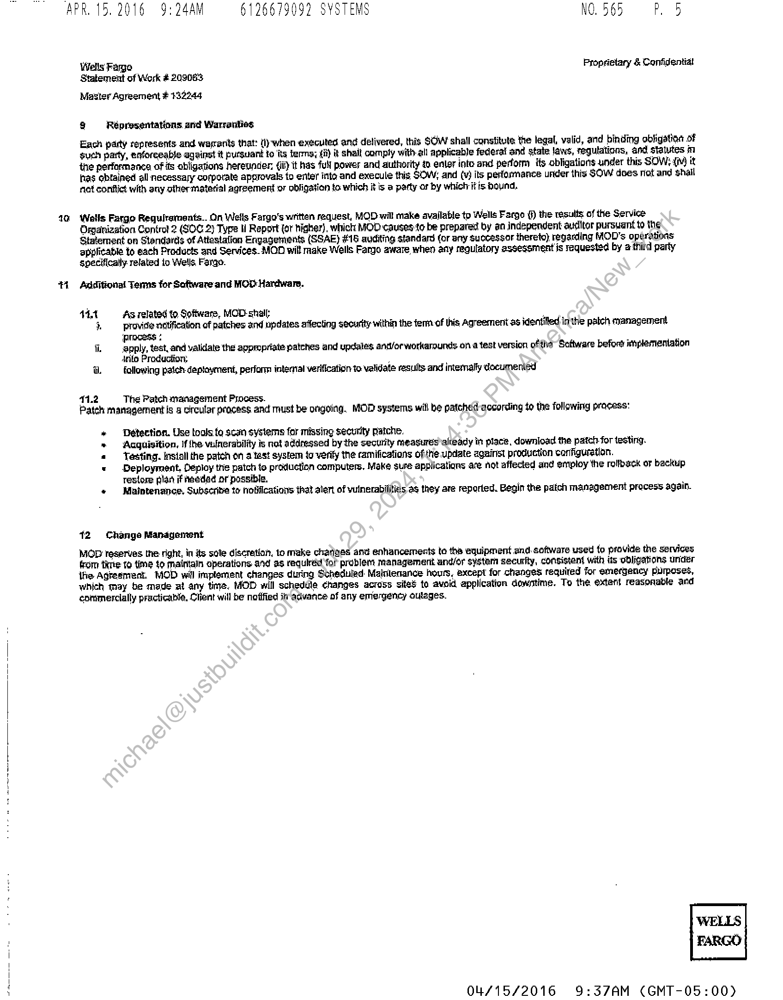
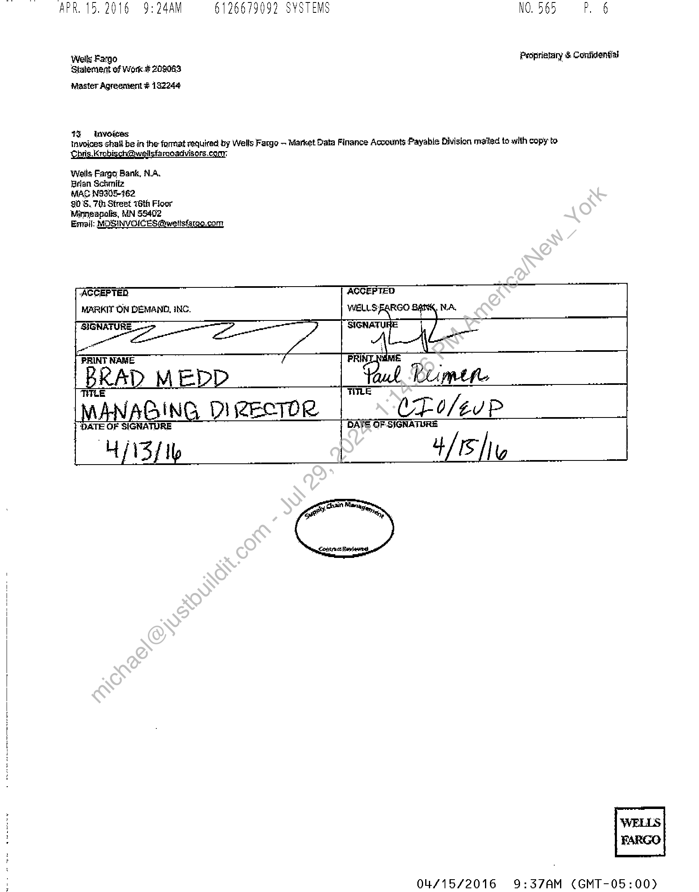
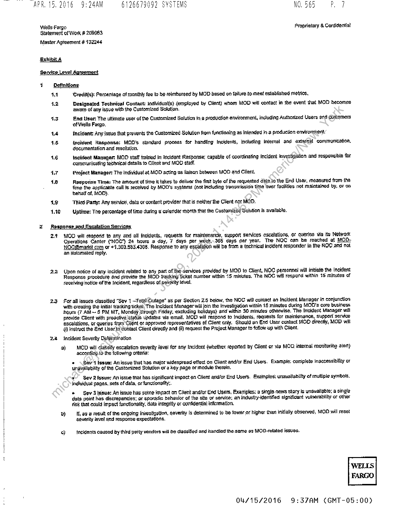
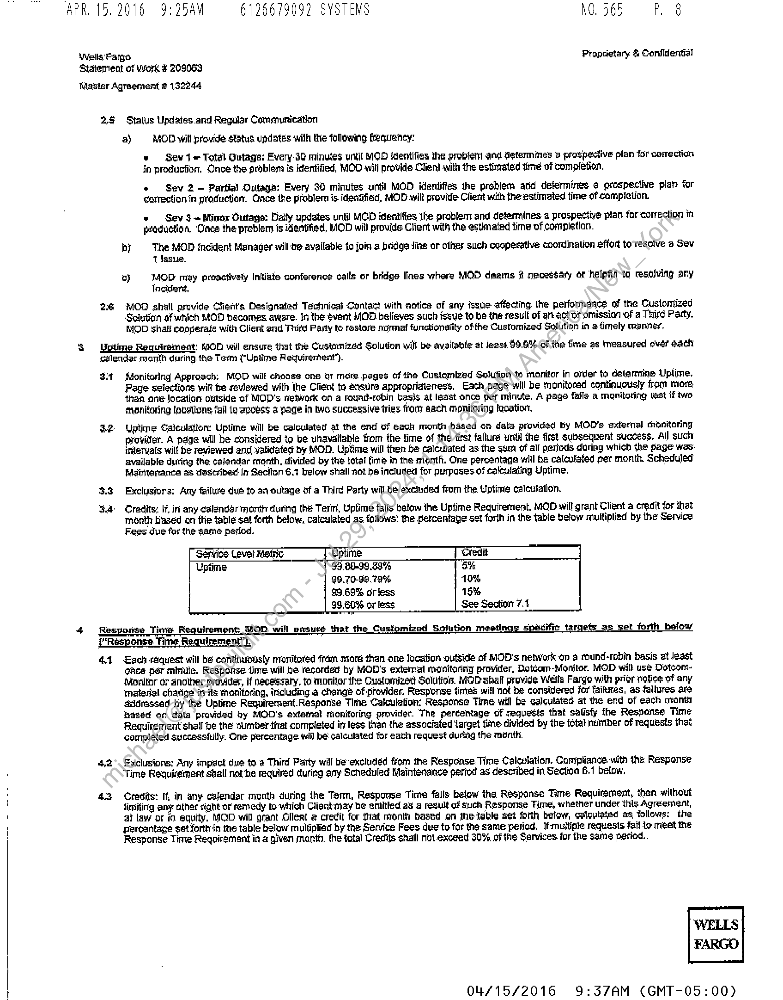
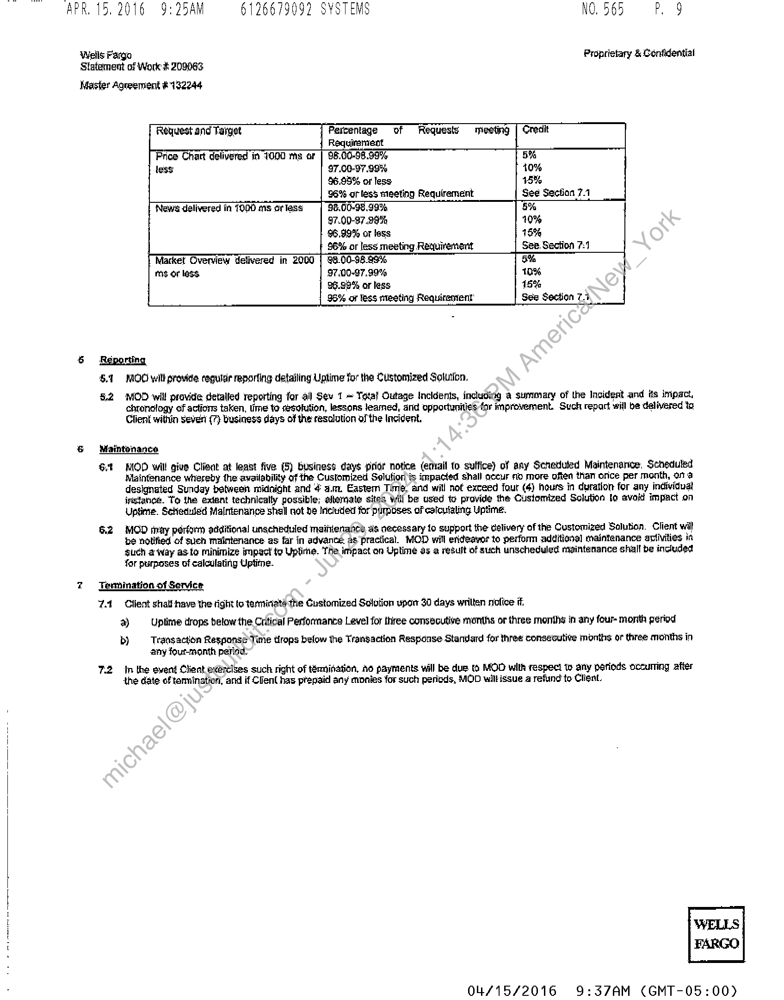
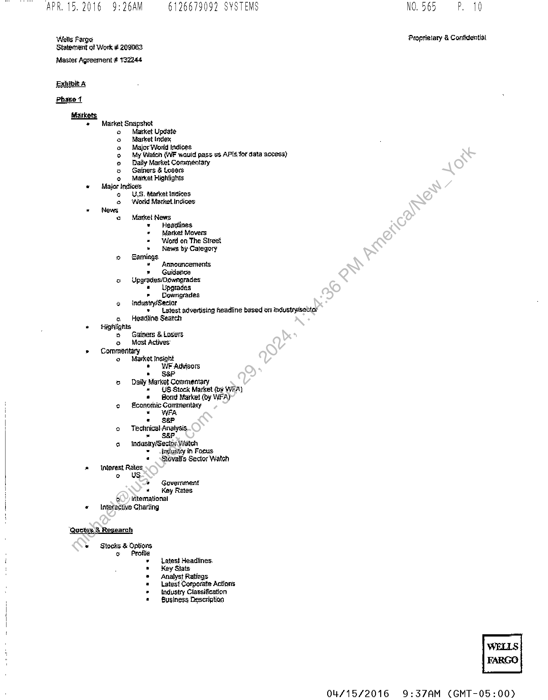
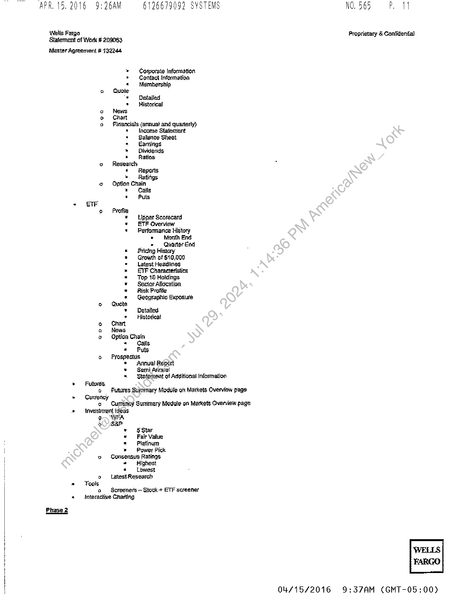
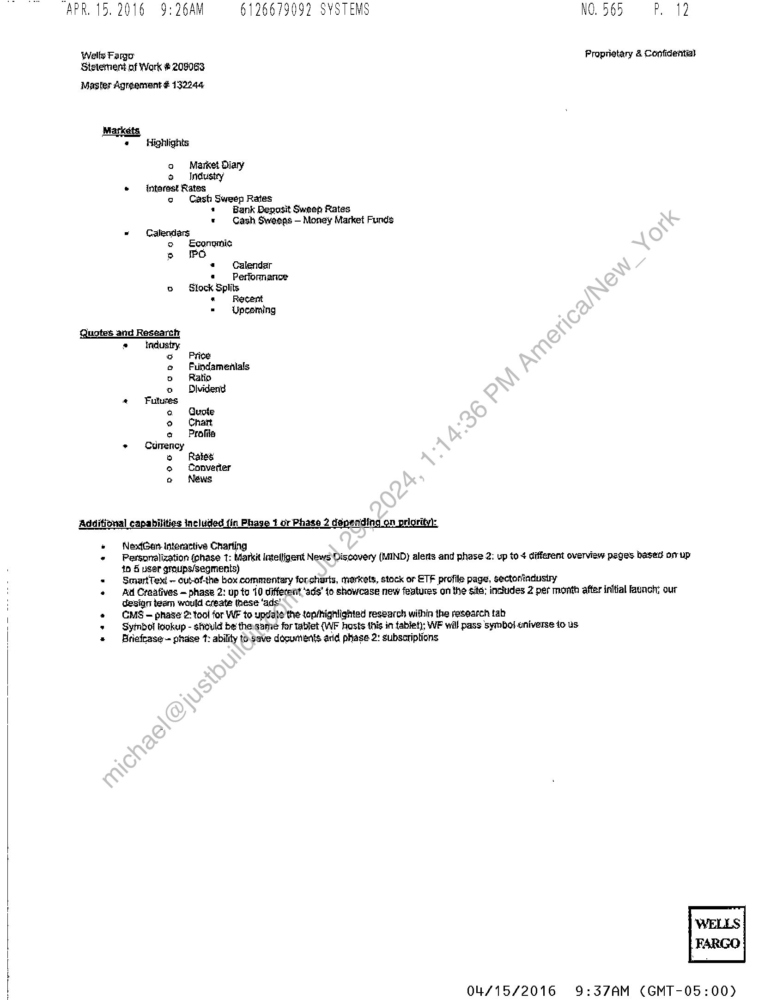

##### Statement of Work for Hosting Wells Fargo Brokerage Website]

  
````col
```col-md
flexGrow=.5
===
> [!info] [Page 1](_attachments/images_WF-3.6.1.15.1.200187395.pdf_210050/page_1.png)
> 
```  
```col-md
APR. 15. 2016 9:23AM 6126679092 SYSTEMS NO565 OP. 4  
‘Wells Fargo Proprietary & Confidential  
Statement of Work 208083
Master Agreement 132244  
STATEMENT OF WORK
Hosting for Wells Fargo Brokerage Website  
This Statement of Work (/SaWy") § entered into pursuant to, and incorporates by reference all terms and conditions of the Master Services
Agreement between Markit On Oemand, Inc,, (MOO"), and Wells Fargo Bank, NA. (“Client”) effective May 7, 2013 and the Application
Services Attachment teteto, This So/Y commences on March 18, 2016 (SQW Effective Date’). The partles expressly agree that in the evant
of conflict, Inconsistency or ambiguity between the ferms and conditions of this SOW and the Agreement, ihe terms and conditions of this
SOW shall gavern and controtas 40 the scope of services desorbed herein, This Statement of Work shall supercede and replace the previously
Tegofiated Statement of Work #168024, providing Hosting tor the tablet applications,  
Project Daseription  
MOD will host the “Wells Fargo Brokerage Redesign and Development” (hereinafter teferred to as the “Customized Solution’) in accordance
with the services levels set forth in Exhibit A (Service Level Agreement) (for purposes of this SoW, "Hosting Services’). Fer the avoidance of
doubt, the Customized Solution constitutes Wells Farge Material and dees not constitute a System, as defined in the. Application Services
Atlachment.  
Z Sthedwle
Hosting ofthe Customized Solution in a production environment will begin on the SOW Effective Date.  
a Redundancy
The Customized Soqutlon will be fully operational in all of MODs data centers-as ouljined in MOD's Gusiness Continuity Plan,  
4 Reporting  
MOD will provide our standard reparting package when the Customized Solution ig \tunning in production, The standard reporting package
Includes page jevet tracking, such as folal page views ahd average unique visita by. date via On, Demand Analytics, a proprietary, on demand,
web interface used to report usage metrics. Entitled Wells Fargo erhployees will Rave access to the On Demand Analytics interface once the  
Customized Solution is in production.  
5 ‘Tenn  
This SOW shall cormhenge gh the SOV Effective Data and repnain(in effect for two (2) years thereafter (Initial Term”). The Initial Tern, shail
Tenew forisuscegsive renewal tering of one (1) yeareach, unless either party notifies the other In writing of its dacision not to. extend the term no
jatar than dingty (90) days prior tothe expiration of ihe term ihen injeffect.  
& Seruice.Feo  
The Service Fee for the Custdmized Solution enumerated in this-SOW |s $30,000 per month, commencing upon the SOW Effective: Date. The
Sarvice Fee for the Customized Solution shall remain unchanged provided future develapient work materially adheres to the Phase 2 project
plan atfached as Exhibit A.  
7 Enhancement Borget  
Client is entitled ta an Enhancement Budget equal te fifean percent (15%)-ofthe miorithly senice fee to fund enhancements 16 the origirial
proiect. Such enhancements coukl include design changes, addition of new features, or integration of new data. The Enhancement Budget
ahiall be accrued on a rolling teetve (12) month basis. MOD will multiply'its standard hourly cate of $175 per hour by the number of hours.
worked on any anhancemen|,and subtract the vesuilting product from the accrued Enhancement Budget, For the avoidance of doubt, beginning
onthe Sov Effective date, Wells Fargo’s total enhancement budget for this SouY shall be 26 hours per month, MOD will provide monthly
accounting on Enhancement Budget.accrual and usage,  
The remaining bélanee of enhancement hours accrued by Siatement of Work #166024, based on @ rolling twelve month basis as of the
Effective Date. is)120.hours, These hours will be made available to the Client on the Effective Date of this: SoW and can’ be used at the clients
discretion for @ pattod of twelve months. MOLT wit communicate duralion, start date, and project feam after racelpt.of request,  
& by Fixes and Material Changes  
MODowill not charge any additional fees, for work done subsequent to the launch to engure that the servikes, confonn to the original requirements.
and functional documentation ("Bug Fixes’).  
MOC will make any changes beyond Bug Fixes and those covered by the Enhancement Budget at the rale of $1 75 an hour. Changes requested
after Client has given final approval on designs will be-billed at the rate of $179 an haar for actual hours worked.  
Whenever Client wants a firrn bid for additional work, an additional Statamant of Work will be created for that work.  
04/15/2016 9:37AM (GMT-0  
WELLES
FARGO  
5:00)  
```
````
Notes:    
````col
```col-md
flexGrow=.5
===
> [!info] [Page 2](_attachments/images_WF-3.6.1.15.1.200187395.pdf_210050/page_2.png)
> 
```  
```col-md
i
i
i
i
1
1  
APR 15. 2016 9:24AM 6126679092 SYSTEMS NO565 PB  
10  
bat  
\ells Farge Proprietary & Confidential
Statement of Work 209063  
Master Agreement 132244  
@ Répresentations ard Warranties  
Each party represents and warranis that: (I; when executed and delivered, this SOW shall constitute the legal, valid, and binding obligation of
such party, enforceable against it pursuant to its terms; fii} ik shail comply with-all applicable federal and state Jaws, regulations, and statutes m
the performance of its obligations hereunder, Gi) it has full power and authority 40 enter inte and perform its obligations under this SOW: iv) it
has obtained all necessary corporate approvals to enter inte and execule this SOW; and (v) its perfomance under this SOW does rot and shall
not conflict with any other material agreement or obligation to which it is a party or by which itis bound,  
Walls Fargo Requiraments.  On Wells Fargo’s written request, MOD will make available tp Wells Fargo (f) the tasults of the Service
Organization Controt 2 (SOC. 2) Type Il Report (or higher), which MOD-causesto be prepared by an independent auditor pursuant to the
Statement on Standards of Attestation Engagements (SSAE) #15 auditing standard (or any successor thereto) regacding MOD's operations
applicable to each Products and Services. MOD will make Wells Fargo aware when any reguiatory assessment is requested by a third party
specifically related to Wells, Fargo.  
Additional Tenns for Sattware and MOD Hardware.  
444 As related to Software, MOD: stall: ;
fa provide notification of patches and updates affecting security within the fern. of hig Agreement as identified inthe patch management
(Process :
fi. apply, test, and validate the appmpriate patches and updales and/orworkarounds on. a test version ofthe Software before implementation
Anita Production, ,
i following patch deployment, perform internal verification to validate results and imemaly documented  
11.2 The Patch management Process.
Patch management is a circular process and must be ongoing, MOD systems will be patched according to the following pracess:  
‘Detection. Use tools. to scan systems for missing sectiity patche.  
Acquisition, If he vulnerability is not addressed by the security meagures alteady in place, download the patch-for testing.  
Texting. install the patch on a Yast system to verify the ramifications ofthe update against production configuration.  
Deployment, Deploy the patch to production computers. Make sure applications are not affected and employ the roliback of backup
restore plan if Aeedad or possible,  
+ Maintenance. Subscribe to nolilcations that alert of vulnerabilities ag they are reported. Begin the patch management process again.  
anaes  
42 0 Change Managerent  
MOD reserves the right, in ite sole discretion, to make changes ang enhancements to tha equipment and.software used to provide the services
from titte 10 time to maintain operations and as required for problem management and/or system security, consistent with its obligations under
the Agresment. MOD will implement changes during Sohedulad Mainienance hours, axcept for changes required for emergency purposes,
which may be made at any time. MOD will schedule changes acrdss sites to avoid application downtime. To the extant reasonable and
ephimerclally practicable, Chent will be notified it advance of any emergency outages.  
WELLS  
FARGO  
04/15/2016 9:37AM (GMT-05:00)  
```
````
Notes:    
````col
```col-md
flexGrow=.5
===
> [!info] [Page 3](_attachments/images_WF-3.6.1.15.1.200187395.pdf_210050/page_3.png)
> 
```  
```col-md
APR. 15,2016 9:24AM 6126679092 SYSTEMS  
‘Wells Fargo
‘Statement of Work 209083  
Master Agreentent 132244  
130 Invoices  
NO565 Pb  
Proprigtary & Confidential  
Invoices shall be in the format required by Wells Fargo - Market Data Finance Accounts Payable Division, mailed to with copy to
Kk  
weilsfarqoadvisors.ci  
Walls Fargo Bank, NA.  
Bran Schmitz  
MAG NOs05-162  
90'S, 7th Street 16th Floor  
Minneapolis, MN 55402  
Email: MOSINVGICES @hweltsfarge.com  
AGGEPTED
WELLS FARGO NA,  
(ACCEPTED,
MARKIT ON DEMAND, INC.  
SIGNATUI  
TLE  
ING DIZECTOR VE 0/¢UP  
| DATE OF. SIGNATURE  
Lenhtra ce Rie baer,  
04/15/2016  
9:37AM (GMT-05:00)  
```
````
Notes:    
````col
```col-md
flexGrow=.5
===
> [!info] [Page 4](_attachments/images_WF-3.6.1.15.1.200187395.pdf_210050/page_4.png)
> 
```  
```col-md
CAPR. 15. 2016 9:24AM 6126679092 SYSTEMS NO565 oP 7  
Wells Fargo Proprietary & Conidential
Statement of Work 208063
Master Agreement 132244  
Exhibita  
Servirs  
‘el it  
1 Definitions:  
44
ta  
43  
14
aS  
16  
47  
18  
Ls  
1.700  
Z om:
Zt  
a2  
25  
‘Greditis): Percentage of monthly fee lo be reimbursed by MOD based on failure to meat exlablished metrics,  
Designated Technical Contact: individual(s) (employed by Client) whom MOD will contact in the event that MOD becomes
aware of any issue with the Customized Solution.  
nd Usar: The ultimate user of the Customized Solution in a production environment, induding Authorized Users and customers
of Wells Fargo.  
Incidant: Any issue that prevents the Customized Solution from funclloning as Intended in @ production environment  
Incident Rasponse: MQD's standard process for handling Incidents, including Internal and exiercal communication,
docymentation and resolution.  
Incident Manager MOD staff tralried in Incident Response: capable of coordinating Incident investigation and responsible Yor
communicating technical details to Glient and MOD staff.  
Project Manager The individual at MOD acting as liaison between MOD ahd Client.  
Regporiss Tima: The amount of time it takes to deliver the first byte of the requested dita to the End User, measured from tha
jime the applicable call is received by MOD's systems (not including transmission time over facilities not raaintained by, of on
betialf of, MOD),  
Thire Party: Any service, data or content provider that is neitherthe Client nor MOD.
Uptime: The percentage of ima during a calendar month that the Customized Solution is available,  
nee fon Services:  
‘MOD will respond to any and all Incidents, requests for maintenance, support services escalations, or queries Via its ‘Network
Operations Canter (NOC) 24 hours = day, 7 days per week,.365 days fer year. The NOC can be reached af MODNOC@mardt com or +4.303.583.4308. Response to any escalation wil be from a technical incident responder in the NOC and not
an automaled reply.  
Upon notice of any incident related to any part of the-servives providad by MOD to Client, NOC personnel will initiate the [neident
Response procedure and pirvide the MOD? tracking ficket number within 15 minutes, Tha NOC wif respond within 1 minutes of
recelving notice ofthe Incident, regardless of severity level.  
For all issues classified “Sev 1 —Total Outage” as per Section 2.5 below, the NOC wil colttact an Incident Manager in conjunction
with creating the initial tracking ticket, The Incident Manager will join the Investigation within 15 minutes ducing MOD's core business
ours (7 AM § PM WIT, Monday through Friday, excluding holidays) and’ within 30 minutes otherwise. The Incident Manager will
provide Clierit with prodctive Stateis updates via email. MOD will respond to incidents, raquests for maintenance, supporl service
escalations, or queties from Client or approved representatives of Client only. Should an End User contact MOG directly, MOB will
4) struct the End User to contael Client directly and (i) request the Project Manager to follow up with Cheat.  
incident Severtty Delennination
a) MOD will classify escalation severity Javel for any Incident (whether reported by Client or via MOD, internal monitoring alert)
accordingia the following criteria:
» \ Sev Issue: Anissue that has major widespread effect on Cliarit and/or End Users. Example: complete inaccessibility or
unavailability of ihe Customized Solution oF a key page or module therein.
s” Sev 2 Issue: An issue that has significant impact on Client and/or End Users. Examples: unavailability of multiple symbols,
individual pages, sets of dala, or functionality,  
* Sev 4 |ssue: An igsue has some impact on Client and/or End Users, Exarripies: a smgie news Slory is unavailable; a single
data point has discrepancies; or sporidic behavior of the site or service; ah industry-ideritified significant vulnerability or olher
Fisk that could impact functionality, data integrity or confidential information.  
pb} li, a3 @ result of the ongoing investigation, gaverity Is determined to be Tower or higher than initially observed, MOD will reset
severity level and response expectations.  
ay Incidents caused by third pahty vendors will be dagsified and handled ihe.same as MOG-olated issues.  
FARGO  
04/15/2016 9:37AM (GMT-05:00)  
```
````
Notes:    
````col
```col-md
flexGrow=.5
===
> [!info] [Page 5](_attachments/images_WF-3.6.1.15.1.200187395.pdf_210050/page_5.png)
> 
```  
```col-md
APR. 15. 2016 9:25AM 6126679092 SYSTEMS NO565 =P. 8  
Wells'Fango Proprietary & Confidential  
Statement of Work 208063
Masier Agraement 132244  
2.8 Status Updates and Regular Communication
a)  MOD-will provide status updates with the following frequency:  
+ Sev 1« Total Qutage: Every.J0 minutes until MOD identifies the problem and determines 2 prospective plan for comection
Jn production. Once the problem is identified, MOD will provide Client with the estimated time of completion.  
* Sev 2 = Partial Qutaga: Every 30 minutes until MOD identifies the problem and delermines @ prospective plan for
correction in production. Once the problem is identified, MOD wilt provide Client with the estimated time of compilation.  
+ Sev 3 = Minor Outage: Dally updates until MOD identifies the problem and determines a prospective plan for correction in
production, Cnes the problem is identified, MOD will provide Client with the esttmated fime of completion.  
by) The MOD) incident Manager will oe available to join 2 bridge fine or other such cooperative coordination effort torecolve a Sev
T Issue.  
co} © MOD may proactively Intitte conference calls or bridge lines where MOD daems necessary or helpfiil to resojving any
lncidertt,  
26 MOD shall provide Clent’s Designated Technical Contact with notice of any issue affecting (he pelformaace of the Customized  
Solution of which MOD becomes aware. In the event MOD believes such issue to be the resuil of artgctor omission of a Third Party,
MOD shall coppeérate with Client end Third Party to restore normal functionality ofthe Customized Solition in afimely manner.  
‘3 Uptime Requirement: MOD will ensure that the Customized Solution will be available at least. 99.5%. OF the time as measured over each
calendar manth during. the Tarn (“Uptime Requirentent’).  
34 Monitoring Approach: MOD will choose one or more pages of the Customized Solution te monitor in order to determine Uplime.
Page selections will be reviewed with the Client to ensure appropridieness, Each pag? will be monitored continuously irom more,
than one location outside of MOD's network on a round-robin basis al least once per minute, A page fails a monitoring west if wo
monitoring locations fail 1o aecass & page in lwo successive tries from: aach monitcring Incation,  
3.2 Uptime Caleulation: Uptime will be calculated at the end of cach month based on data provided by MOD's external monitoring
provitier. A page will be considered to be uhavaltable from the lime of the tirst fallure urilil the fivet subsequent success. Al) such
intervals will be reviewed and validates by MOD. Uptime will then be calculated as the sum of all pertods during which the page was:
available during the calendar month, divided by the total fine in the month. One percentage will be caleutsied per month. Scheduled
Mdiritenance as described In Seciion 6.1 below shall not be included for purposes of calculating Uptime.  
3.8 Exclusions: Any failure dué to an outage of a Third Party will be exciuded from the Uptine calculation.  
3a Credits: lf, in any calendar month during the Term, Uptime falls below the Uptime Requirement, MOD sill grant Client a credit for that
month based on thie table sat forth below, calculated as, follows: the percentage set forlh in the table below multiplied by the Service  
Fees due for the same period,  
Service Level Matric Uptime  
Uptime 99.80-99.59%
99.70-99.79%
99.09% orless
99.80% or less  
4 Response Tine Requirement: SOD will ensure that the Customized’ Solution meetings specific targets ae set iorth below
Response Fi ment”  
44° Each request wilt be contiuously monitoted fram more than one location outside of MOD's nebwork on a tound-robin basis at /east
ghca far minute. Response dime will ba recorded by MODs external monitoring provider, Dotcam-Monitor. MOD will usé DoteomMonitor or another provider, if necessary, to monitor the Customized Solution. MOD shall provide Wells Fargo with prior notice of any
material charige itis monitoring, including a change of provider, Response times will not be considered for faitures, as failures are
addressed -hy the Uptime Requirement.Response Time Calculation: Response Time will be calqulated at the end of each mont
paged on dala provided by MOD's external monitoring provider. The percentage of sequetis that salsfy the Response Time
Requirement shall be the nUmber that completed in less than the associated target time divided by the fotal number of raquests that
complated successfully. One percentage will be calculated for each request during the month.  
42° Bsiclusions: Any impact due to a Third Party will be ‘excluded from ihe Response Time Calculation. Compliance with the Response
‘Time Requirement shall npt‘ba required during any Scheduled Maintenance period as described in Section &.1 below.  
4.3 Credits: If, in any calendar month during ihe Tarm, Response Time falls below tha Response Time Requiterment, then without
finiting any other right or remedy to which Clientmay be entitled ag a result of such Response Time, whether under this Agreement,
at law or im aquity, MOD will grant Gllent a credit for that month based on the table set forth betow, csiloutated as follows: the
parcantage set forth in the table below multiplied by the Service Fees due to for the same period, IF-multipte requests fail to meet the  
Response Time Requirement in a given month. the total Credits shall noLexceed 30% of the Sarvices for the same period.  
04/15/2016 9:37AM (GMT-0  
FARGO  
5:00)  
```
````
Notes:    
````col
```col-md
flexGrow=.5
===
> [!info] [Page 6](_attachments/images_WF-3.6.1.15.1.200187395.pdf_210050/page_6.png)
> 
```  
```col-md
APR. 15. 2016 9:25AM 6126679092 SYSTEMS NO565 oP.  
Wells Fargo Proprietary & Confidential
Statement of Work 209083  
Master Agreement #132244  
Request and Target Percentage of ‘Requests mnieeting  
Price Chart delivered in 7000 ths or | 98.00-98.99%  
less 97.00-97.99%  
96.09% or less  
96% of less meeting Requirement  
News delivered in 1000 ms or lass  
96.99% or lass  
966 or less meeting Requirement See Section 21
Market Overview delivered in 2000 | 98.00-08.99%  
mg oF lass. 97.00-97,.99%  
26.95% or less  
96% of less meeting Requirement!  
6 Reporting
5.1 MOO with provide reguicie reporting detailing Uptime for the Customized Solution.
5.2 MOD will provide detalled reporting far all Sev 1 ~ Totaf Outage Inciden}s, including a summary of the Incident and its impact,
chronclogy of actions taken, lime te rsohution, lessons feared, and opportunities far improvement. Such repart will he delivered to
Client within sevel (7} business days of the resalution of the Incident.  
6 Maintenance  
Gt MOD will give Client at least five (5) Business days prior notice (email to suffice) of any Scheduled Maintenance, Scheduled
Maintenance whereby the availability of the Customized Solution is impacted shall secur mo more often than orice per month, ona
designated Sunday betweeh midnight and 4 a.m. Easter Time, and will not exceed four (4) hours in duration for any individual
instance. To Ihe extent technically possible; alternate sites will be used t provide the Customized Solution to avoid impact on
Uptime. Sehiedned Maintenance shall not be Included for purposes of catcutaling Uptime.  
62 MOD may périorm additional unscheduled maintenatcs #s necessary to support the delivery of the Customized Saluticn. Client will
be notified of sueh maintenance as far in advance. as practical. MOD will erideavor to perform additional maintenance axtivities in
such away as to minimize impact te Uptime. The impact on Uptime 2s 2 result of such unscheduled maintenance shall be included  
for purposes of calculating Uptime.  
2 Temimation of Service
Yef Cllent shalf-have the right to terminata the Customized Solution uparr 30 days wrilten notice if
a) Uplime drops below the Critical Performance Level for three consecutive momihs or three months in any four- month period  
b) Transaction Response Time tirops below the Transaction Response Standard for three consecutive months or three months in
any four-month period:  
7.2 Inthe event Client e<@relses such right of tamination, Ao payments will be due to MOD with respect te any periods occuring after
the date of tamination, and if Client has prepaid any monies for such periods, MOD wiltissue a refund to Client.  
04/15/2016 9:37AM (GMT-0  
FARGO  
5:00)  
```
````
Notes:    
````col
```col-md
flexGrow=.5
===
> [!info] [Page 7](_attachments/images_WF-3.6.1.15.1.200187395.pdf_210050/page_7.png)
> 
```  
```col-md
i
|
1
|
|
1  
APR. 15. 2016 9:26AM 6126679092 SYSTEMS  
Wells Farge
Statement of Work #209063  
Master Agreement 122244  
+ Market Snapshot  
Market Update
Market Index
Major Word Indices  
Baily Market Cormentaty
Gainers & Losers
Markat Hightights  
nitices
U.S. Market indicas
World Market Indices  
LJ
e
GoaZ7ogeonon  
a
5  
Market News
* Headlines
* Market Movers
= Word on The Street
» News by Category
o Earnings.
» Announcements
» Guidance
o Upgrades/Dewngrades
« Upgrades
» Dowrigrades
o  industry/Seclor  
a  
+ Latest advertising headline based on industrysectar  
o Headline Search
+ Highlights
® Gainers & Losers
@ Mast Actives’
»  Commeritary
o © Market Insight
© WP Advisors
» Sar
ce Daily Market Commentary
= US Stock Market (by WEA)
«Bond Market (oy WFA)
° Feonormic Commentary  
= WFA
« S&F  
o © Technical Analyais.
= S&P  
a = Indusiry/Sector Weateh
= industicy in Focus
= sStovall’s Sector Watch
» Interest Rates
o US
« Government
= Key Rates
o> Intemational
« — Interactive Gharling  
‘Qe arch  
* = Stocks & Options  
o Profile
* Latest Headlines.
» Key State
® Analyst Ratings
a ra Corporate Actions
» Industry Classification
« — Business Description  
My Watch (WF would pass us APIS for data access)  
04/15/2016  
NO565 =P. 10  
Propriatary & Confidential  
FARGO  
9:37AM (GMT-05:00)  
```
````
Notes:    
````col
```col-md
flexGrow=.5
===
> [!info] [Page 8](_attachments/images_WF-3.6.1.15.1.200187395.pdf_210050/page_8.png)
> 
```  
```col-md
APR. 15.2016 9:26AM 6126679092 SYSTEMS
Wells Farge
Stalement of Work 208063
Master Agreement 1392244
* Corporate Information
* — Contact Information
* Membership
o uote
‘+ Detailed
» Historical
o News
@ Chart
o = Financials {annuat.and quarterly}
» Income Stafement
"  Balanee Sheet
= Eamings
* Dividends
a Ratios
o Research
«  Reparis
«  Ratiigs
9 = Opflon Chain
1 GallePuls
- EF
eo Profile
«Lipper Scorecard
= ETF Overview
"Performance History
* Month End
= Quarter End
= Pricing History
= Growth of £10,000
= Latest Headlines
» ETF Characteristics
«Top 10 Holdings
* Sector Allocation
= Risk Profife
* Geographic Exposure
2 Quote
¥  Detaifed
» Historical
ea Chart
o News
o © Option Chain
- Calls
a Puts
¢ = Prospactus
= Annual Report
= Semi Annual
= Statement of Additional Information
+ Futures,
e Futures Summary Module oh Markets Qverviow page
»  Gurrency  
Phase 2  
o © Currensy Summary Medule gn Markets Overview page
levesiment ideas  
WEA  
90) 5aP
* §Ster
«  Falr Value
= Platinum  
» Power Fick
o «© Consensus Ratings  
= Highest
«= Lowest
o = Latest Research
Tools
o = 6Screeners — Stock + ETF screener
Interactive Grarting  
04/15/2016  
NO565 PAI  
Proprietary & Gonitental  
9:37AM (GMT-05:00)  
```
````
Notes:    
````col
```col-md
flexGrow=.5
===
> [!info] [Page 9](_attachments/images_WF-3.6.1.15.1.200187395.pdf_210050/page_9.png)
> 
```  
```col-md
“APR. 15. 2016 9:26AM 6126679092 SYSTEMS
Wells Fargo
‘Statement of Work 205063
Master Agreement 132244
Markdts
+ Highlights
o © Market Diary
o = Industry  
+ — interest Rates  
C]  
Cash Sweep Rates
+ Bank Beposit Sweep Rates
« Gash Sweeps — Money Market Funds  
bed Calendars
oe Ecangmic
® iu)
«  Galendar
« Perfonnance
o Stock Splits
« Recent
= Upceraing
Quotes and Research
» Industry
o = Price
o Fundamentals
o = Ratio
o Dividend
* Futures
a Quote
@ Chart
o = Profits
+ Currency
9 Rakes
o Converter
o =©News  
» Nexfsen interactive Crarting
+  Persondlization (phase 1: Markit Intelligent News Discovery (MIND) alerts and phase 2: up to 4 different overview pages based orrup  
10 5 user groups/segments)
= SmertText — cutotthe box commentary forgharts, merkets, stock or ETF profile page, sectonindusiry
+ Ad Croatives ~ phase 2: up to 10 different ‘scis" fo showcase new features on the site: includes Z per month after inltal launch; our  
design team would create these ‘ads’
« GMS — phase & tool for WF to update the top/highlighted resparch within the research tab
+ — Syinbol lookup - stiduld be thesame for tablet (WF hosts this in tablet); WE will pass synbot universe to us  
+ Briefsase— phase t: ability to save documents ard phase 2: subsoriptions  
04/15/2016  
NO565 =P. 12  
Proprietary & Confidential  
9:37AM (GMT-05:00)  
```
````
Notes:  


![[_attachments/WF-3.6.1.15.1.2 00187395.pdf]