##### Master Agreement

````col
```col-md
flexGrow=.5
===
> [!info] [Page 1](_attachments/images_WF-3.6.1.15.1.3WellsFargo-MasterAgreement7.05.2013.pdf_210124/page_1.png)
> 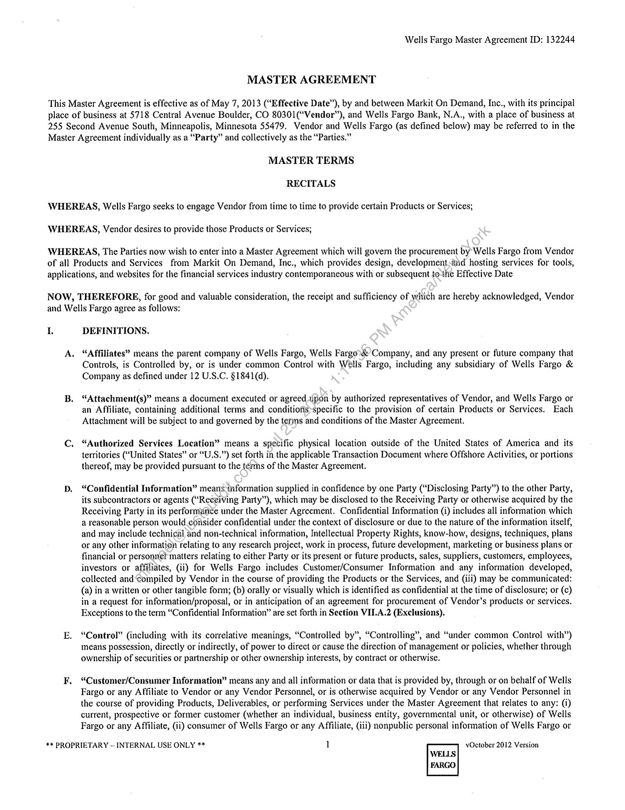
```
```col-md
Wells Fargo Master Agreement ID: 132244
MASTER AGREEMENT
This Master Agreement is effective as of May 7, 2013 (“Effective Date”), by and between Markit On Demand, Inc., with its principal
place of business at 5718 Central Avenue Boulder, CO 80301 (“Vendor”), and Wells Fargo Bank, N.A., with a place of business at
255 Second Avenue South, Minneapolis, Minnesota 55479. Vendor and Wells Fargo (as defined below) may be referred to in the
Master Agreement individually as a “Party” and collectively as the “Parties.”
MASTER TERMS
RECITALS
WHEREAS, Wells Fargo seeks to engage the Vendor from time to time to provide certain Products or Services;
WHEREAS, the Vendor desires to provide those Products or Services;
WHEREAS, the Parties now wish to enter into a Master Agreement which will govern the procurement by Wells Fargo from the Vendor
of all Products and Services from Markit On Demand, Inc., which provides design, development, and hosting services for tools,
applications, and websites for the financial services industry contemporaneously with or subsequent to the Effective Date.
NOW, THEREFORE, for good and valuable consideration, the receipt and sufficiency of which are hereby acknowledged, the Vendor
and Wells Fargo agree as follows:
L DEFINITIONS.
A. “Affiliates” means the parent company of Wells Fargo, Wells Fargo & Company, and any present or future company that
Controls, is Controlled by, or is under common Control with Wells Fargo, including any subsidiary of Wells Fargo & Company as defined under 12 U.S.C, §1841(d).
B. “Attachment(s)” means a document executed or agreed upon by authorized representatives of the Vendor and Wells Fargo or
an Affiliate, containing additional terms and conditions specific to the provision of certain Products or Services. Each
Attachment will be subject to and governed by the terms and conditions of the Master Agreement.
C. “Authorized Services Location” means a specific physical location outside of the United States of America and its
territories (“United States” or “U.S.”) set forth in the applicable Transaction Document where Offshore Activities, or portions
thereof, may be provided pursuant to the terms of the Master Agreement.
D. “Confidential Information” means information supplied in confidence by one Party (“Disclosing Party”) to the other Party,
its subcontractors, or agents (“Receiving Party”), which may be disclosed to the Receiving Party or otherwise acquired by the
Receiving Party in its performance under the Master Agreement. Confidential Information (i) includes all information which
a reasonable person would consider confidential under the context of disclosure or due to the nature of the information itself,
and may include technical and non-technical information, Intellectual Property Rights, know-how, designs, techniques, plans,
or any other information relating to any research project, work in process, future development, marketing, business plans, or
financial or personnel matters relating to either Party or its present or future products, sales, suppliers, customers, employees,
investors, or affiliates, (ii) for Wells Fargo includes Customer/Consumer Information and any information developed,
collected, and compiled by the Vendor in the course of providing the Products or Services, and (iii) may be communicated:
(a) in a written or other tangible form; (b) orally or visually, which is identified as confidential at the time of disclosure; or (c)
in a request for information/proposal, or in anticipation of an agreement for procurement of the Vendor’s products or services.
Exceptions to the term “Confidential Information” are set forth in Section VII.A.2 (Exclusions).
E. “Control” (including with its correlative meanings, “Controlled by”, “Controlling”, and “under common Control with”)
means possession, directly or indirectly, of power to direct or cause the direction of management or policies, whether through
ownership of securities or partnership or other ownership interests, by contract, or otherwise.
F. “Customer/Consumer Information” means any and all information or data that is provided by, through or on behalf of Wells
Fargo or any Affiliate to the Vendor or any Vendor Personnel, or is otherwise acquired by Vendor or any Vendor Personnel in
the course of providing Products, Deliverables, or performing Services under the Master Agreement that relates to any: (i)
current, prospective or former customer (whether an individual, business entity, governmental unit, or otherwise) of Wells
Fargo or any Affiliate, (ii) consumer of Wells Fargo or any Affiliate, (iii) nonpublic personal information of Wells Fargo or
** PROPRIETARY ~ INTERNAL USE ONLY ** 1 yOctober 2012 Version
```
````
Notes:
````col
```col-md
flexGrow=.5
===
> [!info] [Page 2](_attachments/images_WF-3.6.1.15.1.3WellsFargo-MasterAgreement7.05.2013.pdf_210124/page_2.png)
> 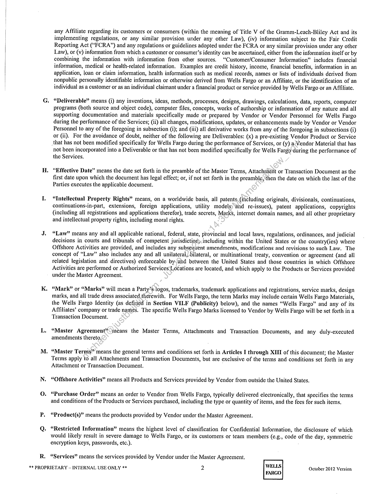
```
```col-md
J.
R.
any Affiliate regarding its customers or consumers (within the meaning of Title V of the Gramm-Leach-Bliley Act and its
implementing regulations, or any similar provision under any other Law), (iv) information subject to the Fair Credit
Reporting Act (“FCRA”) and any regulations or guidelines adopted under the FCRA or any similar provision under any other
Law), or (v) information from which a customer or consumer’s identity can be ascertained, either from the information itself or by
combining the information with information from other sources. “Customer/Consumer Information” includes financial
information, medical or health-related information. Examples are credit history, income, financial benefits, information in an
application, loan or claim information, health information such as medical records, names or lists of individuals derived from
nonpublic personally identifiable information or otherwise derived from Wells Fargo or an Affiliate, or the identification of an
individual as a customer or as an individual claimant under a financial product or service provided by Wells Fargo or an Affiliate.
“Deliverable” means (i) any inventions, ideas, methods, processes, designs, drawings, calculations, data, reports, computer
programs (both source and object code), computer files, concepts, works of authorship or information of any nature and all
supporting documentation and materials specifically made or prepared by the Vendor or Vendor Personnel for Wells Fargo
during the performance of the Services; (ii) all changes, modifications, updates, or enhancements made by Vendor or Vendor
Personnel to any of the foregoing in subsection (i); and (iii) all derivative works from any of the foregoing in subsections (i)
or (ii). For the avoidance of doubt, neither of the following are Deliverables: (x) a pre-existing Vendor Product or Service
that has not been modified specifically for Wells Fargo during the performance of Services, or (y) a Vendor Material that has
not been incorporated into a Deliverable or that has not been modified specifically for Wells Fargo during the performance of
the Services.
“Effective Date” means the date set forth in the preamble of the Master Terms, Attachment, or Transaction Document as the
first date upon which the document has legal effect; or, if not set forth in the preamble, then the date on which the last of the
Parties executes the applicable document.
“Intellectual Property Rights” means, on a worldwide basis, all patents (including originals, divisionals, continuations,
continuations-in-part, extensions, foreign applications, utility models) and re-issues, patent applications, copyrights
(including all registrations and applications therefor), trade secrets, Marks, internet domain names, and all other proprietary
and intellectual property rights, including moral rights.
“Law” means any and all applicable national, federal, state, provincial, and local laws, regulations, ordinances, and judicial
decisions in courts and tribunals of competent jurisdiction, including within the United States or the country(ies) where
Offshore Activities are provided, and includes any subsequent amendments, modifications, and revisions to such Law. The
concept of “Law” also includes any and all unilateral, bilateral, or multinational treaty, convention, or agreement (and all
related legislation and directives) enforceable by and between the United States and those countries in which Offshore
Activities are performed or Authorized Services Locations are located, and which apply to the Products or Services provided
under the Master Agreement.
“Mark” or “Marks” will mean a Party’s logos, trademarks, trademark applications and registrations, service marks, design
marks, and all trade dress associated therewith. For Wells Fargo, the term Marks may include certain Wells Fargo Materials,
the Wells Fargo Identity (as defined in Section VII.F (Publicity) below), and the names “Wells Fargo” and any of its
Affiliates’ company or trade names. The specific Wells Fargo Marks licensed to Vendor by Wells Fargo will be set forth in a
Transaction Document.
“Master Agreement” means the Master Terms, Attachments, and Transaction Documents, and any duly-executed amendments thereto.
“Master Terms” means the general terms and conditions set forth in Articles I through XIII of this document; the Master
Terms apply to all Attachments and Transaction Documents but are exclusive of the terms and conditions set forth in any
Attachment or Transaction Document.
“Offshore Activities” means all Products and Services provided by Vendor from outside the United States.
“Purchase Order” means an order to Vendor from Wells Fargo, typically delivered electronically, that specifies the terms
and conditions of the Products or Services purchased, including the type or quantity of items, and the fees for such items.
“Product(s)” means the products provided by the Vendor under the Master Agreement.
“Restricted Information” means the highest level of classification for Confidential Information, the disclosure of which
would likely result in severe damage to Wells Fargo or its customers or team members (e.g., code of the day, symmetric
encryption keys, passwords, etc.).
“Services” means the services provided by Vendor under the Master Agreement.
** PROPRIETARY — INTERNAL USE ONLY ** 1 yOctober 2012 Version
```
````
Notes:
````col
```col-md
flexGrow=.5
===
> [!info] [Page 3](_attachments/images_WF-3.6.1.15.1.3WellsFargo-MasterAgreement7.05.2013.pdf_210124/page_3.png)
> 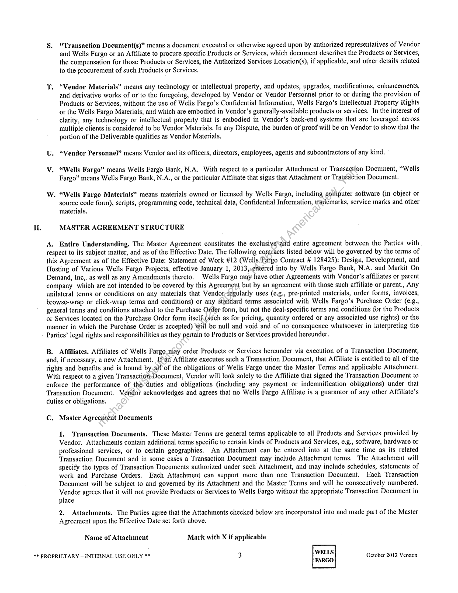
```
```col-md
Ik.
** PROPRIETARY — INTERNAL USE ONLY ** 3
S. “Transaction Document(s)” means a document executed or otherwise agreed upon by authorized representatives of the Vendor
and Wells Fargo or an Affiliate to procure specific Products or Services, which document describes the Products or Services,
the compensation for those Products or Services, the Authorized Services Location(s), if applicable, and other details related
to the procurement of such Products or Services.
T. “Vendor Materials” means any technology or intellectual property, and updates, upgrades, modifications, enhancements,
and derivative works of or to the foregoing, developed by Vendor or Vendor Personnel prior to or during the provision of
Products or Services, without the use of Wells Fargo’s Confidential Information, Wells Fargo’s Intellectual Property Rights
or the Wells Fargo Materials, and which are embodied in Vendor’s generally-available products or services. In the interest of
clarity, any technology or intellectual property that is embodied in Vendor's back-end systems that are leveraged across
multiple clients is considered to be Vendor Materials. In any Dispute, the burden of proof will be on Vendor to show that the
portion of the Deliverable qualifies as Vendor Materials.
U. “Vendor Personnel” means Vendor and its officers, directors, employees, agents, and subcontractors of any kind.
V. “Wells Fargo” means Wells Fargo Bank, N.A. With respect to a particular Attachment or Transaction Document, “Wells
Fargo” means Wells Fargo Bank, N.A., or the particular Affiliate that signs that Attachment or Transaction Document.
W. “Wells Fargo Materials” means materials owned or licensed by Wells Fargo, including computer software (in object or
source code form), scripts, programming code, technical data, Confidential Information, trademarks, service marks, and other
materials.
MASTER AGREEMENT STRUCTURE
A. Entire Understanding. The Master Agreement constitutes the exclusive and entire agreement between the Parties with
respect to its subject matter, and as of the Effective Date. The following contracts listed below will be governed by the terms of
this Agreement as of the Effective Date: Statement of Work #12 (Wells Fargo Contract 128425): Design, Development, and
Hosting of Various Wells Fargo Projects, effective January 1, 2013, entered into by Wells Fargo Bank, N.A. and Markit On
Demand, Inc., as well as any Amendments thereto. Wells Fargo may have other Agreements with Vendor’s affiliates or parent
company which are not intended to be covered by this Agreement but by an agreement with those such affiliates or parent. Any
unilateral terms or conditions on any materials that Vendor regularly uses (e.g., pre-printed materials, order forms, invoices,
browse-wrap or click-wrap terms and conditions) or any standard terms associated with Wells Fargo’s Purchase Order (e.g.,
general terms and conditions attached to the Purchase Order form, but not the deal-specific terms and conditions for the Products
or Services located on the Purchase Order form itself such as for pricing, quantity ordered, or any associated use rights) or the
manner in which the Purchase Order is accepted will be null and void and of no consequence whatsoever in interpreting the
Parties’ legal rights and responsibilities as they pertain to Products or Services provided hereunder.
B. Affiliates. Affiliates of Wells Fargo may order Products or Services hereunder via execution of a Transaction Document,
and, if necessary, a new Attachment. If an Affiliate executes such a Transaction Document, that Affiliate is entitled to all of the
rights and benefits and is bound by all of the obligations of Wells Fargo under the Master Terms and applicable Attachment.
With respect to a given Transaction Document, Vendor will look solely to the Affiliate that signed the Transaction Document to
enforce the performance of the duties and obligations (including any payment or indemnification obligations) under that
Transaction Document. Vendor acknowledges and agrees that no Wells Fargo Affiliate is a guarantor of any other Affiliate’s
duties or obligations.
C. Master Agreement Documents
1. Transaction Documents. These Master Terms are general terms applicable to all Products and Services provided by
Vendor. Attachments contain additional terms specific to certain kinds of Products and Services, e.g., software, hardware or
professional services, or to certain geographies. An Attachment can be entered into at the same time as its related
Transaction Document and in some cases a Transaction Document may include Attachment terms. The Attachment will
specify the types of Transaction Documents authorized under such Attachment, and may include schedules, statements of
work, and Purchase Orders. Each Attachment can support more than one Transaction Document. Each Transaction
Document will be subject to and governed by its Attachment and the Master Terms and will be consecutively numbered.
Vendor agrees that it will not provide Products or Services to Wells Fargo without the appropriate Transaction Document in
place.
2. Attachments. The Parties agree that the Attachments checked below are incorporated into and made part of the Master
Agreement upon the Effective Date set forth above.
Name of Attachment Mark with X if applicable
October 2012 Version
```
````
Notes:
````col
```col-md
flexGrow=.5
===
> [!info] [Page 4](_attachments/images_WF-3.6.1.15.1.3WellsFargo-MasterAgreement7.05.2013.pdf_210124/page_4.png)
> 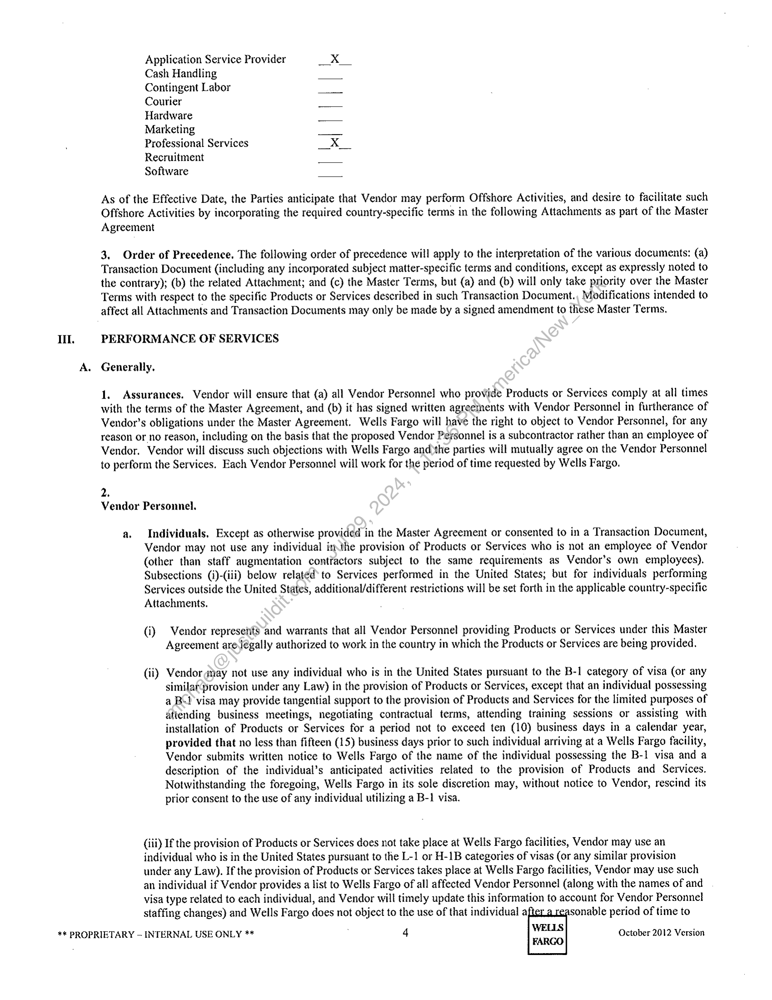
```
```col-md
II.
** PROPRIETARY — INTERNAL USE ONLY ** 4
Application Service Provider x
Cash Handling
Contingent Labor
Courier
Hardware
Marketing
Professional Services X
Recruitment
Software
As of the Effective Date, the Parties anticipate that the Vendor may perform Offshore Activities and desire to facilitate such
Offshore Activities by incorporating the required country-specific terms in the following Attachments as part of the Master
Agreement.
3. Order of Precedence. The following order of precedence will apply to the interpretation of the various documents: (a)
Transaction Document (including any incorporated subject matter-specific terms and conditions, except as expressly noted to
the contrary); (b) the related Attachment; and (c) the Master Terms, but (a) and (b) will only take priority over the Master
Terms with respect to the specific Products or Services described in such Transaction Document. Modifications intended to
affect all Attachments and Transaction Documents may only be made by a signed amendment to these Master Terms.
PERFORMANCE OF SERVICES
Generally,
1. Assurances. The Vendor will ensure that (a) all Vendor Personnel who provide Products or Services comply at all times
with the terms of the Master Agreement, and (b) it has signed written agreements with Vendor Personnel in furtherance of
Vendor’s obligations under the Master Agreement. Wells Fargo will have the right to object to Vendor Personnel, for any
reason or no reason, including on the basis that the proposed Vendor Personnel is a subcontractor rather than an employee of
the Vendor. Vendor will discuss such objections with Wells Fargo and the parties will mutually agree on the Vendor Personnel
to perform the Services. Each Vendor Personnel will work for the period of time requested by Wells Fargo.
2. Vendor Personnel.
a. Individuals. Except as otherwise provided in the Master Agreement or consented to in a Transaction Document,
Vendor may not use any individual in the provision of Products or Services who is not an employee of the Vendor
(other than staff augmentation contractors subject to the same requirements as the Vendor’s own employees).
Subsections (i)-(iii) below relate to Services performed in the United States; but for individuals performing
Services outside the United States, additional/different restrictions will be set forth in the applicable country-specific
Attachments.
(i) The Vendor represents and warrants that all Vendor Personnel providing Products or Services under this Master
Agreement are legally authorized to work in the country in which the Products or Services are being provided.
(ii) Vendor may not use any individual who is in the United States pursuant to the B-1 category of visa (or any
similar provision under any Law) in the provision of Products or Services, except that an individual possessing
a B-1 visa may provide tangential support to the provision of Products and Services for the limited purposes of
attending business meetings, negotiating contractual terms, attending training sessions, or assisting with
the installation of Products or Services for a period not to exceed ten (10) business days in a calendar year,
provided that no less than fifteen (15) business days prior to such individual arriving at a Wells Fargo facility,
the Vendor submits written notice to Wells Fargo of the name of the individual possessing the B-1 visa and a
description of the individual’s anticipated activities related to the provision of Products and Services.
Notwithstanding the foregoing, Wells Fargo, in its sole discretion, may, without notice to Vendor, rescind its
prior consent to the use of any individual utilizing a B-1 visa.
(iii) If the provision of Products or Services does not take place at Wells Fargo facilities, Vendor may use an
individual who is in the United States pursuant to the L-1 or H-1B categories of visas (or any similar provision
under any Law). If the provision of Products or Services takes place at Wells Fargo facilities, Vendor may use such
an individual if Vendor provides a list to Wells Fargo of all affected Vendor Personnel (along with the names of
and visa type related to each individual), and Vendor will timely update this information to account for Vendor Personnel
staffing changes, and Wells Fargo does not object to the use of that individual after a reasonable period of time to
October 2012 Version
```
````
Notes:
````col
```col-md
flexGrow=.5
===
> [!info] [Page 5](_attachments/images_WF-3.6.1.15.1.3WellsFargo-MasterAgreement7.05.2013.pdf_210124/page_5.png)
> 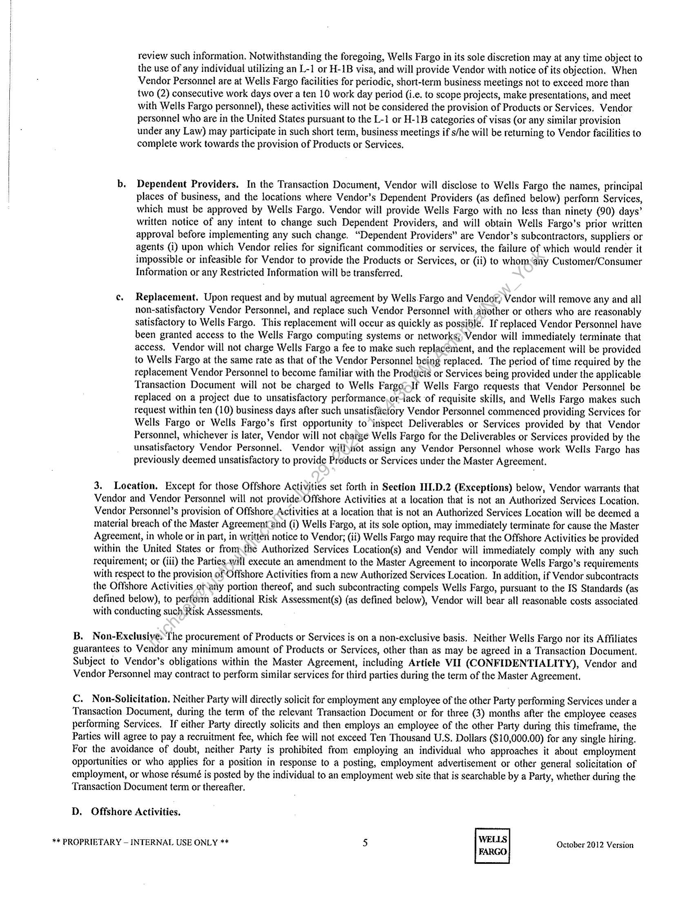
```
```col-md
review such information. Notwithstanding the foregoing, Wells Fargo, in its sole discretion, may at any time object to
the use of any individual utilizing an L-1 or H-1B visa, and will provide the Vendor with notice of its objection. When
Vendor Personnel are at Wells Fargo facilities for periodic, short-term business meetings not to exceed more than
two (2) consecutive work days over a ten (10) work day period (i.e., to scope projects, make presentations, and meet
with Wells Fargo personnel), these activities will not be considered the provision of Products or Services. Vendor
personnel who are in the United States pursuant to the L-1 or H-1B categories of visas (or any similar provision
under any Law) may participate in such short-term business meetings if they will be returning to Vendor facilities to
complete work towards the provision of Products or Services.
b. Dependent Providers. In the Transaction Document, Vendor will disclose to Wells Fargo the names, principal
places of business, and the locations where Vendor’s Dependent Providers (as defined below) perform Services,
which must be approved by Wells Fargo. Vendor will provide Wells Fargo with no less than ninety (90) days’
written notice of any intent to change such Dependent Providers and will obtain Wells Fargo’s prior written
approval before implementing any such change. “Dependent Providers” are Vendor’s subcontractors, suppliers, or
agents (i) upon which Vendor relies for significant commodities or services, the failure of which would render it
impossible or infeasible for Vendor to provide the Products or Services, or (ii) to whom any Customer/Consumer
Information or any Restricted Information will be transferred.
c. Replacement. Upon request and by mutual agreement by Wells Fargo and Vendor, Vendor will remove any and all
non-satisfactory Vendor Personnel and replace such Vendor Personnel with another or others who are reasonably
satisfactory to Wells Fargo. This replacement will occur as quickly as possible. If replaced Vendor Personnel have
been granted access to the Wells Fargo computing systems or networks, Vendor will immediately terminate that
access. Vendor will not charge Wells Fargo a fee to make such replacement, and the replacement will be provided
to Wells Fargo at the same rate as that of the Vendor Personnel being replaced. The period of time required by the
replacement Vendor Personnel to become familiar with the Products or Services being provided under the applicable
Transaction Document will not be charged to Wells Fargo. If Wells Fargo requests that Vendor Personnel be
replaced on a project due to unsatisfactory performance or lack of requisite skills, and Wells Fargo makes such
request within ten (10) business days after such unsatisfactory Vendor Personnel commenced providing Services for
Wells Fargo or Wells Fargo’s first opportunity to inspect Deliverables or Services provided by that Vendor
Personnel, whichever is later, Vendor will not charge Wells Fargo for the Deliverables or Services provided by the
unsatisfactory Vendor Personnel. Vendor will not assign any Vendor Personnel whose work Wells Fargo has
previously deemed unsatisfactory to provide Products or Services under the Master Agreement.
3. Location. Except for those Offshore Activities set forth in Section III.D.2 (Exceptions) below, Vendor warrants that
Vendor and Vendor Personnel will not provide Offshore Activities at a location that is not an Authorized Services Location.
Vendor Personnel’s provision of Offshore Activities at a location that is not an Authorized Services Location will be deemed a
material breach of the Master Agreement and (i) Wells Fargo, at its sole option, may immediately terminate for cause the Master
Agreement, in whole or in part, in written notice to Vendor; (ii) Wells Fargo may require that the Offshore Activities be provided
within the United States or from the Authorized Services Location(s) and Vendor will immediately comply with any such
requirement; or (iii) the Parties will execute an amendment to the Master Agreement to incorporate Wells Fargo’s requirements
with respect to the provision of Offshore Activities from a new Authorized Services Location. In addition, if Vendor subcontracts
the Offshore Activities or any portion thereof, and such subcontracting compels Wells Fargo, pursuant to the IS Standards (as
defined below), to perform additional Risk Assessment(s) (as defined below), Vendor will bear all reasonable costs associated
with conducting such Risk Assessments.
B. Non-Exclusive. The procurement of Products or Services is on a non-exclusive basis. Neither Wells Fargo nor its Affiliates
guarantees to Vendor any minimum amount of Products or Services, other than as may be agreed in a Transaction Document.
Subject to Vendor’s obligations within the Master Agreement, including Article VI (CONFIDENTIALITY), Vendor and
Vendor Personnel may contract to perform similar services for third parties during the term of the Master Agreement.
C. Non-Solicitation. Neither Party will directly solicit for employment any employee of the other Party performing Services under a
Transaction Document, during the term of the relevant Transaction Document or for three (3) months after the employee ceases
performing Services. If either Party directly solicits and then employs an employee of the other Party during this timeframe, the
Parties will agree to pay a recruitment fee, which fee will not exceed Ten Thousand U.S. Dollars ($10,000.00) for any single hiring.
For the avoidance of doubt, neither Party is prohibited from employing an individual who approaches it about employment
opportunities or who applies for a position in response to a posting, employment advertisement or other general solicitation of
employment, or whose résumé is posted by the individual to an employment website that is searchable by a Party, whether during the
Transaction Document term or thereafter.
D. Offshore Activities.
** PROPRIETARY — INTERNAL USE ONLY ** 5 October 2012 Version
```
```col-md
1. Prior Approval Required. Subject to the terms of Section III.D.2 (Exceptions) below, the Vendor will not provide
Offshore Activities under the Master Agreement, whether directly or via any agent or subcontractor, without the prior
written consent of Wells Fargo. If Wells Fargo agrees to provide such consent, it will provide such consent by listing the
Authorized Services Location(s) in the Master Terms, the Attachment, or in the applicable Transaction Document where the
Offshore Activities are described. This consent may be withheld or withdrawn in Wells Fargo’s sole discretion.
2. Exceptions. The restrictions in Section III.D.1 (Prior Approval Required) will not apply to (a) Vendor’s efforts to
develop or modify its commercially available software at a location outside the United States, provided that the development
or modification is not specifically funded by Wells Fargo and does not include or reflect any Wells Fargo Confidential
Information; (b) Vendor’s manufacture of commercially available goods at a location outside the United States; or (c)
Vendor’s standard telephone or email technical support of its products or services from a location outside the United States
which does not require: (i) access to Wells Fargo Confidential Information, (ii) access to or connectivity with Wells Fargo’s
computing environments, or (iii) direct communication with any Wells Fargo customer or consumer.
E. Vendor Management. As a regulated entity, Wells Fargo is obligated to oversee its use of third-party service providers, to
assess and mitigate associated risks, and to provide information to its regulators to prove its use of third-party service providers
complies with Law and its regulatory obligations. To comply with such obligations, Wells Fargo may from time to time submit to
Vendor requests for information or documentation to prove the Products or Services are being provided in a manner consistent
with the Master Agreement (including periodic attestations regarding Vendor’s handling, maintenance, transportation, and
protection of Wells Fargo’s Confidential Information is in compliance with the IS Standards (as defined in Article VI
(SECURITY) below) or Vendor’s BCP obligations (pursuant to Section XIII.P (Business Continuity Plan) below). Wells
Fargo will endeavor to consolidate such requests to minimize the disruption to Vendor, and Vendor will comply with such
requests in a timely fashion.
F. Mandated Changes to Products and Services. If Law requires Wells Fargo to adopt specific standards with respect to its
service providers or to the Products or Services, the Vendor will conform to such standards (“Mandated Changes”). The Parties
will negotiate in good faith who will bear the costs associated with the Mandated Changes, unless Wells Fargo agrees to do so in
writing. If the Parties are unable to agree upon the costs associated with the Mandated Changes, Wells Fargo may terminate this
Master Agreement, in whole or in part, and such termination will be effective as of the date specified in a termination notice
provided by Wells Fargo. In such event, Wells Fargo will pay for all Products or Services provided up to the date of termination
that have been accepted by Wells Fargo (if any).
G. Anti-Corruption. If in the course of providing the Products or Services the Vendor acts as Wells Fargo’s intermediary or agent
with unrelated third parties (including individuals associated with U.S. and foreign governmental entities), or if the Vendor is
otherwise required to do so in a Transaction Document, then the Vendor represents and warrants to Wells Fargo that: (i) Vendor and
Vendor Personnel are currently complying and have at all times complied with the Foreign Corrupt Practices Act of 1977, as
amended (“FCPA"), and, to the extent applicable to Vendor either directly or because of Vendor’s engagement with Wells Fargo,
any other Law of any non-United States jurisdiction relating to anti-corruption or bribery, including the United Kingdom Bribery
Act of 2010, as amended (collectively with the FCPA, “Anti-Corruption Laws”); (ii) in accordance with the risks of its business
type and the locations in which it operates, Vendor has implemented an anti-corruption compliance program that includes internal
controls, policies and procedures, management oversight, monitoring, audit, governance, and training, to ensure compliance with
the Anti-Corruption Laws (“Anti-Corruption Program”); (iii) after Vendor’s reasonable inquiry, or alternatively, based on
compliance with its Anti-Corruption Program (which has been in existence for at least two years prior to the Effective Date of the
applicable Transaction Document), neither Vendor nor Vendor Personnel have during the two years prior to the Effective Date of
the applicable Transaction Document: (a) taken any direct or indirect action that would result in a violation of Anti-Corruption
Laws, including making, offering, or authorizing any bribe, facilitation or other payment, gift, entertainment, rebate, or any other
thing of value to any government official or employee, political party or official, or candidate, a public international organization,
a commercial entity or individual, whether tangible or intangible, to secure an improper advantage, or (b) been under an
administrative, civil, or criminal investigation, in connection with alleged or possible violations of Anti-Corruption Laws, nor (c)
received notice from, or made a voluntary disclosure to, any governmental entity, including the U.S. Department of Justice or the
U.S. Securities and Exchange Commission regarding alleged or possible violations of any Anti-Corruption Laws, (iv) its
financial records are sufficiently accurate and complete to demonstrate its compliance with the Anti-Corruption Laws, represent
actual bona fide transactions, and have been maintained in accordance with sound business practices, including the maintenance
of adequate internal accounting controls. If Vendor suspects any breach of this provision or violation of applicable Anti-Corruption
Laws by Vendor Personnel, to the fullest extent permitted by Law, Vendor will promptly notify Wells Fargo in writing of its
suspicions and cooperate with Wells Fargo in the resolution of issues raised.
H. Customer Interactions. If the Services or Products require Vendor Personnel to interact with customers or prospective
customers of Wells Fargo or its Affiliates, Vendor agrees to comply with the following requirements:
** PROPRIETARY — INTERNAL USE ONLY ** 6 October 2012 Version
```
```col-md
1. Complaints. In handling complaints, Vendor will comply with Law and any Wells Fargo policy in place from time to
time for the affected Products and Services, which includes the obligation to notify the Wells Fargo designated contact set
forth in the Transaction Document immediately of any customer complaint received and work with Wells Fargo to timely
investigate and resolve any such complaint. If there are changes to such policy during the term of the Master Agreement, Wells
Fargo will notify Vendor and Vendor will have a reasonable period of time to adjust its practices accordingly. Vendor will
cooperate with Wells Fargo and assist in Wells Fargo’s attempts to resolve the noted complaint and will provide to Wells
Fargo any requested information in relation to such complaint.
2. Do Not Call/Solicit Requests. If Vendor receives any oral or written requests or direction from customers or
prospective customers of Wells Fargo or its Affiliates to not: (a) receive marketing material by mail, (b) receive phone calls,
(c) receive emails, (d) receive contest solicitations, or (e) receive interactive ads, Vendor will communicate such requests to
the applicable Wells Fargo contact in the applicable Transaction Document no later than two (2) business days after receipt of
any such request.
3. Surveys. Wells Fargo will have the right to (a) conduct customer/consumer satisfaction surveys to measure satisfaction
with Vendor’s performance of Services, and (b) include the results of such survey results in its periodic evaluation of
Vendor’s performance under the Master Terms. If Wells Fargo informs Vendor of any material concerns raised by customers
based on the surveys, Vendor will promptly submit to Wells Fargo a plan for corrective action to address such concerns, and,
once approved by Wells Fargo, will promptly implement such plan.
IV. INTELLECTUAL PROPERTY RIGHTS
A. License to Wells Fargo Materials. During the term of a Transaction Document, Wells Fargo may provide Vendor with
Wells Fargo Materials for use in the provision of Products and Services, and for that term, Wells Fargo hereby grants to Vendor a
non-exclusive, non-transferable, non-assignable license to use the Wells Fargo Materials solely in the provision of such Products
and Services. All right, title, and interest in and to the Wells Fargo Materials and any modifications to the Wells Fargo Materials,
including derivative works, are and will remain with Wells Fargo.
B. Ownership of Deliverables.
1. Wells Fargo’s Ownership. Subject to Vendor’s ownership of any Vendor Materials incorporated into the Deliverables,
Vendor and Wells Fargo agree that Wells Fargo is the owner of the Deliverables and all Intellectual Property Rights
therein. All Intellectual Property Rights in and to each item of the Deliverables will vest in Wells Fargo on the date such
Deliverables are created, conceived, reduced to practice (actually or constructively), or reduced to a tangible medium of
expression, whichever occurs first. Without limiting the foregoing, Vendor and Wells Fargo agree that if any
Deliverables are copyrightable and fall within the definition of a “work made for hire” under 17 U.S.C. §101 and
§201(b) in the United States or analogous provisions of other Law, such Deliverables will be considered “works made
for hire” and all copyrights and copyright registrations related to such Deliverables will be the sole and exclusive
property of Wells Fargo. For Deliverables created by Vendor related to the design or development of Wells Fargo
applications or systems not hosted by Vendor together the “Consulting Deliverables” or upon request by Wells Fargo,
Vendor will affix to all Deliverables an appropriate proprietary rights notice, which, in the absence of further direction
from Wells Fargo, will read as follows: “Copyright © 2012 Wells Fargo Bank, N.A. All rights reserved” (other Wells
Fargo entities may be substituted, depending on the Wells Fargo entity procuring the Products or Services). If the year
of first publication of the work is other than 2012, Vendor will substitute the correct year of first publication. To the
extent that all Intellectual Property Rights in any Deliverables do not vest in Wells Fargo, Vendor hereby irrevocably
grants and assigns to Wells Fargo, without reservation, all of Vendor's worldwide ownership right, title, and interest in
and to all Deliverables and all present and future Intellectual Property Rights in such Deliverables, without compensation
other than as specified in the Transaction Document, and irrevocably waives all Intellectual Property Rights in and to all
Deliverables. Vendor agrees to execute documents and to assist Wells Fargo in every reasonable way requested by
Wells Fargo, at Wells Fargo’s expense, to protect and defend the Intellectual Property Rights in and to the Deliverables
as Wells Fargo deems appropriate. Notwithstanding the foregoing, Vendor (on its own behalf as well as on behalf of
Vendor Personnel) hereby irrevocably appoints Wells Fargo as attorney in fact (coupled with an interest) to execute any
instruments for such purpose. The foregoing powers of attorney and the obligations to assist and execute will survive
termination of the Master Agreement for any reason. Vendor will include and enforce appropriate provisions in all
agreements with Vendor Personnel to enable Wells Fargo to acquire or exercise such rights. Vendor irrevocably agrees
not to directly or indirectly contest Wells Fargo’s ownership of the Deliverables and the corresponding Intellectual
Property Rights.
2. Further License. To the extent that any Vendor Materials are incorporated into the Deliverables, or Vendor or any
other third party retains any Intellectual Property Rights in any Deliverables, whether by contract or under any Law, and such
rights are not otherwise granted to Wells Fargo herein (“Retained Rights”), Vendor grants to Wells Fargo (or agrees to obtain
for Wells Fargo, at Vendor’s expense) a royalty-free, perpetual, irrevocable, worldwide, and nonexclusive license to make,
** PROPRIETARY ~ INTERNAL USE ONLY ** 7 co October 2012 Version
```
```col-md
have made, sell, use and disclose, reproduce, modify, prepare derivative works from, distribute, publicly perform and
publicly display the materials that are the subject of the Retained Rights, with full rights to authorize others to do so, without
the obligation of Wells Fargo to identify, or to seek the consent of, such Vendor Personnel. Notwithstanding the foregoing for
any Deliverables related to hosting services, the Vendor grants to Wells Fargo (or agrees to obtain for Wells Fargo, at Vendor’s
expense) a royalty-free, worldwide, and nonexclusive license to make, have made, sell, use, and disclose, reproduce, modify,
prepare derivative works from, distribute, publicly perform and publicly display the materials that are the subject of the
Retained Rights while said hosting services are obtained by Wells Fargo from the Vendor.
3. Waiver. Further, if, by operation of Law, Vendor Personnel are deemed to retain any right in any Deliverables or
Intellectual Property Rights in such Deliverables, Vendor hereby waives, and agrees to cause Vendor Personnel to waive, all
such rights. However, if waiver is not permissible under Law or does not grant to Wells Fargo the exclusive right to make,
have made, sell, use, and disclose, reproduce, modify, prepare derivative works from, distribute, publicly perform or publicly
display the Deliverables, Vendor hereby agrees not to assert, and to compel Vendor Personnel to refrain from asserting,
claims with regard to any Retained Rights, in any manner whatsoever.
C. Third-Party Intellectual Property. If any third-party intellectual property is to be incorporated within the Deliverables,
Vendor will identify in reasonable detail such intellectual property in the Transaction Document prior to any such incorporation.
Vendor will be responsible for supplying such intellectual property and the appropriate licenses thereto, per Section IV.B
(Ownership of Deliverables), above. Any third-party intellectual property not originally listed in the applicable Transaction
Document will require Wells Fargo’s written consent before incorporation within a Deliverable; such consent may be withheld at
Wells Fargo’s sole discretion. At Wells Fargo’s request, the Vendor will provide copies of all applicable licenses and other
agreements pertaining to the third-party intellectual property. Any incorporation of third-party intellectual property requires the
prior written consent of the authorized executive within the affected Wells Fargo line of business.
V. PRICING AND PAYMENT
A. Payment Terms.
1. General. The Vendor will invoice Wells Fargo for Products or Services at the rates set forth in the applicable Transaction
Document. Vendor will pass through any third-party Services or Products without an increase in cost or mark-up to Wells
Fargo. Unless a different currency is set forth in a Transaction Document, all amounts invoiced will be in United States
Dollars unless indicated to the contrary in a Transaction Document.
2. Invoices. The Vendor will provide invoices to Wells Fargo within thirty (30) days of the provision of Products or Services to
Wells Fargo, unless otherwise specified in a Transaction Document, and will comply with all invoicing procedures set forth
in the Transaction Document or reasonably requested by Wells Fargo. Vendor will ensure all invoices identify the
Transaction Document to which the invoice relates as well as the associated accounting unit (AU) number, are accurate and
correspond to the compensation agreed-upon in the Transaction Document and are delivered to the proper individual or
business unit.
3. Payment. Wells Fargo will pay all undisputed amounts set forth in a compliant invoice within thirty (30) days of its
receipt; provided, however, that Wells Fargo may return non-compliant invoices to Vendor and Wells Fargo will not be liable
for payment until receipt of a compliant invoice. Notwithstanding any such noncompliance, or any disputed amount on an
invoice, the Vendor will continue to perform all its obligations under the Master Agreement and the applicable Transaction
Document. Any disputed portion of an invoice will be resolved in accordance with Section XIII.K (Dispute Resolution).
Once the dispute is resolved, Wells Fargo will pay any amount owing to Vendor within forty-five (45) days after the final
resolution and Vendor’s submission of a compliant invoice. No payment made by Wells Fargo will be considered as Wells
Fargo’s acceptance of satisfactory performance of Vendor’s obligations or of substandard or non-conforming Products or
Services, or as a release to Vendor of its full responsibility under the Master Agreement. Vendor’s late submission of
invoices, especially following a calendar year, may result in significant delays in payment of those invoices by Wells Fargo,
and in no event will Wells Fargo be liable for the payment of any invoice received more than one hundred and twenty (120)
days after accrual of the charges covered by such invoice.
B. Intentionally Left Blank.
C. Rates and Overtime. Except as provided in a Transaction Document, the compensation rates for a Transaction Document will
be fixed for the duration of that Transaction Document. To the extent that the Transaction Document provides for an increase in
compensation rates, Vendor may implement such increase not more than once in any twelve (12) month period, and then by not more
than three (3) percent over the rate in effect at the time of the increase, and only after Vendor gives Wells Fargo at least ninety (90)
days’ prior written notice of such rate increase. Vendor will comply with all Law with respect to the payment of fees (including
overtime) to Vendor Personnel, but Vendor will not charge Wells Fargo additional amounts for overtime unless the applicable
Attachment or related Transaction Document provides for a specific overtime rate, and Wells Fargo approves each instance of
October 2012 Version
** PROPRIETARY — INTERNAL USE ONLY ** 8
```
```col-md
overtime in writing, in advance. Notwithstanding anything to the contrary regarding service levels or performance standards
relating to the Products or Services, the Vendor will not pay volume-based or other incentives to Vendor Personnel in a manner that
encourages undue haste or lack of diligence regarding the Products or Services provided.
D. Expenses. Unless specified in an Attachment or Transaction Document, and authorized by Wells Fargo in advance, Wells
Fargo will not reimburse Vendor for expenses incurred by Vendor. To the extent that Wells Fargo agrees to reimburse expenses
in an Attachment or Transaction Document, such expenses will be reimbursed (i) in accordance with the Approved Expense
Reimbursement Policy set forth below; and (ii) as reflected in a compliant invoice.
Approved Expense Reimbursement Policy:
Vendor will invoice fees for out-of-pocket expenses to Wells Fargo on a monthly basis.
Itemization and receipts are required for all expenses.
Travel time is not billable.
Wells Fargo may require Vendor personnel to use lodging and travel arranged through Wells Fargo’s offices. Out-of-pocket
expenses must be approved in advance by Wells Fargo, and the following guidelines apply to these types of expenses:
a. Lodging. For less than one month, a single hotel/motel room at prevailing commercial rates within a reasonable
distance from the job location.
b. Per Diem. Meals and incidental expenses at actual cost, not to exceed IRS guidelines, determined by geography.
c. Airline Fares. At actual cost for commercial coach or economy class (with a copy of the airline ticket).
d. Ground Transportation. At actual cost, not to exceed IRS guidelines, determined by geography. Commercial shuttle
services or hotel transportation to and from the airport should be used whenever practicable. Taxi service should
only be used if such transportation is not available or in emergency situations.
e. Auto Rental. Auto rental should only be used with Wells Fargo’s prior approval, at actual and reasonable cost for
commercial standard size automobile, including operating expenses if any.
RYN
E. Taxes. On its invoices, Vendor will itemize amounts for any and all sales, use, excise, value-added, or goods and services
taxes due under any Law associated with the Products or Services.  ---
CreatedOn: '2024-08-12 21:01:24'
File: WF-3.6.1.15.1.3 Wells Fargo - Master Agreement 7.05.2013.pdf
Format: .PDF
Pages: 40
Tags:
- OCR
- PDF
Title: Master Agreement
---

##### Master Agreement]


````col
```col-md
flexGrow=.5
===
> [!info] [Page 1](_attachments/images_WF-3.6.1.15.1.3WellsFargo-MasterAgreement7.05.2013.pdf_210124/page_1.png)
> 
```
```col-md
Wells Fargo Master Agreement ID: 132244
MASTER AGREEMENT
This Master Agreement is effective as of May 7, 2013 (“Effective Date”), by and between Markit On Demand, Inc., with its principal
place of business at 5718 Central Avenue Boulder, CO 80301(“Vendor”), and Wells Fargo Bank, N.A., with a place of business at
255 Second Avenue South, Minneapolis, Minnesota 55479. Vendor and Wells Fargo (as defined below) may be referred to in the
Master Agreement individually as a “Party” and collectively as the “Parties.”
MASTER TERMS
RECITALS
WHEREAS, Wells Fargo seeks to engage Vendor from time to time to provide certain Products or Services;
WHEREAS, Vendor desires to provide those Products or Services;
WHEREAS, The Parties now wish to enter into a Master Agreement which will gover the procurement by Wells Fargo from Vendor
of all Products and Services from Markit On Demand, Inc., which provides design, development-and hosting services for tools,
applications, and websites for the financial services industry contemporaneous with or subsequent tothe Effective Date
NOW, THEREFORE, for good and valuable consideration, the receipt and sufficiency of which are hereby acknowledged, Vendor
and Wells Fargo agree as follows:
L DEFINITIONS.
A. “Affiliates” means the parent company of Wells Fargo, Wells Fargoo& Company, and any present or future company that
Controls, is Controlled by, or is under common Control with Wells Fargo, including any subsidiary of Wells Fargo &
Company as defined under 12 U.S.C, §1841(d).
B. “Attachment(s)” means a document executed or agreed aipon by authorized representatives of Vendor, and Wells Fargo or
an Affiliate, containing additional terms and conditiofis-specific to the provision of certain Products or Services. Each
Attachment will be subject to and governed by the terms and conditions of the Master Agreement.
C. “Authorized Services Location” means a spevific physical location outside of the United States of America and its
ae ; pays ;
territories (“United States” or “U.S.”) set forth in the applicable Transaction Document where Offshore Activities, or portions
thereof, may be provided pursuant to the terms of the Master Agreement.
D. “Confidential Information” means information supplied in confidence by one Party (“Disclosing Party”) to the other Party,
its subcontractors or agents (“Receiving Party”), which may be disclosed to the Receiving Party or otherwise acquired by the
Receiving Party in its performance under the Master Agreement. Confidential Information (i) includes all information which
a reasonable person would consider confidential under the context of disclosure or due to the nature of the information itself,
and may include technical and non-technical information, Intellectual Property Rights, know-how, designs, techniques, plans
or any other information relating to any research project, work in process, future development, marketing or business plans or
financial or personne! matters relating to either Party or its present or future products, sales, suppliers, customers, employees,
investors or affiliates, (ii) for Wells Fargo includes Customer/Consumer Information and any information developed,
collected and‘compiled by Vendor in the course of providing the Products or the Services, and (iii) may be communicated:
(a) in a written or other tangible form; (b) orally or visually which is identified as confidential at the time of disclosure; or (c)
in a request for information/proposal, or in anticipation of an agreement for procurement of Vendor’s products or services.
Exceptions to the term “Confidential Information” are set forth in Section VII.A.2 (Exclusions).
E. “Control” (including with its correlative meanings, “Controlled by”, “Controlling”, and “under common Control with”)
means possession, directly or indirectly, of power to direct or cause the direction of management or policies, whether through
ownership of securities or partnership or other ownership interests, by contract or otherwise.
F. “Customer/Consumer Information” means any and all information or data that is provided by, through or on behalf of Wells
Fargo or any Affiliate to Vendor or any Vendor Personnel, or is otherwise acquired by Vendor or any Vendor Personnel in
the course of providing Products, Deliverables, or performing Services under the Master Agreement that relates to any: (i)
current, prospective or former customer (whether an individual, business entity, governmental unit, or otherwise) of Wells
Fargo or any Affiliate, (ii) consumer of Wells Fargo or any Affiliate, (iii) nonpublic personal information of Wells Fargo or
** PROPRIETARY ~ INTERNAL USE ONLY ** 1 yOctober 2012 Version
```
````
Notes:
````col
```col-md
flexGrow=.5
===
> [!info] [Page 2](_attachments/images_WF-3.6.1.15.1.3WellsFargo-MasterAgreement7.05.2013.pdf_210124/page_2.png)
> 
```
```col-md
J.
R.
any Affiliate regarding its customers or consumers {within the meaning of Title V of the Gramm-Leach-Bliley Act and its
implementing regulations, or any similar provision under any other Law), (iv) information subject to the Fair Credit
Reporting Act (“FCRA”) and any regulations or guidelines adopted under the FCRA or any similar provision under any other
Law), or (v) information from which a customer or consumer’s identity can be ascertained, either from the information itself or by
combining the information with information from other sources. ‘“Customer/Consumer Information” includes financial
information, medical or health-related information. Examples are credit history, income, financial benefits, information in an
application, loan or claim information, health information such as medical records, names or lists of individuals derived from
nonpublic personally identifiable information or otherwise derived from Wells Fargo or an Affiliate, or the identification of an
individual as a customer or as an individual claimant under a financial product or service provided by Wells Fargo or an Affiliate.
“Deliverable” means (i) any inventions, ideas, methods, processes, designs, drawings, calculations, data, reports, computer
programs (both source and object code), computer files, concepts, works of authorship or information of any nature and all
supporting documentation and materials specifically made or prepared by Vendor or Vendor Personnel for Wells Fargo
during the performance of the Services; (ii) all changes, modifications, updates, or enhancements made by Vendor or Vendor
Personnel to any of the foregoing in subsection (i); and (iii) all derivative works from any of the foregoing in subsections (i)
or (ii). For the avoidance of doubt, neither of the following are Deliverables: (x) a pre-existing Vendor Product or Service
that has not been modified specifically for Wells Fargo during the performance of Services, or (y) a’Vendor Material that has
not been incorporated into a Deliverable or that has not been modified specifically for Wells Fargo‘during the performance of
the Services.
“Effective Date” means the date set forth in the preamble of the Master Terms, Attachment or Transaction Document as the
first date upon which the document has legal effect; or, if not set forth in the preamble, then the date on which the last of the
Parties executes the applicable document,
“Intellectual Property Rights” means, on a worldwide basis, all patents (including originals, divisionals, continuations,
continuations-in-part, extensions, foreign applications, utility models) and re-issues), patent applications, copyrights
(including all registrations and applications therefor), trade secrets, Marks, internet domain names, and all other proprietary
and intellectual property rights, including moral rights.
“Law” means any and all applicable national, federal, state, provincial and local laws, regulations, ordinances, and judicial
decisions in courts and tribunals of competent jurisdiction. including within the United States or the country(ies) where
Offshore Activities are provided, and includes any subsequent amendments, modifications and revisions to such Law. The
concept of “Law” also includes any and all unilateral, bilateral, or multinational treaty, convention or agreement (and all
related legislation and directives) enforceable byand between the United States and those countries in which Offshore
Activities are performed or Authorized Services\Locations are located, and which apply to the Products or Services provided
under the Master Agreement.
“Mark” or “Marks” will mean a Party’s-logos, trademarks, trademark applications and registrations, service marks, design
marks, and all trade dress associated.therewith. For Wells Fargo, the term Marks may include certain Wells Fargo Materials,
the Wells Fargo Identity (as defined in Section VII.F (Publicity) below), and the names “Wells Fargo” and any of its
Affiliates’ company or trade names. The specific Wells Fargo Marks licensed to Vendor by Wells Fargo will be set forth in a
Transaction Document.
“Master Agreement ©iméans the Master Terms, Attachments and Transaction Documents, and any duly-executed
amendments thereto,
“Master Terms” means the general terms and conditions set forth in Articles I through XIII of this document; the Master
Terms apply to all Attachments and Transaction Documents, but are exclusive of the terms and conditions set forth in any
Attachment or Transaction Document.
“Offshore Activities” means all Products and Services provided by Vendor from outside the United States.
“Purchase Order” means an order to Vendor from Wells Fargo, typically delivered electronically, that specifies the terms
and conditions of the Products or Services purchased, including the type or quantity of items, and the fees for such items.
“Product(s)” means the products provided by Vendor under the Master Agreement.
“Restricted Information” means the highest level of classification for Confidential Information, the disclosure of which
would likely result in severe damage to Wells Fargo, or its customers or team members (e.g., code of the day, symmetric
encryption keys, passwords, etc.).
“Services” means the services provided by Vendor under the Master Agreement.
+* PROPRIETARY — INTERNAL USE ONLY #* 2 WELLS October 2012 Version
FARGO
```
````
Notes:
````col
```col-md
flexGrow=.5
===
> [!info] [Page 3](_attachments/images_WF-3.6.1.15.1.3WellsFargo-MasterAgreement7.05.2013.pdf_210124/page_3.png)
> 
```
```col-md
Ik.
** PROPRIETARY — INTERNAL USE ONLY ** 3
S. “Transaction Document(s)” means a document executed or otherwise agreed upon by authorized representatives of Vendor
and Wells Fargo or an Affiliate to procure specific Products or Services, which document describes the Products or Services,
the compensation for those Products or Services, the Authorized Services Location(s), if applicable, and other details related
to the procurement of such Products or Services.
T. “Vendor Materials” means any technology or intellectual property, and updates, upgrades, modifications, enhancements,
and derivative works of or to the foregoing, developed by Vendor or Vendor Personnel prior to or during the provision of
Products or Services, without the use of Wells Fargo’s Confidential Information, Wells Fargo’s Intellectual Property Rights
or the Wells Fargo Materials, and which are embodied in Vendor’s generally-available products or services. In the interest of
clarity, any technology or intellectual property that is embodied in Vendor's back-end systems that are leveraged across
multiple clients is considered to be Vendor Materials. In any Dispute, the burden of proof will be on Vendor to show that the
portion of the Deliverable qualifies as Vendor Materials.
U. “Vendor Personnel” means Vendor and its officers, directors, employees, agents and subcontractors of any kind. °
Vv. “Wells Fargo” means Wells Fargo Bank, N.A. With respect to a particular Attachment or Transaction Document, “Wells
Fargo” means Wells Fargo Bank, N.A., or the particular Affiliate that signs that Attachment or Transaction Document,
W. “Wells Fargo Materials” means materials owned or licensed by Wells Fargo, including computer software (in object or
source code form), scripts, programming code, technical data, Confidential Information, trademarks, service marks and other
materials,
MASTER AGREEMENT STRUCTURE
A, Entire Understanding, The Master Agreement constitutes the exclusive\and entire agreement between the Parties with,
respect to its subject matter, and as of the Effective Date. The following contracts listed below will be governed by the terms of
this Agreement as of the Effective Date: Statement of Work #12 (Wells Fargo Contract 128425): Design, Development, and
Hosting of Various Wells Fargo Projects, effective January 1, 2013,,entered into by Wells Fargo Bank, N.A. and Markit On
Demand, Inc,. as well as any Amendments thereto. Wells Fargo may have other Agreements with Vendor’s affiliates or parent
company which are not intended to be covered by this Agreement but by an agreement with those such affiliate or parent., Any
unilateral terms or conditions on any materials that Vendor;regularly uses (e.g., pre-printed materials, order forms, invoices,
browse-wrap or click-wrap terms and conditions) or any standard terms associated with Wells Fargo’s Purchase Order (¢.g.,
general terms and conditions attached to the Purchase Order form, but not the deal-specific terms and conditions for the Products
or Services located on the Purchase Order form itself(stich as for pricing, quantity ordered or any associated use rights) or the
manner in which the Purchase Order is accepted) Will be null and void and of no consequence whatsoever in interpreting the
Parties’ legal rights and responsibilities as they pertain to Products or Services provided hereunder.
B. Affiliates. Affiliates of Wells Fargo may order Products or Services hereunder via execution of a Transaction Document,
and, if necessary, a new Attachment. Ifa Affiliate executes such a Transaction Document, that Affiliate is entitled to all of the
rights and benefits and is bound by.all of the obligations of Wells Fargo under the Master Terms and applicable Attachment.
With respect to a given Transaction-Document, Vendor will look solely to the Affiliate that signed the Transaction Document to
enforce the performance of the duties and obligations (including any payment or indemnification obligations) under that
Transaction Document. Vendor acknowledges and agrees that no Wells Fargo Affiliate is a guarantor of any other Affiliate’s
duties or obligations.
C, Master Agreenient Documents
1. Transaction Documents. These Master Terms are general terms applicable to all Products and Services provided by
Vendor. Attachments contain additional terms specific to certain kinds of Products and Services, e.g., software, hardware or
professional services, or to certain geographies. An Attachment can be entered into at the same time as its related
Transaction Document and in some cases a Transaction Document may include Attachment terms. The Attachment will
specify the types of Transaction Documents authorized under such Attachment, and may include schedules, statements of
work and Purchase Orders. Each Attachment can support more than one Transaction Document, Each Transaction
Document will be subject to and governed by its Attachment and the Master Terms and will be consecutively numbered.
Vendor agrees that it will not provide Products or Services to Wells Fargo without the appropriate Transaction Document in
place
2. Attachments. The Parties agree that the Attachments checked below are incorporated into and made part of the Master
Agreement upon the Effective Date set forth above.
Name of Attachment Mark with X if applicable
October 2012 Version
```
````
Notes:
````col
```col-md
flexGrow=.5
===
> [!info] [Page 4](_attachments/images_WF-3.6.1.15.1.3WellsFargo-MasterAgreement7.05.2013.pdf_210124/page_4.png)
> 
```
```col-md
IIL.
** PROPRIETARY — INTERNAL USE ONLY ** . 4
Application Service Provider x
Cash Handling
Contingent Labor
Courier
Hardware
Marketing
Professional Services X
Recruitment
Software
As of the Effective Date, the Parties anticipate that Vendor may perform Offshore Activities, and desire to facilitate such
Offshore Activities by incorporating the required country-specific terms in the following Attachments as part of the Master
Agreement
3. Order of Precedence. The following order of precedence will apply to the interpretation of the various documents: (a)
Transaction Document (including any incorporated subject matter-specific terms and conditions, except as expressly noted to
the contrary); (b) the related Attachment; and (c) the Master Terms, but (a) and (b) will only take priority over the Master
Terms with respect to the specific Products or Services described in such Transaction Document. Modifications intended to
affect all Attachments and Transaction Documents may only be made by a signed amendment to these Master Terms.
PERFORMANCE OF SERVICES
Generally,
1. Assurances. Vendor will ensure that (a) all Vendor Personnel who provide Products or Services comply at all times
with the terms of the Master Agreement, and (b) it has signed written agreeinents with Vendor Personnel in furtherance of
Vendor’s obligations under the Master Agreement. Wells Fargo will have the right to object to Vendor Personnel, for any
reason or no reason, including on the basis that the proposed Vendor Personnel is a subcontractor rather than an employee of
Vendor. Vendor will discuss such objections with Wells Fargo andthe parties will mutually agree on the Vendor Personnel
to perform the Services. Each Vendor Personnel will work for the period of time requested by Wells Fargo.
2.
Vendor Personnel.
a. Individuals, Except as otherwise provided in the Master Agreement or consented to in a Transaction Document,
Vendor may not use any individual inthe provision of Products or Services who is not an employee of Vendor
(other than staff augmentation contractors subject to the same requirements as Vendor’s own employees).
Subsections (i)-(iii) below related’ to Services performed in the United States; but for individuals performing
Services outside the United States, additional/different restrictions will be set forth in the applicable country-specific
Attachments.
(i) Vendor represents“and warrants that all Vendor Personnel providing Products or Services under this Master
Agreement are légally authorized to work in the country in which the Products or Services are being provided.
(ii) Vendor gay not use any individual who is in the United States pursuant to the B-1 category of visa (or any
similatprovision under any Law) in the provision of Products or Services, except that an individual possessing
a BG) visa may provide tangential support to the provision of Products and Services for the limited purposes of
attending business meetings, negotiating contractual terms, attending training sessions or assisting with
installation of Products or Services for a period not to exceed ten (10) business days in a calendar year,
provided that no less than fifteen (15) business days prior to such individual arriving at a Wells Fargo facility,
Vendor submits written notice to Wells Fargo of the name of the individual possessing the B-1 visa and a
description of the individual’s anticipated activities related to the provision of Products and Services.
Notwithstanding the foregoing, Wells Fargo in its sole discretion may, without notice to Vendor, rescind its
prior consent to the use of any individual utilizing a B-1 visa.
(ii) If the provision of Products or Services does not take place at Wells Fargo facilities, Vendor may use an
individual who is in the United States pursuant to the L-1 or H-1B categories of visas (or any similar provision
under any Law). If the provision of Products or Services takes place at Wells Fargo facilities, Vendor may use such
an individual if Vendor provides a list to Wells Fargo of all affected Vendor Personnel (along with the names of and
visa type related to each individual, and Vendor will timely update this information to account for Vendor Personnel
staffing changes) and Wells Fargo does not object to the use of that individual after a reasonable period of time to
October 2012 Version
```
````
Notes:
````col
```col-md
flexGrow=.5
===
> [!info] [Page 5](_attachments/images_WF-3.6.1.15.1.3WellsFargo-MasterAgreement7.05.2013.pdf_210124/page_5.png)
> 
```
```col-md
review such information. Notwithstanding the foregoing, Wells Fargo in its sole discretion may at any time object to
the use of any individual utilizing an L-1 or H-1B visa, and will provide Vendor with notice of its objection. When
Vendor Personnel are at Wells Fargo facilities for periodic, short-term business meetings not to exceed more than
two (2) consecutive work days over a ten 10 work day period (i.e. to scope projects, make presentations, and meet
with Wells Fargo personnel), these activities will not be considered the provision of Products or Services. Vendor
personnel who are in the United States pursuant to the L-1 or H-1B categories of visas (or any similar provision
under any Law) may participate in such short term, business meetings if s/he will be returning to Vendor facilities to
complete work towards the provision of Products or Services.
b. Dependent Providers. In the Transaction Document, Vendor will disclose to Wells Fargo the names, principal
places of business, and the locations where Vendor’s Dependent Providers (as defined below) perform Services,
which must be approved by Wells Fargo. Vendor will provide Wells Fargo with no less than ninety (90) days’
written notice of any intent to change such Dependent Providers, and will obtain Wells Fargo’s prior written
approval before implementing any such change. “Dependent Providers” are Vendor’s subcontractors, suppliers or
agents (i) upon which Vendor relies for significant commodities or services, the failure of which would render it
impossible or infeasible for Vendor to provide the Products or Services, or (ii) to whomsany Customer/Consumer
Information or any Restricted Information will be transferred.
¢c. Replacement. Upon request and by mutual agreement by Wells.Fargo and Vendot, Vendor will remove any and all
non-satisfactory Vendor Personnel, and replace such Vendor Personnel with another or others who are reasonably
satisfactory to Wells Fargo. This replacement will occur as quickly as possible. If replaced Vendor Personnel have
been granted access to the Wells Fargo computing systems or networks; Vendor will immediately terminate that
access, Vendor will not charge Wells Fargo a fee to make such replacement, and the replacement will be provided
to Wells Fargo at the same rate as that of the Vendor Personnel being replaced. The period of time required by the
replacement Vendor Personnel to become familiar with the Prodcts or Services being provided under the applicable
Transaction Document will not be charged to Wells FargonIf Wells Fargo requests that Vendor Personnel be
replaced on a project due to unsatisfactory performance,or-lack ‘of requisite skills, and Wells Fargo makes such
request within ten (10) business days after such unsatisfactory Vendor Personnel commenced providing Services for
Wells Fargo or Wells Fargo’s first opportunity to inspect Deliverables or Services provided by that Vendor
Personnel, whichever is later, Vendor will not charge Wells Fargo for the Deliverables or Services provided by the
unsatisfactory Vendor Personnel. Vendor wifl\not assign any Vendor Personnel whose work Wells Fargo has
previously deemed unsatisfactory to provide Products or Services under the Master Agreement.
3. Location. Except for those Offshore Activities set forth in Section III.D.2 (Exceptions) below, Vendor warrants that
Vendor and Vendor Personnel will not provide)Offshore Activities at a location that is not an Authorized Services Location.
Vendor Personnel’s provision of Offshore Activities at a location that is not an Authorized Services Location will be deemed a
material breach of the Master Agreement znd (i) Wells Fargo, at its sole option, may immediately terminate for cause the Master
Agreement, in whole or in part, in written notice to Vendor; (ii) Wells Fargo may require that the Offshore Activities be provided
within the United States or fromthe Authorized Services Location(s) and Vendor will immediately comply with any such
requirement; or (iii) the Parties will execute an amendment to the Master Agreement to incorporate Wells Fargo’s requirements
with respect to the provision of Offshore Activities from a new Authorized Services Location. In addition, if Vendor subcontracts
the Offshore Activities orany portion thereof, and such subcontracting compels Wells Fargo, pursuant to the IS Standards (as
defined below), to perforn additional Risk Assessment(s) (as defined below), Vendor will bear all reasonable costs associated
with conducting such Risk Assessments,
B. Non-Exclusive. The procurement of Products or Services is on a non-exclusive basis. Neither Wells Fargo nor its Affiliates
guarantees to Vendor any minimum amount of Products or Services, other than as may be agreed in a Transaction Document.
Subject to Vendor’s obligations within the Master Agreement, including Article VIT (CONFIDENTIALITY), Vendor and
Vendor Personnel may contract to perform similar services for third parties during the term of the Master Agreement.
C. Non-Solicitation. Neither Party will directly solicit for employment any employee of the other Party performing Services under a
Transaction Document, during the term of the relevant Transaction Document or for three (3) months after the employee ceases
performing Services. If either Party directly solicits and then employs an employee of the other Party during this timeframe, the
Parties will agree to pay a recruitment fee, which fee will not exceed Ten Thousand U.S. Dollars ($10,000.00) for any single hiring.
For the avoidance of doubt, neither Party is prohibited from employing an individual who approaches it about employment
opportunities or who applies for a position in response to a posting, employment advertisement or other general solicitation of
employment, or whose résumé is posted by the individual to an employment web site that is searchable by a Party, whether during the
Transaction Document term or thereafter.
D. Offshore Activities.
** PROPRIETARY — INTERNAL USE ONLY ** 5 October 2012 Version
```
````
Notes:
````col
```col-md
flexGrow=.5
===
> [!info] [Page 6](_attachments/images_WF-3.6.1.15.1.3WellsFargo-MasterAgreement7.05.2013.pdf_210124/page_6.png)
> 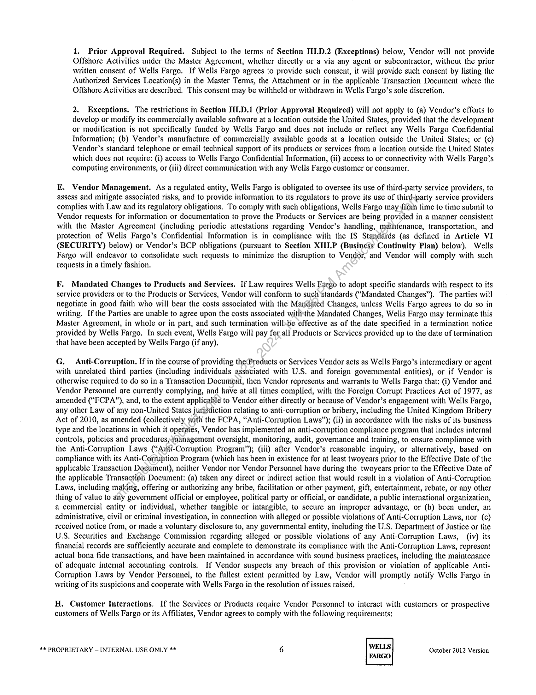
```
```col-md
1, Prior Approval Required. Subject to the terms of Section III.D.2 (Exceptions) below, Vendor will not provide
Offshore Activities under the Master Agreement, whether directly or a via any agent or subcontractor, without the prior
written consent of Wells Fargo. If Wells Fargo agrees to provide such consent, it will provide such consent by listing the
Authorized Services Location(s) in the Master Terms, the Attachment or in the applicable Transaction Document where the
Offshore Activities are described. This consent may be withheld or withdrawn in Wells Fargo’s sole discretion.
2. Exceptions, The restrictions in Section III.D.1 (Prior Approval Required) will not apply to (a) Vendor’s efforts to
develop or modify its commercially available software at a location outside the United States, provided that the development
or modification is not specifically funded by Wells Fargo and does not include or reflect any Wells Fargo Confidential
Information; (b) Vendor’s manufacture of commercially available goods at a location outside the United States; or (c)
Vendor’s standard telephone or email technical support of its products or services from a location outside the United States
which does not require: (i) access to Wells Fargo Confidential Information, (ii) access to or connectivity with Wells Fargo’s
computing environments, or (iii) direct communication with any Wells Fargo customer or consumer.
E. Vendor Management. As a regulated entity, Wells Fargo is obligated to oversee its use of third-party service providers, to
assess and mitigate associated risks, and to provide information to its regulators to prove its use of third-party service providers
complies with Law and its regulatory obligations. To comply with such obligations, Wells Fargo may fiom time to time submit to
Vendor requests for information or documentation to prove the Products or Services are being provided in a manner consistent
with the Master Agreement (including periodic attestations regarding Vendor’s handling, maintenance, transportation, and
protection of Wells Fargo’s Confidential Information is in compliance with the IS Standards (as defined in Article VI
(SECURITY) below) or Vendor’s BCP obligations (pursuant to Section XIII.P (Business Continuity Plan) below). Wells
Fargo will endeavor to consolidate such requests to minimize the disruption to Vendor, and Vendor will comply with such
requests in a timely fashion.
F, Mandated Changes to Products and Services. If Law requires Wells Fargo to adopt specific standards with respect to its
service providers or to the Products or Services, Vendor will conform to such standards (“Mandated Changes”). The parties will
negotiate in good faith who will bear the costs associated with the Maridated Changes, unless Wells Fargo agrees to do so in
writing. Ifthe Parties are unable to agree upon the costs associated withthe Mandated Changes, Wells Fargo may terminate this
Master Agreement, in whole or in part, and such termination willbe effective as of the date specified in a termination notice
provided by Wells Fargo. In such event, Wells Fargo will pay for all Products or Services provided up to the date of termination
that have been accepted by Wells Fargo (if any).
G. Anti-Corruption, If in the course of providing theProducts or Services Vendor acts as Wells Fargo’s intermediary or agent
with unrelated third parties (including individuals associated with U.S. and foreign governmental entities), or if Vendor is
otherwise required to do so in a Transaction Document, then Vendor represents and warrants to Wells Fargo that: (i) Vendor and
Vendor Personnel are currently complying, and have at all times complied, with the Foreign Corrupt Practices Act of 1977, as
amended (“FCPA"), and, to the extent applicable to Vendor either directly or because of Vendor’s engagement with Wells Fargo,
any other Law of any non-United States jurisdiction relating to anti-corruption or bribery, including the United Kingdom Bribery
Act of 2010, as amended (collectively with the FCPA, “Anti-Corruption Laws”); (ii) in accordance with the risks of its business
type and the locations in which it operates, Vendor has implemented an anti-corruption compliance program that includes internal
controls, policies and procedures»inanagement oversight, monitoring, audit, governance and training, to ensure compliance with
the Anti-Corruption Laws (“Anti-Corruption Program”); (iii) after Vendor’s reasonable inquiry, or alternatively, based on
compliance with its Anti-Corruption Program (which has been in existence for at least twoyears prior to the Effective Date of the
applicable Transaction Document), neither Vendor nor Vendor Personnel have during the twoyears prior to the Effective Date of
the applicable Transaction Document: (a) taken any direct or indirect action that would result in a violation of Anti-Corruption
Laws, including making, offering or authorizing any bribe, facilitation or other payment, gift, entertainment, rebate, or any other
thing of value to any government official or employee, political party or official, or candidate, a public international organization,
a commercial entity or individual, whether tangible or intangible, to secure an improper advantage, or (b) been under, an
administrative, civil or criminal investigation, in connection with alleged or possible violations of Anti-Corruption Laws, nor (c)
received notice from, or made a voluntary disclosure to, any governmental entity, including the U.S. Department of Justice or the
US. Securities and Exchange Commission regarding alleged or possible violations of any Anti-Corruption Laws, (iv) its
financial records are sufficiently accurate and complete to demonstrate its compliance with the Anti-Corruption Laws, represent
actual bona fide transactions, and have been maintained in accordance with sound business practices, including the maintenance
of adequate internal accounting controls. If Vendor suspects any breach of this provision or violation of applicable AntiCorruption Laws by Vendor Personnel, to the fullest extent permitted by Law, Vendor will promptly notify Wells Fargo in
writing of its suspicions and cooperate with Wells Fargo in the resolution of issues raised.
H. Customer Interactions. If the Services or Products require Vendor Personnel to interact with customers or prospective
customers of Wells Fargo or its Affiliates, Vendor agrees to comply with the following requirements:
** PROPRIETARY — INTERNAL USE ONLY ** 6 October 2012 Version
```
````
Notes:
````col
```col-md
flexGrow=.5
===
> [!info] [Page 7](_attachments/images_WF-3.6.1.15.1.3WellsFargo-MasterAgreement7.05.2013.pdf_210124/page_7.png)
> 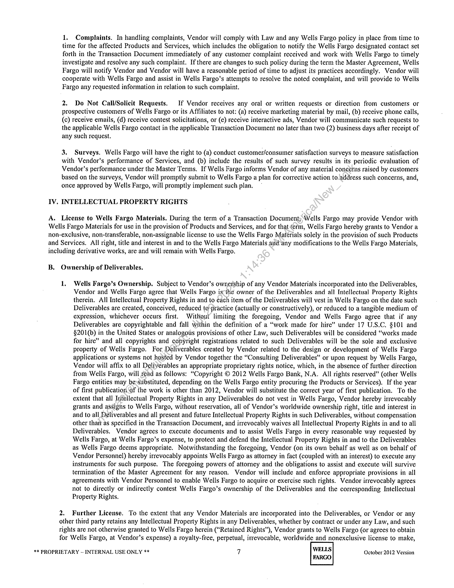
```
```col-md
1, Complaints. In handling complaints, Vendor will comply with Law and any Wells Fargo policy in place from time to
time for the affected Products and Services, which includes the obligation to notify the Wells Fargo designated contact set
forth in the Transaction Document immediately of any customer complaint received and work with Wells Fargo to timely
investigate and resolve any such complaint. If there are changes to such policy during the term the Master Agreement, Wells
Fargo will notify Vendor and Vendor will have a reasonable period of time to adjust its practices accordingly. Vendor will
cooperate with Wells Fargo and assist in Wells Fargo’s attempts to resolve the noted complaint, and will provide to Wells
Fargo any requested information in relation to such complaint.
2. Do Not Call/Solicit Requests. If Vendor receives any oral or written requests or direction from customers or
prospective customers of Wells Fargo or its Affiliates to not: (a) receive marketing material by mail, (b) receive phone calls,
(c) receive emails, (d) receive contest solicitations, or (e) receive interactive ads, Vendor will communicate such requests to
the applicable Wells Fargo contact in the applicable Transaction Document no later than two (2) business days after receipt of
any such request.
3. Surveys. Wells Fargo will have the right to (a) conduct customer/consumer satisfaction surveys to measure satisfaction
with Vendor’s performance of Services, and (b) include the results of such survey results in its periodic evaluation of
Vendor’s performance under the Master Terms. If Wells Fargo informs Vendor of any material concerns raised by customers
based on the surveys, Vendor will promptly submit to Wells Fargo a plan for corrective action toaddress such concerns, and,
once approved by Wells Fargo, will promptly implement such plan.
IV. INTELLECTUAL PROPERTY RIGHTS
A. License to Wells Fargo Materials. During the term of a Transaction Document; Wells Fargo may provide Vendor with
Wells Fargo Materials for use in the provision of Products and Services, and for that term, Wells Fargo hereby grants to Vendor a
non-exclusive, non-transferable, non-assignable license to use the Wells Fargo Materials solely in the provision of such Products
and Services. All right, title and interest in and to the Wells Fargo Materials and ‘any modifications to the Wells Fargo Materials,
including derivative works, are and will remain with Wells Fargo.
B. Ownership of Deliverables.
1, Wells Fargo’s Ownership, Subject to Vendor’s ownership of any Vendor Materials incorporated into the Deliverables,
Vendor and Wells Fargo agree that Wells Fargo isthe owner of the Deliverables and all Intellectual Property Rights
therein. All Intellectual Property Rights in and to each item of the Deliverables will vest in Wells Fargo on the date such
Deliverables are created, conceived, reduced to-practice (actually or constructively), or reduced to a tangible medium of
expression, whichever occurs first. Without limiting the foregoing, Vendor and Wells Fargo agree that if any
Deliverables are copyrightable and fall within the definition of a “work made for hire” under 17 U.S.C. §101 and
§201(b) in the United States or analogous provisions of other Law, such Deliverables will be considered “works made
for hire” and all copyrights and copyright registrations related to such Deliverables will be the sole and exclusive
property of Wells Fargo. For Deliverables created by Vendor related to the design or development of Wells Fargo
applications or systems not hosted by Vendor together the “Consulting Deliverables” or upon request by Wells Fargo,
Vendor will affix to all Deliverables an appropriate proprietary rights notice, which, in the absence of further direction
from Wells Fargo, will read as follows: “Copyright © 2012 Wells Fargo Bank, N.A. All rights reserved” (other Wells
Fargo entities may be substituted, depending on the Wells Fargo entity procuring the Products or Services). If the year
of first publication of the work is other than 2012, Vendor will substitute the correct year of first publication. To the
extent that all Initeilectual Property Rights in any Deliverables do not vest in Wells Fargo, Vendor hereby irrevocably
grants and assigns to Wells Fargo, without reservation, all of Vendor's worldwide ownership right, title and interest in
and to all Deliverables and all present and future Intellectual Property Rights in such Deliverables, without compensation
other than as specified in the Transaction Document, and irrevocably waives all Intellectual Property Rights in and to all
Deliverables. Vendor agrees to execute documents and to assist Wells Fargo in every reasonable way requested by
Wells Fargo, at Wells Fargo’s expense, to protect and defend the Intellectual Property Rights in and to the Deliverables
as Wells Fargo deems appropriate. Notwithstanding the foregoing, Vendor (on its own behalf as well as on behalf of
Vendor Personnel) hereby irrevocably appoints Wells Fargo as attorney in fact (coupled with an interest) to execute any
instruments for such purpose. The foregoing powers of attorney and the obligations to assist and execute will survive
termination of the Master Agreement for any reason. Vendor will include and enforce appropriate provisions in all
agreements with Vendor Personnel to enable Wells Fargo to acquire or exercise such rights. Vendor irrevocably agrees
not to directly or indirectly contest Wells Fargo’s ownership of the Deliverables and the corresponding Intellectual
Property Rights.
2. Further License. To the extent that any Vendor Materials are incorporated into the Deliverables, or Vendor or any
other third party retains any Intellectual Property Rights in any Deliverables, whether by contract or under any Law, and such
rights are not otherwise granted to Wells Fargo herein (“Retained Rights”), Vendor grants to Wells Fargo (or agrees to obtain
for Wells Fargo, at Vendor’s expense) a royalty-free, perpetual, irrevocable, worldwide and nonexclusive license to make,
** PROPRIETARY ~ INTERNAL USE ONLY ** 7 co October 2012 Version
```
````
Notes:
````col
```col-md
flexGrow=.5
===
> [!info] [Page 8](_attachments/images_WF-3.6.1.15.1.3WellsFargo-MasterAgreement7.05.2013.pdf_210124/page_8.png)
> 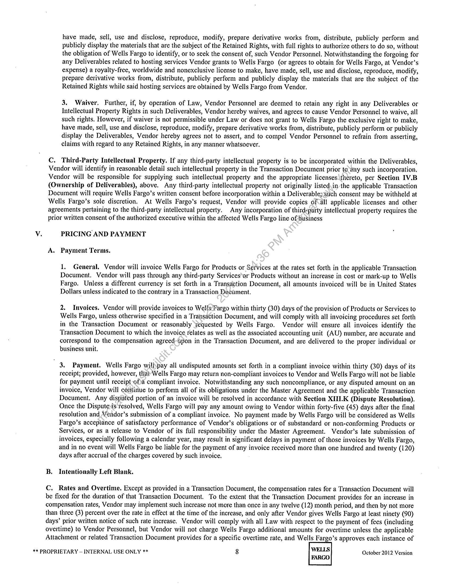
```
```col-md
have made, sell, use and disclose, reproduce, modify, prepare derivative works from, distribute, publicly perform and
publicly display the materials that are the subject of the Retained Rights, with full rights to authorize others to do so, without
the obligation of Wells Fargo to identify, or to seek the consent of, such Vendor Personnel. Notwithstanding the forgoing for
any Deliverables related to hosting services Vendor grants to Wells Fargo (or agrees to obtain for Wells Fargo, at Vendor’s
expense) a royalty-free, worldwide and nonexclusive license to make, have made, sell, use and disclose, reproduce, modify,
prepare derivative works from, distribute, publicly perform and publicly display the materials that are the subject of the
Retained Rights while said hosting services are obtained by Wells Fargo from Vendor.
3. Waiver. Further, if, by operation of Law, Vendor Personnel are deemed to retain any right in any Deliverables or
Intellectual Property Rights in such Deliverables, Vendor hereby waives, and agrees to cause Vendor Personnel to waive, all
such rights. However, if waiver is not permissible under Law or does not grant to Wells Fargo the exclusive right to make,
have made, sell, use and disclose, reproduce, modify, prepare derivative works from, distribute, publicly perform or publicly
display the Deliverables, Vendor hereby agrees not to assert, and to compel Vendor Personnel to refrain from asserting,
claims with regard to any Retained Rights, in any manner whatsoever.
C, Third-Party Intellectual Property. If any third-party intellectual property is to be incorporated within the Deliverables,
Vendor will identify in reasonable detail such intellectual property in the Transaction Document prior to‘any such incorporation.
Vendor will be responsible for supplying such intellectual property and the appropriate licenses\thereto, per Section IV.B
(Ownership of Deliverables), above. Any third-party intellectual property not originally listed\in the applicable Transaction
Document will require Wells Fargo’s written consent before incorporation within a Deliverable;stich consent may be withheld at
Wells Fargo’s sole discretion. At Wells Fargo’s request, Vendor will provide copies ofall applicable licenses and other
agreements pertaining to the third-party intellectual property. Any incorporation of third-party intellectual property requires the
prior written consent of the authorized executive within the affected Wells Fargo line of business
Vv. PRICING AND PAYMENT
A. Payment Terms.
1. General. Vendor will invoice Wells Fargo for Products or Services at the rates set forth in the applicable Transaction
Document. Vendor will pass through any third-party Services*or Products without an increase in cost or mark-up to Wells
Fargo. Unless a different currency is set forth in a Transdction Document, all amounts invoiced will be in United States
Dollars unless indicated to the contrary in a Transaction Docament.
2. Invoices. Vendor will provide invoices to Wells’Fargo within thirty (30) days of the provision of Products or Services to
Wells Fargo, unless otherwise specified in a Transaction Document, and will comply with all invoicing procedures set forth
in the Transaction Document or reasonably ‘vequested by Wells Fargo. Vendor will ensure all invoices identify the
Transaction Document to which the invoice relates as well as the associated accounting unit (AU) number, are accurate and
correspond to the compensation agreed-upon in the Transaction Document, and are delivered to the proper individual or
business unit.
3. Payment. Wells Fargo willypay all undisputed amounts set forth in a compliant invoice within thirty (30) days of its
receipt; provided, however, that-Wells Fargo may return non-compliant invoices to Vendor and Wells Fargo will not be liable
for payment until receipt-ofa compliant invoice. Notwithstanding any such noncompliance, or any disputed amount on an
invoice, Vendor will continue to perform all of its obligations under the Master Agreement and the applicable Transaction
Document. Any disputed portion of an invoice will be resolved in accordance with Section XIII.K (Dispute Resolution).
Once the Disputesis resolved, Wells Fargo will pay any amount owing to Vendor within forty-five (45) days after the final
resolution and endor’s submission of a compliant invoice. No payment made by Wells Fargo will be considered as Wells
Fargo’s acceptance of satisfactory performance of Vendor’s obligations. or of substandard or non-conforming Products or
Services, or as a release to Vendor of its full responsibility under the Master Agreement. Vendor’s late submission of
invoices, especially following a calendar year, may result in significant delays in payment of those invoices by Wells Fargo,
and in no event will Wells Fargo be liable for the payment of any invoice received more than one hundred and twenty (120)
days after accrual of the charges covered by such invoice.
B. Intentionally Left Blank.
C,. Rates and Overtime. Except as provided in a Transaction Document, the compensation rates for a Transaction Document will
be fixed for the duration of that Transaction Document. To the extent that the Transaction Document provides for an increase in
compensation rates, Vendor may implement such increase not more than once in any twelve (12) month period, and then by not more
than three (3) percent over the rate in effect at the time of the increase, and only after Vendor gives Wells Fargo at least ninety (90)
days’ prior written notice of such rate increase. Vendor will comply with all Law with respect to the payment of fees (including
overtime) to Vendor Personnel, but Vendor will not charge Wells Fargo additional amounts for overtime unless the applicable
Attachment or related Transaction Document provides for a specific overtime rate, and Wells Fargo’s approves each instance of
October 2012 Version
** PROPRIETARY — INTERNAL USE ONLY ** 8
```
````
Notes:
````col
```col-md
flexGrow=.5
===
> [!info] [Page 9](_attachments/images_WF-3.6.1.15.1.3WellsFargo-MasterAgreement7.05.2013.pdf_210124/page_9.png)
> 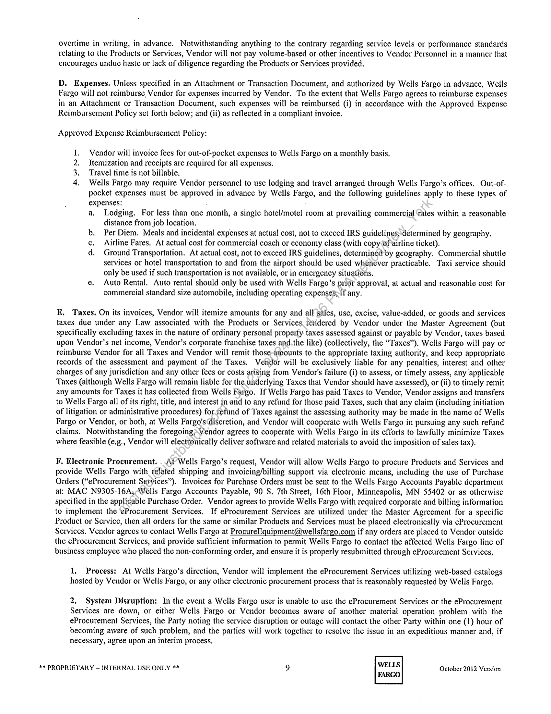
```
```col-md
overtime in writing, in advance. Notwithstanding anything to the contrary regarding service levels or performance standards
relating to the Products or Services, Vendor will not pay volume-based or other incentives to Vendor Personnel in a manner that
encourages undue haste or lack of diligence regarding the Products or Services provided.
D. Expenses. Unless specified in an Attachment or Transaction Document, and authorized by Wells Fargo in advance, Wells
Fargo will not reimburse, Vendor for expenses incurred by Vendor. To the extent that Wells Fargo agrees to reimburse expenses
in an Attachment or Transaction Document, such expenses will be reimbursed (i) in accordance with the Approved Expense
Reimbursement Policy set forth below; and (ii) as reflected in a compliant invoice.
Approved Expense Reimbursement Policy:
Vendor will invoice fees for out-of-pocket expenses to Wells Fargo on a monthly basis.
Itemization and receipts are required for all expenses.
Travel time is not billable.
Wells Fargo may require Vendor personnel to use lodging and travel arranged through Wells Fargo’s offices. Out-of-
pocket expenses must be approved in advance by Wells Fargo, and the following guidelines apply to these types of
expenses:
a. Lodging. For less than one month, a single hotel/motel room at prevailing commercial ‘rates within a reasonable
distance from job location.
b. Per Diem. Meals and incidental expenses at actual cost, not to exceed IRS guidelines, determined by geography.
c, Airline Fares. At actual cost for commercial coach or economy class (with copy fairline ticket).
d, Ground Transportation. At actual cost, not to exceed IRS guidelines, determinéd by geography. Commercial shuttle
services or hotel transportation to and from the airport should be used whenever practicable. Taxi service should
only be used if such transportation is not available, or in emergency situations.
e, Auto Rental. Auto rental should only be used with Wells Fargo’s prior approval, at actual and reasonable cost for
commercial standard size automobile, including operating expenseS;if any.
RYN
E. Taxes. On its invoices, Vendor will itemize amounts for any and all Sales, use, excise, value-added, or goods and services
taxes due under any Law associated with the Products or Services réndered by Vendor under the Master Agreement (but
specifically excluding taxes in the nature of ordinary personal property taxes assessed against or payable by Vendor, taxes based
upon Vendor’s net income, Vendor’s corporate franchise taxes and.the like) (collectively, the “Taxes”). Wells Fargo will pay or
reimburse Vendor for all Taxes and Vendor will remit those-amounts to the appropriate taxing authority, and keep appropriate
records of the assessment and payment of the Taxes. Vendor will be exclusively liable for any penalties, interest and other
charges of any jurisdiction and any other fees or costs arising from Vendor's failure (i) to assess, or timely assess, any ‘applicable
Taxes (although Wells Fargo will remain liable for the underlying Taxes that Vendor should have assessed), or (ii) to timely remit
any amounts for Taxes it has collected from Wells Fargo. If Wells Fargo has paid Taxes to Vendor, Vendor assigns and transfers
to Wells Fargo all of its right, title, and interest in and to any refund for those paid Taxes, such that any claim (including initiation
of litigation or administrative procedures) for fefund of Taxes against the assessing authority may be made in the name of Wells
Fargo or Vendor, or both, at Wells Fargo'sGiscretion, and Vendor will cooperate with Wells Fargo in pursuing any such refund
claims. Notwithstanding the foregoing»Vendor agrees to cooperate with Wells Fargo in its efforts to lawfully minimize Taxes
where feasible (e.g., Vendor will electronically deliver software and related materials to avoid the imposition of sales tax).
Ff, Electronic Procurement. .
At Wells Fargo’s request, Vendor will allow Wells Fargo to procure Products and Services and
provide Wells Fargo with related shipping and invoicing/billing support via electronic means, including the use of Purchase
Orders (“eProcurement Services”). Invoices for Purchase Orders must be sent to the Wells Fargo Accounts Payable department
at: MAC N9305-16A;,Wells Fargo Accounts Payable, 90 S. 7th Street, 16th Floor, Minneapolis, MN 55402 or as otherwise
specified in the applicable Purchase Order. Vendor agrees to provide Wells Fargo with required corporate and billing information
to implement the ‘eProcurement Services. If eProcurement Services are utilized under the Master Agreement for a specific
Product or Service, then all orders for the same or similar Products and Services must be placed electronically via eProcurement
Services. Vendor agrees to contact Wells Fargo at ProcureEquipment@wellsfargo.com if any orders are placed to Vendor outside
the eProcurement Services, and provide sufficient information to permit Wells Fargo to contact the affected Wells Fargo line of
business employee who placed the non-conforming order, and ensure it is properly resubmitted through eProcurement Services,
1. Process: At Wells Fargo’s direction, Vendor will implement the eProcurement Services utilizing web-based catalogs
hosted by Vendor or Wells Fargo, or any other electronic procurement process that is reasonably requested by Wells Fargo.
2, System Disruption: In the event a Wells Fargo user is unable to use the eProcurement Services or the eProcurement
Services are down, or either Wells Fargo or Vendor becomes aware of another material operation problem with the
eProcurement Services, the Party noting the service disruption or outage will contact the other Party within one (1) hour of
becoming aware of such problem, and the parties will work together to resolve the issue in an expeditious manner and, if
necessary, agree upon an interim process.
+* PROPRIETARY — INTERNAL USE ONLY ** 9 WELLS October 2012 Version
FARGO
```
````
Notes:
````col
```col-md
flexGrow=.5
===
> [!info] [Page 10](_attachments/images_WF-3.6.1.15.1.3WellsFargo-MasterAgreement7.05.2013.pdf_210124/page_10.png)
> 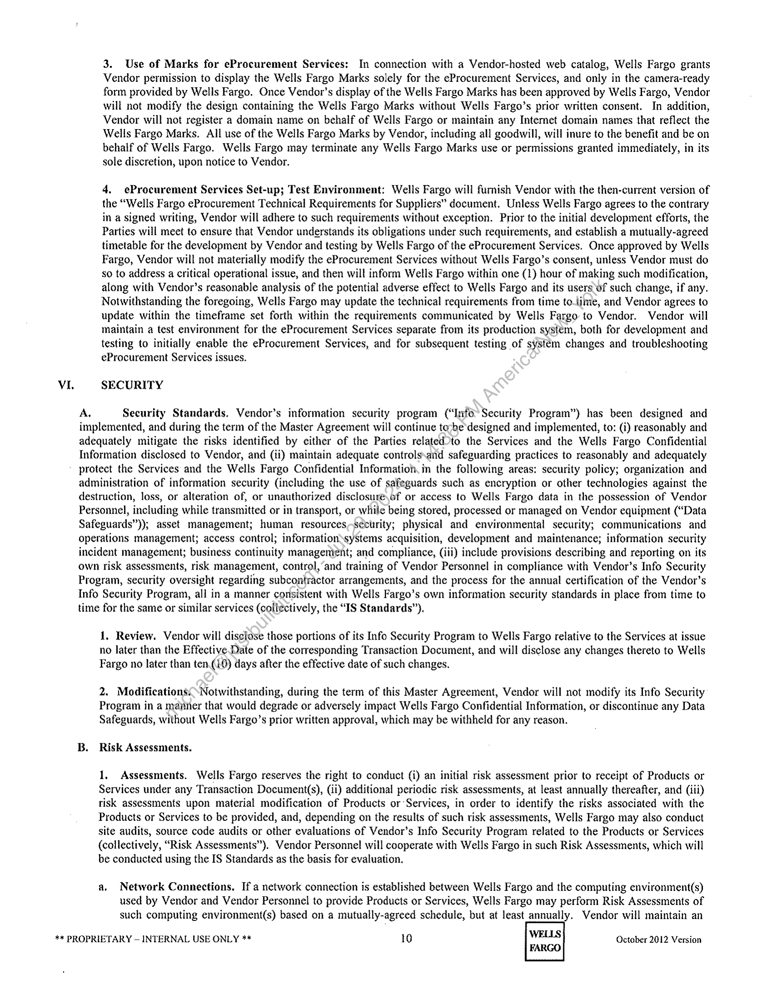
```
```col-md
VI.
3. Use of Marks for eProcurement Services: In connection with a Vendor-hosted web catalog, Wells Fargo grants
Vendor permission to display the Wells Fargo Marks solely for the eProcurement Services, and only in the camera-ready
form provided by Wells Fargo. Once Vendor’s display of the Wells Fargo Marks has been approved by Wells Fargo, Vendor
will not modify the design containing the Wells Fargo Marks without Wells Fargo’s prior written consent. In addition,
Vendor will not register a domain name on behalf of Wells Fargo or maintain any Internet domain names that reflect the
Welis Fargo Marks. All use of the Wells Fargo Marks by Vendor, including all goodwill, will inure to the benefit and be on
behalf of Wells Fargo. Welis Fargo may terminate any Wells Fargo Marks use or permissions granted immediately, in its
sole discretion, upon notice to Vendor.
4. eProcurement Services Set-up; Test Environment: Wells Fargo will furnish Vendor with the then-current version of
the “Wells Fargo eProcurement Technical Requirements for Suppliers” document. Unless Wells Fargo agrees to the contrary
in a signed writing, Vendor will adhere to such requirements without exception. Prior to the initial development efforts, the
Parties will meet to ensure that Vendor understands its obligations under such requirements, and establish a mutually-agreed
timetable for the development by Vendor and testing by Wells Fargo of the eProcurement Services. Once approved by Wells
Fargo, Vendor will not materially modify the eProcurement Services without Wells Fargo’s consent, unless Vendor must do
so to address a critical operational issue, and then will inform Wells Fargo within one (1) hour of making such modification,
along with Vendor’s reasonable analysis of the potential adverse effect to Wells Fargo and its users ‘of such change, if any.
Notwithstanding the foregoing, Wells Fargo may update the technical requirements from time tolime, and Vendor agrees to
update within the timeframe set forth within the requirements communicated by Wells Fargo to Vendor. Vendor will
maintain a test environment for the eProcurement Services separate from its production system, both for development and
testing to initially enable the eProcurement Services, and for subsequent testing of system changes and troubleshooting
eProcurement Services issues.
SECURITY
A, Security Standards. Vendor’s information security program (“Info Security Program”) has been designed and
implemented, and during the term of the Master Agreement will continue to-be’designed and implemented, to: (i) reasonably and
adequately mitigate the risks identified by either of the Parties relatedoto the Services and the Wells Fargo Confidential
Information disclosed to Vendor, and (ii) maintain adequate controls\and safeguarding practices to reasonably and adequately
’ protect the Services and the Wells Fargo Confidential Information. in the following areas: security policy; organization and
** PROPRIETARY — INTERNAL USE ONLY ** 10
administration of information security (including the use of safeguards such as encryption or other technologies against the
destruction, loss, or alteration of, or unauthorized disclosureyof or access to Wells Fargo data in the possession of Vendor
Personnel, including while transmitted or in transport, or while being stored, processed or managed on Vendor equipment (“Data
Safeguards”)); asset management; human resources-S¢curity; physical and environmental security; communications and
operations management; access control; information systems acquisition, development and maintenance; information security
incident management; business continuity management; and compliance, (iii) include provisions describing and reporting on its
own risk assessments, risk management, control, and training of Vendor Personnel in compliance with Vendor's Info Security
Program, security oversight regarding subcontractor arrangements, and the process for the annual certification of the Vendor’s
Info Security Program, all in a manner consistent with Wells Fargo’s own information security standards in place from time to
time for the same or similar services (collectively, the “IS Standards”).
1. Review. Vendor will disclose those portions of its Info Security Program to Wells Fargo relative to the Services at issue
no later than the Effective Date of the corresponding Transaction Document, and will disclose any changes thereto to Wells
Fargo no later than ten.(10) days after the effective date of such changes.
2. Modifications: Notwithstanding, during the term of this Master Agreement, Vendor will not modify its Info Security
Program in a manner that would degrade or adversely impact Wells Fargo Confidential Information, or discontinue any Data
Safeguards, without Wells Fargo’s prior written approval, which may be withheld for any reason.
B. Risk Assessments.
1, Assessments. Wells Fargo reserves the right to conduct (i) an initial risk assessment prior to receipt of Products or
Services under any Transaction Document(s), (ii) additional periodic risk assessments, at least annually thereafter, and (iii)
risk assessments upon material modification of Products or Services, in order to identify the risks associated with the
Products or Services to be provided, and, depending on the results of such risk assessments, Wells Fargo may also conduct
site audits, source code audits or other evaluations of Vendor’s Info Security Program related to the Products or Services
(collectively, “Risk Assessments”). Vendor Personnel will cooperate with Wells Fargo in such Risk Assessments, which will
be conducted using the IS Standards as the basis for evaluation.
a, Network Connections. Ifa network connection is established between Wells Fargo and the computing environment(s)
used by Vendor and Vendor Persomel to provide Products or Services, Wells Fargo may perform Risk Assessments of
such computing environment(s) based on a mutually-agreed schedule, but at least annually. Vendor will maintain an
October 2012 Version
```
````
Notes:
````col
```col-md
flexGrow=.5
===
> [!info] [Page 11](_attachments/images_WF-3.6.1.15.1.3WellsFargo-MasterAgreement7.05.2013.pdf_210124/page_11.png)
> 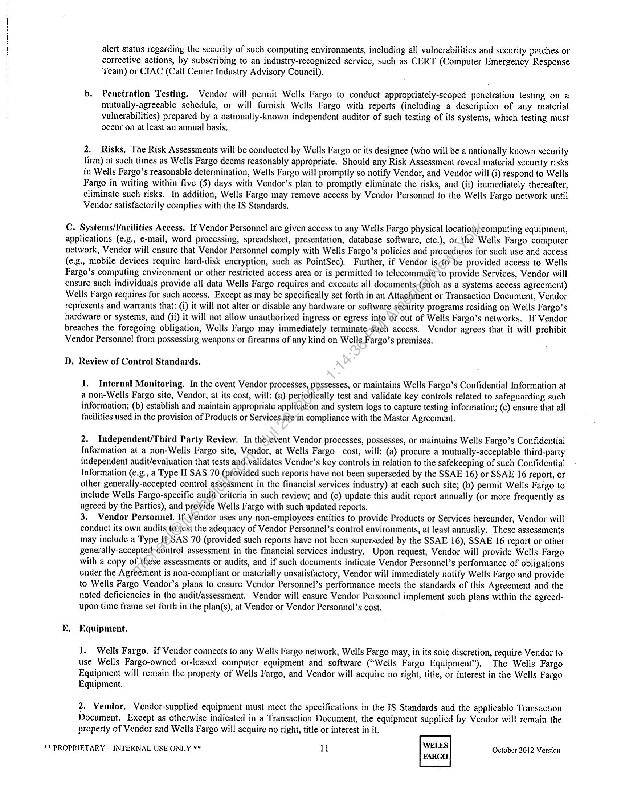
```
```col-md
alert status regarding the security of such computing environments, including all vulnerabilities and security patches or
corrective actions, by subscribing to an industry-recognized service, such as CERT (Computer Emergency Response
Team) or CIAC (Call Center Industry Advisory Council).
b. Penetration Testing. Vendor will permit Wells Fargo to conduct appropriately-scoped penetration testing on a
mutually-agreeable schedule, or will furnish Wells Fargo with reports (including a description of any material
vulnerabilities) prepared by a nationally-known independent auditor of such testing of its systems, which testing must
occur on at least an annual basis.
2. Risks. The Risk Assessments will be conducted by Wells Fargo or its designee (who will be a nationally known security
firm) at such times as Wells Fargo deems reasonably appropriate. Should any Risk Assessment reveal material security risks
in Wells Fargo’s reasonable determination, Wells Fargo will promptly so notify Vendor, and Vendor will (i) respond to Wells
Fargo in writing within five (5) days with Vendor’s plan to promptly eliminate the risks, and (ii) immediately thereafter,
eliminate such risks, In addition, Wells Fargo may remove access by Vendor Personnel to the Wells Fargo network until
Vendor satisfactorily complies with the IS Standards.
C, Systems/Facilities Access. If Vendor Personnel are given access to any Wells Fargo physical location,-computing equipment,
applications (e.g., e-mail, word processing, spreadsheet, presentation, database software, etc.), or_thé Wells Fargo computer
network, Vendor will ensure that Vendor Personnel comply with Wells Fargo’s policies and procedures for such use and access
(e.g., mobile devices require hard-disk encryption, such as PointSec). Further, if Vendor iscfo be provided access to Wells
Fargo’s computing environment or other restricted access area or is permitted to telecommulé to provide Services, Vendor will
ensure such individuals provide all data Wells Fargo requires and execute all documents(such as a systems access agreement)
Wells Fargo requires for such access, Except as may be specifically set forth in an Attachment or Transaction Document, Vendor
represents and warrants that: (i) it will not alter or disable any hardware or software security programs residing on Wells Fargo’s
hardware or systems, and (ii) it will not allow unauthorized ingress or egress into or out of Wells Fargo’s networks. If Vendor
breaches the foregoing obligation, Wells Fargo may immediately terminate-sueh access. Vendor agrees that it will prohibit
Vendor Personnel from possessing weapons or firearms of any kind on Wells Fargo’s premises,
D. Review of Control Standards.
1. Internal Monitoring. In the event Vendor processes, possesses, or maintains Wells Fargo’s Confidential Information at
a non-Wells Fargo site, Vendor, at its cost, will: (a) periodically test and validate key controls related to safeguarding such
information; (b) establish and maintain appropriate application and system logs to capture testing information; (c) ensure that all
facilities used in the provision of Products or Services.arein compliance with the Master Agreement.
2. Independent/Third Party Review. In théjevent Vendor processes, possesses, or maintains Wells Fargo’s Confidential
Information at a non-Wells Fargo site, Vendor, at Wells Fargo cost, will: (a) procure a mutually-acceptable third-party
independent audit/evaluation that tests and.validates Vendor’s key controls in relation to the safekeeping of such Confidential
Information (e.g., a Type II SAS 70 (provided such reports have not been superseded by the SSAE 16) or SSAE 16 report, or
other generally-accepted control assessment in the financial services industry) at each such site; (b) permit Wells Fargo to
include Wells Fargo-specific audit criteria in such review; and (c) update this audit report annually (or more frequently as
agreed by the Parties), and provide Wells Fargo with such updated reports.
3. Vendor Personnel. If Vendor uses any non-employees entities to provide Products or Services hereunder, Vendor will
conduct its own audits to test the adequacy of Vendor Personnel’s control environments, at least annually. These assessments
may include a Type IP SAS 70 (provided such reports have not been superseded by the SSAE 16), SSAE 16 report or other
generally-accepted-control assessment in the financial services industry. Upon request, Vendor will provide Wells Fargo
with a copy of these assessments or audits, and if such documents indicate Vendor Personnel’s performance of obligations
under the Agreement is non-compliant or materially unsatisfactory, Vendor will immediately notify Wells Fargo and provide
to Wells Fargo Vendor’s plans to ensure Vendor Personnel’s performance meets the standards of this Agreement and the
noted deficiencies in the audit/assessment. Vendor will ensure Vendor Personnel implement such plans within the agreedupon time frame set forth in the plan(s), at Vendor or Vendor Personnel’s cost.
E. Equipment.
1. Wells Fargo. If Vendor connects to any Wells Fargo network, Wells Fargo may, in its sole discretion, require Vendor to
use Wells Fargo-owned or-leased computer equipment and software (“Wells Fargo Equipment”), The Wells Fargo
Equipment will remain the property of Wells Fargo, and Vendor will acquire no right, title, or interest in the Wells Fargo
Equipment.
2, Vendor. Vendor-supplied equipment must meet the specifications in the IS Standards and the applicable Transaction
Document. Except as otherwise indicated in a Transaction Document, the equipment supplied by Vendor will remain the
property of Vendor and Wells Fargo will acquire no right, title or interest in it.
** PROPRIETARY — INTERNAL USE ONLY #* li October 2012 Version
```
````
Notes:
````col
```col-md
flexGrow=.5
===
> [!info] [Page 12](_attachments/images_WF-3.6.1.15.1.3WellsFargo-MasterAgreement7.05.2013.pdf_210124/page_12.png)
> 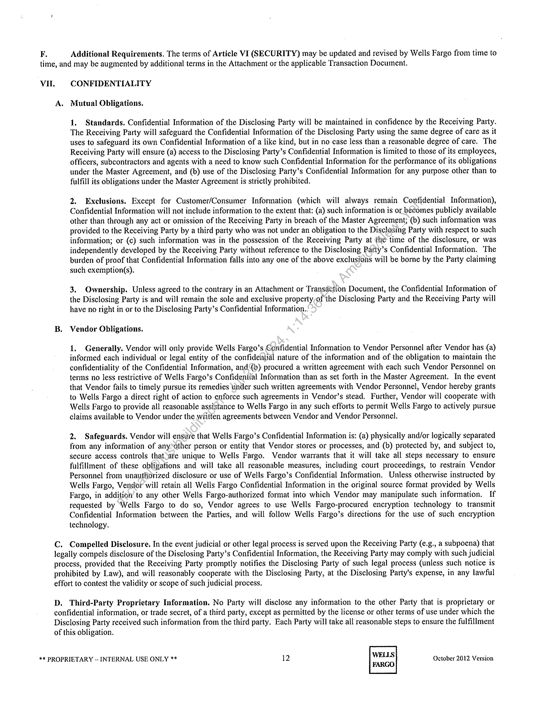
```
```col-md
F.
Additional Requirements. The terms of Article VI (SECURITY) may be updated and revised by Wells Fargo from time to
time, and may be augmented by additional terms in the Attachment or the applicable Transaction Document.
VIL.
A.
Cc
CONFIDENTIALITY
Mutual Obligations.
1. Standards. Confidential Information of the Disclosing Party will be maintained in confidence by the Receiving Party.
The Receiving Party will safeguard the Confidential Information of the Disclosing Party using the same degree of care as it
uses to safeguard its own Confidential Information of a like kind, but in no case less than a reasonable degree of care. The
Receiving Party will ensure (a) access to the Disclosing Party’s Confidential Information is limited to those of its employees,
officers, subcontractors and agents with a need to know such Confidential Information for the performance of its obligations
under the Master Agreement, and (b) use of the Disclosing Party’s Confidential Information for any purpose other than to
fulfill its obligations under the Master Agreement is strictly prohibited.
2. Exclusions. Except for Customer/Consumer Information (which will always remain Confidential Information),
Confidential Information will not include information to the extent that: (a) such information is or becomes publicly available
other than through any act or omission of the Receiving Party in breach of the Master Agreement; (b) such information was
provided to the Receiving Party by a third party who was not under an obligation to the Disclosing Party with respect to such
information; or (c) such information was in the possession of the Receiving Party at the time of the disclosure, or was
independently developed by the Receiving Party without reference to the Disclosing Party’s Confidential Information. The
burden of proof that Confidential Information falls into any one of the above exclusions will be borne by the Party claiming
such exemption(s).
3. Ownership. Unless agreed to the contrary in an Attachment or Transaction Document, the Confidential Information of
the Disclosing Party is and will remain the sole and exclusive property,of the Disclosing Party and the Receiving Party will
have no right in or to the Disclosing Party’s Confidential Information.
Vendor Obligations.
1. Generally. Vendor will only provide Wells Fargo’s Confidential Information to Vendor Personnel after Vendor has (a)
informed each individual or legal entity of the confidential nature of the information and of the obligation to maintain the
confidentiality of the Confidential Information, and((b) procured a written agreement with each such Vendor Personnel on
terms no less restrictive of Wells Fargo’s Confidential Information than as set forth in the Master Agreement. In the event
that Vendor fails to timely pursue its remedies Under such written agreements with Vendor Personnel, Vendor hereby grants
to Wells Fargo a direct right of action to enforce such agreements in Vendor’s stead. Further, Vendor will cooperate with
Wells Fargo to provide all reasonable assistance to Wells Fargo in any such efforts to permit Wells Fargo to actively pursue
claims available to Vendor under the wiitten agreements between Vendor and Vendor Personnel.
2. Safeguards. Vendor will ensure that Wells Fargo’s Confidential Information is: (a) physically and/or logically separated
from any information of any*other person or entity that Vendor stores or processes, and (b) protected by, and subject to,
secure access controls that)are unique to Wells Fargo. Vendor warrants that it will take all steps necessary to ensure
fulfillment of these obligations and will take all reasonable measures, including court proceedings, to restrain Vendor
Personnel from unauthorized disclosure or use of Wells Fargo’s Confidential Information. Unless otherwise instructed by
Wells Fargo, Vendor will retain all Wells Fargo Confidential Information in the original source format provided by Wells
Fargo, in addition’ to any other Wells Fargo-authorized format into which Vendor may manipulate such information. If
requested by Wells Fargo to do so, Vendor agrees to use Wells Fargo-procured encryption technology to transmit
Confidential Information between the Parties, and will follow Wells Fargo’s directions for the use of such encryption
technology.
Compelled Disclosure. In the event judicial or other legal process is served upon the Receiving Party (e.g., a subpoena) that
legally compels disclosure of the Disclosing Party’s Confidential Information, the Receiving Party may comply with such judicial
process, provided that the Receiving Party promptly notifies the Disclosing Party of such legal process (unless such notice is
prohibited by Law), and will reasonably cooperate with the Disclosing Party, at the Disclosing Party's expense, in any lawful
effort to contest the validity or scope of such judicial process.
D.
Third-Party Proprietary Information. No Party will disclose any information to the other Party that is proprietary or
confidential information, or trade secret, of a third party, except as permitted by the license or other terms of use under which the
Disclosing Party received such information from the third party. Each Party will take all reasonable steps to ensure the fulfillment
of this obligation.
** PROPRIETARY -- INTERNAL USE ONLY ** 12 October 2012 Version
```
````
Notes:
````col
```col-md
flexGrow=.5
===
> [!info] [Page 13](_attachments/images_WF-3.6.1.15.1.3WellsFargo-MasterAgreement7.05.2013.pdf_210124/page_13.png)
> 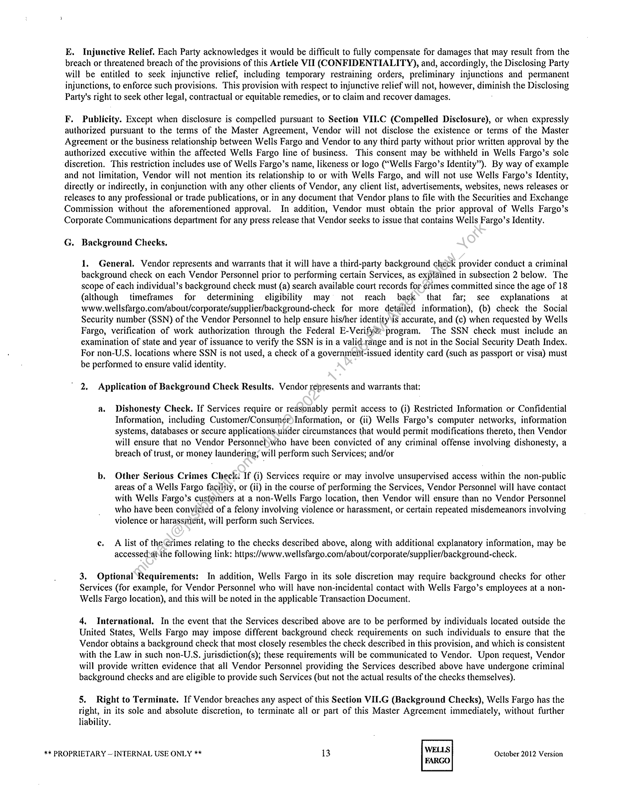
```
```col-md
E. Injunctive Relief. Each Party acknowledges it would be difficult to fully compensate for damages that may result from the
breach or threatened breach of the provisions of this Article VII (CONFIDENTIALITY), and, accordingly, the Disclosing Party
will be entitled to seek injunctive relief, including temporary restraining orders, preliminary injunctions and permanent
injunctions, to enforce such provisions. This provision with respect to injunctive relief will not, however, diminish the Disclosing
Party's right to seek other legal, contractual or equitable remedies, or to claim and recover damages.
F. Publicity. Except when disclosure is compelled pursuant to Section VIIL.C (Compelled Disclosure), or when expressly
authorized pursuant to the terms of the Master Agreement, Vendor will not disclose the existence or terms of the Master
Agreement or the business relationship between Wells Fargo and Vendor to any third party without prior written approval by the
authorized executive within the affected Wells Fargo line of business. This consent may be withheld in Wells Fargo’s sole
discretion. This restriction includes use of Wells Fargo’s name, likeness or logo (“Wells Fargo’s Identity”). By way of example
and not limitation, Vendor will not mention its relationship to or with Wells Fargo, and will not use Wells Fargo’s Identity,
directly or indirectly, in conjunction with any other clients of Vendor, any client list, advertisements, websites, news releases or
releases to any professional or trade publications, or in any document that Vendor plans to file with the Securities and Exchange
Commission without the aforementioned approval. In addition, Vendor must obtain the prior approval of Wells Fargo’s
Corporate Communications department for any press release that Vendor seeks to issue that contains Wells Fargo’s Identity.
G. Background Checks.
1. General. Vendor represents and warrants that it will have a third-party background check provider conduct a criminal
background check on each Vendor Personnel prior to performing certain Services, as explained in subsection 2 below. The
scope of each individual’s background check must (a) search available court records for ¢times committed since the age of 18
(although timeframes for determining eligibility may not reach back that far; see explanations at
www.wellsfargo.com/about/corporate/supplier/background-check for more detailed information), (b) check the Social
Security number (SSN) of the Vendor Personnel to help ensure his/her identity\is accurate, and (c) when requested by Wells
Fargo, verification of work authorization through the Federal E-Verify® program. The SSN check must include an
examination of state and year of issuance to verify the SSN is in a valid-range and is not in the Social Security Death Index.
For non-US. locations where SSN is not used, a check of a government-issued identity card (such as passport or visa} must
be performed to ensure valid identity.
2. Application of Background Check Results, Vendor represents and warrants that:
a. Dishonesty Check. If Services require or reasonably permit access to (i) Restricted Information or Confidential
Information, including Customer/Consumér) Information, or {ii) Wells Fargo’s computer networks, information
systems, databases or secure applications under circumstances that would permit modifications thereto, then Vendor
will ensure that no Vendor Personnelwho have been convicted of any criminal offense involving dishonesty, a
breach of trust, or money laundering, will perform such Services; and/or
b, Other Serious Crimes Check: If (i) Services require or may involve unsupervised access within the non-public
areas of a Wells Fargo facility, or (ii) in the course of performing the Services, Vendor Personnel will have contact
with Wells Fargo’s cusfomers at a non-Wells Fargo location, then Vendor will ensure than no Vendor Personnel
who have been conyicted of a felony involving violence or harassment, or certain repeated misdemeanors involving
violence or harassment, will perform such Services.
c. A list of theCrimes relating to the checks described above, along with additional explanatory information, may be
accessedvatthe following link: https://www.wellsfargo.com/about/corporate/supplier/background-check.
3. Optional Requirements: In addition, Wells Fargo in its sole discretion may require background checks for other
Services (for example, for Vendor Personnel who will have non-incidental contact with Wells Fargo’s employees at a nonWells Fargo location), and this will be noted in the applicable Transaction Document.
4, International. In the event that the Services described above are to be performed by individuals located outside the
United States, Wells Fargo may impose different background check requirements on such individuals to ensure that the
Vendor obtains a background check that most closely resembles the check described in this provision, and which is consistent
with the Law in such non-U.S. jurisdiction(s); these requirements will be communicated to Vendor. Upon request, Vendor
will provide written evidence that all Vendor Personnel providing the Services described above have undergone criminal
background checks and are eligible to provide such Services (but not the actual results of the checks themselves).
5. Right to Terminate. If Vendor breaches any aspect of this Section VII.G (Background Checks), Wells Fargo has the
right, in its sole and absolute discretion, to terminate all or part of this Master Agreement immediately, without further
liability.
** PROPRIETARY — INTERNAL USE ONLY ** 13 October 2012 Version
```
````
Notes:
````col
```col-md
flexGrow=.5
===
> [!info] [Page 14](_attachments/images_WF-3.6.1.15.1.3WellsFargo-MasterAgreement7.05.2013.pdf_210124/page_14.png)
> 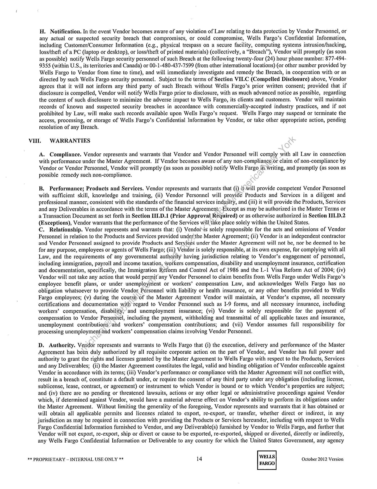
```
```col-md
H. Notification. In the event Vendor becomes aware of any violation of Law relating to data protection by Vendor Personnel, or
any actual or suspected security breach that compromises, or could compromise, Wells Fargo’s Confidential Information,
including Customer/Consumer Information (e.g., physical trespass on a secure facility, computing systems intrusion/hacking,
loss/theft of a PC (laptop or desktop), or loss/theft of printed materials) (collectively, a “Breach”), Vendor will promptly (as soon
as possible) notify Wells Fargo security personnel of such Breach at the following twenty-four (24) hour phone number: 877-4949355 (within U.S,, its territories and Canada) or 00-1-480-437-7599 (from other intemational locations) (or other number provided by
Wells Fargo to Vendor from time to time), and will immediately investigate and remedy the Breach, in cooperation with or as
directed by such Wells Fargo security personnel. Subject to the terms of Section VII.C (Compelled Disclosure) above, Vendor
agrees that it will not inform any third party of such Breach without Wells Fargo’s prior written consent; provided that if
disclosure is compelled, Vendor will notify Wells Fargo prior to disclosure, with as much advanced notice as possible, regarding
the content of such disclosure to minimize the adverse impact to Wells Fargo, its clients ‘and customers. Vendor will maintain
records of known and suspected security breaches in accordance with commercially-accepted industry practices, and if not
prohibited by Law, will make such records available upon Wells Fargo’s request. Wells Fargo may suspend or terminate the
access, processing, or storage of Wells Fargo’s Confidential Information by Vendor, or take other appropriate action, pending
resolution of any Breach.
VIII. WARRANTIES
A. Compliance. Vendor represents and warrants that Vendor and Vendor Personnel will comply with all Law in connection
with performance under the Master Agreement. If Vendor becomes aware of any non-compliancé,or claim of non-compliance by
Vendor or Vendor Personnel, Vendor will promptly (as soon as possible) notify Wells Fargo in writing, and promptly (as soon as
possible remedy such non-compliance,
B. Performance; Products and Services. Vendor represents and warrants that (i) dwill provide competent Vendor Personnel
with sufficient skill, knowledge and training, (ii) Vendor Personnel will provide Products and Services in a diligent and
professional manner, consistent with the standards of the financial services industry, and (iii) it will provide the Products, Services
and any Deliverables in accordance with the terms of the Master Agreement¢-Except as may be authorized in the Master Terms or
a Transaction Document as set forth in Section III.D.1 (Prior Approval Required) or as otherwise authorized in Section HI.D.2
(Exceptions), Vendor warrants that the performance of the Services will take place solely within the United States.
C. Relationship. Vendor represents and warrants that: (i) VendoiNis solely responsible for the acts and omissions of Vendor
Personnel in relation to the Products and Services provided under)the Master Agreement; (ii) Vendor is an independent contractor
and Vendor Personnel assigned to provide Products and Services under the Master Agreement will not be, nor be deemed to be
for any purpose, employees or agents of Wells Fargo; (iii) Vendor is solely responsible, at its own expense, for complying with all
Law, and the requirements of any governmental authority’ having jurisdiction relating to Vendor’s engagement of personnel,
including immigration, payroll and income taxation, workers compensation, disability and unemployment insurance, certification
and documentation, specifically, the Immigration Reform and Control Act of 1986 and the L-1 Visa Reform Act of 2004; (iv)
Vendor will not take any action that would permit any Vendor Personnel to claim benefits from Wells Fargo under Wells Fargo’s
employee benefit plans, or under unemployiment or workers’ compensation Law, and acknowledges Wells Fargo has no
obligation whatsoever to provide Vendor Personnel with liability or health insurance, or any other benefits provided to Wells
Fargo employees; (v) during the courséof the Master Agreement Vendor will maintain, at Vendor’s expense, all necessary
certifications and documentation with regard to Vendor Personnel such as I-9 forms, and all necessary insurance, including
workers’ compensation, disability; and unemployment insurance; (vi) Vendor is solely responsible for the payment of
compensation to Vendor Personnel, including the payment, withholding and transmittal of all applicable taxes and insurance,
unemployment contributions”ahd workers’ compensation contributions; and (vii) Vendor assumes full responsibility for
processing unemploymentand workers’ compensation claims involving Vendor Personnel.
D. Authority. Vendor represents and warrants to Wells Fargo that (i) the execution, delivery and performance of the Master
Agreement has been duly authorized by all requisite corporate action on the part of Vendor, and Vendor has full power and
authority to grant the rights and licenses granted by the Master Agreement to Wells Fargo with respect to the Products, Services
and any Deliverables; (ii) the Master Agreement constitutes the legal, valid and binding obligation of Vendor enforceable against
Vendor in accordance with its terms; (iii) Vendor’s performance or compliance with the Master Agreement will not conflict with,
result in a breach of, constitute a default under, or require the consent of any third party under any obligation (including license,
sublicense, lease, contract, or agreement) or instrument to which Vendor is bound or to which Vendor’s properties are subject;
and (iv) there are no pending or threatened lawsuits, actions or any other legal or administrative proceedings against Vendor
which, if determined against Vendor, would have a material adverse effect on Vendor’s ability to perform its obligations under
the Master Agreement. Without limiting the generality of the foregoing, Vendor represents and warrants that it has obtained or
will obtain all applicable permits and licenses related to export, re-export, or transfer, whether direct or indirect, in any
jurisdiction as may be required in connection with providing the Products or Services hereunder, including with respect to Wells
Fargo Confidential Information furnished to Vendor, and any Deliverable(s) furnished by Vendor to Wells Fargo, and further that
Vendor will not export, re-export, ship or divert or cause to be exported, re-exported, shipped or diverted, directly or indirectly,
any Wells Fargo Confidential Information or Deliverable to any country for which the United States Government, any agency
*PROPRIETARY — INTERNAL USE ONLY ** 14 October 2012 Version
```
````
Notes:
````col
```col-md
flexGrow=.5
===
> [!info] [Page 15](_attachments/images_WF-3.6.1.15.1.3WellsFargo-MasterAgreement7.05.2013.pdf_210124/page_15.png)
> 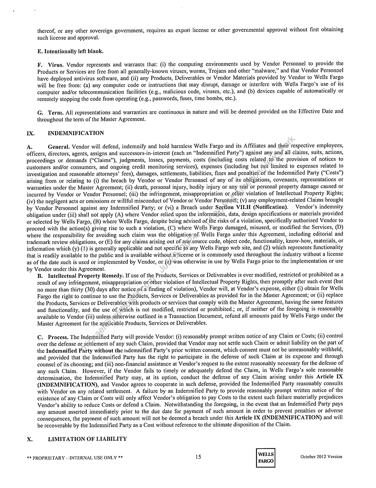
```
```col-md
thereof, or any other sovereign government, requires an export license or other governmental approval without first obtaining
such license and approval. :
E, Intentionally left blank.
F. Virus. Vendor represents and warrants that: (i) the computing environments used by Vendor Personnel to provide the
Products or Services are free from all generally-known viruses, worms, Trojans and other “malware,” and that Vendor Personnel
have deployed antivirus software, and (ii) any Products, Deliverables or Vendor Materials provided by Vendor to Wells Fargo
will be free from: (a) any computer code or instructions that may disrupt, damage or interfere with Wells Fargo’s use of its
computer and/or telecommunication facilities (e.g., malicious code, viruses, etc.), and (b) devices capable of automatically or
remotely stopping the code from operating (e.g., passwords, fuses, time bombs, etc.).
G. Term, All representations and warranties are continuous in nature and will be deemed provided on the Effective Date and
throughout the term of the Master Agreement.
IX. INDEMNIFICATION
A. General. Vendor will defend, indemnify and hold harmless Wells Fargo and its Affiliates and their respective employees,
officers, directors, agents, assigns and successors-in-interest (each an “Indemnified Party”) against any and all claims, suits, actions,
proceedings or demands (“Claims”), judgments, losses, payments, costs (including costs related to the provision of notices to
customers and/or consumers, and ongoing credit monitoring services), expenses (including but wot limited to expenses related to
investigation and reasonable attorneys’ fees), damages, settlements, liabilities, fines and penalties of the Indemnified Party (“Costs”)
arising from or relating to (i) the breach by Vendor or Vendor Personnel of any of its obligations, covenants, representations or
warranties under the Master Agreement; (ii) death, personal injury, bodily injury or any réal or personal property damage caused or
incurred by Vendor or Vendor Personnel; (iii) the infringement, misappropriation or ottier violation of Intellectual Property Rights;
(iv) the negligent acts or omissions or willful misconduct of Vendor or Vendor Persoinel; (v) any employment-related Claims brought
by Vendor Personnel against any Indemnified Party; or (vi) a Breach under Section VILH (Notification), Vendor’s indemnity
obligation under (iii) shall not apply (A) where Vendor relied upon the information, data, design specifications or materials provided
or selected by Wells Fargo, (B) where Wells Fargo, despite being advised of thie risks of a violation, specifically authorized Vendor to
proceed with the action(s) giving rise to such a violation, (C) where Wells Fargo damaged, misused, or modified the Services, (D)
where the responsibility for avoiding such claim was the obligation\of, Wells Fargo under this Agreement, including editorial and
trademark review obligations, or (E) for any claims arising out of any source code, object code, functionality, know-how, materials, or
information which (y) (1) is generally applicable and not specifi to any Wells Fargo web site, and (2) which represents functionality
that is readily available to the public and is available without,@)license or is commonly used throughout the industry without a license
as of the date such is used or implemented by Vendor, or (z) was otherwise in use by Wells Fargo prior to the implementation or use
by Vendor under this Agreement.
B, Intellectual Property Remedy. If use of the Products, Services or Deliverables is ever modified, restricted or prohibited as a
result of any infringement, misappropriation or other violation of Intellectual Property Rights, then promptly after such event (but
no more than thirty (30) days after notice.of-a finding of violation), Vendor will, at Vendor’s expense, either (i) obtain for Wells
Fargo the right to continue to use the Prodltcts, Services or Deliverables as provided for in the Master Agreement; or (ii) replace
the Products, Services or Deliverables with products or services that comply with the Master Agreement, having the same features
and functionality, and the use of which is not modified, restricted or prohibited.; or, if neither of the foregoing is reasonably
available to Vendor (iii) unless.otherwise outlined in a Transaction Document, refund all amounts paid by Wells Fargo under the
Master Agreement for the applicable Products, Services or Deliverables.
C. Process. The Indemutified Party will provide Vendor: (i) reasonably prompt written notice of any Claim or Costs; (ii) control
over the defense or settlement of any such Claim, provided that Vendor may not settle such Claim or admit liability on the part of
the Indemnified Party without the Indemnified Party’s prior written consent, which consent must not be unreasonably withheld,
and provided that the Indemnified Party has the right to participate in the defense of such Claim at its expense and through
counsel of its choosing; and (iii) non-financial assistance at Vendor’s request to the extent reasonably necessary for the defense of
any such Claim. However, if the Vendor fails to timely or adequately defend the Claim, in Wells Fargo’s sole reasonable
determination, the Indemnified Party may, at its option, conduct the defense of any Claim arising under this Article IX
(INDEMNIFICATION), and Vendor agrees to cooperate in such defense, provided the Indemnified Party reasonably consults
with Vendor on any related settlement. A failure by an Indemnified Party to provide reasonably prompt written notice of the
existence of any Claim or Costs will only affect Vendor’s obligation to pay Costs to the extent such failure materially prejudices
Vendor’s ability to reduce Costs or defend a Claim, Notwithstanding the foregoing, in the event that an Indemnified Party pays
any amount asserted immediately prior to the due date for payment of such amount in order to prevent penalties or adverse
consequences, the payment of such amount will not be deemed a breach under this Article IX INDEMNIFICATION) and will
be recoverable by the Indemnified Party as a Cost without reference to the ultimate disposition of the Claim.
X, LIMITATION OF LIABILITY
** PROPRIETARY — INTERNAL USE ONLY ** 15 October 2012 Version
```
````
Notes:
````col
```col-md
flexGrow=.5
===
> [!info] [Page 16](_attachments/images_WF-3.6.1.15.1.3WellsFargo-MasterAgreement7.05.2013.pdf_210124/page_16.png)
> 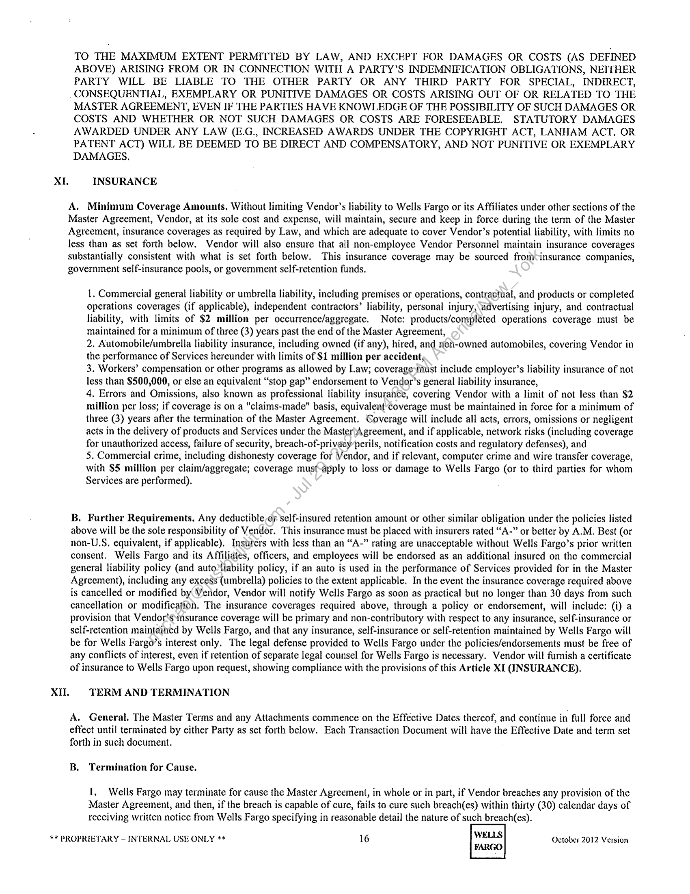
```
```col-md
XL
TO THE MAXIMUM EXTENT PERMITTED BY LAW, AND EXCEPT FOR DAMAGES OR COSTS (AS DEFINED
ABOVE) ARISING FROM OR IN CONNECTION WITH A PARTY’S INDEMNIFICATION OBLIGATIONS, NEITHER
PARTY WILL BE LIABLE TO THE OTHER PARTY OR ANY THIRD PARTY FOR SPECIAL, INDIRECT,
CONSEQUENTIAL, EXEMPLARY OR PUNITIVE DAMAGES OR COSTS ARISING OUT OF OR RELATED TO THE
MASTER AGREEMENT, EVEN IF THE PARTIES HAVE KNOWLEDGE OF THE POSSIBILITY OF SUCH DAMAGES OR
COSTS AND WHETHER OR NOT SUCH DAMAGES OR COSTS ARE FORESEEABLE. STATUTORY DAMAGES
AWARDED UNDER ANY LAW (E.G., INCREASED AWARDS UNDER THE COPYRIGHT ACT, LANHAM ACT. OR
PATENT ACT) WILL BE DEEMED TO BE DIRECT AND COMPENSATORY, AND NOT PUNITIVE OR EXEMPLARY
DAMAGES.
INSURANCE
A. Minimum Coverage Amounts, Without limiting Vendor’s liability to Wells Fargo or its Affiliates under other sections of the
Master Agreement, Vendor, at its sole cost and expense, will maintain, secure and keep in force during the term of the Master
Agreement, insurance coverages as required by Law, and which are adequate to cover Vendor’s potential liability, with limits no
less than as set forth below. Vendor will also ensure that all non-employee Vendor Personnel maintain insurance coverages
substantially consistent with what is set forth below. This insurance coverage may be sourced from-insurance companies,
government self-insurance pools, or government self-retention funds.
1. Commercial general liability or umbrella liability, including premises or operations, contractual, and products or completed
operations coverages (if applicable), independent contractors’ liability, personal injury, advertising injury, and contractual
liability, with limits of $2 million per occurrence/aggregate. Note: products/compléted operations coverage must be
maintained for a minimum of three (3) years past the end of the Master Agreement,
2. Automobile/umbrella liability insurance, including owned (if any), hired, and non-owned automobiles, covering Vendor in
the performance of Services hereunder with limits of $1 million per accident,
3. Workers’ compensation or other programs as allowed by Law; coverage fitust include employer’s liability insurance of not
less than $500,000, or else an equivalent “stop gap” endorsement to Vendor's general liability insurance,
4, Errors and Omissions, also known as professional liability insurance, covering Vendor with a limit of not less than $2
million per loss; if coverage is on a "claims-made" basis, equivalent Coverage must be maintained in force for a minimum of
three (3) years after the termination of the Master Agreement. Coverage will include all acts, errors, omissions or negligent
acts in the delivery of products and Services under the Master\Agreement, and if applicable, network risks (including coverage
for unauthorized access, failure of security, breach-of-privacy perils, notification costs and regulatory defenses), and
5. Commercial crime, including dishonesty coverage for Vendor, and if relevant, computer crime and wire transfer coverage,
with $5 million per claim/aggregate; coverage must-apply to loss or damage to Wells Fargo (or to third parties for whom
Services are performed).
B. Further Requirements. Any deductible,or self-insured retention amount or other similar obligation under the policies listed
above will be the sole responsibility of Vendor. This insurance must be placed with insurers rated “A-” or better by A.M. Best (or
non-U.S, equivalent, if applicable). Insurers with less than an “A-” rating are unacceptable without Wells Fargo’s prior written
consent, Wells Fargo and its Affiliates, officers, and employees will be endorsed as an additional insured on the commercial
general liability policy (and auto-liability policy, if an auto is used in the performance of Services provided for in the Master
Agreement), including any excess (umbrella) policies to the extent applicable. In the event the insurance coverage required above
is cancelled or modified by Veridor, Vendor will notify Wells Fargo as soon as practical but no longer than 30 days from such
cancellation or modification. The insurance coverages required above, through a policy or endorsement, will include: (i) a
provision that Vendor’s insurance coverage will be primary and non-contributory with respect to any insurance, self-insurance or
self-retention maintained by Wells Fargo, and that any insurance, self-insurance or self-retention maintained by Wells Fargo will
be for Wells Fargo’s interest only. The legal defense provided to Wells Fargo under the policies/endorsements must be free of
any conflicts of interest, even if retention of separate legal counsel for Wells Fargo is necessary. Vendor will furnish a certificate
of insurance to Wells Fargo upon request, showing compliance with the provisions of this Article XI (INSURANCE).
XII. TERM AND TERMINATION
** PROPRIETARY — INTERNAL USE ONLY **
A. General. The Master Terms and any Attachments commence on the Effective Dates thereof, and continue in full force and
effect until terminated by either Party as set forth below. Each Transaction Document will have the Effective Date and term set
forth in such document.
B. Termination for Cause.
1, Wells Fargo may terminate for cause the Master Agreement, in whole or in part, if Vendor breaches any provision of the
Master Agreement, and then, if the breach is capable of cure, fails to cure such breach(es) within thirty (30) calendar days of
receiving written notice from Wells Fargo specifying in reasonable detail the nature of such breach(es).
16 WELLS
FARGO
October 2012 Version
```
````
Notes:
````col
```col-md
flexGrow=.5
===
> [!info] [Page 17](_attachments/images_WF-3.6.1.15.1.3WellsFargo-MasterAgreement7.05.2013.pdf_210124/page_17.png)
> 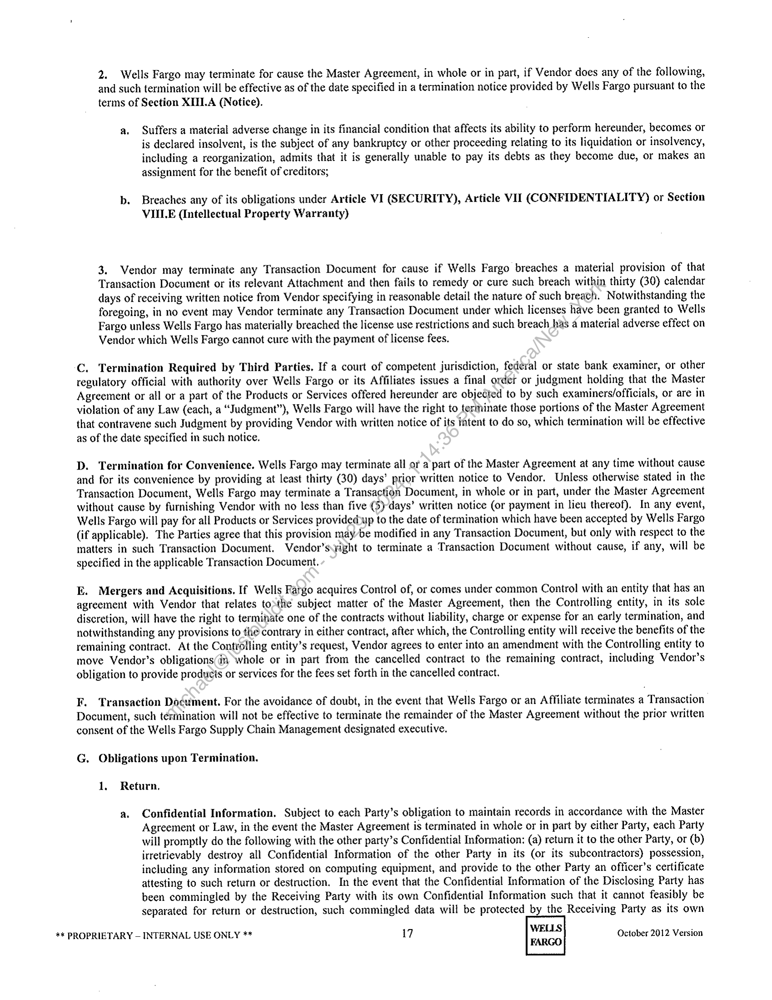
```
```col-md
2. Wells Fargo may terminate for cause the Master Agreement, in whole or in part, if Vendor does any of the following,
and such termination will be effective as of the date specified in a termination notice provided by Wells Fargo pursuant to the
terms of Section XIHII.A (Notice).
a. Suffers a material adverse change in its financial condition that affects its ability to perform hereunder, becomes or
is declared insolvent, is the subject of any bankruptcy or other proceeding relating to its liquidation or insolvency,
including a reorganization, admits that it is generally unable to pay its debts as they become due, or makes an
assignment for the benefit of creditors;
b. Breaches any of its obligations under Article VI (SECURITY), Article VII (CONFIDENTIALITY) or Section
VIILE (ntellectual Property Warranty)
3. Vendor may terminate any Transaction Document for cause if Wells Fargo breaches a material provision of that
Transaction Document or its relevant Attachment and then fails to remedy or cure such breach within thirty (30) calendar
days of receiving written notice from Vendor specifying in reasonable detail the nature of such breach. Notwithstanding the
foregoing, in no event may Vendor terminate any Transaction Document under which licenses have been granted to Wells
Fargo unless Wells Fargo has materially breached the license use restrictions and such breach has a material adverse effect on
Vendor which Wells Fargo cannot cure with the payment of license fees.
C. Termination Required by Third Parties. If a court of competent jurisdiction, federal or state bank examiner, or other
regulatory official with authority over Wells Fargo or its Affiliates issues a final order or judgment holding that the Master
Agreement or all or a part of the Products or Services offered hereunder are objected to by such examiners/officials, or are in
violation of any Law (each, a “Judgment”), Wells Fargo will have the right to terminate those portions of the Master Agreement
that contravene such Judgment by providing Vendor with written notice of its intent to do so, which termination will be effective
as of the date specified in such notice,
D. Termination for Convenience. Wells Fargo may terminate all or a part of the Master Agreement at any time without cause
and for its convenience by providing at least thirty (30) days’ prior written notice to Vendor. Unless otherwise stated in the
Transaction Document, Wells Fargo may terminate a Transaction Document, in whole or in part, under the Master Agreement
without cause by furnishing Vendor with no less than five (5)days’ written notice (or payment in lieu thereof), In any event,
Wells Fargo will pay for all Products or Services providedup to the date of termination which have been accepted by Wells Fargo
(if applicable). The Parties agree that this provision may/be modified in any Transaction Document, but only with respect to the
matters in such Transaction Document. Vendor’s\vight to terminate a Transaction Document without cause, if any, will be
specified in the applicable Transaction Document.
E. Mergers and Acquisitions. If Wells Ratgo acquires Control of, or comes under common Control with an entity that has an
agreement with Vendor that relates to»the subject matter of the Master Agreement, then the Controlling entity, in its sole
discretion, will have the right to terminate one of the contracts without liability, charge or expense for an early termination, and
notwithstanding any provisions to tke contrary in either contract, after which, the Controlling entity will receive the benefits of the
remaining contract. At the Contrélling entity’s request, Vendor agrees to enter into an amendment with the Controlling entity to
move Vendor's obligations(it whole or in part from the cancelled contract to the remaining contract, including Vendor’s
obligation to provide products or services for the fees set forth in the cancelled contract.
F. Transaction Document. For the avoidance of doubt, in the event that Wells Fargo or an Affiliate terminates a Transaction
Document, such térfnination will not be effective to terminate the remainder of the Master Agreement without the prior written
consent of the Wells Fargo Supply Chain Management designated executive.
G. Obligations upon Termination,
1, Return,
a. Confidential Information. Subject to each Party’s obligation to maintain records in accordance with the Master
Agreement or Law, in the event the Master Agreement is terminated in whole or in part by either Party, each Party
will promptly do the following with the other party’s Confidential Information: (a) retum it to the other Party, or (b)
irretrievably destroy all Confidential Information of the other Party in its (or its subcontractors) possession,
including any information stored on computing equipment, and provide to the other Party an officer’s certificate
attesting to such return or destruction. In the event that the Confidential Information of the Disclosing Party has
been commingled by the Receiving Party with its own Confidential Information such that it cannot feasibly be
separated for return or destruction, such commingled data will be protected by the Receiving Party as its own
++ PROPRIETARY — INTERNAL USE ONLY ** 17 WELLS October 2012 Version
FARGO
```
````
Notes:
````col
```col-md
flexGrow=.5
===
> [!info] [Page 18](_attachments/images_WF-3.6.1.15.1.3WellsFargo-MasterAgreement7.05.2013.pdf_210124/page_18.png)
> 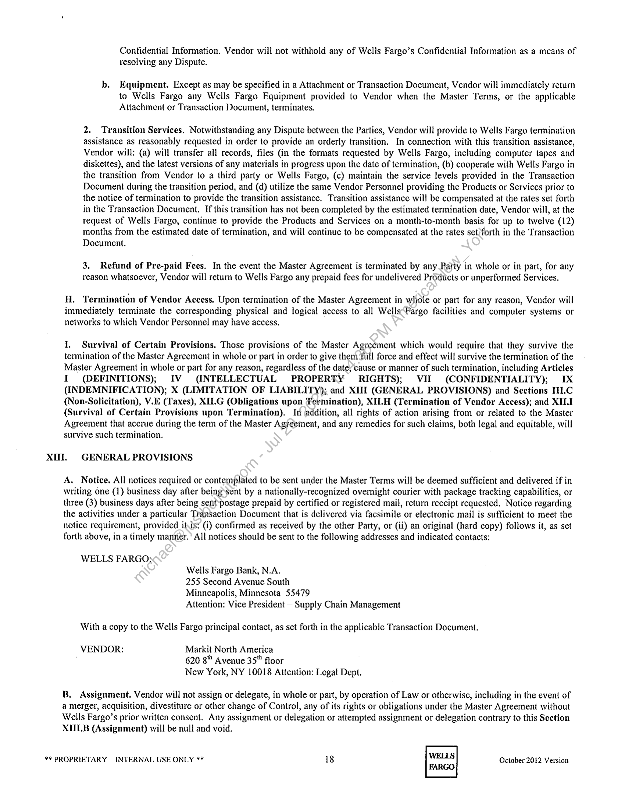
```
```col-md
Confidential Information. Vendor will not withhold any of Wells Fargo’s Confidential Information as a means of
resolving any Dispute.
b. Equipment. Except as may be specified in a Attachment or Transaction Document, Vendor will immediately return
to Wells Fargo any Wells Fargo Equipment provided to Vendor when the Master Terms, or the applicable
Attachment or Transaction Document, terminates.
2. Transition Services. Notwithstanding any Dispute between the Parties, Vendor will provide to Wells Fargo termination
assistance as reasonably requested in order to provide an orderly transition. In connection with this transition assistance,
Vendor will: (a) will transfer all records, files (in the formats requested by Wells Fargo, including computer tapes and
diskettes), and the latest versions of any materials in progress upon the date of termination, (b) cooperate with Wells Fargo in
the transition from Vendor to a third party or Wells Fargo, (c) maintain the service levels provided in the Transaction
Document during the transition period, and (d) utilize the same Vendor Personnel providing the Products or Services prior to
the notice of termination to provide the transition assistance. Transition assistance will be compensated at the rates set forth
in the Transaction Document. If this transition has not been completed by the estimated termination date, Vendor will, at the
request of Wells Fargo, continue to provide the Products and Services on a month-to-month basis for up to twelve (12)
months from the estimated date of termination, and will continue to be compensated at the rates set ‘forth in the Transaction
Document,
3. Refund of Pre-paid Fees. In the event the Master Agreement is terminated by any Party in whole or in part, for any
reason whatsoever, Vendor will return to Wells Fargo any prepaid fees for undelivered Products or unperformed Services.
H. Termination of Vendor Access. Upon termination of the Master Agreement in whole or part for any reason, Vendor will
immediately terminate the corresponding physical and logical access to all Wells“Fargo facilities and computer systems or
networks to which Vendor Personnel may have access.
I. Survival of Certain Provisions. Those provisions of the Master Agreement which would require that they survive the
termination of the Master Agreement in whole or part in order to give them full force and effect will survive the termination of the
Master Agreement in whole or part for any reason, regardless of the date, cause or manner of such termination, including Articles
I (DEFINITIONS); IV (INTELLECTUAL PROPERTY RIGHTS); VII (CONFIDENTIALITY); IX
(INDEMNIFICATION); X (LIMITATION OF LIABILITY); and XIII (GENERAL PROVISIONS) and Sections III.C
{Non-Solicitation), V.E (Taxes), XII.G (Obligations upon Termination), XII.H (Termination of Vendor Access); and XIII
(Survival of Certain Provisions upon Termination). In addition, all rights of action arising from or related to the Master
Agreement that accrue during the term of the Master Agfeement, and any remedies for such claims, both legal and equitable, will
survive such termination.
XIII, GENERAL PROVISIONS
A. Notice. All notices required or contemplated to be sent under the Master Terms will be deemed sufficient and delivered if in
writing one (1) business day after being-sent by a nationally-recognized overnight courier with package tracking capabilities, or
three (3) business days after being sentpostage prepaid by certified or registered mail, return receipt requested. Notice regarding
the activities under a particular Transaction Document that is delivered via facsimile or electronic mail is sufficient to meet the
notice requirement, provided itis: (i) confirmed as received by the other Party, or (ii) an original (hard copy) follows it, as set
forth above, in a timely manner.’ All notices should be sent to the following addresses and indicated contacts:
WELLS FARGO;
Wells Fargo Bank, N.A.
255 Second Avenue South
Minneapolis, Minnesota 55479
Attention: Vice President — Supply Chain Management
With a copy to the Wells Fargo principal contact, as set forth in the applicable Transaction Document.
VENDOR: Markit North America
, 620 8" Avenue 35" floor
New York, NY 10018 Attention: Legal Dept.
B. Assignment. Vendor will not assign or delegate, in whole or part, by operation of Law or otherwise, including in the event of
a merger, acquisition, divestiture or other change of Control, any of its rights or obligations under the Master Agreement without
Wells Fargo’s prior written consent. Any assignment or delegation or attempted assignment or delegation contrary to this Section
XIII.B (Assignment) will be null and void.
** PROPRIETARY — INTERNAL USE ONLY ** 18 October 2012 Version
```
````
Notes:
````col
```col-md
flexGrow=.5
===
> [!info] [Page 19](_attachments/images_WF-3.6.1.15.1.3WellsFargo-MasterAgreement7.05.2013.pdf_210124/page_19.png)
> 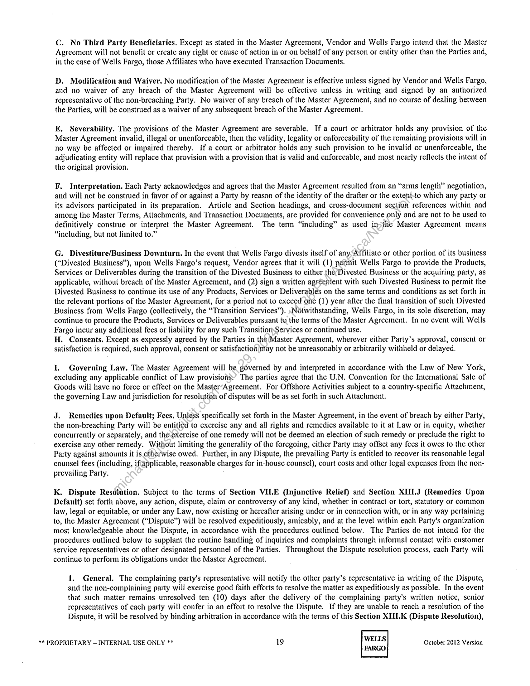
```
```col-md
C. No Third Party Beneficiaries. Except as stated in the Master Agreement, Vendor and Wells Fargo intend that the Master
Agreement will not benefit or create any right or cause of action in or on behalf of any person or entity other than the Parties and,
in the case of Wells Fargo, those Affiliates who have executed Transaction Documents.
D. Modification and Waiver. No modification of the Master Agreement is effective unless signed by Vendor and Wells Fargo,
and no waiver of any breach of the Master Agreement will be effective unless in writing and signed by an authorized
representative of the non-breaching Party. No waiver of any breach of the Master Agreement, and no course of dealing between
the Parties, will be construed as a waiver of any subsequent breach of the Master Agreement.
E, Severability. The provisions of the Master Agreement are severable. If a court or arbitrator holds any provision of the
Master Agreement invalid, illegal or unenforceable, then the validity, legality or enforceability of the remaining provisions will in
no way be affected or impaired thereby. If a court or arbitrator holds any such provision to be invalid or unenforceable, the
adjudicating entity will replace that provision with a provision that is valid and enforceable, and most nearly reflects the intent of
the original provision.
F. Interpretation. Each Party acknowledges and agrees that the Master Agreement resulted from an “arms length” negotiation,
and will not be construed in favor of or against a Party by reason of the identity of the drafter or the extenf-to which any party or
its advisors participated in its preparation. Article and Section headings, and cross-document section references within and
among the Master Terms, Attachments, and Transaction Documents, are provided for convenience only and are not to be used to
definitively construe or interpret the Master Agreement. The term “including” as used insthe Master Agreement means
“including, but not limited to.”
G. Divestiture/Business Downturn. In the event that Wells Fargo divests itself of anyAffiliate or other portion of its business
(“Divested Business”), upon Wells Fargo’s request, Vendor agrees that it will (1) permit Wells Fargo to provide the Products,
Services or Deliverables during the transition of the Divested Business to either the’Divested Business or the acquiring party, as
applicable, without breach of the Master Agreement, and (2) sign a written agréement with such Divested Business to permit the
Divested Business to continue its use of any Products, Services or Deliverables on the same terms and conditions as set forth in
the relevant portions of the Master Agreement, for a period not to exceed one (1) year after the final transition of such Divested
Business from Wells Fargo (collectively, the “Transition Services”). Notwithstanding, Wells Fargo, in its sole discretion, may
continue to procure the Products, Services or Deliverables pursuant ta the terms of the Master Agreement. In no event will Wells
Fargo incur any additional fees or liability for any such Transition Services or continued use.
H. Consents, Except as expressly agreed by the Parties in the Master Agreement, wherever either Party’s approval, consent or
satisfaction is required, such approval, consent or satisfaction may not be unreasonably or arbitrarily withheld or delayed.
I. Governing Law. The Master Agreement will be governed by and interpreted in accordance with the Law of New York,
excluding any applicable conflict of Law provisions,’ The parties agree that the U.N. Convention for the International Sale of
Goods will have no force or effect on the Master‘Agreement. For Offshore Activities subject to a country-specific Attachment,
the governing Law and jurisdiction for resolution of disputes will be as set forth in such Attachment.
J. Remedies upon Default; Fees. Unless specifically set forth in the Master Agreement, in the event of breach by either Party,
the non-breaching Party will be entitled to exercise any and all rights and remedies available to it at Law or in equity, whether
concurrently or separately, and the-exercise of one remedy will not be deemed an election of such remedy or preclude the right to
exercise any other remedy. Without limiting the generality of the foregoing, either Party may offset any fees it owes to the other
Party against amounts it is otherwise owed. Further, in any Dispute, the prevailing Party is entitled to recover its reasonable legal
counsel fees (including, if@pplicable, reasonable charges for in-house counsel), court costs and other legal expenses from the nonprevailing Party.
K. Dispute Resolution, Subject to the terms of Section VILE (Injunctive Relief) and Section XIII.J (Remedies Upon
Default) set forth above, any action, dispute, claim or controversy of any kind, whether in contract or tort, statutory or common
law, legal or equitable, or under any Law, now existing or hereafter arising under or in connection with, or in any way pertaining
to, the Master Agreement (“Dispute”) will be resolved expeditiously, amicably, and at the level within each Party's organization
most knowledgeable about the Dispute, in accordance with the procedures outlined below. The Parties do not intend for the
procedures outlined below to supplant the routine handling of inquiries and complaints through informal contact with customer
service representatives or other designated personnel of the Parties. Throughout the Dispute resolution process, each Party will
continue to perform its obligations under the Master Agreement.
1. General. The complaining party's representative will notify the other party’s representative in writing of the Dispute,
and the non-complaining party will exercise good faith efforts to resolve the matter as expeditiously as possible. In the event
that such matter remains unresolved ten (10) days after the delivery of the complaining party's written notice, senior
representatives of each party will confer in an effort to resolve the Dispute. If they are unable to reach a resolution of the
Dispute, it will be resolved by binding arbitration in accordance with the terms of this Section XILLK (Dispute Resolution),
++ PROPRIETARY — INTERNAL USE ONLY ** 19 yarco October 2012 Version
```
````
Notes:
````col
```col-md
flexGrow=.5
===
> [!info] [Page 20](_attachments/images_WF-3.6.1.15.1.3WellsFargo-MasterAgreement7.05.2013.pdf_210124/page_20.png)
> 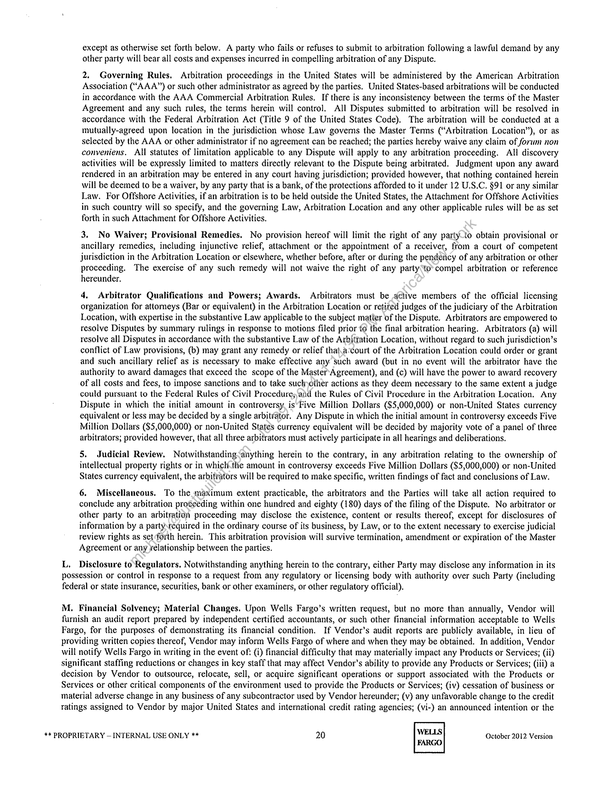
```
```col-md
except as otherwise set forth below. A party who fails or refuses to submit to arbitration following a lawful demand by any
other party will bear all costs and expenses incurred in compelling arbitration of any Dispute.
2. Governing Rules. Arbitration proceedings in the United States will be administered by the American Arbitration
Association (“AAA”) or such other administrator as agreed by the parties. United States-based arbitrations will be conducted
in accordance with the AAA Commercial Arbitration Rules. If there is any inconsistency between the terms of the Master
Agreement and any such rules, the terms herein will control. All Disputes submitted to arbitration will be resolved in
accordance with the Federal Arbitration Act (Title 9 of the United States Code). The arbitration will be conducted at a
mutually-agreed upon location in the jurisdiction whose Law governs the Master Terns (“Arbitration Location”), or as
selected by the AAA or other administrator if no agreement can be reached; the parties hereby waive any claim of forum non
conveniens. All statutes of limitation applicable to any Dispute will apply to any arbitration proceeding. All discovery
activities will be expressly limited to matters directly relevant to the Dispute being arbitrated. Judgment upon any award
rendered in an arbitration may be entered in any court having jurisdiction; provided however, that nothing contained herein
will be deemed to be a waiver, by any party that is a bank, of the protections afforded to it under 12 U.S.C. §91 or any similar
Law. For Offshore Activities, if an arbitration is to be held outside the United States, the Attachment for Offshore Activities
in such country will so specify, and the governing Law, Arbitration Location and any other applicable rules will be as set
forth in such Attachment for Offshore Activities.
3. No Waiver; Provisional Remedies. No provision hereof will limit the right of any party-to obtain provisional or
ancillary remedies, including injunctive relief, attachment or the appointment of a receiver, from a court of competent
jurisdiction in the Arbitration Location or elsewhere, whether before, after or during the pendency of any arbitration or other
proceeding. The exercise of any such remedy will not waive the right of any party“to> compel arbitration or reference
hereunder.
4. Arbitrator Qualifications and Powers; Awards. Arbitrators must be active members of the official licensing
organization for attomeys (Bar or equivalent) in the Arbitration Location or retired judges of the judiciary of the Arbitration
Location, with expertise in the substantive Law applicable to the subject matter of the Dispute. Arbitrators are empowered to
resolve Disputes by summary rulings in response to motions filed prior to the final arbitration hearing. Arbitrators (a) will
resolve all Disputes in accordance with the substantive Law of the Arbittation Location, without regard to such jurisdiction’s
conflict of Law provisions, (b) may grant any remedy or relief thaf.a-court of the Arbitration Location could order or grant
and such ancillary relief as is necessary to make effective any Such award (but in no event will the arbitrator have the
authority to award damages that exceed the scope of the MasterAgreement), and (c) will have the power to award recovery
of all costs and fees, to impose sanctions and to take suclnother actions as they deem necessary to the same extent a judge
could pursuant to the Federal Rules of Civil Procedure; aid the Rules of Civil Procedure in the Arbitration Location, Any
Dispute in which the initial amount in controversy, is‘Five Million Dollars ($5,000,000) or non-United States currency
equivalent or less may be decided by a single arbitrator. Any Dispute in which the initial amount in controversy exceeds Five
Million Dollars ($5,000,000) or non-United States currency equivalent will be decided by majority vote of a panel of three
arbitrators; provided however, that all three arbitrators must actively participate in all hearings and deliberations.
5. Judicial Review. Notwithstanding‘anything herein to the contrary, in any arbitration relating to the ownership of
intellectual property rights or in which the amount in controversy exceeds Five Million Dollars ($5,000,000) or non-United
States currency equivalent, the arbitrators will be required to make specific, written findings of fact and conclusions of Law.
6. Miscellaneous. To the maximum extent practicable, the arbitrators and the Parties will take all action required to
conclude any arbitration proceeding within one hundred and eighty (180) days of the filing of the Dispute. No arbitrator or
other party to an arbitration proceeding may disclose the existence, content or results thereof, except for disclosures of
information by a partysrequired in the ordinary course of its business, by Law, or to the extent necessary to exercise judicial
review rights as set forth herein. This arbitration provision will survive termination, amendment or expiration of the Master
Agreement or any relationship between the parties.
L, Disclosure to Regulators. Notwithstanding anything herein to the contrary, either Party may disclose any information in its
possession or control in response to a request from any regulatory or licensing body with authority over such Party (including
federal or state insurance, securities, bank or other examiners, or other regulatory official).
M. Financial Solvency; Material Changes. Upon Wells Fargo’s written request, but no more than annually, Vendor will
furnish an audit report prepared by independent certified accountants, or such other financial information acceptable to Wells
Fargo, for the purposes of demonstrating its financial condition. If Vendor’s audit reports are publicly available, in lieu of
providing written copies thereof, Vendor may inform Wells Fargo of where and when they may be obtained. In addition, Vendor
will notify Wells Fargo in writing in the event of: (i) financial difficulty that may materially impact any Products or Services; (ii)
significant staffing reductions or changes in key staff that may affect Vendor’s ability to provide any Products or Services; (iii) a
decision by Vendor to outsource, relocate, sell, or acquire significant operations or support associated with the Products or
Services or other critical components of the environment used to provide the Products or Services; (iv) cessation of business or
material adverse change in any business of any subcontractor used by Vendor hereunder; (v) any unfavorable change to the credit
ratings assigned to Vendor by major United States and international credit rating agencies; (vi-) an announced intention or the
20 WELLS
FARGO
** PROPRIETARY — INTERNAL USE ONLY ** October 2012 Version
```
````
Notes:
````col
```col-md
flexGrow=.5
===
> [!info] [Page 21](_attachments/images_WF-3.6.1.15.1.3WellsFargo-MasterAgreement7.05.2013.pdf_210124/page_21.png)
> 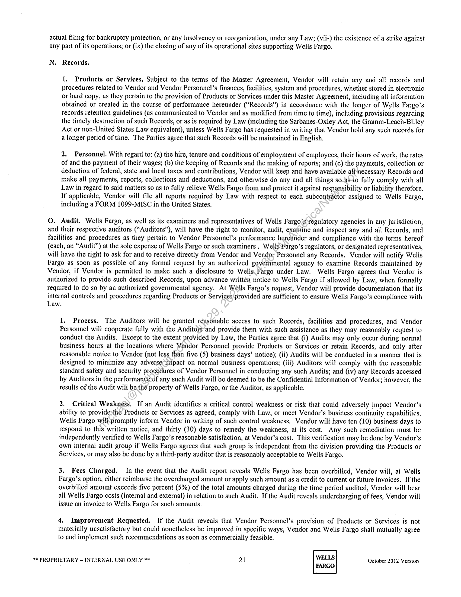
```
```col-md
actual filing for bankruptcy protection, or any insolvency or reorganization, under any Law; (vii-) the existence of a strike against
any part of its operations; or (ix) the closing of any of its operational sites supporting Wells Fargo.
N. Records.
I. Products or Services. Subject to the terms of the Master Agreement, Vendor will retain any and all records and
procedures related to Vendor and Vendor Personnel’s finances, facilities, system and procedures, whether stored in electronic
or hard copy, as they pertain to the provision of Products or Services under this Master Agreement, including all information
obtained or created in the course of performance hereunder (“Records”) in accordance with the longer of Wells Fargo’s
records retention guidelines (as communicated to Vendor and as modified from time to time), including provisions regarding
the timely destruction of such Records, or as is required by Law (including the Sarbanes-Oxley Act, the Gramm-Leach-Bliley
Act or non-United States Law equivalent), unless Wells Fargo has requested in writing that Vendor hold any such records for
a longer period of time. The Parties agree that such Records will be maintained in English.
2. Personnel. With regard to: (a) the hire, tenure and conditions of employment of employees, their hours of work, the rates
of and the payment of their wages; (b) the keeping of Records and the making of reports; and (c) the payments, collection or
deduction of federal, state and local taxes and contributions, Vendor will keep and have available all'necessary Records and
make all payments, reports, collections and deductions, and otherwise do any and all things so_as-to fully comply with all
Law in regard to said matters so as to fully relieve Wells Fargo from and protect it against responsibility or liability therefore.
If applicable, Vendor will file all reports required by Law with respect to each subcontractor assigned to Wells Fargo,
including a FORM 1099-MISC in the United States.
O. Audit. Wells Fargo, as well as its examiners and representatives of Wells Fargo’s regulatory agencies in any jurisdiction,
and their respective auditors (“Auditors”), will have the right to monitor, audit, examine and inspect any and all Records, and
facilities and procedures as they pertain to Vendor Personnel’s performance hereunder and compliance with the terms hereof
(each, an “Audit”) at the sole expense of Wells Fargo or such examiners . Wells Fargo’s regulators, or designated representatives,
will have the right to ask for and to receive directly from Vendor and Vendor Personnel any Records, Vendor will notify Wells
Fargo as soon as possible of any formal request by an authorized governmental agency to examine Records maintained by
Vendor, if Vendor is permitted to make such a disclosure to Wells Fargo under Law. Wells Fargo agrees that Vendor is
authorized to provide such described Records, upon advance written notice to Wells Fargo if allowed by Law, when formally
required to do so by an authorized governmental agency. At Wells Fargo’s request, Vendor will provide documentation that its
internal controls and procedures regarding Products or Services provided are sufficient to ensure Wells Fargo’s compliance with
Law.
1, Process. The Auditors will be granted reasonable access to such Records, facilities and procedures, and Vendor
Personnel will cooperate fully with the Auditors and provide them with such assistance as they may reasonably request to
conduct the Audits. Except to the extent provided by Law, the Parties agree that (i) Audits may only occur during normal
business hours at the locations where Vendor Personnel provide Products or Services or retain Records, and only after
reasonable notice to Vendor (not less than five (5) business days’ notice); (ii) Audits will be conducted in a manner that is
designed to minimize any adversecimpact on normal business operations; (iii) Auditors will comply with the reasonable
standard safety and security procedures of Vendor Personnel in conducting any such Audits; and (iv) any Records accessed
by Auditors in the performanceof any such Audit will be deemed to be the Confidential Information of Vendor; however, the
results of the Audit will bethe property of Wells Fargo, or the Auditor, as applicable.
2. Critical Weakness. If an Audit identifies a critical control weakness or risk that could adversely impact Vendor’s
ability to providethe Products or Services as agreed, comply with Law, or meet Vendor’s business continuity capabilities,
Wells Fargo will\promptly inform Vendor in writing of such control weakness. Vendor wilt have ten (10) business days to
respond to this written notice, and thirty (30) days to remedy the weakness, at its cost. Any such remediation must be
independently verified to Wells Fargo’s reasonable satisfaction, at Vendor’s cost. This verification may be done by Vendor’s
own internal audit group if Wells Fargo agrees that such group is independent from the division providing the Products or
Services, or may also be done by a third-party auditor that is reasonably acceptable to Wells Fargo.
3. Fees Charged. In the event that the Audit report reveals Wells Fargo has been overbilled, Vendor will, at Wells
Fargo’s option, either reimburse the overcharged amount or apply such amount as a credit to current or future invoices. If the
overbilled amount exceeds five percent (5%) of the total amounts charged during the time period audited, Vendor will bear
all Wells Fargo costs (internal and external) in relation to such Audit. If the Audit reveals undercharging of fees, Vendor will
issue an invoice to Wells Fargo for such amounts.
4. Improvement Requested. If the Audit reveals that Vendor Personnel’s provision of Products or Services is not
materially unsatisfactory but could nonetheless be improved in specific ways, Vendor and Wells Fargo shall mutually agree
to and implement such recommendations as soon as commercially feasible.
** PROPRIETARY — INFERNAL USE ONLY ** 21 October 2012 Version
```
````
Notes:
````col
```col-md
flexGrow=.5
===
> [!info] [Page 22](_attachments/images_WF-3.6.1.15.1.3WellsFargo-MasterAgreement7.05.2013.pdf_210124/page_22.png)
> 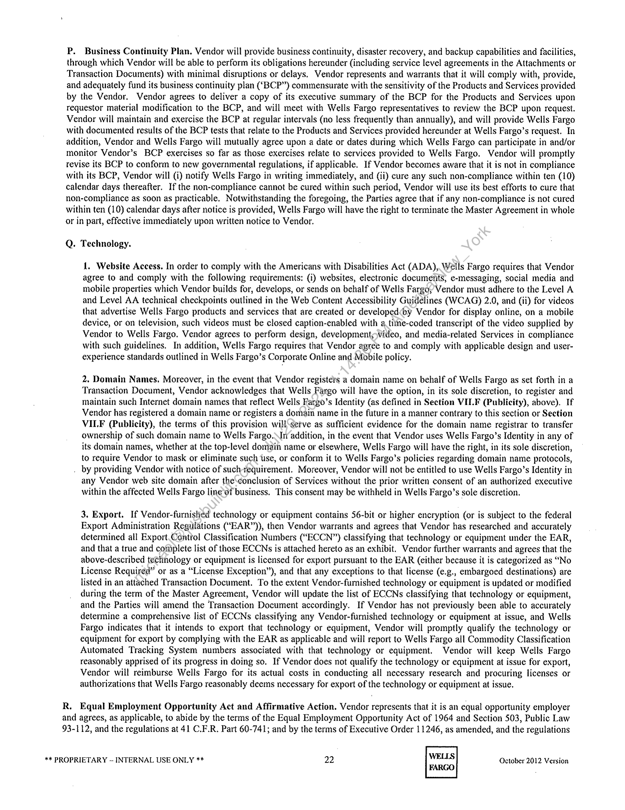
```
```col-md
P. Business Continuity Plan. Vendor will provide business continuity, disaster recovery, and backup capabilities and facilities,
through which Vendor will be able to perform its obligations hereunder {including service level agreements in the Attachments or
Transaction Documents) with minimal disruptions or delays. Vendor represents and warrants that it will comply with, provide,
and adequately fund its business continuity plan (“BCP”) commensurate with the sensitivity of the Products and Services provided
by the Vendor, Vendor agrees to deliver a copy of its executive summary of the BCP for the Products and Services upon
requestor material modification to the BCP, and will meet with Wells Fargo representatives to review the BCP upon request.
Vendor will maintain and exercise the BCP at regular intervals (no less frequently than annually), and will provide Wells Fargo
with documented results of the BCP tests that relate to the Products and Services provided hereunder at Wells Fargo’s request. In
addition, Vendor and Wells Fargo will mutually agree upon a date or dates during which Wells Fargo can participate in and/or
monitor Vendor’s BCP exercises so far as those exercises relate to services provided to Wells Fargo. Vendor will promptly
revise its BCP to conform to new governmental regulations, if applicable. If Vendor becomes aware that it is not in compliance
with its BCP, Vendor will (i) notify Wells Fargo in writing immediately, and (ii) cure any such non-compliance within ten (10)
calendar days thereafter. If the non-compliance cannot be cured within such period, Vendor will use its best efforts to cure that
non-compliance as soon as practicable. Notwithstanding the foregoing, the Parties agree that if any non-compliance is not cured
within ten (10) calendar days after notice is provided, Wells Fargo will have the right to terminate the Master Agreement in whole
or in part, effective immediately upon written notice to Vendor.
Q. Technology.
1. Website Access. In order to comply with the Americans with Disabilities Act (ADA), Wells Fargo requires that Vendor
agree to and comply with the following requirements: (i) websites, electronic documents, e-messaging, social media and
mobile properties which Vendor builds for, develops, or sends on behalf of Wells Fargo,’ Vendor must adhere to the Level A
and Level AA technical checkpoints outlined in the Web Content Accessibility Guidelines (WCAG) 2.0, and (ii) for videos
that advertise Wells Fargo products and services that are created or developedcby Vendor for display online, on a mobile
device, or on television, such videos must be closed caption-enabled with a time-coded transcript of the video supplied by
Vendor to Wells Fargo, Vendor agrees to perform design, development; video, and media-related Services in compliance
with such guidelines. In addition, Wells Fargo requires that Vendor agree to and comply with applicable design and userexperience standards outlined in Wells Fargo’s Corporate Online and Mobile policy.
2. Domain Names. Moreover, in the event that Vendor registers a domain name on behalf of Wells Fargo as set forth in a
Transaction Document, Vendor acknowledges that Wells Fargo will have the option, in its sole discretion, to register and
maintain such Internet domain names that reflect Wells Fargo’s Identity (as defined in Section VII.F (Publicity), above). If
Vendor has registered a domain name or registers a domain name in the future in a manner contrary to this section or Section
VILF (Publicity), the terms of this provision will‘serve as sufficient evidence for the domain name registrar to transfer
ownership of such domain name to Wells Fargo. addition, in the event that Vendor uses Wells Fargo’s Identity in any of
its domain names, whether at the top-level domain name or elsewhere, Wells Fargo will have the right, in its sole discretion,
to require Vendor to mask or eliminate such use, or conform it to Wells Fargo’s policies regarding domain name protocols,
. by providing Vendor with notice of such-tequirement. Moreover, Vendor will not be entitled to use Wells Fargo’s Identity in
any Vendor web site domain after the\conclusion of Services without the prior written consent of an authorized executive
within the affected Wells Fargo line of business. This consent may be withheld in Wells Fargo’s sole discretion.
3. Export. If Vendor-furnislied technology or equipment contains 56-bit or higher encryption (or is subject to the federal
Export Administration Regulations (“EAR”)), then Vendor warrants and agrees that Vendor has researched and accurately
determined all Export.Control Classification Numbers (“ECCN”) classifying that technology or equipment under the EAR,
and that a true and complete list of those ECCNs is attached hereto as an exhibit. Vendor further warrants and agrees that the
above-described technology or equipment is licensed for export pursuant to the EAR (either because it is categorized as “No
License Required” or as a “License Exception”), and that any exceptions to that license (e.g., embargoed destinations) are
listed in an attached Transaction Document. To the extent Vendor-furnished technology or equipment is updated or modified
during the term of the Master Agreement, Vendor will update the list of ECCNs classifying that technology or equipment,
and the Parties will amend the Transaction Document accordingly. If Vendor has not previously been able to accurately
determine a comprehensive list of ECCNs classifying any Vendor-furnished technology or equipment at issue, and Wells
Fargo indicates that it intends to export that technology or equipment, Vendor will promptly qualify the technology or
equipment for export by complying with the EAR as applicable and will report to Wells Fargo all Commodity Classification
Automated Tracking System numbers associated with that technology or equipment. Vendor will keep Wells Fargo
reasonably apprised of its progress in doing so. If Vendor does not qualify the technology or equipment at issue for export,
Vendor will reimburse Wells Fargo for its actual costs in conducting all necessary research and procuring licenses or
authorizations that Wells Fargo reasonably deems necessary for export of the technology or equipment at issue.
R. Equal Employment Opportunity Act and Affirmative Action. Vendor represents that it is an equal opportunity employer
and agrees, as applicable, to abide by the terms of the Equal Employment Opportunity Act of 1964 and Section 503, Public Law
93-112, and the regulations at 41 C.F.R. Part 60-741; and by the terms of Executive Order 11246, as amended, and the regulations
** PROPRIETARY ~ INTERNAL USE ONLY ** 22 October 2012 Version
```
````
Notes:
````col
```col-md
flexGrow=.5
===
> [!info] [Page 23](_attachments/images_WF-3.6.1.15.1.3WellsFargo-MasterAgreement7.05.2013.pdf_210124/page_23.png)
> 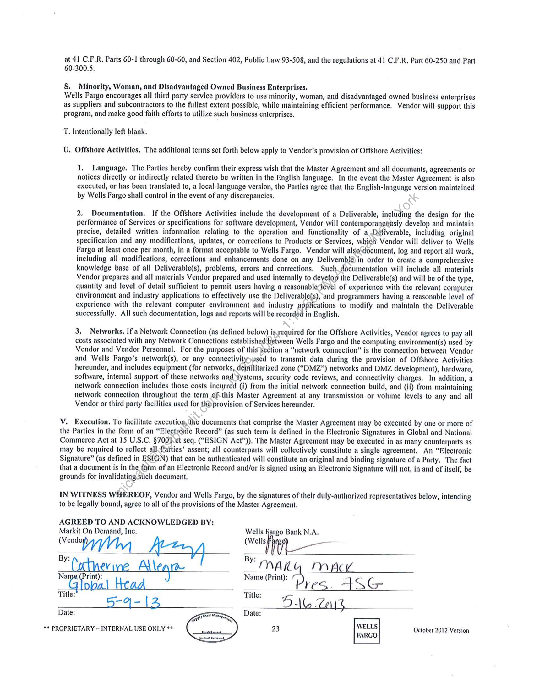
```
```col-md
at 41 C.F.R. Parts 60-1 through 60-60, and Section 402, Public Law 93-508, and the regulations at 41 C.F.R. Part 60-250 and Part
60-300.5.
S. Minority, Woman, and Disadvantaged Owned Business Enterprises.
Wells Fargo encourages all third party service providers to use minority, woman, and disadvantaged owned business enterprises
as suppliers and subcontractors to the fullest extent possible, while maintaining efficient performance. Vendor will support this
program, and make good faith efforts to utilize such business enterprises.
T. Intentionally left blank.
U. Offshore Activities. The additional terms set forth below apply to Vendor's provision of Offshore Activities:
1, Language. The Parties hereby confirm their express wish that the Master Agreement and all documents, agreements or
notices directly or indirectly related thereto be written in the English language. In the event the Master Agreement is also
executed, or has been translated to, a local-language version, the Parties agree that the English-language version maintained
by Wells Fargo shall control in the event of any discrepancies.
2. Documentation. If the Offshore Activities include the development of a Deliverable, including the design for the
performance of Services or specifications for software development, Vendor will contemporaneausly develop and maintain
precise, detailed written information relating to the operation and functionality of a Deliverable, including original
specification and any modifications, updates, or corrections to Products or Services, which Vendor will deliver to Wells
Fargo at least once per month, in a format acceptable to Wells Fargo. Vendor will alsocdocument, log and report all work,
including all modifications, corrections and enhancements done on any Deliverablé/in order to create a comprehensive
knowledge base of all Deliverable(s), problems, errors and corrections. Such documentation will include all materials
Vendor prepares and all materials Vendor prepared and used internally to develop the Deliverable(s) and will be of the type,
quantity and level of detail sufficient to permit users having a reasonabledevel of experience with the relevant computer
environment and industry applications to effectively use the Deliverable(s),and programmers having a reasonable level of
experience with the relevant computer environment and industry applications to modify and maintain the Deliverable
successfully. All such documentation, logs and reports will be recorded in English.
3. Networks, If a Network Connection (as defined below) is,required for the Offshore Activities, Vendor agrees to pay all
costs associated with any Network Connections established between Wells Fargo and the computing environment(s) used by
Vendor and Vendor Personnel. For the purposes of this section a “network connection” is the connection between Vendor
and Wells Fargo’s network(s), or any connectivityyused to transmit data during the provision of Offshore Activities
hereunder, and includes equipment (for networks, demilitarized zone (“DMZ”) networks and DMZ development), hardware,
software, internal support of these networks and systems, security code reviews, and connectivity charges. In addition, a
network connection includes those costs incurred (i) from the initial network connection build, and (ii) from maintaining
network connection throughout the term ofthis Master Agreement at any transmission or volume levels to any and all
Vendor or third party facilities used for thé provision of Services hereunder.
V. Execution, To facilitate execution, (the documents that comprise the Master Agreement may be executed by one or more of
the Parties in the form of an “Electronic Record” (as such term is defined in the Electronic Signatures in Global and National
Commerce Act at 15 U.S.C. §700}vet seq. (“ESIGN Act”). The Master Agreement may be executed in as many counterparts as
may be required to reflect all.Parties’ assent; all counterparts will collectively constitute a single agreement. An “Electronic
Signature” (as defined in ESIGN) that can be authenticated will constitute an original and binding signature of a Party. The fact
that a document is in the form of an Electronic Record and/or is signed using an Electronic Signature will not, in and of itself, be
grounds for invalidating stich document,
IN WITNESS WHEREOF, Vendor and Wells Fargo, by the signatures of their duly-authorized representatives below, intending
to be legally bound, agree to all of the provisions of the Master Agreement.
AGREED TO AND ACKNOWLEDGED BY:
Markit On Demand, Inc. Wells Rargo Bank N.A
(Vendo (welsh ——
By: bya, By:
— Catherine Allen ta. MALY MAC
mrctin : Name (Print): © aC
k rint) \ Head _ tint): f res. AoG
Title: itle: E é ;
S-4=12 5B Mo 2a
Date: Date:
** PROPRIETARY ~ INTERNAL USE ONLY ** 23 October 2012 Version
```
````
Notes:
````col
```col-md
flexGrow=.5
===
> [!info] [Page 24](_attachments/images_WF-3.6.1.15.1.3WellsFargo-MasterAgreement7.05.2013.pdf_210124/page_24.png)
> 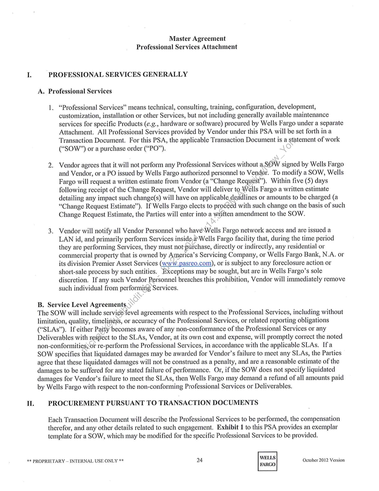
```
```col-md
L
II.
Master Agreement
Professional Services Attachment
PROFESSIONAL SERVICES GENERALLY
A. Professional Services
1. ‘Professional Services” means technical, consulting, training, configuration, development,
customization, installation or other Services, but not including generally available maintenance
services for specific Products (e.g., hardware or software) procured by Wells Fargo under a separate
Attachment. All Professional Services provided by Vendor under this PSA will be set forth in a
Transaction Document. For this PSA, the applicable Transaction Document is a statement of work
(“SOW”) or a purchase order (“PO”).
2. Vendor agrees that it will not perform any Professional Services without a SOW signed by Wells Fargo
and Vendor, or a PO issued by Wells Fargo authorized personnel to Vendor. To modify a SOW, Wells
Fargo will request a written estimate from Vendor (a “Change Request”). Within five (5) days
following receipt of the Change Request, Vendor will deliver to Wells Fargo a written estimate
detailing any impact such change(s) will have on applicable deadlines or amounts to be charged (a
“Change Request Estimate”). If Wells Fargo elects to pro¢¢ed with such change on the basis of such
Change Request Estimate, the Parties will enter into a written amendment to the SOW.
3. Vendor will notify all Vendor Personnel who havé\Wells Fargo network access and are issued a
LAN id, and primarily perform Services inside,&Wells Fargo facility that, during the time period
they are performing Services, they must notpurchase, directly or indirectly, any residential or
commercial property that is owned by America’s Servicing Company, or Wells Fargo Bank, N.A. or
its division Premier Asset Services (wayW.pasreo.com), or is subject to any foreclosure action or
short-sale process by such entities. Exceptions may be sought, but are in Wells Fargo’s sole
discretion. If any such Vendor Personnel breaches this prohibition, Vendor will immediately remove
such individual from performing Services.
B. Service Level Agreements
The SOW will include service-level agreements with respect to the Professional Services, including without
limitation, quality, timeliness, or accuracy of the Professional Services, or related reporting obligations
(“SLAs”). If either Patty becomes aware of any non-conformance of the Professional Services or any
Deliverables with respect to the SLAs, Vendor, at its own cost and expense, will promptly correct the noted
non-conformities,or re-perform the Professional Services, in accordance with the applicable SLAs. Ifa
SOW specifies that liquidated damages may be awarded for Vendor’s failure to meet any SLAs, the Parties
agree that these liquidated damages will not be construed as a penalty, and are a reasonable estimate of the
damages to be suffered for any stated failure of performance. Or, if the SOW does not specify liquidated
damages for Vendor’s failure to meet the SLAs, then Wells Fargo may demand a refund of all amounts paid
by Wells Fargo with respect to the non-conforming Professional Services or Deliverables.
PROCUREMENT PURSUANT TO TRANSACTION DOCUMENTS
Each Transaction Document will describe the Professional Services to be performed, the compensation
therefor, and any other details related to such engagement. Exhibit 1 to this PSA provides an exemplar
template for a SOW, which may be modified for the specific Professional Services to be provided.
** PROPRIETARY — INTERNAL USE ONLY ** 24 WEES October 2012 Version
```
````
Notes:
````col
```col-md
flexGrow=.5
===
> [!info] [Page 25](_attachments/images_WF-3.6.1.15.1.3WellsFargo-MasterAgreement7.05.2013.pdf_210124/page_25.png)
> 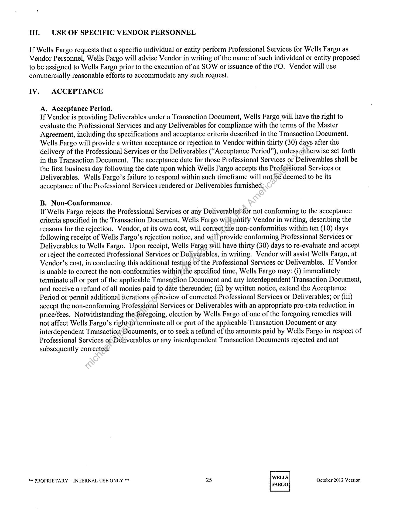
```
```col-md
IH. USE OF SPECIFIC VENDOR PERSONNEL
If Wells Fargo requests that a specific individual or entity perform Professional Services for Wells Fargo as
Vendor Personnel, Wells Fargo will advise Vendor in writing of the name of such individual or entity proposed
to be assigned to Wells Fargo prior to the execution of an SOW or issuance of the PO. Vendor will use
commercially reasonable efforts to accommodate any such request.
IV. ACCEPTANCE
A. Acceptance Period.
If Vendor is providing Deliverables under a Transaction Document, Wells Fargo will have the right to
evaluate the Professional Services and any Deliverables for compliance with the terms of the Master
Agreement, including the specifications and acceptance criteria described in the Transaction Document.
Wells Fargo will provide a written acceptance or rejection to Vendor within thirty (30) days after the
delivery of the Professional Services or the Deliverables (“Acceptance Period”), unless otherwise set forth
in the Transaction Document. The acceptance date for those Professional Services or Deliverables shall be
the first business day following the date upon which Wells Fargo accepts the Professional Services or
Deliverables. Wells Fargo’s failure to respond within such timeframe will not,be deemed to be its
acceptance of the Professional Services rendered or Deliverables furnished.
B. Non-Conformance.
If Wells Fargo rejects the Professional Services or any Deliverables‘for not conforming to the acceptance
criteria specified in the Transaction Document, Wells Fargo wilknotify Vendor in writing, describing the
reasons for the rejection. Vendor, at its own cost, will correct;the non-conformities within ten (10) days
following receipt of Wells Fargo’s rejection notice, and will provide conforming Professional Services or
Deliverables to Wells Fargo. Upon receipt, Wells Fargo will have thirty (30) days to re-evaluate and accept
or reject the corrected Professional Services or Deliverables, in writing. Vendor will assist Wells Fargo, at
Vendor’s cost, in conducting this additional testing of the Professional Services or Deliverables, If Vendor
is unable to correct the non-conformities withia the specified time, Wells Fargo may: (i) immediately
terminate all or part of the applicable Transaction Document and any interdependent Transaction Document,
and receive a refund of all monies paid to date thereunder; (ii) by written notice, extend the Acceptance
Period or permit additional iterations of review of corrected Professional Services or Deliverables; or (iii)
accept the non-conforming Professional Services or Deliverables with an appropriate pro-rata reduction in
price/fees. Notwithstanding theforegoing, election by Wells Fargo of one of the foregoing remedies will
not affect Wells Fargo’s rightto terminate all or part of the applicable Transaction Document or any
interdependent TransactionDocuments, or to seek a refund of the amounts paid by Wells Fargo in respect of
Professional Services of Deliverables or any interdependent Transaction Documents rejected and not
subsequently corrected:
** PROPRIETARY — INTERNAL USE ONLY ** 25 October 2012 Version
```
````
Notes:
````col
```col-md
flexGrow=.5
===
> [!info] [Page 26](_attachments/images_WF-3.6.1.15.1.3WellsFargo-MasterAgreement7.05.2013.pdf_210124/page_26.png)
> 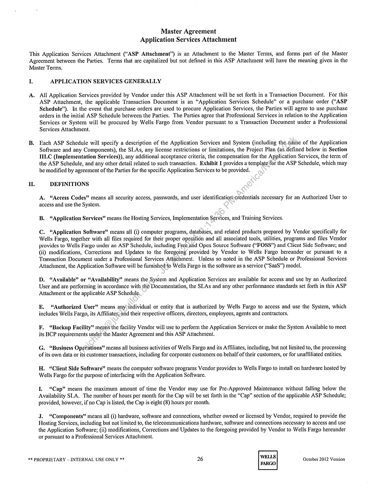
```
```col-md
Master Agreement
Application Services Attachment
This Application Services Attachment (“ASP Attachment”) is an Attachment to the Master Terms, and forms part of the Master
Agreement between the Parties. Terms that are capitalized but not defined in this ASP Attachment will have the meaning given in the
Master Terms.
L
A.
IL.
APPLICATION SERVICES GENERALLY
All Application Services provided by Vendor under this ASP Attachment will be set forth in a Transaction Document. For this
ASP Attachment, the applicable Transaction Document is an “Application Services Schedule” or a purchase order (“ASP
Schedule”). In the event that purchase orders are used to procure Application Services, the Parties will agree to use purchase
orders in the.initial ASP Schedule between the Parties. The Parties agree that Professional Services in relation to the Application
Services or System will be procured by Wells Fargo from Vendor pursuant to a Transaction Document under a Professional
Services Attachment.
Each ASP Schedule will specify a description of the Application Services and System (including the ame of the Application
Software and any Components), the SLAs, any license restrictions or limitations, the Project Plan (as. defined below in Section
INC (Implementation Services)), any additional acceptance criteria, the compensation for the Application Services, the term of
the ASP Schedule, and any other-detail related to such transaction. Exhibit 1 provides a template for the ASP Schedule, which may
be modified by agreement of the Parties for the specific Application Services to be provided,
DEFINITIONS
A. “Access Codes” means all security access, passwords, and user identificationcredentials necessary for an Authorized User to
access and use the System.
B. “Application Services” means the Hosting Services, Implementation Services, and Training Services.
C. “Application Software” means all (i) computer programs, databases, and related products prepared by Vendor specifically for
Wells Fargo, together with all files required for their proper operation and all associated tools, utilities, programs and files Vendor
provides to Wells Fargo under an ASP Schedule, including Freeand Open Source Software (“FOSS”) and Client Side Software; and
(ii) modifications, Corrections and Updates to the foregoing provided by Vendor to Wells Fargo hereunder or pursuant to a
Transaction Document under a Professional Services Aftachment. Unless so noted in the ASP Schedule or Professional Services
Attachment, the Application Software will be furnished‘to Wells Fargo in the software as a service (“SaaS”) model.
D. “Available” or “Availability” means the System and Application Services are available for access and use by an Authorized
User and are performing in accordance with the Documentation, the SLAs and any other performance standards set forth in this ASP
Attachment or the applicable ASP Schedule.
E. “Authorized User” means anyihdividual or entity that is authorized by Wells Fargo to access and use the System, which
includes Wells Fargo, its Affiliates; and their respective officers, directors, employees, agents and contractors.
¥. “Backup Facility” means the facility Vendor will use to perform the Application Services or make the System Available to meet
its BCP requirements undetthe Master Agreement and this ASP Attachment.
G. “Business Operations” means all business activities of Wells Fargo and its Affiliates, including, but not limited to, the processing
of its own data or its customer transactions, including for corporate customers on behalf of their customers, or for unaffiliated entities.
H. “Client Side Software” means the computer software programs Vendor provides to Wells Fargo to install on hardware hosted by
Wells Fargo for the purpose of interfacing with the Application Software.
I. “Cap” means the maximum amount of time the Vendor may use for Pre-Approved Maintenance without falling below the
Availability SLA. The number of hours per month for the Cap will be set forth in the “Cap” section of the applicable ASP Schedule;
provided, however, if no Cap is listed, the Cap is eight (8) hours per month.
J. “Components” means all (i) hardware, software and connections, whether owned or licensed by Vendor, required to provide the
Hosting Services, including but not limited to, the telecommunications hardware, software and connections necessary to access and use
the Application Software; (ii) modifications, Corrections and Updates to the foregoing provided by Vendor to Wells Fargo hereunder
or pursuant to a Professional Services Attachment.
** PROPRIETARY — INTERNAL USE ONLY ** 26 October 2012 Version
```
````
Notes:
````col
```col-md
flexGrow=.5
===
> [!info] [Page 27](_attachments/images_WF-3.6.1.15.1.3WellsFargo-MasterAgreement7.05.2013.pdf_210124/page_27.png)
> 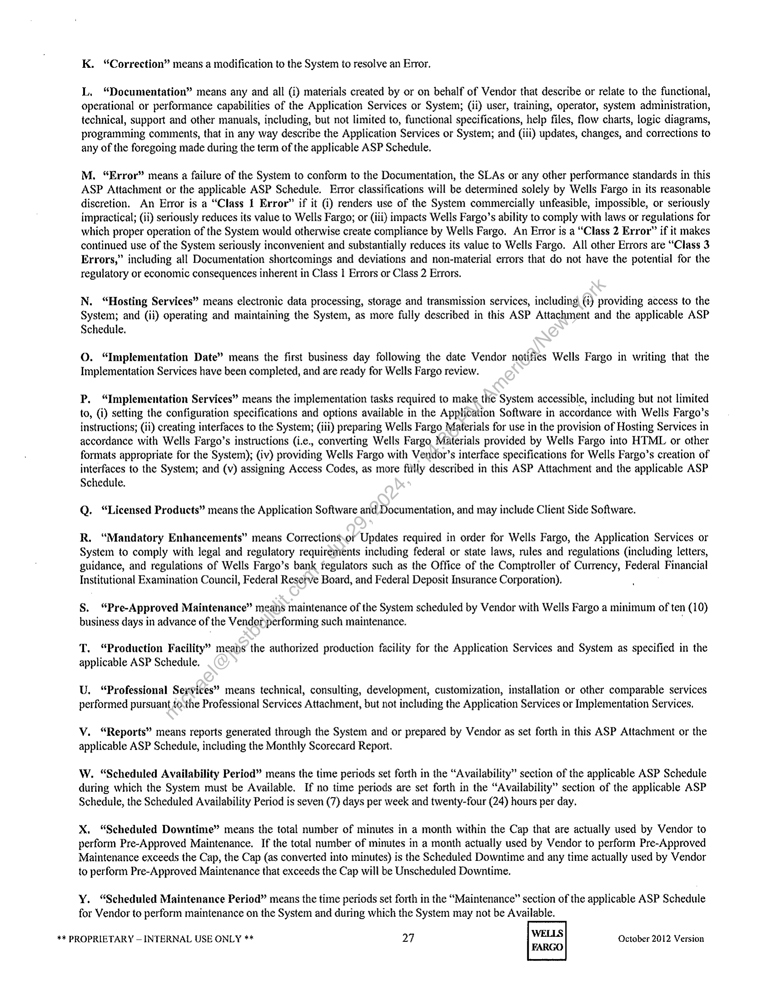
```
```col-md
K. “Correction” means a modification to the System to resolve an Error.
L. “Documentation” means any and all (i) materials created by or on behalf of Vendor that describe or relate to the functional,
operational or performance capabilities of the Application Services or System; (ii) user, training, operator, system administration,
technical, support and other manuals, including, but not limited to, functional specifications, help files, flow charts, logic diagrams,
programming comments, that in any way describe the Application Services or System; and (iii) updates, changes, and corrections to
any of the foregoing made during the term of the applicable ASP Schedule.
M. “Error” means a failure of the System to conform to the Documentation, the SLAs or any other performance standards in this
ASP Attachment or the applicable ASP Schedule. Error classifications will be determined solely by Wells Fargo in its reasonable
discretion. An Error is a “Class 1 Error” if it (i) renders use of the System commercially unfeasible, impossible, or seriously
impractical; (ii) seriously reduces its value to Wells Fargo; or (iii) impacts Wells Fargo’s ability to comply with laws or regulations for
which proper operation of the System would otherwise create compliance by Wells Fargo. An Error is a “Class 2 Error” if it makes
continued use of the System seriously inconvenient and substantially reduces its value to Wells Fargo. All other Errors are “Class 3
Errors,” including all Documentation shortcomings and deviations and non-material errors that do not have the potential for the
regulatory or economic consequences inherent in Class 1 Errors or Class 2 Errors.
N. “Hosting Services” means electronic data processing, storage and transmission services, including, (i) providing access to the
System; and (ii) operating and maintaining the System, as more fully described in this ASP Attachment and the applicable ASP
Schedule.
O. “Implementation Date” means the first business day following the date Vendor notifies Wells Fargo in writing that the
Implementation Services have been completed, and are ready for Wells Fargo review.
P. “Implementation Services” means the implementation tasks required to make the System accessible, including but not limited
to, (i) setting the configuration specifications and options available in the Application Software in accordance with Wells Fargo’s
instructions; (ii) creating interfaces to the System; (iii) preparing Wells Fargo Materials for use in the provision of Hosting Services in
accordance with Wells Fargo’s instructions (i.e., converting Wells Fargo Materials provided by Wells Fargo into HTML or other
formats appropriate for the System); (iv) providing Wells Fargo with Vendor’s interface specifications for Wells Fargo’s creation of
interfaces to the System; and (v) assigning Access Codes, as more fillly described in this ASP Attachment and the applicable ASP
Schedule.
Q. “Licensed Products” means the Application Software and Documentation, and may include Client Side Software.
R. “Mandatory Enhancements” means Corrections.or Updates required in order for Wells Fargo, the Application Services or
System to comply with legal and regulatory requirements including federal or state laws, rules and regulations (including letters,
guidance, and regulations of Wells Fargo’s bank regulators such as the Office of the Comptroller of Currency, Federal Financial
Institutional Examination Council, Federal Reserve Board, and Federal Deposit Insurance Corporation).
S. “Pre-Approved Maintenance” means maintenance of the System scheduled by Vendor with Wells Fargo a minimum of ten (10)
business days in advance of the Vendorperforming such maintenance.
T. “Production Facility’ means the authorized production facility for the Application Services and System as specified in the
applicable ASP Schedule.
U. “Professional Services” means technical, consulting, development, customization, installation or other comparable services
performed pursuant tothe Professional Services Attachment, but not including the Application Services or Implementation Services.
¥. “Reports” means reports generated through the System and or prepared by Vendor as set forth in this ASP Attachment or the
applicable ASP Schedule, including the Monthly Scorecard Report.
W. “Scheduled Availability Period” means the time periods set forth in the “Availability” section of the applicable ASP Schedule
during which the System must be Available. If no time periods are set forth in the “Availability” section of the applicable ASP
Schedule, the Scheduled Availability Period is seven (7) days per week and twenty-four (24) hours per day.
X. “Scheduled Downtime” means the total number of minutes in a month within the Cap that are actually used by Vendor to
perform Pre-Approved Maintenance. If the total number of minutes in a month actually used by Vendor to perform Pre-Approved
Maintenance exceeds the Cap, the Cap (as converted into minutes) is the Scheduled Downtime and any time actually used by Vendor
to perform Pre-Approved Maintenance that exceeds the Cap will be Unscheduled Downtime.
Y. “Scheduled Maintenance Period” means the time periods set forth in the “Maintenance” section of the applicable ASP Schedule
for Vendor to perform maintenance on the System and during which the System may not be Available.
** PROPRIETARY — INTERNAL USE ONLY ** 27 October 2012 Version
```
````
Notes:
````col
```col-md
flexGrow=.5
===
> [!info] [Page 28](_attachments/images_WF-3.6.1.15.1.3WellsFargo-MasterAgreement7.05.2013.pdf_210124/page_28.png)
> 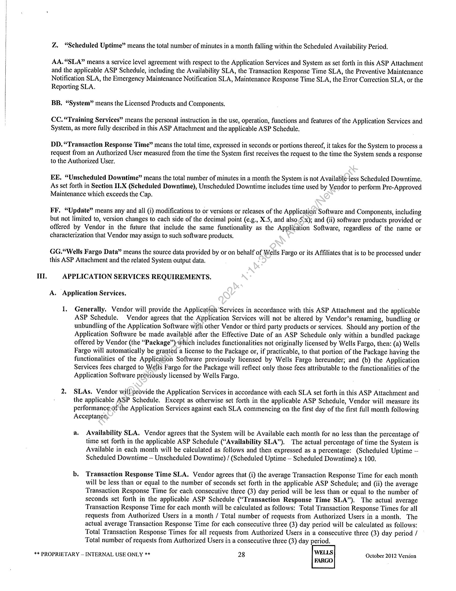
```
```col-md
In,
Z. “Scheduled Uptime” means the total number of minutes in a month falling within the Scheduled Availability Period.
AA, “SLA” means a service level agreement with respect to the Application Services and System as set forth in this ASP Attachment
and the applicable ASP Schedule, including the Availability SLA, the Transaction Response Time SLA, the Preventive Maintenance
Notification SLA, the Emergency Maintenance Notification SLA, Maintenance Response Time SLA, the Error Correction SLA, or the
Reporting SLA.
BB. “System” means the Licensed Products and Components.
CC. “Training Services” means the personal instruction in the use, operation, functions and features of the Application Services and
System, as more fully described in this ASP Attachment and the applicable ASP Schedule.
DD. “Transaction Response Time” means the total time, expressed in seconds or portions thereof, it takes for the System to process a
request from an Authorized User measured from the time the System first receives the request to the time the System sends a response
to the Authorized User.
EE. “Unscheduled Downtime” means the total number of minutes in a month the System is not Available less Scheduled Downtime.
As set forth in Section II.X (Scheduled Downtime), Unscheduled Downtime includes time used by Vendor to perform Pre-Approved
Maintenance which exceeds the Cap.
FF, “Update” means any and all (i) modifications to or versions or releases of the Application’ Software and Components, including
but not limited to, version changes to each side of the decimal point (e.g., X.5, and also 5,x); and (ii) software products provided or
offered by Vendor in the future that include the same functionality as the Application Software, regardless of the name or
characterization that Vendor may assign to such software products.
GG.“Wells Fargo Data” means the source data provided by or on behalf of Weils Fargo or its Affiliates that is to be processed under
this ASP Attachment and the related System output data.
APPLICATION SERVICES REQUIREMENTS.
A. Application Services.
1, Generally. Vendor will provide the Application Services in accordance with this ASP Attachment and the applicable
ASP Schedule. Vendor agrees that the Application Services will not be altered by Vendor’s renaming, bundling or
unbundling of the Application Software with other Vendor or third party products or services. Should any portion of the
Application Software be made available after the Effective Date of an ASP Schedule only within a bundled package
offered by Vendor (the “Package”) which includes functionalities not originally licensed by Wells Fargo, then: (a) Wells
Fargo will automatically be granted a license to the Package or, if practicable, to that portion of the Package having the
functionalities of the Application Software previously licensed by Wells Fargo hereunder; and (b) the Application
Services fees charged to Wells Fargo for the Package will reflect only those fees attributable to the functionalities of the
Application Software préviously licensed by Wells Fargo.
2. SLAs, Vendor wilbprovide the Application Services in accordance with each SLA set forth in this ASP Attachment and
the applicable ASP Schedule. Except as otherwise set forth in the applicable ASP Schedule, Vendor will measure its
performance.of the Application Services against each SLA commencing on the first day of the first full month following
Acceptanoé.
a, Availability SLA, Vendor agrees that the System will be Available each month for no less than the percentage of
time set forth in the applicable ASP Schedule (‘Availability SLA”). The actual percentage of time the System is
Available in each month will be calculated as follows and then expressed as a percentage: (Scheduled Uptime —
Scheduled Downtime — Unscheduled Downtime) / (Scheduled Uptime — Scheduled Downtime) x 100.
b. Transaction Response Time SLA. Vendor agrees that (i) the average Transaction Response Time for each month
will be less than or equal to the number of seconds set forth in the applicable ASP Schedule; and (ii) the average
Transaction Response Time for each consecutive three (3) day period will be less than or equal to the number of
seconds set forth in the applicable ASP Schedule (“Transaction Response Time SLA”). The actual average
Transaction Response Time for each month will be calculated as follows: Total Transaction Response Times for all
requests from Authorized Users in a month / Total number of requests from Authorized Users in a month. The
actual average Transaction Response Time for each consecutive three (3) day period will be calculated as follows:
Total Transaction Response Times for all requests from Authorized Users in a consecutive three (3) day period /
Total number of requests from Authorized Users in a consecutive three (3) day period.
+* PROPRIETARY — INTERNAL USE ONLY ** 28 WELLS October 2012 Version
FARGO
```
````
Notes:
````col
```col-md
flexGrow=.5
===
> [!info] [Page 29](_attachments/images_WF-3.6.1.15.1.3WellsFargo-MasterAgreement7.05.2013.pdf_210124/page_29.png)
> 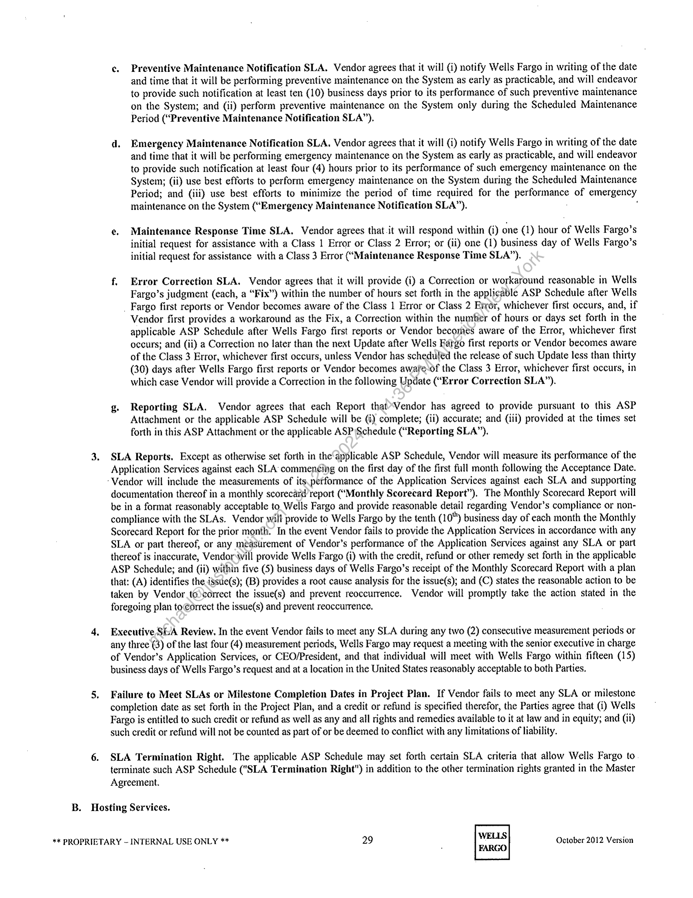
```
```col-md
c. Preventive Maintenance Notification SLA. Vendor agrees that it will (i) notify Wells Fargo in writing of the date
and time that it will be performing preventive maintenance on the System as early as practicable, and will endeavor
to provide such notification at least ten (10) business days prior to its performance of such preventive maintenance
on the System; and (ii) perform preventive maintenance on the System only during the Scheduled Maintenance
Period (“Preventive Maintenance Notification SLA”).
d. Emergency Maintenance Notification SLA. Vendor agrees that it will (i) notify Wells Fargo in writing of the date
and time that it will be performing emergency maintenance on the System as early as practicable, and will endeavor
to provide such notification at least four (4) hours prior to its performance of such emergency maintenance on the
System; (ii) use best efforts to perform emergency maintenance on the System during the Scheduled Maintenance
Period; and (iii) use best efforts to minimize the period of time required for the performance of emergency
maintenance on the System (“Emergency Maintenance Notification SLA”).
e. Maintenance Response Time SLA. Vendor agrees that-it will respond within (i) one (1) hour of Wells Fargo’s
initial request for assistance with a Class 1 Error or Class 2 Error; or (ii) one (1) business day of Wells Fargo’s
initial request for assistance with a Class 3 Error (“Maintenance Response Time SLA”).
f. Error Correction SLA. Vendor agrees that it will provide (i) a Correction or workaround reasonable in Wells
Fargo’s judgment (each, a “Fix”) within the number of hours set forth in the applicable ASP Schedule after Wells
Fargo first reports or Vendor becomes aware of the Class 1 Error or Class 2 Error, whichever first occurs, and, if
Vendor first provides a workaround as the Fix, a Correction within the number of hours or days set forth in the
applicable ASP Schedule after Wells Fargo first reports or Vendor becomes aware of the Error, whichever first
occurs; and (ii) a Correction no later than the next Update after Wells Fargo first reports or Vendor becomes aware
of the Class 3 Error, whichever first occurs, unless Vendor has scheduled the release of such Update less than thirty
(30) days after Wells Fargo first reports or Vendor becomes awafe.of the Class 3 Error, whichever first occurs, in
which case Vendor will provide a Correction in the following Update (“Error Correction SLA”).
g. Reporting SLA. Vendor agrees that each Report that*Vendor has agreed to provide pursuant to this ASP
Attachment or the applicable ASP Schedule will be (i) complete; (ii) accurate; and (iii) provided at the times set
forth in this ASP Attachment or the applicable ASP Schedule (“Reporting SLA”).
3. SLA Reports. Except as otherwise set forth in the‘applicable ASP Schedule, Vendor will measure its performance of the
Application Services against each SLA: commenéing on the first day of the first full month following the Acceptance Date.
‘Vendor will include the measurements of its.performance of the Application Services against each SLA and supporting
documentation thereof in a monthly scorecard’report (‘Monthly Scorecard Report”). The Monthly Scorecard Report will
be in a format reasonably acceptable to Wells Fargo and provide reasonable detail regarding Vendor’s compliance or noncompliance with the SLAs. Vendor will provide to Wells Fargo by the tenth (10") business day of each month the Monthly
Scorecard Report for the prior month: In the event Vendor fails to provide the Application Services in accordance with any
SLA or part thereof, or any measurement of Vendor’s performance of the Application Services against any SLA or part
thereof is inaccurate, Vendor vill provide Wells Fargo (i) with the credit, refund or other remedy set forth in the applicable
ASP Schedule; and (ii) within five (5) business days of Wells Fargo’s receipt of the Monthly Scorecard Report with a plan
that: (A) identifies the issue(s); (B) provides a root cause analysis for the issue(s); and (C) states the reasonable action to be
taken by Vendor to)correct the issue(s) and prevent reoccurrence. Vendor will promptly take the action stated in the
foregoing plan toCorrect the issue(s) and prevent reoccurrence.
4, Executive SGA Review. In the event Vendor fails to meet any SLA during any two (2) consecutive measurement periods or
any three (3) of the last four (4) measurement periods, Wells Fargo may request a meeting with the senior executive in charge
of Vendor’s Application Services, or CEO/President, and that individual will meet with Wells Fargo within fifteen (15)
business days of Wells Fargo’s request and at a location in the United States reasonably acceptable to both Parties.
5. Failure to Meet SLAs or Milestone Completion Dates in Project Plan. If Vendor fails to meet any SLA or milestone
completion date as set forth in the Project Plan, and a credit or refund is specified therefor, the Parties agree that (i) Wells
Fargo is entitled to such credit or refund as well as any and all rights and remedies available to it at Jaw and in equity; and (ii)
such credit or refund will not be counted as part of or be deemed to conflict with any limitations of liability.
6. SLA Termination Right. The applicable ASP Schedule may set forth certain SLA criteria that allow Wells Fargo to
terminate such ASP Schedule ("SLA Termination Right") in addition to the other termination rights granted in the Master
Agreement.
B. Hosting Services.
** PROPRIETARY ~ INTERNAL USE ONLY ** 29 October 2012 Version
```
````
Notes:
````col
```col-md
flexGrow=.5
===
> [!info] [Page 30](_attachments/images_WF-3.6.1.15.1.3WellsFargo-MasterAgreement7.05.2013.pdf_210124/page_30.png)
> 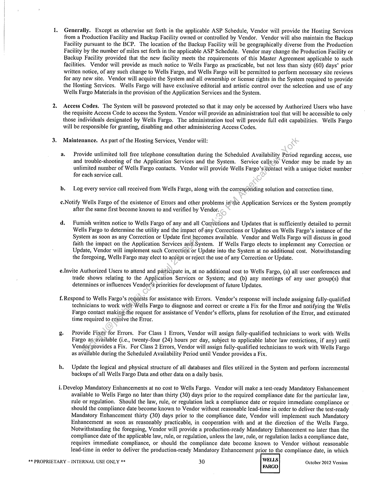
```
```col-md
1.
** PROPRIETARY — INTERNAL USE ONLY ** 30
Generally. Except as otherwise set forth in the applicable ASP Schedule, Vendor will provide the Hosting Services
from a Production Facility and Backup Facility owned or controlled by Vendor. Vendor will also maintain the Backup
Facility pursuant to the BCP. The location of the Backup Facility will be geographically diverse from the Production
Facility by the number of miles set forth in the applicable ASP Schedule. Vendor may change the Production Facility or
Backup Facility provided that the new facility meets the requirements of this Master Agreement applicable to such
facilities. Vendor will provide as much notice to Wells Fargo as practicable, but not less than sixty (60) days’ prior
written notice, of any such change to Wells Fargo, and Wells Fargo will be permitted to perform necessary site reviews
for any new site. Vendor will acquire the System and all ownership or license rights in the System required to provide
the Hosting Services, Wells Fargo will have exclusive editorial and artistic control over the selection and use of any
Wells Fargo Materials in the provision of the Application Services and the System.
Access Codes, The System will be password protected so that it may only be accessed by Authorized Users who have
the requisite Access Code to access the System. Vendor will provide an administration tool that will be accessible to only
those individuals designated by Wells Fargo. The administration tool will provide full edit capabilities. Wells Fargo
will be responsible for granting, disabling and other administering Access Codes.
Maintenance. As part of the Hosting Services, Vendor will:
a, Provide unlimited toll free telephone consultation during the Scheduled Availability Period regarding access, use
and trouble-shooting of the Application Services and the System. Service calls;te Vendor may be made by an
unlimited number of Wells Fargo contacts. Vendor will provide Wells Fargo’s‘contact with a unique ticket number
for each service call.
b. Log every service call received from Wells Fargo, along with the corresponding solution and correction time,
eNotify Wells Fargo of the existence of Errors and other problems inthe Application Services or the System promptly
after the same first become known to and verified by Vendor.
a, Furnish written notice to Wells Fargo of any and all Correetions and Updates that is sufficiently detailed to permit
Wells Fargo to determine the utility and the impact ofany Corrections or Updates on Wells Fargo’s instance of the
System as soon as any Correction or Update first becomes available. Vendor and Wells Fargo will discuss in good
faith the impact on the Application Services and System. If Wells Fargo elects to implement any Correction or
Update, Vendor will implement such Correction or Update into the System at no additional cost. Notwithstanding
the foregoing, Wells Fargo may elect to acéépt or reject the use of any Correction or Update.
e.Invite Authorized Users to attend and participate in, at no additional cost to Wells Fargo, (a) all user conferences and
trade shows relating to the Application Services or System; and (b) any meetings of any user group(s) that
determines or influences Vendor's priorities for development of future Updates.
f, Respond to Wells Fargo’s requests for assistance with Errors. Vendor’s response will include assigning fully-qualified
technicians to work with Wells Fargo to diagnose and correct or create a Fix for the Error and notifying the Wells
Fargo contact makingsthe request for assistance of Vendor’s efforts, plans for resolution of the Error, and estimated
time required to resolve the Error.
g. Provide Fixes*for Errors. For Class 1 Errors, Vendor will assign fully-qualified technicians to work with Wells
Fargo ascavailable (i.e., twenty-four (24) hours per day, subject to applicable labor law restrictions, if any) until
Vendorprovides a Fix, For Class 2 Errors, Vendor will assign fully-qualified technicians to work with Wells Fargo
as available during the Scheduled Availability Period until Vendor provides a Fix.
h. Update the logical and physical structure of all databases and files utilized in the System and perform incremental
backups of all Wells Fargo Data and other data on a daily basis.
i, Develop Mandatory Enhancements at no cost to Wells Fargo. Vendor will make a test-ready Mandatory Enhancement
available to Wells Fargo no later than thirty (30) days prior to the required compliance date for the particular law,
rule or regulation. Should the law, rule, or regulation lack a compliance date or require immediate compliance or
should the compliance date become known to Vendor without reasonable lead-time in order to deliver the test-ready
Mandatory Enhancement thirty (30) days prior to the compliance date, Vendor will implement such Mandatory
Enhancement as soon as reasonably practicable, in cooperation with and at the direction of the Wells Fargo.
Notwithstanding the foregoing, Vendor will provide a production-ready Mandatory Enhancement no later than the
compliance date of the applicable law, rule, or regulation, unless the law, rule, or regulation lacks a compliance date,
requires immediate compliance, or should the compliance date become known to Vendor without reasonable
lead-time in order to deliver the production-ready Mandatory Enhancement prior to the compliance date, in which
October 2012 Version
```
````
Notes:
````col
```col-md
flexGrow=.5
===
> [!info] [Page 31](_attachments/images_WF-3.6.1.15.1.3WellsFargo-MasterAgreement7.05.2013.pdf_210124/page_31.png)
> 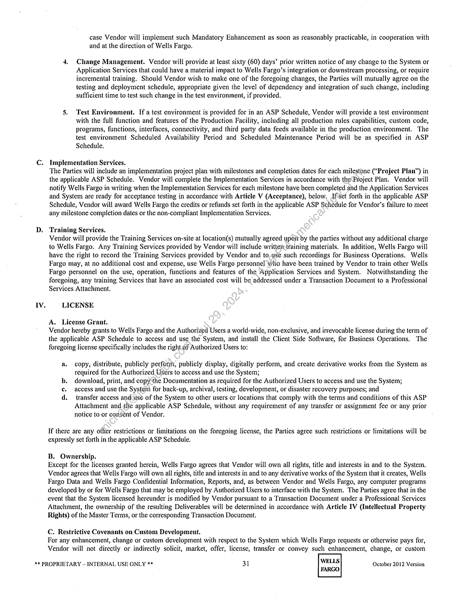
```
```col-md
Cc,
IV,
case Vendor will implement such Mandatory Enhancement as soon as reasonably practicable, in cooperation with
and at the direction of Wells Fargo.
4. Change Management. Vendor will provide at least sixty (60) days’ prior written notice of any change to the System or
Application Services that could have a material impact to Wells Fargo’s integration or downstream processing, or require
incremental training. Should Vendor wish to make one of the foregoing changes, the Parties will mutually agree on the
testing and deployment schedule, appropriate given the level of dependency and integration of such change, including
sufficient time to test such change in the test environment, if provided.
5. Test Environment. Ifa test environment is provided for in an ASP Schedule, Vendor will provide a test environment
with the full function and features of the Production Facility, including all production rules capabilities, custom code,
programs, functions, interfaces, connectivity, and third party data feeds available in the production environment. The
test environment Scheduled Availability Period and Scheduled Maintenance Period will be as specified in ASP
Schedule.
Implementation Services.
The Parties will include an implementation project plan with milestones and completion dates for each milestone (“Project Plan”) in
the applicable ASP Schedule. Vendor will complete the Implementation Services in accordance with the Project Plan. Vendor will
notify Wells Fargo in writing when the Implementation Services for each milestone have been completed and the Application Services
and System are ready for acceptance testing in accordance with Article V (Acceptance), below. IfSet forth in the applicable ASP
Schedule, Vendor will award Wells Fargo the credits or refunds set forth in the applicable ASP Schedule for Vendor’s failure to meet
any milestone completion dates or the non-compliant Implementation Services.
Training Services,
Vendor will provide the Training Services on-site at location(s) mutually agreed upeir by the parties without any additional charge
to Wells Fargo. Any Training Services provided by Vendor will include writtentraining materials. In addition, Wells Fargo will
have the right to record the Training Services provided by Vendor and to-use such recordings for Business Operations. Wells
Fargo may, at no additional cost and expense, use Wells Fargo personnel \yho have been trained by Vendor to train other Wells
Fargo personnel on the use, operation, functions and features of the Application Services and System. Notwithstanding the
foregoing, any training Services that have an associated cost will be addressed under a Transaction Document to a Professional
Services Attachment.
LICENSE
A. License Grant.
Vendor hereby grants to Wells Fargo and the Authorized Users a world-wide, non-exclusive, and irrevocable license during the term of
the applicable ASP Schedule to access and use the System, and install the Client Side Software, for Business Operations, The
foregoing license specifically includes the right.of Authorized Users to:
a. copy, distribute, publicly perform, publicly display, digitally perform, and create derivative works from the System as
required for the Authorized Users to access and use the System;
b, download, print, and copy the Documentation as required for the Authorized Users to access and use the System;
access and use the System for back-up, archival, testing, development, or disaster recovery purposes; and
d. transfer access andcise of the System to other users or locations that comply with the terms and conditions of this ASP
Attachment and (he applicable ASP Schedule, without any requirement of any transfer or assignment fee or any prior
notice to or consént of Vendor.
bd
If there are any other restrictions or limitations on the foregoing license, the Parties agree such restrictions or limitations will be
expressly set forth in the applicable ASP Schedule.
B. Ownership.
Except for the licenses granted herein, Wells Fargo agrees that Vendor will own all rights, title and interests in and to the System.
Vendor agrees that Wells Fargo will own all rights, title and interests in and to any derivative works of the System that it creates, Wells
Fargo Data and Wells Fargo Confidential Information, Reports, and, as between Vendor and Wells Fargo, any computer programs
developed by or for Wells Fargo that may be employed by Authorized Users to interface with the System. The Parties agree that in the
event that the System licensed hereunder is modified by Vendor pursuant to a Transaction Document under a Professional Services
Attachment, the ownership of the resulting Deliverables will be determined in accordance with Article IV (Intellectual Property
Rights) of the Master Terms, or the corresponding Transaction Document.
C, Restrictive Covenants on Custom Development.
For any enhancement, change or custom development with respect to the System which Wells Fargo requests or otherwise pays for,
Vendor will not directly or indirectly solicit, market, offer, license, transfer or convey such enhancement, change, or custom
** PROPRIETARY — INTERNAL USE ONLY ** 31 October 2012 Version
```
````
Notes:
````col
```col-md
flexGrow=.5
===
> [!info] [Page 32](_attachments/images_WF-3.6.1.15.1.3WellsFargo-MasterAgreement7.05.2013.pdf_210124/page_32.png)
> 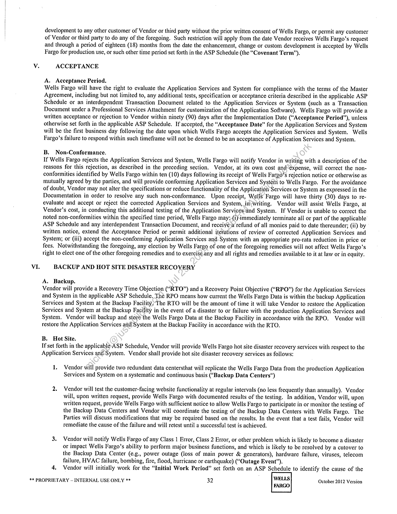
```
```col-md
VI.
** PROPRIETARY — INTERNAL USE ONLY ** 32
development to any other customer of Vendor or third party without the prior written consent of Wells Fargo, or permit any customer
of Vendor or third party to do any of the foregoing. Such restriction will apply from the date Vendor receives Wells Fargo’s request
and through a period of eighteen (18) months from the date the enhancement, change or custom development is accepted by Wells
Fargo for production use, or such other time period set forth in the ASP Schedule (the “Covenant Term’).
ACCEPTANCE
A. Acceptance Period.
Wells Fargo will have the right to evaluate the Application Services and System for compliance with the terms of the Master
Agreement, including but not limited to, any additional tests, specification or acceptance criteria described in the applicable ASP
Schedule or an interdependent Transaction Document related to the Application Services or System (such as a Transaction
Document under a Professional Services Attachment for customization of the Application Software). Wells Fargo will provide a
written acceptance or rejection to Vendor within ninety (90) days after the Implementation Date (“Acceptance Period”), unless
otherwise set forth in the applicable ASP Schedule. If accepted, the “Acceptance Date” for the Application Services and System
will be the first business day following the date upon which Wells Fargo accepts the Application Services and System. Wells
Fargo’s failure to respond within such timeframe will not be deemed to be an acceptance of Application Services and System.
B. Non-Conformance.
If Wells Fargo rejects the Application Services and System, Wells Fargo will notify Vendor in writing with a description of the
reasons for this rejection, as described in the preceding section. Vendor, at its own cost and expense, will correct the nonconformities identified by Wells Fargo within ten (10) days following its receipt of Wells Fargo’s rejection notice or otherwise as
mutually agreed by the parties, and will provide conforming Application Services and Systéini to Wells Fargo. For the avoidance
of doubt, Vendor may not alter the specifications or reduce functionality of the Application Services or System as expressed in the
Documentation in order to resolve any such non-conformance. Upon receipt, Wells Fargo will have thirty (30) days to reevaluate and accept or reject the corrected Application Services and System, inviting. Vendor will assist Wells Fargo, at
Vendor’s cost, in conducting this additional testing of the Application Services‘and System. If Vendor is unable to correct the
noted non-conformities within the specified time period, Wells Fargo may:-(i):immediately terminate all or part of the applicable’
ASP Schedule and any interdependent Transaction Document, and receivé)a refund of all monies paid to date thereunder; (ii) by
written notice, extend the Acceptance Period or permit additional iterations of review of corrected Application Services and
System; or (iii) accept the non-conforming Application Services and-System with an appropriate pro-rata reduction in price or
fees. Notwithstanding the foregoing, any election by Wells Fargo of one of the foregoing remedies will not affect Wells Fargo’s
right to elect one of the other foregoing remedies and to exercis¢ any and all rights and remedies available to it at law or in equity.
BACKUP AND HOT SITE DISASTER RECOVERY
A. Backup.
Vendor will provide a Recovery Time Objection (“RTO”) and a Recovery Point Objective (“RPO”) for the Application Services
and System in the applicable ASP Schedule, The RPO means how current the Wells Fargo Data is within the backup Application
Services and System at the Backup Facility The RTO will be the amount of time it will take Vendor to restore the Application
Services and System at the Backup Facility in the event of a disaster to or failure with the production Application Services and
System. Vendor will backup and store the Wells Fargo Data at the Backup Facility in accordance with the RPO. Vendor will
restore the Application Services and)System at the Backup Facility in accordance with the RTO.
B. Hot Site.
If set forth in the applicable ASP Schedule, Vendor will provide Wells Fargo hot site disaster recovery services with respect to the
Application Services and/System. Vendor shall provide hot site disaster recovery services as follows:
1. Vendor will provide two redundant data centersthat will replicate the Wells Fargo Data from the production Application
Services and System on a systematic and continuous basis ("Backup Data Centers")
2. Vendor will test the customer-facing website functionality at regular intervals (no less frequently than annually). Vendor
will, upon written request, provide Wells Fargo with documented results of the testing. In addition, Vendor will, upon
written request, provide Wells Fargo with sufficient notice to allow Wells Fargo to participate in or monitor the testing of
the Backup Data Centers and Vendor will coordinate the testing of the Backup Data Centers with Wells Fargo. The
Parties will discuss modifications that may be required based on the results. In the event that a test fails, Vendor will
remediate the cause of the failure and will retest until a successful test is achieved.
3. Vendor will notify Wells Fargo of any Class 1 Error, Class 2 Error, or other problem which is likely to become a disaster
or impact Wells Fargo’s ability to perform major business functions, and which is likely to be resolved by a cutover to
the Backup Data Center (e.g., power outage (loss of main power & generators), hardware failure, viruses, telecom
failure, HVAC failure, bombing, fire, flood, hurricane or earthquake) (“Outage Event”).
4. Vendor will initially work for the “Initial Work Period” set forth on an ASP Schedule to identify the cause of the
October 2012 Version
```
````
Notes:
````col
```col-md
flexGrow=.5
===
> [!info] [Page 33](_attachments/images_WF-3.6.1.15.1.3WellsFargo-MasterAgreement7.05.2013.pdf_210124/page_33.png)
> 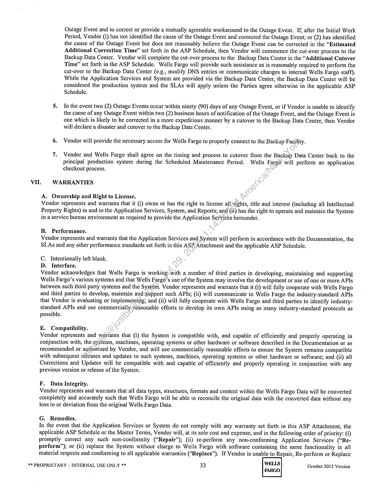
```
```col-md
Outage Event and to correct or provide a mutually agreeable workaround to the Outage Event. If, after the Initial Work
Period, Vendor (i) has not identified the cause of the Outage Event and corrected the Outage Event; or (2) has identified
the cause of the Outage Evenit but does not reasonably believe the Outage Event can be corrected in the “Estimated
Additional Correction Time” set forth in the ASP Schedule, then Vendor will commence the cut-over process to the
Backup Data Center. Vendor will complete the cut-over process to the Backup Data Center in the “Additional Cutover
Time” set forth in the ASP Schedule. Wells Fargo will provide such assistance as is reasonably required to perform the
cut-over to the Backup Data Center (e.g., modify DNS entries or communicate changes to internal Wells Fargo staff),
While the Application Services and System are provided via the Backup Data Center, the Backup Data Center will be
considered the production system and the SLAs will apply unless the Parties agree otherwise in the applicable ASP
Schedule.
5. In the event two (2) Outage Events occur within ninety (90) days of any Outage Event, or if Vendor is unable to identify
the cause of any Outage Event within two (2) business hours of notification of the Outage Event, and the Outage Event is
one which is likely to be corrected in a more expeditious manner by a cutover to the Backup Data Center, then Vendor
will declare a disaster and cutover to the Backup Data Center.
6. Vendor will provide the necessary access for Wells Fargo to properly connect to the Backup Facility.
7. Vendor and Wells Fargo shall agree on the timing and process to cutover from the Backup Data Center back to the
principal production system during the Scheduled Maintenance Period. Wells Fargo will perform an application
checkout process.
VU. WARRANTIES
A. Ownership and Right to License.
Vendor represents and warrants that it (i) owns or has the right to license allsrights, title and interest (including all Intellectual
Property Rights) in and to the Application Services, System, and Reports; and (ii) has the right to operate and maintain the System
in a service bureau environment as required to provide the Application Sefvices hereunder.
B. Performance. .
Vendor represents and warrants that the Application Services and. System will perform in accordance with the Documentation, the
SLAs and any other performance standards set forth in this ASP/Attachment and the applicable ASP Schedule.
C. Intentionally left blank.
D. Interface.
Vendor acknowledges that Wells Fargo is working-with a number of third parties in developing, maintaining and supporting
Wells Fargo’s various systems and that Wells Fargo’s use of the System may involve the development or use of one or more APIs
between such third party systems and the System. Vendor represents and warrants that it (i) will fully cooperate with Wells Fargo
and third parties to develop, maintain and Smpport such APIs; (ii) will communicate to Wells Fargo the industry-standard APIs
that Vendor is evaluating or implementing; and (ii) will fully cooperate with Wells Fargo and third parties to identify industrystandard APIs and use commerciallysreasonable efforts to develop its own APIs using as many industry-standard protocols as
possible.
E. Compatibility.
Vendor represents and wairants that (i) the System is compatible with, and capable of efficiently and properly operating in
conjunction with, the.systems, machines, operating systems or other hardware or software described in the Documentation or as
recommended or authorized by Vendor, and will use commercially reasonable efforts to ensure the System remains compatible
with subsequent releases and updates to such systems, machines, operating systems or other hardware or software; and (ii) all
Corrections and Updates will be compatible with and capable of efficiently and properly operating in conjunction with any
previous version or release of the System.
F, Data Integrity.
Vendor represents and warrants that all data types, structures, formats and content within the Wells Fargo Data will be converted
completely and accurately such that Wells Fargo will be able to reconcile the original data with the converted data without any
loss to or deviation from the original Wells Fargo Data. :
G. Remedies.
In the event that the Application Services or System do not comply with any warranty set forth in this ASP Attachment, the
applicable ASP Schedule or the Master Terms, Vendor will, at its sole cost and expense, and in the following order of priority: (i)
promptly correct any such non-conformity (“Repair”); (ii) re-perform any non-conforming Application Services (“Reperform”); or (ii) replace the System without charge to Wells Fargo with software containing the same functionality in all
material respects and conforming to all applicable warranties (“Replace”). If Vendor is unable to Repair, Re-perform or Replace
** PROPRIETARY ~ INTERNAL USE ONLY ** 33 October 2012 Version
```
````
Notes:
````col
```col-md
flexGrow=.5
===
> [!info] [Page 34](_attachments/images_WF-3.6.1.15.1.3WellsFargo-MasterAgreement7.05.2013.pdf_210124/page_34.png)
> 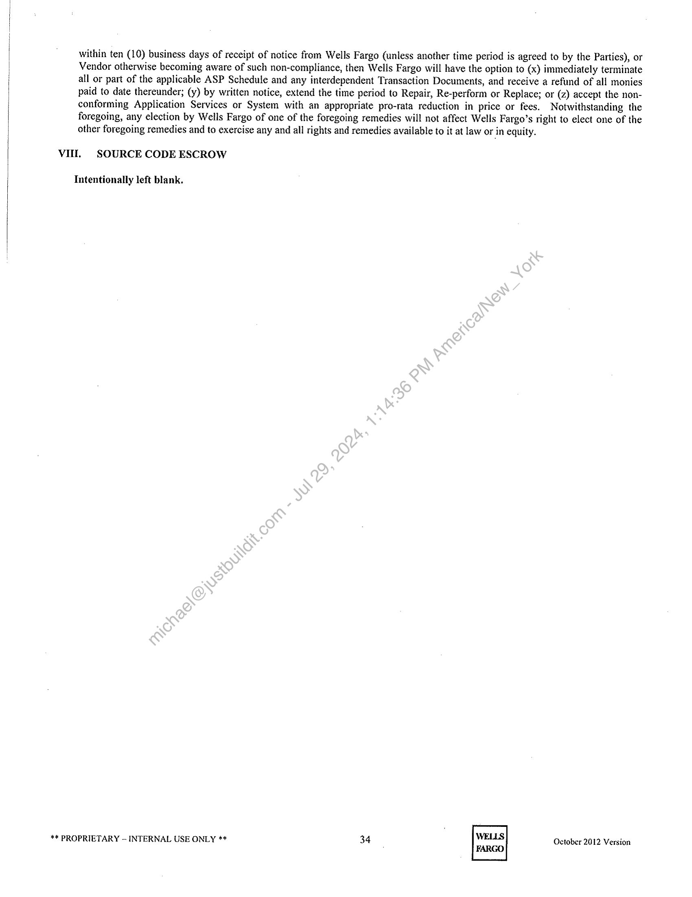
```
```col-md
/ within ten (10) business days of receipt of notice from Wells Fargo (unless another time period is agreed to by the Parties), or
Vendor otherwise becoming aware of such non-compliance, then Wells Fargo will have the option to (x) immediately terminate
all or part of the applicable ASP Schedule and any interdependent Transaction Documents, and receive a refund of all monies
| paid to date thereunder; (y) by written notice, extend the time period to Repair, Re-perform or Replace; or (z) accept the nonconforming Application Services or System with an appropriate pro-rata reduction in price or fees. Notwithstanding the
foregoing, any election by Wells Fargo of one of the foregoing remedies will not affect Wells Fargo’s right to elect one of the
other foregoing remedies and to exercise any and all rights and remedies available to it at law or in equity.
| VIL. SOURCE CODE ESCROW
Intentionally left blank.
** PROPRIETARY — INTERNAL USE ONLY ** 34 October 2012 Version
```
````
Notes:
````col
```col-md
flexGrow=.5
===
> [!info] [Page 35](_attachments/images_WF-3.6.1.15.1.3WellsFargo-MasterAgreement7.05.2013.pdf_210124/page_35.png)
> 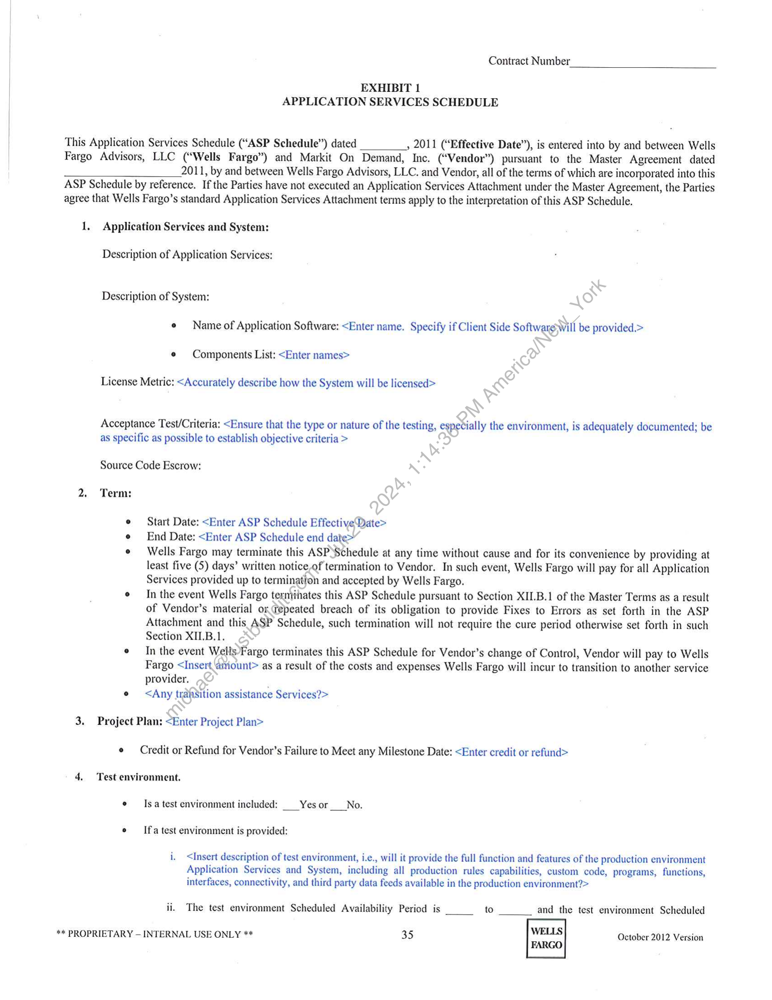
```
```col-md
Contract Number
EXHIBIT 1
APPLICATION SERVICES SCHEDULE
| This Application Services Schedule (“ASP Schedule”) dated , 2011 (“Effective Date”), is entered into by and between Wells
Fargo Advisors, LLC (“Wells Fargo”) and Markit On Demand, Inc. (“Vendor”) pursuant to the Master Agreement dated
2011, by and between Wells Fargo Advisors, LLC. and Vendor, all of the terms of which are incorporated into this
ASP Schedule by reference. If the Parties have not executed an Application Services Attachment under the Master Agreement, the Parties
agree that Wells Fargo’s standard Application Services Attachment terms apply to the interpretation of this ASP Schedule.
1. Application Services and System:
Description of Application Services:
Description of System:
e Name of Application Software: <Enter name. Specify if Client Side SoftwareWill be provided.>
e Components List: <Enter names>
License Metric: <Accurately describe how the System will be licensed>
Acceptance Test/Criteria: <Ensure that the type or nature of the testing, espetially the environment, is adequately documented; be
as specific as possible to establish objective criteria >
Source Code Escrow:
2. Term:
¢ Start Date: <Enter ASP Schedule Effective Date>
e End Date: <Enter ASP Schedule end date>
Wells Fargo may terminate this ASP)Schedule at any time without cause and for its convenience by providing at
least five (5) days’ written notice,of termination to Vendor. In such event, Wells Fargo will pay for all Application
Services provided up to termination and accepted by Wells Fargo.
e In the event Wells Fargo termihates this ASP Schedule pursuant to Section XII.B.1 of the Master Terms as a result
of Vendor’s material or (repeated breach of its obligation to provide Fixes to Errors as set forth in the ASP
Attachment and this ASP Schedule, such termination will not require the cure period otherwise set forth in such
Section XII.B.1.
° In the event Wells Fargo terminates this ASP Schedule for Vendor’s change of Control, Vendor will pay to Wells
Fargo <Insert amount> as a result of the costs and expenses Wells Fargo will incur to transition to another service
provider.
e <Any trahsition assistance Services?>
3. Project Plan: <Enter Project Plan>
¢ Credit or Refund for Vendor’s Failure to Meet any Milestone Date: <Enter credit or refund>
4. Test environment.
e Isa test environment included: __Yesor___No.
e Ifa test environment is provided:
i, <Insert description of test environment, i.e., will it provide the full function and features of the production environment
Application Services and System, including all production rules capabilities, custom code, programs, functions,
interfaces, connectivity, and third party data feeds available in the production environment?>
ii. The test environment Scheduled Availability Period is to and the test environment Scheduled
** PROPRIETARY — INTERNAL USE ONLY ** 35 beer October 2012 Version
```
````
Notes:
````col
```col-md
flexGrow=.5
===
> [!info] [Page 36](_attachments/images_WF-3.6.1.15.1.3WellsFargo-MasterAgreement7.05.2013.pdf_210124/page_36.png)
> 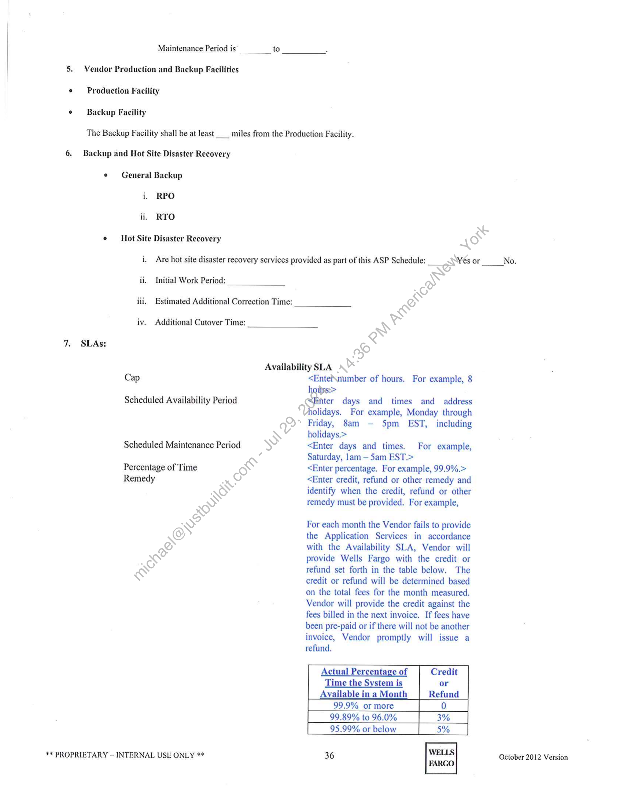
```
```col-md
Maintenance Period is’ to
5. Vendor Production and Backup Facilities
e¢ Production Facility
e ~~ Backup Facility
The Backup Facility shall be at least___ miles from the Production Facility.
6. Backup and Hot Site Disaster Recovery
e General Backup
i. RPO
ii, RTO
we \
e Hot Site Disaster Recovery AO
i. Are hot site disaster recovery services provided as part of this ASP Schedule: Yes or _
ii, Initial Work Period: AS
we
iii, Estimated Additional Correction Time: &
iv. Additional Cutover Time: ww
g
7. SLAs:
2
Availability SLA
Cap <EnteNnumber of hours. For example, 8
iess>
Scheduled Availability Period ter days and times and address
Violidays. For example, Monday through
P Friday, 8am — Spm _ EST, including
\ holidays.>
Scheduled Maintenance Period »y <Enter days and times. For example,
“ Saturday, lam — Sam EST.>
Percentage of Time Ss <Enter percentage. For example, 99.9%.>
Remedy Rw <Enter credit, refund or other remedy and
Ne} identify when the credit, refund or other
> remedy must be provided. For example,
2)
‘ s For each month the Vendor fails to provide
©» the Application Services in accordance
@ with the Availability SLA, Vendor will
we provide Wells Fargo with the credit or
& refund set forth in the table below. The
credit or refund will be determined based
on the total fees for the month measured,
Vendor will provide the credit against the
fees billed in the next invoice. If fees have
been pre-paid or if there will not be another
invoice, Vendor promptly will issue a
refund.
Actual Percentage of Credit
Time the System is or
Available in a Month Refund
99.9% or more 0
99.89% to 96.0% 3%
95.99% or below 5%
** PROPRIETARY — INTERNAL USE ONLY ** 36 MES
FARGO
October 2012 Version
```
````
Notes:
````col
```col-md
flexGrow=.5
===
> [!info] [Page 37](_attachments/images_WF-3.6.1.15.1.3WellsFargo-MasterAgreement7.05.2013.pdf_210124/page_37.png)
> 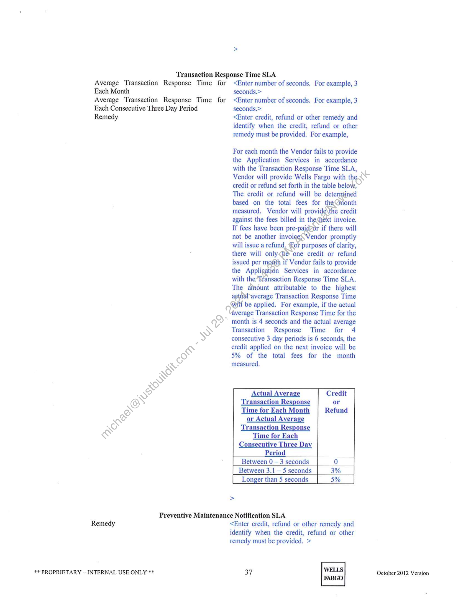
```
```col-md
Transaction Response Time SLA
Average Transaction Response Time for
Each Month
Average Transaction Response Time for
Each Consecutive Three Day Period
Remedy
<Enter number of seconds. For example, 3
seconds.>
<Enter number of seconds. For example, 3
seconds,>
<Enter credit, refund or other remedy and
identify when the credit, refund or other
remedy must be provided. For example,
For each month the Vendor fails to provide
the Application Services in accordance
with the Transaction Response Time SLA,
Vendor will provide Wells Fargo with the
credit or refund set forth in the table below,
The credit or refund will be determined
based on the total fees for the@month
measured. Vendor will provide\the credit
against the fees billed in th t invoice.
If fees have been presi if there will
not be another invousss endor promptly
will issue a refund, purposes of clarity,
there will only <b one credit or refund
issued per m, rt if Vendor fails to provide
the Appli mn Services in accordance
with the, codien Response Time SLA.
The dindunt attributable to the highest
average Transaction Response Time
be applied. For example, if the actual
Bad Transaction Response Time for the
* month is 4 seconds and the actual average
Transaction Response Time for 4
consecutive 3 day periods is 6 seconds, the
credit applied on the next invoice will be
5% of the total fees for the month
measured.
Actual Average Credit
Transaction Response or
Time for Each Month Refund
or Actual Average
Transaction Response
Time for Each
Consecutive Three Day
Period
Between 0 —3 seconds
Between 3.1 — 5 seconds
Longer than 5 seconds
>
Preventive Maintenance Notification SLA
Remedy
** PROPRIETARY — INTERNAL USE ONLY **
<Enter credit, refund or other remedy and
identify when the credit, refund or other
remedy must be provided. >
37
October 2012 Version
```
````
Notes:
````col
```col-md
flexGrow=.5
===
> [!info] [Page 38](_attachments/images_WF-3.6.1.15.1.3WellsFargo-MasterAgreement7.05.2013.pdf_210124/page_38.png)
> 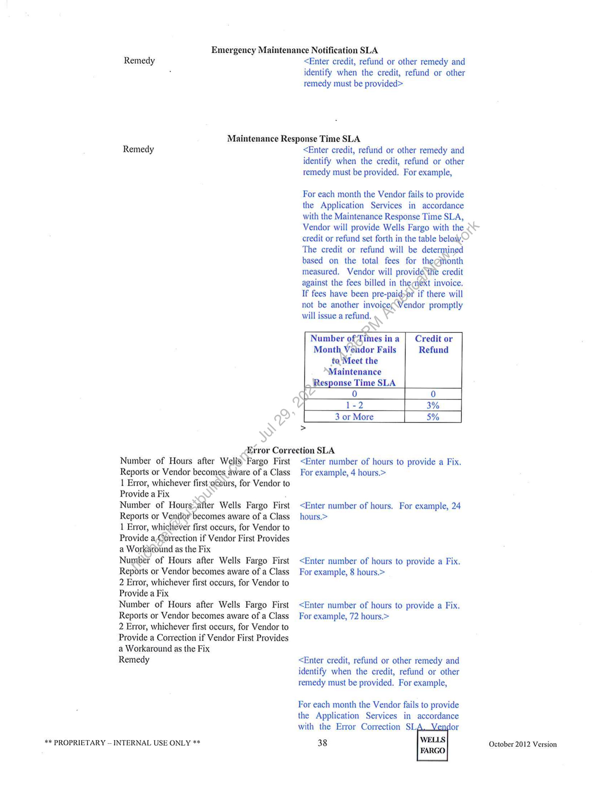
```
```col-md
Emergency Maintenance Notification SLA
Remedy
<Enter credit, refund or other remedy and
identify when the credit, refund or other
remedy must be provided>
Maintenance Response Time SLA
Remedy
<Enter credit, refund or other remedy and
identify when the credit, refund or other
remedy must be provided. For example,
For each month the Vendor fails to provide
the Application Services in accordance
with the Maintenance Response Time SLA,
Vendor will provide Wells Fargo with the &
credit or refund set forth in the table belay
The credit or refund will be determined
based on the total fees for ohnth
measured. Vendor will provides credit
against the fees billed in theqiext invoice.
If fees have been pre-pai of if there will
not be another invoi endor promptly
will issue a refund. e
Number of 1) esina | Credit or
Basi Yona Fails | Refund
to'Meet the
‘Maintenance
esponse Time SLA
rror Correction SLA
Number of Hours after W. ‘argo First
Reports or Vendor becomes aware of a Class
1 Error, whichever first rs, for Vendor to
Provide a Fix »
Number of Hour ater Wells Fargo First
Reports or Vei ecomes aware of a Class
1 Error, whi er first occurs, for Vendor to
Provide a, ection if Vendor First Provides
a Workaround as the Fix
Nugtr of Hours after Wells Fargo First
Reports or Vendor becomes aware of a Class
2 Error, whichever first occurs, for Vendor to
Provide a Fix
Number of Hours after Wells Fargo First
Reports or Vendor becomes aware of a Class
2 Error, whichever first occurs, for Vendor to
Provide a Correction if Vendor First Provides
a Workaround as the Fix
Remedy
** PROPRIETARY — INTERNAL USE ONLY **
<Enter number of hours to provide a Fix.
For example, 4 hours.>
<Enter number of hours. For example, 24
hours.>
<Enter number of hours to provide a Fix.
For example, 8 hours.>
<Enter number of hours to provide a Fix.
For example, 72 hours.>
<Enter credit, refund or other remedy and
identify when the credit, refund or other
remedy must be provided. For example,
For each month the Vendor fails to provide
the Application Services in accordance
with the Error Correction SLA ndor
38
October 2012 Version
```
````
Notes:
````col
```col-md
flexGrow=.5
===
> [!info] [Page 39](_attachments/images_WF-3.6.1.15.1.3WellsFargo-MasterAgreement7.05.2013.pdf_210124/page_39.png)
> 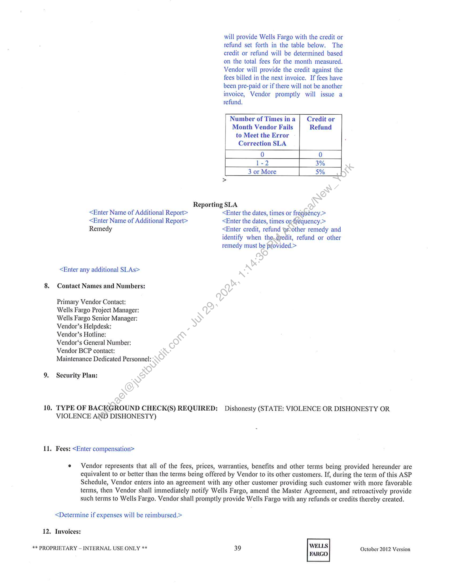
```
```col-md
will provide Wells Fargo with the credit or
refund set forth in the table below. The
credit or refund will be determined based
on the total fees for the month measured.
Vendor will provide the credit against the
fees billed in the next invoice. If fees have
been pre-paid or if there will not be another
invoice, Vendor promptly will issue a
refund,
Number of Times ina | Credit or
Month Vendor Fails Refund
to Meet the Error
Correction SLA
0 0 |
1-2 3% |
3 or More 5%
>
Reporting SLA
<Enter Name of Additional Report> <Enter the dates, times or frequéncy.>
<Enter Name of Additional Report> <Enter the dates, times orfrequency.>
Remedy <Enter credit, refund @Pother remedy and
identify when thetredit, refund or other
remedy must be provided.>
<Enter any additional SLAs>
8. Contact Names and Numbers:
Primary Vendor Contact:
Wells Fargo Project Manager:
Wells Fargo Senior Manager:
Vendor’s Helpdesk:
Vendor’s Hotline:
Vendor‘s General Number:
Vendor BCP contact:
Maintenance Dedicated Personnel:
9. Security Plan:
10. TYPE OF BACKGROUND CHECK(S) REQUIRED: Dishonesty (STATE: VIOLENCE OR DISHONESTY OR
VIOLENCE AND DISHONESTY)
11. Fees: <Enter compensation>
e Vendor represents that all of the fees, prices, warranties, benefits and other terms being provided hereunder are
equivalent to or better than the terms being offered by Vendor to its other customers. If, during the term of this ASP
Schedule, Vendor enters into an agreement with any other customer providing such customer with more favorable
terms, then Vendor shall immediately notify Wells Fargo, amend the Master Agreement, and retroactively provide
such terms to Wells Fargo. Vendor shall promptly provide Wells Fargo with any refunds or credits thereby created.
<Determine if expenses will be reimbursed.>
12. Invoices:
** PROPRIETARY — INTERNAL USE ONLY ** 39 ben October 2012 Version
```
````
Notes:
````col
```col-md
flexGrow=.5
===
> [!info] [Page 40](_attachments/images_WF-3.6.1.15.1.3WellsFargo-MasterAgreement7.05.2013.pdf_210124/page_40.png)
> 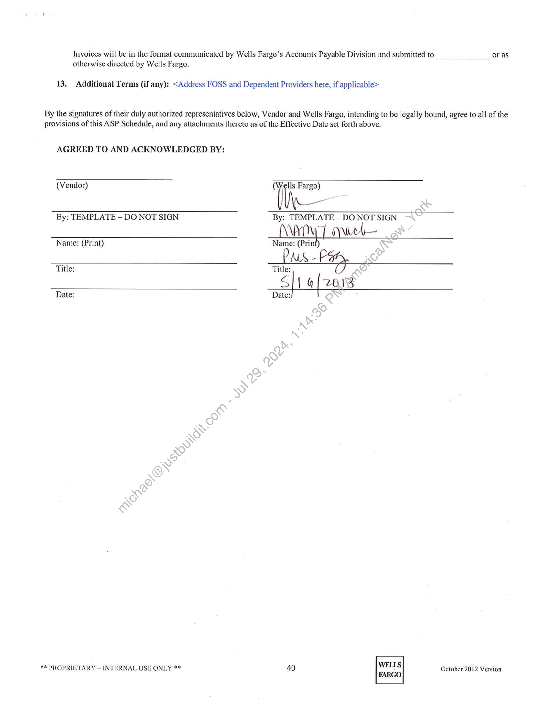
```
```col-md
Invoices will be in the format communicated by Wells Fargo’s Accounts Payable Division and submitted to
otherwise directed by Wells Fargo.
13. Additional Terms (if any): <Address FOSS and Dependent Providers here, if applicable>
or as
By the signatures of their duly authorized representatives below, Vendor and Wells Fargo, intending to be legally bound, agree to all of the
provisions of this ASP Schedule, and any attachments thereto as of the Effective Date set forth above.
AGREED TO AND ACKNOWLEDGED BY:
(Vendor)
(Wells Fargo)
WWW
By: TEMPLATE — DO NOT SIGN
Name: (Print)
Title:
Date:
** PROPRIETARY — INTERNAL USE ONLY **
By: TEMPLATE — DO NOT SIGN
NV awel—
Name: (Prin
NA - FS
Title:
SIL G/ 2018
Date:
October 2012 Version
```
````
Notes:


![[_attachments/WF-3.6.1.15.1.3 Wells Fargo - Master Agreement 7.05.2013.pdf]
