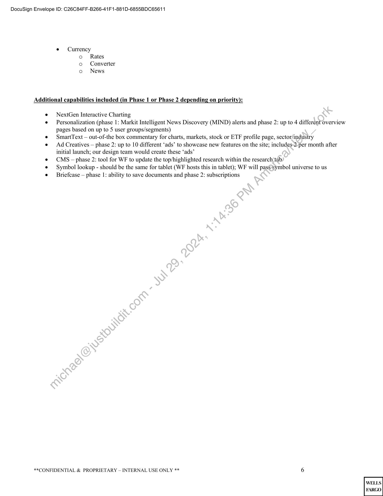

##### Amendment #1 to Statement of Work Hosting For Wells Fargo Brokerage Website]

  
````col
```col-md
flexGrow=.5
===
> [!info] [Page 1](_attachments/images_WF-3.6.1.15.1.500190924.pdf_210544/page_1.png)
> 
```  
```col-md
DocuSign Envelope ID: C26C84FF-B266-41F 1-881D-6855BDC65611  
Wells Fargo Document ID: 306456
Statement of Work (Hosting for Wells Fargo Brokerage Website: 209063
Wells Fargo Master Agreement ID: 132244  
Amendment #1 to Statement of Work Hosting For Wells Fargo Brokerage Website  
This Amendment #1 to Statement of Work 209063 (“Amendment #1”) is dated March 12, 2021 (“Effective Date”), is entered
into by and between Wells Fargo Bank, N.A. (“Wells Fargo”), and Markit North America, Inc. (“Wendor” or “Markit”) pursuant
to the Master Agreement with an Effective Date of May 7, 2013 between Wells Fargo Bank. N.A. and Markit On Demand,
Inc., a subsidiary of Markit North America, Inc. (“Master Agreement”). All of the terms and conditions of-the Master
Agreement are incorporated herein by this reference. Terms that are capitalized but not defined in this SOW have the meaning
given in the Master Agreement.  
Statement of Work 209063 (“SOW 209063), is amended per this Amendment #1 as defined below:
1. In “Exhibit A”, the following scope shall be added:
Phase 3  
Quotes and Research  
1. Markit Digital will host mutual fund profile pages including:
a. Mutual fund header module
b. Investment information module
c. Morningstar ratings module
d. Returns module
e. Holdings module
Fund information module
Distributions module
h. Total returns module
Average annualized returns modulé
Asset allocation module
Valuation and growth module
Market cap breakdown module
Sector breakdown module
Regional exposure modnle
Risk measure
Return vs. risk graph
Fees and expenses module
Investment information module
Price chartFooterdisclosures
2. Markit Digital will host a public version of the Mutual Fund profile page
a. OPublic page will be the same but with less data based on WF specifications
3. Markit Digital will host a Mutual Fund Screener:
4. Markit Digital will uplift the authentication and adhere to Wells Fargo's external single sign on (SSO)
implementation based on SAML v2.0 specifications.
5. *MOD will host a CNAME domain that is managed/owned by Wells Fargo. MOD will be required to host the SSL
certificate provided with the CNAME. The SSL certificate will require annual renewal.  
a>  
praposg:  
2. In Section 6, “SERVICE FEE,” the following section is added.  
** PROPRIETARY — INTERNAL USE ONLY ** 1  
```
````
Notes:    
````col
```col-md
flexGrow=.5
===
> [!info] [Page 2](_attachments/images_WF-3.6.1.15.1.500190924.pdf_210544/page_2.png)
> 
```  
```col-md
DocuSign Envelope ID: C26C84FF-B266-41F 1-881D-6855BDC65611  
Client will pay an additional monthly hosting fee of $12,000 for the Phase 3 Quotes and Research functionality added to
Exhibit A by this Amendment. Such fee to commence at launch of the solution in a production environment.  
By the signatures of their duly authorized representatives below, Vendor and Wells Fargo, intending to be legally bound,
agree to all of the provisions of this SOW as of the Effective Date set forth above.  
AGREED TO AND ACKNOWLEDGED BY:  
Markit North America, Inc. Wells Fargo Bank, N.A.
(Vendor) (Wells Fargo)
( Caller Meare [ danes E Hays
Catherine Allegra James E Hays
Name: (Print) Name: (Print)
Global Head - Markit Digital Head of WFA
Title: Title:
4/13/2021 | 11:30:24 AM PDT 4/13/2022 | 12:10:59 PM PDT
Date: Date:  
Contract Reviewed  
**CONFIDENTIAL & PROPRIETARY — INTERNAL USE ONLY ** 2  
```
````
Notes:    
````col
```col-md
flexGrow=.5
===
> [!info] [Page 3](_attachments/images_WF-3.6.1.15.1.500190924.pdf_210544/page_3.png)
> 
```  
```col-md
DocuSign Envelope ID: C26C84FF-B266-41F 1-881D-6855BDC65611  
Exhibit A
Phase 1  
Markets  
e Market Snapshot  
[e}  
oooo0;90  
Market Update
Market Index
Major World Indices  
My Watch (WF would pass us APIs for data access)  
Daily Market Commentary
Gainers & Losers
Market Highlights  
e = Major Indices  
°
°
e News
°  
°  
°  
U.S. Market Indices
World Market Indices  
Market News  
= Headlines  
= Market Movers  
= Word on The Street  
= News by Category
Earnings  
= Announcements  
= Guidance
Upgrades/Downgrades  
= Upgrades  
= Downgrades
Industry/Sector  
= Latest advertisingheadline based on industry/sector  
Headline Search  
e = Highlights  
°
°  
Gainers & Losers
Most Actives  
e Commentary  
°  
Market Insight
&) WF Advisors
= S&P  
Daily Market Commentary
= US Stock Market (by WFA)
= Bond Market (by WFA)
Economic Commentary
= WFA
= S&P
Technical Analysis
= S&P
Industry/Sector Watch
= Industry in Focus
= Stovall’s Sector Watch  
e Interest Rates  
[e}  
US
= Government  
**CONFIDENTIAL & PROPRIETARY — INTERNAL USE ONLY **  
```
````
Notes:    
````col
```col-md
flexGrow=.5
===
> [!info] [Page 4](_attachments/images_WF-3.6.1.15.1.500190924.pdf_210544/page_4.png)
> 
```  
```col-md
DocuSign Envelope ID: C26C84FF-B266-41F 1-881D-6855BDC65611  
= Key Rates
o International
e Interactive Charting  
Quotes & Research  
e Stocks & Options
o Profile
= Latest Headlines
= Key Stats
= Analyst Ratings
= Latest Corporate Actions
= Industry Classification
= Business Description
= Corporate Information
= Contact Information
= Membership  
oO Quote
= Detailed
= Historical
o News
o Chart  
o Financials (annual and quarterly)
= Income Statement
= Balance Sheet
= Earnings
= Dividends  
= Ratios
o Research
= Reports
= Ratings
o Option Chain
= Calls
= Puts
e ETF
o Profile
= Lipper Scorecard
= ETF Overview
=) Performance History
e =Month End
e = =Quarter End
= Pricing History
= Growth of $10,000
= Latest Headlines
= ETF Characteristics
= Top 10 Holdings
= Sector Allocation
= Risk Profile
= Geographic Exposure
oO Quote
= Detailed
= Historical
oo Chart
o News  
o Option Chain  
**CONFIDENTIAL & PROPRIETARY — INTERNAL USE ONLY ** 4  
```
````
Notes:    
````col
```col-md
flexGrow=.5
===
> [!info] [Page 5](_attachments/images_WF-3.6.1.15.1.500190924.pdf_210544/page_5.png)
> 
```  
```col-md
DocuSign Envelope ID: C26C84FF-B266-41F 1-881D-6855BDC65611  
= Calls
= Puts
o Prospectus
= Annual Report
= Semi Annual
= Statement of Additional Information
e  =Futures
o Futures Summary Module on Markets Overview page
e ~=Currency
o Currency Summary Module on Markets Overview page
e Investment Ideas
o WFA
o S&P
= 5 Star
= Fair Value
= Platinum
= Power Pick
o Consensus Ratings  
= Highest
= Lowest
o Latest Research  
e = Tools
o Screeners — Stock + ETF screener
e Interactive Charting  
Phase 2
Markets
e = Highlights
o. Market Diary
o Industry
e Interest Rates
o Cash Sweep Rates
= Bank Depésit Sweep Rates
= Cash Sweeps — Money Market Funds
e = Calendars
o Economic
o IPO
2 Calendar
» Performance
os) Stock Splits
= Recent
= Upcoming
Quotes and Research
© Industry
o. Price
o Fundamentals
o. Ratio
o Dividend
e Futures
© Quote
o- Chart
o Profile  
**CONFIDENTIAL & PROPRIETARY — INTERNAL USE ONLY ** 5  
```
````
Notes:    
````col
```col-md
flexGrow=.5
===
> [!info] [Page 6](_attachments/images_WF-3.6.1.15.1.500190924.pdf_210544/page_6.png)
> 
```  
```col-md
DocuSign Envelope ID: C26C84FF-B266-41F 1-881D-6855BDC65611  
e ~=Currency  
oo Rates
o Converter
o News  
Additional capabilities included (in Phase 1 or Phase 2 depending on priority):  
e NextGen Interactive Charting  
e Personalization (phase 1: Markit Intelligent News Discovery (MIND) alerts and phase 2: up to 4 different overview
pages based on up to 5 user groups/segments)  
e SmartText — out-of-the box commentary for charts, markets, stock or ETF profile page, sector/industry  
e Ad Creatives — phase 2: up to 10 different ‘ads’ to showcase new features on the site; includes-2-per month after
initial launch; our design team would create these ‘ads’  
e CMS - phase 2: tool for WF to update the top/highlighted research within the research;tab  
e Symbol lookup - should be the same for tablet (WF hosts this in tablet); WF will pass’symbol universe to us  
e Briefcase — phase 1: ability to save documents and phase 2: subscriptions  
**CONFIDENTIAL & PROPRIETARY — INTERNAL USE ONLY ** 6  
```
````
Notes:  


![[_attachments/WF-3.6.1.15.1.5 00190924.pdf]