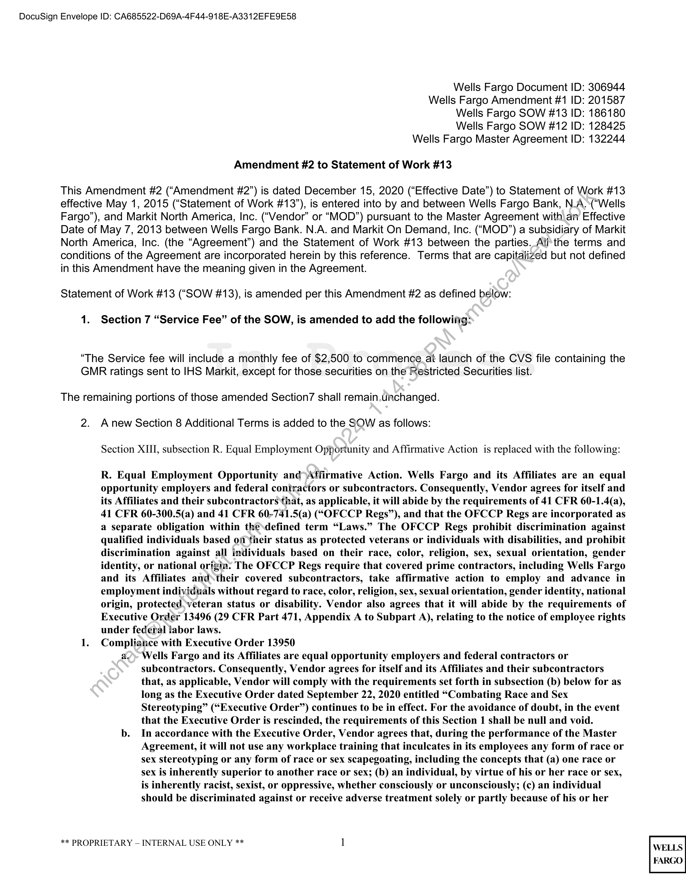
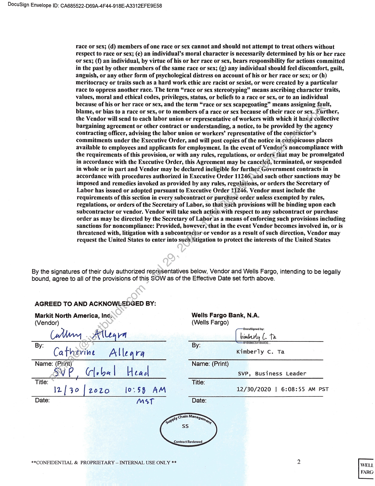

##### Amendment #2 to Statement of Work #13]

  
````col
```col-md
flexGrow=.5
===
> [!info] [Page 1](_attachments/images_WF-3.6.1.15.1.600190926.pdf_210341/page_1.png)
> 
```  
```col-md
DocuSign Envelope ID: CA685522-D69A-4F44-918E-A3312EFE9E58  
Wells Fargo Document ID: 306944  
Wells Fargo Amendment #1 ID: 201587
Wells Fargo SOW #13 ID: 186180  
Wells Fargo SOW #12 ID: 128425  
Wells Fargo Master Agreement ID: 132244  
Amendment #2 to Statement of Work #13  
This Amendment #2 (“Amendment #2”) is dated December 15, 2020 (“Effective Date”) to Statement of Work #13
effective May 1, 2015 (“Statement of Work #13”), is entered into by and between Wells Fargo Bank, N.A.\(“Wells
Fargo”), and Markit North America, Inc. (“Vendor” or “MOD”) pursuant to the Master Agreement with an Effective
Date of May 7, 2013 between Wells Fargo Bank. N.A. and Markit On Demand, Inc. (“MOD”) a subsidiary of Markit
North America, Inc. (the “Agreement”) and the Statement of Work #13 between the parties. All’the terms and
conditions of the Agreement are incorporated herein by this reference. Terms that are capitalized but not defined
in this Amendment have the meaning given in the Agreement.  
Statement of Work #13 (“SOW #13), is amended per this Amendment #2 as defined below:  
1. Section 7 “Service Fee” of the SOW, is amended to add the followifig:  
“The Service fee will include a monthly fee of $2,500 to commence_at launch of the CVS file containing the
GMR ratings sent to IHS Markit, except for those securities on the Restricted Securities list.  
The remaining portions of those amended Section7 shall remain.unchanged.
2. Anew Section 8 Additional Terms is added to the SOW as follows:
Section XIII, subsection R. Equal Employment Opportunity and Affirmative Action is replaced with the following:  
R. Equal Employment Opportunity and>Affirmative Action. Wells Fargo and its Affiliates are an equal
opportunity employers and federal coniractors or subcontractors. Consequently, Vendor agrees for itself and
its Affiliates and their subcontractors that, as applicable, it will abide by the requirements of 41 CFR 60-1.4(a),
41 CFR 60-300.5(a) and 41 CFR 60-741.5(a) (“OFCCP Regs”), and that the OFCCP Regs are incorporated as
a separate obligation within the\defined term “Laws.” The OFCCP Regs prohibit discrimination against
qualified individuals based on their status as protected veterans or individuals with disabilities, and prohibit
discrimination against all individuals based on their race, color, religion, sex, sexual orientation, gender
identity, or national origin: The OFCCP Regs require that covered prime contractors, including Wells Fargo
and its Affiliates and\their covered subcontractors, take affirmative action to employ and advance in
employment individuals without regard to race, color, religion, sex, sexual orientation, gender identity, national
origin, protected.veteran status or disability. Vendor also agrees that it will abide by the requirements of
Executive Order 13496 (29 CFR Part 471, Appendix A to Subpart A), relating to the notice of employee rights
under federal labor laws.
1. Compliance with Executive Order 13950  
a.) Wells Fargo and its Affiliates are equal opportunity employers and federal contractors or
subcontractors. Consequently, Vendor agrees for itself and its Affiliates and their subcontractors
that, as applicable, Vendor will comply with the requirements set forth in subsection (b) below for as
long as the Executive Order dated September 22, 2020 entitled “Combating Race and Sex
Stereotyping” (“Executive Order”) continues to be in effect. For the avoidance of doubt, in the event
that the Executive Order is rescinded, the requirements of this Section 1 shall be null and void.  
b. In accordance with the Executive Order, Vendor agrees that, during the performance of the Master
Agreement, it will not use any workplace training that inculcates in its employees any form of race or
sex stereotyping or any form of race or sex scapegoating, including the concepts that (a) one race or
sex is inherently superior to another race or sex; (b) an individual, by virtue of his or her race or sex,
is inherently racist, sexist, or oppressive, whether consciously or unconsciously; (c) an individual
should be discriminated against or receive adverse treatment solely or partly because of his or her  
** PROPRIETARY — INTERNAL USE ONLY ** 1  
```
````
Notes:    
````col
```col-md
flexGrow=.5
===
> [!info] [Page 2](_attachments/images_WF-3.6.1.15.1.600190926.pdf_210341/page_2.png)
> 
```  
```col-md
DocuSign Envelope ID: CA685522-D69A-4F44-918E-A3312EFE9E58  
race or sex; (d) members of one race or sex cannot and should not attempt to treat others without
respect to race or sex; (e) an individual’s moral character is necessarily determined by his or her race
or sex; (f) an individual, by virtue of his or her race or sex, bears responsibility for actions committed
in the past by other members of the same race or sex; (g) any individual should feel discomfort, guilt,
anguish, or any other form of psychological distress on account of his or her race or sex; or (h)
meritocracy or traits such as a hard work ethic are racist or sexist, or were created by a particular
race to oppress another race. The term “race or sex stereotyping” means ascribing character traits,
values, moral and ethical codes, privileges, status, or beliefs to a race or sex, or to an individual
because of his or her race or sex, and the term “race or sex scapegoating” means assigning fault,
blame, or bias to a race or sex, or to members of a race or sex because of their race or sex. further,
the Vendor will send to each labor union or representative of workers with which it has.a‘collective
bargaining agreement or other contract or understanding, a notice, to be provided by the agency
contracting officer, advising the labor union or workers’ representative of the contractor’s
commitments under the Executive Order, and will post copies of the notice in conspicuous places
available to employees and applicants for employment. In the event of Vender’s noncompliance with
the requirements of this provision, or with any rules, regulations, or orders that may be promulgated
in accordance with the Executive Order, this Agreement may be canceled, terminated, or suspended
in whole or in part and Vendor may be declared ineligible for furthet Government contracts in
accordance with procedures authorized in Executive Order 11246, and such other sanctions may be
imposed and remedies invoked as provided by any rules, regulations, or orders the Secretary of
Labor has issued or adopted pursuant to Executive Order 11246. Vendor must include the
requirements of this section in every subcontract or purchase order unless exempted by rules,
regulations, or orders of the Secretary of Labor, so that such provisions will be binding upon each
subcontractor or vendor. Vendor will take such action with respect to any subcontract or purchase
order as may be directed by the Secretary of Labor as a means of enforcing such provisions including
sanctions for noncompliance: Provided, however, that in the event Vendor becomes involved in, or is
threatened with, litigation with a subcontractor or vendor as a result of such direction, Vendor may
request the United States to enter into such litigation to protect the interests of the United States  
By the signatures of their duly authorized representatives below, Vendor and Wells Fargo, intending to be legally
bound, agree to all of the provisions of this SOW as of the Effective Date set forth above.  
AGREED TO AND ACKNOWLEDGED BY:  
Markit North America, Inc: Wells Fargo Bank, N.A.
(Vendor) (Wells Fargo)
(Many. Leva kin (. te  
By: ) By: = TECET BRT  
Catherine Allegra Kimberly c. Ta
Name: (Print) Name: (Print)  
SV P Cle ba | lH tad SvP, Business Leader  
—— eo ae ee EE  
Title: Title:  
Iz] 30 [2020 Jo.58 AM 12/30/2020 | 6:08:55 AM PST
Date: MsT Date:  
**CONFIDENTIAL & PROPRIETARY — INTERNAL USE ONLY ** 2 WELL
FARG:  
```
````
Notes:  


![[_attachments/WF-3.6.1.15.1.6 00190926.pdf]