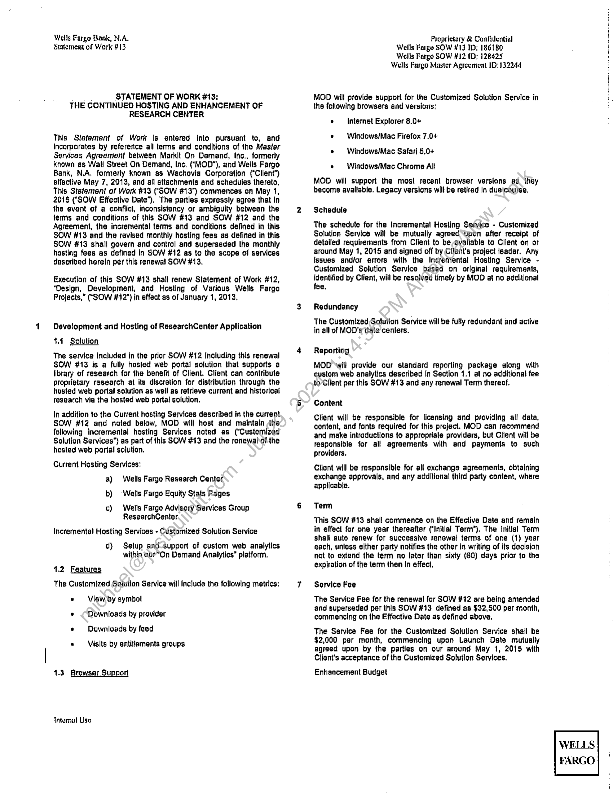
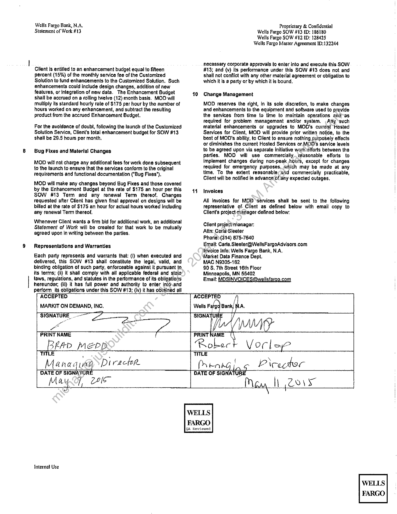

##### Statement of Work #13: The Continued Hosting and Enhancement of Research Center]

  
````col
```col-md
flexGrow=.5
===
> [!info] [Page 1](_attachments/images_WF-3.6.1.15.1.700190948.pdf_212747/page_1.png)
> 
```  
```col-md
Wells Fargo Bank, N.A.
Statement of Wark #13  
STATEMENT OF WORK #13:
THE CONTINUED HOSTING AND ENHANCEMENT OF
RESEARCH CENTER  
This Statement of Work is entered into pursuant to, and
incorporates by reference all terms and conditions of the Master
Services Agreement between Markit On Demand, Inc., formerly
known as Wall Street On Demand, Inc, ("MOD"), and Wells Fargo
Bank, N.A, formerly Known as Wachovia Corporation (‘Client*)
effective May 7, 2013, and all attachments and schedules thereto,
This Statement of Work #13 (‘SOW #13”) commences on May 1,
2015 (“SOW Effective Date’). The parties expressly agree that in
the event of a conflict, Inconsistency or ambiguity between the
terms and conditions of this SOW #13 and SOW #12 and the
Agreement, the incremental terms and conditions defined In this
SOW #13 and the ravised monthly hosting fees as defined in this
SOW #13 shall govern and control and superseded the monthly
hosting fees as defined in SOW #12 as to the scope of services
described herein per this renewal SOW #13,  
Execution of this SOW #13 shall renew Statement of Work #12,
“Design, Development, and Hosting of Various Wells Fargo
Projects,” (“SOW #12") in effect as of January 1, 2013,  
Development and Hosting of ResearchCenter Application  
4.4 Solution  
The service included In the prior SOW #12 Including this renewal
SOW #13 Is a fully hosted web portal solution that supports a
library of research for the benefit of Client. Client can contribute
proprietary research at its discretion for distribution through the
hosted web portal soltition as well as retrieve currant and historical
research via the hosted web portal solution,  
In addition to the Current hosting Services described in the current
SOW #12 and noted below, MOD will host and maintain the
following incremental hosting Services nated as (“Customized
Solution Services”) as part of this SOW #13 and the renewabot:the
hosted web portal solution,  
Current Hosting Services:
a) Wells Fargo Research Center
b) ‘Wells Fargo Equity Stats Pages  
c) Wells Fargo Advisory Services Group
ResearchCenter.  
Incremental Hosting Services - Customized Solution Service  
d) Setup and-support of custom web analytics
within aur “On Demand Analytics” platform.  
1.2 Features
The Customized Solution Service will Include the following metrics:
« — View, by symbol
* Downloads by provider
« Downloads by faed
« Visits by entitlements groups  
1,3 Browser Support  
Taternal Use  
7  
Proprietary & Confidential
Wells Fargo SOW #13 ID: 186180
Wells Fargo SOW #12 ID: 128425
Wells Fargo Master Agreement 1D:132244  
MOD will provide support for the Customized Solution Service in
the following browsers and versions;  
¢ Internet Explorer 8.0+  
« Windows/Mac Firefox 7.0+
« — Windows/Mac Safari 5,0+  
« — Windows/Mac Chrome All  
MOD will support the most recent browser Versions ad (hey
become available. Legacy versions will be retired in due(coulse,  
Schedule  
The schedule for the Incremental Hosting Seivice - Customized
Solution Service will be mutually agreed “tpon afler receipt of
detailed requirements from Client to be evailable to Client on or
around May 1, 2015 and signed off by Client's project leader. Any
Issues and/or errors with the Incremental Hosting Service Customized Solution Service based on original requirements,
identified by Client, will be resolved timely by MOD at no additional
fee.  
Redundancy  
The Customized Solution Service will be fully redundant and active
in all of MOD's tata centers.  
Reporting  
MOD will provide our standard reporting package along with
custom web analytics described In Section 1.1 at no additional fee
toClient per this SOW #13 and any renewal Term thereof,  
Content  
Client will be responsible for licensing and providing all data,
content, and fants required for this project. MOD can racommend
and make introductions to appropriate providers, but Client will be
responsible for all agreements with and payments to such
providers,  
Client will be responsible for all exchange agreements, obtaining
exchange approvals, and any additional third party content, where
applicable.  
Term  
This SOW #13 shall commence on the Effective Date and remain
in effect for one year thereafter (‘Inillal Terrn*), The Initlal Term
shalt auto renew for successive renewal terms of one (1) year
each, unless elther party notifies the other in writing of its decision
not to extend the term no later than sixty (60) days prior to the
expiration of the term then In effect,  
Service Fee  
The Service Fee for the renewal for SOW #12 are being amended
and superseded per this SOW #13 defined as $32,500 per month,
commencing on the Effective Date as defined above.  
The Service Fee for the Customized Solution Service shail be
$2,000 per month, commencing upon Launch Date mutually
agreed upon by the pariles on our around May 1, 2015 with
Client's acceptance of the Customized Solution Services,  
Enhancement Budget  
WELLS
FARGO  
```
````
Notes:    
````col
```col-md
flexGrow=.5
===
> [!info] [Page 2](_attachments/images_WF-3.6.1.15.1.700190948.pdf_212747/page_2.png)
> 
```  
```col-md
Wells Fargo Bank, N.A.
Statement of Work #13  
Client is entitled to an enhancement budget equal to fifteen
percent (15%) of the monthly service fee of the Customized
Solution te fund enhancements to the Customized Solution. Such
enhancements could include design changes, addition of new
features, or Integration of new data. The Enhancement Budget
shall be accrued on a rolling twelve (12) month basis. MOD will
multiply its standard hourly rate of $175 per hour by the number of
hours worked on any enhancement, and subtract the resulting
product from the accrued Enhancement Budget,  
For the avoidance of doubt, following the launch of the Customized
Solution Service, Client's total enhancement budget for SOW #13
shall be 29.5 hours per month,  
Bug Fixes and Material Changes  
MOD will not charge any additional fees for work done subsequent
fo the launch to ensure that the services conform to the original
tequirements and functional documentation (“Bug Fixes"),  
MOO will make any changes beyond Bug Fixes and those covered
by the Enhancement Budget at the rate of $175 an hour per this
SOW #13 Term and any renewal Term thereof. Changes
requested after Client has given final approval on designs will be
billed at the rate of $175 an hour for actual hours worked including
any renewal Term thereof,  
Whenever Client wants a firm bid for additional work, an additional
Statement of Wort will ba created for that work to be mutually
agreed upon in writing between the parties.  
Representations and Warranties  
Each party represents and warrants that; (i) when executed and
delivered, this SOW #13 shall constitute the legal, valid, and
binding obligation of such party, enforceable against it pursuant to.
its terms; (li) It shall camply with all applicable federal and staic
laws, regulations, and statutes in the performance of its obligations
hereunder; (ili) it has full power and authorily to enter into.and
perform. its obligations under this SOW #13; (iv) it has obtained all
[ ACCEPTED  
| MARKIT ON DEMAND, INC.  
Proprietary & Confidential
Wells Fargo SOW #13 ED: 186180
Wells Fargo SOW #12 ID: 128425
Wells Fargo Master Agreement 10:132244  
necessary corporate approvals to enler into and execute this SOW
#13; and (v) its performance under this SOW #13 does not and
shail not conflict with any other material agreement or obligation to
which it is a party or by which it is bound.  
10 Change Management  
MOD reserves the right, in its sole discretion, ‘o make changes
and enhancements to the equipment and software used to provide
the services from time to time to maintain operations aid-as
required for problem management and/or system. Any such
material enhancements or upgrades to MOD's current Hosted
Services for Client, MOD will provide prior written notice, to the
best of MOD's abllity, to Cliant to ensure nothing purposely effects
or diminishes the current Hosted Services or. MO0D's service levels
to be agreed upon via separate iniliative workosiforts between the
parties. MOD will use commercially. reasonable efforts to
Implement changes during non-peak ours, except for changes
tequired for emergency purposes, which may be made at any
time, To the extent reasonablecand commercially practicable,
Client will be notified in advance Of any expected outages,  
11 Invoices  
All Invoices for MOD ‘services shall be sent to the following
representative of Client as defined below with email copy to
Client's project-manager defined below;  
Client project'manager:  
Attn: CarlaSleeter  
Phone?(314) 875-7640  
Email; Carta.Sleeter@WellsFargoAdvisors.com
Invoice Info: Wells Fargo Bank, N.A,  
Market Data Finance Dept,  
MAC N9305-162  
90 S. 7th Street 16th Floor  
Minneapolis, MN 55402  
Email: MOSINVOICES@wellsfargo.com  
ACCEPTED
Wells Fatgg Bank,  
SIGNATURE  
fu  
SIGNATURE. Oa,
oo
PRINT NAME \S  
| Bean meen  
PRINT NAME  
THLE
Managing PI rectoR.  
DATE OF SIGNATUR  
Ro poe
TITLE  
\
PrRAAG 4 irec tor
DATE OF SIGNATU  
May, 20m  
Internal Use  
Vary l\ COs  
WELLS  
FARGO  
QA Reviewed  
WELLS
FARGO  
```
````
Notes:  


![[_attachments/WF-3.6.1.15.1.7 00190948.pdf]