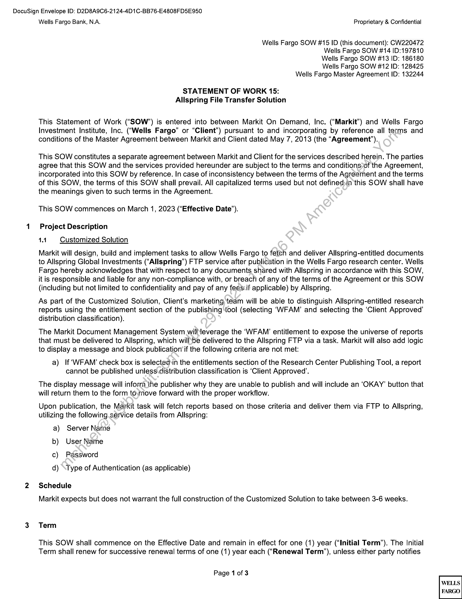
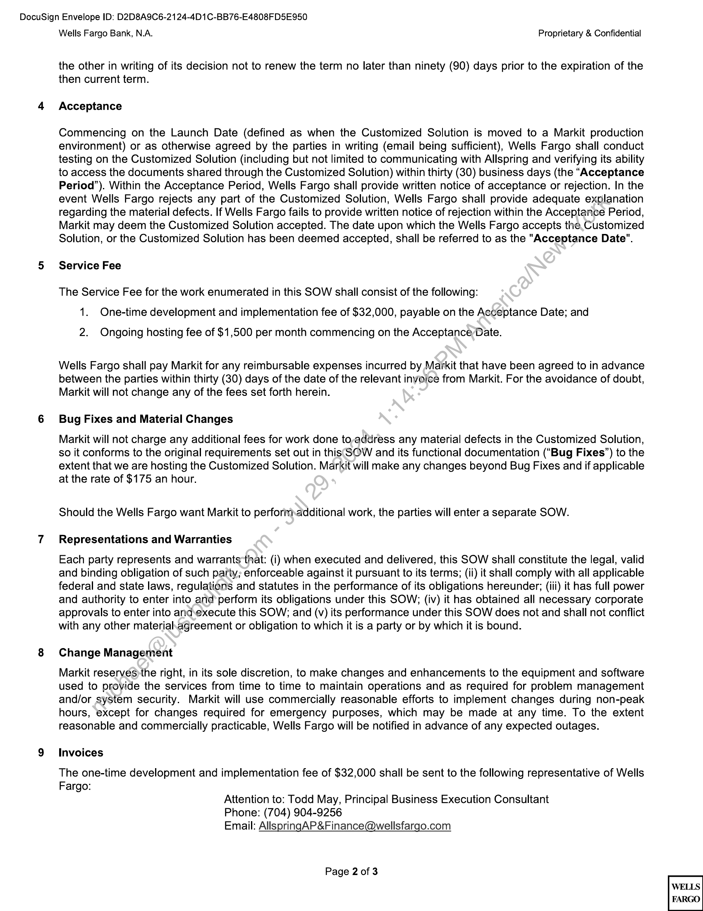
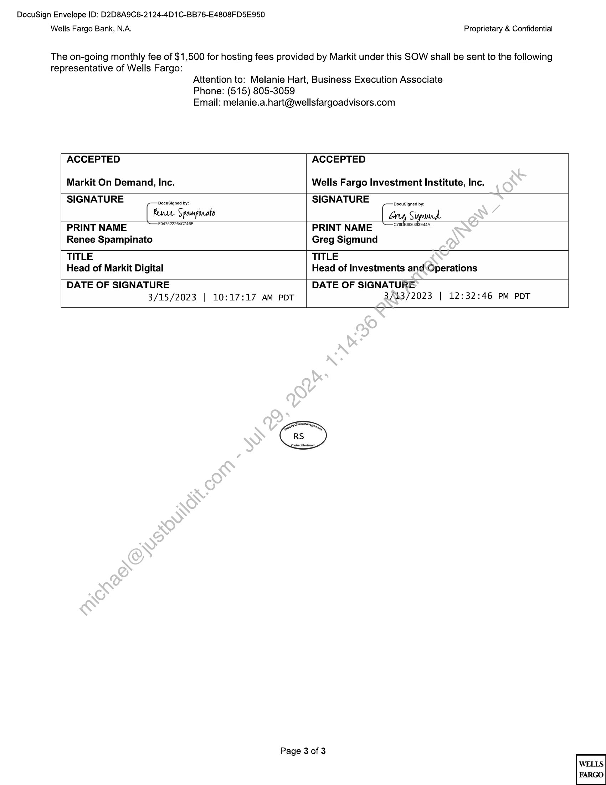

##### Statement of Work 15: Allspring File Transfer Solution]

  
````col
```col-md
flexGrow=.5
===
> [!info] [Page 1](_attachments/images_WF-II3.6.1.15.2.100121353.pdf_211438/page_1.png)
> 
```  
```col-md
DocuSign Envelope ID: D2D8A9C6-2124-4D1C-BB76-E4808FD5E950
Wells Fargo Bank, N.A. Proprietary & Confidential  
Wells Fargo SOW #15 ID (this document): CW220472
Wells Fargo SOW #14 ID:197810  
Wells Fargo SOW #13 ID: 186180  
Wells Fargo SOW #12 ID: 128425  
Wells Fargo Master Agreement ID: 132244  
STATEMENT OF WORK 15:
Allspring File Transfer Solution  
This Statement of Work (“SOW’) is entered into between Markit On Demand, Inc. (“Markit”) and Wells Fargo
Investment Institute, Inc. (“Wells Fargo” or “Client”) pursuant to and incorporating by reference all terms and
conditions of the Master Agreement between Markit and Client dated May 7, 2013 (the “Agreement”).  
This SOW constitutes a separate agreement between Markit and Client for the services described herein. The parties
agree that this SOW and the services provided hereunder are subject to the terms and conditions-of the Agreement,
incorporated into this SOW by reference. In case of inconsistency between the terms of the Agreement and the terms
of this SOW, the terms of this SOW shall prevail. All capitalized terms used but not defined in this SOW shall have
the meanings given to such terms in the Agreement.  
This SOW commences on March 1, 2023 (“Effective Date’).  
1 Project Description
1.1 Customized Solution  
Markit will design, build and implement tasks to allow Wells Fargo to fetch and deliver Allspring-entitled documents
to Allspring Global Investments (“Allspring”) FTP service after publication in the Wells Fargo research center. Wells
Fargo hereby acknowledges that with respect to any documents shared with Allspring in accordance with this SOW,
it is responsible and liable for any non-compliance with, or breach of any of the terms of the Agreement or this SOW
(including but not limited to confidentiality and pay of any feescif applicable) by Allspring.  
As part of the Customized Solution, Client’s marketing team will be able to distinguish Allspring-entitled research
reports using the entitlement section of the publishing tool (selecting ‘WFAM’ and selecting the ‘Client Approved’
distribution classification).  
The Markit Document Management System willNeverage the ‘WFAM’ entitlement to expose the universe of reports
that must be delivered to Allspring, which will\be delivered to the Allspring FTP via a task. Markit will also add logic
to display a message and block publication if the following criteria are not met:  
a) If ‘WFAM’ check box is selectedsin the entitlements section of the Research Center Publishing Tool, a report
cannot be published unless.distribution classification is ‘Client Approved’.  
The display message will inform the publisher why they are unable to publish and will include an ‘OKAY’ button that
will return them to the form to,move forward with the proper workflow.  
Upon publication, the Markit task will fetch reports based on those criteria and deliver them via FTP to Allspring,
utilizing the following. service details from Allspring:  
a) Server Name
b) User Name
c) Password  
d) \Type of Authentication (as applicable)  
2 Schedule  
Markit expects but does not warrant the full construction of the Customized Solution to take between 3-6 weeks.  
3. Term  
This SOW shall commence on the Effective Date and remain in effect for one (1) year (“Initial Term”). The Initial
Term shall renew for successive renewal terms of one (1) year each (“Renewal Term’), unless either party notifies  
Page 1 of 3  
WELLS
FARGO  
```
````
Notes:    
````col
```col-md
flexGrow=.5
===
> [!info] [Page 2](_attachments/images_WF-II3.6.1.15.2.100121353.pdf_211438/page_2.png)
> 
```  
```col-md
DocuSign Envelope ID: D2D8A9C6-2124-4D1C-BB76-E4808FD5E950
Wells Fargo Bank, N.A. Proprietary & Confidential  
the other in writing of its decision not to renew the term no later than ninety (90) days prior to the expiration of the
then current term.  
4 Acceptance  
Commencing on the Launch Date (defined as when the Customized Solution is moved to a Markit production
environment) or as otherwise agreed by the parties in writing (email being sufficient), Wells Fargo shall conduct
testing on the Customized Solution (including but not limited to communicating with Allspring and verifying its ability
to access the documents shared through the Customized Solution) within thirty (30) business days (the “Acceptance
Period”). Within the Acceptance Period, Wells Fargo shall provide written notice of acceptance or rejection. In the
event Wells Fargo rejects any part of the Customized Solution, Wells Fargo shall provide adequate explanation
regarding the material defects. If Wells Fargo fails to provide written notice of rejection within the Acceptance Period,
Markit may deem the Customized Solution accepted. The date upon which the Wells Fargo accepts the.Customized
Solution, or the Customized Solution has been deemed accepted, shall be referred to as the "Acceptance Date".  
5 Service Fee  
The Service Fee for the work enumerated in this SOW shall consist of the following:
1. One-time development and implementation fee of $32,000, payable on the Acceptance Date; and  
2. Ongoing hosting fee of $1,500 per month commencing on the Acceptance Date.  
Wells Fargo shall pay Markit for any reimbursable expenses incurred by Markit that have been agreed to in advance
between the parties within thirty (30) days of the date of the relevant invoice from Markit. For the avoidance of doubt,
Markit will not change any of the fees set forth herein.  
6 Bug Fixes and Material Changes  
Markit will not charge any additional fees for work done to,address any material defects in the Customized Solution,
so it conforms to the original requirements set out in this SOW and its functional documentation (“Bug Fixes”) to the
extent that we are hosting the Customized Solution. Markit will make any changes beyond Bug Fixes and if applicable
at the rate of $175 an hour.  
Should the Wells Fargo want Markit to perforitnadditional work, the parties will enter a separate SOW.  
7 Representations and Warranties  
Each party represents and warrants that: (i) when executed and delivered, this SOW shall constitute the legal, valid
and binding obligation of such party; enforceable against it pursuant to its terms; (ii) it shall comply with all applicable
federal and state laws, regulations and statutes in the performance of its obligations hereunder; (iii) it has full power
and authority to enter into and perform its obligations under this SOW; (iv) it has obtained all necessary corporate
approvals to enter into and.execute this SOW; and (v) its performance under this SOW does not and shall not conflict
with any other materiahagreement or obligation to which it is a party or by which it is bound.  
8 Change Management  
Markit reserves)the right, in its sole discretion, to make changes and enhancements to the equipment and software
used to provide the services from time to time to maintain operations and as required for problem management
and/or system security. Markit will use commercially reasonable efforts to implement changes during non-peak
hours, except for changes required for emergency purposes, which may be made at any time. To the extent
reasonable and commercially practicable, Wells Fargo will be notified in advance of any expected outages.  
9 Invoices  
The one-time development and implementation fee of $32,000 shall be sent to the following representative of Wells
Fargo:  
Attention to: Todd May, Principal Business Execution Consultant  
Phone: (704) 904-9256  
Email: AllspringAP&Finance@wellsfargo.com  
Page 2 of 3  
WELLS
FARGO  
```
````
Notes:    
````col
```col-md
flexGrow=.5
===
> [!info] [Page 3](_attachments/images_WF-II3.6.1.15.2.100121353.pdf_211438/page_3.png)
> 
```  
```col-md
DocuSign Envelope ID: D2D8A9C6-2124-4D1C-BB76-E4808FD5E950  
Wells Fargo Bank, N.A. Proprietary & Confidential  
The on-going monthly fee of $1,500 for hosting fees provided by Markit under this SOW shall be sent to the following
representative of Wells Fargo:  
Attention to: Melanie Hart, Business Execution Associate
Phone: (515) 805-3059
Email: melanie.a.hart@wellsfargoadvisors.com  
ACCEPTED  
Markit On Demand, Inc.  
ACCEPTED  
Wells Fargo Investment Institute, Inc.  
SIGNATURE ocusigned by. SIGNATURE ocusigned by
Rune Spampinats ony Sigmund.
PRINT NAME ET SEDI PRINT NAME CTSOBTIESSIERAR
Renee Spampinato Greg Sigmund
TITLE TITLE
Head of Markit Digital Head of Investments and Operations
DATE OF SIGNATURE DATE OF SIGNATURE  
3/15/2023 | 10:17:17 AM PDT  
3/13/2023 | 12:32:46 PM PDT  
Page 3 of 3  
WELLS
FARGO  
```
````
Notes:  


![[_attachments/WF-II3.6.1.15.2.1 00121353.pdf]