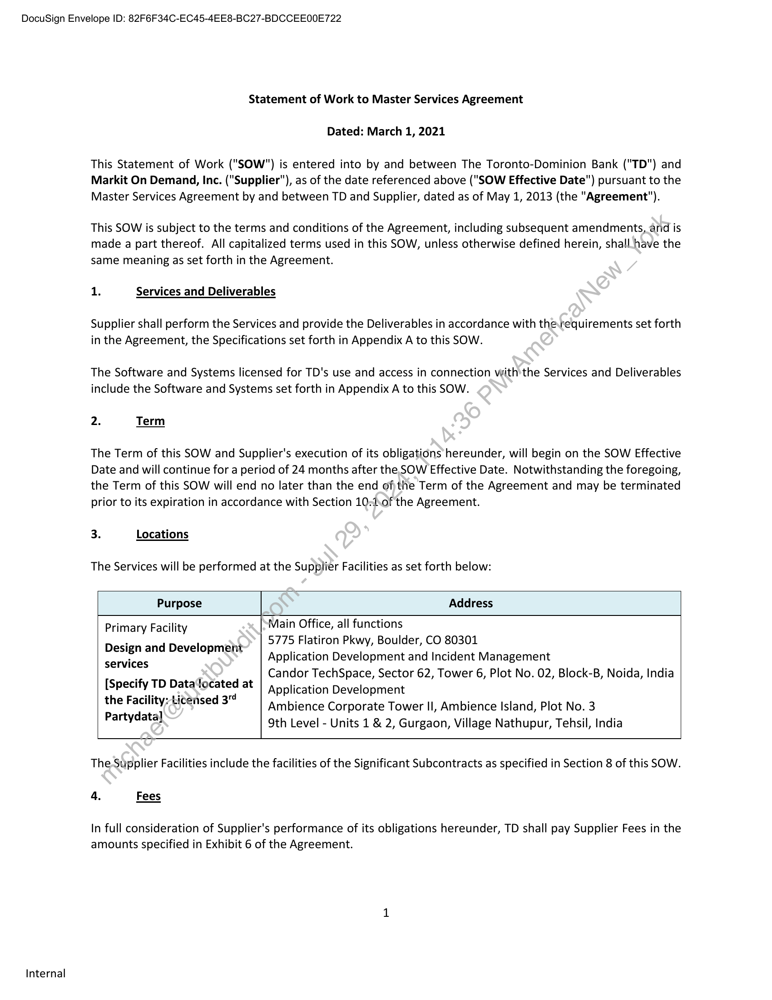

##### Statement of Work]

  
````col
```col-md
flexGrow=.5
===
> [!info] [Page 1](_attachments/images_TD-Canada-3.6.1.17.100114401-a.pdf_210448/page_1.png)
> 
```  
```col-md
DocuSign Envelope ID: 82F6F34C-EC45-4EE8-BC27-BDCCEE00E722  
Internal  
Statement of Work to Master Services Agreement
Dated: March 1, 2021  
This Statement of Work ("SOW") is entered into by and between The Toronto-Dominion Bank ("TD") and
Markit On Demand, Inc. ("Supplier"), as of the date referenced above ("SOW Effective Date") pursuant to the
Master Services Agreement by and between TD and Supplier, dated as of May 1, 2013 (the "Agreement").
This SOW is subject to the terms and conditions of the Agreement, including subsequent amendments, and is
made a part thereof. All capitalized terms used in this SOW, unless otherwise defined herein, shall have the
same meaning as set forth in the Agreement.  
1. Services and Deliverables  
Supplier shall perform the Services and provide the Deliverables in accordance with therequirements set forth
in the Agreement, the Specifications set forth in Appendix A to this SOW.  
The Software and Systems licensed for TD's use and access in connection withthe Services and Deliverables
include the Software and Systems set forth in Appendix A to this SOW.  
2. Term  
The Term of this SOW and Supplier's execution of its obligations hereunder, will begin on the SOW Effective
Date and will continue for a period of 24 months after the SOW Effective Date. Notwithstanding the foregoing,
the Term of this SOW will end no later than the end ofthe Term of the Agreement and may be terminated
prior to its expiration in accordance with Section 10\of the Agreement.  
3. Locations  
The Services will be performed at the Supplier Facilities as set forth below:  
Purpose Address  
Main Office, all functions  
5775 Flatiron Pkwy, Boulder, CO 80301  
Application Development and Incident Management  
Candor TechSpace, Sector 62, Tower 6, Plot No. 02, Block-B, Noida, India
Application Development  
Ambience Corporate Tower II, Ambience Island, Plot No. 3  
9th Level - Units 1 & 2, Gurgaon, Village Nathupur, Tehsil, India  
Primary Facility  
Design and Development
services  
[Specify TD Data‘located at
the Facility: Licensed 3"
Partydata]  
The-Supplier Facilities include the facilities of the Significant Subcontracts as specified in Section 8 of this SOW.
4. Fees  
In full consideration of Supplier's performance of its obligations hereunder, TD shall pay Supplier Fees in the
amounts specified in Exhibit 6 of the Agreement.  
```
````
Notes:    
````col
```col-md
flexGrow=.5
===
> [!info] [Page 2](_attachments/images_TD-Canada-3.6.1.17.100114401-a.pdf_210448/page_2.png)
> 
```  
```col-md
DocuSign Envelope ID: 82F6F34C-EC45-4EE8-BC27-BDCCEE00E722  
5. Invoicing and Payment  
In accordance with Section 3.4(1)(a) of the Agreement, Supplier will invoice TD on a monthly basis for Fees and
Expenses, if any, incurred in the preceding calendar month.  
Supplier shall itemize such invoices, and TD shall pay such invoices, in accordance with Sections 3.4 and 3.5 of
the Agreement.  
TD shall not be responsible for payment of any Fees or Expenses in excess of the amounts set forth in this SOW
nor for any other charges not expressly stated herein, unless otherwise mutually agreed upon signing of an
additional Change Order.  
6. Contacts / Key Personnel  
In accordance with Section 14.4 of the Agreement, the contact information for TD and‘Supplier (including Key
Personnel of Supplier) is set forth below.  
For TD:  
Personnel — Role/Function Name / Contact Information  
Product Manager Phil Clarkin
Philip:Clarkin@td.com
416+308-3190  
Vendor Manager Allan Lam
Allan.Lam@td.com
416-858-8129  
For Supplier:  
Key Personnel — Role/Function Name / Contact Information  
Contract Manager Lauren Blanchet
lauren.blanchet@ihsmarkit.com  
518-542-0988  
Supplier Emergency Contact (Primary) Tier 1 Support
mod-noc@ihsmarkit.com
303-417-9999 ext. 8  
The parties have executed this SOW by their authorized representatives below. This SOW is in effect as of
the SOW Effective Date even if the signatures below are made after that date.  
The Tor pBetsinion Bank Marki Bensand, Inc.  
By: Ke — By: Catherine Alegra  
Title: WEEPtH Business Title: GTOBAP Wexa’- Markit Digital  
Name: Richard T wilks Nam@atherine Alegra  
3/8/2021  
3/8/2021 Date:  
Date:  
Internal  
```
````
Notes:    
````col
```col-md
flexGrow=.5
===
> [!info] [Page 3](_attachments/images_TD-Canada-3.6.1.17.100114401-a.pdf_210448/page_3.png)
> 
```  
```col-md
DocuSign Envelope ID: 82F6F34C-EC45-4EE8-BC27-BDCCEE00E722  
Internal  
Appendix A to Statement of Work
Specifications  
Description of Services and Deliverables  
Mobile First Design: Explore a mobile-first design experience  
a. Scope  
i.
ii.
iii.
iv.
v.
vi.  
What the user experience should be with a mobile-first initiative
Prioritizing of the 300+ pages, identifying candidates for consolidation
Effective user journeys  
Site architecture  
Site navigation  
Where and how site can be modernized  
b. Deliverables  
User Journey Overview
Simplified Architecture Proposal
Mobile-responsive Markets Overview (or mutuallyagreed upon substitute of similar
scope)  
1. 1 round of wireframes  
2. 2 rounds of visual designs
Mobile-responsive Stock Overview pages (or mutually agreed upon substitute of
similar scope)  
1. 1 round of wireframes  
2. 2 rounds of visual designs  
Mobile First MVP Phase 1: Develop the two most highly trafficked pages to explore and define mobilefirst integration requirements from ‘both TD and Supplier prior to beginning work for the entire
Markets & Research site  
c. Scope  
Supplier will develop the mobile-first Market Overview and Stock Overview pages (or
mutually.agreed upon substitutes of similar scope) based on the designs created from
the Mobile First Design exercise. For clarity, supplementary tabs on these pages will
not:be included in MVP Phase 1.  
Pages to have three (3) breakpoints (desktop, mobile, tablet)  
User authentication using SAML or OAuth  
TD will continue using iFrame framework  
d_~ Deliverables  
User integration of two (2) mobile-ready pages
Markets Overview page (or mutually agreed upon substitute of similar scope)
Stocks Overview page (or mutually agreed upon substitute of similar scope)  
Mobile First Phase 2: Full mobile-ready Markets & Research site, as mutually agreed upon  
```
````
Notes:    
````col
```col-md
flexGrow=.5
===
> [!info] [Page 4](_attachments/images_TD-Canada-3.6.1.17.100114401-a.pdf_210448/page_4.png)
> 
```  
```col-md
DocuSign Envelope ID: 82F6F34C-EC45-4EE8-BC27-BDCCEE00E722  
Internal  
Additional Support Related Services  
4.  
10.  
11.
12.  
13.  
2.  
Real Time Quote Log: Daily processing and monthly reporting on real-time quotes across Markets &
Research site and components, delivered to TD Waterhouse to be rolled up and reported to the
exchanges.  
Production Support: Address day-to-day operating issues via Tier | support.  
Single Point-of-Contact for Vendors: Communication to third-party Vendors for questions and
operational functions not hosted by Supplier, including escalation to Morningstar, Recognia and
Refinitiv  
Custom Administration Tool: Support for admin tool to enable report uploads, Mutual Fund buy lists
and research reports (uploaded by TDSI and ARC) hosted by Supplier  
Premium Report Processing: Support for automated processing of premium reports uploaded by TD’s
PAIR. Includes production support to investigate and remove reports uploaded in error:  
News Integration: Processing and integration of multiple news feeds (including: MarketWire, CNW
Group) to support Market Overview, Stock and Industry specific news.  
Project Management: Provide project management and multi-project coardination over Supplier
projects for multiple TD groups.  
Secure Site Access: Support multiple security protocols for required B2B authentication  
Omniture tagging: Support Omniture tagging across Markets & Research and Mobile pages for TD
Waterhouse internal analytics requirements.  
Usage Reporting: Supplier will provide its standard reporting package when the Services are running
in production.  
Acceptance Criteria  
The Services and Deliverables shall be subject to final signoff by TD prior to TD acceptance of the Service and
Deliverables.  
```
````
Notes:    
````col
```col-md
flexGrow=.5
===
> [!info] [Page 5](_attachments/images_TD-Canada-3.6.1.17.100114401-a.pdf_210448/page_5.png)
> 
```  
```col-md
DocuSign Envelope ID: 82F6F34C-EC45-4EE8-BC27-BDCCEE00E722  
3. WebBroker — Markit Digital (MD) SSO with SAML Token  
The diagram below represents SSO execution flow. The architecture is subject to review by TD Enterprise
Architecture group (GTAC) and Security team (TRMIS).  
SAML SSO token — is a token generated by TD CSSP service and would contain mandatory attributes and
an attribute required by MD backend (user-tier ) to issue MD access token.  
WebBroker
(Browser)  
Authenticated
WebBroker Client  
WebBroker
backend  
MD App iFrame TD CSSP MD Backend  
(Create iFrame
vith TD App if nat
exist  
‘Select MD function
‘rom menu  
MD Access Token
not available  
Get SAML SSO Generate SAML
token ‘850 token,  
MD Access
Token available  
Generate MD
Access Token
Validate MD
‘Access Token  
Valid  
Retum
403 Forbidden  
Execute User
Selected Function  
Legend  
(_) 188 Mart components  
(GD #5 Mart cemponenet cao To webBroker backend  
Preliminary SAML token:  
<?xml version="1.0" encoding="UTF-8"?>
<saml:Assertion xmins:saml="urn:oasis:names:tc:SAML:2.0:assertion"
ID="Hhf8Cu3iwl KmDmLAiIhMWATIEYps" Issuelnstant="2020-10-22T18:03:44.204Z" Version="2.0">
<saml:lssuer>
<!<TBD: Issuer -->
</saml:lssuer>
<ds:Signature xmIns:ds="http://www.w3.org/2000/09/xmldsig#">
<ds:SignedInfo>
<ds:CanonicalizationMethod Algorithm="http://www.w3.org/2001/10/xml-exc-c14n#"/>
<ds:SignatureMethod Algorithm="http://www.w3.org/2001/04/xmldsig-more#rsa-sha256"/>
<ds:Reference URI="#Hhf8Cu3iwTKmDmLAihMWATIEYps">
<ds:Transforms>
<ds:Transform Algorithm="http://www.w3.org/2000/09/xmldsig#enveloped-signature"/>
<ds:Transform Algorithm="http://www.w3.org/2001/10/xml-exc-c14n#"/>  
Internal  
```
````
Notes:    
````col
```col-md
flexGrow=.5
===
> [!info] [Page 6](_attachments/images_TD-Canada-3.6.1.17.100114401-a.pdf_210448/page_6.png)
> 
```  
```col-md
DocuSign Envelope ID: 82F6F34C-EC45-4EE8-BC27-BDCCEE00E722  
</ds:Transforms>
<ds:DigestMethod Algorithm="http://www.w3.org/2001/04/xmlenc#sha256"/>
<ds:DigestValue></ds:DigestValue>
</ds:Reference>
</ds:SignedInfo>
<ds:SignatureValue>
<!-- signature here -->
</ds:SignatureValue>
<ds:Keylnfo>
<ds:X509Data>
<ds:X509Certificate>
<!-- certificate here -->
</ds:X509Certificate>
</ds:X509Data>
</ds:KeyInfo>
</ds:Signature>
<saml:Subject>
<saml:NamelD Format="urn:oasis:names:tc:SAML:1.1:nameidformat:unspecified">3150684E4X6EWR5X</saml:NamelD>
<saml:SubjectConfirmation Method="urn:oasis:names:tc:SAMIL:2.0:cm:bearer"/>
</saml:Subject>
<saml:Conditions NotBefore="2020-10-22T17:58:44.204Z" .NotOnOrAfter="2020-1022T18:33:44.204Z">
<saml:AudienceRestriction>
<saml:Audience>http://www.financial.com/saml:Audience>
</saml:AudienceRestriction>
</saml:Conditions>
<saml:AuthnStatement Authninstant="2020-10-22T18:03:44.2032Z"
SessionIndex="Hhf8Cu3iwT KmDmLAihMWATrIEYps">
<saml:AuthnContext>  
<saml:AuthnContextClassRef>urn:oasis:names:tc:SAML:2.0:ac:classes:unspecified</saml:AuthnContextC
lassRef>
</saml:AuthnContext>
</saml:AuthnStatement>
<saml:AttributeStatement>
<saml:Attribute Name="system | user-tier”
NameForniat="urn:oasis:names:tc:SAML:2.0:attrname-format:basic">
<saml:AttributeValue xmins:xs="http://www.w3.org/2001/XMLSchema"
xmlns:xsi="http://www.w3.org/2001/XMLSchema-instance"
xsittype="xs:string">realtime</saml:AttributeValue>
</saml:Attribute>
<!-- potential other attributes -->
</saml:AttributeStatement>
</saml:Assertion>  
Internal  
```
````
Notes:  


![[_attachments/TD-Canada-3.6.1.17.1 00114401 - a.pdf]