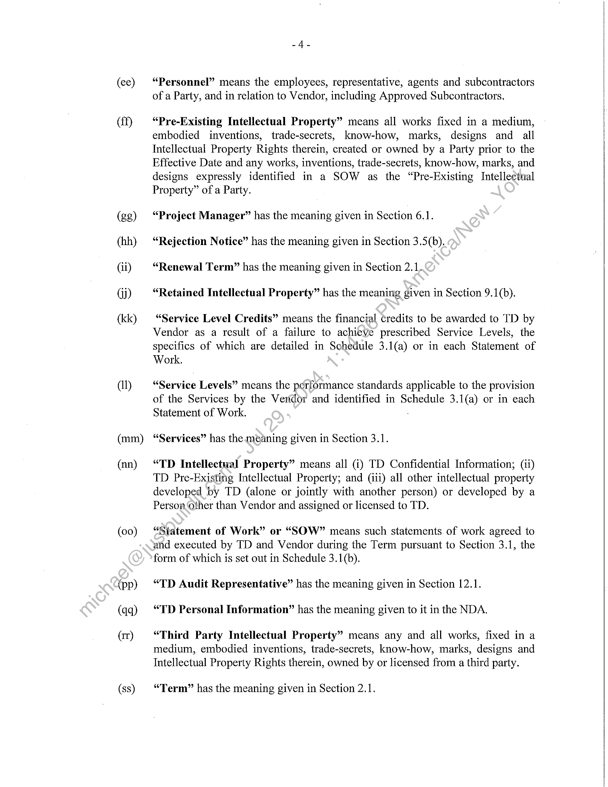
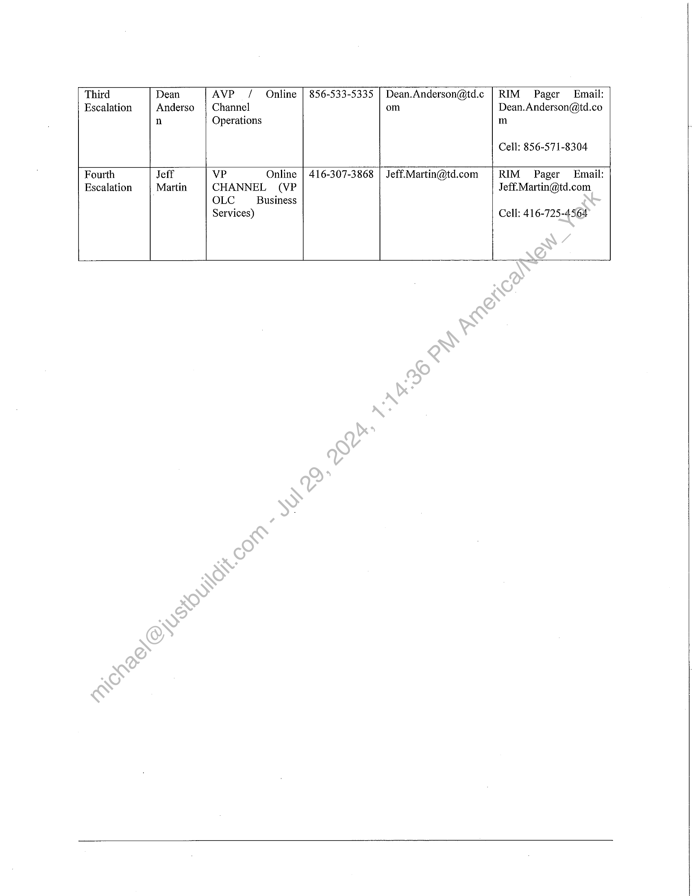
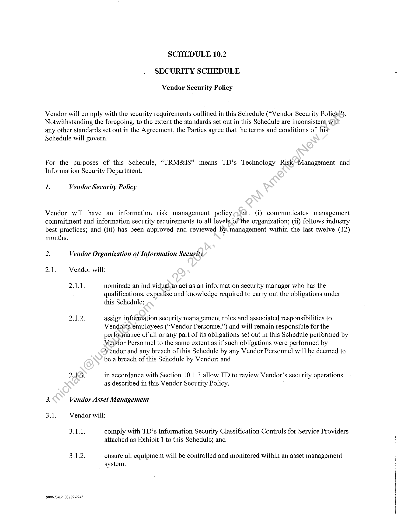
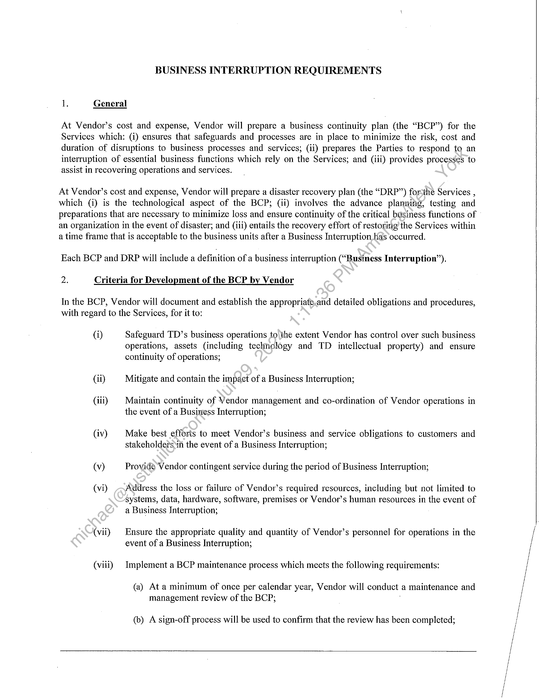

##### Master Services Agreement]

  
````col
```col-md
flexGrow=.5
===
> [!info] [Page 1](_attachments/images_TD-Canada-3.6.1.17.220130801_MODTDCanadaMSA.pdf_210221/page_1.png)
> 
```  
```col-md
THIS MASTER SERVICES AGREEMENT is made as of the Ist day of May
2013 (the “Effective Date”)  
BETWEEN:
The Toronto-Dominion Bank, a Canadian chartered Bank
(“<TD”)
- and Markit On Demand, Inc., a corporation governed by the laws\of Delaware,  
(“Vendor”)  
RECITALS:
A. Vendor or Vendor Affiliates provide professional services and information technology products  
and services (including business process and outsourcing services); and  
B. Vendor has agreed to provide to TD the-Seivices (including the Custom Deliverables) in  
accordance with the terms and conditions of this Agreement.  
NOW THEREFORE, in consideration ofthe mutual covenants contained herein and other good
and valuable consideration (the receipt, and sufficiency of which are hereby acknowledged),
Vendor agrees to provide to TD and\its Affiliates the following Services, as defined herein, in
accordance with the following terms and conditions.  
ARTICLE 1
DEFINITIONS AND PRINCIPLES OF INTERPRETATION  
1.1 Definitions
Whenever used'in this Agreement, the following words and terms have the following meanings:  
(a) “Acceptance Testing” means the operation and testing of Custom
Deliverables, or any part thereof, in each case in accordance with those
acceptance tests and procedures which TD determines from time to time are
necessary to determine if the Custom Deliverables or any part thereof conform
to and performs in accordance with the applicable Specifications and
“Acceptance Test”, “Acceptance”, and “Accepted” shall have corresponding
meanings.  
(b) “Acceptance Testing Period” means, in respect of any Custom Deliverable  
(or part thereof), 30 days or such other period of time described as the
“Acceptance Testing Period” for such Custom Deliverable in a Project Plan, a  
9806734,2_ 00782-2245  
```
````
Notes:    
````col
```col-md
flexGrow=.5
===
> [!info] [Page 2](_attachments/images_TD-Canada-3.6.1.17.220130801_MODTDCanadaMSA.pdf_210221/page_2.png)
> 
```  
```col-md
@)  
(e)
(O
(g)  
(h)  
G@)
G)
(k)
d)  
ny)
(a)
(0)  
(p)  
-2-  
Change Order or as otherwise agreed by the Parties for such Custom
Deliverable (or part thereof) to be subject to Acceptance Testing.  
“Affiliates” means: (i) with respect to Vendor, any Person which, directly or
indirectly, controls, is controlled by, or is under common contro! with Vendor;
and (ii) with respect to TD (a) any entity which, directly or indirectly, controls,
is controlled by, or is under common control with TD and (b) First Nations
Bank of Canada.  
“Agreement” means this agreement, including all Statements of Work,
Schedules, Change Orders and all amendments or restatements as\ permitted,
and references to “Article” or “Section” mean the specified Article or Section
of this Agreement.  
“Approved Subcontractor” has the meaning given in Section 3.9.
“Assistance Period” has the meaning given in Sevtion 4.1(b).  
“Business Day” means any day, other than-a Saturday. or Sunday, on which
TD is open for commercial banking business’during normal banking hours.  
“Business Interruption” means. an event, whether anticipated or
unanticipated, including any event,of Force Majeure, which disrupts the normal
course of business operations within an organization.  
“Change” has the meaning given in Section 7.1(a).  
“Change Order” hasythe meaning given in Section 7.1(d).  
“Change Order Procedures” has the meaning given in Section 7.1(a).
“Commercially Reasonable Efforts” means taking such steps and performing
in sucha manner as a well managed business would undertake where such
busiriess was acting in a determined, prudent and reasonable manner to achieve
a@particular desired result for its own benefit.  
“Change Order Request” has the meaning given in Section 7.1(b).  
“Confidential Information” has the meaning given in the NDA.  
“Custom Deliverables” means any documentation prepared specifically for
TD or its Affiliates under this Agreement, such as designs, project plans, and
PDF reports, including any additions, modifications, updates, upgrades,
extensions or enhancements made, conceived or reduced to practice by Vendor,
its Affiliates or its subcontractors under this Agreement delivered to TD or its
Affiliates.  
“Dispute” has the meaning given in Section 17.1(a).  
```
````
Notes:    
````col
```col-md
flexGrow=.5
===
> [!info] [Page 3](_attachments/images_TD-Canada-3.6.1.17.220130801_MODTDCanadaMSA.pdf_210221/page_3.png)
> 
```  
```col-md
(q)
()  
(s)
1)  
(u)  
(v)
(w)  
(x)
(y)
(2)
(aa)
(bb)  
(ce)
(dd)  
-3-  
“Dispute Notice” has the meaning given in Section 17.1(a).  
“Dispute Resolution Procedures” means the procedures given in Section
17.1.  
“Escalation of Disputes” has the meaning given in Section 17.1(a).  
“Force Majeure” means an act of God, fire, casualty, flood, war, terrorism,
failure of public utilities, or any act, exercise, assertion or requirement of any
Governmental and Regulatory Authority, epidemic, public health emergency,
destruction of production facilities, insurrection or any other sirailar cause
beyond the reasonable control of a Party.  
“Governmental or Regulatory Authority” means: (i)-any government,
agency, commission, board, tribunal, dispute settlement.panel or body, bureau,
official, minister, or court or other law, rule or regulation-making entity; and
(ii) any regulatory authority, self-regulatory organization or other entity having
jurisdiction over TD, Vendor or the Services, ineluding OSFI, Interac, Visa and
other card associations.  
“Initial Term” has the meaning given in’Section 2.1.  
“Intellectual Property Rights” means any and all rights, on a world-wide
basis, provided under: (a) patent law; (b) copyright law; (c) trade-mark law
(including goodwill); (d) industrial design law; (e) any other statutory provision
or common law principl©applicable to this Agreement, including trade secret
law (including know-how); and (f) any and all registrations and licenses in
relation to the foregoing.  
“Key Personnel” has the meaning given in Section 6.1.  
“Markets and Research Services” has the meaning given to it in Section 3.1.
“NDA” has the meaning attributed to it in Section 10,1(a).  
“OSFI” means the Office of the Superintendent of Financial Institutions.
“Other Service Provider” means other third parties that supply hardware,
software, systems or other products or services to TD that may be related to the
Services or Custom Deliverables and project management, business process
and other consulting services.  
“Parties” means TD and Vendor, and “Party” means either one of them.
“Person” means any individual, bank, sole proprietorship, partnership, firm,  
entity, unincorporated association, unincorporated syndicate, unincorporated
organization, trust, or body corporate.  
```
````
Notes:    
````col
```col-md
flexGrow=.5
===
> [!info] [Page 4](_attachments/images_TD-Canada-3.6.1.17.220130801_MODTDCanadaMSA.pdf_210221/page_4.png)
> 
```  
```col-md
(ce)  
(ff)  
(gg)
(hh)
(ii)
Gi)
(kk)  
ql)  
(mm)  
(nn)  
(00)  
(pp)  
(qq)  
@)  
(ss)  
-4-  
“Personnel” means the employees, representative, agents and subcontractors
of a Party, and in relation to Vendor, including Approved Subcontractors.  
“Pre-Existing Intellectual Property” means all works fixed in a medium,
embodied inventions, trade-secrets, know-how, marks, designs and all
Intellectual Property Rights therein, created or owned by a Party prior to the
Effective Date and any works, inventions, trade-secrets, know-how, marks, and
designs expressly identified in a SOW as the “Pre-Existing Intellectual
Property” of a Party.  
“Project Manager” has the meaning given in Section 6.1.  
“Rejection Notice” has the meaning given in Section 3.5(b).  
“Renewal Term” has the meaning given in Section 2.1.  
“Retained Intellectual Property” has the meaning given in Section 9.1(b).  
“Service Level Credits” means the financial credits to be awarded to TD by
Vendor as a result of a failure to achieve prescribed Service Levels, the
specifics of which are detailed in Schedule 3.1(a) or in each Statement of
Work.  
“Service Levels” means the performance standards applicable to the provision
of the Services by the Vertdor and identified in Schedule 3.1(a) or in each
Statement of Work.  
“Services” has the meaning given in Section 3.1.  
“TD Intellectual Property” means all (i) TD Confidential Information; (ii)
TD Pre-Existitig Intellectual Property; and (iii) all other intellectual property
developed by TD (alone or jointly with another person) or developed by a
Person other than Vendor and assigned or licensed to TD.  
“Statement of Work” or “SOW” means such statements. of work agreed to
and executed by TD and Vendor during the Term pursuant to Section 3.1, the
form of which is set out in Schedule 3.1(b).  
“TD Audit Representative” has the meaning given in Section 12.1.  
“TD Personal Information” has the meaning given to it in the NDA.  
“Third Party Intellectual Property” means any and all works, fixed in a
medium, embodied inventions, trade-secrets, know-how, marks, designs and  
Intellectual Property Rights therein, owned by or licensed from a third party.  
“Term” has the meaning given in Section 2.1.  
```
````
Notes:    
````col
```col-md
flexGrow=.5
===
> [!info] [Page 5](_attachments/images_TD-Canada-3.6.1.17.220130801_MODTDCanadaMSA.pdf_210221/page_5.png)
> 
```  
```col-md
(t)  
(uu)
(vv)  
-5-  
“Transition” means the orderly, timely and efficient migration of Services,
software and data from Vendor to TD or another service provider, including the
performance by Vendor of the Transition Services, in accordance with the
timetable specified in the Transition Plan and Statement of Work.  
“Transition Plan” has the meaning given in Section 4.1(a).  
“Transition Services” has the meaning given in Section 4.1(b).  
1.2 Interpretation  
In this Agreement:  
(a)  
(b)  
()  
(d)  
©)  
1)  
(g)  
Assistance Period — Where there is a reference in this Agreement to: (i) an
obligation of Vendor to provide Services, grant right@to TD or otherwise
perform obligations; or (ii) a right to which TD is entitled during the Term, that
reference will, unless otherwise expressly stated, ‘include an obligation of
Vendor to provide such Services, grant such rights or otherwise perform such
obligations during the Assistance Period.  
Currency — Unless expressly provided“otherwise, all references to money
amounts are to the lawful currency of Canada.  
Including — Where the word) “including” or “includes” is used in this
Agreement, it means “including (or includes) without limitation”.  
No Strict Construction The language used in this Agreement is the language
chosen by the Parties\to express their mutual intent, and no rule of strict
construction will be-applied against any Party.  
Remedies Cumulative — Unless otherwise expressly stated herein, all rights
and remedies of TD under this Agreement are in addition to TD’s other rights
and remédies and are cumulative, not alternative.  
Technical Terms — Any capitalized term used in this Agreement that is not
defined in Section 1.1 or elsewhere in this Agreement will have the generally
accepted industry or technical meaning given to such term.  
Time Periods — Unless otherwise specified, time periods within or following
which any payment is to be made or Notice is to be given will be calculated by
excluding the day on which the period commences and including the day on
which the period ends and by extending the period to the next Business Day’
following if the last day of the period is not a Business Day. When a Party has
a right to performance by the other Party or a right to terminate this Agreement
as of a particular date, that right may be enforced or exercised notwithstanding
any principles of equity, and the Party will be entitled to that performance or to
terminate this Agreement on or after such date.  
```
````
Notes:    
````col
```col-md
flexGrow=.5
===
> [!info] [Page 6](_attachments/images_TD-Canada-3.6.1.17.220130801_MODTDCanadaMSA.pdf_210221/page_6.png)
> 
```  
```col-md
1.3. Entire Agreement  
This Agreement, together with any Statement of Work, and any amendment thereof, constitutes
the entire agreement between the Parties pertaining to the subject matter of this Agreement and
supersedes all prior agreements, understandings, negotiations and discussions, whether oral or
written of any of the parties in respect of the subject matter hereof. There are no conditions,
representations, warranties or other agreements between the Parties in connection with the
subject matter of this Agreement, whether oral or written, express or implied, statutorycor
otherwise, except as specifically set out in this Agreement. ;  
1.4 Schedules  
The schedules to this Agreement listed below are an integral part of this Agreement:  
Schedule Description  
Schedule 3.1 (a) Markets and Research Services
Schedule 3.1 (b) Form of Statement of Work
Schedule 10.2 Security Schedule  
Schedule 11.1 Business Interruption Requirements  
1.5 Order of Priority  
In the event of any inconsistency between any Of the provisions of the main terms and conditions
of this Agreement and any Statement of~Work and/or Schedules, the inconsistency will be
resolved by reference to the following descending order of priority: (i) Articles 1 through 19 of
this Agreement; (ii) the Schedules antiexed to this Agreement; and (iii) the applicable Statement
of Work. ‘  
ARTICLE 2
TERM  
2.1 Term  
This Agreement ywill commence on May 1, 2013 and will continue thereafter for an initial term
of two (2)years (“Initial Term”) unless terminated earlier by TD or Vendor in accordance with
the termsof this Agreement. This Agreement will renew automatically for additional one (1)
year terms (each a “Renewal Term”) unless TD provides notice no less than ninety (90) days
prior to the end of the Initial Term or then current Renewal Term. The Initial Term, any
Renewal Terms and any Assistance Period are collectively, the “Term”.  
```
````
Notes:    
````col
```col-md
flexGrow=.5
===
> [!info] [Page 7](_attachments/images_TD-Canada-3.6.1.17.220130801_MODTDCanadaMSA.pdf_210221/page_7.png)
> 
```  
```col-md
3.1 General
(a)  
(b)  
(c)  
-7-  
ARTICLE 3
SERVICES  
Subject to the terms and conditions of this Agreement, TD hereby retains
Vendor, and Vendor hereby accepts such retainer, to perform services for and
on behalf of TD and its Affiliates as set out in Schedule 3.1 (a) (the “Markets
and Research Services”) (the “Services”) and the preparation and delivery to
TD of Custom Deliverables, all as are more particularly set out in one or more
Statements of Work. Changes to the Service or an existing Statement of Work
will be made in accordance with the Change Order Procedures:  
Other than as specified in Schedule 3.1(a) or a Statement.of Work, each of the
Services will include the provision of all equipment} software, systems,
documentation, facilities, personnel and other resources used or required to be
used in order to provide such Services, whetlter or not such equipment,
software, systems, documentation, facilities, personnel or other resources are
expressly described in this Agreement.  
Vendor will provide the initial trainingand ongoing support services specified
in Schedule 3.1(a) in each Statement of Work.  
3.2 No Exclusivity  
Except as may be expressly agreed to the Contrary in Schedule 3.1(a) or any Statement of Work,
this Agreement in no way confers any rights or benefits of exclusivity on Vendor, or limits or
prohibits TD from performing itselfsorusing any Person other than Vendor to provide, services
that are substantially similar to, or that interface with, all or any part of the Services.  
3.3 Cooperation and Coordination  
(a)  
Vendoracknowledges that TD has entered into agreements and may in its
discretion enter into additional agreements with Other Service Providers, and
that the performance by such Other Service Providers of their obligations and
the operation, support, maintenance and use of the hardware, software, systems,
products or services of such Other Service Providers and the integration,
interface and communication with the Services or Custom Deliverables may
require the cooperation and assistance of Vendor. At TD’s request, Vendor
will cooperate with and assist the Other Service Providers in order to
coordinate.the performance by each Other Service Provider of its obligations
with the performance of the obligations of Vendor, including: (i) making
available and providing information to TD and the Other Service Providers
regarding the Services; and (ii) cooperating with TD and the Other Service
Providers to develop interfaces between the Custom Deliverables and the
hardware, software and systems owned by or operated on behalf of TD. Upon  
```
````
Notes:    
````col
```col-md
flexGrow=.5
===
> [!info] [Page 8](_attachments/images_TD-Canada-3.6.1.17.220130801_MODTDCanadaMSA.pdf_210221/page_8.png)
> 
```  
```col-md
(b)  
-8-  
review and approval by TD, additional costs to be charged by Vendor will be
communicated to Other Service Providers and TD prior to incurring costs.  
If compliance with the obligations set forth in Section 3.3(a) would require the
disclosure of Confidential Information of Vendor to Other Service Providers,
Vendor may require the Other Service Providers to. execute confidentiality
agreements with Vendor, on reasonable terms.  
3.4 Provision of Services to TD Affiliates  
Upon TD’s request, Vendor will provide the Services or any part of the Services\to’any TD
Affiliate in accordance with this Agreement. Vendor and such TD Affiliate willenter into a
Statement of Work governing such services. If a TD Affiliate is receiving any Services or is
granted any rights as contemplated in this Section 3.4, a reference to TD will refer to such TD
Affiliate to the extent that such term or condition applies to such TD Affiliate’s receipt of the
Services or grant of such rights.  
3.5 Acceptance or Rejection of Custom Deliverables or Services  
ic)  
(b)  
()  
Unless otherwise agreed upon in a Statement of Work, the Acceptance Testing
provisions in this Section 3.5 will be applicable to Custom Deliverables.  
Following receipt of any Custom|Deliverable (or part thereof) TD may conduct
Acceptance Testing during the Acceptance Testing Period, and will notify
Vendor in writing whether TD accepts or rejects such Custom Deliverable (or
part thereof) during such»Acceptance Testing Period. TD may reject, by
delivering notice to\Vendor in writing (each, a “Rejection Notice”), any
Custom Deliverable-which does not materially conform to or perform in
accordance with the requirements set forth in the Statement of Work. If TD
delivers to Vendor a Rejection Notice, then TD may, in its sole discretion,
require that Vendor promptly make, at its sole cost and expense, all necessary
cotrections, repairs, fixes, modifications, or additions to or replacements of all
or any-part of the Custom Deliverable so that it materially conforms to and
petforms in accordance with the Statement of Work. In addition, if TD issues
three Rejection Notices for any Custom Deliverable, then TD may terminate
the applicable Statement of Work, in whole or in part.  
If the Custom Deliverables are delivered in modules pursuant to a Statement of
Work, TD will have the right to conduct a final Acceptance Test on the entire
Custom Deliverable following Acceptance Testing of the last module to be
delivered. If any module, including the final module, is not accepted, TD will
have the right to reject the module being tested, and any modules which had
previously been accepted, if the utility of such modules and/or the Custom
Deliverables in its entirety are, in the reasonable opinion of TD, dependent on
the module which is not accepted and, without prejudice to any rights or
remedies of TD, Vendor shall be required to make, at its sole cost and expense,
all necessary corrections, repairs, fixes, modification, or additions to or  
```
````
Notes:    
````col
```col-md
flexGrow=.5
===
> [!info] [Page 9](_attachments/images_TD-Canada-3.6.1.17.220130801_MODTDCanadaMSA.pdf_210221/page_9.png)
> 
```  
```col-md
-9-  
replacement of any module(s) such that all modules perform in accordance with
the requirements set forth in the Statement of Work.  
3.6 Premises and Assets  
Vendor will not use TD’s premises for any purpose other than for providing the Services and will
observe and cause its Personnel to comply with TD’s policies and guidelines provided to Vendor
regarding access to the computer network, security procedures, use of TD’s equipment :and
assets, facilities and personnel, assigned parking, conduct, and health and safety while present in
or on TD’s premises. Upon termination of this Agreement, Vendor will surrender any such
premises, assets, fixtures and equipment used or occupied by it in good repair and cofidition.  
3.7 Location of Services and Maintenance of Records  
Vendor will ensure that, unless specifically contemplated in Schedule 3.1(a) or a Statement of
Work or otherwise agreed by TD in writing, at all times during the-ferm: (a) the hardware,
software systems, facilities and Personnel used by Vendor or Approved Subcontractors to
provide the Services will be physically located at 5718 Central Avenue, Boulder, CO 80301; and
(b) all TD Confidential Information will be physically locateddin, or on media that is physically
stored in, Canada or the United States, and will not be accessible or processed outside of Canada
or the United States.  
3.8 Reporting  
Vendor will deliver to TD the reports specified/in Schedule 3.1(a) or in each Statement of Work
(with the frequency set out therein). At a minimum, upon request Vendor will provide sufficient
information to TD to enable TD to assess Vendor’s performance of the Services.  
3.9 Approved Subcontractors  
(a) Vendor acknowledges that it is the prime contractor responsible for the
performance of all Services under this Agreement. Vendor will not engage any
subcontractor in the performance of any of its obligations hereunder (other than
individuals retained by Vendor from time to time in the ordinary course of
business as contract personnel) without the prior written consent of TD.  
(b) In the event TD approves in writing a proposed subcontractor, such
subcontractor will be deemed an “Approved Subcontractor”.  
(c) The subcontracting of all or any part of Vendor’s obligations set out in this
Agreement to an Approved Subcontractor will not relieve Vendor from any
obligation or liability under this Agreement. Any breach of this Agreement by
any an Approved Subcontractor will be deemed to be a breach of this
Agreement by Vendor.  
(d) Vendor will ensure that it has an agreement with an Approved Subcontractor
that contains, at a minimum, terms and conditions that are substantially similar  
```
````
Notes:    
````col
```col-md
flexGrow=.5
===
> [!info] [Page 10](_attachments/images_TD-Canada-3.6.1.17.220130801_MODTDCanadaMSA.pdf_210221/page_10.png)
> 
```  
```col-md
()  
@  
-10-  
to Sections 3.7 (Location of Services and Maintenance of Records in Canada),
Section 3.9 (Approved Subcontractors), Article 10 (Confidentiality, Privacy
and Security), Article 11 (Business Interruption), Article 12 (Audit) of this
Agreement and that enable Vendor to comply with its obligations under this
Agreement.  
If Vendor becomes aware of any actual or suspected breach of its subcontract
that may affect the ability of Vendor to perform its obligations under this
Agreement in a material respect, or if Vendor reasonably believes that-aiay-such
breach may occur, Vendor will immediately notify TD in writing and provide
TD with such information relating to such breach or alleged breachas TD may
request. At TD’s request, Vendor will terminate the subcontract with the
Approved Subcontractor that has committed any such breaeiand that has not
cured such breach in accordance with the termination provisions set forth
therein. :  
In the event that TD exercises any right to revoke consent to an Approved
Subcontractor for its convenience and not as‘a result of a material breach in
performance by Vendor or the Approved Subcontractor: (i) TD will reimburse
Vendor for all reasonable pre-approved)costs incurred by Vendor in order to
replace such hosting Vendor and migrate the Services; and (ii) TD will hold
Vendor harmless from any downtime or unavailability of the Services resulting
from such migration.  
ARTICLE 4
TRANSITION SERVICES  
4.1 Transition Services  
(a)  
Upon request‘by TD, Vendor and TD will jointly develop a detailed plan for
the Transition of Services from Vendor to TD or an Other Service Provider (the
“Transition Plan”) for each Statement of Work or alternatively in a separate
Statement of Work that will provide for the orderly wind-down and transfer of
Services and, as applicable, associated assets, agreements and employees
dédicated to TD or an Other Service Provider upon the termination or
expiration of such Statement of Work or this Agreement. The Transition Plan
will: (i) describe the overall approach with respect to the transition of the
Services from Vendor to TD or an Other Service Provider designated by TD;
(ii) identify and assign responsibility for the performance of all necessary
transition-related activities, including the return of data and records if any
relating to data processing in a format acceptable to TD and any resources; and.
(iii) identify a projected completion date for the Transition Services. Vendor
will be responsible for providing to TD a draft of the initial Transition Plan for
TD’s review and approval. Vendor will incorporate any reasonable comments
or suggestions made by TD into the draft Transition Plan. Using the Change
Order Procedures, the Parties may subsequently amend the Transition Plan at  
```
````
Notes:    
````col
```col-md
flexGrow=.5
===
> [!info] [Page 11](_attachments/images_TD-Canada-3.6.1.17.220130801_MODTDCanadaMSA.pdf_210221/page_11.png)
> 
```  
```col-md
(b)  
-ll-  
any time, and from time to time, before or during the Transition Period, to
reflect any necessary or desirable changes.  
For such period as TD may reasonably require, up to a maximum of twelve
(12) months after the date of termination or expiry of this Agreement (the
“Assistance Period”) Vendor will provide the following transition assistance
services (the “Transition Services”): (i) continue to perform the Services in
accordance with this Agreement at the rates set out in the applicable Statement
of Work; and (ii) perform the obligations specified in the Transition Planat the
time and materials rates set out in the applicable SOW (or if no time and
materials rates are set out in the applicable SOW, at Vendor’s then standard
rates for such services). During the Assistance Period, TD mayterminate all or
part of the Transition Services on thirty (30) days written notice’to Vendor.  
Without limiting Sections 4.1(a) and (b), and in consultation with TD, Vendor
will use its reasonable, commercial efforts to ‘minimize: (i) the period
applicable to Transition activities; (ii) the costsMo TD in connection with
Transition; and (iii) any adverse impact on thé<ongoing business or operations
of TD, the Services or the Service Levels during Transition.  
ARTICLE 5
PERFORMANCE STANDARDS  
5.1 Service Levels  
Without limiting the requirements otherwise set forth in this Agreement, at all times during the
Term, Vendor will perform the Services so“as to meet or exceed the Service Levels.  
5.2 Failure to Meet Service Levels  
(a)  
(b)  
If Vendor fails to meet a Service Level, Vendor will: (i) investigate, assemble
and presérve pertinent information with respect to, and report on the causes of,
the problem; (ii) advise TD of the status of remedial efforts being undertaken
with-respect to such problem; (iii) notify TD of the steps which Vendor
believes should be taken to correct the problem; (iv) promptly correct the
problem and begin meeting the Service Levels; and (v) take appropriate
preventative measures so that the problem does not recur.  
Vendor acknowledges that its failure to meet the Service Levels may have a
material adverse impact on the business and operations of TD and that the
damage from Vendor’s failure to meet a Service Level is not capable of precise
determination. Accordingly, in the event that Vendor fails to meet Service
Levels (for reasons other than circumstances that constitute a Force Majeure
under this Agreement), then in addition to any non-monetary remedies
available to TD under this Agreement, at law or in equity, TD may elect, in lieu
of pursuing other monetary remedies, to recover as its sole and exclusive
monetary remedy for such failure to meet Service Levels the Service Level  
```
````
Notes:    
````col
```col-md
flexGrow=.5
===
> [!info] [Page 12](_attachments/images_TD-Canada-3.6.1.17.220130801_MODTDCanadaMSA.pdf_210221/page_12.png)
> 
```  
```col-md
-12-  
Credits as liquidated damages. This Section 5.2 will not limit TD’s rights with
respect to the events upon which TD may rely as a basis for TD’s termination
of this Agreement for cause.  
5.3 New Service Levels  
Vendor will cooperate with TD to mutually establish any additional Service Levels applicable to
any new Services or Services modified pursuant to a Change Order or additional Statement-of
Work which do not have a Service Level.  
5.4 Periodic Reviews  
On or about twelve (12) months following the date upon which Vendorcommences the
performance of Services as set out in Schedule 3.1(a) or under any Statement of Work, and at
least annually thereafter, each Party’s Project Manager for such Services.will review the Service
Levels applicable to the respective Statement of Work or Schedule;31(a), and will-make any
mutually agreed-upon adjustments to them, as appropriate, to reflect improved performance
capabilities associated with advances in the technology, processes and methods which are
available to perform the Services.  
5.5 Service Level Reporting  
Vendor will deliver to TD, with the frequency as set.out in Schedule 3.1(a) or as required in each
Statement of Work, detailed and complete weports (including, at TD’s request, executive
summaries and associated raw data upon which such reports are based) sufficient to enable TD
to: (i) compare Vendor’s actual performance against that specified in each of the Service Levels;
and (ii) confirm the calculation and reconciliation of Service Level Credits.  
ARTICLE 6
GOVERNANCE  
6.1 Project Manager, Key Personnel and Arrangement Governance  
For Statements of Work for software development Services, Vendor will designate an employee
as its project manager (cach, a “Project Manager”) who will act as the primary contact for
Vendor with respéct to all matters relating to the applicable Statement of Work, along with such
other employees to fulfill functions agreed by the Parties as useful in order to effectively manage
the Services performed under such Statement of Work. Vendor’s Project Manager will be
responsible for the day-to-day management of the ongoing tasks and activities involved in the
performance of the Services. In each Statement of Work, Vendor will also identify the
designated Personnel (together with the Project Manager, the “Key Personnel”) who will be
assigned to perform Vendor’s obligations under such Statement of Work. Vendor will ensure
Key Personnel have the qualifications, expertise and knowledge required to carry out the
obligations under the Statement of Work and will use reasonable efforts to ensure such Key
Personnel are not replaced for the duration of the Statement of Work. At TD’s request, if TD,
acting reasonably, concludes that a Key Personnel’s performance is having a negative impact on
the Services, Vendor agrees to replace such Key Personnel as soon as reasonably possible and  
```
````
Notes:    
````col
```col-md
flexGrow=.5
===
> [!info] [Page 13](_attachments/images_TD-Canada-3.6.1.17.220130801_MODTDCanadaMSA.pdf_210221/page_13.png)
> 
```  
```col-md
-13-  
such replacement will have the qualification, expertise and knowledge to perform at the same
level as the replaced personnel. Vendor’s Project Manager will meet regularly with TD to report
on progress to TD and compliance with Service Levels, delivery of Custom Deliverables,
timetables, and to identify and resolve issues, and the frequency of such reporting meetings may
be set out more particularly in a Statement of Work.  
ARTICLE 7
CHANGE MANAGEMENT  
7A Change Management Process  
(a)  
(b)  
©)  
(d)  
From time to time during the Term, either Vendor or TD mayewish to request
changes, modifications or enhancements (each, a “Change”) to the Services.
The process by which Changes will be requested, negotiated, approved and
implemented, and terms of payment for Changes will bein accordance with the
procedures set out in this Article 7 (Change Management) (the “Change
Order Procedures”).  
TD may request a Change to the Services,by delivering a written notice (the
“Change Order Request”) to Vendor specifying the proposed Change and the
reason TD is requesting the proposed Change. Within seven (7) Business Days
after Vendor’s receipt of the Change Order Request, Vendor will deliver to TD
a written response to the Change Order Request (the “Change Order
Response”) The Change Order’ Response must include sufficient details to
enable TD to assess the atiticipated impact of the Change, including a
description of how andowhen the Change would be implemented, the effect or
the Change, if any, onthe Services an analysis of the risk, a statement of fees
proposed to be chatged (including one time and ongoing fees) and any other
details reasonably requested by TD. If Vendor cannot deliver a Change Order
Response within such seven (7) Business Day period, Vendor will deliver a
statement setting out the date by which Vendor will, deliver the Change Order
Response:  
Véndor will not refuse to issue a Change Order Response to any Change Order
Request unless Vendor does not possess the technical skills to implement the
proposed Change. .  
If after receiving the Change Order Response TD desires to make such Change,
then TD will provide written direction to Vendor (a “Change Order”) to
authorize making the Change in accordance with the terms of the Change Order
Response.  
Vendor will not implement any Change without the prior written approval of
TD and the execution of a Change Order. A Change Order will not be effective
unless it has been executed by the Project Managers or such other
representatives identified in the applicable Statement of Work.  
```
````
Notes:    
````col
```col-md
flexGrow=.5
===
> [!info] [Page 14](_attachments/images_TD-Canada-3.6.1.17.220130801_MODTDCanadaMSA.pdf_210221/page_14.png)
> 
```  
```col-md
7.2  
(f)  
(g)  
-14-  
A Change Order will not amend Articles 1 through 19 of this Agreement unless
the Change Order expressly states that it is intended to amend this Agreement
and identifies the specific amendments to be made.  
Vendor may request a Change by delivering a Change Order Request and a
Change Order Response which contains information required by Sections
7.1(a) and 7.1(b).  
Introduction of Changes by Vendor  
Vendor will ensure that: (a) there are adequate procedures in place to facilitate-the orderly
introduction of Changes agreed to in accordance with the Change Order Procedures into the
Services and/or TD’s environment; and (b) all Changes will be made inca) controlled and
documented manner.  
7.3  
8.1  
Fees  
Determination of Pricing for Changes  
7.3.1 Vendor will make all Changes at no cost to TD unless otherwise agreed in
writing.  
7.3.2 For Changes requested by TD that are required to be made in accordance with the
Change Order Procedures Vendor may charge TD as follows:  
(a) Vendor will prepare Chanige Order Responses for Changes requested by
TD at no charge to TD;  
(b) for (i) any Change required to comply with applicable law and which
Vendor estimates thatit can perform in five (5) or less business days of effort;
or (ii) any other Change required by Vendor to enable Vendor to comply with
its obligationsunder this Agreement, Vendor will make such Change at no
charge to TD; and  
(c) fotany Change required to comply with any TD policy or any amendment
thereto (other than Changes required to be made by Vendor as a result of an
amendment to a TD policy that is made by TD in order to comply with
applicable law, which Vendor will make in accordance with Section 7.3.2
(b)), Vendor will be entitled to charge TD at the rate of $175 USD per hours
for actual hours worked.  
ARTICLE 8
PAYMENT TERMS  
Vendor will perform the Services and deliver the Custom Deliverables for the fees set forth in
Schedule 3.1(a) or each Statement of Work (the “Fees”).  
```
````
Notes:    
````col
```col-md
flexGrow=.5
===
> [!info] [Page 15](_attachments/images_TD-Canada-3.6.1.17.220130801_MODTDCanadaMSA.pdf_210221/page_15.png)
> 
```  
```col-md
-15-  
8.2 Taxes  
The Fees will exclude all applicable taxes and TD will pay and Vendor will remit same to all
applicable taxing authorities as required by law. If the applicable sales tax in any of the
provinces is harmonized with GST after the Effective Date, then, to the extent that the prices or
rates include as a component any direct or indirect costs to Vendor comprising provincial sales
or use tax which, as a result of the harmonization, is reduced or eliminated, the Fees set out in
this Agreement will be reduced by an amount equal to the direct or indirect costs to Vendor that
are reduced or eliminated as a result of the harmonization, effective as those reductions occur.  
8.3 Currency
All fees will be invoice in US dollars.
8.4 Invoicing  
(a) Vendor will invoice TD on the dates set out\in Schedule 3.1(a) or the
applicable Statement of Work, and each such ifivoice will: (i) contain a unique
invoice’ number; (ii) be accompanied byyany documentation and other
information as may be reasonably required by TD to verify that Vendor’s
charges are accurate, correct and valid and are in accordance with this
Agreement; and (iii) be delivered to the address set forth in Schedule 3.1(a) or
the applicable Statement of Work{  
(b) Subject to verification by TD/of the validity of the charges, TD will pay the
invoiced amount withinCthirty (30) days of receipt of the invoice and the
relevant documents to allow TD to process for payment. TD will not be
responsible for any ‘interest on the disputed portion of the payment it withholds.  
(c) Overtime hours, overtime rates, and work performed during statutory holidays
must be approved in writing by TD prior to the initiation of work. If such
approvals not obtained, regular hourly rates will be payable for this time.
Regularhours will be calculated as forty (40) hours during a business week.  
(d) FD will not be responsible to pay Vendor: (i) any additional fees or expenses
not specifically enumerated in this Agreement, including any Statement of
Work or Change Order without having given its prior written approval to any
such fee or expense; or (ii) any invoices issued to TD later than ninety (90)
days following the month in which the Services were provided.  
8.5. Disputed Amounts  
TD may withhold payment of amounts that TD disputes in good faith (including an amount for
which payment has been previously made) if TD provides notice to Vendor within forty-five (45)
days of receipt of invoice (or promptly upon becoming aware of such Dispute for a previously
paid amount). In such circumstances, the Parties will promptly meet and will attempt in good
faith to resolve any such Dispute promptly. If the Dispute cannot be resolved by the Parties  
```
````
Notes:    
````col
```col-md
flexGrow=.5
===
> [!info] [Page 16](_attachments/images_TD-Canada-3.6.1.17.220130801_MODTDCanadaMSA.pdf_210221/page_16.png)
> 
```  
```col-md
-16-  
within thirty (30) days of notification by TD, such Dispute will be escalated for resolution
pursuant to the Dispute Resolution Procedures and that process will determine whether the
disputed charges will be paid by TD.  
8.6 Setoff and Credits  
TD may, upon notice, set off any payments required to be made by TD to Vendor against: (i) any
liquidated amounts owing by Vendor to TD as Service Level Credits; (ii) any costs incurred-by
TD in collecting any amounts owing by Vendor to TD; or (iti) any amounts owing by Vendor to
TD under any other Agreement. If TD is entitled to a refund or credit under this Agreement,
Vendor will credit such amount against the following calendar month’s invoiced-amounts and
will deliver to TD a credit note that indicates the credit, its amount and thesSection of this
Agreement or Statement of Work pursuant to which the credit entitlement arose» If the refund or
credit is larger than the following calendar month’s amount, the residual amount will be credited
against successive future invoices; provided, however, that if credit amounts are outstanding at
the termination or expiration of the applicable Statement of Workj>Vendor will refund such
outstanding credit amounts within thirty (30) days of the date of termination or expiration of the
Statement of Work or this Agreement.  
ARTICLE 9
INTELLECTUAL PROPERTY RIGHTS  
91 Ownership and License  
(a) Except for Vendor’s Pre-Existing Intellectual Property and Third Party
Intellectual Property which*may form part of a Custom Deliverable, Vendor
hereby irrevocably assighs and transfers and agrees to irrevocably assign and
transfer to TD without further consideration, all world-wide right, title and
interest, in perpettity, including all Intellectual Property Rights in and to each.
Custom Deliverable immediately upon creation of such Custom Deliverable
and has caused or will cause its Personnel to assign and transfer same. TD
shall bearthe expense of such assignation and transfer, if any. Vendor has
caused*or will cause its Personnel to waive all moral rights they may have in
eath Custom Deliverable. Any works of authorship subject to copyright law in
the foregoing assigned and transferred Custom Deliverables shall first be
deemed “works made for hire” and failing such designation, shall be assigned
and transferred to TD pursuant to the assignment and transfer set out above.  
(b) — Except for the license set out below, Vendor will retain all of its right, title and
interest in and to Vendor’s Pre-Existing Intellectual Property. To the extent
that a Custom Deliverable contains or utilizes Vendor’s Pre-Existing
Intellectual Property, unless Third Party Intellectual Property is identified in a
Statement of Work for TD to license separately, such Third Party Intellectual
Property or any combination thereof (collectively, “Retained Intellectual
Property”), Vendor hereby grants to TD and its Affiliates a royalty-free,
irrevocable and perpetual (unless terminated pursuant to Section 18.2 (b)),
world-wide, non-exclusive license (including the right to sub-license) to make,  
```
````
Notes:    
````col
```col-md
flexGrow=.5
===
> [!info] [Page 17](_attachments/images_TD-Canada-3.6.1.17.220130801_MODTDCanadaMSA.pdf_210221/page_17.png)
> 
```  
```col-md
9.2  
10.1  
10,2 Security  
(©)  
-17-  
use, sell, repair, copy, publish, modify, disclose and communicate by electronic
means such Pre-Existing Intellectual Property consisting solely of
documentation, designs, project plans, or PDF reports, as may be reasonably
necessary for TD and its Affiliates to use the Custom Deliverables as intended
solely for TD’s and its Affiliates’ business purposes. :  
Vendor agrees to cooperate fully at all times and will cause its Personnel to
cooperate fully at all times, with respect to signing such documents and doing
such acts and other things reasonably requested by. TD to protect ~-TD’s
Intellectual Property (as defined below) and to confirm the transfer of
ownership rights in the Custom Deliverables. TD shall bear the-expense of
such assignation and transfer, if any.  
TD Intellectual Property  
TD hereby grants Vendor a royalty-free, non-exclusive, revocable license for the term of
each Statement of Work to use TD’s Intellectual Property. solely for the purpose of
providing the Services. Vendor acknowledges and agrees that, except as expressly set
out herein, it does not have and will not acquire any right, title or interest in or to any TD
Intellectual Property.  
ARTICLE 10
CONFIDENTIALITY, PREVACY AND SECURITY  
Confidentiality and Privacy  
(a)  
(b)  
The Parties agree to be\bound by the terms of the Nondisclosure Agreement
dated January 29, 2013 between the Parties (the “NDA”).  
Each Party acknowledges that the other Party may currently or in the future be
developing-information internally, or receiving information from other parties,
that is similar to the Confidential Information. Accordingly, this Agreement
does ‘not prohibit the other Party from developing or having developed for it
any products, concepts, systems or techniques that are similar to or compete
with the products, concepts, systems or techniques contemplated by or
containing or based upon the Confidential Information, provided that the Party
does not violate any of its obligations under this Agreement in connection with
such development.  
Vendor will comply with the security requirements set out in Schedule 10.2 (Security Schedule).
In addition, the Parties will describe any additional security requirements that are particular to
the Services to be performed under any Statement of Work in such Statement of Work. Without
limiting Vendor’s obligations hereunder, Vendor will take appropriate steps to identify security
breaches.  
```
````
Notes:    
````col
```col-md
flexGrow=.5
===
> [!info] [Page 18](_attachments/images_TD-Canada-3.6.1.17.220130801_MODTDCanadaMSA.pdf_210221/page_18.png)
> 
```  
```col-md
-18-  
ARTICLE 11
BUSINESS INTERRUPTION PLANNING  
11.1 Business Interruption Planning  
(a) Vendor will comply with the Business Interruption requirements set forth in
Schedule 11.1 to ensure the continuation of the Services in the event of a
Business Interruption.  
(b) The Parties will describe any additional Business Interruption, disaster
recovery, business continuity planning and testing requirements’ that are
particular to the Services to be performed under any Statement.ofWork in such
Statement of Work.  
(c) Vendor will immediately report to TD: (i) any significant:changes to Vendor’s
Business resumption and contingency plans; and (ii),any event that may have
the potential to materially affect the delivery of ‘the Services or result in TD
losses.  
(d) Upon request by any Governmental or Regulatory Authority TD may provide a
summary of any Business Interruption/disaster recovery test results provided
by Vendor to TD in connection withthis Agreement to such Governmental or
Regulatory Authority.  
ARTICLE 12
AUDIT  
12.1 Audit  
During the Term and for the period Vendor is required to maintain records hereunder, TD, any
Governmental or Regulatory Authority, and/or any internal or external audit representative
acting on behalf of TD (the “TD Audit Representatives”) will have the right, and Vendor will
provide access to TD,-TD Audit Representatives and Governmental or Regulatory Authorities,
during regular business hours (and in the case of Governmental or Regulatory Authority, at any
time required by suth Governmental or Regulatory Authority), and upon 48 hours notice in
writing to Vendor (except in the event of audits by regulatory authorities, investigations of
claims of misappropriation, fraud or business irregularities of a potentially criminal nature, or for
emergencydype audits to address material operational problems and issues that pose a significant
threat to-T'D’s interest, which may be conducted at any time as required and without satisfying
the notice requirement if TD, acting reasonably, believes that any of the foregoing has occurred),
to audit and inspect: (i) any facility or part of a facility at which Vendor or an Approved
Subcontractor is providing the Services; and (ii) data, records, documents, personnel and other
information of either Vendor or an Approved Subcontractor relating to the Services located
anywhere in order to verify: (A) the performance by Vendor of its obligations under this
Agreement; (B) the internal control environment of Vendor or an Approved Subcontractor as it
relates to the Service; (C) the security and integrity of TD Confidential Information, including  
```
````
Notes:    
````col
```col-md
flexGrow=.5
===
> [!info] [Page 19](_attachments/images_TD-Canada-3.6.1.17.220130801_MODTDCanadaMSA.pdf_210221/page_19.png)
> 
```  
```col-md
-19-  
without limitation, ID data (including customer, employee and third party information); and (D)
amounts paid by TD under the Agreement.  
12.2 Frequency  
TD and the TD Audit Representatives will not be entitled to more than one audit in any calendar
year in respect of each separate component of the Services or Vendor’s other obligations set out
in this Agreement, except that audits may be conducted more frequently as required\-by
Governmental or Regulatory Authorities, as otherwise required by applicable laws, \or as
reasonably required by TD and/or the TD Audit Representatives to conduct a follow-up audit to
a prior audit to address any issues identified in the prior audit.  
12.3 Audit Restrictions  
Notwithstanding the audit rights granted in this Article 12 (Audit), such rights do not entitle TD,
TD Audit Representatives and Governmental or Regulatory Authorities to have access to: (a)
information of other customers of Vendor; (b) Vendor’s costs of providing the services or any
internal charges, unless Vendor is charging ‘TD based on such ¢osts; (c) personal information of
Vendor employees; (d) time cards or records of employee time) if the Services are provided on a
fixed price basis; or (e) books, records or information unrelated to this Agreement or the
Services provided to TD.  
12.4 Governmental or Regulatory Authorities;Approved Subcontractors  
(a) Governmental or Regulatory/Authorities (or their representatives) have the
right to (i) exercise directly the audit rights granted to TD under this Article 12
(Audit); (ii) accompany TD (or any TD Audit Representative) when it exercises
its audit rights undeMthis Article 12 (Audit); (iii) access and make copies of, all
internal audit reports (and associated working papers and recommendations)
prepared by of for Vendor relating to the Services being performed under this
Agreement; and (iv) access any findings in the external audit of Vendor (and
associated» working papers and recommendations) prepared by or for Vendor
that relate to the Services, subject to the consent of Vendor’s external auditor to
sign appropriate confidentiality documentation.  
(b) Vendor will ensure that Governmental or Regulatory Authorities may exercise
their audit and inspection rights set forth in this Article directly against any
Approved Subcontractors. .  
(c) | Vendor will co-operate with and assist TD to meet its obligations to and
requests from Governmental or Regulatory Authorities from time to time.  
12.5 Infrastructure and Security Audits  
Vendor will, at its cost and discretion:  
```
````
Notes:    
````col
```col-md
flexGrow=.5
===
> [!info] [Page 20](_attachments/images_TD-Canada-3.6.1.17.220130801_MODTDCanadaMSA.pdf_210221/page_20.png)
> 
```  
```col-md
-20-  
(a) Conduct audits of or pertaining to the Services in such manner and at such
times as is consistent with the audit practices of well-managed operations
performing services substantially similar to Vendor’s obligations set forth in
this Agreement.  
12.6 Costs of Audit  
TD’s costs of any audit conducted in accordance with this Agreement (except where specifically
provided) will be borne by TD unless such audit reveals a discrepancy or overcharge by Vendor
in respect of a fee charged of at least 5% in respect of the period examined or a material, breach
of the Agreement, in which case TD’s costs of the audit will by borne by Vendors-If an audit
reveals an overpayment by TD, Vendor will promptly repay such overpaymenit-or reissue any
unpaid invoice containing an error, as applicable.  
12.7 Remediation  
If an audit conducted pursuant to this Agreement reveals any error; deficiency or other failure to
perform on the part of Vendor, Vendor will as soon as reasonably possible following the date on
which Vendor becomes aware of such error, deficiency or other failure to perform and, in any
event, no later than thirty (30) days following such date, deliver to TD a corrective action plan
that, if followed will correct the error, deficiency or other failure to perform and execute the
plan.  
12.8 Retention Period  
Until the later of: (i) seven years after expiration or termination of any Assistance Period; and (ii)
the date all pending matters relating.to’this Agreement (e.g. Disputes, tax assessments or
reassessments) are closed, Vendor will-maintain in Canada (or if a non-Canadian Affiliate, such
Affiliate’s country) all data, records, documents and other information relating to the Services
and this Agreement in accordance with generally accepted accounting auditing principles and
generally accepted accounting standards in Canada (or for a non-Canadian Affiliate, those
generally accepted accounting auditing principles and generally accepted accounting standards
applicable in such Affiliate’s country). Vendor will be relieved of its obligations pursuant to this
Section after the expiration or termination of the Assistance Period in respect of any data,
records, documerits and other information if: (fj) Vendor has delivered to TD a printed (or
electronic, in;aformat which makes the same accessible by TD) copy of the same; and (ii)
Vendor hasnotified TD in writing that the same will no longer be available through the access
referred to-in this Section.  
ARTICLE 13
VENDOR REPRESENTATIONS, WARRANTIES AND COVENANTS  
13.1 Vendor Representations, Warranties and Covenants  
Vendor represents, warrants and covenants to TD as follows:  
```
````
Notes:    
````col
```col-md
flexGrow=.5
===
> [!info] [Page 21](_attachments/images_TD-Canada-3.6.1.17.220130801_MODTDCanadaMSA.pdf_210221/page_21.png)
> 
```  
```col-md
(a)  
(b)  
()  
@)  
(e)  
@  
-21-  
Expertise. Vendor has and will have the technology, Personnel and systems
necessary to perform its obligations under this Agreement, except as otherwise
specified in a Statement of Work. Vendor will perform the Services in a
professional and workmanlike manner and in accordance with commercially
reasonable industry standards.  
Disabling Mechanism. No portion of any Custom Deliverable contains or will
contain any disabling mechanism, harmful code or protection feature designed
to prevent its use that may be used to access, modify, replicate, distort, delete,
damage or disable such software, TD’s software, TD’s computer systems or
other software or hardware except as specifically designed into>the Custom
Deliverable and of which TD has prior actual notice.  
Specifications. The Custom Deliverables will comply with TD’s specifications
set out in the applicable Statement of Work.  
Background Checks. Vendor will ensure that al! of its Personnel, prior to
providing any Services, have cleared all background checks performed by
Vendor in the ordinary course of its business, including, but not limited to,
checks to confirm that Personnel do not have criminal records.  
Required Consents. Vendor will ensure that it has and will maintain in good
standing, and will cause each ofits Personnel who perform any part of the
Services to have and maintain in’good standing, all required licenses, consents,
approvals and permits fron any person necessary to perform Vendor’s
obligations under this Agreement, and Vendor will and will cause each of its
Personnel to comply-with all applicable laws, rules, regulations and industry
and governmental standards related to the performance of Vendor’s obligations
under this Agreement.  
Custom Déliverables. During the ninety (90) day period (or such other time
period the’ Parties may agree upon in a Statement of Work) following TD’s
Acceptance of a Custom Deliverable, Vendor agrees to fix deficiencies or
errors in all or any part of a Custom Deliverable at its own expense. Vendor
will have no obligation to make corrections, repairs or replacements to a
Custom Deliverable that results solely and directly from TD’s use of the
Custom Deliverable in contravention of this Agreement or the applicable
Statement of Work, unless such use was otherwise authorized by Vendor.  
13,2» Disclaimer  
The representations and warranties of Vendor in Section 13.1 hereof are in lieu of all other
wartanties or conditions pertaining to the Services, whether written, oral, statutory or implied,
including without limitation, all warranties or conditions of merchantable quality or fitness for a
particular purpose.  
```
````
Notes:    
````col
```col-md
flexGrow=.5
===
> [!info] [Page 22](_attachments/images_TD-Canada-3.6.1.17.220130801_MODTDCanadaMSA.pdf_210221/page_22.png)
> 
```  
```col-md
14.1. General  
(a)  
~-22-  
ARTICLE 14
INDEMNITIES  
Notwithstanding any other provision hereof, Vendor agrees to indemnify,
defend and hold TD and its Affiliates and their respective directors, officers
and Personnel harmless from and against all losses, costs, damages, expeises
and liabilities whatsoever (including reasonable legal fees and disbursements)
which may be suffered or incurred by TD or its Affiliates arising out of or as a
result of or relating in any manner whatsoever to a claim relating to:  
(i) any breach of a representation, warranty or covenant made by Vendor in
Article 10 (Confidentiality, Privacy and Security);  
(ii) any physical injury to persons (including injuries resulting in death) or
loss of or damage to property which may_be or be alleged to be caused
by or suffered as a result of or in coniection with the performance by
Vendor or any of its Personnel of all.anany part of Vendor’s obligations
under this Agreement; and  
(iii) any delays in its provision of quote usage data to TD, and any
inaccuracies or errors in such quote usage data, including claims by any
third parties for payment of fees based on the data provided by Vendor.  
14.2 Intellectual Property  
(a)  
Notwithstanding any)other provision hereof, Vendor agrees to indemnify,
defend and hold TD and its Affiliates and their respective directors, officers
and Personnel‘harmless from and against all losses, costs, damages, expenses
and liabilities’ whatsoever (including reasonable legal fees and disbursements)
which may be suffered or incurred by TD or its Affiliates arising out of or as a
resultof or relating in any manner whatsoever to any claim of infringement or
misappropriation of any third party Intellectual Property Rights relating to the
Custom Deliverables or Services provided that:  
(i) Vendor is promptly notified in writing of such action;  
(ii) Vendor shall have the first option to defend and/or settle the action;  
(iii) | TD furnishes to Vendor all information available to the TD for defense of  
such action;  
(iv) TD cooperates, and agrees to work with Vendor in good faith, in any  
()  
defense and/or settlement of such action, at Vendor’s expense;  
TD. shall not admit any such action or any allegations made in such action
without the prior written consent of Vendor. Notwithstanding the foregoing,  
```
````
Notes:    
````col
```col-md
flexGrow=.5
===
> [!info] [Page 23](_attachments/images_TD-Canada-3.6.1.17.220130801_MODTDCanadaMSA.pdf_210221/page_23.png)
> 
```  
```col-md
©)  
-23-  
Vendor’s indemnification obligations under this Section 14.2 will not apply to
the extent that any claim of infringement or misappropriation thereof arises
from the: (i) unauthorized use by TD of the Custom Deliverable in a manner
not permitted by this Agreement or a Statement of Work, if such claim would
not have arisen but for such unauthorized use by TD; (ii) unauthorized
modification by TD of the Custom Deliverable, if such claim would not have
arisen but for such modification by TD; or (iii) unauthorized combination, by
TD of TD intellectual property with the Custom Deliverable in a manner thafis
not contemplated in this Agreement, if such claim would not have arisen but
for such combination. In addition, Vendor’s indemnification obligations under
this Section 14.2 will not apply to the extent that any claim or infringement or
misappropriation is based upon: (i) Vendor’s compliance with TD’s written
technical instructions; i) any portion of the Custom: Deliverables that
replaces services, features or functions used or hostedby TD prior to the
launch of the Custom Deliverables; and (iii) an assertion that any portion of the
services or any Custom Deliverable infringes any “Fundamental Public
Element” of the Internet as defined herein. AFundamental Public Element”
means any technology, method or invention that is in such widespread
unlicensed use in the industry as to be considered a common and essential
element of the Internet, including but noPlimited to the hyperlink, email alerts,
charts, images, server/client communications and protocols, and common file
type.  
Without limiting the obligations in this Section 14.2, if all or any part of the
Custom Deliverables or, the Services becomes enjoined Vendor will, in
addition to honouring ‘the obligations in this Section 14.2, ensuring that that
there is no interruption to the provision of the Services, at its sole option and
expense: (i) procure’for itself and TD to the extent required the right to use the
allegedly infringing material as contemplated in this Agreement or the
applicable Statement of Work; Gi) in the event the foregoing cannot be
accomplished by Vendor with “Commercially Reasonable Efforts”, modify the
allegedly infringing material so that it is non-infringing without affecting its
quality, performance and functionality, or replace same with a substitute of
equal quality, performance and functionality; or (iii) if neither of the foregoing
tan be accomplished by Vendor with Commercially Reasonable Efforts, and
only in such event, then upon at least 60 days prior written notice to TD,
Vendor may remove the allegedly infringing material from the Custom
Deliverables and Services, in which case the Fees will be equitably adjusted to
reflect such removal. In the event the removal of the allegedly infringing
material from the Custom Deliverables and Services causes the loss or
degradation of the Custom Deliverables, or Services or any portion thereof that
is material to TD, such loss or degradation will constitute a material breach of
this Agreement by Vendor in respect of which TD may exercise its termination
rights pursuant to Section 18.1(c)(ii) without a cure period.  
```
````
Notes:    
````col
```col-md
flexGrow=.5
===
> [!info] [Page 24](_attachments/images_TD-Canada-3.6.1.17.220130801_MODTDCanadaMSA.pdf_210221/page_24.png)
> 
```  
```col-md
-24-  
ARTICLE 15
LIMITATION OF LIABILITY  
(15.1 Limitation of Liability  
(a)  
(b)  
SUBJECT TO SECTION 15.1(b), THE LIABILITY OF VENDOR OR TD
FOR ANY BREACH OF THIS AGREEMENT OR OTHERWISE FROM
ANY ACTS OR OMISSIONS OF ITS RESPECTIVE PERSONNEL, WIGL
() IN ALL CIRCUMSTANCES BE LIMITED TO DIRECT DAMAGES
AND IN NO EVENT WILL VENDOR OR TD HAVE ANY LIABILITY TO
THE OTHER, WHATSOEVER, FOR ANY SPECIAL, CONSEQUENTIAL,
INDIRECT, INCIDENTAL, EXEMPLARY OR PUNITIVE*SDAMAGES,
WHETHER IN CONTRACT, TORT OR OTHERWISE INCRELATION TO
THIS AGREEMENT; AND (ID) WILL NOT EXCEED ONE (1) TIMES THE
ANNUAL AGGREGATE TOTAL OF ALL FEEScPAID UNDER THIS
AGREEMENT.  
SECTION 15.1(a) WILL NOT APPLY TO EYMIT: (1) THE LIABILITY OF
EITHER PARTY FOR A BREACH OF ARTICLE 10 (CONFIDENTIALITY,
PRIVACY AND SECURITY); CD \VENDOR’S LIABILITY UNDER
ARTICLE 14 (NDEMNITIES); OR.(HD VENDOR’S LIABITY FOR ANY
DELIBERATE AND SUSTAINED CESSATION OF A MATERIAL
PORTION OF THE SERVICES\WITHOUT A BONA FIDE ATTEMPT TO
RESUME SUCH PORTION.OF THE SERVICES OR TO REMEDY THE
CAUSE OF SUCH CESSATION.  
15.2 Mitigation  
’ Each Party will have a duty to mitigate damages for which the other Party is responsible.  
15.3 Fundamental Breach  
Section 15.1 will applyrrespective of the nature of the action, demand or claim, including but
not limited to, breach of contract (including fundamental breach), negligence, tort or any other
legal theory, and=will survive a fundamental breach or breaches and/or failure of essential
purpose of this Agreement or of any remedy contained herein.  
15.4 Force Majeure  
(a)  
If either Party is prevented from performing, or is unable to perform, any of its
obligations under this Agreement due to any event of Force Majeure, and if
such Party has used reasonable efforts to avoid such Force Majeure and
minimize its duration and has given prompt written notice to the other Party,
then the affected Party’s failure to perform will be excused and the time for
performance will be extended for the period of delay or inability to perform due
to such Force Majeure.  
```
````
Notes:    
````col
```col-md
flexGrow=.5
===
> [!info] [Page 25](_attachments/images_TD-Canada-3.6.1.17.220130801_MODTDCanadaMSA.pdf_210221/page_25.png)
> 
```  
```col-md
(b)  
~25-  
The Party subject to such Force Majeure will: (i) immediately notify the other
party of the circumstances creating the failure or delay; (ii) provide sufficient
documentation to establish to the reasonable satisfaction of the other Party the
impact of such Party’s failure or delay; and (iii) use commercially reasonable
efforts to re-commence performance whenever and to whatever extent possible
without delay, including through the use of alternate sources, workaround
plans, implementation of a disaster recover plan or other means.  
Unless the failure to deliver Services is caused by TD being subject te.aVorce
Majeure, if Vendor fails to perform some or all of its obligations hereunder,
during any consecutive period of more than fifteen (15) Business Days due to a
Force Majeure, (i) the Fees will be adjusted in a manner suchtthat TD is not
responsible for the payment of any Fees for Services that/Vendor fails to
provide and (ii) TD will have the right to terminate this Agreement or the
applicable Statement(s) of Work. Where Services aré*partially performed or
provided, the Fees for such period of the Force Majetire will be adjusted on an
equitable basis taking into account, among otheithings, the duration and level
of Services degradation.  
ARTICLE 16
INSURANCE  
16.1. Insurance  
(a)  
@  
Vendor will procure and maintain in force throughout the Term and for a
period of one year aftexthe expiration or termination of this Agreement:  
comprehensiveycommercial general liability insurance with a combined
single limit’ of not less than one million dollars ($1,000,000) per
occurrence for bodily injury, including death, property damage liability,
personal injury (including invasion of privacy, libel, slander or
discximination) contractual liability and products and completed
operations liability;  
(ii}° workers compensation insurance or any alternative plan or coverage  
permitted or required under applicable law and employer’s liability
insurance with a minimum limit of not less than one million dollars
($1,000,000) per occurrence;  
(iii) fidelity and computer crime insurance in an amount of not less than ten  
million dollars ($10,000,000) per occurrence, such insurance to extend to
loss TD might suffer as a result of fraudulent or dishonest acts of Vendor’s
employees, agents or subcontractors (including Approved Subcontractors)
in performing any or all of the Services under this Agreement. Vendor
will ensure that such insurance covers Vendor’s subcontractors (including
Approved Subcontractors);  
```
````
Notes:    
````col
```col-md
flexGrow=.5
===
> [!info] [Page 26](_attachments/images_TD-Canada-3.6.1.17.220130801_MODTDCanadaMSA.pdf_210221/page_26.png)
> 
```  
```col-md
(b)  
©)  
-26-  
(iv) comprehensive professional liability insurance (including computer  
consultant liability insurance) covering liability for financial loss suffered
by TD due to any error, omission or negligence of Vendor, its employees,
directors, officers, agents or subcontractors (including Approved
Subcontractors) in the performance of the Services with a minimum limit
of not less than five million dollars ($2,000,000) per claim and four
million dollars ($4,000,000) aggregate; and  
(v) all risks property insurance for the full replacement cost of ptemiises,  
machinery and equipment used in connection with the performance of the
Services; and  
(vi) business interruption insurance, in an amount sufficient‘to, at least, cover  
supplementary expenses, in order to resume operation\m a reasonable time
following a partial or complete interruption.cof Vendor’s business
operations.  
All insurance policies will be with insurers rated’a minimum of “A minus” by
A.M. Best. Upon agreement of the parties) acting reasonably, Vendor will
procure and maintain in force such other coverage requested by TD from time
to time, and will provide evidence thereof to TD for TD’s approval, upon TD’s
request. Compliance with this Section 16.1 will not relieve Vendor from
compliance with any other obligations set out in this Agreement.  
Vendor will notify TD of any significant changes to the Vendor insurance
policies required pursuant/io this Article 16.  
ARTICLE 17
RESOLUTION OF DISPUTES  
17.1 Resolution of Disputes  
(a)  
(b)  
General? The Parties will act reasonably in interpreting this Agreement, as
amended, and each Statement of Work, as amended. Any issue concerning this
Agreement and/or a Statement of Work, will initially be addressed by each
Party’s representatives as contemplated in the Statement Work under which the
disagreement has arisen. If the Parties are not successful in resolving an issue
pursuant to such process, or if the issue is material and either Party believes the
Parties will not be successful resolving such issue or dispute pursuant to such
process, then either Party may issue a formal written notice (a “Dispute
Notice”) that a dispute (“Dispute”) has arisen and Section 17.1(b)
(“Escalation of Disputes”) will apply.  
Escalation of Disputes. Except for Disputes involving . Confidential
Information or the infringement or misappropriation of Intellectual Property
Rights (in which case either Party will be free to seek available remedies in any
forum), if the Dispute is unresolved by each Party’s representatives (identified  
```
````
Notes:    
````col
```col-md
flexGrow=.5
===
> [!info] [Page 27](_attachments/images_TD-Canada-3.6.1.17.220130801_MODTDCanadaMSA.pdf_210221/page_27.png)
> 
```  
```col-md
-27-  
in the applicable Statement of Work) within ten (10) days after the issuance of
the Dispute Notice (or such other period of time agreed to in writing by the
parties) then the Dispute may be referred to arbitration by either Party and/or
either Party may institute formal legal proceedings.  
17.2 Continued Performance  
Each Party agrees to continue performing its obligations under this Agreement while any
Dispute is being resolved, except to the extent the issue in Dispute precludes or
substantially impairs performance or continued performance (provided that Dispute over
payment will not be deemed to preclude performance) and without limiting either Party’s
rights set forth in this Agreement to terminate this Agreement or any Statement of Work.  
ARTICLE 18
TERMINATION  
18.1 TD right to Terminate  
Notwithstanding Section 2.1, TD will have the right to terminate all or any part of this
Agreement or a Statement of Work:  
(a)  
(b)  
(c)  
@  
without cause and without penalty. upon giving Vendor ninety (90) days prior
written notice upon completion of the term of the Services as set out in
Schedule 3.1(a) (Market and/Research Services) and ninety (90) days prior
written notice for all othem Statements of Work;  
with respect to a ‘Statement of Work, immediately upon written notice to
Vendor if TD rejects any Vendor Custom Deliverable or Service three times as
contemplated in Section 3.5(b)  
immediately upon written notice to Vendor if;  
Vendor breaches any of its obligations under Article 10 (Confidentiality,
Privacy and Security); or  
Gi) Vendor breaches any of its other representations, warranties, covenants or  
obligations under this Agreement and fails to cure such breach within
thirty (30) days of receiving written notice of such breach from TD.  
18:2 Vendor Right to Terminate  
(a)  
(b)  
TD breaches any of its obligations under Article 10 (Confidentiality, Privacy
and Security); or  
TD breaches any of its obligations to pay in accordance with Article 8 or
breaches the license terms in Section 9.1 (b) and fails to cure such breach
within 90 days of receiving written notice of such breach from Vendor.  
```
````
Notes:    
````col
```col-md
flexGrow=.5
===
> [!info] [Page 28](_attachments/images_TD-Canada-3.6.1.17.220130801_MODTDCanadaMSA.pdf_210221/page_28.png)
> 
```  
```col-md
~28-  
18.3 Effect of Termination  
(a)
(b)  
(c)  
19.1 Notices  
The provisions of Article 4 (Transition Services) will take effect.  
On receipt of the written notice under Section 18.1(b) above, Vendor will: (i)  
immediately refund to TD the aggregate of all amounts then paid or payable by
TD in respect of such Custom Deliverable; (ii) subject to Article 4 (Transition
Services), remove such Custom Deliverable or Service from any TD facility at
Vendor’s sole cost and expense, within fourteen (14) days of notification from
TD; and (iii) subject to Article 4 (Transition Services) and in accordance with
TD’s directions, destroy or return to TD all TD Confidential Information
(including TD Personal Information) in the format directed by7TD.  
In the event of the expiration or termination of this Agreement or any
Statement of Work, neither Party will be relievedsof any of its obligations
incurred prior to such expiration or termination and each Party will have any
and all rights and remedies available to it at lawor equity.  
ARTICLE 19
GENERAL  
All notices, requests, demands, determinations under this Agreement (other than routine
operational communications) will bexin’writing and will be deemed duly given: (i) when
delivered by hand; (ii) when sent byMacsimile (with receipt confirmed), (iii) except for a notice
of termination permitted under this Agreement, by e-mail (with receipt confirmed), (iii),on the
designated day of delivery after being given to an express overnight courier with a reliable
system for tracking deliverysor (iv) six (6) days after the day of mailing, when mailed by Canada
or United States post, registered or certified mail, return receipt requested and postage prepaid,
and addressed as follows:  
```
````
Notes:    
````col
```col-md
flexGrow=.5
===
> [!info] [Page 29](_attachments/images_TD-Canada-3.6.1.17.220130801_MODTDCanadaMSA.pdf_210221/page_29.png)
> 
```  
```col-md
-29-  
(a) For TD:  
79 Wellington St. W 18th Floor
Toronto, ON
MS5K 1A2  
Attention: Linda Alexander  
Phone: 416-982-7870
Email: linda.alexander@td.com
With a copy to:  
TD Legal Department  
66 Wellington Street West, 12th Floor
TD Tower  
Toronto, ON M5K 1A2  
(b) For Vendor:
Markit On Demand
5718 Central Avenue
Boulder, CO 80301
Attention: Catherine Allegra  
Phone: (303) 417-9999
Fax: (303) 444-2586  
With a copy. to:  
Markit Notth America  
620 8thsAve  
35th Floor  
NY, NY 10018  
‘Aitention: Legal Department  
A Partymay from time to time change its address or designee for notification purposes by giving
the other prior written notice of the new address or designee and the date upon which it will
become effective.  
19.2 Governing Law and Attornment
The validity, construction and performance of this Agreement will be governed, construed and  
enforced in accordance with the laws of the State of New York. This Agreement excludes that
body of law applicable to choice of law and excludes the United Nations Convention on  
```
````
Notes:    
````col
```col-md
flexGrow=.5
===
> [!info] [Page 30](_attachments/images_TD-Canada-3.6.1.17.220130801_MODTDCanadaMSA.pdf_210221/page_30.png)
> 
```  
```col-md
-30-  
Contracts for the International Sale of Goods and any legislation implementing such Convention,
if otherwise applicable. Each of TD and Vendor irrevocably submits to the non-exclusive
jurisdiction of the courts of the State of New York for the purpose of any suit, action or other
proceeding arising out of this Agreement or the subject matter hereof brought by either Party or
their successors or assigns.  
19.3 Relationship of the Parties  
Vendor will perform its obligation under this Agreement as an independent contractor. Nothing
herein will be construed to place Vendor or TD in a relationship of principal and agent, partners
or joint venturers, and neither Vendor nor TD will have the power to obligate or bind-the other in
any manner whatsoever.  
19.4 Waivers and Enurement  
No provision of this Agreement may be modified and no waiver hereunder may be granted
except by a written instrument signed by TD or Vendor, as the casewmay be. This Agreement will
be binding upon and will enure to the benefit of and be enforceable by each of the Parties, their
respective successors and permitted assigns.  
19.5 Assignment  
Vendor has been carefully chosen by TD and will not assign or subcontract all or any portion of
this Agreement without the prior written consent of TD. TD may without the consent of Vendor
assign this Agreement or any of its rights r~obligations hereunder to an Affiliate, or to a
purchaser of all or substantially all of TD%s.assets, provided the assignee agrees in writing to
assume and be bound by all or the assigned portion of TD’s obligations under this Agreement,
upon which TD will be released from all or such assigned portion of its obligations under this
Agreement. Upon TD’s request, Vendor will enter into a novation agreement between TD,
Vendor and the permitted assignee for the Agreement (or part thereof) to be novated to such
assignee or proposed transferee?  
19.6 Sale to a New Entity  
If: (i) TD transfers all or any part of any of its divisions or lines of business which use the
Services twany person (other than to a TD Affiliate); or (ii) a TD Affiliate which uses the
Services (including the Custom Deliverables) ceases to be a TD Affiliate (the Person referred to
in (i).and the former TD Affiliate in (ii) each referred to herein as the “New Entity”, as
applicable), then upon TD’s request, Vendor will continue to treat any such New Entity as a TD
Affiliate for so long as requested but for no more than 2 years after such transfer or cessation at
which time Vendor will enter into a separate agreement with each such New Entity.  
```
````
Notes:    
````col
```col-md
flexGrow=.5
===
> [!info] [Page 31](_attachments/images_TD-Canada-3.6.1.17.220130801_MODTDCanadaMSA.pdf_210221/page_31.png)
> 
```  
```col-md
-31-  
19.7 Amendment  
No amendment, supplement, modification or waiver or termination of this Agreement and,
unless otherwise specified, no consent or approval by any Party, is binding unless executed in
writing by the Party to be bound.  
19.8 Publicity  
There will be no media releases, public announcements and public disclosures relating fo this
Agreement or the subject matter of this Agreement by either Party.  
19.9 Further Assurances  
The Parties will, with reasonable diligence, do all things and provide;alf such reasonable
assurances as may be required to consummate the transactions contemplated by this Agreement,
and each Party will provide such further documents or instruments required by any other Party as
may be reasonably necessary or desirable to effect the purpose of this Agreement and carry out
its provisions. ;  
19.10 Counterparts and Electronic Execution  
This Agreement may be executed by the Parties in counterparts and may be executed and
delivered by facsimile or other electronic transmission and all the counterparts and electronic
transmissions will be as effective as delivery of.a manually executed copy of the Agreement and
together will constitute one and the same agreeinent.  
```
````
Notes:    
````col
```col-md
flexGrow=.5
===
> [!info] [Page 32](_attachments/images_TD-Canada-3.6.1.17.220130801_MODTDCanadaMSA.pdf_210221/page_32.png)
> 
```  
```col-md
-32-  
19.11 Survival  
Sections 9.1, 9.2, 10.1, 11.1, 12.1, 12.2, 12.4, 12.6, 12.7, 12.8, 13.1, 13.2, 14.1, 14.2, 15.1, 15.2,
15.3, 16.1, 18.3, 19.2, 19.3, 19.4, 19.5 and this Section 19.11 , will survive the termination or
expiration of this Agreement and continue in full force and effect thereafter, together with any
other provision of this Agreement which expressly or by its nature survives termination or
expiration, or which contemplates performance or observance subsequent to termination or
expiration of this Agreement.  
IN WITNESS OF WHICH the Parties have duly executed this Agreement.  
THE TORONTO-DOMINION BANK MARKIT ON DEMAND, INC.
Name: R i2Wwewn Kral fay Name:  
Title: Sy Di a ya) Onan nek Title:  
By: i) 4 \ ‘ By:  
Name: Ter Cuvvie Name:  
Title: EV? Title:  
```
````
Notes:    
````col
```col-md
flexGrow=.5
===
> [!info] [Page 33](_attachments/images_TD-Canada-3.6.1.17.220130801_MODTDCanadaMSA.pdf_210221/page_33.png)
> 
```  
```col-md
17 dun, 1  
SCHEDULE 3.1(A)
MARKETS AND RESEARCH SERVICES  
From its offices located at 5818 Central Avenue, Boulder CO, USA 80301 Market on Demand (“MOD”) will
provide the Services as set out in this Schedule 3.1 (A) Exhibits 1 through Exhibit 5 inclusive, for the Fees set out in
Exhibit 6.  
Exhibit 1 — Description of Services  
Exhibit 2 - Reporting Requirements — (Sample Report)
Exhibit 3 — Service Level Agreement  
Exhibit 4 — Quote Metering Process  
Exhibit 5 — Marketing Example — Canadian Brokerage Firm
Exhibit 6 — Fees  
9806734.2_00782-2245  
```
````
Notes:    
````col
```col-md
flexGrow=.5
===
> [!info] [Page 34](_attachments/images_TD-Canada-3.6.1.17.220130801_MODTDCanadaMSA.pdf_210221/page_34.png)
> 
```  
```col-md
1)  
2)  
3)  
4)  
5)  
6)  
2)  
8)  
9)  
10)  
11)  
12)  
13)  
14)  
Exhibit 1  
Description of Services  
Markets & Research, Public & Private: Design, development and hosting of the TD Waterhouse Public
and Private Markets & Research site, including sub-section functionality for the following tabs:  
Markets  
Stocks  
Options  
Mutual Funds  
ETFs  
Screeners  
Portfolio Manager  
Alerts  
Py moaogp  
Vista Gadget Custom Quote & Chart API: Development and hosting ofthe TD Waterhouse Vista
Gadget Custom Quote & Chart API.  
Intentionally Delete.  
Real Time Quote Log: Daily processing and monthly reporting-on real-time quotes across Markets &
Research site and components, delivered to TD Waterhouse.to be rolled up and reported to the exchanges.  
Production Support; Address day to day operating issues via NOC
Single-Point-Of-Contact for Vendors: Comniunication to third-party vendors for questions and
operational functions not hosted by Markit On Demand, including escalation to Morningstar, Recognia and  
Thomson.  
Custom Administration Tool: Support for admin tool to enable report uploads, Mutual Fund buy lists and
research reports (uploaded by TDSI.and ARC) hosted by MOD.  
Premium Report Processing; Support for automated processing of premium reports uploaded by TD’s
PAIR. Includes production support to investigate and remove reports uploaded in error.  
Mobile Pages: Development and hosting of Mobile Quote, Market summary & Portfolios.  
News Integration: Processing and integration of multiple news feeds (including MarketWire, CNW
Group) to support Market Overview, Stock and Industry specific news.  
Multiple QA Testing Sites: Hosting and support across four QA sites for parallel testing of multiple
projects and to support production change testing while minimizing impact on projects in QA phase.  
Project Management: Provide project management and multi-project coordination over MOD projects
for multiple TD groups.  
Secure Site Access: Support multiple security protocols for required B2B authentication.  
Omniture Tagging: Support Omniture tagging across Markets & Research and Mobile pages for TD
Waterhouse internal analytics requirements.  
9806734.2_00782-2245,  
```
````
Notes:    
````col
```col-md
flexGrow=.5
===
> [!info] [Page 35](_attachments/images_TD-Canada-3.6.1.17.220130801_MODTDCanadaMSA.pdf_210221/page_35.png)
> 
```  
```col-md
Services Overview
The site will be accessible by both Public and Private users. The site is translated in English and French except for raw
data feeds coming from 3 party vendors that do not offer a French feed.  
PUBLIC supported navigation under Markets & Research:
a. Market Indices module on landing page — www.tdwaterhouse.ca  
b. Markets:
i. Overview
ii. Charts
iii. Options
iv. News  
v. Calendar (splash page only, must be logged in for full content)  
vi. Fundamentals (splash page only, must be logged in for full content)
vii. Reports ,
viii. Earnings ((splash page only, must be logged in for full content)
c. Stocks
i. Overview
ii, Charts  
iii, Options
iv. News
v. Calendar (splash page only, mustbe logged in for full content)
vi. Fundamentals (splash page only,must be logged in for full content)
vii. Reports
viii. Earnings (splash pageonly, must be logged in for full content)
d. Investment Ideas
i. Sector Insider.Reports
ii. Industry Reports
e. Portfolio Manager (splash page only, must be logged in for full content)
PRIVATE supported navigation under Markets & Research:  
1. Markets:
i, Overview
ii, Charts
ili. Options
iv. News
v. Indices
vi. Calendar
vii. Reports
viii, Sectors & Industries  
2. Stocks  
```
````
Notes:    
````col
```col-md
flexGrow=.5
===
> [!info] [Page 36](_attachments/images_TD-Canada-3.6.1.17.220130801_MODTDCanadaMSA.pdf_210221/page_36.png)
> 
```  
```col-md
i,
ii.
iii,
iv.
v.
vi.
vii.  
viii.  
Overview
Charts
Options
News
Calendar
Fundamentals
Reports  
Earnings  
3. Investment Ideas  
i.  
ii.  
Sector Insider Reports  
Industry Reports  
4. Portfolio Manager  
```
````
Notes:    
````col
```col-md
flexGrow=.5
===
> [!info] [Page 37](_attachments/images_TD-Canada-3.6.1.17.220130801_MODTDCanadaMSA.pdf_210221/page_37.png)
> 
```  
```col-md
Reporting Requirements — (Sample Report,  
WALL STREET ON DEMAND  
Web Insight for July 2009 Prepared August 8, 2000  
TD Canada Private  
Overview Daily Page View Traffic for July 2009
saree  
uty 7009  
"Tol Ranber Page Views G1,106355 | Daye Noth aT KE
change vx Previous Mort 127% Days Martetwas Open 2  
Average Page Views per Vstt 18.4 tlestAcive Open Martet Day TRL 7723
‘Change. Previous orth “42% LeastaciveCpen Martel Oy — Wed. 771
+ Customer Information  
aiy2@9 1a. Change
“Teal anigas commas rt 2m
Average vst per customer 259 4m  
Forte papores ois apart a“page Vea" ina eget by 3 cuore
Fares thauctvise thin neuvo db. Ave ls iteadue age tesson of sctvey on
Eco ate a vegns wina igh uses van aly od A “Custoe le cetacd as
unvatal ano capes tanec win aspeonewapvsctoa nse,  
‘Tos report uns goverted tr TD Canada, Any questo or conments this
Pui dtealit ie uaxy rapatg tener enema
UsageReporsng walle com  
S775 Cental ALewwa. Zonder, C6 en00f
308217 5985 Pac 203 410 2902 wu atsteom  
The following table outlines the reports, which will be provided to TD. Ail monthly reports will be provided to TD on
the 10th business day of the following month.  
Report Description —  
| Distribution Frequency  
Web 7 Action _ Report Monthly  
Total number of page views for the Private and Public sites. Includes a
breakout of each content area and the total number of reports viewed.  
Nightly Operations Report pp  
```
````
Notes:    
````col
```col-md
flexGrow=.5
===
> [!info] [Page 38](_attachments/images_TD-Canada-3.6.1.17.220130801_MODTDCanadaMSA.pdf_210221/page_38.png)
> 
```  
```col-md
Number of opened, closed and pending incident records.  
Planned System Maintenance As Required  
Start and Completion notification sent via email by the MOD Network
Operations Center  
```
````
Notes:    
````col
```col-md
flexGrow=.5
===
> [!info] [Page 39](_attachments/images_TD-Canada-3.6.1.17.220130801_MODTDCanadaMSA.pdf_210221/page_39.png)
> 
```  
```col-md
EXHIBIT 3  
SERVICE LEVEL AGREEMENT  
This Service Level Agreement (“SLA”) is a schedule to the Master Services Agreement (the “Agreement”) between the
Toronto-Dominion Bank (“TD”) and Markit On Demand, Inc. (“MOD”) made as of the Effective Date of the  
Agreement and may not be executed as a stand-alone document.  
This SLA:  
e Establishes the Service Levels with which MOD is required to comply in providing the Services to TD;  
e Establishes the remedies available to TD and the escalation procedures that the parties will follow in the event
that MOD fails to meet applicable Service Levels;  
e Describes the responsibilities of each party with regard to Service Levels.  
1 Response Time  
MOD will be available to receive requests for maintenance and support services via the Network Operations Center
(“NOC”) 24 hours a day, 7 days per week, 365 days a year. The NOC can be reached at Boulder-NOC@markit.com
or 303.583.4308,  
Problems with the Customized Solution will be classified according to the impact that they have on Client.  
Level One — Critical Impact: A problem that threatens Client’s key business operations, such as if Client’s entire
site or significant functionality within the site is non-functional or inaccessible, inoperable or interrupted such that
end users cannot reasonably continue to use the site. Examp)es include: Client’s entire site is unavailable; Client’s
key services (such as real time quotes or charting functionality) are unavailable; and Client’s APIs are unavailable.  
Level Two — Major Impact: A problem that has a material impact on Client’s business operations, such as if certain
minor functionality of Client’s site is non-functional-or inaccessible, inoperable or interrupted such that end users do
not experience full site functionality. Examples include: A certain set of data or images are not appearing on
Client’s site.  
Level Three — Low Impact: A minor issue or disruption that does not impact the satisfactory operation of the site.  
MOD will respond to Level One, Level Two, and Level Three problems within the following timeframes:  
Severity | Initial Response (measured as | Target Resolution Time | Status Updates Provided
time period between when TD
reports a problem to the time
that MOD» provides an initial  
response)
Level Within 15 minutes of NOC | Within 1 hour of NOC | Hourly until MOD identifies the
One receiving notice of the | receiving notice of the | problem; once the problem is
problem problem identified, MOD will provide  
estimated time of completion  
Level Within 30 minutes of NOC | Within 4 hours of NOC | Twice daily
Two receiving notice of the | receiving notice of the
problem problem  
Level Within 24 hours of NOC | Within 10 days of NOC | Every 5 business days
Three receiving notice of the | receiving notice of the
problem problem  
```
````
Notes:    
````col
```col-md
flexGrow=.5
===
> [!info] [Page 40](_attachments/images_TD-Canada-3.6.1.17.220130801_MODTDCanadaMSA.pdf_210221/page_40.png)
> 
```  
```col-md
MOD is not responsible for any problem that MOD identifies as being due to a data or content provider.  
Site Availability  
2.1 Definitions  
“Availability” means the amount of time in a calendar month during whichthe MOD Services are
available. “Available Hours” means all times of day and night, 24 hour a day, 7 days a week, 365 days a year,
excluding any Scheduled Maintenance Period.  
“Uptime Percentage” shall be calculated by taking the total number of minutes within the Available Hours in a
given calendar month, subtracting the total number of minutes during which the MOD Services are not available,
and dividing by the total number of minutes within the Available Hours. For example, in a thirty daymonth, there
are 43,200 minutes, assuming no Scheduled Maintenance Period. If during this month, the MOD Services are
unavailable for a total of 432 minutes, the Uptime Percentage for that calendar month would be 99% (43,200432/43,200).  
The following shall be excluded for purposes of Uptime Percentage calculations:  
a) Any outage that occurs during a Scheduled Maintenance Period. MOD may be required to perform systemwide maintenance, during which period the Customized Solution may be\inaccessible (each such period, a
“Scheduled Maintenance Period”). Any such Scheduled MaintenancePeriod shall occur no more often than
once per month, on a designated Sunday between midnight and 4 a.niZastern Time. MOD will provide Client
with at least five (5) business days’ notice via email of any Scheduled Maintenance Period. Notwithstanding
the foregoing, if reasonably necessary, MOD pay provide a shortey‘notice of Scheduled Maintenance.  
b) Any failure due to any outage of a third party telecommunications provider, third party monitoring provider,
third party data provider or any other type of third party vendor contracted by Client.  
c)} Any failure of any third party vendor’s hardware or software that is not caused by MOD.  
2.2, Monitoring  
For purposes of determining the Uptime Percentage, MOD and Client will mutually agree on a subset of pages to
monitor. Each page will be monitored from more than one location outside of MOD’s network on a round-robin
basis at least once every five minutes. A\page fails a monitoring test if two monitoring locations fail to access a page
in two successive tries from each monitoring location.  
```
````
Notes:    
````col
```col-md
flexGrow=.5
===
> [!info] [Page 41](_attachments/images_TD-Canada-3.6.1.17.220130801_MODTDCanadaMSA.pdf_210221/page_41.png)
> 
```  
```col-md
23 Remedies  
MOD shall provide the following remedies for failure to meet the specified Uptime Percentage, measured by  
calendar month:
Uptime Credit MOD Action
Less than 99.9% in any calendar } None MOD shall devote>resources to  
month  
review and assess-the cause of the
problem and shall provide TD with
written documentation as to the
problem cand the proposed or
implemented solution.  
Less than 99.9% during market hours
(9:30 AM to 4:00 PM ET, Monday
through Friday, excluding all holidays)
in any calendar month  
5% of monthly hosting fees for
those MOD Services.  
Same as above.  
Less than 99,7% in any calendar
month  
5% of monthly hosting fees for
those MOD Services:  
Same as above.  
Less than 99.5% in any calendar
month  
10% of the monthly hosting fees
for those MOD Services.  
Client shall have the option to
terminate the applicable SOW
upon thirty (30) days’ written
notice.  
Less than 98.0% in any calendaf
month  
20% of the monthly hosting fees
for those MOD Services.  
Same as above.  
Client shall be entitled to only_one credit set forth above per measurement period.  
Quote Metering  
MOD will providecdaily quote logs that accurately reflect the number of quotes requested by TD customers on
MOD-hosted:pages. MOD will provide such quote log on a daily basis, will all logs being provided no later than the
3rd business day of the following month. Should a discrepancy be discovered in an audit or otherwise, MOD shall
pay TD.5%.of the monthly hosting fees for the month in which the error was discovered.  
```
````
Notes:    
````col
```col-md
flexGrow=.5
===
> [!info] [Page 42](_attachments/images_TD-Canada-3.6.1.17.220130801_MODTDCanadaMSA.pdf_210221/page_42.png)
> 
```  
```col-md
Escalation  
MOD Escalation List  
Contact  
| Title/Group —  
Phone  
MODNOC  
Network Operations Center  
Boulder-NOC@markit.com  
Office:  
303.583.4308  
Chris Robinson Project Management christopher.robinson@markit. | Office: 303.583.6225
com
Natalie Taber Project Management natalie.taber@markit.com Office: 303.583.4307  
TD OLC Escalation List  
For all after hours OLC Operations support of the above,applications, the Online Channel Operations on-call person
can be contacted via RIM pager at:  
During Business (8am — 6pm) email: OLC Operations, TD  
After hours RIM Pager Email: TD.OLCPager@td.com  
After hours pager phone number ~- 6472289-8 143  
If no response for 30 minutes; contact the next point of escalation and so on:  
Level of | Name Title/Group Phone Email Other Information
Escalation
First Jim Manager, Systems | 416.983.3840 | jim.edwards@td.com RIM Pager Email:
Escalation Edwards | Operations / jim.edwards@td.com
Online Channel
Operations Cell: 647.962.0674
Second Peter Senior Manager, | 416-944-6439 | Peter.Prescott@td.co RIM Pager Email:
Escalation Prescott | Systems m Peter.Prescott@td.com
Operations /
Online Channel Cell: 647-200-1658
Operations  
```
````
Notes:    
````col
```col-md
flexGrow=.5
===
> [!info] [Page 43](_attachments/images_TD-Canada-3.6.1.17.220130801_MODTDCanadaMSA.pdf_210221/page_43.png)
> 
```  
```col-md
Third Dean AVP / Online | 856-533-5335 | Dean.Anderson@td.c | RIM Pager Email:
Escalation Anderso | Channel om Dean.Anderson@td.co
n Operations m
Cell: 856-571-8304
Fourth Jeff VP Online | 416-307-3868 | Jeff.Martin@td.com | RIM Pager Email:
Escalation Martin CHANNEL (VP Jeff Martin@td.com
OLC Business
Services) Cell: 416-725-4564  
```
````
Notes:    
````col
```col-md
flexGrow=.5
===
> [!info] [Page 44](_attachments/images_TD-Canada-3.6.1.17.220130801_MODTDCanadaMSA.pdf_210221/page_44.png)
> 
```  
```col-md
Exhibit 4  
Quote Metering Process  
WALL STREET ON DEMAND  
REAL-TIME EXCHANGE REPORTING PROCESS August 3, 2009  
‘The following dacument detalls the process that WSOD employs to send TDW daily files of quote
logs. Included In the process are control measures to ensure system operation, proper
notification and data integrity. These processes are explained below.  
DVERV]  
WSO's quoteserver system serves real time and delayed quotes acrossall of \WSOD's cllents.
All real time quote requests {across cllents) are logged by quoteserver and stored In flles across
muttiple servers,  
All of WSOD's clients, with the exceptlon of TD Waterhouse Canada utlllze our Usage Reporting
department ta recelve monthly reports of real time quotes logged. TO Waterhouse Canada
utilizes a highly custom process created specifically far sending dally Real Time quote logs ta
TDW. This custom process (s separate from any other process and Is utflized solely by TD
Waterhouse Canada.  
‘WSOD has several automated tasks, within our feed management engineering group, that run
during the day to process TOW’s.reai tline quotes. The first two are detailed below as an
Intsaday hourly task and a dally task:  
* Intraday Task Details:
© This task rons frequently throughout the day, picking up the hourly Ing files
fronrthe quoteservers,  
~ Control Measures: Through the use of Strong Exclustons, we evaluate
the actual content of the file and not Just the file name to ansure that
we keep track of files that have been processed and thus,
guaranteelng that we never process the same log file more than ance.  
© The task parses these log flles and uses several filters to pull out TOWCA
spaclfic quotes that are fee llable, non test quates, non test accounts, not fram
an Internal (W50D) IP address, and several other filters.  
© Once the parsing and filtering Is complete, these records are dropped Into a
staging lacation for the dally task to pick up. These files have timestamps In
thelr file names so that when the daily task runs, it can alsa malntaln an
internal Ilst of files it has already processed,  
«Control Measures: Through use of tlmestamps In the file names and
keeping track of the flle names, ve guarantee staging files will not be
processed more than once.  
* Dally Task Details:
© This task runs at 07:00 AM EST on a dally basts. It pulls all of the files from the
staging location (as resulting fram the Intraday task) that it has not yet
processed,  
= Controt Measure i: The dally task processes trailing day data only.  
‘This Is accomplished by taking ail of the records {if any) that occurred  
820 WALLSTREET ff DEMAND  
```
````
Notes:    
````col
```col-md
flexGrow=.5
===
> [!info] [Page 45](_attachments/images_TD-Canada-3.6.1.17.220130801_MODTDCanadaMSA.pdf_210221/page_45.png)
> 
```  
```col-md
Exhibit 5  
Marketing Example — Canadian Brokerage Firms  
CANADIAN BROKERAGE FIRMS.  
```
````
Notes:    
````col
```col-md
flexGrow=.5
===
> [!info] [Page 46](_attachments/images_TD-Canada-3.6.1.17.220130801_MODTDCanadaMSA.pdf_210221/page_46.png)
> 
```  
```col-md
1,  
Exhibit 6  
Fees  
Hosting Fees  
TD will pay MOD on a fixed pricé basis, in accordance with the Agreement, for work actually performed-at the  
rates set out below.  
For the Services set out in this Schedule 3.1 (A), TD shall pay MOD a total monthly hosting fee.of $66,000 USD.  
The breakdown is as follows:  
Hosting:  
Vista Gadget $2500  
TDW Hosting $43500  
Mutual Funds and ETF’s $10,000
Total: $56000  
Comtext Fees —Pass thru $550  
A2 Configuration $5,000  
Additional QA Sites : $5,000  
Total monthly hosting fee $66,550  
In addition, MOD shall invoice TD $550 USD per month for certain Comtex Data that is displayed on the TD site.
Thus, TD’s-total monthly obligation to MOD shall be $66,550 USD.  
The. fixed monthly fee shall also include:
e 24x7x365 operation monitoring and problem resolution
e =Telecom, hardware
¢ Data feed support and management  
e Application support  
```
````
Notes:    
````col
```col-md
flexGrow=.5
===
> [!info] [Page 47](_attachments/images_TD-Canada-3.6.1.17.220130801_MODTDCanadaMSA.pdf_210221/page_47.png)
> 
```  
```col-md
Project Management (for set-up and ongoing post-launch support)  
Ongoing Quality Assurance  
Site maintenance  
Reporting  
In addition to the services described above, MOD shall provide TD with one hundred (100) hours project team,
including the various Design, Engineering and Project Management teams, to be used for Enhancement Projects
per month, to be shared across all TD lines of business (“Enhancement Budget”). Regulatory requited changes are
not included in the 100 hours.  
MOD will track hours spent on Enhancement Projects, and provide TD with a monthly report of hours spent on
Enhancement Projects, as well as year to date totals.  
If there are unused hours in the Enhancement Budget remaining at month-end, sucit hours will automatically carry
over to the next month. In addition, TD may “borrow against” its Enhancement Budget in order to allocate more
hours to a certain project than it has accrued to date within a rolling twelve (12) month period.  
Additional Services as not provided for under this Schedule 3.1 (a) will be charged on a time and materials basis at
the hourly rate of $175.00 per hour, for the Term of the Agreement,  
```
````
Notes:    
````col
```col-md
flexGrow=.5
===
> [!info] [Page 48](_attachments/images_TD-Canada-3.6.1.17.220130801_MODTDCanadaMSA.pdf_210221/page_48.png)
> 
```  
```col-md
e SCHEDULE 3.1(b)  
FORM OF STATEMENT OF WORK  
| Statement of Work No.: Statement of Work Date:  
Project:  
Phase [If Applicable]:  
This Statement of Work is entered into pursuant to the Master Services Agreement” (the
“Agreement”) between The Toronto Dominion Bank (“TD”) and Markit On Demand, Inc.
(“MOD”) made as of May 1, 2013 and except if expressly stated, incorporates all.ofthe terms of
the Agreement. All capitalized items used in this Statement of Work and not otherwise defined
herein have the meaning ascribed to such terms in the Agreement, or if not defined in the SOW
or the Agreement will have the generally accepted industry or technical meaning given to such
term. Except if expressly stated that this Statement of Work is to have priority, if there is a
conflict or ambiguity between any term of the Agreement and this Statement of Work, the terms
of the Agreement will prevail.  
1.0 SOW Term: This Statement of Work (“SOW”) commences on , 20
(“SOW Effective Date”) and, unless terminated sooner in accordance with the
provisions of the Agreement, or this SOW, terminates on the. completion and
Acceptance of all Services and Custom Deliverables under this SOW.  
2.0 Description of Work or Services: MOD will provide the Services to be
performed, in accordance with this SOW, as set out below. The Services will be
provided from 5718 Central Avenue, Boulder, CO, USA 80301.  
3.0 Custom Deliverabless\MOD will deliver the following Deliverables:  
Date Intellectual
Custom Deliverable — In Scope Acceptance Criteria Due Property  
Ownership  
<fully describe each | <set out tests, or reference
Deliverable, or reference | particular section where test is <TD or
particular. section where each | fully set out, that the MoD>
Custom(Deliverable is fully set | applicable Custom Deliverable .
out.> must pass for TD to accept>  
4.0 Custom Deliverables Specification:  
[Note to User: State here in detail or append to the SOW the specifications
for the Custom Deliverables.]  
5.0 Performance Standards (Service Levels):  
[Note to User: If applicable. If Custom Deliverables are fixed price services,
then include.]  
```
````
Notes:    
````col
```col-md
flexGrow=.5
===
> [!info] [Page 49](_attachments/images_TD-Canada-3.6.1.17.220130801_MODTDCanadaMSA.pdf_210221/page_49.png)
> 
```  
```col-md
6.0  
7.0  
8.0  
9.0  
10.0  
11.0  
Service Level Credits:  
[Note to User: Describe Service Level Credits.]  
Security, Backup and Recovery:  
[Note to User: Consider whether there are additional data and physical
security requirements for this particular project, considering nature)and  
sensitivity of information being disclosed to MOD.]  
Roles and Responsibilities:  
Name/Title Role/position Key Personnel (Yes or  
No?)  
Person A  
MOD — Project Manager/QA  
Person B  
MOD— Consultant/Developer  
Ete.  
Etc  
Frequency of Reporting Meetings:
[Note to user: Specify frequency of meetings between the Project Managers]
Fees:  
TD will pay MOD on.a‘Time and Materials (“T&M”) basis or fixed price basis
[NTD: Choose T& M or fixed], in accordance with the Agreement, for work
actually performed.at the rates set out below.  
All Fees are as’expressly set out herein. There are no other feés or costs to be paid
by TD to MOD.  
[Note-io user: Set out the address for delivery of the invoices under the SOW
and the date the Invoices are to be delivered.]  
Training and Support:
[Note to user: Set out the training and support requirements]  
At TD’s request, MOD will, immediately following the completion of the
delivery of any training services: (i) administer to the TD personnel that received
the training services a satisfaction and feedback survey prepared jointly by TD
and MOD; and (ii) deliver the completed surveys to TD. If TD determines that
the results of the survey indicate that the training services provided by MOD do
not meet the training standards described in this Agreement or the applicable
Statement of Work, then, at TD’s request, MOD will promptly make changes to
the training services or the representatives administering such services in order to
address the failure to meet such standards, and re-perform at no additional cost the  
```
````
Notes:    
````col
```col-md
flexGrow=.5
===
> [!info] [Page 50](_attachments/images_TD-Canada-3.6.1.17.220130801_MODTDCanadaMSA.pdf_210221/page_50.png)
> 
```  
```col-md
training services that did not meet the survey standards for the TD personnel that
received the flawed training. [Note to User: Include if appropriate.]  
12.0 Transition Plan:
[Note to user: Set out the Transition Plan and Transition timetable]
13.0 SOW Representatives and Notices:  
MOD: Name, Title
Address 1
Address 2  
Tel:
Email Address:  
TD: Name, Title
Address 1
Address 2  
Tel:
Email Address:  
Notices under this SOW will be-given to the MOD and TD Representatives set
out above and otherwise in accordance with the Agreement.  
IN WITNESS WHEREOF the parties heve executed this SOW as of the SOW Effective Date.  
THE TORONTO-DOMINION BANK MARKIT ON DEMAND, INC.
Authorized Signature Authorized Signature  
CATHERINE ALLELRA  
Print Name Print Name  
Title Title  
```
````
Notes:    
````col
```col-md
flexGrow=.5
===
> [!info] [Page 51](_attachments/images_TD-Canada-3.6.1.17.220130801_MODTDCanadaMSA.pdf_210221/page_51.png)
> 
```  
```col-md
Attachments to SOW: [Include all relevant attachments, such as TD Functional
Requirements, Specifications and Software Specifications. Include any additional Terms
and Conditions not captured in RFQ or MSCA.]  
[Note to User: Consider if any of the following additional terms are applicable/should be
included:  
(i) A term for the performance of the Services specified in the Statement of Work, and any
rights of renewal;  
(ii) Start-up and/or migration Services (including any delivery milestones);  
(iii) Services to be performed during the steady-state period, after start-up and/or
migration, and the obligations of each of the Parties with respect thereto;  
(iv) All reporting requirements, including Service Level reporting requirements;  
(v) Training and support requirements;  
(vi) TD delivery address for purposes of invoices submitted by Vendor;  
(vii) Key Personnel and any restrictions with respect to such personnel;  
(viii) TD software or TD Intellectual Property Rights, if any, to_be licensed to Vendor; and
(viv) Consider are there any additional disaster recovery, business interruption, business
continuity or testing requirements? |]  
```
````
Notes:    
````col
```col-md
flexGrow=.5
===
> [!info] [Page 52](_attachments/images_TD-Canada-3.6.1.17.220130801_MODTDCanadaMSA.pdf_210221/page_52.png)
> 
```  
```col-md
SCHEDULE 10.2
SECURITY SCHEDULE  
Vendor Security Policy  
Vendor will comply with the security requirements outlined in this Schedule (“Vendor Security Policy”).
Notwithstanding the foregoing, to the extent the standards set out in this Schedule are inconsistent with
any other standards set out in the Agreement, the Parties agree that the terms and conditions of this
Schedule will govern.  
For the purposes of this Schedule, “TRM&IS” means TD’s Technology Risk~Management and
Information Security Department.  
1. Vendor Security Policy  
Vendor will have an information risk management policy that: (i) communicates management
commitment and information security requirements to all levels.of the organization; (ii) follows industry
best practices; and (iii) has been approved and reviewed by, management within the last twelve (12)
months.  
2 Vendor Organization of Information Security,
2.1. Vendor will:  
2.1.1. nominate an individualto act as an information security manager who has the
qualifications, expertise and knowledge required to carry out the obligations under
this Schedule;  
2.1.2. assign information security management roles and associated responsibilities to
Vendor’s employees (“Vendor Personnel”) and will remain responsible for the
performance of all or any part of its obligations set out in this Schedule performed by
Vendor Personnel to the same extent as if such obligations were performed by
Vendor and any breach of this Schedule by any Vendor Personnel will be deemed to
be a breach of this Schedule by Vendor; and  
213). in accordance with Section 10.1.3 allow TD to review Vendor’s security operations
as described in this Vendor Security Policy.  
3. Vendor Asset Management
3.1. Vendor will:  
3.L1. comply with TD’s Information Security Classification Controls for Service Providers
attached as Exhibit 1 to this Schedule; and  
3.1.2. ensure all equipment will be controlled and monitored within an asset management
system.  
9806734.2_00782-2245  
```
````
Notes:    
````col
```col-md
flexGrow=.5
===
> [!info] [Page 53](_attachments/images_TD-Canada-3.6.1.17.220130801_MODTDCanadaMSA.pdf_210221/page_53.png)
> 
```  
```col-md
4,  
41.  
5.1.  
Vendor Human Resources Security  
Vendor will:  
4.1.1.  
41.8,  
conduct Vendor Personnel reference checks;
conduct Vendor Personnel criminal record;  
conduct Vendor Personnel pre-employment tests including competency based
interviews;  
require Vendor Personnel to sign a non-disclosure agreement requiring the particular
individual to keep confidential all information related to customers**operations and
proprietary information;  
ensure Vendor Personnel have an understanding of information risk management
threats and concems relating to the performance of the Setvices;  
ensure relevant Vendor Personnel have an understanding of the security requirements
set out in this Schedule;  
provide Vendor Personnel with security training and regular updates on relevant
information risk management policies and procedures; and.  
provide relevant Vendor Personne] with an annual training review and refresh of
Vendor information security prooedures and policies.  
Vendor Physical and Environmental Security  
Vendor will:  
S.L1.  
put in place appropriate procedures to ensure that the responsibilities for the
maintenance of a secure operating environment are properly allocated and
dischargeds  
ensure that procedures are in place for the physical protection of any equipment to
support the Services operation. This will, at a minimum, cover intruders, fire, water,
énvironmental (such as storms), physical damage (accidents as well as deliberate
acts);  
implement physical and environmental controls including but not limited to the  
following:  
5.1.3.1. physical entry controls to permit only authorized Vendor Personnel to enter
Vendor facility and production areas;  
5.1.3.2. ID swipe cards required for building access;  
5.1.3.3. badge controlled entrance/exit devices;  
5.1.3.4. revalidate badge access authorization, at a minimum, every ninety (90)
days to ensure Vendor Personnel authorized with badge access to the
Vendor facility and production are authorized to have such access;  
5.1.3.5. automatic fire alarm or sprinkler suppression system connected to a central
monitoring centre;  
5.1.3.6. fire alarm system in place with all the emergency exits armed;  
5.1.3.7. visitor logbook for Vendor facility and production areas to identify all  
```
````
Notes:    
````col
```col-md
flexGrow=.5
===
> [!info] [Page 54](_attachments/images_TD-Canada-3.6.1.17.220130801_MODTDCanadaMSA.pdf_210221/page_54.png)
> 
```  
```col-md
6.1.  
visitors and the specific Vendor employee signing in the visitor;  
5.1.3.8. logbook for movement of materials in and out of Vendor facility and
production areas;  
5.1.3.9. equipment situated to reduce risks of environmental threats including
power failures and damage to cabling; and  
5.1.3.10. physical controls to ensure no unauthorized access is gained through nonaccess points.  
Maintain the following minimum standards:  
5.1.4.1. equipment area to be physically secured with controlled access;  
5.1.4.2. hand held fire extinguishers easily accessible;  
5.1.4.3. automatic fire suppression equipment available and appropriate fire
detection equipment installed;  
5.1.4.4. water detection equipment as appropriate;  
5.1.4.5. appropriate power supply cleanliness and contingenoy;  
5.1.4.6. appropriate environmental controls;  
5.1.4.7. appropriate regular cleaning regime;  
5.1.4.8. absence of non-utilized equipment;  
5.1.4.9. cables properly managed;  
5.1.4.10. cables properly labeled;  
5.1.4.11. telephone with emergency numbers prominently displayed;  
5.1.4.12. contingency plan initiation sequence prominently displayed; and  
5.1.4.13. location of backup media prominently displayed close to associated
equipment.  
Vendor Communications and Operations Management  
Vendor will:  
6.1.1.  
6.1.2.  
install, configure, maintain and update firewalls, anti-virus and anti-spyware on all
workstations and select servers used in providing the Services;  
manage Vendor’s network security infrastructure components used for the connection
of TD and Vendor networks;  
establish procedures for logging, alarming and reporting of network security
violations;  
manage and maintain firewalls and gateway devices that connect the Vendor network
to TD network;  
employ 24 x 7 network intrusion detection on Vendor network used to provide the
Services;  
limit access to Vendor managed software that monitors, manages, manipulates or
modifies network configurations and traffic to prevent unauthorized interventions in
network operations;  
provide network access control, authentication, authorization and accounting of
access to network resoutces (e.g. routers/firewalls/L3 switches);  
on an ongoing basis, monitor for known vulnerabilities and apply appropriate patches  
```
````
Notes:    
````col
```col-md
flexGrow=.5
===
> [!info] [Page 55](_attachments/images_TD-Canada-3.6.1.17.220130801_MODTDCanadaMSA.pdf_210221/page_55.png)
> 
```  
```col-md
TA.  
6.1.10.  
6.1.11.  
6.1.12.  
6.1.13.  
6.1.14.  
in a timeline that accords with the level of criticality involved and the direction of the
relevant third party software provider; and in all cases apply patches in accordance
with TD’s instructions;  
periodically review TD’s information risk management requirements for the
outsourcing arrangement;  
notify TD in writing, which may be by email, of any delays in meeting the agreed
dates for implementing specific information risk management controls and adhete to
the agreed process for managing any slippage;  
ensure that all Vendor systems are configured in accordance with industry standards
for operating system security;  
provide for a transfer of knowledge regarding the Vendor’s security obligations in
this Schedule and related topics so as facilitate continuity inthe event Vendor
personnel are reassigned or replaced, including but not limited to maintaining: (i)
maintaining documentation required to allow TD to waderstand existing security
procedures related to the Services and the names and contact information of key
security team members; and (ii) responding to inquiries from TD regarding the
security requirements set out in this Schedule.  
In the event Vendor’s security systems inyolved in the performance of the Services
are placed at risk due to system capacity demands or unanticipated volumes, Vendor
will immediately notify both the #D business owner as well as TRM&IS in writing
and by telephone, so that the implementation of the appropriate fail-safe mode (“fail
open” or “fail closed”) is determined by TD in consultation with Vendor.  
Provide logs and related information and documentation as required by TRM&IS
from time to time inorder to demonstrate Vendor’s compliance with the security
requirements set out in this Schedule.  
Vendor Access Control  
Vendor will:  
TAA.  
atall times operate with strict adherence to secure operational standards, processes
and procedures which will include:  
7.1.1.1. least privilege for administrator access;  
7.1.1.2. aminimum number of people with privileged access;  
7.1.1.3. maintenance of audit logs; and -  
7.1.1.4. user control over access to data;  
with respect to Vendor’s operating systems, hardware, software tools and network
infrastructure systems:  
7.1.2.1. authorize and manage user IDs for Vendor Personnel;  
7.1.2.2. inactive accounts are locked or disabled;  
7.1.2.3. define password rules and administer Vendor owned passwords;  
7.1.2.4. control and manage privileged user authorization for Vendor;  
7.1.2.5. revalidate privileged authorizations quarterly;  
7.1.2.6. revalidate Vendor privileged IDs;  
7.1.2.7. communicate list of TD privileged IDs to TD for revalidation and perform  
```
````
Notes:    
````col
```col-md
flexGrow=.5
===
> [!info] [Page 56](_attachments/images_TD-Canada-3.6.1.17.220130801_MODTDCanadaMSA.pdf_210221/page_56.png)
> 
```  
```col-md
8.1.  
713.  
718.  
changes requested;  
7.1.2.8. perform a baseline inventory of user session activity including personal
(user) and system IDs, logon date and time, logoff date and time and any
changes invoked by privileged users and regular update and revise
inventory; and  
7.1.2.9. ensure systems are protected by password protected screensaver or session
timeouts (forced logouts) if unattended for a period of inactivity;  
with respect to connection to TD’s network:  
7.1.3.1. have controls in place to prevent unauthorized access from connected
systems to TD’s network; and  
7.1.3.2. monitor procedures and controls in place to prevent external networks or
systems from interfering with the operation of TD’s network;  
restrict access to desktop devices in the facility from where TD.systems are accessed
to solely those Vendor Personnel who will perform the Services or provide desktop
support;  
disable access to systems and facilities immediately in event any Vendor Personnel
are terminated or have resigned or otherwise been reassigned;  
conduct industry standard security and intrusion tests on an as is required basis
including following the implementation of any material change;  
at TD’s sole cost allow TD or its‘designated third party to conduct security
assessment or reassessment testing, on an as required basis, to ensure the security and
integrity of networks, software or systems used or managed by Vendor in the
performance of the Services (“Security Assessment Testing”), which will not be
considered to be an exercise of TD’s audit rights in the Agreement. Vendor will
cooperate with TD as required for such Security Assessment Testing, which may
include, but not.bé limited to, the following: (i) testing design weakness, technical
flaws and vulnerabilities that could compromise TD’s information security measures
(“Penetratioi Testing”); (ii) Penetration Testing of firewalls, servers, infrastructure,
operating*systems and application software comprising the target, from an external
accéss point; (iii) Penetration Testing, similar to testing as described in (ii), with the
testirig occurring from internal network access points representing logical and
physical segments; (iv) testing to assess and identify threats to TD applications or
systems. In the event that Security Assessment Testing reveals an error, deficiency
or other problem with the security or integrity of the networks, software or system
used by Vendor in performing the Services, Vendor shall promptly deliver to TD a
corrective action plan to address the problem, which shall be subject to approval by
TD and after such approval shall execute the plan in accordance with its terms; and  
at TD’s sole cost require an independent third party with sufficient expertise in the
area to conduct Security Assessment Testing on a periodic basis.  
Vendor Information Systems Acquisition, Development and Maintenance  
Vendor will:  
8.1.1.  
evaluate new equipment for known vulnerabilities prior to insta!lation if such new
equipment is used directly or indirectly in the performance of the Services;  
```
````
Notes:    
````col
```col-md
flexGrow=.5
===
> [!info] [Page 57](_attachments/images_TD-Canada-3.6.1.17.220130801_MODTDCanadaMSA.pdf_210221/page_57.png)
> 
```  
```col-md
9.1.  
secure the new equipment at installation time by changing default support passwords,
disabling or removing any unused services; and applying any applicable security
patches; comply with defined security controls, testing and backup required for any
Vendor developed support tools to be run in the TD environment;  
maintain all code related to support tools developed for TD only within the TD ©
environment and only following TD approved practices;  
employ industry best practices for secure code development when developing code
on TD’s behalf, which is to include a code review for security vulnerabilities-when
developing code on TD’s behalf;  
successfully test all system changes before implementation, with allsoftware testing
provided for use with outsourcing arrangement will be fully tested to an agreed
standard;  
manage software tests within a structured testing regime-which includes as a
minimum: functional testing, integration testing, secufity testing, performance
testing, acceptance testing, independent testing, regression testing of system software
version compatibility;  
maintain procedures to ensure the proper certification and acceptance of products
after testing and such Software certification will include as a minimum: customer
acceptance, design authority acceptance, test certification, customer handover
procedures; :  
demonstrate that its testing regime is able to adequately manage test data; and
will not use live data or Restricted, Confidential or Internal TD information (all as  
defined in the Inforfwation Classification Controls for Service Providers) for testing
purposes.  
Vendor Information Security Incident Management  
Vendor will:  
9.1.1.  
employ a process for ensuring that information risk management incidents are
properly managed at no additional cost to TD and within the timelines required by
performance standards and service level agreements;  
maintain documentation for the management of information risk management
incidents;  
commit to full openness with TD on the investigation and subsequent action taken
following information risk management incidents;  
establish procedures covering the provision of a full incident investigation report to
TD including the investigation, escalation to management, report format, disciplinary
action, legal action, action taken to prevent the recurrence, and feedback into TD’s
information risk management function;  
implement a process for dealing with incidents that require formal forensic
investigations;  
```
````
Notes:    
````col
```col-md
flexGrow=.5
===
> [!info] [Page 58](_attachments/images_TD-Canada-3.6.1.17.220130801_MODTDCanadaMSA.pdf_210221/page_58.png)
> 
```  
```col-md
9.1.6. have an escalation process for managing information risk management incidents;  
9.1.7. have in place an emergency response team comprising named individuals, and
communicate any changes to those named individuals immediately upon such
change;  
9.1.8. notify TD of any changes to Vendor environment that would significantly alter the  
level of information risk to TD;  
9.1.9, ensure that service logs are regularly and effectively inspected for information. risk
management incidents;  
9.1.10. have the processes and procedures in place to investigate and take aétion in response
to the discovery of information risk management incidents in audit/trails;  
9.111. manage information risk management incidents discovered inaudit trails within the
overall procedures established for the management and.xeporting of information risk
management incidents.  
In addition to the foregoing, in the event of any actual or suspected security incident or risk management
breach involving TD, the Services or any TD data or information, Vendor will: (i) immediately notify in
writing and by telephone the applicable TD business owner(s) and TRM&IS; (ii) allocate required
resources to any emergency response team set up by TD; and (iii) fulfill the obligations set out in Section
9.1.11 with respect to security incident management.  
```
````
Notes:    
````col
```col-md
flexGrow=.5
===
> [!info] [Page 59](_attachments/images_TD-Canada-3.6.1.17.220130801_MODTDCanadaMSA.pdf_210221/page_59.png)
> 
```  
```col-md
10.  
10.1.  
Vendor Information Management  
Vendor will:  
10.1.1.  
10.1.2.  
10.1.3.  
10.1.4.  
10.1.5.  
10.1.6.  
in the event Vendor provides Services related to performing credit card processing or
related Services under a Statement of Work, Vendor will provide annual certification
of compliance with Card Association Rules which means any rules, requirements,
regulations, policies, standards or guidelines applicable to the Vendor and/or the
provision of the Services as issued by, as appropriate, Visa Canada Association;Visa
International Service Association, Interac Inc. and other payment card associations,
companies or other entities and their successors or assigns in which from.time to time
TD is a member or shareholder or is otherwise obligated to comply witlvtheir Card
Association Rules;  
develop and implement action plans for security audit findings(for which Vendor is
responsible;  
at Vendors location and at least once per calendar yea.allow TD to review audit
results and applicable documentation of Vendor’s Security policies and testing results
showing compliance with such policies;  
respond to requests by TD for changes to,the‘standards set out herein as external and
internal environments change (for example; due to new technologies or regulatory
requirements) and if such changes result in services outside the scope of the
Agreement, prior to Vendor implementing such changes the Parties will agree to in
writing the details of such additional scope and the associated pricing, which will be
an amendment to the Agreement;  
comply with TD’s requests to establish appropriate actions and timelines to address
any security issues; and  
capture and storé appropriate information regarding the Services in order to detect
and provide ‘necessary investigative details for any security breach and maintain such
logs for & périod of one (1) year, to be made available to TD upon request.  
```
````
Notes:    
````col
```col-md
flexGrow=.5
===
> [!info] [Page 60](_attachments/images_TD-Canada-3.6.1.17.220130801_MODTDCanadaMSA.pdf_210221/page_60.png)
> 
```  
```col-md
Exhibit 1 to Schedule (Vendor Security Policy)  
Information Security Classification Controls for Service Providers  
(a) Notwithstanding the Security Classification, all information shall be considered Confidential  
Information as defined in the NDA.  
(b) Restricted means a class of Confidential Information that is highly sensitive and is intended forthe  
use of only certain named Vendor employees or information which is designated as restricted by  
TD.  
(c) Confidential has the meaning set out in the Agreement.  
Internal means information of limited sensitivity that should not be released outside of TD (unless the  
Vendor has signed an NDA).  
Security Classification Leve!  
Action Control Requirement Restricted Confidential Internal  
Encrypted - Refer to v V Encryption not
Encryption and Key required  
Permanent storage (e.g. Disk, | Management Requirements  
Tape, and other storage media). | for Service Providers) for
details on encryption
strength
Encrypted.)- Refer to V V V  
Permanent off site (from Vendor
facility) storage (e.g. Disk, Tape,
and other storage media).  
Encryption and Key
Management Requirements
for Service Providers for
details on encryption  
strength
Temporary storage (e.g. V Encryption not | Encryption not
Memory, Message Queues, required required
Caches, Swap or Page Files
etc.  ).
V Release of | Release of
information —_is | information is  
Distribution  
Users must be clearly
informed that the information
is restricted and subject to
special handling.  
Masked from unauthorized
end users when displayed or
printed.  
Not to be distributed to
anyone not explicitly
included on distribution list  
based on a
direct business
requirement that
has been
authorized by
the TDBFG data
owner.  
Physical media
to be sent by
registered mail
or bonded
courier in a
sealed envelop
without  
identifiers of the  
based on a direct
business
requirement that
has been
authorized by the
TDBFG data
owner.  
Only One
Envelope with No
Markings  
```
````
Notes:    
````col
```col-md
flexGrow=.5
===
> [!info] [Page 61](_attachments/images_TD-Canada-3.6.1.17.220130801_MODTDCanadaMSA.pdf_210221/page_61.png)
> 
```  
```col-md
data contained
within.
Permission of TDBFG V No restrictionsOwner Required
Copying
Information must be masked v N
and Secure Fax solution
Faxing used.
Encrypted-Refer to Mi Vv
Encryption and Key
Outside the Vendor's network aanagement La alta
(data coming into or leaving the details on encryption
TDBFG network). strength.
Encrypted- Refer —to y qv
Encryption and Key
Management Requirements
On the Vendor's network (in| for Service Providers> for
transmission). details on encryption
strength.
Hardcopy\= Shredding or qv
Secure/Disposal Boxes.
Disposal
ix Overwrite at
Electronic data - 7x a minimum, 3x
Overwrite. where possible.
Address to Specific Person V Only one
Internal and External Mail Pavelons Only on the Inside oye kinge.
Packaging
Granting Access _Rights TDBFG Data owner Only V v
(authorizing access)
Recipients, Copies Made, V V  
Tracking Actions by Log  
Locations, Addresses,
Those Who Viewed, and
Destruction  
SCHEDULE 11.1  
```
````
Notes:    
````col
```col-md
flexGrow=.5
===
> [!info] [Page 62](_attachments/images_TD-Canada-3.6.1.17.220130801_MODTDCanadaMSA.pdf_210221/page_62.png)
> 
```  
```col-md
BUSINESS INTERRUPTION REQUIREMENTS  
1. General  
At Vendor’s cost and expense, Vendor will prepare a business continuity plan (the “BCP”) for the
Services which: (i) ensures that safeguards and processes are in place to minimize the risk, cost and
duration of disruptions to business processes and services; (ii) prepares the Parties to respond to an
interruption of essential business functions which rely on the Services; and (iii) provides processes to
assist in recovering operations and services.  
At Vendor’s cost and expense, Vendor will prepare a disaster recovery plan (the “DRP”) forthe Services ,
which (i) is the technological aspect of the BCP; (ii) involves the advance planning, testing and
preparations that are necessary to minimize loss and ensure continuity of the critical business functions of
an organization in the event of disaster; and (iii) entails the recovery effort of restoring’ the Services within
a time frame that is acceptable to the business units after a Business Interruption Has occurred.  
Each BCP and DRP will include a definition of a business interruption (“Business Interruption”).  
2. Criteria for Development of the BCP by Vendor  
In the BCP, Vendor will document and establish the appropriate.and detailed obligations and procedures,
with regard to the Services, for it to:  
(i) Safeguard TD’s business operations to\jhe extent Vendor has control over such business
operations, assets (including technology and TD intellectual property) and ensure
continuity of operations;  
(ii) Mitigate and contain the impact of a Business Interruption;  
(iii) Maintain continuity of Vendor management and co-ordination of Vendor operations in
the event of a Business Interruption;  
(iv) | Make best efforts to meet Vendor’s business and service obligations to customers and
stakeholdersiin the event of a Business Interruption;  
(v) Provide Vendor contingent service during the period of Business Interruption;
(vi) Address the loss or failure of Vendor’s required resources, including but not limited to
systems, data, hardware, software, premises or Vendor’s human resources in the event of  
a Business Interruption;  
(vii) Ensure the appropriate quality and quantity of Vendor’s personnel for operations in the
event of a Business Interruption;  
(viii) Implement a BCP maintenance process which meets the following requirements:  
(a) At a minimum of once per calendar year, Vendor will conduct a maintenance and
management review of the BCP; .  
(b) A sign-off process will be used to confirm that the review has been completed;  
```
````
Notes:    
````col
```col-md
flexGrow=.5
===
> [!info] [Page 63](_attachments/images_TD-Canada-3.6.1.17.220130801_MODTDCanadaMSA.pdf_210221/page_63.png)
> 
```  
```col-md
(ix)  
(x)
(ai)  
(xii)  
(xiii)  
(xiv)  
(c) The BCP requirements will be integrated into Vendor’s normal daily operation as
evidenced by Vendor’s procedural manuals and testing.  
Notify TD if Vendor encounters operational incidents that might impact its service levels
or service delivery timeframes or cause a Business Interruption;  
Notify TD as soon as possible if any part of the BCP must be invoked;  
Ensure the appropriate communication flow and plan in the event of a Busitiéss
Interruption;  
Assist TD to ensure that TD has in its possession or has ready access toany Vendor
records or Vendor resources needed to sustain business operations and meet
regulatory/statutory requirements; and  
Address all scenarios of Business Interruption provided to Vendor by TD (temporary or
permanent) and ensure that the BCP is commensurate with. and proportional to the
likelihood and impact of such Business Interruption.  
Notwithstanding Section 1.1, in the event that Vendor is required to address any
scenarios of Business Interruption in the BCP thatare in addition to the scenarios set out
in the business continuity plan for the Services){anid platform], Vendor will address such
scenarios in the BCP in accordance with this Schedule and Section 11.1 of this
Agreement.  
3, Criteria for Development of the DRP by Vendor  
In the DRP, Vendor will document and establish the appropriate and detailed obligations and procedures  
for it to:  
@  
(ii)  
(iii)  
Have appropriate data backup synchronization between the primary and secondary to
allow for recovery of the Services;  
Document the technological recovery procedures for each system, application and service
in both primary and secondary sites that support the Services [and platform] to TD; and  
Integrate DRP requirements into Vendor’s change management and project initiation
processes.  
```
````
Notes:  


![[_attachments/TD-Canada-3.6.1.17.2 20130801_MOD TD Canada MSA.pdf]