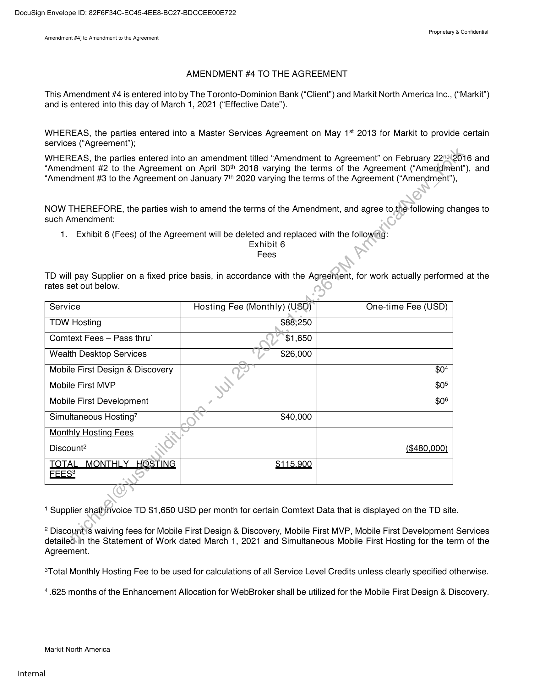
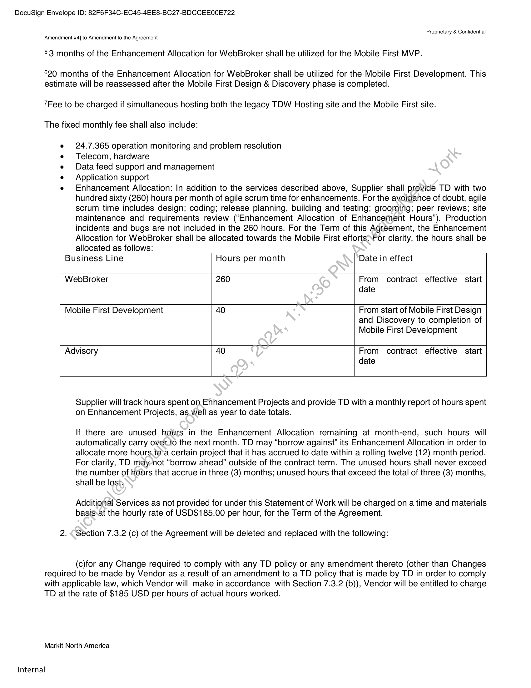
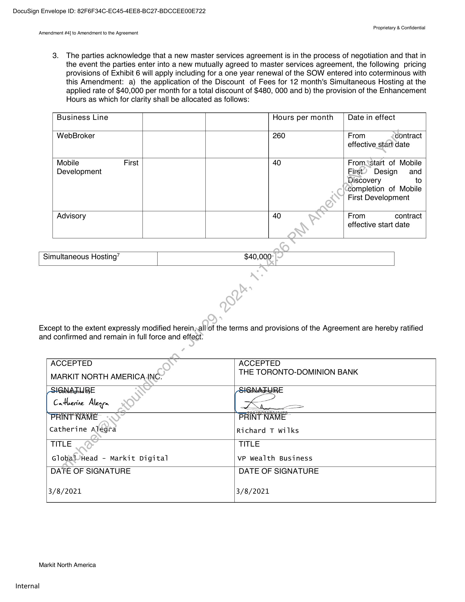

##### Amendment #4 to the Amendment to the Agreement]

  
````col
```col-md
flexGrow=.5
===
> [!info] [Page 1](_attachments/images_TD-Canada-3.6.1.17.300114401-b.pdf_210832/page_1.png)
> 
```  
```col-md
DocuSign Envelope ID: 82F6F34C-EC45-4EE8-BC27-BDCCEE00E722  
Proprietary & Confidential
Amendment #4] to Amendment to the Agreement  
AMENDMENT #4 TO THE AGREEMENT  
This Amendment #4 is entered into by The Toronto-Dominion Bank (“Client”) and Markit North America Inc., (“Markit”)
and is entered into this day of March 1, 2021 (“Effective Date’).  
WHEREAS, the parties entered into a Master Services Agreement on May 1° 2013 for Markit to provide certain
services (“Agreement”);  
WHEREAS, the parties entered into an amendment titled “Amendment to Agreement” on February 22°42016 and
“Amendment #2 to the Agreement on April 30'° 2018 varying the terms of the Agreement (“Amendment”), and
“Amendment #3 to the Agreement on January 7'* 2020 varying the terms of the Agreement (“Amendment”),  
NOW THEREFORE, the parties wish to amend the terms of the Amendment, and agree to the-following changes to
such Amendment:  
1. Exhibit 6 (Fees) of the Agreement will be deleted and replaced with the following:
Exhibit 6
Fees  
TD will pay Supplier on a fixed price basis, in accordance with the Agreement, for work actually performed at the
rates set out below.  
Service Hosting Fee (Monthly) (USD) One-time Fee (USD)
TDW Hosting $88;250
Comtext Fees — Pass thru! $1,650  
Wealth Desktop Services $26,000  
Mobile First Design & Discovery $0+
Mobile First MVP $05
Mobile First Development $0  
Simultaneous Hosting” $40,000
Monthly Hosting Fees
Discount? ($480,000)  
TOTAL MONTHLY HOSTING $115,900
FEES?  
1 Supplier shalhinvoice TD $1,650 USD per month for certain Comtext Data that is displayed on the TD site.  
? Discounts waiving fees for Mobile First Design & Discovery, Mobile First MVP, Mobile First Development Services
detailed:in the Statement of Work dated March 1, 2021 and Simultaneous Mobile First Hosting for the term of the
Agreement.  
8Total Monthly Hosting Fee to be used for calculations of all Service Level Credits unless clearly specified otherwise.  
4.625 months of the Enhancement Allocation for WebBroker shall be utilized for the Mobile First Design & Discovery.  
Markit North America  
Internal  
```
````
Notes:    
````col
```col-md
flexGrow=.5
===
> [!info] [Page 2](_attachments/images_TD-Canada-3.6.1.17.300114401-b.pdf_210832/page_2.png)
> 
```  
```col-md
DocuSign Envelope ID: 82F6F34C-EC45-4EE8-BC27-BDCCEE00E722  
Proprietary & Confidential  
Amendment #4] to Amendment to the Agreement  
53 months of the Enhancement Allocation for WebBroker shall be utilized for the Mobile First MVP.  
620 months of the Enhancement Allocation for WebBroker shall be utilized for the Mobile First Development. This
estimate will be reassessed after the Mobile First Design & Discovery phase is completed.  
7Fee to be charged if simultaneous hosting both the legacy TDW Hosting site and the Mobile First site.  
The fixed monthly fee shall also include:  
e 24.7.365 operation monitoring and problem resolution
e Telecom, hardware
e Data feed support and management
e Application support
e Enhancement Allocation: In addition to the services described above, Supplier shall provide TD with two
hundred sixty (260) hours per month of agile scrum time for enhancements. For the avoidance of doubt, agile
scrum time includes design; coding; release planning, building and testing; grooming; peer reviews; site
maintenance and requirements review (“Enhancement Allocation of Enhancement Hours”). Production
incidents and bugs are not included in the 260 hours. For the Term of this Agreement, the Enhancement
Allocation for WebBroker shall be allocated towards the Mobile First effortsFor clarity, the hours shall be
allocated as follows:
Business Line Hours per month Date in effect
WebBroker 260 From contract effective start
date
Mobile First Development 40 From start of Mobile First Design
and Discovery to completion of
Mobile First Development
Advisory 40 From contract effective start
date  
Supplier will track hours spent on Enhancement Projects and provide TD with a monthly report of hours spent
on Enhancement Projects, as well as year to date totals.  
If there are unused hours in the Enhancement Allocation remaining at month-end, such hours will
automatically carry over.to the next month. TD may “borrow against” its Enhancement Allocation in order to
allocate more hours.to’a certain project that it has accrued to date within a rolling twelve (12) month period.
For clarity, TD may-not “borrow ahead” outside of the contract term. The unused hours shall never exceed
the number of hours that accrue in three (3) months; unused hours that exceed the total of three (3) months,
shall be lost:  
Additional Services as not provided for under this Statement of Work will be charged on a time and materials
basis.at the hourly rate of USD$185.00 per hour, for the Term of the Agreement.  
2. “Section 7.3.2 (c) of the Agreement will be deleted and replaced with the following:  
(c)for any Change required to comply with any TD policy or any amendment thereto (other than Changes  
required to be made by Vendor as a result of an amendment to a TD policy that is made by TD in order to comply
with applicable law, which Vendor will make in accordance with Section 7.3.2 (b)), Vendor will be entitled to charge
TD at the rate of $185 USD per hours of actual hours worked.  
Markit North America  
Internal  
```
````
Notes:    
````col
```col-md
flexGrow=.5
===
> [!info] [Page 3](_attachments/images_TD-Canada-3.6.1.17.300114401-b.pdf_210832/page_3.png)
> 
```  
```col-md
DocuSign Envelope ID: 82F6F34C-EC45-4EE8-BC27-BDCCEE00E722  
Proprietary & Confidential
Amendment #4] to Amendment to the Agreement  
3. The parties acknowledge that a new master services agreement is in the process of negotiation and that in
the event the parties enter into a new mutually agreed to master services agreement, the following pricing
provisions of Exhibit 6 will apply including for a one year renewal of the SOW entered into coterminous with
this Amendment: a) the application of the Discount of Fees for 12 month's Simultaneous Hosting at the
applied rate of $40,000 per month for a total discount of $480, 000 and b) the provision of the Enhancement
Hours as which for clarity shall be allocated as follows:  
Business Line Hours per month Date in effect
WebBroker 260 From contract
effective start date
Mobile First 40 From<start of Mobile
Development First’ Design and
Discovery to  
completion of Mobile
First Development  
Advisory 40 From contract
effective start date  
Simultaneous Hosting” $40,000  
Except to the extent expressly modified herein,.all of the terms and provisions of the Agreement are hereby ratified
and confirmed and remain in full force and effect:  
ACCEPTED ACCEPTED
MARKIT NORTH AMERICA.INC: THE TORONTO-DOMINION BANK
GLA ghd BE
Catherine Alegra
INT NAME
Catherine Alegra Richard T wilks
TITLE TITLE
Global/Head - Markit Digital VP Wealth Business
DATE OF SIGNATURE DATE OF SIGNATURE
3/8/2021 3/8/2021  
Markit North America  
Internal  
```
````
Notes:  


![[_attachments/TD-Canada-3.6.1.17.3 00114401 - b.pdf]