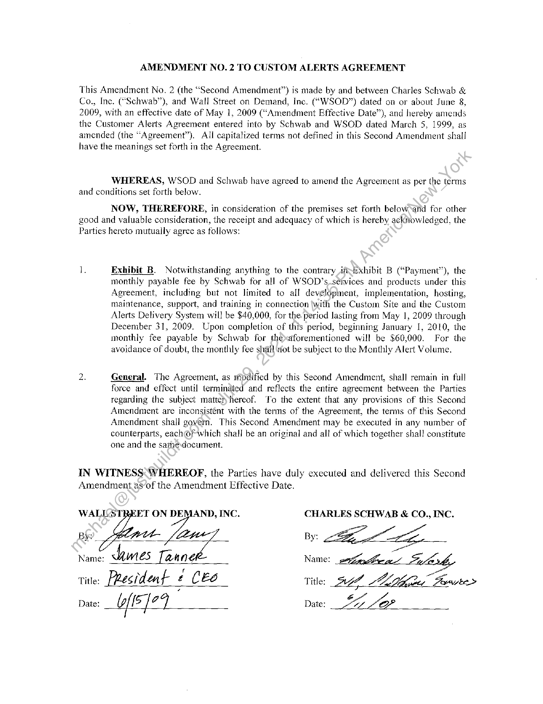

##### Amendment No. 2 to Custom Alerts Agreement]

  
````col
```col-md
flexGrow=.5
===
> [!info] [Page 1](_attachments/images_Schwab-3.6.1.18.1000150084a.pdf_211430/page_1.png)
> 
```  
```col-md
AMENDMENT NO. 2 TO CUSTOM ALERTS AGREEMENT  
This Amendment No. 2 (the “Second Amendment”) is made by and between Charles Schwab &
Co., Inc. (“Schwab”), and Wall Street on Demand, Inc. (“WSOD”) dated on or about June 8,
2009, with an effective date of May 1, 2009 (“Amendment Effective Date”), and hereby amends
the Customer Alerts Agreement entered into by Schwab and WSOD dated March 5, 1999, as
amended (the “Agreement”). All capitalized terms not defined in this Second Amendment shall
have the meanings set forth in the Agreement.  
WHEREAS, WSOD and Schwab have agreed to amend the Agreement as per the terms
and conditions set forth below.  
NOW, THEREFORE, in consideration of the premises set forth below and for other
good and valuable consideration, the receipt and adequacy of which is hereby acknowledged, the
Parties hereto mutually agree as follows:  
1. Exhibit B. Notwithstanding anything to the contrary ift-Exhibit B (“Payment”), the
monthly payable fee by Schwab for all of WSOD’s.setvices and products under this
Agreement, including but not limited to all development, implementation, hosting,
maintenance, support, and training in connection \with the Custom Site and the Custom
Alerts Delivery System will be $40,000, for the period lasting from May |, 2009 through
December 31, 2009. Upon completion of this period, beginning January 1, 2010, the
monthly fee payable by Schwab for thexaforementioned will be $60,000. For the
avoidance of doubt, the monthly fee shall ‘riot be subject to the Monthly Alert Volume.  
2. General. The Agreement, as modified by this Second Amendment, shall remain in full
force and effect until terminated and reflects the entire agreement between the Parties
regarding the subject matter hereof. To the extent that any provisions of this Second
Amendment are inconsistent with the terms of the Agreement, the terms of this Second
Amendment shall govem. This Second Amendment may be executed in any number of
counterparts, eachOfwhich shall be an original and all of which together shall constitute
one and the samedocument.  
IN WITNESS WHEREOF, the Parties have duly executed and delivered this Second
Amendment_asof the Amendment Effective Date.  
WALLSTREET ON DE , INC. CHARLES SCHWAB & CO., INC.  
name, bumes Tannek- Name: sefitheg > &
Title: President £ CE6 Title: _AgLida, Pevsuee>
paw: fl J29 Date: £2402  
By  
```
````
Notes:  


![[_attachments/Schwab-3.6.1.18.10 00150084 a.pdf]