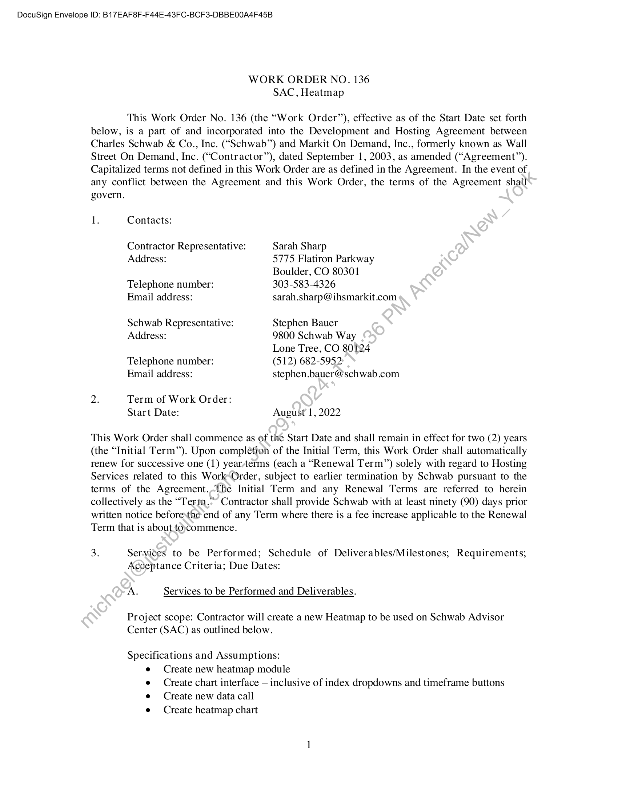
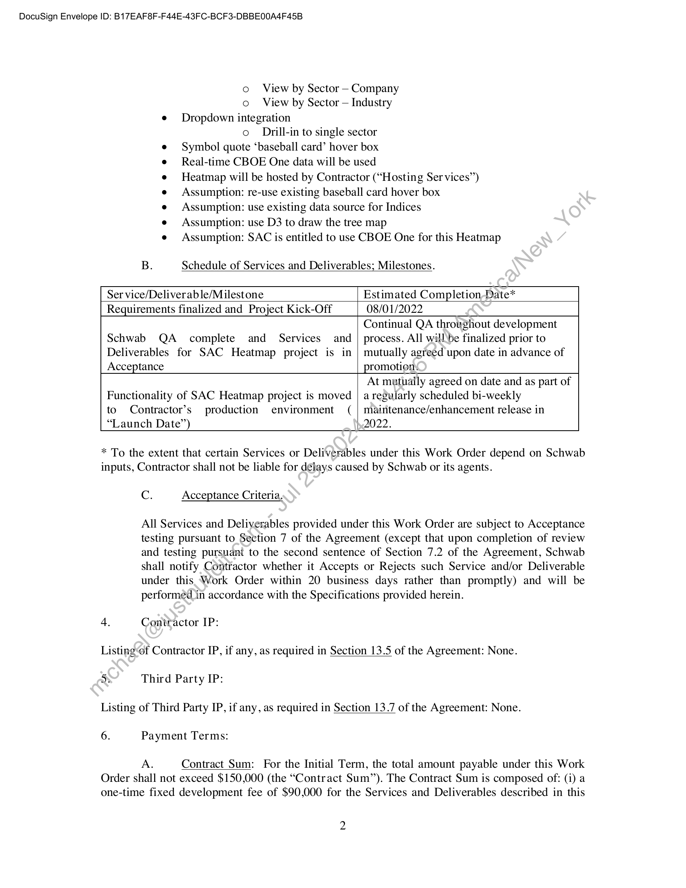
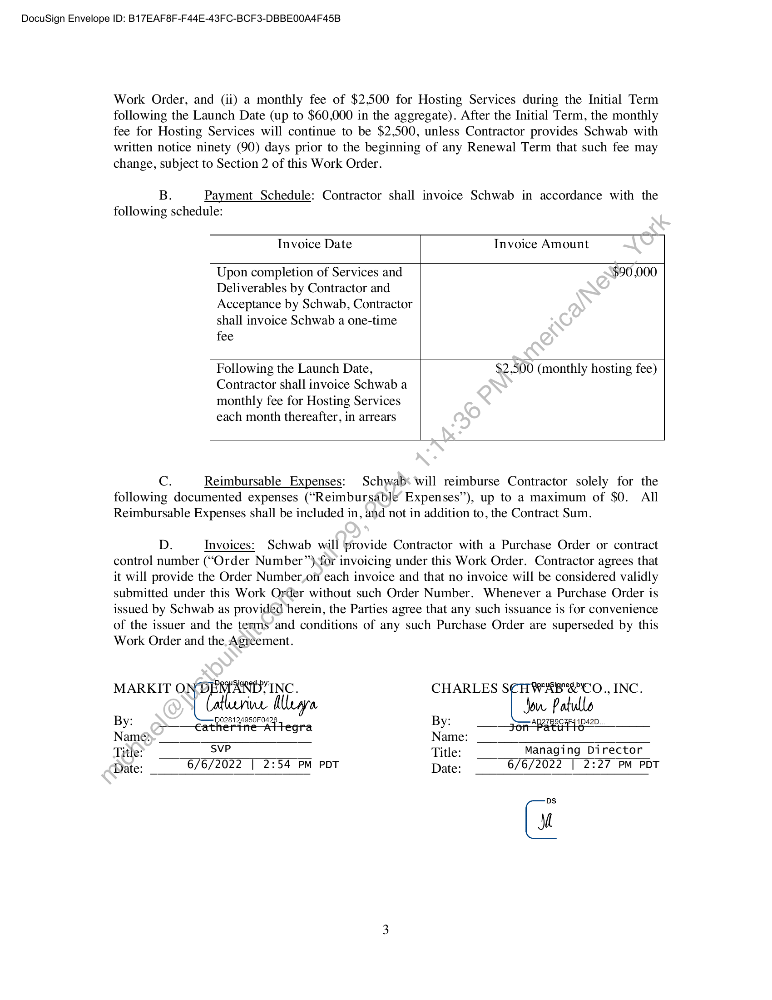

##### Work Order No. 136 - SAC, Heatmap]

  
````col
```col-md
flexGrow=.5
===
> [!info] [Page 1](_attachments/images_Schwab-3.6.1.18.1200147842.pdf_210735/page_1.png)
> 
```  
```col-md
DocuSign Envelope ID: B17EAF8F-F44E-43FC-BCF3-DBBEO0A4F45B  
WORK ORDER NO. 136
SAC, Heatmap  
This Work Order No. 136 (the “Work Order”), effective as of the Start Date set forth
below, is a part of and incorporated into the Development and Hosting Agreement between
Charles Schwab & Co., Inc. (“Schwab”) and Markit On Demand, Inc., formerly known as Wall
Street On Demand, Inc. (“Contractor”), dated September 1, 2003, as amended (“Agreement”).
Capitalized terms not defined in this Work Order are as defined in the Agreement. In the event of
any conflict between the Agreement and this Work Order, the terms of the Agreement shall  
govern.
1. Contacts:
Contractor Representative: Sarah Sharp
Address: 5775 Flatiron Parkway
Boulder, CO 80301
Telephone number: 303-583-4326
Email address: sarah.sharp@ihsmarkit.com
Schwab Representative: Stephen Bauer
Address: 9800 Schwab Way
Lone Tree, CO 80124
Telephone number: (512) 682-5952
Email address: stephen.bauer@schwab.com
2. Term of Work Order:
Start Date: August 1, 2022  
This Work Order shall commence as of the Start Date and shall remain in effect for two (2) years
(the “Initial Term”). Upon completion of the Initial Term, this Work Order shall automatically
renew for successive one (1) year/terms (each a “Renewal Term”) solely with regard to Hosting
Services related to this Work‘Order, subject to earlier termination by Schwab pursuant to the
terms of the Agreement.-The Initial Term and any Renewal Terms are referred to herein
collectively as the “Term.” Contractor shall provide Schwab with at least ninety (90) days prior
written notice beforesthe end of any Term where there is a fee increase applicable to the Renewal
Term that is about toycommence.  
3. Services to be Performed; Schedule of Deliverables/Milestones; Requirements;
Acceptance Criteria; Due Dates:  
A. Services to be Performed and Deliverables.  
Project scope: Contractor will create a new Heatmap to be used on Schwab Advisor
Center (SAC) as outlined below.  
Specifications and Assumptions:
e Create new heatmap module
e Create chart interface — inclusive of index dropdowns and timeframe buttons
e Create new data call
e Create heatmap chart  
```
````
Notes:    
````col
```col-md
flexGrow=.5
===
> [!info] [Page 2](_attachments/images_Schwab-3.6.1.18.1200147842.pdf_210735/page_2.png)
> 
```  
```col-md
DocuSign Envelope ID: B17EAF8F-F44E-43FC-BCF3-DBBEO0A4F45B  
o View by Sector — Company  
o View by Sector — Industry
e Dropdown integration  
o  Drill-in to single sector  
Symbol quote ‘baseball card’ hover box
Real-time CBOE One data will be used
Heatmap will be hosted by Contractor (“Hosting Ser vices’)
Assumption: re-use existing baseball card hover box
Assumption: use existing data source for Indices
Assumption: use D3 to draw the tree map
Assumption: SAC is entitled to use CBOE One for this Heatmap  
B. Schedule of Services and Deliverables; Milestones.  
Ser vice/Deliverable/Milestone Estimated Completion Date*
Requirements finalized and Project Kick-Off 08/01/2022  
Continual QA throughout development
Schwab QA complete and Services and | process. All willbe finalized prior to
Deliverables for SAC Heatmap project is in | mutually agreed upon date in advance of
Acceptance promotion:  
At mutually agreed on date and as part of
Functionality of SAC Heatmap project is moved | a regularly scheduled bi-weekly  
to Contractor’s production environment ( | maintenance/enhancement release in
“Launch Date”) 2022.  
* To the extent that certain Services or Deliverables under this Work Order depend on Schwab
inputs, Contractor shall not be liable for delays caused by Schwab or its agents.  
C. Acceptance Criteria.  
All Services and Deliverables provided under this Work Order are subject to Acceptance
testing pursuant to Section 7 of the Agreement (except that upon completion of review
and testing pursuani to the second sentence of Section 7.2 of the Agreement, Schwab
shall notify Contractor whether it Accepts or Rejects such Service and/or Deliverable
under this Work Order within 20 business days rather than promptly) and will be
performed in accordance with the Specifications provided herein.  
4. Contractor IP:
Listingof Contractor IP, if any, as required in Section 13.5 of the Agreement: None.
Ss Third Party IP:
Listing of Third Party IP, if any, as required in Section 13.7 of the Agreement: None.
6. Payment Terms:
A. Contract Sum: For the Initial Term, the total amount payable under this Work  
Order shall not exceed $150,000 (the “Contract Sum”). The Contract Sum is composed of: (i) a
one-time fixed development fee of $90,000 for the Services and Deliverables described in this  
```
````
Notes:    
````col
```col-md
flexGrow=.5
===
> [!info] [Page 3](_attachments/images_Schwab-3.6.1.18.1200147842.pdf_210735/page_3.png)
> 
```  
```col-md
DocuSign Envelope ID: B17EAF8F-F44E-43FC-BCF3-DBBEO0A4F45B  
Work Order, and (ii) a monthly fee of $2,500 for Hosting Services during the Initial Term
following the Launch Date (up to $60,000 in the aggregate). After the Initial Term, the monthly
fee for Hosting Services will continue to be $2,500, unless Contractor provides Schwab with
written notice ninety (90) days prior to the beginning of any Renewal Term that such fee may
change, subject to Section 2 of this Work Order.  
B. Payment Schedule: Contractor shall invoice Schwab in accordance with the
following schedule:  
Invoice Date Invoice Amount  
Upon completion of Services and $90,000
Deliverables by Contractor and
Acceptance by Schwab, Contractor
shall invoice Schwab a one-time
fee  
Following the Launch Date,
Contractor shall invoice Schwab a
monthly fee for Hosting Services
each month thereafter, in arrears  
$2,500 (monthly hosting fee)  
C. Reimbursable Expenses: Schwab‘ will reimburse Contractor solely for the
following documented expenses (“Reimbursable Expenses”), up to a maximum of $0. All
Reimbursable Expenses shall be included in, and not in addition to, the Contract Sum.  
D. Invoices: Schwab will provide Contractor with a Purchase Order or contract
control number (“Order Number”) for invoicing under this Work Order. Contractor agrees that
it will provide the Order Number,oii each invoice and that no invoice will be considered validly
submitted under this Work Order without such Order Number. Whenever a Purchase Order is
issued by Schwab as provided herein, the Parties agree that any such issuance is for convenience
of the issuer and the terms and conditions of any such Purchase Order are superseded by this
Work Order and the. Agreement.  
MARKIT O Patan Mt CHARLES SCHWABSCO., INC.
WL ‘a Jow. P  
By: a fertne Attegra By: po BRASH 420  
Name» Name:  
Title? svP Title: Managing Director  
Date: 6/6/2022 | 2:54 PM PDT Date: 6/6/2022 | 2:27 PM PDT  
Gi  
```
````
Notes:  


![[_attachments/Schwab-3.6.1.18.12 00147842.pdf]