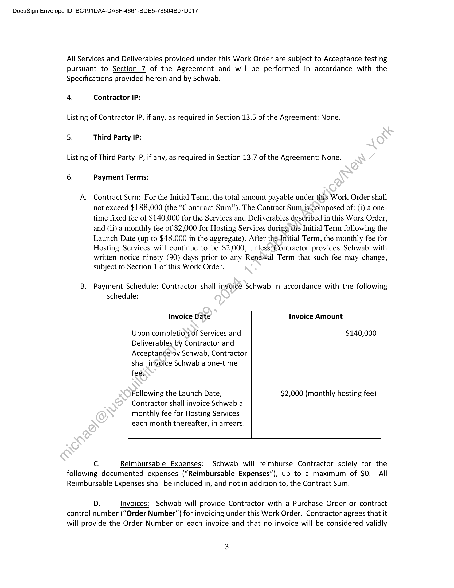

##### Work Order No. 144: New Report API: Argus Options]

  
````col
```col-md
flexGrow=.5
===
> [!info] [Page 1](_attachments/images_Schwab-3.6.1.18.1300150191.pdf_211258/page_1.png)
> 
```  
```col-md
DocuSign Envelope ID: BC191DA4-DAG6F-4661-BDE5-78504B07D017  
WORK ORDER NO. 144
New Report API: Argus Options  
This Work Order No. 144 (the “Work Order”), effective as of the Start Date set forth
below, is a part of and incorporated into the Development and Hosting Agreement (“Agreement”)
between Charles Schwab & Co., Inc. (“Schwab”) and Markit On Demand, Inc., formerly known as
Wall Street On Demand, Inc. (“Contractor”), dated September 1, 2003, as amended. Capitalized
terms not defined in this Work Order are as defined in the Agreement. In the event of any conflict
between the Agreement and this Work Order, the terms of the Agreement shall govern.  
1. Contacts:
Contractor Representative: Sarah Sharp
Address: 5775 Flatiron Parkway
Boulder, CO 80301
Telephone number: 303-583-4326
Email address: sarah.sharp@ihsmarkit.com
Schwab Representative: Rochelle Tijerina
Address: 4701 E Francisco.Dr.
Phoenix, AZ 85055
Telephone number: (737) 346 7439
Email address: Rochelle. Tijerina@Schwab.com
2. Start Date: January 24, 2022  
This Work Order shall commence as of the Start Date and shall remain in effect for two (2) years,
unless earlier terminated as(provided in the Agreement (the “Initial Term”). Upon completion
of the Initial Term, this.Work Order shall automatically renew for successive one (1) year terms
(each a “Renewal Term”) solely with regard to Hosting Services related to this Work Order,
subject to earlier termination by Schwab pursuant to the terms of the Agreement. The Initial
Term and any Renewal Terms are referred to herein collectively as the “Term.” Contractor shall
provide Schwab with at least ninety (90) days prior written notice before the end of any Term,
where thére is a fee increase applicable to the next Renewal Term.  
3: Services to be Performed; Schedule of Deliverables/Milestones; Requirements;;
Acceptance Criteria; Due Dates:  
A. Services to be Performed and Deliverables.  
Contractor will create a new API built onto Apigee that will initially obtain Argus Options
reports.  
Specifications, Requirements and Assumptions:  
1  
```
````
Notes:    
````col
```col-md
flexGrow=.5
===
> [!info] [Page 2](_attachments/images_Schwab-3.6.1.18.1300150191.pdf_211258/page_2.png)
> 
```  
```col-md
DocuSign Envelope ID: BC191DA4-DAG6F-4661-BDE5-78504B07D017  
e Build new API on Apigee API framework
e Initial AP! wrapper to be used for multiple vendor reports
e Integrate Argus Options reports into Contractor environment
e Add Argus Options Reports to new API
e API will allow for more reports to be added
e API will support unique identifiers to see what channel is using the API for
tracking and performance monitoring purposes
e API will go through performance testing and will be scaled to handle anticipated
post-Client Day 1 load
e The new Apigee API will be utilized in the following locations:
o RMS (Ratings and futures reports tool)
= Contractor will integrate into solution of Contractor-hosted UI
o SAC
= Contractor will integrate into solution of Contractor hosted UI
o Mobile — provide API for Schwab to utilize
e Contractor will add the data points to surface the repofts-in the following
locations (not utilizing the Apigee API):
o Prospect site (no access to report, Contractor to display report name)
o Legacy site (ratings module)
e Assumption: API current intention is for use or Schwab.com Retail and SAC
o APthas ability to be scaled and used elsewhere. This addition will be
defined further by Schwab and‘subject to Contractor’s written approval
and applicable fees priort@being implemented elsewhere.
e Assumption: Performance test load to be determined and provided by Schwab.  
B. Schedule of Services andDeliverables; Milestones.
Service/Deliverable/Milestone Estimated Completion Date*
Project Kick-off January 24, 2022  
Continual QA throughout development
Schwab QA complete and Services and | process. All will be finalized prior to
Deliverables wader this Work Order have been | mutually agreed upon date in advance of  
Accepted promotion.  
At mutually agreed on date and as part of
Functionality of API moved to | a regularly scheduled bi-weekly
Cofitractor’sproduction environment (“Launch | maintenance/enhancement release in
Date”) 2022  
* To the extent that certain Services or Deliverables under this Work Order depend on Schwab
inputs, Contractor shall not be liable for delays caused by Schwab or its agents.  
C. Acceptance Criteria.  
```
````
Notes:    
````col
```col-md
flexGrow=.5
===
> [!info] [Page 3](_attachments/images_Schwab-3.6.1.18.1300150191.pdf_211258/page_3.png)
> 
```  
```col-md
DocuSign Envelope ID: BC191DA4-DAG6F-4661-BDE5-78504B07D017  
All Services and Deliverables provided under this Work Order are subject to Acceptance testing
pursuant to Section 7 of the Agreement and will be performed in accordance with the
Specifications provided herein and by Schwab.  
4. Contractor IP:  
Listing of Contractor IP, if any, as required in Section 13.5 of the Agreement: None.
5. Third Party IP:  
Listing of Third Party IP, if any, as required in Section 13.7 of the Agreement: None.
6. Payment Terms:  
A. Contract Sum: For the Initial Term, the total amount payable under this Work Order shall
not exceed $188,000 (the “Contract Sum”). The Contract Sum.is‘composed of: (i) a onetime fixed fee of $140,000 for the Services and Deliverables described in this Work Order,
and (ii) a monthly fee of $2,000 for Hosting Services during the Initial Term following the
Launch Date (up to $48,000 in the aggregate). After theInitial Term, the monthly fee for
Hosting Services will continue to be $2,000, unless‘Contractor provides Schwab with
written notice ninety (90) days prior to any Renewal Term that such fee may change,
subject to Section | of this Work Order.  
B. Payment Schedule: Contractor shall invoice Schwab in accordance with the following
schedule:  
Invoice Date Invoice Amount  
Upon completion of Services and $140,000
Deliverables by Contractor and
Acceptance’by Schwab, Contractor
shall invoice Schwab a one-time
fee,  
Following the Launch Date, $2,000 (monthly hosting fee)
Contractor shall invoice Schwab a
monthly fee for Hosting Services  
each month thereafter, in arrears.  
Cc. Reimbursable Expenses: Schwab will reimburse Contractor solely for the
following documented expenses (“Reimbursable Expenses”), up to a maximum of $0. All
Reimbursable Expenses shall be included in, and not in addition to, the Contract Sum.  
Dz. Invoices: Schwab will provide Contractor with a Purchase Order or contract
control number (“Order Number”) for invoicing under this Work Order. Contractor agrees that it
will provide the Order Number on each invoice and that no invoice will be considered validly  
```
````
Notes:    
````col
```col-md
flexGrow=.5
===
> [!info] [Page 4](_attachments/images_Schwab-3.6.1.18.1300150191.pdf_211258/page_4.png)
> 
```  
```col-md
DocuSign Envelope ID: BC191DA4-DAG6F-4661-BDE5-78504B07D017  
submitted under this Work Order without such Order Number. Whenever a Purchase Order is
issued by Schwab as provided herein, the Parties agree that any such issuance is for convenience
of the issuer and the terms and conditions of any such Purchase Order are superseded by this
Work Order and the Agreement.  
MARKIT [atari INC. CHARLE: . INC.
Catherine Alegre
By: leg By:
Catherine Allegra Chris Fritz
Name: Name:
Title: svp Title: vice President1/4/2022 |\7:06 AM PST
Date: 1/4/2022 | 7:13 AM PST Date:  
ps
| kT 12/28/2021 | 7:37 AM PST  
```
````
Notes:  


![[_attachments/Schwab-3.6.1.18.13 00150191.pdf]