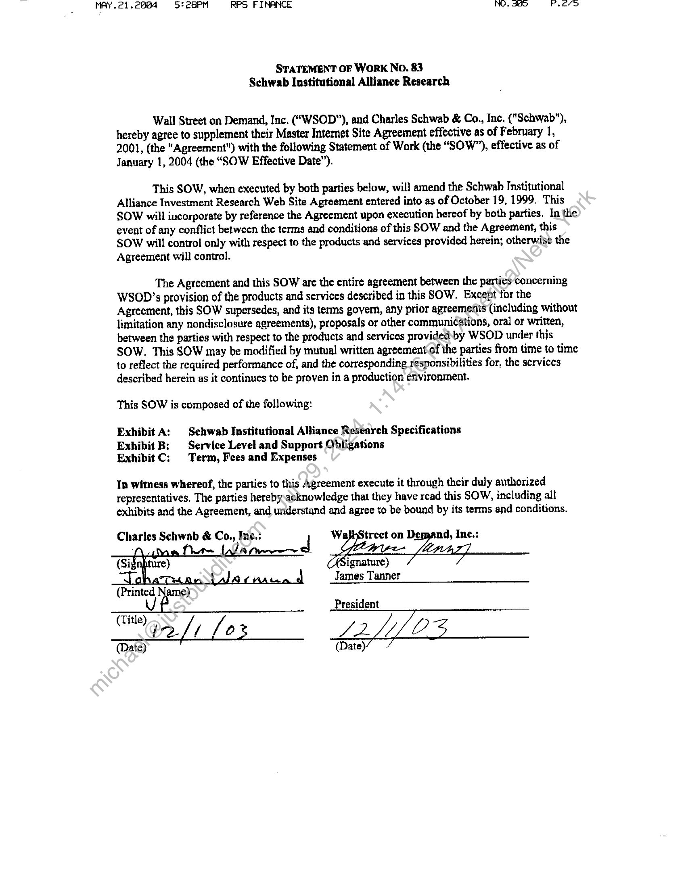
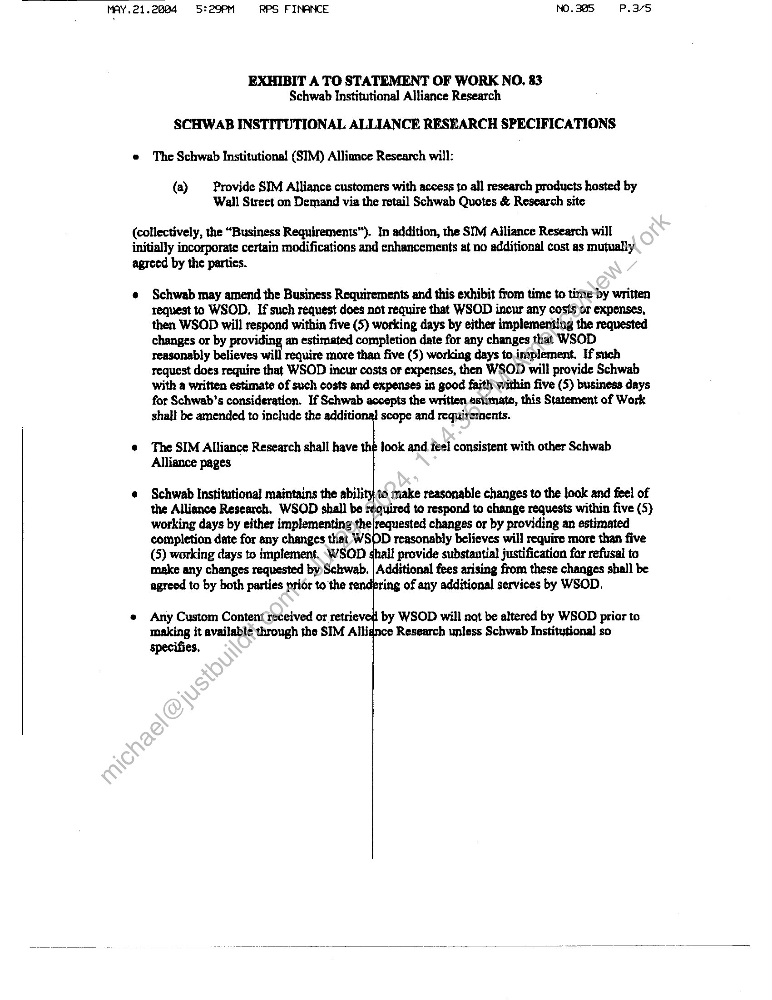
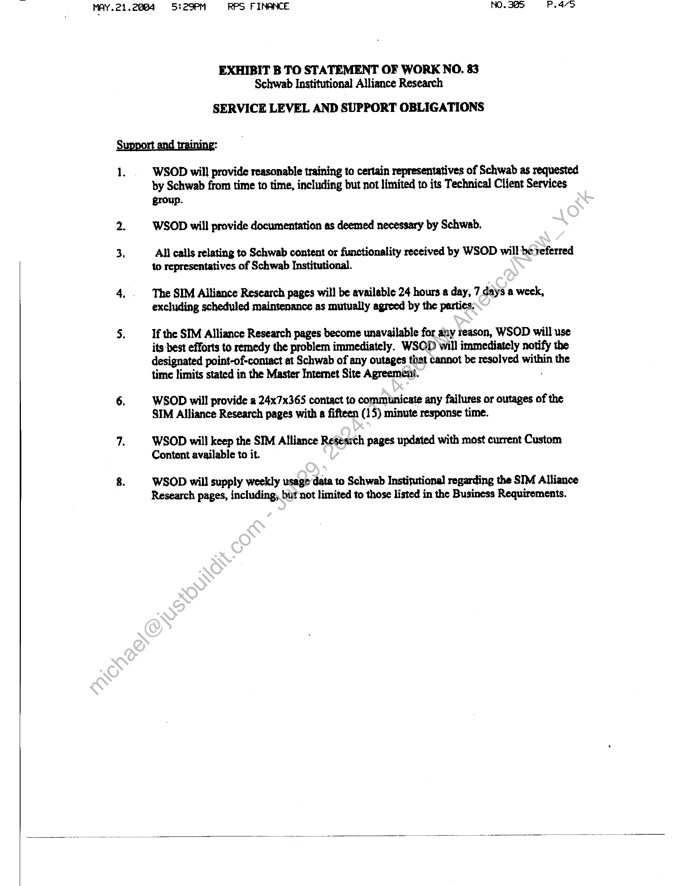
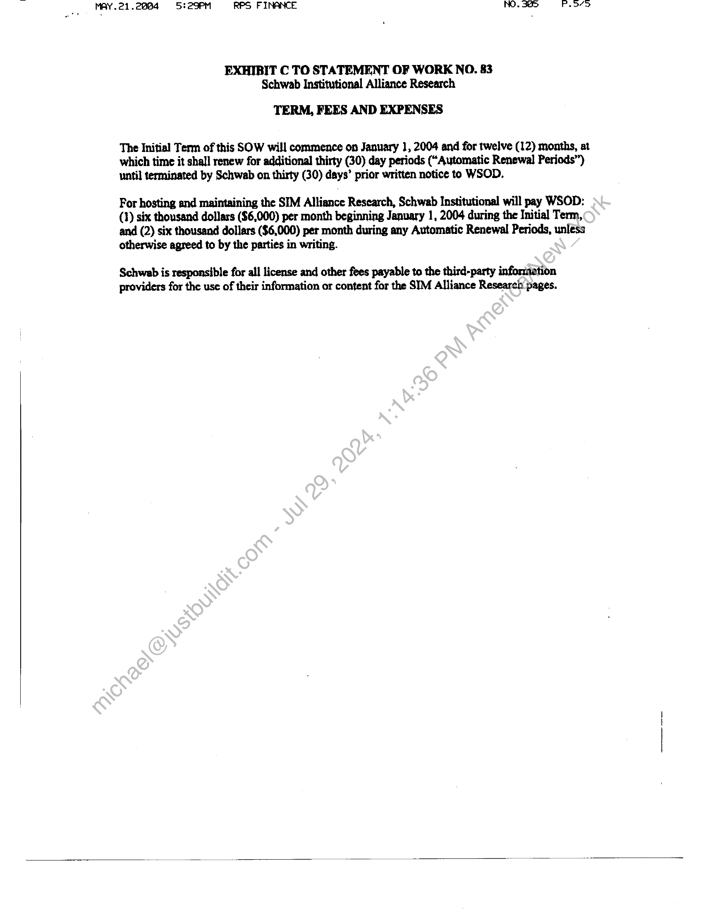

##### Statement of Work No. 83 - Schwab Institutional Alliance Research]

  
````col
```col-md
flexGrow=.5
===
> [!info] [Page 1](_attachments/images_Schwab-3.6.1.18.1400152846.pdf_211331/page_1.png)
> 
```  
```col-md
MAY.21.2884 = 5! 2BPM RPS FINANCE NO, 30> Peeve  
STATEMENT OF WORK No. 83
Schwab Institutional Alliance Research  
Wall Street on Demand, Inc. (“WSOD”), and Charles Schwab & Co., Inc, ("Schwab"),
hereby agree to supplement their Master Internet Site Agreement effective as of February 1,
2001, (the "Agreement" with the following Statement of Work (the “SOW”), effective as of
January 1, 2004 (the “SOW Effective Date”).  
This SOW, when executed by both parties below, will amend the Schwab Institutional
Alliance Investment Research Web Site Agreement entered into as of October 19, 1999. This
SOW will incorporate by reference the Agreement upon execution hereof by both parties. In the
event of any conflict between the terms and conditions of this SOW and the Agreement, this
SOW will control only with respect to the products and services provided herein; otherwise the
Agreement will control.  
The Agreement and this SOW are the entire agreement between the parties concerning
WSOD’s provision of the products and services described in this SOW. Except for the
Agreement, this SOW supersedes, and its terms govern, any prior agreements (including without
limitation any nondisclosure agreements), proposals or other communications, oral or written,
between the parties with respect to the products and services provided:by WSOD under this
SOW. This SOW may be modified by mutual written agreement of the parties from time to time
to reflect the required performance of, and the corresponding responsibilities for, the services
described herein as it continues to be proven in a production environment.  
This SOW is composed of the following:  
Exhibit A: Schwab Institutional Alliance Research Specifications
Exhibit B; Service Level and Support Obligations
Exhibit C: Term, Fees and Expenses  
In witness whereof, the parties to this Agreement execute it through their duly authorized
representatives. The parties hereby acknowledge that they have read this SOW, including all
exhibits and the Agreement, and understand and agree to be bound by its terms and conditions.  
Charles Schwab & Co., Ine.: treet on Demand, Inc.:
(Signpture)  
James Tanner  
(Printed Name}
President  
VU ’
OG [1 [03 £2 LLO3
(Date):  
(ate)  
```
````
Notes:    
````col
```col-md
flexGrow=.5
===
> [!info] [Page 2](_attachments/images_Schwab-3.6.1.18.1400152846.pdf_211331/page_2.png)
> 
```  
```col-md
MAY.21.2884 95:29PM RPS FINANCE NO. 385, P.3/5  
EXHIBIT A TO STATEMENT OF WORK NO, 83
Schwab Institutional Alliance Research  
SCHWAB INSTITUTIONAL ALLIANCE RESEARCH SPECIFICATIONS
e The Schwab Institutional (SIM) Alliance Research will:  
(a) Provide SIM Alliance customers with access to al] research products hosted by
Wall Street on Demand via the retail Schwab Quotes & Research site  
(collectively, the “Business Requirements”). In addition, the SIM Alliance Research will
initially incorporate certain modifications and enhancements at no additional cost as mutually  
agreed by the partics.  
e Schwab may amend the Business Requirements and this exhibit from time to time by written
request to WSOD. If such request does not require that WSOD incur any costs or expenses,
then WSOD will respond within five (5) working days by either implementing the requested
changes or by providing an estimated completion date for any changes that WSOD
reasonably believes will require more than five (5) working days to.implement. If such
request does require that WSOD incur costs or expenses, then WSOD will provide Schwab
with a written estimate of such costs and expenses in good faith within five (5) business days
for Schwab's consideration. If Schwab accepts the written estimate, this Statement of Work
shall be amended to include the additional scope and requirements.  
e The SIM Alliance Research shall have the look and feel consistent with other Schwab
Alliance pages  
« Schwab Institutional maintains the ability to make reasonable changes to the look and feel of
the Alliance Research. WSOD shall be r¢quired to respond to change requests within five (5)
working days by either implementing the|requested changes or by providing an estimated
completion date for any changes that WSOD reasonably believes will require more than five
(5) working days to implement, \WSOD provide substantial justification far refusal to
make any changes requested by Schwab. | Additional fees arising from these changes shall be
agreed to by both parties prior to the ‘ing of any additional services by WSOD.  
e Any Custom Content received or retri
making it available through the SIM Alli
specifies.  
by WSOD will not be altered by WSOD prior to
¢ Research unless Schwab Institutional so  
```
````
Notes:    
````col
```col-md
flexGrow=.5
===
> [!info] [Page 3](_attachments/images_Schwab-3.6.1.18.1400152846.pdf_211331/page_3.png)
> 
```  
```col-md
MAY.21.2004 5:29PM RPS FINANCE NO. 385 P.av>  
EXHIBIT B TO STATEMENT OF WORK NO. 83
Schwab Institutional Alliance Research  
SERVICE LEVEL AND SUPPORT OBLIGATIONS  
1.  WSODwill provide reasonable training to certain representatives of Schwab as requested
by Schwab from time to time, including but not limited to its Technical Client Services
group.  
2. WSOD will provide documentation as deemed necessary by Schwab.  
3, All calls relating to Schwab content or functionality received by WSOD will be referred
to representatives of Schwab Institutional.  
4. . The SIM Alliance Research pages will be available 24 hours a day, 7 days a week,
excluding scheduled maintenance as mutually agreed by the parties,  
5. If the SIM Alliance Research pages become unavailable for any reason, WSOD will use
its-best efforts to remedy the problem immediately. WSOD will immediately notify the
designated point-of-contact at Schwab of any outages that cannot be resolved within the
time limits stated in the Master Intemet Site Agreement.  
6. WSOD will provide 2 24x7x365 contact to communicate any failures or outages of the
SIM Alliance Research pages with a fifteen (15) minute response time.  
7. WSOD will keep the SIM Alliance Research pages updated with most current Custom
Content available to it.  
8. WSOD will supply weekly usage‘data to Schwab Institutional regarding the SIM Alliance
Research pages, including, but not limited to those listed in the Business Requirements.  
```
````
Notes:    
````col
```col-md
flexGrow=.5
===
> [!info] [Page 4](_attachments/images_Schwab-3.6.1.18.1400152846.pdf_211331/page_4.png)
> 
```  
```col-md
MAY.21.2884 9 5:29PM RPS FINANCE NO. 385 P.o7D  
EXHIBIT C TO STATEMENT OF WORK NO. 83
Schwab Institutional Alliance Research  
TERM, FEES AND EXPENSES  
The Initial Term of this SOW will commence on January 1, 2004 and for twelve (12) months, at
which time it shall renew for additional thirty (30) day periods (“Automatic Renewal Periods”)
until terminated by Schwab on thirty (30) days’ prior written notice to WSOD,  
For hosting and maintaining the SIM Alliance Research, Schwab Institutional will pay WSOD:
(1) six thousand dollars ($6,000) per month beginning January 1, 2004 during the Initial Term,
and (2) six thousand dollars ($6,000) per month during any Automatic Renewal Periods, unless
otherwise agreed to by the parties in writing.  
Schwab is responsible for all license and other fees payable to the third-party information
providers for the use of their information or content for the SIM Alliance Research pages.  
```
````
Notes:  


![[_attachments/Schwab-3.6.1.18.14 00152846.pdf]