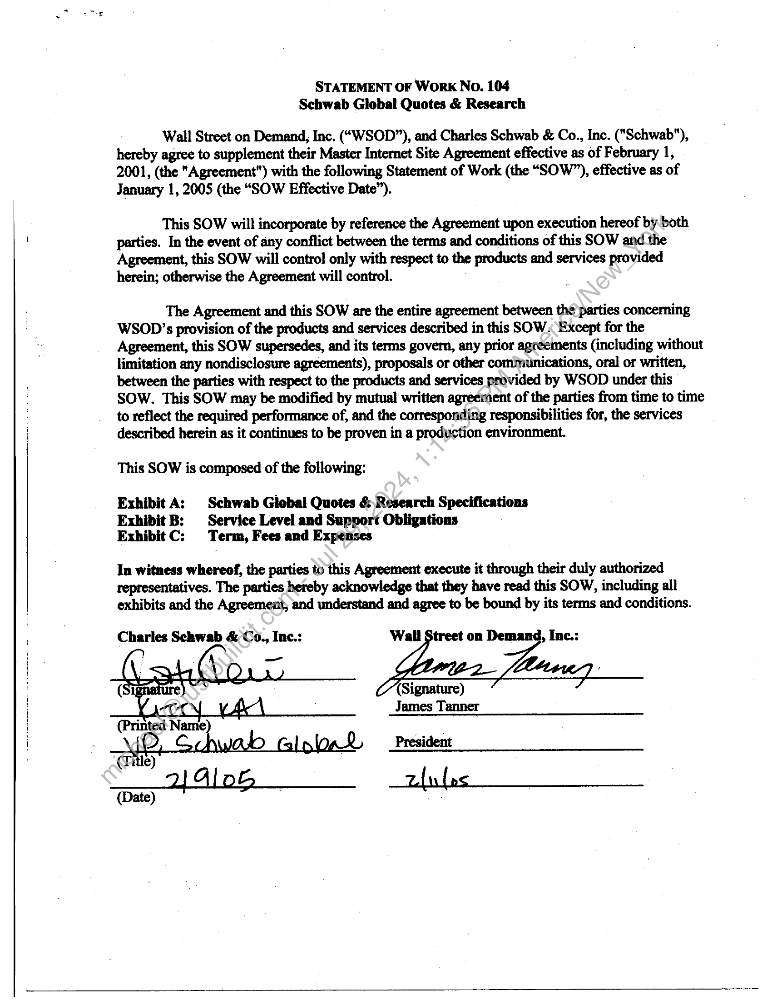
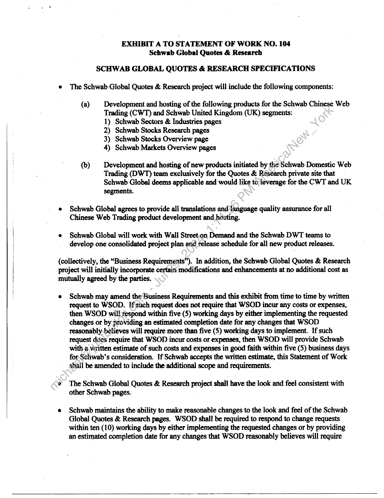
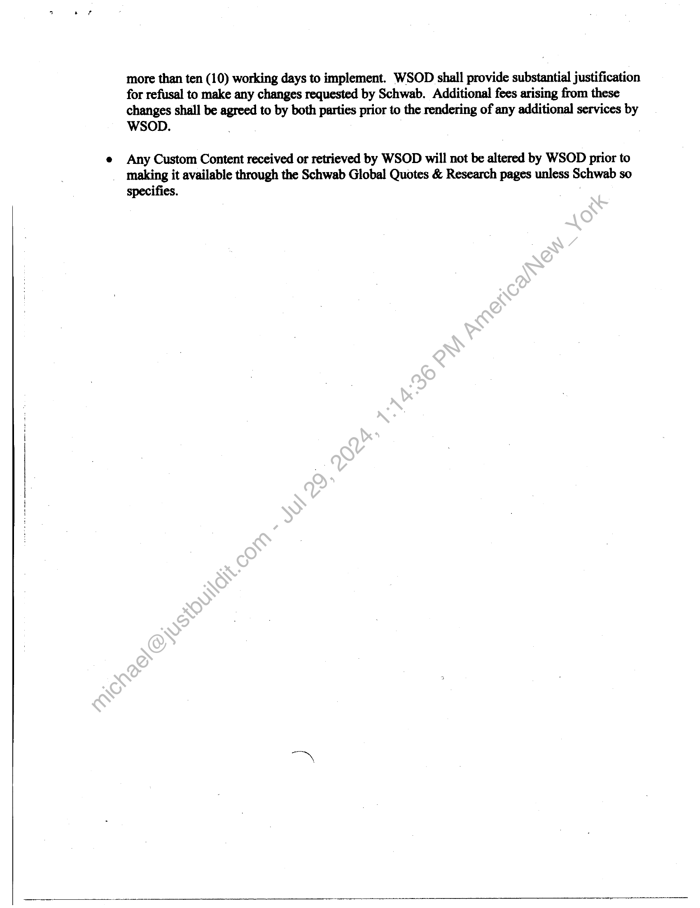
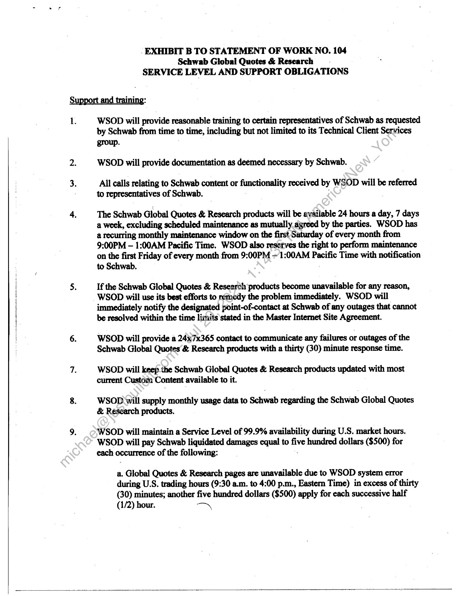
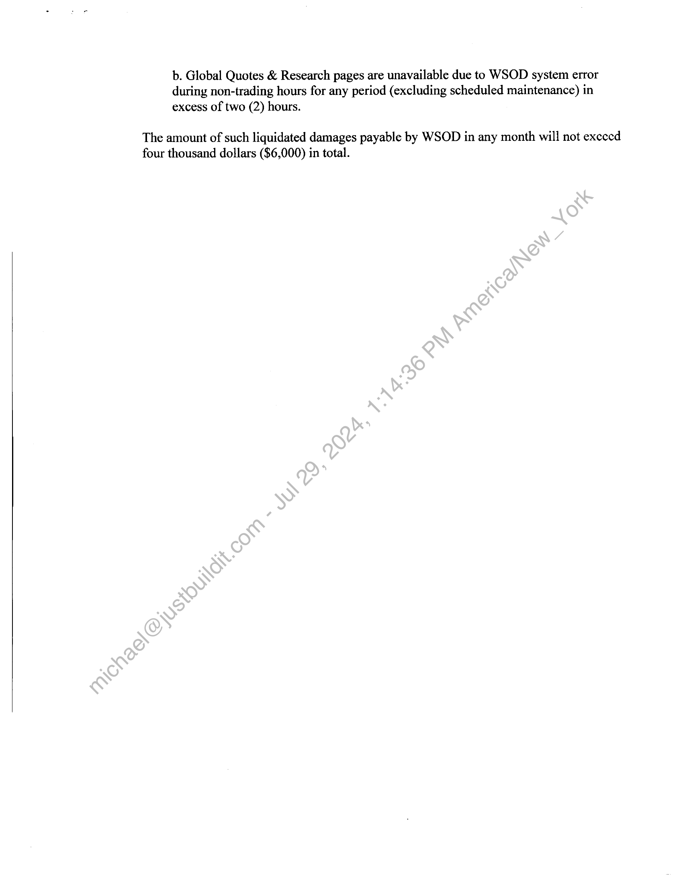
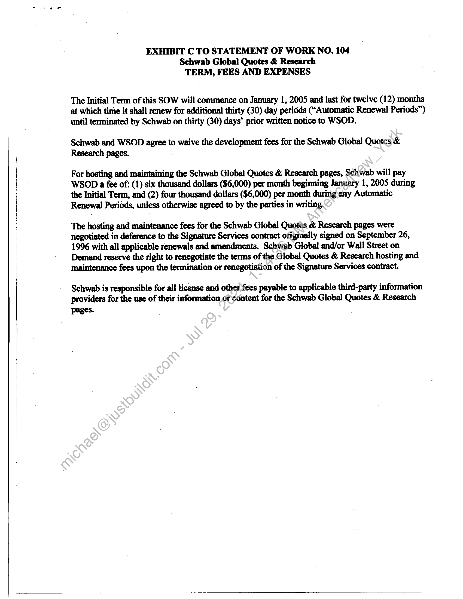

##### Statement of Work No. 104: Schwab Global Quotes & Research]

  
````col
```col-md
flexGrow=.5
===
> [!info] [Page 1](_attachments/images_Schwab-3.6.1.18.1500147697.pdf_212039/page_1.png)
> 
```  
```col-md
STATEMENT OF Work No. 104
Schwab Global Quotes & Research  
Wall Street on Demand, Inc. (“WSOD”), and Charles Schwab & Co., Inc. ("Schwab"),
hereby agree to supplement their Master Internet Site Agreement effective as of February 1,
2001, (the "Agreement") with the following Statement of Work (the “SOW”), effective as of
January 1, 2005 (the “SOW Effective Date”).  
This SOW will incorporate by reference the Agreement upon execution hereof by both
parties. In the event of any conflict between the terms and conditions of this SOW and.the
Agreement, this SOW will control only with respect to the products and services provided
herein; otherwise the Agreement will control.  
The Agreement and this SOW are the entire agreement between thé)parties concerning
WSOD’s provision of the products and services described in this SOW. Except for the
Agreement, this SOW supersedes, and its terms govern, any prior agreements (including without
limitation any nondisclosure agreements), proposals or other communications, oral or written,
between the parties with respect to the products and services provided by WSOD under this"
SOW. This SOW may be modified by mutual written agreement of the parties from time to time
to reflect the required performance of, and the corresponding responsibilities for, the services
described herein as it continues to be proven in a production environment.  
This SOW is composed of the following:  
Exhibit A: | Schwab Giobal Quotes & Research Specifications
Exhibit B: Service Level and Support Obligations
ExhibitC: Term, Fees and Expenses  
In witness whereof, the parties to this Agreement execute it through their duly authorized
representatives. The parties hereby acknowledge that they have read this SOW, including all
exhibits and the Agreement; and understand and agree to be bound by its terms and conditions.  
Charles Schwab & Co., Inc.: Wall Street on Den Inc.:  
_  
James Tanner  
President  
|  
```
````
Notes:    
````col
```col-md
flexGrow=.5
===
> [!info] [Page 2](_attachments/images_Schwab-3.6.1.18.1500147697.pdf_212039/page_2.png)
> 
```  
```col-md
EXHIBIT A TO ST ATEMENT OF WORK NO. 104
Schwab Global Quotes & Research  
SCHWAB GLOBAL QUOTES & RESEARCH SPECIFICATIONS  
e The Schwab Global Quotes & Research project will include the following components:  
(a) Development and hosting of the following products for the Schwab Chinese Web
Trading (CWT) and Schwab United Kingdom (UK) segments:
1) Schwab Sectors & Industries pages
2) Schwab Stocks Research pages
3) Schwab Stocks Overview page
4) Schwab Markets Overview pages  
(b) Development and hosting of new products initiated by the Schwab Domestic Web
Trading (DWT) team exclusively for the Quotes & Research private site that _
Schwab Global deems applicable and would like to’leverage for the CWT and UK  
segments.  
Schwab Global agrees to provide all translations and language quality assurance for all
Chinese Web Trading product development and hosting.  
Schwab Global will work with Wall Street.on Demand and the Schwab DWT teams to
develop one consolidated project plan arid release schedule for all new product releases.  
(collectively, the “Business Requirements”). In addition, the Schwab Global Quotes & Research
project will initially incorporate certain modifications and enhancements at no additional cost as
mutually agreed by the parties.  
Schwab may amend the ‘Business Requirements and this exhibit from time to time by written
request to WSOD. If such request does not require that WSOD incur any costs or expenses,
then WSOD will: respond within five (5) working days by either implementing the requested
changes or by providing an estimated completion date for any changes that WSOD
reasonably. believes will require more than five (5) working days to implement. If such
request does require that WSOD incur costs or expenses, then WSOD will provide Schwab
with a written estimate of such costs and expenses in good faith within five (5) business days
for Schwab’s consideration. If Schwab accepts the written estimate, this Statement of Work
shall be amended to include the additional scope and requirements.  
The Schwab Global Quotes & Research Project shail have the look and feel consistent with
other Schwab pages.  
Schwab maintains the ability to make reasonable changes to the look and feel of the Schwab
Global Quotes & Research pages. WSOD shall be required to respond to change requests  
- within ten (10) working days by either implementing the requested changes or by providing  
an estimated completion date for any changes that WSOD reasonably believes will require  
```
````
Notes:    
````col
```col-md
flexGrow=.5
===
> [!info] [Page 3](_attachments/images_Schwab-3.6.1.18.1500147697.pdf_212039/page_3.png)
> 
```  
```col-md
more than ten (10) working days to implement. WSOD shall provide substantial justification
for refusal to make any changes requested by Schwab. Additional fees arising from these
changes shall be agreed to by both parties prior to the rendering of any additional services by
WSOD. oo.
Any Custom Content received or retrieved by WSOD will not be altered by WSOD prior to
making it available through the Schwab Global Quotes & Research pages unless Schwab so
specifies. :  
```
````
Notes:    
````col
```col-md
flexGrow=.5
===
> [!info] [Page 4](_attachments/images_Schwab-3.6.1.18.1500147697.pdf_212039/page_4.png)
> 
```  
```col-md
EXHIBIT B TO STATEMENT OF WORK NO. 104
Schwab Global Quotes & Research
SERVICE LEVEL AND SUPPORT OBLIGATIONS  
WSOD will provide reasonable training to certain representatives of Schwab as requested
by Schwab from time to time, including but not limited to its Technical Client Services  
group.
WSOD will provide documentation as deemed necessary by Schwab.  
All calls relating to Schwab content or functionality received by WSOD will be referred
to representatives of Schwab.  
The Schwab Global Quotes & Research products will be available 24 hours a day, 7 days
a week, excluding scheduled maintenance as mutually agreed by the parties. WSOD has
a recurring monthly maintenance window on the first Saturday of every month from
9:00PM ~ 1:00AM Pacific Time. WSOD also reserves the right to perform maintenance
on the first Friday of every month from 9:00PM = 1:00AM Pacific Time with notification
to Schwab.  
If the Schwab Global Quotes & Research products become unavailable for any reason,
WSOD will use its best efforts to remedy the problem immediately. WSOD will
immediately notify the designated point-of-contact at Schwab of any outages that cannot
be resolved within the time limits stated in the Master Internet Site Agreement.  
WSOD will provide a 24x7x365 contact to communicate any failures or outages of the
Schwab Global Quotes & Research products with a thirty (30) minute response time.  
WSOD will keep the Schwab Global Quotes & Research products updated with most
current Custom Content available to it.  
WSOD will supply monthly usage data to Schwab regarding the Schwab Global Quotes
& Research products,  
WSOD will maintain a Service Level of 99.9% availability during U.S. market hours.
WSOD will pay Schwab liquidated damages equal to five hundred dollars ($500) for
each occurrence of the following:  
a. . Global Quotes & Research pages are unavailable due to WSOD system error
during U.S. trading hours (9:30 a.m. to 4:00 p.m., Eastern Time) in excess of thirty
(30) minutes; another five hundred dollars ($500) apply for each successive half
(1/2) hour. —™  
```
````
Notes:    
````col
```col-md
flexGrow=.5
===
> [!info] [Page 5](_attachments/images_Schwab-3.6.1.18.1500147697.pdf_212039/page_5.png)
> 
```  
```col-md
b. Global Quotes & Research pages are unavailable due to WSOD system error
during non-trading hours for any period (excluding scheduled maintenance) in
excess of two (2) hours.  
The amount of such liquidated damages payable by WSOD in any month will not exceed
four thousand dollars ($6,000) in total.  
```
````
Notes:    
````col
```col-md
flexGrow=.5
===
> [!info] [Page 6](_attachments/images_Schwab-3.6.1.18.1500147697.pdf_212039/page_6.png)
> 
```  
```col-md
EXHIBIT C TO STATEMENT OF WORK NO. 104
Schwab Global Quotes & Research
TERM, FEES AND EXPENSES  
The Initial Term of this SOW will commence on January 1, 2005 and last for twelve (12) months
at which time it shall renew for additional thirty (30) day periods (“Automatic Renewal Periods”)
until terminated by Schwab on thirty (30) days’ prior written notice to WSOD.  
Schwab and WSOD agree to waive the development fees for the Schwab Global Quotes &
Research pages. -  
For hosting and maintaining the Schwab Global Quotes & Research pages, Schwab will pay
WSOD a fee of: (1) six thousand dollars ($6,000) per month beginning January 1, 2005 during
the Initial Term, and (2) four thousand dollars ($6,000) per month during any Automatic
Renewal Periods, unless otherwise agreed to by the parties in writing.  
The hosting and maintenance fees for the Schwab Global Quotes & Research pages were
negotiated in deference to the Signature Services contract otiginally signed on September 26,
1996 with all applicable renewals and amendments. Schwab Global and/or Wall Street on
Demand reserve the right to renegotiate the terms of the Global Quotes & Research hosting and
maintenance fees upon the termination or renegotiation of the Signature Services contract.  
Schwab is responsible for all license and other fees payable to applicable third-party information
providers for the use of their information or content for the Schwab Global Quotes & Research
pages.  
```
````
Notes:  


![[_attachments/Schwab-3.6.1.18.15 00147697.pdf]