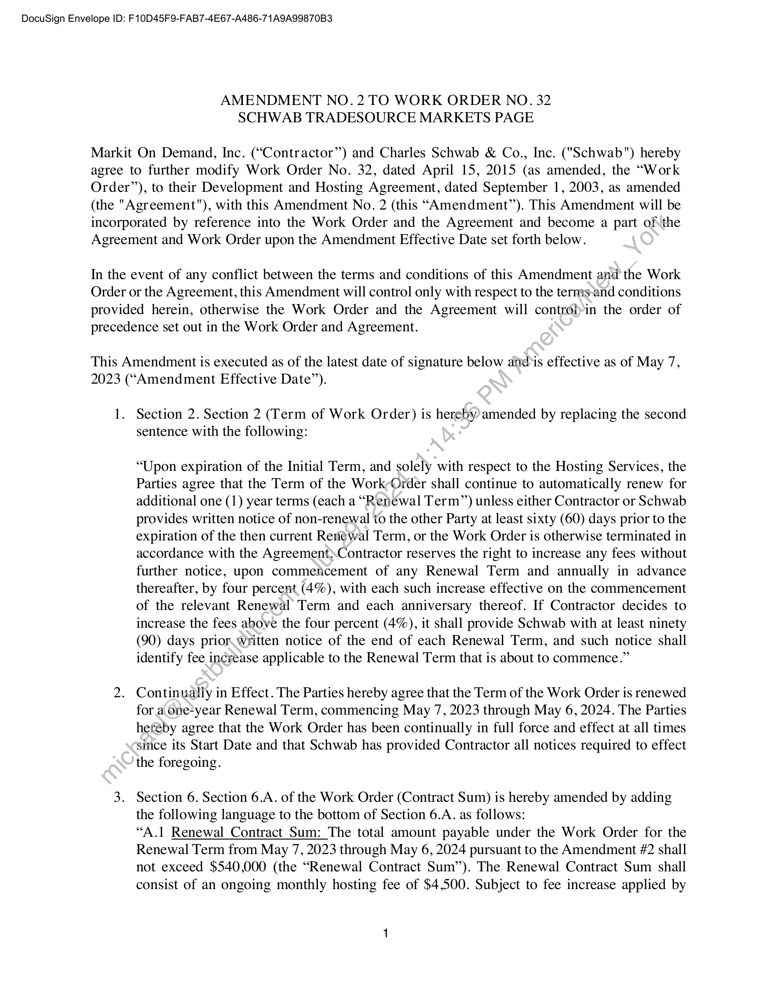
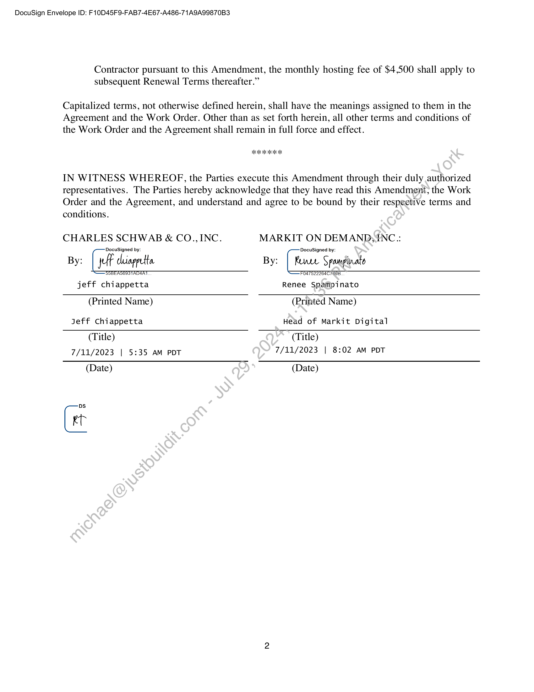

##### Amendment No. 2 to Work Order No. 32]

  
````col
```col-md
flexGrow=.5
===
> [!info] [Page 1](_attachments/images_Schwab-3.6.1.18.1700150177.pdf_210042/page_1.png)
> 
```  
```col-md
DocuSign Envelope ID: F10D45F9-FAB7-4E67-A486-71A9A99870B3  
AMENDMENT NO. 2 TO WORK ORDER NO. 32
SCHWAB TRADESOURCE MARKETS PAGE  
Markit On Demand, Inc. (“Contractor”) and Charles Schwab & Co., Inc. ("Schwab") hereby
agree to further modify Work Order No. 32, dated April 15, 2015 (as amended, the “Work
Order”), to their Development and Hosting Agreement, dated September 1, 2003, as amended
(the "Agreement"), with this Amendment No. 2 (this “Amendment”). This Amendment will be
incorporated by reference into the Work Order and the Agreement and become a part of\the
Agreement and Work Order upon the Amendment Effective Date set forth below.  
In the event of any conflict between the terms and conditions of this Amendment and the Work
Order or the Agreement, this Amendment will control only with respect to the terms-and conditions
provided herein, otherwise the Work Order and the Agreement will control»in the order of
precedence set out in the Work Order and Agreement.  
This Amendment is executed as of the latest date of signature below and*is effective as of May 7,
2023 (“Amendment Effective Date”).  
1.  
Section 2. Section 2 (Term of Work Order) is hereby amended by replacing the second
sentence with the following:  
“Upon expiration of the Initial Term, and solely with respect to the Hosting Services, the
Parties agree that the Term of the Work-Order shall continue to automatically renew for
additional one (1) year terms (each a “Renewal Term”) unless either Contractor or Schwab
provides written notice of non-renewal to the other Party at least sixty (60) days prior to the
expiration of the then current Renewal Term, or the Work Order is otherwise terminated in
accordance with the Agreement)Contractor reserves the right to increase any fees without
further notice, upon commencement of any Renewal Term and annually in advance
thereafter, by four percent, (4%), with each such increase effective on the commencement
of the relevant Renewal Term and each anniversary thereof. If Contractor decides to
increase the fees above the four percent (4%), it shall provide Schwab with at least ninety
(90) days prior.written notice of the end of each Renewal Term, and such notice shall
identify fee increase applicable to the Renewal Term that is about to commence.”  
. Continually in Effect. The Parties hereby agree that the Term of the Work Order is renewed.  
for a one-year Renewal Term, commencing May 7, 2023 through May 6, 2024. The Parties
heréby agree that the Work Order has been continually in full force and effect at all times
since its Start Date and that Schwab has provided Contractor all notices required to effect
the foregoing.  
Section 6. Section 6.A. of the Work Order (Contract Sum) is hereby amended by adding
the following language to the bottom of Section 6.A. as follows:  
“A.1 Renewal Contract Sum: The total amount payable under the Work Order for the
Renewal Term from May 7, 2023 through May 6, 2024 pursuant to the Amendment #2 shall
not exceed $540,000 (the “Renewal Contract Sum”). The Renewal Contract Sum shall
consist of an ongoing monthly hosting fee of $4,500. Subject to fee increase applied by  
```
````
Notes:    
````col
```col-md
flexGrow=.5
===
> [!info] [Page 2](_attachments/images_Schwab-3.6.1.18.1700150177.pdf_210042/page_2.png)
> 
```  
```col-md
DocuSign Envelope ID: F10D45F9-FAB7-4E67-A486-71A9A99870B3  
Contractor pursuant to this Amendment, the monthly hosting fee of $4,500 shall apply to  
subsequent Renewal Terms thereafter.”  
Capitalized terms, not otherwise defined herein, shall have the meanings assigned to them in the
Agreement and the Work Order. Other than as set forth herein, all other terms and conditions of
the Work Order and the Agreement shall remain in full force and effect.  
Heo oR oR aK 2k  
IN WITNESS WHEREOF, the Parties execute this Amendment through their duly authorized
representatives. The Parties hereby acknowledge that they have read this Amendment, the Work
Order and the Agreement, and understand and agree to be bound by their respective terms and  
conditions.  
CHARLES SCHWAB & CO.,INC.
By: Lf Chiappetta  
BOBEASOISTADSAT  
jeff chiappetta  
MARKIT ON DEMAND,INC::  
DocuSigned by:  
By: | Runce Spampinato  
FO47522004C/408  
Renee Spaiipinato  
(Printed Name)  
Jeff Chiappetta  
(Printed Name)  
Head of Markit Digital  
(Title)
7/11/2023 | 5:35 AM PDT
(Date)  
C  
(Title)
7/11/2023 | 8:02 AM PDT  
(Date)  
```
````
Notes:  


![[_attachments/Schwab-3.6.1.18.17 00150177.pdf]