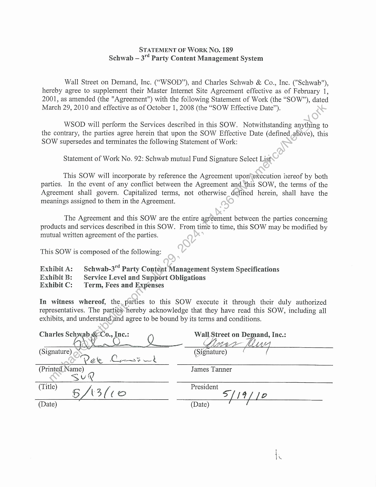
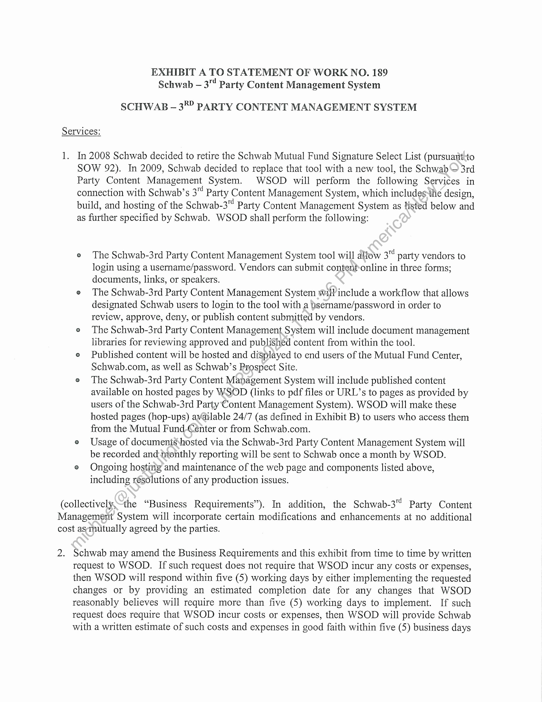
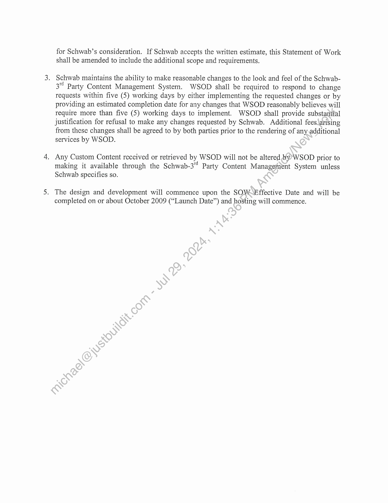
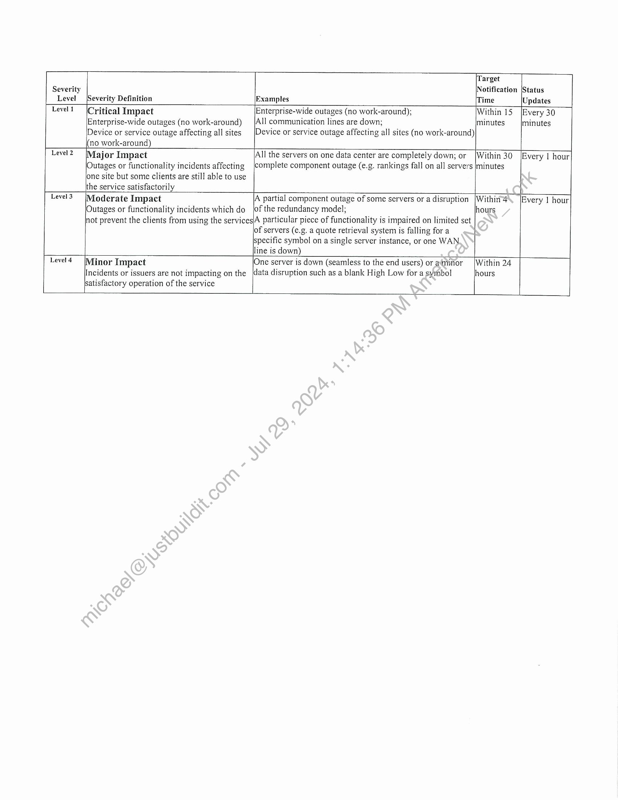
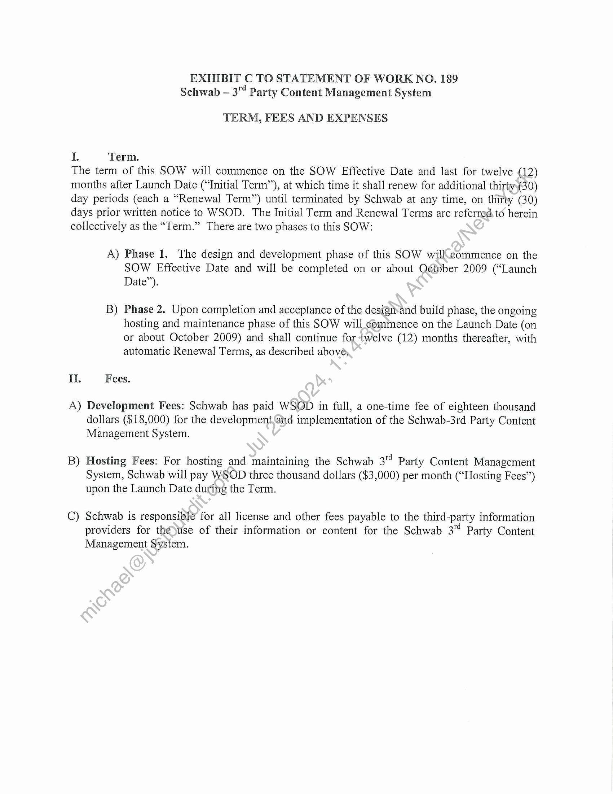

##### Statement of Work No. 189: Schwab - 3rd Party Content Management System]

  
````col
```col-md
flexGrow=.5
===
> [!info] [Page 1](_attachments/images_Schwab-3.6.1.18.1800147711.pdf_210548/page_1.png)
> 
```  
```col-md
STATEMENT OF WorK No. 189
Schwab — 3™ Party Content Management System  
Wall Street on Demand, Inc. (“WSOD”), and Charles Schwab & Co., Inc. ("Schwab"),
hereby agree to supplement their Master Internet Site Agreement effective as of February 1,
2001, as amended (the "Agreement") with the following Statement of Work (the “SOW”), dated
March 29, 2010 and effective as of October 1, 2008 (the “SOW Effective Date”).  
WSOD will perform the Services described in this SOW. Notwithstanding anything to
the contrary, the parties agree herein that upon the SOW Effective Date (defined above), this
SOW supersedes and terminates the following Statement of Work:  
Statement of Work No. 92: Schwab mutual Fund Signature Select List  
This SOW will incorporate by reference the Agreement upon\execution hereof by both
parties. In the event of any conflict between the Agreement and this SOW, the terms of the
Agreement shall govern. Capitalized terms, not otherwise defined herein, shall have the
meanings assigned to them in the Agreement.  
The Agreement and this SOW are the entire agreement between the parties concerning
products and services described in this SOW. From time to time, this SOW may be modified by
mutual written agreement of the parties.  
This SOW is composed of the following:  
Exhibit A: | Schwab-3" Party Content Management System Specifications
Exhibit B: Service Level and Support Obligations
Exhibit C: Term, Fees and Expenses  
In witness whereof, the, parties to this SOW execute it through their duly authorized
representatives. The parties hereby acknowledge that they have read this SOW, including all
exhibits, and understand,and agree to be bound by its terms and conditions.  
Charles “2 cn aan Inc.: LL Street on De pand, Ine.:
¢ /  
(Si mamas Sig os
°? ae —_ eens :
(Printed Name) James Tanner
Sug
(Title) P ; President  
i3(co S/14/ |e  
(Date) (Date)  
es  
```
````
Notes:    
````col
```col-md
flexGrow=.5
===
> [!info] [Page 2](_attachments/images_Schwab-3.6.1.18.1800147711.pdf_210548/page_2.png)
> 
```  
```col-md
IP  
EXHIBIT A TO STATEMENT OF WORK NO. 189
Schwab - 3"¢ Party Content Management System  
SCHWAB - 3” PARTY CONTENT MANAGEMENT SYSTEM  
Services:  
In 2008 Schwab decided to retire the Schwab Mutual Fund Signature Select List (pursuant!to
SOW 92). In 2009, Schwab decided to replace that tool with a new tool, the Schwab 3rd
Party Content Management System. WSOD will perform the following Services in
connection with Schwab’s 3" Party Content Management System, which includes the design,
build, and hosting of the Schwab-3" Party Content Management System as listed below and
as further specified by Schwab. WSOD shall perform the following:  
e The Schwab-3rd Party Content Management System tool will allow 3 party vendors to  
login using a username/password. Vendors can submit content-online in three forms;  
documents, links, or speakers.  
e The Schwab-3rd Party Content Management System wil! include a workflow that allows  
designated Schwab users to login to the tool with a jsername/password in order to  
review, approve, deny, or publish content submitted by vendors.  
° The Schwab-3rd Party Content Management System will include document management  
libraries for reviewing approved and published content from within the tool.  
Published content will be hosted and displayed to end users of the Mutual Fund Center,  
Schwab.com, as well as Schwab’s Prospect Site.  
© The Schwab-3rd Party Content Management System will include published content
available on hosted pages by WSOD (links to pdf files or URL’s to pages as provided by
users of the Schwab-3rd Party Content Management System). WSOD will make these
hosted pages (hop-ups) available 24/7 (as defined in Exhibit B) to users who access them
from the Mutual Fund-Center or from Schwab.com.  
° Usage of documentsshosted via the Schwab-3rd Party Content Management System will
be recorded and monthly reporting will be sent to Schwab once a month by WSOD.  
© Ongoing hosting and maintenance of the web page and components listed above,
including resolutions of any production issues.  
(collectively,the “Business Requirements”). In addition, the Schwab-3" Party Content
Management System will incorporate certain modifications and enhancements at no additional
cost asmutually agreed by the parties.  
2s  
Schwab may amend the Business Requirements and this exhibit from time to time by written
request to WSOD. If such request does not require that WSOD incur any costs or expenses,
then WSOD will respond within five (5) working days by either implementing the requested
changes or by providing an estimated completion date for any changes that WSOD
reasonably believes will require more than five (5) working days to implement. If such
request does require that WSOD incur costs or expenses, then WSOD will provide Schwab
with a written estimate of such costs and expenses in good faith within five (5) business days  
```
````
Notes:    
````col
```col-md
flexGrow=.5
===
> [!info] [Page 3](_attachments/images_Schwab-3.6.1.18.1800147711.pdf_210548/page_3.png)
> 
```  
```col-md
for Schwab’s consideration. If Schwab accepts the written estimate, this Statement of Work
shall be amended to include the additional scope and requirements.  
. Schwab maintains the ability to make reasonable changes to the look and feel of the Schwab-  
3" Party Content Management System. WSOD shall be required to respond to change
requests within five (5) working days by either implementing the requested changes or by
providing an estimated completion date for any changes that WSOD reasonably believes will
require more than five (5) working days to implement. WSOD shall provide substantial
justification for refusal to make any changes requested by Schwab. Additional fees\arising
from these changes shall be agreed to by both parties prior to the rendering of any additional
services by WSOD.  
. Any Custom Content received or retrieved by WSOD will not be altered by WSOD prior to
making it available through the Schwab-3 Party Content Management System unless
Schwab specifies so.  
. The design and development will commence upon the SOWEffective Date and will be
completed on or about October 2009 (“Launch Date’) and hosting will commence.  
```
````
Notes:    
````col
```col-md
flexGrow=.5
===
> [!info] [Page 4](_attachments/images_Schwab-3.6.1.18.1800147711.pdf_210548/page_4.png)
> 
```  
```col-md
EXHIBIT B TO STATEMENT OF WORK NO. 189
Schwab — 3" Party Content Management System  
SERVICE LEVEL AND SUPPORT OBLIGATIONS  
Support and training:  
1.  
WSOD will provide reasonable training to certain representatives of Schwab as requested
by Schwab from time to time, including but not limited to its technical client services  
group.
WSOD will provide reasonable documentation as deemed necessary by Schwab.  
All calls relating to Schwab content or functionality received by WSOD will be referred
to representatives of Schwab.  
The Schwab — 3" Party Content Management System will bé available 24 hours a day, 7
days a week, excluding scheduled maintenance as miutually agreed by the parties, or
emergency maintenance. Scheduled maintenance shall be defined as the period once
each calendar month per data center not to exceed’three (3) consecutive hours in length
during which the Services shall be inaccessible. With the exception of emergency
maintenance, or scheduled maintenance thatshas been mutually agreed upon, maintenance
will occur on no more than once a monthi/between 12:00am and 3:00am Eastern time.
WSOD will use commercially reasonable efforts to ensure any actual downtime is
minimized through the use of a redindant Data Center. If the scheduled maintenance falls
on a holiday weekend the mainteviance will be postponed to the following weekend.
WSOD may require additional’ time; any additional time taken is not considered a
Scheduled Outage provided it is completed by no later than 7:00 am Eastern time, or has
been approved by Schwab. two (2) days prior to said scheduled maintenance. Scheduled
maintenance is excluded from Availability calculations.  
If the Schwab 3" Party Content Management System becomes unavailable for any
reason, WSQD)will immediately act to remedy the problem and shall provide updates to
Schwab’s designated point-of-contact per the following time table:  
```
````
Notes:    
````col
```col-md
flexGrow=.5
===
> [!info] [Page 5](_attachments/images_Schwab-3.6.1.18.1800147711.pdf_210548/page_5.png)
> 
```  
```col-md
(Target
Notification |Status  
Level [Severity Definition Examples (Time Updates
Level! (Critical Impact Enterprise-wide outages (no work-around); Within 15 [Every 30
Enterprise-wide outages (no work-around) |All communication lines are down; minutes minutes
Device or service outage affecting all sites [Device or service outage affecting all sites (no work-around)
(no work-around)
Level 2 Major Impact |All the servers on one data center are completely down; or [Within 30 Every | hour
Outages or functionality incidents affecting [complete component outage (e.g. rankings fall on all servers |minutes
lone site but some clients are still able to use
Ithe service satisfactorily
Level3 (Moderate Impact A partial component outage of some servers or a disruption |Within4 Every | hour
|Outages or functionality incidents which do jof the redundancy model, hours
not prevent the clients from using the services|A particular piece of functionality is impaired on limited set
lof servers (e.g. a quote retrieval system is falling for a
specific symbol on a single server instance, or one WAN
line is down)
Level4 Minor Impact One server is down (seamless to the end users) or aiminor [Within 24
data disruption such as a blank High Low for a syrnbol hours  
satisfactory operation of the service  
Incidents or issuers are not impacting on the  
```
````
Notes:    
````col
```col-md
flexGrow=.5
===
> [!info] [Page 6](_attachments/images_Schwab-3.6.1.18.1800147711.pdf_210548/page_6.png)
> 
```  
```col-md
EXHIBIT C TO STATEMENT OF WORK NO. 189
Schwab — 3" Party Content Management System  
TERM, FEES AND EXPENSES  
I. Term.  
The term of this SOW will commence on the SOW Effective Date and last for twelve (12)
months after Launch Date (“Initial Term”), at which time it shall renew for additional thirty\(30)
day periods (each a “Renewal Term’) until terminated by Schwab at any time, on thirty (30)
days prior written notice to WSOD. The Initial Term and Renewal Terms are referred. to herein
collectively as the “Term.” There are two phases to this SOW:  
A) Phase 1. The design and development phase of this SOW willcommence on the
SOW Effective Date and will be completed on or about O¢tober 2009 (“Launch
Date”).  
B) Phase 2. Upon completion and acceptance of the design-and build phase, the ongoing
hosting and maintenance phase of this SOW will commence on the Launch Date (on
or about October 2009) and shall continue for twelve (12) months thereafter, with
automatic Renewal Terms, as described above,  
IL. Fees.  
A) Development Fees: Schwab has paid WSOD in full, a one-time fee of eighteen thousand
dollars ($18,000) for the development.and implementation of the Schwab-3rd Party Content
Management System.  
B) Hosting Fees: For hosting and maintaining the Schwab 3" Party Content Management
System, Schwab will pay WSOD three thousand dollars ($3,000) per month (“Hosting Fees”)
upon the Launch Date during the Term.  
C) Schwab is responsible for all license and other fees payable to the third-party information
providers for the use of their information or content for the Schwab 3™ Party Content
Management System.  
```
````
Notes:  


![[_attachments/Schwab-3.6.1.18.18 00147711.pdf]