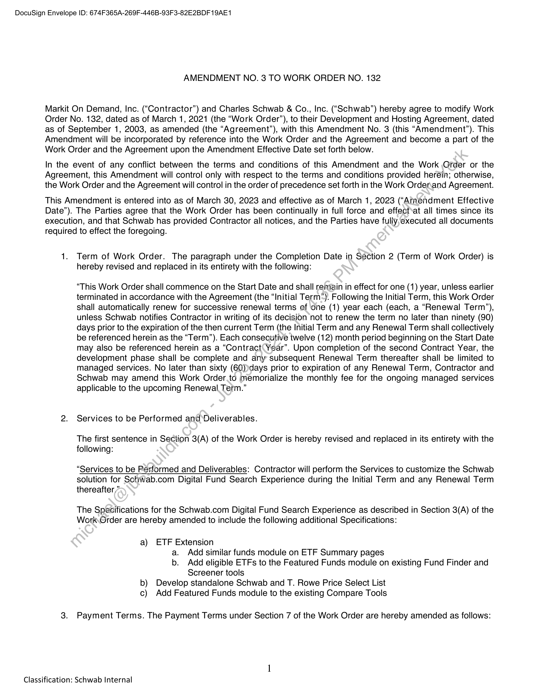
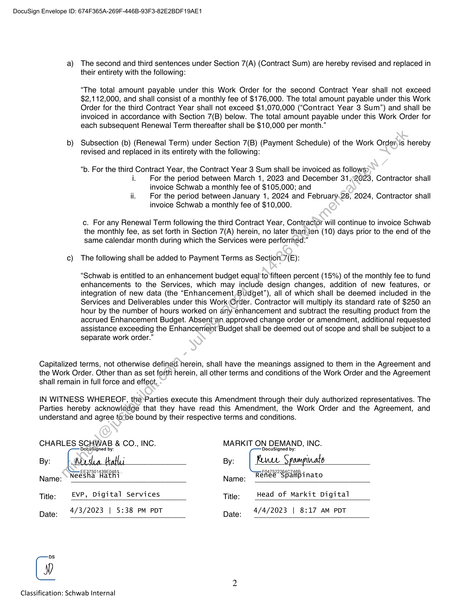

##### Amendment No. 3 to Work Order No. 132]

  
````col
```col-md
flexGrow=.5
===
> [!info] [Page 1](_attachments/images_Schwab-3.6.1.18.1900152856.pdf_205941/page_1.png)
> 
```  
```col-md
DocuSign Envelope ID: 674F365A-269F-446B-93F3-82E2BDF19AE1  
AMENDMENT NO. 3 TO WORK ORDER NO. 132  
Markit On Demand, Inc. (“Contractor”) and Charles Schwab & Co., Inc. (“Schwab”) hereby agree to modify Work
Order No. 132, dated as of March 1, 2021 (the “Work Order”), to their Development and Hosting Agreement, dated
as of September 1, 2003, as amended (the “Agreement”), with this Amendment No. 3 (this “Amendment”). This
Amendment will be incorporated by reference into the Work Order and the Agreement and become a part of the
Work Order and the Agreement upon the Amendment Effective Date set forth below.  
In the event of any conflict between the terms and conditions of this Amendment and the Work Order or the
Agreement, this Amendment will control only with respect to the terms and conditions provided herein; otherwise,
the Work Order and the Agreement will control in the order of precedence set forth in the Work Ordenand Agreement.  
This Amendment is entered into as of March 30, 2023 and effective as of March 1, 2023 (“Amendment Effective
Date”). The Parties agree that the Work Order has been continually in full force and effect*at all times since its
execution, and that Schwab has provided Contractor all notices, and the Parties have fully,executed all documents
required to effect the foregoing.  
1. Term of Work Order. The paragraph under the Completion Date in Section 2 (Term of Work Order) is
hereby revised and replaced in its entirety with the following:  
“This Work Order shall commence on the Start Date and shall remain in effect for one (1) year, unless earlier
terminated in accordance with the Agreement (the “Initial Term®*). Following the Initial Term, this Work Order
shall automatically renew for successive renewal terms of ‘one (1) year each (each, a “Renewal Term”),
unless Schwab notifies Contractor in writing of its decision not to renew the term no later than ninety (90)
days prior to the expiration of the then current Term (the Initial Term and any Renewal Term shall collectively
be referenced herein as the “Term”). Each consecutive twelve (12) month period beginning on the Start Date
may also be referenced herein as a “Contract Year”. Upon completion of the second Contract Year, the
development phase shall be complete and any subsequent Renewal Term thereafter shall be limited to
managed services. No later than sixty (60))days prior to expiration of any Renewal Term, Contractor and
Schwab may amend this Work Order.to memorialize the monthly fee for the ongoing managed services
applicable to the upcoming Renewal Term.”  
2. Services to be Performed and Deliverables.  
The first sentence in Section 3(A) of the Work Order is hereby revised and replaced in its entirety with the
following:  
“Services to be Performed and Deliverables: Contractor will perform the Services to customize the Schwab
solution for Schwab.com Digital Fund Search Experience during the Initial Term and any Renewal Term
thereafter,”  
The Specifications for the Schwab.com Digital Fund Search Experience as described in Section 3(A) of the
Work.Order are hereby amended to include the following additional Specifications:  
a) ETF Extension
a. Add similar funds module on ETF Summary pages
b. Add eligible ETFs to the Featured Funds module on existing Fund Finder and
Screener tools
b) Develop standalone Schwab and T. Rowe Price Select List
c) Add Featured Funds module to the existing Compare Tools  
3. Payment Terms. The Payment Terms under Section 7 of the Work Order are hereby amended as follows:  
Classification: Schwab Internal  
```
````
Notes:    
````col
```col-md
flexGrow=.5
===
> [!info] [Page 2](_attachments/images_Schwab-3.6.1.18.1900152856.pdf_205941/page_2.png)
> 
```  
```col-md
DocuSign Envelope ID: 674F365A-269F-446B-93F3-82E2BDF19AE1  
a) The second and third sentences under Section 7(A) (Contract Sum) are hereby revised and replaced in  
b)  
their entirety with the following:  
“The total amount payable under this Work Order for the second Contract Year shall not exceed
$2,112,000, and shall consist of a monthly fee of $176,000. The total amount payable under this Work
Order for the third Contract Year shall not exceed $1,070,000 (“Contract Year 3 Sum”) and shall be
invoiced in accordance with Section 7(B) below. The total amount payable under this Work Order for
each subsequent Renewal Term thereafter shall be $10,000 per month.”  
Subsection (b) (Renewal Term) under Section 7(B) (Payment Schedule) of the Work Order,is hereby
revised and replaced in its entirety with the following:  
“b. For the third Contract Year, the Contract Year 3 Sum shall be invoiced as follows:
i. For the period between March 1, 2023 and December 31,:2023, Contractor shall
invoice Schwab a monthly fee of $105,000; and
ii. For the period between January 1, 2024 and February.28, 2024, Contractor shall
invoice Schwab a monthly fee of $10,000.  
c. For any Renewal Term following the third Contract Year, Contractor will continue to invoice Schwab
the monthly fee, as set forth in Section 7(A) herein, no later thanten (10) days prior to the end of the
same calendar month during which the Services were performed.”  
The following shall be added to Payment Terms as Section_7(E):  
“Schwab is entitled to an enhancement budget equal'to fifteen percent (15%) of the monthly fee to fund
enhancements to the Services, which may include design changes, addition of new features, or
integration of new data (the “Enhancement Budget”), all of which shall be deemed included in the
Services and Deliverables under this Work Order. Contractor will multiply its standard rate of $250 an
hour by the number of hours worked on any enhancement and subtract the resulting product from the
accrued Enhancement Budget. Absent-an, approved change order or amendment, additional requested
assistance exceeding the Enhancement Budget shall be deemed out of scope and shall be subject to a
separate work order.”  
Capitalized terms, not otherwise defined. herein, shall have the meanings assigned to them in the Agreement and
the Work Order. Other than as set forth herein, all other terms and conditions of the Work Order and the Agreement
shall remain in full force and effect.  
IN WITNESS WHEREOF, the’Parties execute this Amendment through their duly authorized representatives. The
Parties hereby acknowledge that they have read this Amendment, the Work Order and the Agreement, and
understand and agree to-be bound by their respective terms and conditions.  
CHARLES SCHWAB & CO., INC. MARKIT ON DEMAND, INC.  
By:
Name:
Title:  
Date:  
Gi  
Docusigned by: DocuSigned by:  
e esta table By: Kune Spampinato  
Neesha Hathi Name: Renee Spampinato
EVP, Digital Services Title: Head of Markit Digital
4/3/2023 | 5:38 PM PDT . 4/4/2023 | 8:17 AM PDT
Date:
2  
Classification: Schwab Internal  
```
````
Notes:  


![[_attachments/Schwab-3.6.1.18.19 00152856.pdf]