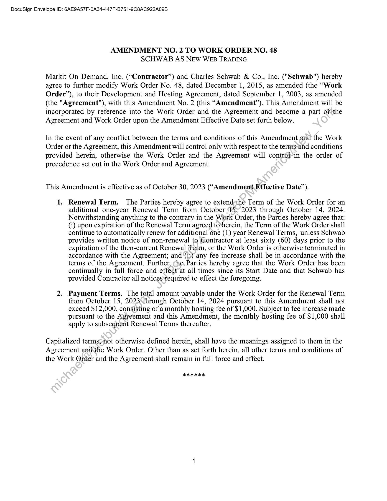
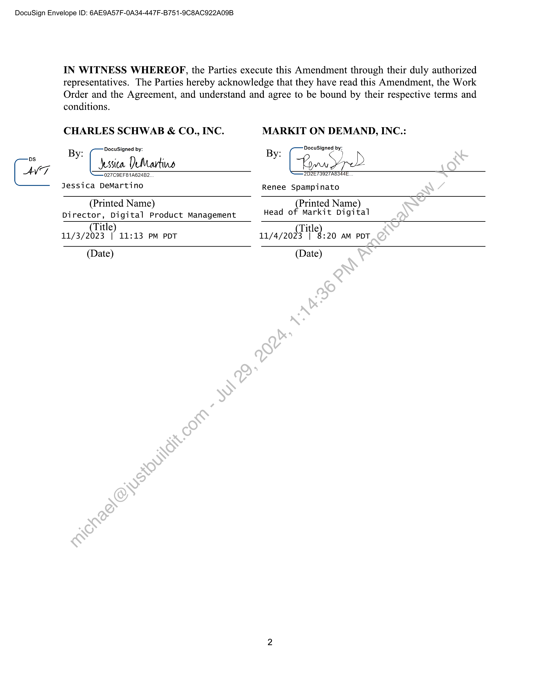

##### Amendment No. 2 to Work Order No. 48 - Schwab AS New Web Trading]

  
````col
```col-md
flexGrow=.5
===
> [!info] [Page 1](_attachments/images_Schwab-3.6.1.18.2000150221.pdf_212628/page_1.png)
> 
```  
```col-md
DocuSign Envelope ID: 6(AE9A57F-0A34-447F-B751-9C8AC922A09B  
AMENDMENT NO. 2 TO WORK ORDER NO. 48
SCHWAB AS NEW WEB TRADING  
Markit On Demand, Inc. (“Contractor”) and Charles Schwab & Co., Inc. ("Schwab") hereby
agree to further modify Work Order No. 48, dated December 1, 2015, as amended (the “Work
Order”), to their Development and Hosting Agreement, dated September 1, 2003, as amended
(the "Agreement"), with this Amendment No. 2 (this “Amendment”). This Amendment will be
incorporated by reference into the Work Order and the Agreement and become a part ofthe
Agreement and Work Order upon the Amendment Effective Date set forth below.  
In the event of any conflict between the terms and conditions of this Amendment and the Work
Order or the Agreement, this Amendment will control only with respect to the ternis-and conditions
provided herein, otherwise the Work Order and the Agreement will controlyin the order of
precedence set out in the Work Order and Agreement.  
This Amendment is effective as of October 30, 2023 (“Amendment Effective Date”).  
1. Renewal Term. The Parties hereby agree to extend-the Term of the Work Order for an
additional one-year Renewal Term from October ‘15; 2023 through October 14, 2024.
Notwithstanding anything to the contrary in the Work Order, the Parties hereby agree that:
(1) upon expiration of the Renewal Term agreed tovherein, the Term of the Work Order shall
continue to automatically renew for additional one (1) year Renewal Terms, unless Schwab
provides written notice of non-renewal to Gontractor at least sixty (60) days prior to the
expiration of the then-current Renewal Term, or the Work Order is otherwise terminated in
accordance with the Agreement; and (it) any fee increase shall be in accordance with the
terms of the Agreement. Further, the, Parties hereby agree that the Work Order has been
continually in full force and effect at all times since its Start Date and that Schwab has
provided Contractor all notices required to effect the foregoing.  
2. Payment Terms. The total amount payable under the Work Order for the Renewal Term
from October 15, 2023\through October 14, 2024 pursuant to this Amendment shall not
exceed $12,000, consisting of a monthly hosting fee of $1,000. Subject to fee increase made
pursuant to the Agreement and this Amendment, the monthly hosting fee of $1,000 shall
apply to subsequent Renewal Terms thereafter.  
Capitalized terms;not otherwise defined herein, shall have the meanings assigned to them in the
Agreement andsthe Work Order. Other than as set forth herein, all other terms and conditions of
the Work Order and the Agreement shall remain in full force and effect.  
aK  
```
````
Notes:    
````col
```col-md
flexGrow=.5
===
> [!info] [Page 2](_attachments/images_Schwab-3.6.1.18.2000150221.pdf_212628/page_2.png)
> 
```  
```col-md
DocuSign Envelope ID: 6(AE9A57F-0A34-447F-B751-9C8AC922A09B  
AVT  
IN WITNESS WHEREOPF, the Parties execute this Amendment through their duly authorized
representatives. The Parties hereby acknowledge that they have read this Amendment, the Work
Order and the Agreement, and understand and agree to be bound by their respective terms and  
conditions.  
CHARLES SCHWAB & CO., INC.  
By: DocuSigned by:
[sia DuMtartine  
027 C9EF81A624B2
Jessica DeMartino  
MARKIT ON DEMAND, INC.:  
DocuSigned by:
By: Sy) y  
Lon yp?  
'2D2E73927A8344E.  
Renee Spampinato  
(Printed Name) (Printed Name)
Director, Digital Product Management Head of Markit Digital
(Title) (Title)
11/3/2023 | 11:13 PM PDT 11/4/2023 | 8:20 AM PDT
(Date) (Date)  
```
````
Notes:  


![[_attachments/Schwab-3.6.1.18.20 00150221.pdf]