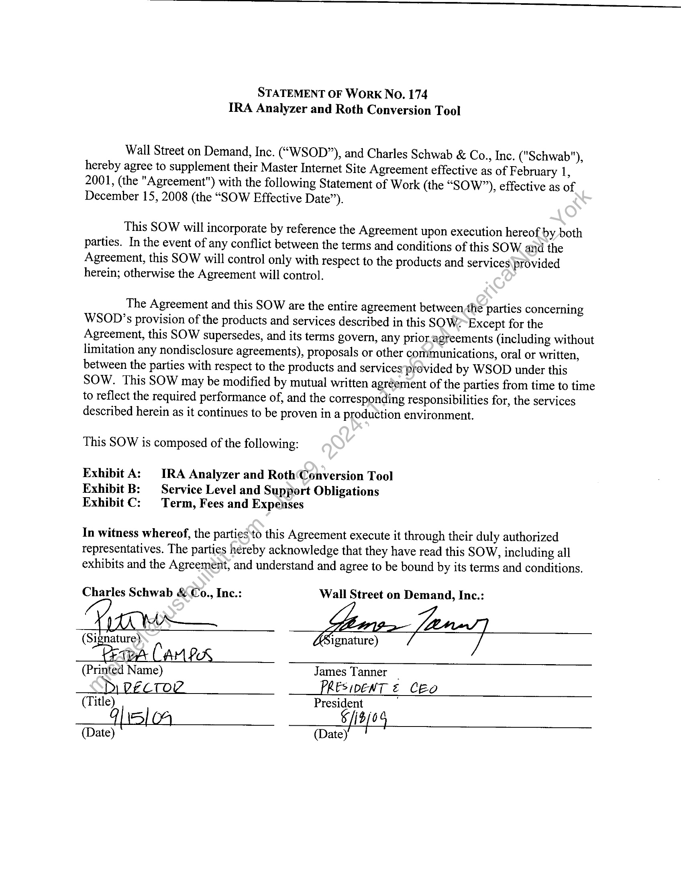
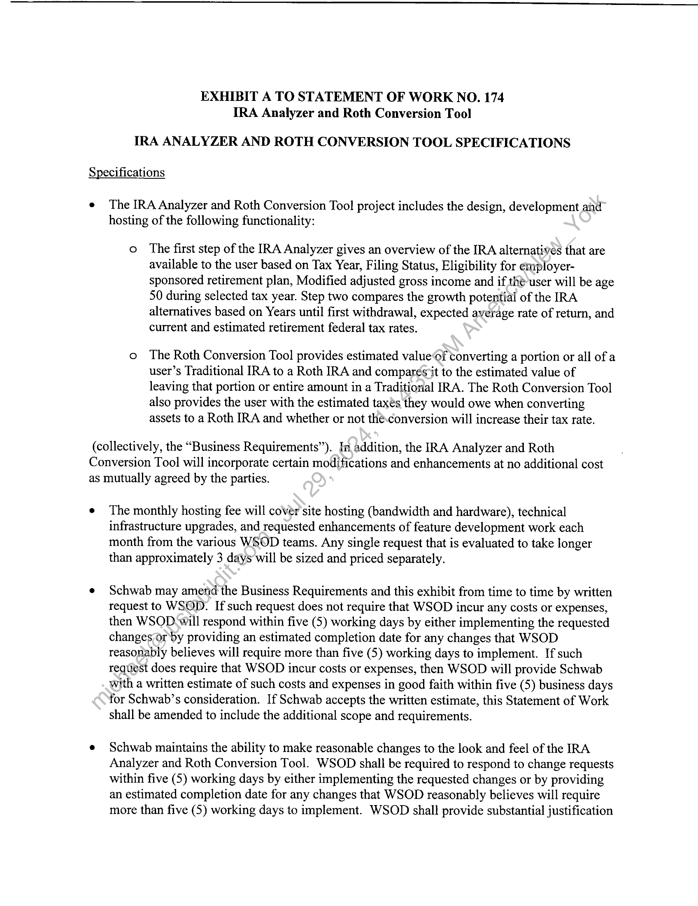
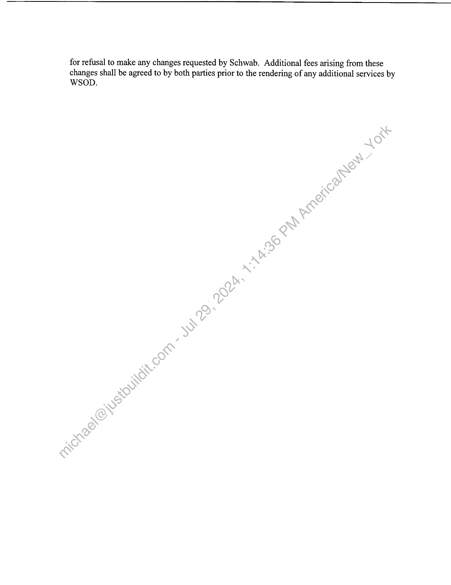
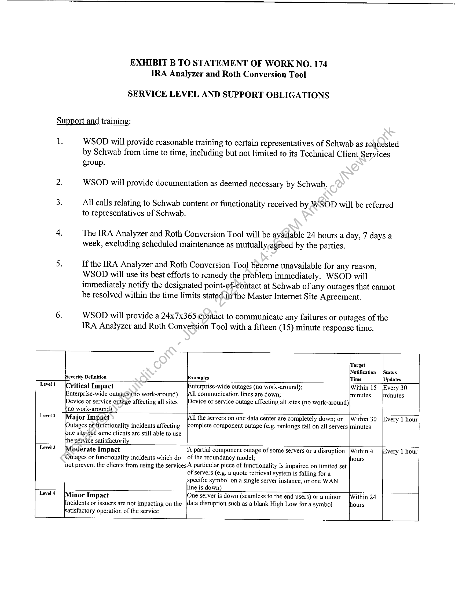
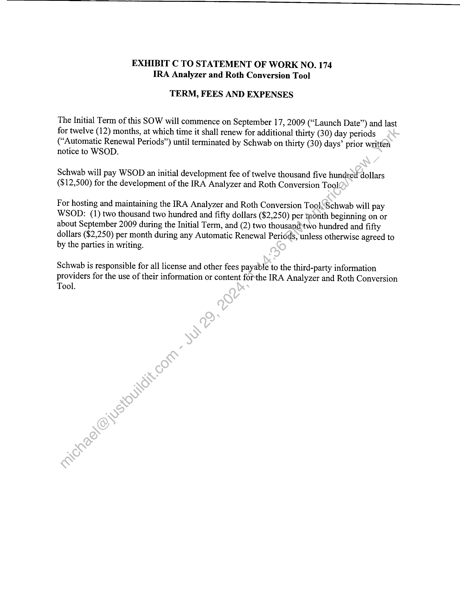

##### Statement of Work No. 174 - IRA Analyzer and Roth Conversion Tool]

  
````col
```col-md
flexGrow=.5
===
> [!info] [Page 1](_attachments/images_Schwab-3.6.1.18.2100147716.pdf_211234/page_1.png)
> 
```  
```col-md
STATEMENT OF Work No. 174
IRA Analyzer and Roth Conversion Tool  
Wall Street on Demand, Inc. (“WSOD”), and Charles Schwab & Co., Inc. ("Schwab"),
hereby agree to supplement their Master Internet Site Agreement effective as of February 1,
2001, (the "Agreement") with the following Statement of Work (the “SOW”), effective as of
December 15, 2008 (the “SOW Effective Date”).  
This SOW will incorporate by reference the Agreement upon execution hereof by both
parties. In the event of any conflict between the terms and conditions of this SOW and the
Agreement, this SOW will control only with respect to the products and services provided
herein; otherwise the Agreement will control.  
The Agreement and this SOW are the entire agreement betweenthe parties concerning
WSOD’s provision of the products and services described in this SOW? Except for the
Agreement, this SOW supersedes, and its terms govern, any prioragreements (including without
limitation any nondisclosure agreements), proposals or other communications, oral or written,
between the parties with respect to the products and services provided by WSOD under this
SOW. This SOW may be modified by mutual written agréement of the parties from time to time
to reflect the required performance of, and the corresponding responsibilities for, the services
described herein as it continues to be proven in a production environment.  
This SOW is composed of the following:  
Exhibit A: IRA Analyzer and Roth(Conversion Tool
Exhibit B: Service Level and Support Obligations
Exhibit C: Term, Fees and Expenses  
In witness whereof, the parties to this Agreement execute it through their duly authorized
representatives. The parties hereby acknowledge that they have read this SOW, including all
exhibits and the Agreement, and understand and agree to be bound by its terms and conditions.  
Charles Schwab &Co., Inc.: Wall Street on Demand, Inc.:
Yrs ZSignature) 7
Pepa CAMP
(Printed Name) James Tanner _
_ PRESIDENT € CEO
(Title) President ‘  
7H oul fA  
(Date)  
```
````
Notes:    
````col
```col-md
flexGrow=.5
===
> [!info] [Page 2](_attachments/images_Schwab-3.6.1.18.2100147716.pdf_211234/page_2.png)
> 
```  
```col-md
EXHIBIT A TO STATEMENT OF WORK NO. 174
IRA Analyzer and Roth Conversion Tool  
IRA ANALYZER AND ROTH CONVERSION TOOL SPECIFICATIONS  
Specifications  
e The IRA Analyzer and Roth Conversion Too! project includes the design, development and  
hosting of the following functionality:  
o The first step of the IRA Analyzer gives an overview of the IRA alternatives that are
available to the user based on Tax Year, Filing Status, Eligibility for employersponsored retirement plan, Modified adjusted gross income and if the’user will be age
50 during selected tax year. Step two compares the growth potential of the IRA
alternatives based on Years until first withdrawal, expected average rate of return, and
current and estimated retirement federal tax rates.  
o The Roth Conversion Tool provides estimated value©f converting a portion or all of a
user’s Traditional IRA to a Roth IRA and comparés‘it to the estimated value of
leaving that portion or entire amount in a Traditiorial IRA. The Roth Conversion Tool
also provides the user with the estimated taxés they would owe when converting
assets to a Roth IRA and whether or not the.conversion will increase their tax rate.  
(collectively, the “Business Requirements”). In addition, the IRA Analyzer and Roth
Conversion Tool will incorporate certain modifications and enhancements at no additional cost
as mutually agreed by the parties.  
The monthly hosting fee will cover site hosting (bandwidth and hardware), technical
infrastructure upgrades, and requested enhancements of feature development work each
month from the various WSOD teams. Any single request that is evaluated to take longer
than approximately 3 days will be sized and priced separately.  
Schwab may amend the Business Requirements and this exhibit from time to time by written
request to WSQD. If such request does not require that WSOD incur any costs or expenses,
then WSOD-will respond within five (5) working days by either implementing the requested
changes or by providing an estimated completion date for any changes that WSOD
reasonably believes will require more than five (5) working days to implement. If such
request does require that WSOD incur costs or expenses, then WSOD will provide Schwab
with a written estimate of such costs and expenses in good faith within five (5) business days
for Schwab’s consideration. If Schwab accepts the written estimate, this Statement of Work
shall be amended to include the additional scope and requirements.  
Schwab maintains the ability to make reasonable changes to the look and feel of the IRA
Analyzer and Roth Conversion Tool. WSOD shall be required to respond to change requests
within five (5) working days by either implementing the requested changes or by providing
an estimated completion date for any changes that WSOD reasonably believes will require
more than five (5) working days to implement. WSOD shall provide substantial justification  
```
````
Notes:    
````col
```col-md
flexGrow=.5
===
> [!info] [Page 3](_attachments/images_Schwab-3.6.1.18.2100147716.pdf_211234/page_3.png)
> 
```  
```col-md
for refusal to make any changes requested by Schwab. Additional fees arising from these
changes shall be agreed to by both parties prior to the rendering of any additional services by
WSOD.  
```
````
Notes:    
````col
```col-md
flexGrow=.5
===
> [!info] [Page 4](_attachments/images_Schwab-3.6.1.18.2100147716.pdf_211234/page_4.png)
> 
```  
```col-md
EXHIBIT B TO STATEMENT OF WORK NO. 174
TRA Analyzer and Roth Conversion Tool  
SERVICE LEVEL AND SUPPORT OBLIGATIONS  
Support and training:  
1. WSOD will provide reasonable training to certain representatives of Schwab as requested
by Schwab from time to time, including but not limited to its Technical Client Services
group.  
2. WSOD will provide documentation as deemed necessary by Schwab.  
3. All calls relating to Schwab content or functionality received by WSOD will be referred
to representatives of Schwab.  
4. The IRA Analyzer and Roth Conversion Tool will be available 24 hours a day, 7 days a
week, excluding scheduled maintenance as mutually agreed by the parties.  
5. If the IRA Analyzer and Roth Conversion Too] become unavailable for any reason,  
WSOD will use its best efforts to remedy the problem immediately. WSOD will
immediately notify the designated point-of-contact at Schwab of any outages that cannot
be resolved within the time limits stated.in’the Master Internet Site Agreement.  
6. WSOD will provide a 24x7x365 contact to communicate any failures or outages of the
IRA Analyzer and Roth Conversion Tool with a fifteen (15) minute response time.  
‘arget
otification Status
Severity Definition xamples ‘ime [Updates
Level! (Critical Impact Ferree outages (no work-around); ithin 15 [Every 30
[Enterprise-wide outagés\(no work-around) 11 communication lines are down; minutes minutes.
[Device or service outage affecting all sites [Device or service outage affecting all sites (no work-around)
no work-around)
Level2 [Major Impact |All the servers on one data center are completely down; or [Within 30 [Every 1 hour
[Outages or functionality incidents affecting complete component outage (e.g. rankings fall on all servers minutes
ne sitebut some clients are still able to use
e service satisfactorily
Level 3 lederate Impact A partial component outage of some servers or a disruption [Within 4 [Every 1 hour
utages or functionality incidents which do of the redundancy model; hours
not prevent the clients from using the services\A particular piece of functionality is impaired on limited set
lof servers (e.g. a quote retrieval system is falling for a
specific symbol on a single server instance, or one WAN
ine is down) _
Level 4 ithin 24  
(Minor Impact
Incidents or issuers are not impacting on the  
patisfactory operation of the service  
ne server is down (seamless to the end users) or a minor
\data disruption such as a blank High Low for a symbol  
jours  
```
````
Notes:    
````col
```col-md
flexGrow=.5
===
> [!info] [Page 5](_attachments/images_Schwab-3.6.1.18.2100147716.pdf_211234/page_5.png)
> 
```  
```col-md
EXHIBIT C TO STATEMENT OF WORK NO. 174
IRA Analyzer and Roth Conversion Tool  
TERM, FEES AND EXPENSES  
The Initial Term of this SOW will commence on September 17, 2009 (“Launch Date”) and last
for twelve (12) months, at which time it shall renew for additional thirty (30) day periods
(“Automatic Renewal Periods”) until terminated by Schwab on thirty (30) days’ prior written
notice to WSOD.  
Schwab will pay WSOD an initial development fee of twelve thousand five hundred dollars
($12,500) for the development of the IRA Analyzer and Roth Conversion Tool.  
For hosting and maintaining the IRA Analyzer and Roth Conversion TookSchwab will pay
WSOD: (1) two thousand two hundred and fifty dollars ($2,250) per month beginning on or
about September 2009 during the Initial Term, and (2) two thousand‘two hundred and fifty
dollars ($2,250) per month during any Automatic Renewal Periéds, unless otherwise agreed to
by the parties in writing.  
Schwab is responsible for all license and other fees payable to the third-party information
providers for the use of their information or content forthe IRA Analyzer and Roth Conversion
Tool.  
```
````
Notes:  


![[_attachments/Schwab-3.6.1.18.21 00147716.pdf]