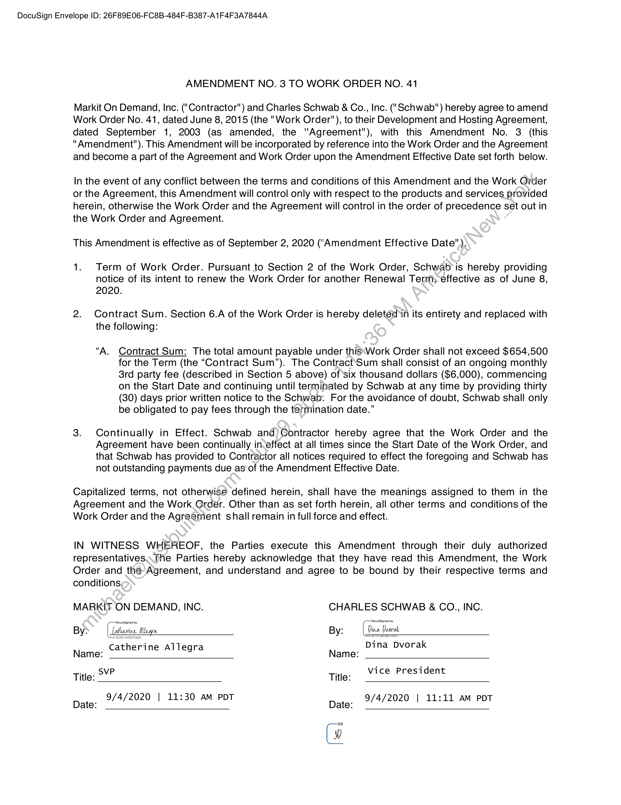

##### Amendment No. 3 to Work Order No. 41]

  
````col
```col-md
flexGrow=.5
===
> [!info] [Page 1](_attachments/images_Schwab-3.6.1.18.2200150086b.pdf_210056/page_1.png)
> 
```  
```col-md
DocuSign Envelope ID: 26F89E06-FC8B-484F-B387-A1F4F3A7844A  
AMENDMENT NO. 3 TO WORK ORDER NO. 41  
Markit On Demand, Inc. ("Contractor") and Charles Schwab & Co., Inc. ("Schwab") hereby agree to amend
Work Order No. 41, dated June 8, 2015 (the "Work Order"), to their Development and Hosting Agreement,
dated September 1, 2003 (as amended, the "Agreement"), with this Amendment No. 3 (this
"Amendment"). This Amendment will be incorporated by reference into the Work Order and the Agreement
and become a part of the Agreement and Work Order upon the Amendment Effective Date set forth below.  
In the event of any conflict between the terms and conditions of this Amendment and the Work Order
or the Agreement, this Amendment will control only with respect to the products and services provided
herein, otherwise the Work Order and the Agreement will control in the order of precedence set out in
the Work Order and Agreement.  
This Amendment is effective as of September 2, 2020 ("Amendment Effective Date").  
1. Term of Work Order. Pursuant to Section 2 of the Work Order, Schwab’is hereby providing
notice of its intent to renew the Work Order for another Renewal Term, effective as of June 8,
2020.  
2. Contract Sum. Section 6.A of the Work Order is hereby deleted in its entirety and replaced with
the following:  
“A. Contract Sum: The total amount payable under this:Work Order shall not exceed $654,500
for the Term (the “Contract Sum”). The Contract‘Sum shall consist of an ongoing monthly
8rd party fee (described in Section 5 above) of'six thousand dollars ($6,000), commencing
on the Start Date and continuing until terminated by Schwab at any time by providing thirty
(30) days prior written notice to the Schwab. For the avoidance of doubt, Schwab shall only
be obligated to pay fees through the termination date.”  
3. Continually in Effect. Schwab and) Contractor hereby agree that the Work Order and the
Agreement have been continually in-effect at all times since the Start Date of the Work Order, and
that Schwab has provided to Contractor all notices required to effect the foregoing and Schwab has
not outstanding payments due as of the Amendment Effective Date.  
Capitalized terms, not otherwise defined herein, shall have the meanings assigned to them in the
Agreement and the Work.Order. Other than as set forth herein, all other terms and conditions of the
Work Order and the Agreement shall remain in full force and effect.  
IN WITNESS WHEREOF, the Parties execute this Amendment through their duly authorized
representatives.  
The Parties hereby acknowledge that they have read this Amendment, the Work
Order and the-Agreement, and understand and agree to be bound by their respective terms and  
conditions,  
MARKIT ON DEMAND, INC. CHARLES SCHWAB & CO., INC.
Name: Catherine Allegra Name: Dina Dvorak  
Title: SVP Title: vice President  
Date: 2/4/2020 | 11:30 am POT Date: 9/4/2020 | 11:11 aM POT  
fi  
```
````
Notes:  


![[_attachments/Schwab-3.6.1.18.22 00150086 b.pdf]