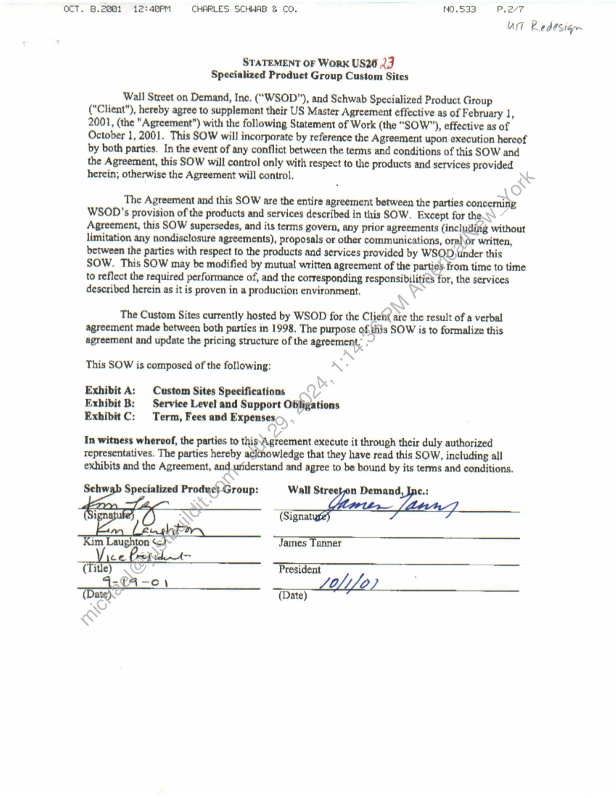
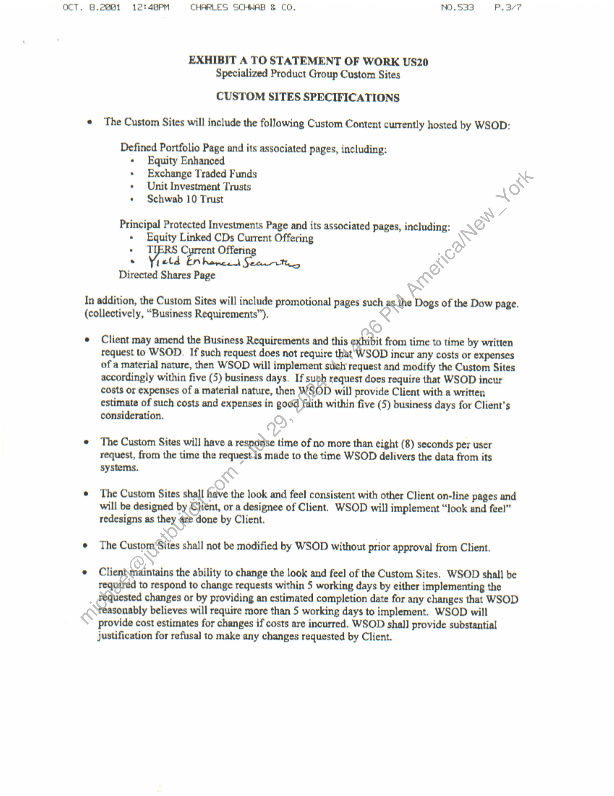
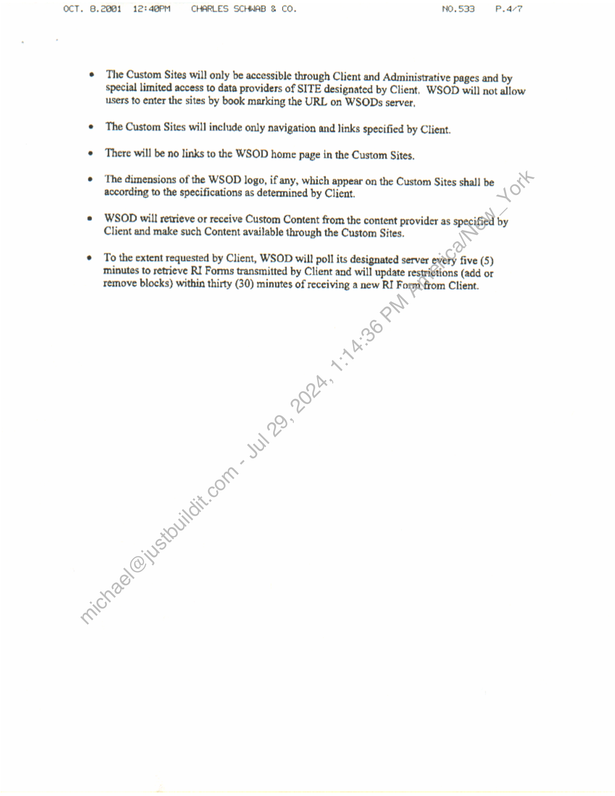
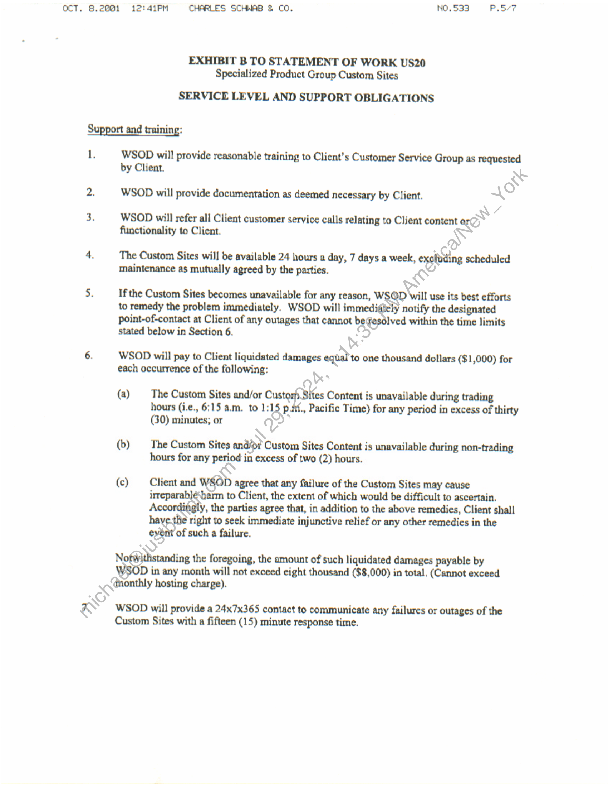
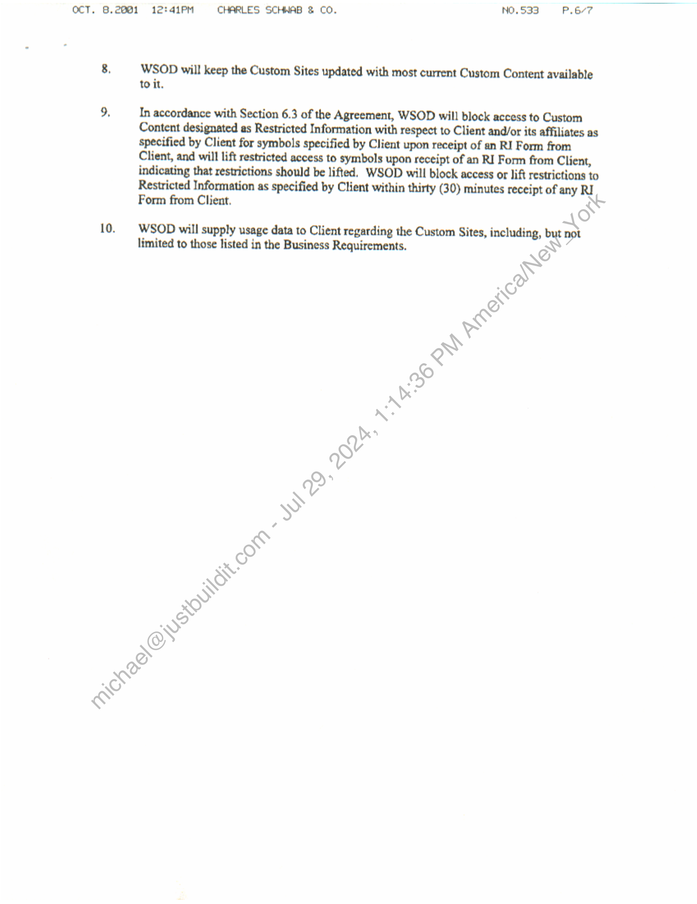
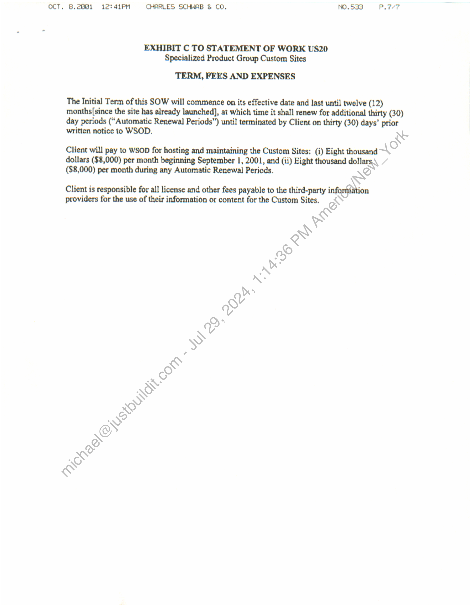

##### Statement of Work for Specialized Product Group Custom Sites]

  
````col
```col-md
flexGrow=.5
===
> [!info] [Page 1](_attachments/images_Schwab-3.6.1.18.2300147740.pdf_212721/page_1.png)
> 
```  
```col-md
OCT. 8.2881 12:48PM CHARLES SCHWAB & CO, NO,.533 P.2/7
art Redesign  
STATEMENT OF WorK US26 23
Specialized Product Group Custom Sites  
Wall Street on Demand, Inc, (““WSOD”), and Schwab Specialized Product Group
("Client"), hereby agree to supplement their US Master Agreement effective as of February 1,
2001, (the "Agreement") with the following Statement of Work (the “SOW”), effective as of
October 1, 2001. This SOW will incorporate by reference the Agreement upon execution hereof
by both parties, In the event of any conflict between the terms and conditions of this SOW and
the Agreement, this SOW will control only with respect to the products and services provided
herein; otherwise the Agreement will control.  
The Agreement and this SOW are the entire agreement between the parties conceming
WSOD’s provision of the products and services described in this SOW. Except for the
Agreement, this SOW supersedes, and its terms govern, any prior agreements (including without
limitation any nondisclosure agreements), proposals or other communications, ora)or written,
between the parties with respect to the products and services provided by WSOD,tnder this
SOW. This SOW may be modified by mutual written agreement of the parties. from time to time
to reflect the required performance of, and the corresponding responsibilities for, the services
described herein as it is proven in a production environment,  
The Custom Sites currently hosted by WSOD for the Clie? are the result of a verbal
agreement made between both parties in 1998. The purpose of, this SOW is to formalize this
agreement and update the pricing structure of the agreement,  
This SOW is composed of the following:  
Exhibit A: | Custom Sites Specifications
Exhibit B: — Service Level and Support Obligations
ExhibitC: Term, Fees and Expenses  
In witness whereof, the parties to this Agreement execute it through their duly authorized  
representatives. The parties hereby acknowledge that they have read this SOW, including all
exhibits and the Agreement, and_uriderstand and agree to be bound by its terms and conditions.  
Schwab Specialized Prodyet-Group: Wall > enn: ees
(Signati  
James Tanner
President  
(Title .
=€Fi-o Lelio)
(Date)  
```
````
Notes:    
````col
```col-md
flexGrow=.5
===
> [!info] [Page 2](_attachments/images_Schwab-3.6.1.18.2300147740.pdf_212721/page_2.png)
> 
```  
```col-md
ocT. 8.2001 12:49PM CHARLES SCHWAB & CO. NO.S33 P.3-7  
EXHIBIT A TO STATEMENT OF WORK US20
Specialized Product Group Custom Sites  
CUSTOM SITES SPECIFICATIONS
¢ The Custom Sites will include the following Custom Content currently hosted by WSOD:  
Defined Portfolio Page and its associated pages, including:
+ Equity Enhanced
+ Exchange Traded Funds
* Unit Investment Trusts
* Schwab 10 Trust  
Principal Protected Investments Page and its associated pages, including:
+ Equity Linked CDs Current Offering  
. T Current Offerin;petd Ent hence Stunt,
Directed Shares Page  
In addition, the Custom Sites will include promotional pages such as the Dogs of the Dow page.
(collectively, “Business Requirements”).  
* Client may amend the Business Requirements and this ¢xhibit from time to time by written
request to WSOD. If such request does not require that WSOD incur any costs or expenses
of a material nature, then WSOD will implement stich’ request and modify the Custom Sites
accordingly within five (5) business days, If sugh request does require that WSOD incur
costs or expenses of a material nature, then WSOD will provide Client with a written
estimate of such costs and expenses in good faith within five (5) business days for Client's
consideration.  
¢ The Custom Sites will have a response time of no more than eight (8) seconds per user
request, from the time the request-is made to the time WSOD delivers the data from its
systems.  
¢ The Custom Sites shall have the look and feel consistent with other Client on-line pages and
will be designed by Client, or a designee of Client. WSOD will implement “look and fee!”
redesigns as they are done by Client.  
¢ The CustomSites shall not be modified by WSOD without prior approval from Client,  
* Clientmaintains the ability to change the look and feel of the Custom Sites. WSOD shall be
required to respond to change requests within 5 working days by either implementing the
réquested changes or by providing an estimated completion date for any changes that WSOD
reasonably believes will require more than 5 working days to implement. WSOD will
provide cost estimates for changes if costs are incurred. WSOD shall provide substantial
justification for refusal to make any changes requested by Client.  
```
````
Notes:    
````col
```col-md
flexGrow=.5
===
> [!info] [Page 3](_attachments/images_Schwab-3.6.1.18.2300147740.pdf_212721/page_3.png)
> 
```  
```col-md
OCT. 8.2081 12:4@PM CHARLES SCHWAB & CO. NO. 533 P.ar?  
© The Custom Sites will only be accessible through Client and Administrative pages and by
special limited access to data providers of SITE designated by Client, WSOD will not allow
users to enter the sites by book marking the URL on WSODs server,  
¢ The Custom Sites will include only navigation and links specified by Client.
© There will be no links to the WSOD home page in the Custom Sites.  
© The dimensions of the WSOD logo, if any, which appear on the Custom Sites shall be BS
according to the specifications as determined by Client. \  
7  
* WSOD will retrieve or receive Custom Content from the content provider as ipl by
Client and make such Content available through the Custom Sites. ~  
&  
¢ To the extent requested by Client, WSOD will poll its designated server every five (5)
minutes to retrieve RI Forms transmitted by Client and will update r ons (add or
remove blocks) within thirty (30) minutes of receiving a new RI F Client.  
```
````
Notes:    
````col
```col-md
flexGrow=.5
===
> [!info] [Page 4](_attachments/images_Schwab-3.6.1.18.2300147740.pdf_212721/page_4.png)
> 
```  
```col-md
OCT. 8.2001  
12:41PM CHARLES SCHWAB & CO. NO, 533 P.Sv7  
EXHIBIT B TO STATEMENT OF WORK US20
Specialized Product Group Custom Sites  
SERVICE LEVEL AND SUPPORT OBLIGATIONS  
Support and training:  
WSOD will provide reasonable training to Client's Customer Service Group as requested
by Client.  
WSOD will provide documentation as deemed necessary by Client.  
WSOD will refer all Client customer service calls relating to Client content ar
functionality to Client.  
The Custom Sites will be available 24 hours a day, 7 days a week, excluding scheduled
maintenance as mutually agreed by the parties.  
If the Custom Sites becomes unavailable for any reason, WSOD Will use its best efforts
to remedy the problem immediately. WSOD will immedifiely notify the designated
point-of-contact at Client of any outages that cannot beesélved within the time limits
stated below in Section 6.  
WSOD will pay to Client liquidated damages equal to one thousand dollars ($1,000) for
each occurrence of the following:  
(a) The Custom Sites and/or CustomSites Content is unavailable during trading
hours (i.¢., 6:15 a.m. to 1:15 p.nf., Pacific Time) for any period in excess of thirty
(30) minutes; or  
(b) The Custom Sites and/pi Custom Sites Content is unavailable during non-trading
hours for any period in excess of two (2) hours.  
(c) Client and WSOD agree that any failure of the Custom Sites may cause
irreparablé‘harm to Client, the extent of which would be difficult to ascertain,
Accordingly, the parties agree that, in addition to the above remedies, Client shall
have-the right to seek immediate injunctive relief or any other remedies in the
eyvént of such a failure.  
Notwithstanding the foregoing, the amount of such liquidated damages payable by
WSOD in any month will not exceed eight thousand ($8,000) in total, (Cannot exceed
dmonthly hosting charge).  
WSOD will provide a 24x7x365 contact to communicate any failures or outages of the
Custom Sites with a fifteen (15) minute response time.  
```
````
Notes:    
````col
```col-md
flexGrow=.5
===
> [!info] [Page 5](_attachments/images_Schwab-3.6.1.18.2300147740.pdf_212721/page_5.png)
> 
```  
```col-md
Oct. 8.2001  
12:41PM CHARLES SCHWAB & CO. NO.533 P.6/7  
WSOD will keep the Custom Sites updated with most current Custom Content available
to it.  
In accordance with Section 6.3 of the Agreement, WSOD will block access to Custom
Content designated as Restricted Information with respect to Client and/or its affiliates as
specified by Client for symbols specified by Client upon receipt of an RI Form from
Client, and will lift restricted access to symbols upon receipt of an RI Form from Client,
indicating that restrictions should be lifted. WSOD will block access or lift restrictions to
Restricted Information as specified by Client within thirty (30) minutes receipt of any RI
Form from Client, AS  
WSOD will supply usage data to Client regarding the Custom Sites, including, x not
limited to those listed in the Business Requirements.  
```
````
Notes:    
````col
```col-md
flexGrow=.5
===
> [!info] [Page 6](_attachments/images_Schwab-3.6.1.18.2300147740.pdf_212721/page_6.png)
> 
```  
```col-md
OCT. 8.2081 12:41PM CHARLES SCHWAB & CO. —NO.533 PL7V7  
EXHIBIT C TO STATEMENT OF WORK US20
Specialized Product Group Custom Sites  
TERM, FEES AND EXPENSES  
The Initial Term of this SOW will commence on its effective date and last until twelve (12)
months[since the site has already launched], at which time it shall renew for additional thirty (30)
day periods (“Automatic Renewal] Periods”) until terminated by Client on thirty (30) days’ prior
written notice to WSOD. NS  
Client will pay to WSOD for hosting and maintaining the Custom Sites; (i) Eight thousand 1°
dollars ($8,000) per month beginning September 1, 2001, and (ii) Eight thousand dollars.\ A
($8,000) per month during any Automatic Renewal Periods. we  
Client is responsible for all license and other fees payable to the third-party infeftNion
providers for the use of their information or content for the Custom Sites. EN  
```
````
Notes:  


![[_attachments/Schwab-3.6.1.18.23 00147740.pdf]