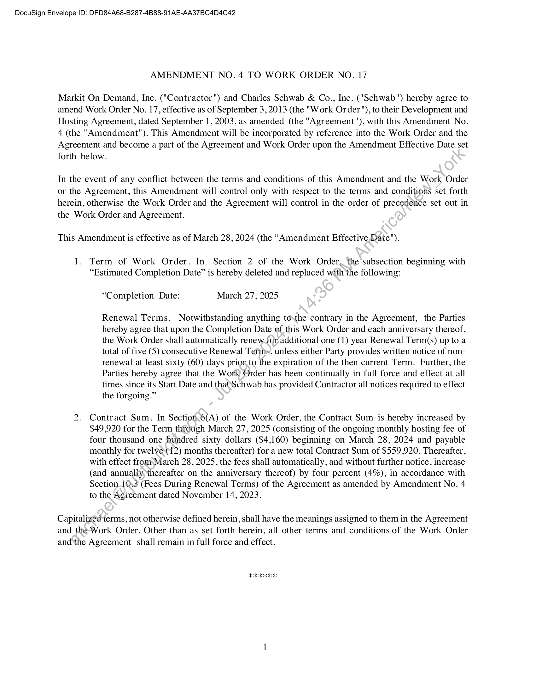
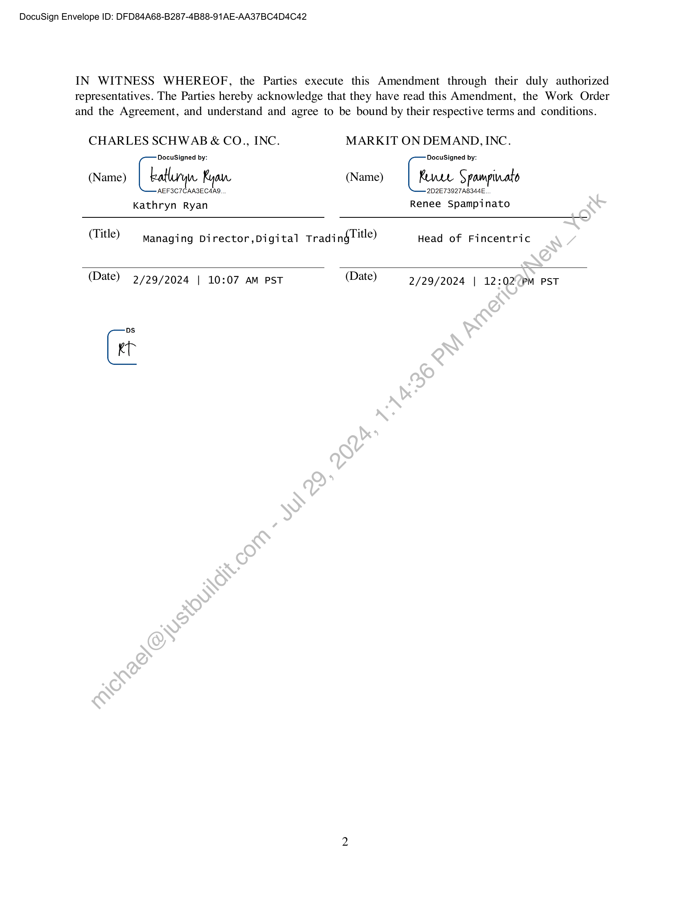

##### Amendment No. 4 to Work Order No. 17]

  
````col
```col-md
flexGrow=.5
===
> [!info] [Page 1](_attachments/images_Schwab-3.6.1.18.2500147805.pdf_212632/page_1.png)
> 
```  
```col-md
DocuSign Envelope ID: DFD84A68-B287-4B88-91AE-AA37BC4D4C42  
AMENDMENT NO.4 TO WORK ORDER NO. 17  
Markit On Demand, Inc. ("Contractor") and Charles Schwab & Co., Inc. ("Schwab") hereby agree to
amend Work Order No. 17, effective as of September 3, 2013 (the "Work Order"), to their Development and
Hosting Agreement, dated September 1, 2003, as amended (the "Agreement"), with this Amendment No.
4 (the "Amendment"). This Amendment will be incorporated by reference into the Work Order and the
Agreement and become a part of the Agreement and Work Order upon the Amendment Effective Date set
forth below.  
In the event of any conflict between the terms and conditions of this Amendment and the Work Order
or the Agreement, this Amendment will control only with respect to the terms and conditions set forth
herein, otherwise the Work Order and the Agreement will control in the order of precedence set out in
the Work Order and Agreement.  
This Amendment is effective as of March 28, 2024 (the “Amendment Effective Date").  
1. Term of Work Order. In Section 2 of the Work Order, the subsection beginning with
“Estimated Completion Date” is hereby deleted and replaced with the following:  
“Completion Date: March 27, 2025  
Renewal Terms. Notwithstanding anything tothe contrary in the Agreement, the Parties
hereby agree that upon the Completion Date of this Work Order and each anniversary thereof,
the Work Order shall automatically renew-for additional one (1) year Renewal Term(s) up to a
total of five (5) consecutive Renewal Terms, unless either Party provides written notice of nonrenewal at least sixty (60) days prior,to the expiration of the then current Term. Further, the
Parties hereby agree that the Work Order has been continually in full force and effect at all
times since its Start Date and that\‘Schwab has provided Contractor all notices required to effect
the forgoing.”  
2. Contract Sum. In Section.6(A) of the Work Order, the Contract Sum is hereby increased by
$49,920 for the Term through March 27, 2025 (consisting of the ongoing monthly hosting fee of
four thousand one hundred sixty dollars ($4,160) beginning on March 28, 2024 and payable
monthly for twelve12) months thereafter) for a new total Contract Sum of $559,920. Thereafter,
with effect fromMarch 28, 2025, the fees shall automatically, and without further notice, increase
(and annuallythereafter on the anniversary thereof) by four percent (4%), in accordance with
Section_10:3 (Fees During Renewal Terms) of the Agreement as amended by Amendment No. 4
to the Agreement dated November 14, 2023.  
Capitalized terms, not otherwise defined herein, shall have the meanings assigned to them in the Agreement  
and the-Work Order. Other than as set forth herein, all other terms and conditions of the Work Order
andthe Agreement shall remain in full force and effect.  
ogo eo ae  
```
````
Notes:    
````col
```col-md
flexGrow=.5
===
> [!info] [Page 2](_attachments/images_Schwab-3.6.1.18.2500147805.pdf_212632/page_2.png)
> 
```  
```col-md
DocuSign Envelope ID: DFD84A68-B287-4B88-91AE-AA37BC4D4C42  
IN WITNESS WHEREOF, the Parties execute this Amendment through their duly authorized
representatives. The Parties hereby acknowledge that they have read this Amendment, the Work Order
and the Agreement, and understand and agree to be bound by their respective terms and conditions.  
CHARLES SCHWAB & CO., INC. MARKIT ON DEMAND, INC.
DocuSigned by: DocuSigned by:
(Name) [ atlary Ryan. (Name) | Renee Spampinato
AEF3C7TCAA3ZEC4AQ. 2D2E73927A8344E.
Kathryn Ryan Renee Spampinato
(Title) Managing Director,Digital Tradinglitle) Head of Fincentric
(ate) 2/29/2024 | 10:07 AM PST (Date) 2/29/2024 | 12:02PM PST  
Gi  
```
````
Notes:  


![[_attachments/Schwab-3.6.1.18.25 00147805.pdf]