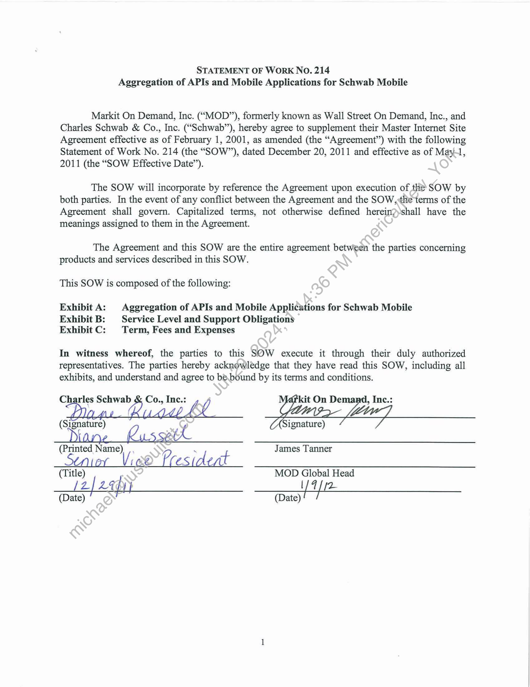
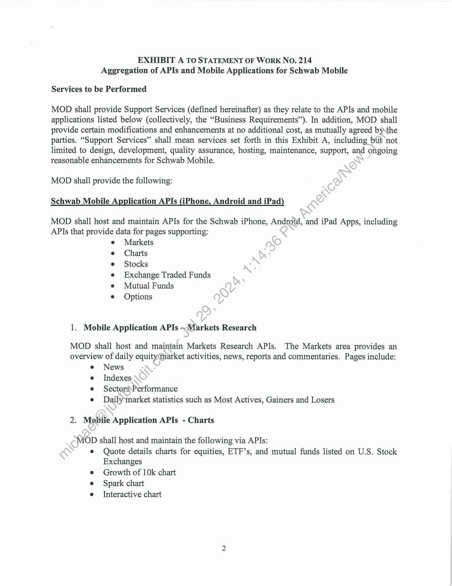
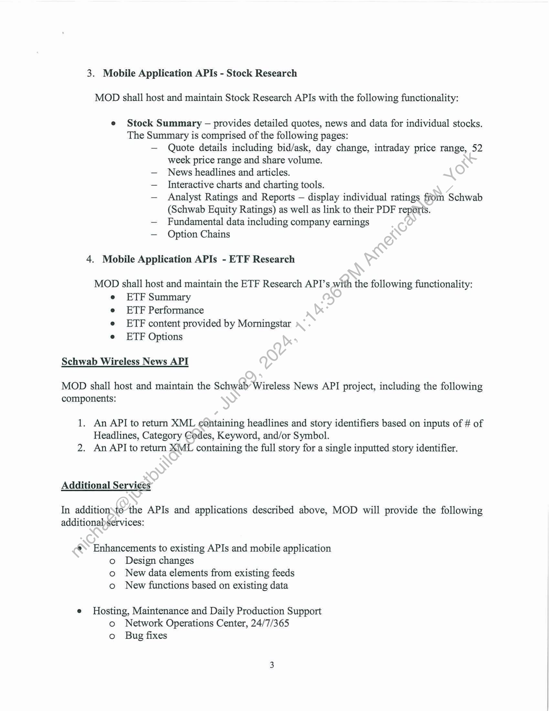
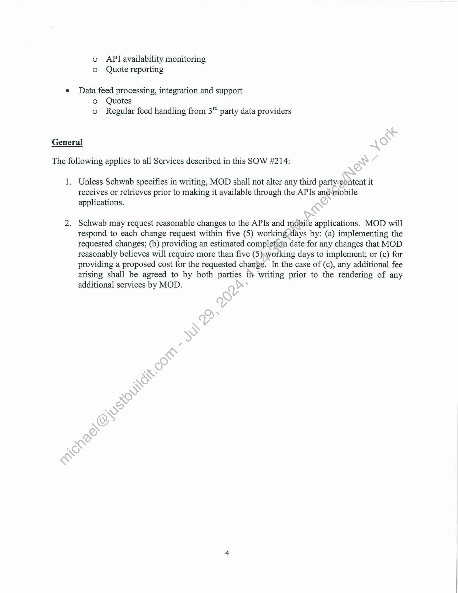
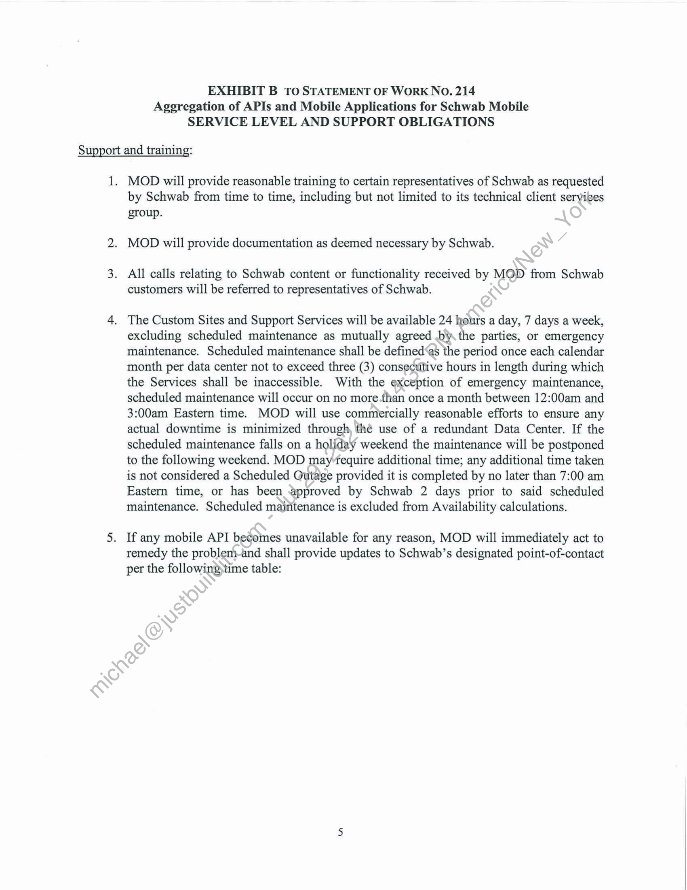
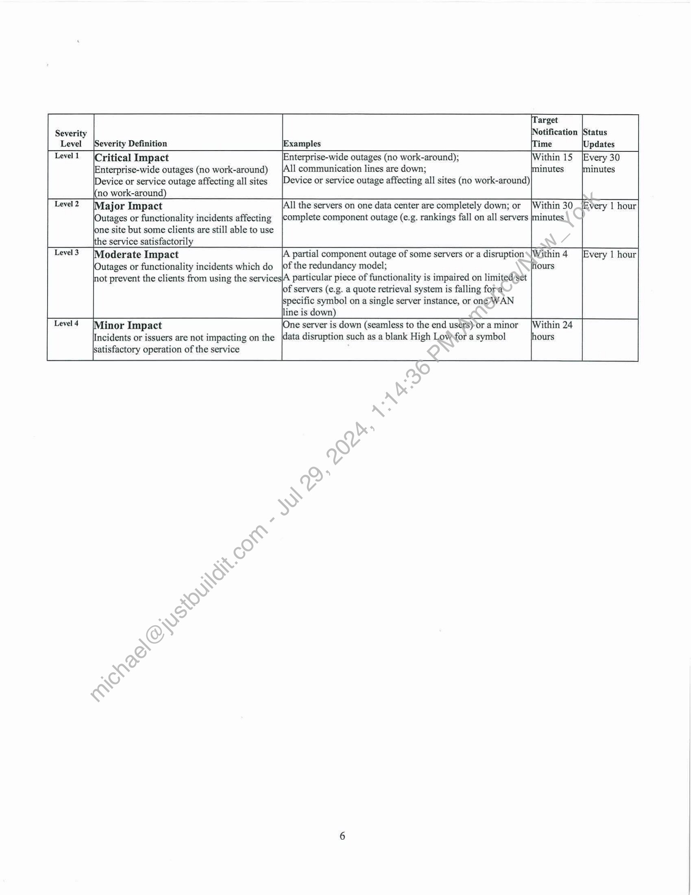
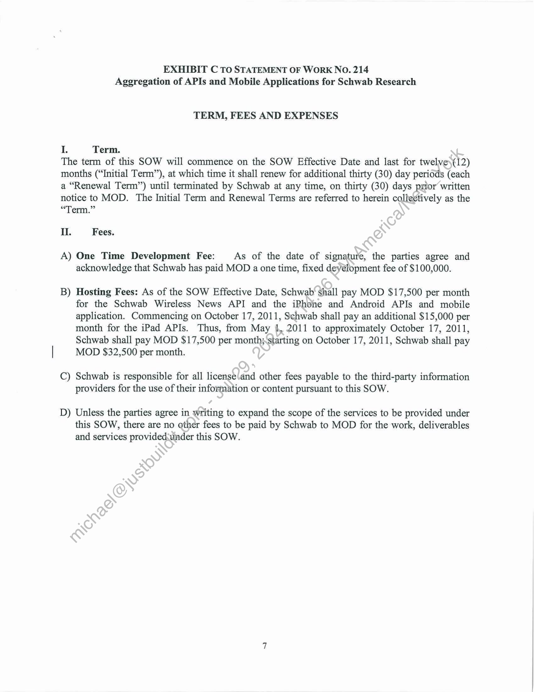

##### Statement of Work No. 214 - Aggregation of APIs and Mobile Applications for Schwab Mobile]

  
````col
```col-md
flexGrow=.5
===
> [!info] [Page 1](_attachments/images_Schwab-3.6.1.18.2600147749.pdf_210443/page_1.png)
> 
```  
```col-md
STATEMENT OF WORK NO. 214
Aggregation of APIs and Mobile Applications for Schwab Mobile  
Markit On Demand, Inc. (“MOD”), formerly known as Wall Street On Demand, Inc., and
Charles Schwab & Co., Inc. (“Schwab”), hereby agree to supplement their Master Internet Site
Agreement effective as of February 1, 2001, as amended (the “Agreement’’) with the following
Statement of Work No. 214 (the “SOW”), dated December 20, 2011 and effective as of May,
2011 (the “SOW Effective Date”).  
The SOW will incorporate by reference the Agreement upon execution of the SOW by
both parties. In the event of any conflict between the Agreement and the SOW, the terms of the
Agreement shall govern. Capitalized terms, not otherwise defined herein?»shall have the
meanings assigned to them in the Agreement.  
The Agreement and this SOW are the entire agreement between the parties concerning
products and services described in this SOW.  
This SOW is composed of the following:  
Exhibit A: | Aggregation of APIs and Mobile Applications for Schwab Mobile
Exhibit B: | Service Level and Support Obligations
Exhibit C: | Term, Fees and Expenses  
In witness whereof, the parties to this SOW execute it through their duly authorized
representatives. The parties hereby acknowledge that they have read this SOW, including all
exhibits, and understand and agree to be.bound by its terms and conditions.  
ios) Schwab 2 Co., Inc.: us j kit On Demand, Inc.:
(Signature) l Signature)  
(Printed Name) _ James Tanner
Stn oy Vi (x2 | a  
(Title) MOD Global Head  
/2] 29h) Fah ie
(Date) (Date)  
```
````
Notes:    
````col
```col-md
flexGrow=.5
===
> [!info] [Page 2](_attachments/images_Schwab-3.6.1.18.2600147749.pdf_210443/page_2.png)
> 
```  
```col-md
EXHIBIT A TO STATEMENT OF WORK NO. 214
Aggregation of APIs and Mobile Applications for Schwab Mobile  
Services to be Performed  
MOD shall provide Support Services (defined hereinafter) as they relate to the APIs and mobile
applications listed below (collectively, the “Business Requirements’’). In addition, MOD shall
provide certain modifications and enhancements at no additional cost, as mutually agreed bythe
parties. “Support Services” shall mean services set forth in this Exhibit A, including but not
limited to design, development, quality assurance, hosting, maintenance, support, and ongoing
reasonable enhancements for Schwab Mobile.  
MOD shall provide the following:  
Schwab Mobile Application APIs (iPhone, Android and iPad)  
MOD shall host and maintain APIs for the Schwab iPhone, Android, and iPad Apps, including
APIs that provide data for pages supporting:
e Markets
Charts
Stocks
Exchange Traded Funds
Mutual Funds
Options  
1. Mobile Application APIs -Markets Research  
MOD shall host and maintain Markets Research APIs. The Markets area provides an
overview of daily equity market activities, news, reports and commentaries. Pages include:
e News
e Indexes
e SectorsPerformance
e Daily market statistics such as Most Actives, Gainers and Losers  
2. Mobile Application APIs - Charts  
MOD shall host and maintain the following via APIs:
e Quote details charts for equities, ETF’s, and mutual funds listed on U.S. Stock  
Exchanges
e Growth of 10k chart
e Spark chart  
e Interactive chart  
```
````
Notes:    
````col
```col-md
flexGrow=.5
===
> [!info] [Page 3](_attachments/images_Schwab-3.6.1.18.2600147749.pdf_210443/page_3.png)
> 
```  
```col-md
3. Mobile Application APIs - Stock Research  
MOD shall host and maintain Stock Research APIs with the following functionality:  
Stock Summary — provides detailed quotes, news and data for individual stocks.
The Summary is comprised of the following pages:
— Quote details including bid/ask, day change, intraday price range, 52
week price range and share volume.
— News headlines and articles.
— Interactive charts and charting tools.
— Analyst Ratings and Reports — display individual ratings from Schwab
(Schwab Equity Ratings) as well as link to their PDF reports.
— Fundamental data including company earnings
— Option Chains  
4. Mobile Application APIs - ETF Research  
MOD shall host and maintain the ETF Research API’s with the following functionality:  
ETF Summary  
ETF Performance  
ETF content provided by Morningstar
ETF Options  
Schwab Wireless News API  
MOD shall host and maintain the Schwab’ Wireless News API project, including the following  
components:  
1. An API to return XML containing headlines and story identifiers based on inputs of of
Headlines, Category Codes, Keyword, and/or Symbol.
2. An API to return XML containing the full story for a single inputted story identifier.  
Additional Services  
In addition\to“the APIs and applications described above, MOD will provide the following
additionabservices:  
®. Enhancements to existing APIs and mobile application
o Design changes
o New data elements from existing feeds
o New functions based on existing data  
e Hosting, Maintenance and Daily Production Support
o Network Operations Center, 24/7/365
o Bug fixes  
```
````
Notes:    
````col
```col-md
flexGrow=.5
===
> [!info] [Page 4](_attachments/images_Schwab-3.6.1.18.2600147749.pdf_210443/page_4.png)
> 
```  
```col-md
o API availability monitoring
© Quote reporting  
Data feed processing, integration and support
© Quotes
o Regular feed handling from an party data providers  
General  
The following applies to all Services described in this SOW #214:  
1.  
Unless Schwab specifies in writing, MOD shall not alter any third party eontent it
receives or retrieves prior to making it available through the APIs andinobile
applications.  
Schwab may request reasonable changes to the APIs and mobile applications. MOD will
respond to each change request within five (5) working days by: (a) implementing the
requested changes; (b) providing an estimated completion date for any changes that MOD
reasonably believes will require more than five (5)working days to implement; or (c) for
providing a proposed cost for the requested change. In the case of (c), any additional fee
arising shall be agreed to by both parties im writing prior to the rendering of any
additional services by MOD.  
```
````
Notes:    
````col
```col-md
flexGrow=.5
===
> [!info] [Page 5](_attachments/images_Schwab-3.6.1.18.2600147749.pdf_210443/page_5.png)
> 
```  
```col-md
EXHIBIT B TO STATEMENT OF WORK NO. 214
Aggregation of APIs and Mobile Applications for Schwab Mobile
SERVICE LEVEL AND SUPPORT OBLIGATIONS  
Support and training:  
1;  
MOD will provide reasonable training to certain representatives of Schwab as requested
by Schwab from time to time, including but not limited to its technical client services  
group.
MOD will provide documentation as deemed necessary by Schwab.  
All calls relating to Schwab content or functionality received by MOD from Schwab
customers will be referred to representatives of Schwab.  
The Custom Sites and Support Services will be available 24 hours a day, 7 days a week,
excluding scheduled maintenance as mutually agreed by. the parties, or emergency
maintenance. Scheduled maintenance shall be defined‘as the period once each calendar
month per data center not to exceed three (3) consecutive hours in length during which
the Services shall be inaccessible. With the exception of emergency maintenance,
scheduled maintenance will occur on no more.than once a month between 12:00am and
3:00am Eastern time. MOD will use commercially reasonable efforts to ensure any
actual downtime is minimized through, the use of a redundant Data Center. If the
scheduled maintenance falls on a holiday weekend the maintenance will be postponed
to the following weekend. MOD may fequire additional time; any additional time taken
is not considered a Scheduled Qutage provided it is completed by no later than 7:00 am
Eastern time, or has been approved by Schwab 2 days prior to said scheduled
maintenance. Scheduled maintenance is excluded from Availability calculations.  
If any mobile API becomes unavailable for any reason, MOD will immediately act to
remedy the problem-and shall provide updates to Schwab’s designated point-of-contact
per the following,time table:  
```
````
Notes:    
````col
```col-md
flexGrow=.5
===
> [!info] [Page 6](_attachments/images_Schwab-3.6.1.18.2600147749.pdf_210443/page_6.png)
> 
```  
```col-md
~ frarget  
Severity Notification |Status
Level Severity Definition [Examples |Time |Updates
Level! |Critical Impact [Enterprise-wide outages (no work-around); ithin 15 [Every 30
Enterprise-wide outages (no work-around) _|All communication lines are down; minutes minutes
Device or service outage affecting all sites [Device or service outage affecting all sites (no work-around)
no work-around)
Level2 [Major Impact |All the servers on one data center are completely down; or [Within 30 [Every 1 hour
|Outages or functionality incidents affecting complete component outage (e.g. rankings fall on all servers |minutes.
jone site but some clients are still able to use
the service satisfactorily
Level3 [Moderate Impact |A partial component outage of some servers or a disruption\\Within 4 [Every | hour
Outages or functionality incidents which do |of the redundancy model; lhours
not prevent the clients from using the services|A particular piece of functionality is impaired on limited/Set
f servers (e.g. a quote retrieval system is falling fora
specific symbol on a single server instance, or ongé\VAN
line is down)
Level4 [Minor Impact ine server is down (seamless to the end users) or aminor _|Within 24
Incidents or issuers are not impacting on the data disruption such as a blank High Lowfor a symbol hours  
satisfactory operation of the service  
```
````
Notes:    
````col
```col-md
flexGrow=.5
===
> [!info] [Page 7](_attachments/images_Schwab-3.6.1.18.2600147749.pdf_210443/page_7.png)
> 
```  
```col-md
EXHIBIT C TO STATEMENT OF WORK NO. 214
Aggregation of APIs and Mobile Applications for Schwab Research  
TERM, FEES AND EXPENSES  
I Term.  
The term of this SOW will commence on the SOW Effective Date and last for twelve)(12)
months (“Initial Term”), at which time it shall renew for additional thirty (30) day periods (each
a “Renewal Term”) until terminated by Schwab at any time, on thirty (30) days prior written
notice to MOD. The Initial Term and Renewal Terms are referred to herein collectively as the
“Term.”  
II. Fees.  
A) One Time Development Fee: As of the date of signature, the parties agree and
acknowledge that Schwab has paid MOD a one time, fixed deyelopment fee of $100,000.  
B) Hosting Fees: As of the SOW Effective Date, Schwab‘ shall pay MOD $17,500 per month
for the Schwab Wireless News API and the iPhone and Android APIs and mobile
application. Commencing on October 17, 2011, Schwab shall pay an additional $15,000 per
month for the iPad APIs. Thus, from May i, 2011 to approximately October 17, 2011,
Schwab shall pay MOD $17,500 per month; starting on October 17, 2011, Schwab shall pay
MOD $32,500 per month.  
C) Schwab is responsible for all license\and other fees payable to the third-party information
providers for the use of their information or content pursuant to this SOW.  
D) Unless the parties agree in writing to expand the scope of the services to be provided under
this SOW, there are no other fees to be paid by Schwab to MOD for the work, deliverables
and services provided:under this SOW.  
```
````
Notes:  


![[_attachments/Schwab-3.6.1.18.26 00147749.pdf]