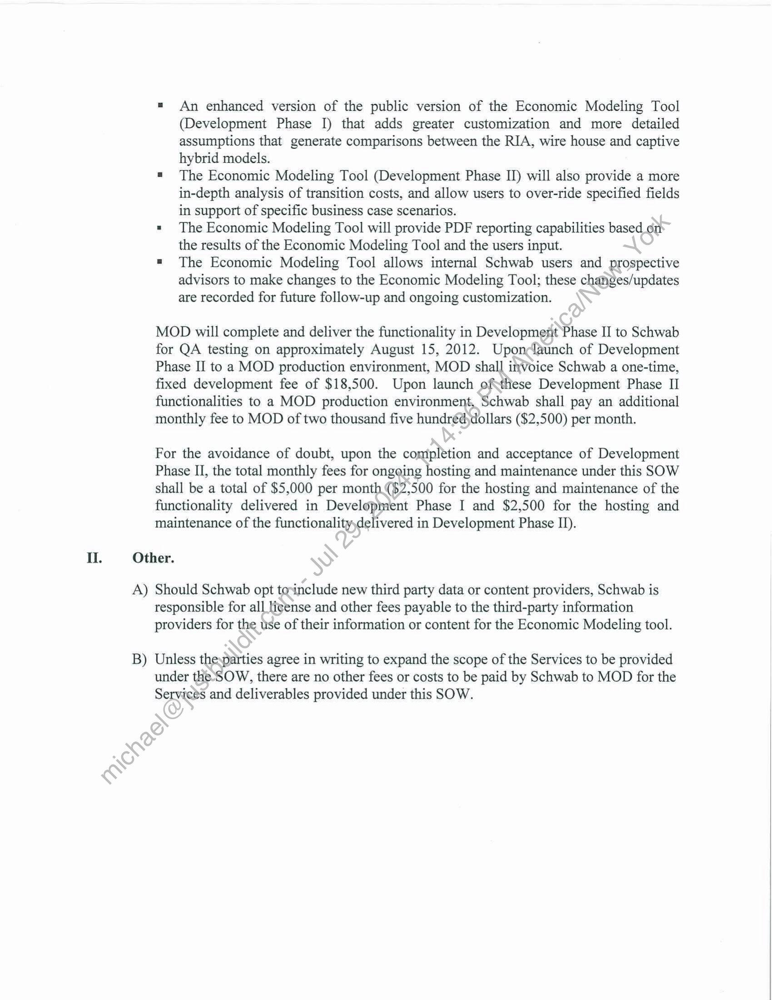

##### Statement of Work No. 196: Schwab Economic Modeling Tool]

  
````col
```col-md
flexGrow=.5
===
> [!info] [Page 1](_attachments/images_Schwab-3.6.1.18.2700147837.pdf_212257/page_1.png)
> 
```  
```col-md
STATEMENT OF WoRK NO. 196
Schwab Economic Modeling Tool  
Markit On Demand, Inc. (“MOD”), formerly known as Wall Street On Demand, Inc., and
Charles Schwab & Co., Inc. ("Schwab"), hereby agree to supplement their Master Internet Site
Agreement effective as of February 1, 2001, (the "Agreement") with the following Statement of
Work No. 196 (the “SOW”), dated January 13, 2012 and effective as of June 8, 2010 (the “SOW
Effective Date”).  
This SOW will incorporate by reference the Agreement upon execution hereefby both
parties. In the event of any conflict between the terms and conditions of this SOW-and the
Agreement, the Agreement will control.  
The Agreement and this SOW are the entire agreement between the-parties concerning
WSOD’s provision of the products and services described in this SOW;
This SOW is composed of the following:  
Exhibit A: | Schwab Economic Modeling Tool
Exhibit B: Service Level and Support Obligations
Exhibit C: Term, Fees and Expenses  
In witness whereof, the parties to this SOW executeit through their duly authorized
representatives. The parties hereby acknowledge ‘tliat they have read this SOW, including all
exhibits and the Agreement, and understand and agree to be bound by its terms and conditions.  
Charles Schwab & Co., Inc.: Markit On Demand, Inc.:  
(Signatur  
James Tanner  
Global Head of Distribution, Markit  
3(22/ 2012
(Date)  
```
````
Notes:    
````col
```col-md
flexGrow=.5
===
> [!info] [Page 2](_attachments/images_Schwab-3.6.1.18.2700147837.pdf_212257/page_2.png)
> 
```  
```col-md
EXHIBIT A TO STATEMENT OF WORK NO. 196
Schwab Economic Modeling Tool  
SCHWAB ECONOMIC MODELING TOOL SPECIFICATIONS  
Specifications and Services  
MOD will perform the following Services in connection with the Schwab Economic Modeling
Tool, which includes the design, development, hosting and maintenance of two websites_\The
websites will host and feature two different versions of tools based on Schwab’s Economic
Model.  
1) The first website will be publicly accessible and will be a basic version of the
Economic Model. This version of the tool will have scaled down functionality as directed
by Schwab, and is intended to give users a high level understanding of what would be
available with the full version of the Economic Modeling Tool.  
2 ) The second website will require a username and passwerd to access and will be
available to Schwab personnel (Business Development Officers (“BDO”), or others as
deemed necessary) and prospective Investment Advisors.  
MOD will work with Schwab to create a web-based’model outlining the costs and benefits
for Investment Advisors looking to start their own firm or to join a firm. The calculations
used to create the model will be based on Schwab’s current model.  
The Economic Modeling Tool created for BDO users and Schwab prospects will have
multiple user tiers with one tier being an,administrator who will be able to manage users.
Both versions of the Economic Modeling tool will accept inputs from users and use those
inputs to create a model specific to that user.  
The Economic Modeling Tool forBDO users will include PDF reporting capabilities based
on the results of the tool and-the users input. The tool will also allow BDOs to save models
and return later to complete/update them as needed.  
Schwab may request updates/changes to the Economic Modeling tool once per quarter.
MOD will perform:sueh requested changes so long as the requests are reasonable and MOD
does not need toiieur significant costs to do so.  
(collectively, the“Business Requirements”). In addition, the Schwab Economic Modeling Tool
will incorporate certain modifications and enhancements at no additional cost as mutually agreed
by the parties.  
The monthly hosting fee will cover site hosting (bandwidth and hardware), technical
infrastructure upgrades and certain requested enhancements of feature development work as
set forth above.  
If Schwab requests material enhancement or maintenance work that requires MOD to incur
additional costs or expenses that are not within the scope of the SOW as contemplated when
creating the SOW, then MOD will provide Schwab with a written good faith assessment of
such costs and expenses and the time required to perform the modifications required, for
Schwab’s consideration. If Schwab accepts the written estimate and agrees to have MOD  
```
````
Notes:    
````col
```col-md
flexGrow=.5
===
> [!info] [Page 3](_attachments/images_Schwab-3.6.1.18.2700147837.pdf_212257/page_3.png)
> 
```  
```col-md
perform the enhancements or maintenance work, this Statement of Work shall be amended to
include the additional scope, requirements, time and fees, or a separate SOW may be entered
into between the parties.  
```
````
Notes:    
````col
```col-md
flexGrow=.5
===
> [!info] [Page 4](_attachments/images_Schwab-3.6.1.18.2700147837.pdf_212257/page_4.png)
> 
```  
```col-md
EXHIBIT B TO STATEMENT OF WORK NO. 196
Schwab Economic Modeling Tool  
SERVICE LEVEL AND SUPPORT OBLIGATIONS  
Support and training:  
L  
MOD will provide reasonable training to certain representatives of Schwab as requésted
by Schwab from time to time, including but not limited to its Business Development
Officers.  
MOD will provide documentation as deemed necessary by Schwab.  
All calls relating to Schwab content or functionality received by MOD will be referred to
representatives of Schwab.  
The Schwab Economic Modeling Tool will be available 24 hours a day, 7 days a week,
excluding scheduled maintenance as mutually agreed-bthe parties, or emergency
maintenance. Scheduled maintenance shall be defined as the period once each calendar
month per data center not to exceed three (3) consecutive hours in length during which
the Services shall be inaccessible. With the excéption of emergency maintenance, or
scheduled maintenance that has been mutually agreed upon, maintenance will occur on
no more than once a month between 12:00am and 3:00am Eastern time. MOD will use
commercially reasonable efforts to ensufe any actual downtime is minimized through the
use of a redundant Data Center. If the scheduled maintenance falls on a holiday weekend
the maintenance will be postponed to the following weekend. MOD may require
additional time; any additionabtime taken is not considered a Scheduled Outage provided
it is completed by no laterthan 7:00 am Eastern time, or has been approved by Schwab
two (2) days prior to said-scheduled maintenance. Scheduled maintenance is excluded
from Availability calculations.  
If the Schwab.Economic Modeling Tool becomes unavailable for any reason, MOD will
immediately.act to remedy the problem and shall provide updates to Schwab’s designated
point-of-coritact per the following time table:  
```
````
Notes:    
````col
```col-md
flexGrow=.5
===
> [!info] [Page 5](_attachments/images_Schwab-3.6.1.18.2700147837.pdf_212257/page_5.png)
> 
```  
```col-md
jTarget  
Severity Notification |Status
Level |Severity Definition Examples {Time [Updates
Levell (Critical Impact |Enterprise-wide outages (no work-around); [Within 15 [Every 30
[Enterprise-wide outages (no work-around) _|All communication lines are down; minutes minutes
[Device or service outage affecting all sites  /Device or service outage affecting all sites (no work-around)
(no work-around)
Level2 [Major Impact |All the servers on one data center are completely down; or /Within 30 |Eyery 1 hour
(Outages or functionality incidents affecting complete component outage (e.g. rankings fall on all servers jminutes
lone site but some clients are still able to use
the service satisfactorily
Level3 {Moderate Impact |A partial component outage of some servers or a disruption |Wiihin4 [Every | hour
Outages or functionality incidents which do jof the redundancy model; ours
Inot prevent the clients from using the services\A particular piece of functionality is impaired on limited Set
lof servers (e.g. a quote retrieval system is falling for a
specific symbol on a single server instance, or one WAN
line is down)
Level4 [Minor Impact (One server is down (seamless to the end usersYer’a minor [Within 24
data disruption such as a blank High Low forwsymbol jhours  
Incidents or issuers are not impacting on the
satisfactory operation of the service  
```
````
Notes:    
````col
```col-md
flexGrow=.5
===
> [!info] [Page 6](_attachments/images_Schwab-3.6.1.18.2700147837.pdf_212257/page_6.png)
> 
```  
```col-md
EXHIBIT C TO STATEMENT OF WORK NO. 196
Schwab Economic Modeling Tool  
TERM, FEES AND EXPENSES  
L Term and Fees.  
The term of this SOW will commence on the SOW Effective Date and last for twelve)(12)
months after launch of Development Phase II (as described below) (the “Initial Term”), at which
time it shall renew for additional thirty (30) day periods (each a “Renewal Term’) until
terminated by Schwab at any time, on thirty (30) days prior written notice to MOD? The Initial
Term and Renewal Terms are referred to herein collectively as the “Term. \There are three
phases to this SOW:  
A) Design Phase. The design phase of this SOW commenced on the SOW Effective
Date and was completed on or about July 29, 2011As of December 31, 2010, the
parties agree and acknowledge that Schwab paid MOD a one-time, fixed design fee of
$81,500 for this design work, and no further fees ate due for this design phase.  
B) Development Phase I. Upon completion and acceptance of the design phase, MOD
will begin the first development phase (“Development Phase I”). Development Phase
I will conclude with the completed.dévelopment and acceptance by Schwab of the
following elements as approved by Schwab in the Design Phase:  
= A public facing version of Schwab’s Economic Modeling Tool that will be hosted
by MOD that can be linked to from the Schwab Advisor Services public website  
= This Economic Modeling Tool will incorporate limited user inputs that then
generate a one year revenue and expenses results table based on an advisor
transitioning from either a wire house or a captive hybird to the RIA model  
= This Economic Modeling Tool will also illustrate the longer-term business and
total valtie-of the RIA model as compared to the wire house and captive hybrid
models:  
Schwab shall pay MOD a monthly fee of two thousand five hundred dollars ($2,500)
per month beginning on the earlier of (a) February 14, 2012, or (b) upon the
completion and acceptance of the Development Phase I and launch of these
functionalities to a MOD production environment.  
  
C) Development Phase II. Upon completion of Development Phase I, on
approximately February 14, 2012, MOD will begin the second Development Phase
(Development Phase II). Development Phase II will conclude with launch of the
following elements as approved by Schwab in the Design Phase to a MOD production
environment:  
```
````
Notes:    
````col
```col-md
flexGrow=.5
===
> [!info] [Page 7](_attachments/images_Schwab-3.6.1.18.2700147837.pdf_212257/page_7.png)
> 
```  
```col-md
An enhanced version of the public version of the Economic Modeling Tool
(Development Phase I) that adds greater customization and more detailed
assumptions that generate comparisons between the RIA, wire house and captive
hybrid models.  
The Economic Modeling Tool (Development Phase II) will also provide a more
in-depth analysis of transition costs, and allow users to over-ride specified fields
in support of specific business case scenarios.  
The Economic Modeling Tool will provide PDF reporting capabilities based on
the results of the Economic Modeling Tool and the users input.  
The Economic Modeling Tool allows internal Schwab users and prospective
advisors to make changes to the Economic Modeling Tool; these changes/updates
are recorded for future follow-up and ongoing customization.  
MOD will complete and deliver the functionality in Development Phase II to Schwab
for QA testing on approximately August 15, 2012. Uponclaunch of Development
Phase II to a MOD production environment, MOD shall invoice Schwab a one-time,
fixed development fee of $18,500. Upon launch ofthese Development Phase II
functionalities to a MOD production environment, Schwab shall pay an additional
monthly fee to MOD of two thousand five hundréd)dollars ($2,500) per month.  
For the avoidance of doubt, upon the completion and acceptance of Development
Phase II, the total monthly fees for ongeing hosting and maintenance under this SOW
shall be a total of $5,000 per month.($2,500 for the hosting and maintenance of the
functionality delivered in Development Phase I and $2,500 for the hosting and
maintenance of the functionalityydelivered in Development Phase II).  
Ul. Other.  
A) Should Schwab opt torinclude new third party data or content providers, Schwab is
responsible for all ligense and other fees payable to the third-party information
providers for the use of their information or content for the Economic Modeling tool.  
B) Unless thesparties agree in writing to expand the scope of the Services to be provided
under the-SOW, there are no other fees or costs to be paid by Schwab to MOD for the
Services and deliverables provided under this SOW.  
```
````
Notes:  


![[_attachments/Schwab-3.6.1.18.27 00147837.pdf]