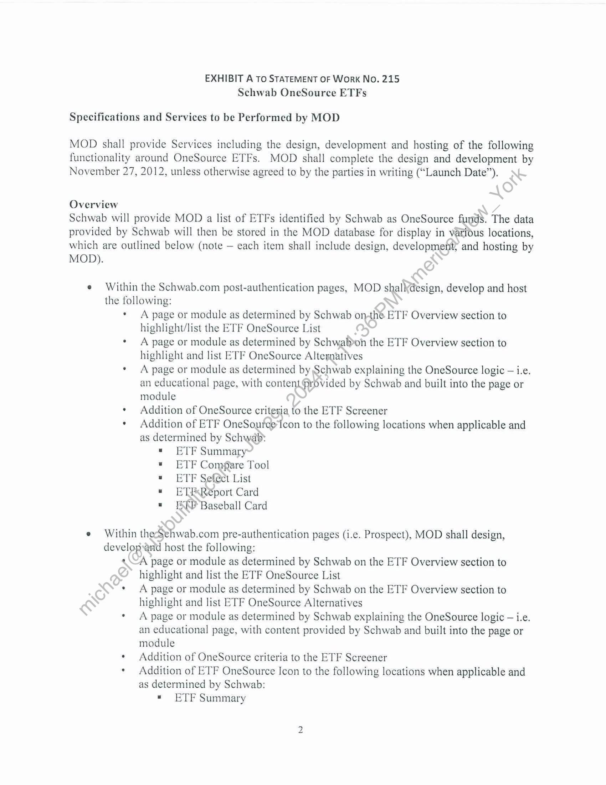

##### Statement of Work No. 215: Schwab OneSource ETFs]

  
````col
```col-md
flexGrow=.5
===
> [!info] [Page 1](_attachments/images_Schwab-3.6.1.18.2800150150.pdf_210941/page_1.png)
> 
```  
```col-md
STATEMENT OF WorkK No. 215
Schwab OneSource ETFs  
Markit On Demand, Inc., formerly known as Wall Street On Demand, Inc. (“MOD”) and Charles Schwab
& Co.,, Inc. (“Schwab”), hereby agree to supplement their Master Internet Site Agreement effective as of February 1,
2001, as amended (the “Agreement”) with the following Statement of Work No. 215 (the “SOW”), dated July 13,
2012 and effective as of July 1, 2012 (the “SOW Effective Date’).  
The SOW will incorporate by reference the Agreement upon execution of the SOW by both parties. Inthe
event of any conflict between the Agreement and the SOW, the terms of the Agreement shall govern. Capitalized
terms, not otherwise defined herein, shall have the meanings assigned to them in the Agreement.  
The Agreement and this SOW are the entire agreement between the parties concerning
MOD’s provision of the products and services described in this SOW.  
This SOW is composed of the following:  
Exhibit A: © Schwab OneSource ETFs
Exhibit B: — Service Level and Support Obligations
Exhibit C: | Term, Fees and Expenses  
In witness whereof, the parties to this SOW executeit through their duly authorized
representatives. The parties hereby acknowledge that .they have read this SOW, including all
exhibits and the Agreement, and understand and agree to be bound by its terms and conditions.  
Charles Schwab & Co., Inc.: mand, Inc.:
(Signatye)
_ Eliza be.
(Printed aaa Elin i James Tanner
(Title) MOD 513) Head  
(Date) (Date)  
```
````
Notes:    
````col
```col-md
flexGrow=.5
===
> [!info] [Page 2](_attachments/images_Schwab-3.6.1.18.2800150150.pdf_210941/page_2.png)
> 
```  
```col-md
EXHIBIT A To STATEMENT OF Work No. 215
Schwab OneSource ETFs  
Specifications and Services to be Performed by MOD  
MOD shall provide Services including the design, development and hosting of the following
functionality around OneSource ETFs. MOD shall complete the design and development by
November 27, 2012, unless otherwise agreed to by the parties in writing (“Launch Date”).  
Overview  
Schwab will provide MOD a list of ETFs identified by Schwab as OneSource fund’. The data
provided by Schwab will then be stored in the MOD database for display in vatidus locations,
which are outlined below (note — each item shall include design, development; and hosting by  
MOD).  
e Within the Schwab.com post-authentication pages, MOD shall design, develop and host
the following:  
A page or module as determined by Schwab onthe ETF Overview section to
highlight/list the ETF OneSource List
A page or module as determined by Schwab>on the ETF Overview section to
highlight and list ETF OneSource Alternatives
A page or module as determined by Schwab explaining the OneSource logic — i.e,
an educational page, with contentprovided by Schwab and built into the page or
module
Addition of OneSource critesia, to the ETF Screener
Addition of ETF OneSource icon to the following locations when applicable and
as determined by Schwab:  
«= ETF Summary  
* ETF Compare Tool  
= ETF Se@et.List  
= ETE Report Card  
= EW Baseball Card  
e Within thecSehwab.com pre-authentication pages (i.e. Prospect), MOD shall design,
developrid host the following:  
A page or module as determined by Schwab on the ETF Overview section to
highlight and list the ETF OneSource List
A page or module as determined by Schwab on the ETF Overview section to
highlight and list ETF OneSource Alternatives
A page or module as determined by Schwab explaining the OneSource logic — i.e.
an educational page, with content provided by Schwab and built into the page or
module
Addition of OneSource criteria to the ETF Screener
Addition of ETF OneSource Icon to the following locations when applicable and
as determined by Schwab:  
» ETF Summary  
wu  
```
````
Notes:    
````col
```col-md
flexGrow=.5
===
> [!info] [Page 3](_attachments/images_Schwab-3.6.1.18.2800150150.pdf_210941/page_3.png)
> 
```  
```col-md
« ETF Select List
« ETF Report Card  
Within SAC.com, MOD shall design, develop and host the following:
* A page or module as determined by Schwab on the ETF Overview section to
highlight and list the ETF OneSource List
* A page or module as determined by Schwab on the ETF Overview section to
highlight and list ETF OneSource Alternatives
* A page or module as determined by Schwab explaining the OneSource logi¢> i.e.
an educational page, with content provided by Schwab and built into the page or
module
* Addition of OneSource criteria to the ETF Screener
* Addition of ETF OneSource Icon to the following locations whefapplicable and
as determined by Schwab:
* ETF Summary
« ETF Select List
« ETF Report Card
« ETF Baseball Card  
Mobile (API), MOD shall design, develop and hos\th¢ following:
* Add indicator to Summary response indi¢ating if an ETF is on OneSource list.  
General
* MOD shall update disclosures-omdall of the pages or modules modified hereunder,
as directed by Schwab during thé term of this SOW.  
Wo  
```
````
Notes:    
````col
```col-md
flexGrow=.5
===
> [!info] [Page 4](_attachments/images_Schwab-3.6.1.18.2800150150.pdf_210941/page_4.png)
> 
```  
```col-md
EXHIBIT B To STATEMENT OF Work No. 215
Schwab OneSource ETFs
SERVICE LEVEL AND SUPPORT OBLIGATIONS  
Support and training:  
iF  
N  
(vs)  
MOD will provide reasonable training to certain representatives of Schwab as requested
by Schwab from time to time, including but not limited to its technical client services
group.  
MOD will provide documentation as deemed necessary by Schwab.  
All calls relating to Schwab content or functionality received by;(40D from Schwab
customers will be referred to designated representatives of Schwab¢  
The Schwab OneSource ETFs will be available 24 hours a day, 7 days a week, excluding
scheduled maintenance as mutually agreed by the parties; or emergency maintenance.
Scheduled maintenance shall be defined as the period@nce each calendar month per data
center not to exceed three (3) consecutive hours in lenpth during which the Services shall
be inaccessible. With the exception of emergency maintenance, scheduled maintenance
will occur on no more than once a month bétween 12:00am and 3:00am Eastern time.
MOD will use commercially reasonabléyefforts to ensure any actual downtime is
minimized through the use of a redundant (Data Center. If the scheduled maintenance falls
on a holiday weekend the maintenante will be postponed to the following weekend.
MOD may require additional tiff?e> any additional time taken is not considered a
Scheduled Outage provided it is completed by no later than 7:00 am Eastern time, or has
been approved by Schwab Qvdays prior to said scheduled maintenance. Scheduled
maintenance is excluded from Availability calculations.  
If the Schwab OneSource ETFs become unavailable for any reason, MOD will
immediately act tavemedy the problem and shall provide updates to Schwab’s designated
point-of-contaet\per the following time table:  
```
````
Notes:    
````col
```col-md
flexGrow=.5
===
> [!info] [Page 5](_attachments/images_Schwab-3.6.1.18.2800150150.pdf_210941/page_5.png)
> 
```  
```col-md
EXHIBIT C To STATEMENT OF Work No. 215
Schwab OneSource ETFs  
TERM, FEES AND EXPENSES  
iG Term.  
The term of this SOW will commence on the SOW Effective Date and last for twelve (12)
months (“Initial Term”), at which time it shall renew for additional thirty (30) day petiods (each
a “Renewal Term”) until terminated by Schwab at any time, on thirty (30) daysprior written
notice to MOD. The Initial Term and Renewal Terms are referred to herein cdNectively as the
“Term,”  
I. Fees,  
A) One Time Development Fee: Upon launch of the project to a M@D\production environment, Schwab
shall pay MOD a one-time, fixed development fee of $20,000.  
B) Hosting Fees: Upon launch of the project to a MOD production environment, Schwab shall pay MOD
$3,500 per month for the hosting and maintenance of the QneSource ETF content.  
C) Schwab is responsible for all license and other fegs Payable to the third-party information providers for the
use of their information or content pursuant to this SOW.  
D) Unless the parties agree in writing to expand the scope of the services to be provided under this SOW, there
are no other fees to be paid by Schwab {go MOD for the work, deliverables and services provided under this
sow.  
```
````
Notes:  


![[_attachments/Schwab-3.6.1.18.28 00150150.pdf]