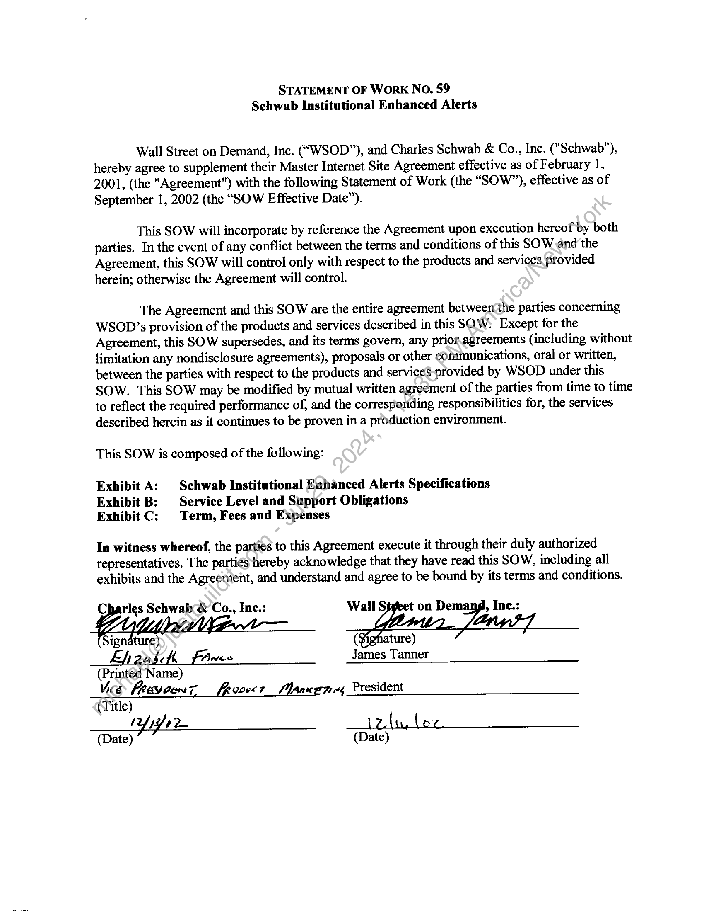
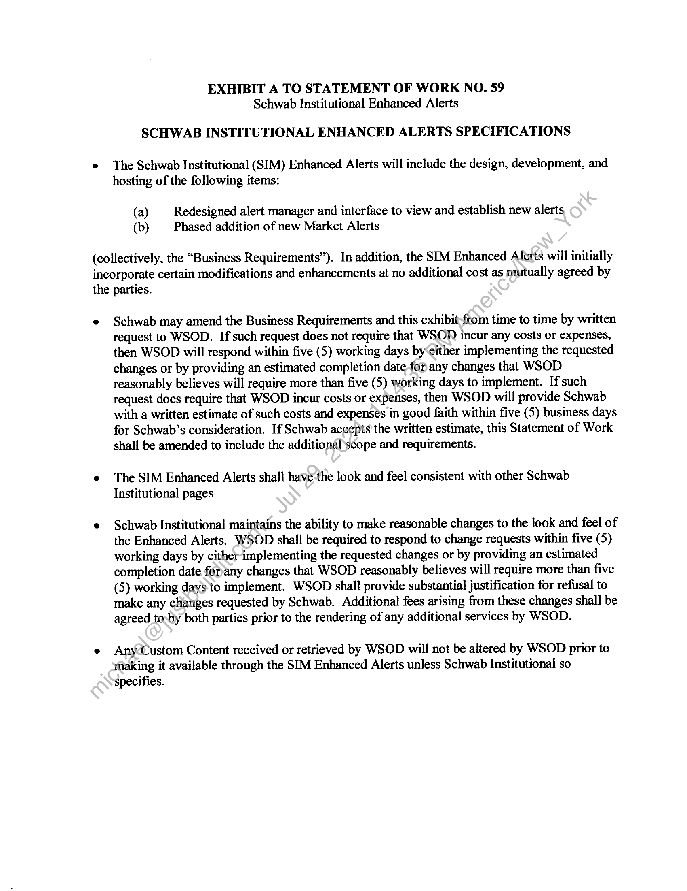
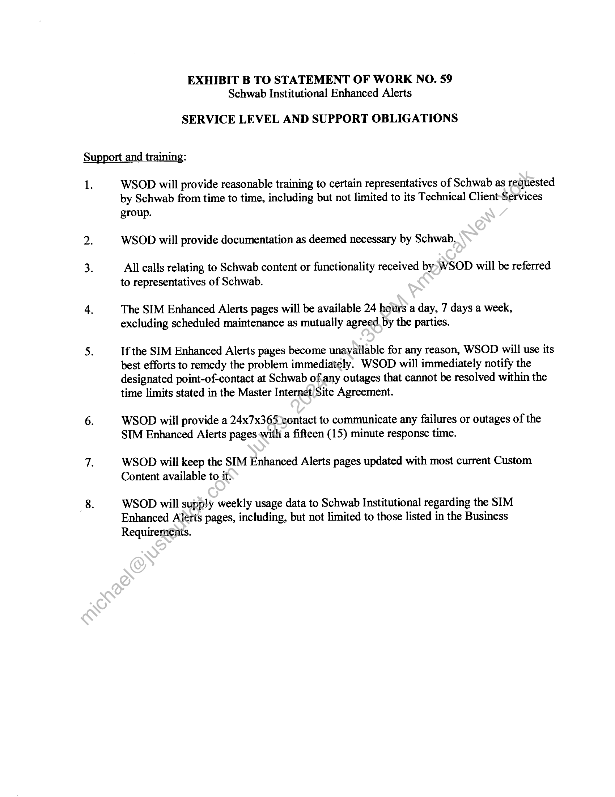
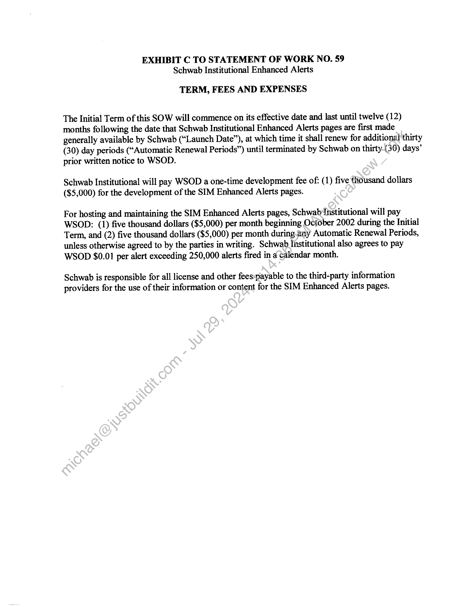

##### Statement of Work No. 59 - Schwab Institutional Enhanced Alerts]

  
````col
```col-md
flexGrow=.5
===
> [!info] [Page 1](_attachments/images_Schwab-3.6.1.18.2900147792.pdf_210714/page_1.png)
> 
```  
```col-md
STATEMENT OF WorK No. 59
Schwab Institutional Enhanced Alerts  
Wall Street on Demand, Inc. (“WSOD”), and Charles Schwab & Co., Inc. ("Schwab"),
hereby agree to supplement their Master Internet Site Agreement effective as of February 1,
2001, (the "Agreement") with the following Statement of Work (the “SOW”), effective as of
September 1, 2002 (the “SOW Effective Date”).  
This SOW will incorporate by reference the Agreement upon execution hereof by both
parties. In the event of any conflict between the terms and conditions of this SOW and the
Agreement, this SOW will control only with respect to the products and services provided
herein; otherwise the Agreement will control.  
The Agreement and this SOW are the entire agreement between the parties concerning
WSOD’s provision of the products and services described in this SOW: Except for the
Agreement, this SOW supersedes, and its terms govern, any prior.agreements (including without
limitation any nondisclosure agreements), proposals or other communications, oral or written,
between the parties with respect to the products and services-provided by WSOD under this
SOW. This SOW may be modified by mutual written agreement of the parties from time to time
to reflect the required performance of, and the correspotiding responsibilities for, the services
described herein as it continues to be proven in a production environment.  
This SOW is composed of the following:  
Exhibit A: | Schwab Institutional Enhanced Alerts Specifications  
Exhibit B: | Service Level and Support Obligations  
Exhibit C: Term, Fees and Expenses  
In witness whereof, the parties to this Agreement execute it through their duly authorized  
representatives. The partiés hereby acknowledge that they have read this SOW, including all
exhibits and the Agreement, and understand and agree to be bound by its terms and conditions.  
Charles Schwab & Co., Inc.: Wall Steet on Dema:
(Yl (Fighature)  
_ Ehzusch Fame James Tanner  
(Printed Name)
Vice FES OUT [Roo0er Plaanzeri 4 President
(Title)  
/ Yyys a  
(Date) (Date)  
```
````
Notes:    
````col
```col-md
flexGrow=.5
===
> [!info] [Page 2](_attachments/images_Schwab-3.6.1.18.2900147792.pdf_210714/page_2.png)
> 
```  
```col-md
EXHIBIT A TO STATEMENT OF WORK NO. 59
Schwab Institutional Enhanced Alerts  
SCHWAB INSTITUTIONAL ENHANCED ALERTS SPECIFICATIONS  
The Schwab Institutional (SIM) Enhanced Alerts will include the design, development, and
hosting of the following items:  
(a) Redesigned alert manager and interface to view and establish new alerts
(b) Phased addition of new Market Alerts  
(collectively, the “Business Requirements”). In addition, the SIM Enhanced Alerts will initially
incorporate certain modifications and enhancements at no additional cost as mutually agreed by
the parties.  
Schwab may amend the Business Requirements and this exhibit-from time to time by written
request to WSOD. If such request does not require that WSOD incur any costs or expenses,
then WSOD will respond within five (5) working days by‘either implementing the requested
changes or by providing an estimated completion date-for any changes that WSOD
reasonably believes will require more than five (5) working days to implement. If such
request does require that WSOD incur costs or expenses, then WSOD will provide Schwab
with a written estimate of such costs and expensés in good faith within five (5) business days
for Schwab’s consideration. If Schwab accepts the written estimate, this Statement of Work
shall be amended to include the additional scope and requirements.  
The SIM Enhanced Alerts shall have-the look and feel consistent with other Schwab
Institutional pages  
Schwab Institutional maintains the ability to make reasonable changes to the look and feel of
the Enhanced Alerts. WSOD shall be required to respond to change requests within five (5)
working days by either implementing the requested changes or by providing an estimated
completion date forany changes that WSOD reasonably believes will require more than five
(5) working days to implement. WSOD shall provide substantial justification for refusal to
make any clianges requested by Schwab. Additional fees arising from these changes shall be
agreed toby both parties prior to the rendering of any additional services by WSOD.  
Any-Custom Content received or retrieved by WSOD will not be altered by WSOD prior to
tflaking it available through the SIM Enhanced Alerts unless Schwab Institutional so
specifies.  
```
````
Notes:    
````col
```col-md
flexGrow=.5
===
> [!info] [Page 3](_attachments/images_Schwab-3.6.1.18.2900147792.pdf_210714/page_3.png)
> 
```  
```col-md
EXHIBIT B TO STATEMENT OF WORK NO. 59
Schwab Institutional Enhanced Alerts  
SERVICE LEVEL AND SUPPORT OBLIGATIONS  
Support and training:  
1.  
WSOD will provide reasonable training to certain representatives of Schwab as requested
by Schwab from time to time, including but not limited to its Technical Client-Services  
group.
WSOD will provide documentation as deemed necessary by Schwab,  
All calls relating to Schwab content or functionality received by>WSOD will be referred
to representatives of Schwab.  
The SIM Enhanced Alerts pages will be available 24 hours a day, 7 days a week,
excluding scheduled maintenance as mutually agreed. by the parties.  
If the SIM Enhanced Alerts pages become unavailable for any reason, WSOD will use its
best efforts to remedy the problem immediately. WSOD will immediately notify the
designated point-of-contact at Schwab ofany outages that cannot be resolved within the
time limits stated in the Master Internet Site Agreement.  
WSOD will provide a 24x7x365 contact to communicate any failures or outages of the
SIM Enhanced Alerts pages with a fifteen (15) minute response time.  
WSOD will keep the SIM Enhanced Alerts pages updated with most current Custom
Content available to it:  
WSOD will supply weekly usage data to Schwab Institutional regarding the SIM
Enhanced Alerts pages, including, but not limited to those listed in the Business
Requiremenis.  
```
````
Notes:    
````col
```col-md
flexGrow=.5
===
> [!info] [Page 4](_attachments/images_Schwab-3.6.1.18.2900147792.pdf_210714/page_4.png)
> 
```  
```col-md
EXHIBIT C TO STATEMENT OF WORK NO. 59
Schwab Institutional Enhanced Alerts  
TERM, FEES AND EXPENSES  
The Initial Term of this SOW will commence on its effective date and last until twelve (12)
months following the date that Schwab Institutional Enhanced Alerts pages are first made
generally available by Schwab (“Launch Date”), at which time it shall renew for additional thirty
(30) day periods (“Automatic Renewal Periods”) until terminated by Schwab on thirty-(38) days’
prior written notice to WSOD.  
Schwab Institutional will pay WSOD a one-time development fee of: (1) five thousand dollars
($5,000) for the development of the SIM Enhanced Alerts pages.  
For hosting and maintaining the SIM Enhanced Alerts pages, Schwab Institutional will pay
WSOD: (1) five thousand dollars ($5,000) per month beginning October 2002 during the Initial
Term, and (2) five thousand dollars ($5,000) per month during_any Automatic Renewal Periods,
unless otherwise agreed to by the parties in writing. Schwab Institutional also agrees to pay
WSOD $0.01 per alert exceeding 250,000 alerts fired in 4 calendar month.  
Schwab is responsible for all license and other fees:payable to the third-party information
providers for the use of their information or content for the SIM Enhanced Alerts pages.  
```
````
Notes:  


![[_attachments/Schwab-3.6.1.18.29 00147792.pdf]