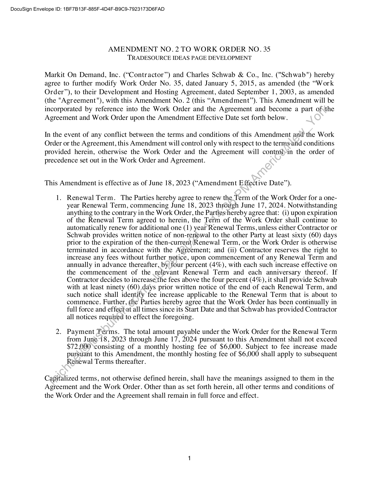
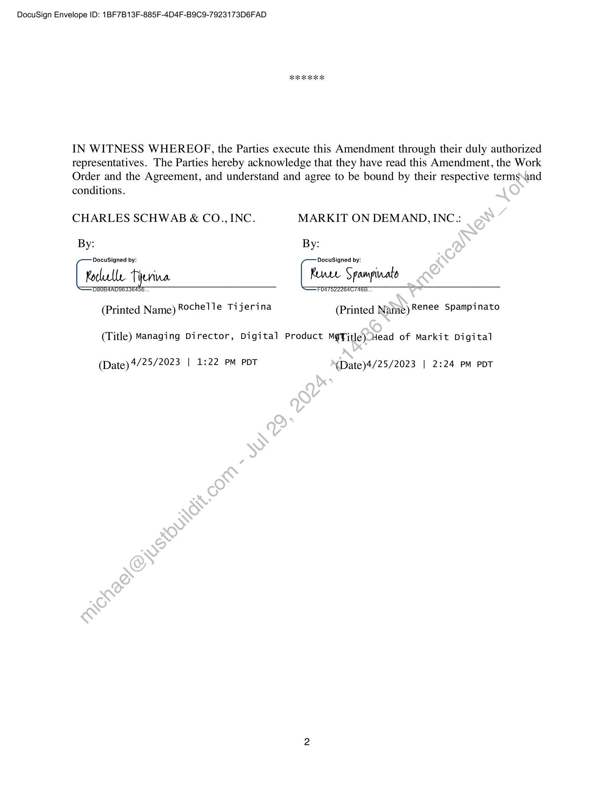

##### Amendment No. 2 to Work Order No. 35 - Tradesource Ideas Page Development]

  
````col
```col-md
flexGrow=.5
===
> [!info] [Page 1](_attachments/images_Schwab-3.6.1.18.300150171.pdf_212729/page_1.png)
> 
```  
```col-md
DocuSign Envelope ID: 1BF7B13F-885F-4D4F-B9C9-7923173D6FAD  
AMENDMENT NO. 2 TO WORK ORDER NO. 35
TRADESOURCE IDEAS PAGE DEVELOPMENT  
Markit On Demand, Inc. (“Contractor”) and Charles Schwab & Co., Inc. ("Schwab") hereby
agree to further modify Work Order No. 35, dated January 5, 2015, as amended (the “Work
Order”), to their Development and Hosting Agreement, dated September 1, 2003, as amended
(the "Agreement"), with this Amendment No. 2 (this “Amendment”). This Amendment will be
incorporated by reference into the Work Order and the Agreement and become a part of\ the
Agreement and Work Order upon the Amendment Effective Date set forth below.  
In the event of any conflict between the terms and conditions of this Amendment and the Work
Order or the Agreement, this Amendment will control only with respect to the terms-and conditions
provided herein, otherwise the Work Order and the Agreement will controlpin the order of
precedence set out in the Work Order and Agreement.  
This Amendment is effective as of June 18, 2023 (“Amendment Effective Date’’).  
1.  
Renewal Term. The Parties hereby agree to renew the_Term of the Work Order for a oneyear Renewal Term, commencing June 18, 2023 through June 17, 2024. Notwithstanding
anything to the contrary in the Work Order, the Partieshereby agree that: (i) upon expiration
of the Renewal Term agreed to herein, the Term of the Work Order shall continue to
automatically renew for additional one (1) year Renewal Terms, unless either Contractor or
Schwab provides written notice of non-renewal to the other Party at least sixty (60) days
prior to the expiration of the then-current Renewal Term, or the Work Order is otherwise
terminated in accordance with the Agreement; and (ii) Contractor reserves the right to
increase any fees without further notice, upon commencement of any Renewal Term and
annually in advance thereafter, by/four percent (4%), with each such increase effective on
the commencement of the relevant Renewal Term and each anniversary thereof. If
Contractor decides to increase the fees above the four percent (4%), it shall provide Schwab
with at least ninety (60) days prior written notice of the end of each Renewal Term, and
such notice shall identify fee increase applicable to the Renewal Term that is about to
commence. Further, (he Parties hereby agree that the Work Order has been continually in
full force and effeci.at all times since its Start Date and that Schwab has provided Contractor
all notices required to effect the foregoing.  
Payment Terms. The total amount payable under the Work Order for the Renewal Term
from June.i8, 2023 through June 17, 2024 pursuant to this Amendment shall not exceed
$72,000 consisting of a monthly hosting fee of $6,000. Subject to fee increase made
pursuant to this Amendment, the monthly hosting fee of $6,000 shall apply to subsequent
Renewal Terms thereafter.  
Capitalized terms, not otherwise defined herein, shall have the meanings assigned to them in the
Agreement and the Work Order. Other than as set forth herein, all other terms and conditions of
the Work Order and the Agreement shall remain in full force and effect.  
```
````
Notes:    
````col
```col-md
flexGrow=.5
===
> [!info] [Page 2](_attachments/images_Schwab-3.6.1.18.300150171.pdf_212729/page_2.png)
> 
```  
```col-md
DocuSign Envelope ID: 1BF7B13F-885F-4D4F-B9C9-7923173D6FAD  
IN WITNESS WHEREOF, the Parties execute this Amendment through their duly authorized
representatives. The Parties hereby acknowledge that they have read this Amendment, the Work
Order and the Agreement, and understand and agree to be bound by their respective terms\and  
conditions.
CHARLES SCHWAB & CO.,INC. MARKIT ON DEMAND, INC.::
By: By:
DocuSigned by: DocuSigned by:
[rete Tyerina Renee Spampinato
F047522264C 7466, VY
(Printed Name) Rochelle Tijerina (Printed Name) Renee Spampinato  
(Title) Managing Director, Digital Product Mg¥itle) Head of Markit Digital  
(Date) 4/25/2023 | 1:22 PM PDT (Date)4/25/2023 | 2:24 PM PDT  
```
````
Notes:  


![[_attachments/Schwab-3.6.1.18.3 00150171.pdf]