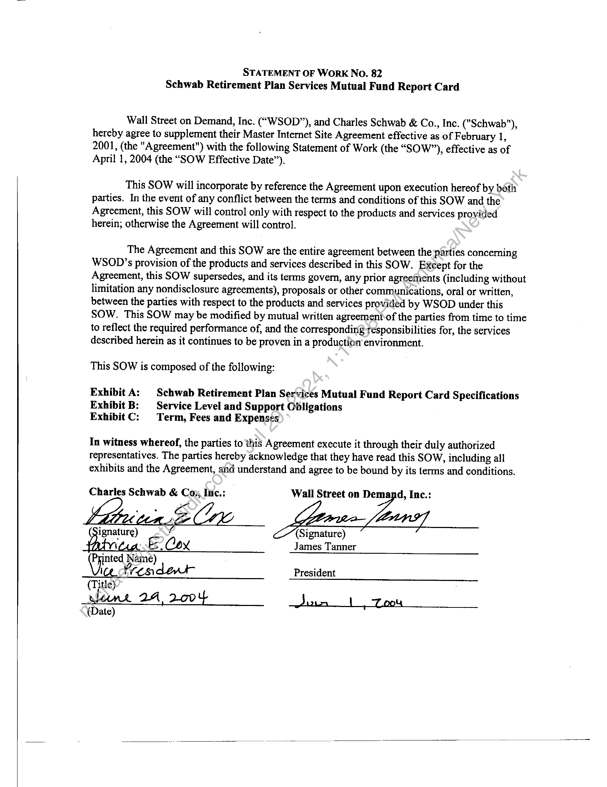
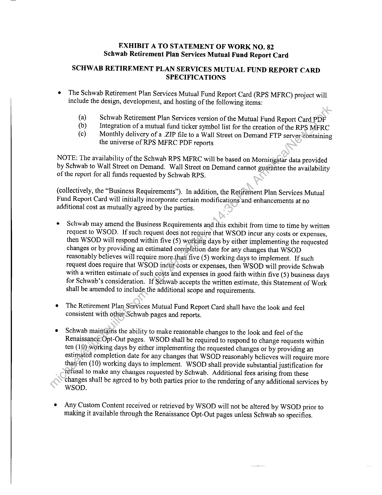
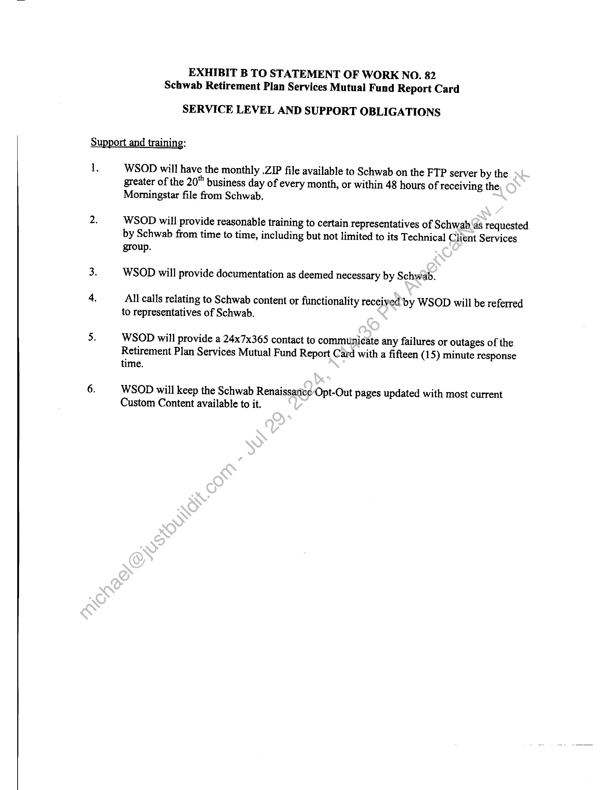
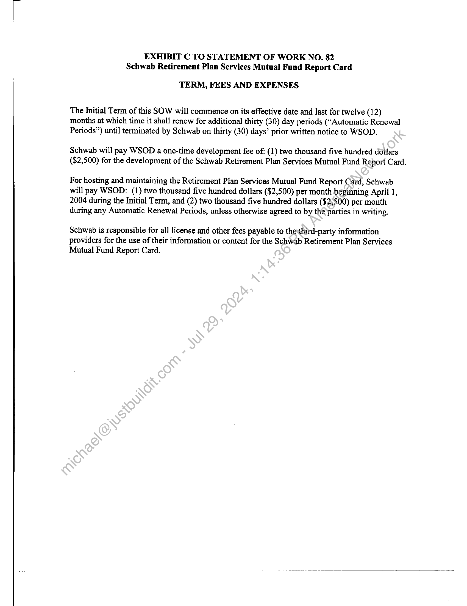

##### Statement of Work No. 82 - Schwab Retirement Plan Services Mutual Fund Report Card]

  
````col
```col-md
flexGrow=.5
===
> [!info] [Page 1](_attachments/images_Schwab-3.6.1.18.3000150118.pdf_211242/page_1.png)
> 
```  
```col-md
STATEMENT OF WORK NO. 82
Schwab Retirement Plan Services Mutual Fund Report Card  
Wall Street on Demand, Inc. (“WSOD”), and Charles Schwab & Co., Inc. ("Schwab"),
hereby agree to supplement their Master Internet Site Agreement effective as of February 1,
2001, (the "Agreement") with the following Statement of Work (the “SOW”), effective as of
April 1, 2004 (the “SOW Effective Date”).  
This SOW will incorporate by reference the Agreement upon execution hereof by both
parties. In the event of any conflict between the terms and conditions of this SOW and the
Agreement, this SOW will control only with respect to the products and services provided
herein; otherwise the Agreement will control.  
The Agreement and this SOW are the entire agreement between the parties concerning
WSOD’s provision of the products and services described in this SOW. Except for the
Agreement, this SOW supersedes, and its terms govern, any prior agreefents (including without
limitation any nondisclosure agreements), proposals or other communications, oral or written,
between the parties with respect to the products and services provided by WSOD under this
SOW. This SOW may be modified by mutual written agreement of the parties from time to time
to reflect the required performance of, and the corresponding responsibilities for, the services
described herein as it continues to be proven in a production environment.  
This SOW is composed of the following:  
Exhibit A: Schwab Retirement Plan Services Mutual Fund Report Card Specifications
Exhibit B: Service Level and Support Obligations
ExhibitC: Term, Fees and Expenses  
In witness whereof, the parties to this Agreement execute it through their duly authorized
representatives. The parties hereby acknowledge that they have read this SOW, including ali
exhibits and the Agreement, and understand and agree to be bound by its terms and conditions.  
Charles Schwab & Cox, Inic.: Wall Street on Demand, Inc.:  
.  
ignature) (Signature)James Tanner
Printed Name)
i freandenwt President  
(Title)  
lank 2A 2oo Jusm pu }  
(Date)  
```
````
Notes:    
````col
```col-md
flexGrow=.5
===
> [!info] [Page 2](_attachments/images_Schwab-3.6.1.18.3000150118.pdf_211242/page_2.png)
> 
```  
```col-md
EXHIBIT A TO STATEMENT OF WORK NO. 82
Schwab Retirement Plan Services Mutual Fund Report Card  
SCHWAB RETIREMENT PLAN SERVICES MUTUAL FUND REPORT CARD
SPECIFICATIONS  
¢ The Schwab Retirement Plan Services Mutual Fund Report Card (RPS MF RC) project will
include the design, development, and hosting of the following items:  
(a) Schwab Retirement Plan Services version of the Mutual Fund Report Card PDF  
(b) Integration of a mutual fund ticker symbol list for the creation of the RPS MFRC  
(c) Monthly delivery of a .ZIP file to a Wall Street on Demand FTP server containing
the universe of RPS MFRC PDF reports  
NOTE: The availability of the Schwab RPS MFRC will be based on Morningstar data provided
by Schwab to Wall Street on Demand. Wall Street on Demand cannot guarantee the availability
of the report for all funds requested by Schwab RPS.  
(collectively, the “Business Requirements”). In addition, the Retifémnent Plan Services Mutual
Fund Report Card will initially incorporate certain modifications and enhancements at no
additional cost as mutually agreed by the parties.  
* Schwab may amend the Business Requirements and this exhibit from time to time by written
request to WSOD. If such request does not require that WSOD incur any costs or expenses,
then WSOD will respond within five (5) working days by either implementing the requested
changes or by providing an estimated completion date for any changes that WSOD
reasonably believes will require more.than five (5) working days to implement. If such
request does require that WSOD incur-costs or expenses, then WSOD will provide Schwab
with a written estimate of such costs and expenses in good faith within five (5) business days
for Schwab’s consideration. If Schwab accepts the written estimate, this Statement of Work
shall be amended to include the additional scope and requirements.  
¢ The Retirement Plan Services Mutual Fund Report Card shall have the look and feel
consistent with other.Schwab pages and reports.  
e Schwab maintains the ability to make reasonable changes to the look and feel of the
Renaissance-Opt-Out pages. WSOD shall be required to respond to chan ge requests within
ten (10) working days by either implementing the requested changes or by providing an
estimated completion date for any changes that WSOD reasonably belicves will require more
tharrten (10) working days to implement. WSOD shall provide substantial justification for
refusal to make any changes requested by Schwab. Additional fees arising from these
changes shall be agrced to by both parties prior to the rendering of any additional services by
WSOD.  
e Any Custom Content received or retrieved by WSOD will not be altered by WSOD prior to
making it available through the Renaissance Opt-Out pages unless Schwab so specifies.  
```
````
Notes:    
````col
```col-md
flexGrow=.5
===
> [!info] [Page 3](_attachments/images_Schwab-3.6.1.18.3000150118.pdf_211242/page_3.png)
> 
```  
```col-md
EXHIBIT B TO STATEMENT OF WORK NO. 82
Schwab Retirement Plan Services Mutual Fund Report Card  
SERVICE LEVEL AND SUPPORT OBLIGATIONS  
Support and training:  
1,  
WSOD will have the monthly .ZIP file available to Schwab on the FTP server by the
greater of the 20" business day of every month, or within 48 hours of receiving the
Morningstar file from Schwab.  
WSOD will provide reasonable training to certain representatives of Schwab as requested
by Schwab from time to time, including but not limited to its Technical Client Services  
group.
WSOD will provide documentation as deemed necessary by Schwab.  
All calls relating to Schwab content or functionality received’ by WSOD will be referred
to representatives of Schwab.  
WSOD will provide a 24x7x365 contact to communicate any failures or outages of the
Retirement Plan Services Mutual Fund Report Card with a fifteen (15) minute response
time.  
WSOD will keep the Schwab Renaissance Opt-Out pages updated with most current
Custom Content available to it.  
```
````
Notes:    
````col
```col-md
flexGrow=.5
===
> [!info] [Page 4](_attachments/images_Schwab-3.6.1.18.3000150118.pdf_211242/page_4.png)
> 
```  
```col-md
EXHIBIT C TO STATEMENT OF WORK NO. 82
Schwab Retirement Plan Services Mutual Fund Report Card  
TERM, FEES AND EXPENSES  
The Initial Term of this SOW will commence on its effective date and last for twelve (12)
months at which time it shall renew for additional thirty (30) day periods (“Automatic Renewal
Periods”) until terminated by Schwab on thirty (30) days’ prior written notice to WSOD.  
Schwab will pay WSOD a one-time development fee of: (1) two thousand five hundred dollars
($2,500) for the development of the Schwab Retirement Plan Services Mutual Fund Report Card.  
For hosting and maintaining the Retirement Plan Services Mutual Fund Report Card, Schwab
will pay WSOD: (1) two thousand five hundred dollars ($2,500) per month beginning April 1,
2004 during the Initial Term, and (2) two thousand five hundred dollars ($2;500) per month
during any Automatic Renewal Periods, unless otherwise agreed to by the’parties in writing.  
Schwab is responsible for all license and other fees payable to the third-party information
providers for the use of their information or content for the Schwab Retirement Plan Services
Mutual Fund Report Card.  
```
````
Notes:  


![[_attachments/Schwab-3.6.1.18.30 00150118.pdf]