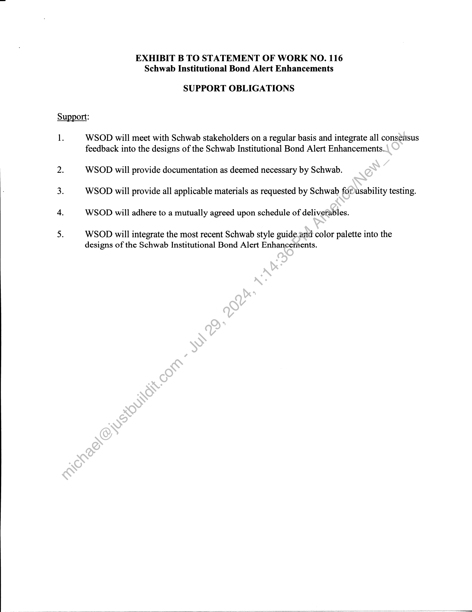
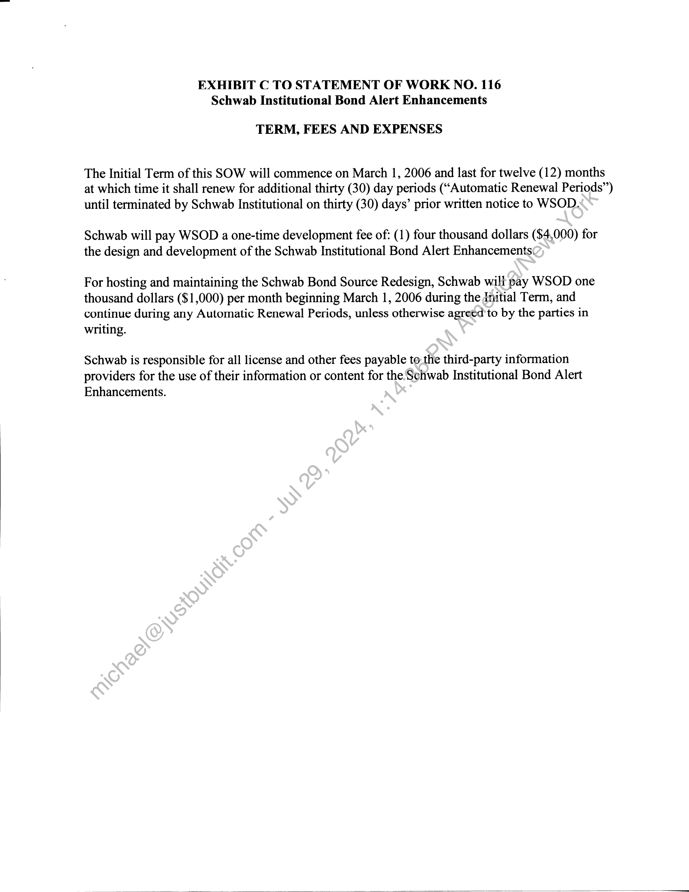

##### Revenue Recognition Form - Schwab Institutional - Bond Alerts Enhancements]

  
````col
```col-md
flexGrow=.5
===
> [!info] [Page 1](_attachments/images_Schwab-3.6.1.18.3100150242.pdf_210202/page_1.png)
> 
```  
```col-md
WALL STREET ON DEMAND  
Revenue Recognition Form  
Client Schwab Institutional  
Project _Bond Alerts Enhancements  
Revenue Recognition Criteria:  
1. Persuasive evidence of an arrangement exists.
Documentation Needed:  
QQ For annual revenue over $10,000, Contract/SOW Required  
Contract/SOW Status Alb [signe d  
OR  
For annual revenue of $10;000 and under, an email from the client confirming the
arrangement (including the‘nature of work, price, dates, and any other
expectations that haye.been agreed upon). Include signed contract if the client
required it.  
2. Delivery has occurred or/services have been rendered.
Documentation Needed:  
O  Ladnch date: ¢ ¢ 6  
ot Aon client acknowledging acceptance, including “as of” date.
Senior Project Manager / Date  
Submit to finance within 5 business days or the 1* of the following month, whichever comes first.  
3. The seller’s price to the buyer is fixed or determinable.
x Documentation Needed: Contract or Email from #1 above.
4. Collectibility is reasonably assured.  
x D&B report (finance dept to run)  
Based on the data above and attached, revenue recognition can begin as of 4/24/06. .  
4.25.0  
Chief Accounting Officer / Date  
```
````
Notes:    
````col
```col-md
flexGrow=.5
===
> [!info] [Page 2](_attachments/images_Schwab-3.6.1.18.3100150242.pdf_210202/page_2.png)
> 
```  
```col-md
Page 1 of 1  
Rebekah Levy  
From: Kraus, Kevin [Kevin.Kraus@Schwab.com]
Sent: Tuesday, April 25, 2006 10:07 AM  
To: Rebekah Levy  
Ce: Sharon Baxter  
Subject: RE: S| Bond Alerts project in Production  
Thanks for reaching out, Rebekah - | do see the modifications and it appears to be working. | just signedup for
the enhanced bond alerts myself!  
From: Rebekah Levy [mailto:rebekah.levy@wallst.com]
Sent: Tuesday, Apri! 25, 2006 9:01 AM  
To: Kraus, Kevin  
Ce: Baxter, Sharon  
Subject: SI Bond Alerts project in Production  
Hi Kevin,  
The Bond Alerts project launched yesterday afternoon. Please let me know that you can indeed see the
modifications and if you see any issues.  
Thanks,
Rebekah  
Rebekah Levy
Wail Street On Demand  
rebekah, levy @wallst.com
+ 303.583.4303
eS al Avenue
Boulder, CO 80301  
4/25/2006  
```
````
Notes:    
````col
```col-md
flexGrow=.5
===
> [!info] [Page 3](_attachments/images_Schwab-3.6.1.18.3100150242.pdf_210202/page_3.png)
> 
```  
```col-md
STATEMENT OF WorRK NO. 116
Schwab Institutional Bond Alert Enhancements  
Wall Street on Demand, Inc. (““WSOD”), and Charles Schwab & Co., Inc. ("Schwab"),
hereby agree to supplement their Master Internet Site Agreement effective as of February 1,
2001, (the "Agreement") with the following Statement of Work (the “SOW”), effective as of
March 1, 2006 (the “SOW Effective Date”).  
This SOW will incorporate by reference the Agreement upon execution hereof by both
parties. In the event of any conflict between the terms and conditions of this SOW and the
Agreement, this SOW will control only with respect to the products and services provided
herein; otherwise the Agreement will control.  
The Agreement and this SOW are the entire agreement between the parties concerning
WSOD’s provision of the products and services described in this SOW. Except for the
Agreement, this SOW supersedes, and its terms govern, any prior agreements (including without
limitation any nondisclosure agreements), proposals or other communications, oral or written,
between the parties with respect to the products and services provided by WSOD under this
SOW. This SOW may be modified by mutual written agreement of the parties from time to time
to reflect the required performance of, and the corresponding tesponsibilities for, the services
described herein as it continues to be proven in a production environment.  
This SOW is composed of the following:  
Exhibit A: | Schwab Institutional Bond Alert Enhancements  
Exhibit B: | Support Obligations  
Exhibit C: Term, Fees and Expenses  
In witness whereof, the parties to this Agreement execute it through their duly authorized  
representatives. The parties hereby acknowledge that they have read this SOW, including all
exhibits and the Agreementyand understand and agree to be bound by its terms and conditions.  
‘harles Schwab & Coy Wall Street on Demand, Inc.:
( ) (Srgnature)
E LWA  
ce. ’
GIA EE . (sALt James Tanner
(Printed Name) SL
(CF PLE C1 DEnS President  
(Date) (Date)  
(Title) a efor LL  
```
````
Notes:    
````col
```col-md
flexGrow=.5
===
> [!info] [Page 4](_attachments/images_Schwab-3.6.1.18.3100150242.pdf_210202/page_4.png)
> 
```  
```col-md
EXHIBIT A TO STATEMENT OF WORK NO. 116
Schwab Institutional Bond Alert Enhancements  
SCHWAB INSTITUTIONAL Bond Alert Enhancements  
e The Schwab Institutional Bond Alert Enhancements project will include the following:  
a. Updates to SI alerts subscription functionality to enable users to sign up for
taxable bond alerts by type, including new GNMA alerts  
b. Updates to SI alerts subscription functionality to enable users to signup for
tax-exempt bonds by state  
c. Updates to SI alerts admin tools to enable adminstrators to specify state for
new tax-exempt bond offerings and GNMA-specific fields forGNMA alerts  
(collectively, the “Business Requirements”). In addition, the Schwab Institutional Bond Alert
Enhancements will initially incorporate certain modifications and enhancements at no additional  
cost as mutually agreed by the parties.  
e Schwab may amend the Business Requirements and this exhibit from time to time by written
request to WSOD. If such request does not require that WSOD incur any costs or expenses,
then WSOD will respond within five (5) working days by either implementing the requested
changes or by providing an estimated completion date for any changes that WSOD
reasonably believes will require more than fiy@(5) working days to implement. If such
request does require that WSOD incur cost8\or expenses, then WSOD will provide Schwab
with a written estimate of such costs and expenses in good faith within five (5) business days
for Schwab’s consideration. If Schwab)accepts the written estimate, this Statement of Work
shall be amended to include the additional scope and requirements.  
e The Schwab Institutional Bond Alert Enhancements shall have the look and feel consistent
with other Schwab pages-and reports.  
e Schwab maintains.the’ability to make reasonable changes to the look and feel of the Schwab
Institutional Bond)Alert Enhancements. WSOD shall be required to respond to change
requests within five (5) working days by either implementing the requested changes or by
providing-anestimated completion date for any changes that WSOD reasonably believes will
require tore than five (5) working days to implement. WSOD shall provide substantial
justification for refusal to make any changes requested by Schwab. Additional fees arising
fromthese changes shall be agreed to by both parties prior to the rendering of any additional
services by WSOD.  
e Any Custom Content received or retrieved by WSOD will not be altered by WSOD prior to
making it available through the Schwab Institutional Bond Alert Enhancements unless
Schwab so specifies.  
```
````
Notes:    
````col
```col-md
flexGrow=.5
===
> [!info] [Page 5](_attachments/images_Schwab-3.6.1.18.3100150242.pdf_210202/page_5.png)
> 
```  
```col-md
EXHIBIT B TO STATEMENT OF WORK NO. 116
Schwab Institutional Bond Alert Enhancements  
SUPPORT OBLIGATIONS  
Support:  
1.  
WSOD will meet with Schwab stakeholders on a regular basis and integrate all consensus
feedback into the designs of the Schwab Institutional Bond Alert Enhancements.  
WSOD will provide documentation as deemed necessary by Schwab.
WSOD will provide all applicable materials as requested by Schwab forusability testing.
WSOD will adhere to a mutually agreed upon schedule of deliverables.  
WSOD will integrate the most recent Schwab style guide.and color palette into the
designs of the Schwab Institutional Bond Alert Enhancernents.  
```
````
Notes:    
````col
```col-md
flexGrow=.5
===
> [!info] [Page 6](_attachments/images_Schwab-3.6.1.18.3100150242.pdf_210202/page_6.png)
> 
```  
```col-md
EXHIBIT C TO STATEMENT OF WORK NO. 116
Schwab Institutional Bond Alert Enhancements  
TERM, FEES AND EXPENSES  
The Initial Term of this SOW will commence on March 1, 2006 and last for twelve (12) months
at which time it shall renew for additional thirty (30) day periods (“Automatic Renewal Periods”)
until terminated by Schwab Institutional on thirty (30) days’ prior written notice to WSOD.  
Schwab will pay WSOD a one-time development fee of: (1) four thousand dollars ($4,000) for
the design and development of the Schwab Institutional Bond Alert Enhancements‘  
For hosting and maintaining the Schwab Bond Source Redesign, Schwab will pay WSOD one
thousand dollars ($1,000) per month beginning March 1, 2006 during the Initial Term, and
continue during any Automatic Renewal Periods, unless otherwise agreed to by the parties in
writing.  
Schwab is responsible for all license and other fees payable tothe third-party information
providers for the use of their information or content for the Schwab Institutional Bond Alert
Enhancements.  
```
````
Notes:  


![[_attachments/Schwab-3.6.1.18.31 00150242.pdf]