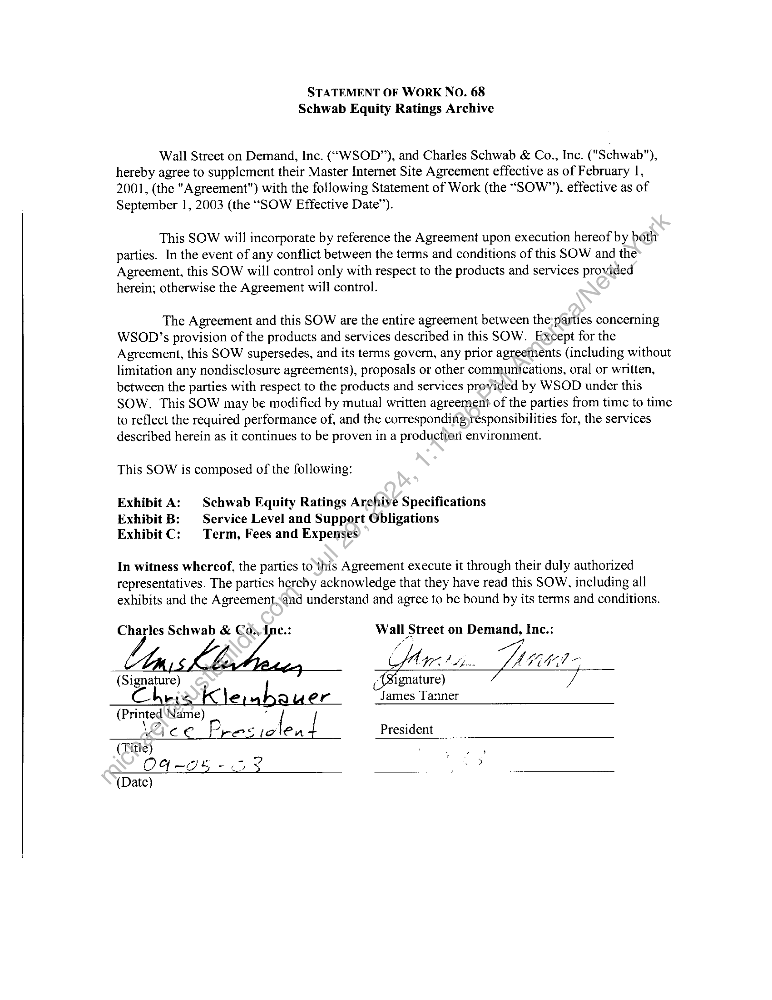
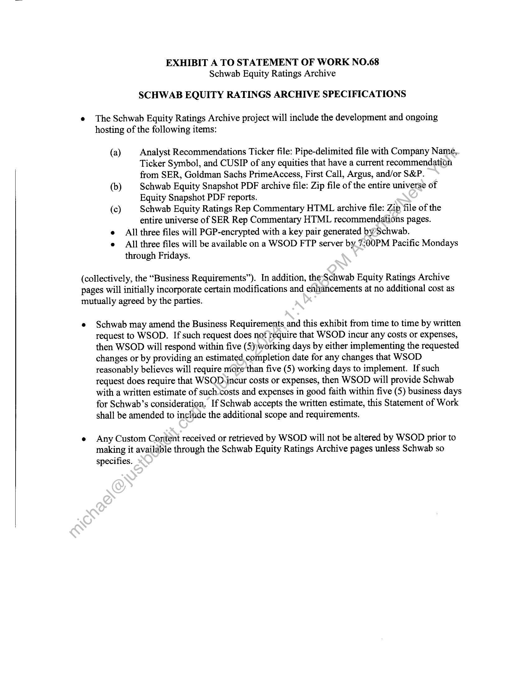
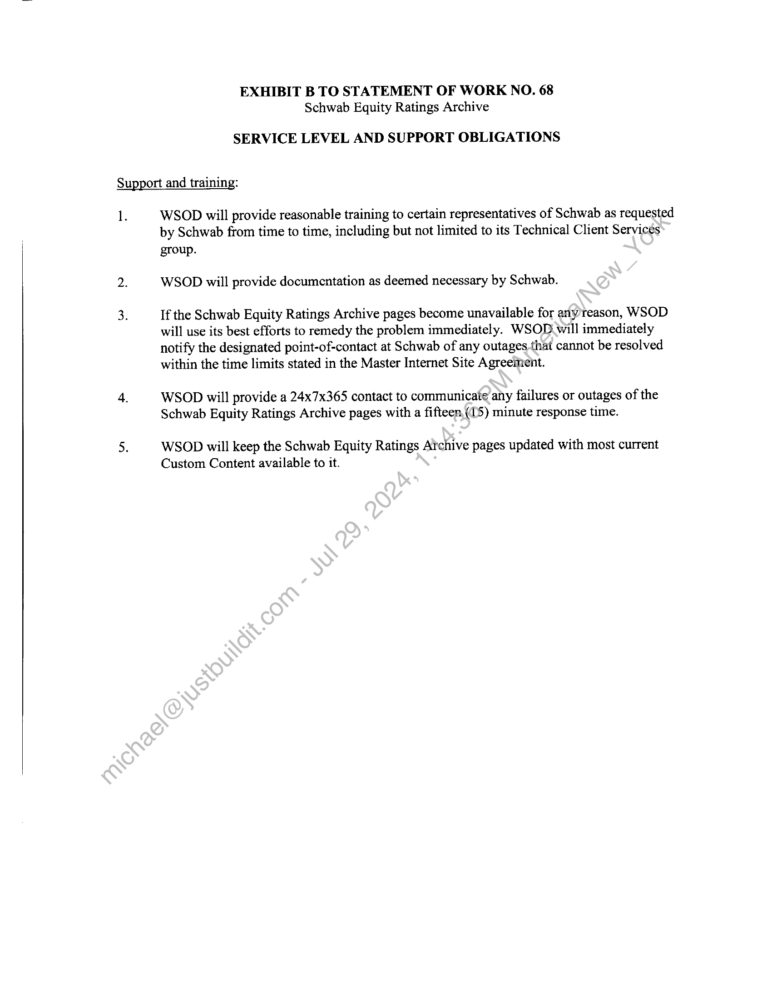
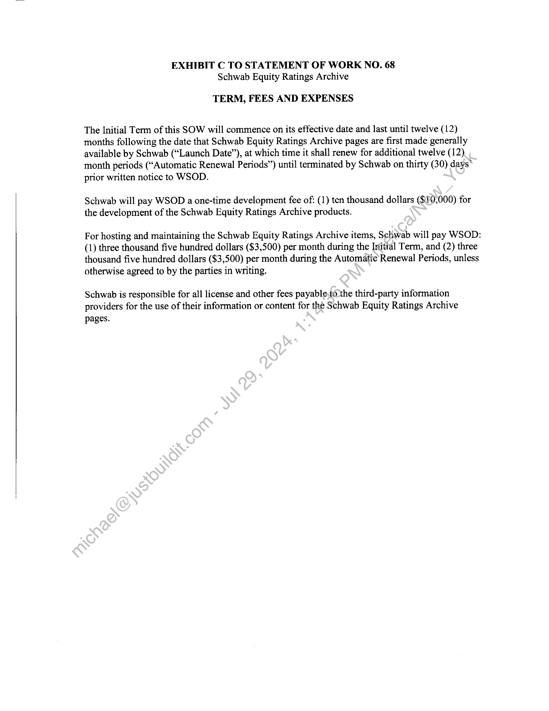

##### STATEMENT OF WORK NO. 68 Schwab Equity Ratings Archive]

  
````col
```col-md
flexGrow=.5
===
> [!info] [Page 1](_attachments/images_Schwab-3.6.1.18.3200147795.pdf_212323/page_1.png)
> 
```  
```col-md
STATEMENT OF WORK NO. 68
Schwab Equity Ratings Archive  
Wall Street on Demand, Inc. (“WSOD”), and Charles Schwab & Co., Inc. ("Schwab"),
hereby agree to supplement their Master Internet Site Agreement effective as of February 1,
2001, (the "Agreement") with the following Statement of Work (the “SOW”), effective as of
September 1, 2003 (the “SOW Effective Date’).  
This SOW will incorporate by reference the Agreement upon execution hereof by both
parties. In the event of any contlict between the terms and conditions of this SOW and the
Agreement, this SOW will control only with respect to the products and services provided
herein; otherwise the Agreement will control.  
The Agreement and this SOW are the entire agreement between the-pasties concerning
WSOD’s provision of the products and services described in this SOW. Except for the
Agreement, this SOW supersedes, and its terms govern, any prior agreements (including without
limitation any nondisclosure agreements), proposals or other communications, oral or written,
between the parties with respect to the products and services provided by WSOD under this
SOW. This SOW may be modified by mutual written agreement of the parties from time to time
to reflect the required performance of, and the corresponding responsibilities for, the services
described herein as it continues to be proven in a production environment.  
This SOW is composed of the following:  
Exhibit A: | Schwab Equity Ratings Archive Specifications
Exhibit B: | Service Level and Support Obligations
Exhibit C: Term, Fees and Expenses  
In witness whereof, the parties to this Agreement execute it through their duly authorized
representatives. The parties hereby acknowledge that they have read this SOW, including all
exhibits and the Agreement, and understand and agree to be bound by its terms and conditions.  
Charles Schwab & Co:,Ine.: Wall Street on Demand, Inc.:  
a “7,
A LGES bh. Lite 4
(Signature) (Signature) ,
r ef r James Tanner
(Printed Name) .
ree Pres olen! President
(Title) . a ,
OU-I% - 3 oe  
(Date)  
```
````
Notes:    
````col
```col-md
flexGrow=.5
===
> [!info] [Page 2](_attachments/images_Schwab-3.6.1.18.3200147795.pdf_212323/page_2.png)
> 
```  
```col-md
EXHIBIT A TO STATEMENT OF WORK NO.68
Schwab Equity Ratings Archive  
SCHWAB EQUITY RATINGS ARCHIVE SPECIFICATIONS  
e The Schwab Equity Ratings Archive project will include the development and ongoing
hosting of the following items:  
(a) Analyst Recommendations Ticker file: Pipe-delimited file with Company Name,
Ticker Symbol, and CUSIP of any equities that have a current recommendation
from SER, Goldman Sachs PrimeAccess, First Call, Argus, and/or S&P.  
(b) Schwab Equity Snapshot PDF archive file: Zip file of the entire universe of
Equity Snapshot PDF reports.  
(c) Schwab Equity Ratings Rep Commentary HTML archive file: Zip file of the
entire universe of SER Rep Commentary HTML recommendations pages.  
e All three files will PGP-encrypted with a key pair generated bySchwab.  
e All three files will be available on a WSOD FTP server by. 7:00PM Pacific Mondays  
through Fridays.  
(collectively, the “Business Requirements”). In addition, theSchwab Equity Ratings Archive
pages will initially incorporate certain modifications and enhancements at no additional cost as
mutually agreed by the parties.  
e Schwab may amend the Business Requirements and this exhibit from time to time by written
request to WSOD. If such request does not réquire that WSOD incur any costs or expenses,
then WSOD will respond within five (5))working days by either implementing the requested
changes or by providing an estimated, completion date for any changes that WSOD
reasonably believes will require more than five (5) working days to implement. If such
request does require that WSOD,incur costs or expenses, then WSOD will provide Schwab
with a written estimate of such costs and expenses in good faith within five (5) business days
for Schwab’s consideration. If Schwab accepts the written estimate, this Statement of Work
shall be amended to incinde the additional scope and requirements.  
¢ Any Custom Content received or retrieved by WSOD will not be altered by WSOD prior to
making it available through the Schwab Equity Ratings Archive pages unless Schwab so
specifies.  
```
````
Notes:    
````col
```col-md
flexGrow=.5
===
> [!info] [Page 3](_attachments/images_Schwab-3.6.1.18.3200147795.pdf_212323/page_3.png)
> 
```  
```col-md
EXHIBIT B TO STATEMENT OF WORK NO. 68
Schwab Equity Ratings Archive  
SERVICE LEVEL AND SUPPORT OBLIGATIONS  
Support and training:  
1.  
WSOD will provide reasonable training to certain representatives of Schwab as requested
by Schwab from time to time, including but not limited to its Technical Client Services  
group.
WSOD will provide documentation as deemed necessary by Schwab.  
If the Schwab Equity Ratings Archive pages become unavailable for anyreason, WSOD
will use its best efforts to remedy the problem immediately. WSOD will immediately
notify the designated point-of-contact at Schwab of any outages.that cannot be resolved
within the time limits stated in the Master Internet Site Agreement.  
WSOD will provide a 24x7x365 contact to communicate any failures or outages of the
Schwab Equity Ratings Archive pages with a fifteen, (15) minute response time.  
WSOD will keep the Schwab Equity Ratings Archive pages updated with most current
Custom Content available to it.  
```
````
Notes:    
````col
```col-md
flexGrow=.5
===
> [!info] [Page 4](_attachments/images_Schwab-3.6.1.18.3200147795.pdf_212323/page_4.png)
> 
```  
```col-md
EXHIBIT C TO STATEMENT OF WORK NO. 68
Schwab Equity Ratings Archive  
TERM, FEES AND EXPENSES  
The Initial Term of this SOW will commence on its effective date and last until twelve (12)
months following the date that Schwab Equity Ratings Archive pages are first made generally
available by Schwab (“Launch Date”), at which time it shall renew for additional twelve (12)
month periods (“Automatic Renewal Periods”) until terminated by Schwab on thirty (30) days*
prior written notice to WSOD.  
Schwab will pay WSOD a one-time development fee of: (1) ten thousand dollars ($20,000) for
the development of the Schwab Equity Ratings Archive products.  
For hosting and maintaining the Schwab Equity Ratings Archive items, Schwab will pay WSOD:
(1) three thousand five hundred dollars ($3,500) per month during the Initial Term, and (2) three  
thousand five hundred dollars ($3,500) per month during the Automatic Renewal Periods, unless  
otherwise agreed to by the parties in writing.  
Schwab is responsible for all license and other fees payable,to the third-party information
providers for the use of their information or content for the Schwab Equity Ratings Archive  
pages.  
```
````
Notes:  


![[_attachments/Schwab-3.6.1.18.32 00147795.pdf]