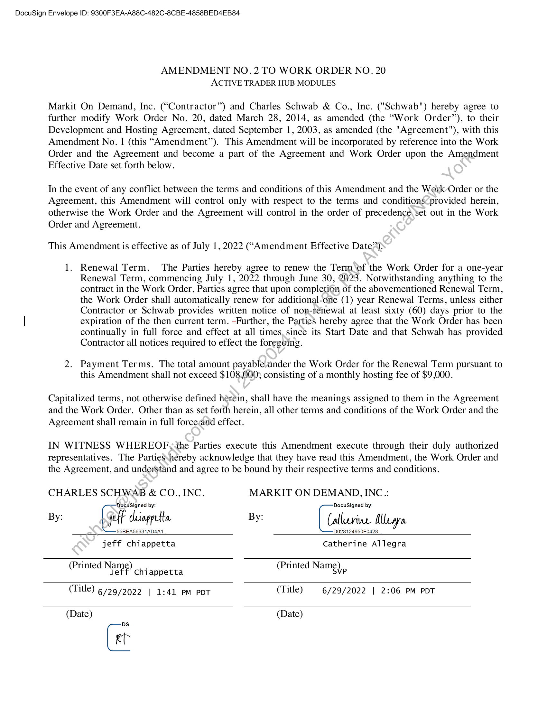

##### Amendment No. 2 to Work Order No. 20 - Active Trader Hub Modules]

  
````col
```col-md
flexGrow=.5
===
> [!info] [Page 1](_attachments/images_Schwab-3.6.1.18.3300150188.pdf_210957/page_1.png)
> 
```  
```col-md
DocuSign Envelope ID: 9300F3EA-A88C-482C-8CBE-4858BED4EB84  
AMENDMENT NO. 2 TO WORK ORDER NO. 20
ACTIVE TRADER HUB MODULES  
Markit On Demand, Inc. (“Contractor”) and Charles Schwab & Co., Inc. ("Schwab") hereby agree to
further modify Work Order No. 20, dated March 28, 2014, as amended (the “Work Order”), to their
Development and Hosting Agreement, dated September 1, 2003, as amended (the "Agreement"), with this
Amendment No. | (this “Amendment”). This Amendment will be incorporated by reference into the Work
Order and the Agreement and become a part of the Agreement and Work Order upon the Amendment
Effective Date set forth below.  
In the event of any conflict between the terms and conditions of this Amendment and the Werk Order or the
Agreement, this Amendment will control only with respect to the terms and conditions<provided herein,
otherwise the Work Order and the Agreement will control in the order of precedence, set out in the Work
Order and Agreement.  
This Amendment is effective as of July 1, 2022 (“Amendment Effective Date”)  
1. Renewal Term. The Parties hereby agree to renew the Term of the Work Order for a one-year
Renewal Term, commencing July 1, 2022 through June 30, 2023. Notwithstanding anything to the
contract in the Work Order, Parties agree that upon completion of the abovementioned Renewal Term,
the Work Order shall automatically renew for additional-one (1) year Renewal Terms, unless either
Contractor or Schwab provides written notice of non-rénewal at least sixty (60) days prior to the
expiration of the then current term. -Further, the Parties hereby agree that the Work Order has been
continually in full force and effect at all times, since its Start Date and that Schwab has provided
Contractor all notices required to effect the foregoing.  
2. Payment Terms. The total amount payable under the Work Order for the Renewal Term pursuant to
this Amendment shall not exceed $108,000} consisting of a monthly hosting fee of $9,000.  
Capitalized terms, not otherwise defined herein, shall have the meanings assigned to them in the Agreement
and the Work Order. Other than as set forth herein, all other terms and conditions of the Work Order and the
Agreement shall remain in full forceand effect.  
IN WITNESS WHEREOF,the Parties execute this Amendment execute through their duly authorized
representatives. The Parties\nereby acknowledge that they have read this Amendment, the Work Order and
the Agreement, and understand and agree to be bound by their respective terms and conditions.  
CHARLES SCHWAB & CO.,INC. MARKIT ON DEMAND, INC.:
DocuSigned by: DocuSigned by:
By: ci biagpetta By: Catherine Mara
S5BEAS6931AD4A1 D028124950F0428.
jeff chiappetta Catherine Allegra
(Printed Name) Chiappetta (Printed Name),
(Title) §729/2022 | 1:41 pm PDT (Title) 6/29/2022 | 2:06 PM PDT
(Date) (Date)  
Gi  
```
````
Notes:  


![[_attachments/Schwab-3.6.1.18.33 00150188.pdf]