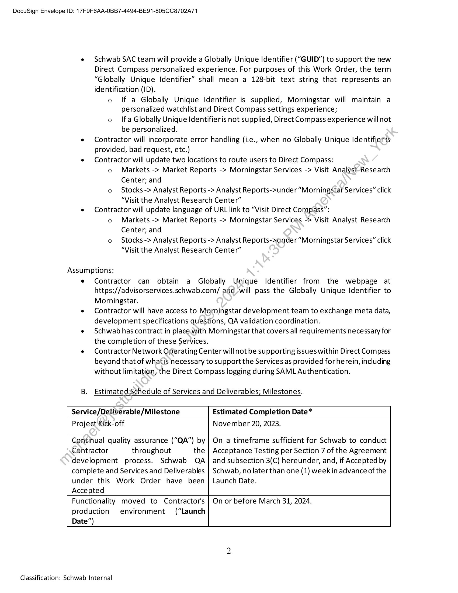
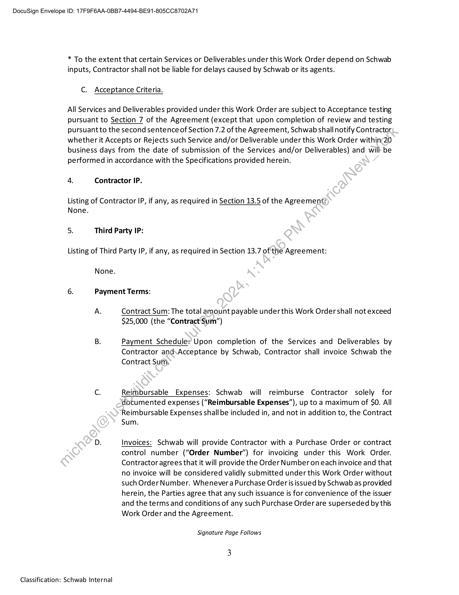
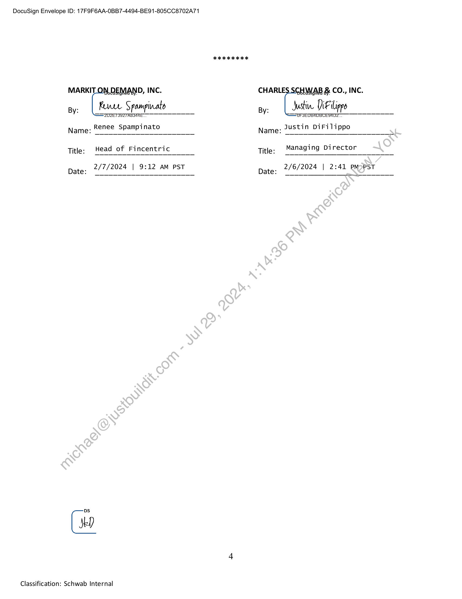

##### Work Order No. 168: SAC, Morningstar Analyst Research Center Update to Direct Compass]

  
````col
```col-md
flexGrow=.5
===
> [!info] [Page 1](_attachments/images_Schwab-3.6.1.18.3400102123-expired1stApril2024.pdf_212306/page_1.png)
> 
```  
```col-md
DocuSign Envelope ID: 17F9F6AA-0BB7-4494-BE91-805CC8702A71  
WORK ORDER NO. 168
SAC, Morningstar Analyst Research Center Update to Direct Compass  
This Work Order No. 168 (the “Work Order”), dated January 29, 2024 (the “Execution
Date”) and effective as of the Start Date set forth below, is a part of and incorporated into the
Development and Hosting Agreement between Charles Schwab & Co., Inc. (“Schwab”) and Markit
On Demand, Inc., formerly known as Wall Street On Demand, Inc. (“Contractor”), dated
September 1, 2003, as amended (“Agreement”). Capitalized terms not definedin this Work Order
are as defined in the Agreement. In the event of any conflict between the Agreement and this
Work Order, the terms of the Agreement shall govern. The Parties agree this Work Order has been
in full force and effect at all times since the Start Date.  
1. Contacts
Contractor Representative: Sarah Miceli
Address: 5775 Flatiron Parkway
Boulder, CO 80301
Telephone number: 303-583-4288
Email address: sarah.miceli@spglobal:com
Schwab Representative: Jessica DeMartino
Address: 5010 Wateridge Vista Drive
San Diego).CA 92121
Telephone number: 858 458 8082
Email address: Jessica;demartino@schwab.com
2. Term of Work Order:
Start Date: November 20, 2023  
Estimated Completion Date: March 31, 2024
3. Services to. be Performed; Schedule of Deliverables/Milestones; Specifications;
Acceptance Criteria; Due Dates:
Contractorwill update authentication workflow and connection to the new Morningstar Research
Portal (“Direct Compass”) for Schwab’s advisors from the Schwab Advisor Center (“SAC”) (eacha  
“SAC Advisor’) to access Direct Compass.  
A. Services and Deliverables; Scope and Assumptions  
Scope:
e Contractor will implement new single sign-on (“SSO”) to launch the new Morningstar
Research Portal (Direct Compass) from Schwab’s network or systems.
e Contractor to setup security assertion markup language (“SAML”) handshake with
Morningstar.
e Contractor will manage error handling message to SAC Advisor.  
1  
Classification: Schwab Internal  
```
````
Notes:    
````col
```col-md
flexGrow=.5
===
> [!info] [Page 2](_attachments/images_Schwab-3.6.1.18.3400102123-expired1stApril2024.pdf_212306/page_2.png)
> 
```  
```col-md
DocuSign Envelope ID: 17F9F6AA-0BB7-4494-BE91-805CC8702A71  
Schwab SAC team will provide a Globally Unique Identifier (“GUID”) to support the new
Direct Compass personalized experience. For purposes of this Work Order, the term
“Globally Unique Identifier” shall mean a 128-bit text string that represents an
identification (ID).
o If a Globally Unique Identifier is supplied, Morningstar will maintain a
personalized watchlist and Direct Compass settings experience;
o Ifa Globally Unique Identifier is not supplied, Direct Compass experience will not
be personalized.
Contractor will incorporate error handling (i.e., when no Globally Unique Identifieris
provided, bad request, etc.)
Contractor will update two locations to route users to Direct Compass:
o Markets -> Market Reports -> Morningstar Services -> Visit Analyst-Research
Center; and
o Stocks -> Analyst Reports -> Analyst Reports->under “Morningstar Services” click
‘Visit the Analyst Research Center”
Contractor will update language of URL link to “Visit Direct Compass”:
o Markets -> Market Reports -> Morningstar Services -> Visit Analyst Research
Center; and
o Stocks -> Analyst Reports -> Analyst Reports->ander “Morningstar Services” click
‘Visit the Analyst Research Center”  
Assumptions:  
Contractor can obtain a Globally Unique Identifier from the webpage at
https://advisorservices.schwab.com/ and_will pass the Globally Unique Identifier to
Morningstar.  
Contractor will have access to Morningstar development team to exchange meta data,
development specifications questions, QA validation coordination.  
Schwab has contract in place.with Morningstar that covers all requirements necessary for
the completion of these Services.  
Contractor Network Operating Center will not be supporting issues within Direct Compass
beyond that of whatis necessary to support the Services as provided for herein, including
without limitation, the Direct Compass logging during SAML Authentication.  
B. Estimated:Schedule of Services and Deliverables; Milestones.
Service/Deliverable/Milestone Estimated Completion Date*
Project Kick-off November 20, 2023.  
Contractor throughout the
development process. Schwab QA
complete and Services and Deliverables
under this Work Order have been
Accepted  
Continual quality assurance (“QA”) by | On a timeframe sufficient for Schwab to conduct  
Acceptance Testing per Section 7 of the Agreement
and subsection 3(C) hereunder, and, if Accepted by
Schwab, no later than one (1) week in advance of the
Launch Date.  
Functionality moved to Contractor's
production environment (“Launch
Date”)  
On or before March 31, 2024.  
Classification: Schwab Internal  
```
````
Notes:    
````col
```col-md
flexGrow=.5
===
> [!info] [Page 3](_attachments/images_Schwab-3.6.1.18.3400102123-expired1stApril2024.pdf_212306/page_3.png)
> 
```  
```col-md
DocuSign Envelope ID: 17F9F6AA-0BB7-4494-BE91-805CC8702A71  
* To the extent that certain Services or Deliverables under this Work Order depend on Schwab
inputs, Contractor shall not be liable for delays caused by Schwab or its agents.  
C. Acceptance Criteria.  
All Services and Deliverables provided under this Work Order are subject to Acceptance testing
pursuant to Section 7 of the Agreement (except that upon completion of review and testing
pursuant to the second sentence of Section 7.2 of the Agreement, Schwab shall notify Contractor
whether it Accepts or Rejects such Service and/or Deliverable under this Work Order within¢20
business days from the date of submission of the Services and/or Deliverables) and wilh be
performed in accordance with the Specifications provided herein.  
4. Contractor IP.  
Listing of Contractor IP, if any, as required in Section 13.5 of the Agreement:
None.  
5. Third Party IP:  
Listing of Third Party IP, if any, as required in Section 13.7 of the Agreement:  
None.
6. Payment Terms:
A. Contract Sum: The total amount payable under this Work Order shall not exceed  
$25,000 (the “Contract Sum”)  
B. Payment Schedule: Upon completion of the Services and Deliverables by
Contractor and\Acceptance by Schwab, Contractor shall invoice Schwab the
Contract Sum.  
C. Reimbursable Expenses: Schwab will reimburse Contractor solely for
documented expenses (“Reimbursable Expenses”), up to a maximum of SO. All
Reimbursable Expenses shall be included in, and not in addition to, the Contract
Sum.  
D. Invoices: Schwab will provide Contractor with a Purchase Order or contract
control number (“Order Number”) for invoicing under this Work Order.
Contractor agrees that it will provide the Order Number on each invoice and that
no invoice will be considered validly submitted under this Work Order without
such Order Number. Whenever a Purchase Order is issued by Schwab as provided
herein, the Parties agree that any such issuance is for convenience of the issuer
and the terms and conditions of any such Purchase Order are superseded by this
Work Order and the Agreement.  
Signature Page Follows  
3  
Classification: Schwab Internal  
```
````
Notes:    
````col
```col-md
flexGrow=.5
===
> [!info] [Page 4](_attachments/images_Schwab-3.6.1.18.3400102123-expired1stApril2024.pdf_212306/page_4.png)
> 
```  
```col-md
DocuSign Envelope ID: 17F9F6AA-0BB7-4494-BE91-805CC8702A71  
oh KK RK  
MARKIT OA. DEMAND, INC. CHARLE. MAB & CO., INC.
By: Kee Spampinato By: Justin. DiFilippo  
. SIU ZET OATS . —=UFSEI a
Name: Renee Spampinato Name: 2ustin DiFilippo
Title: Head of Fincentric Title: Managing Director
Date: 2/7/2024 | 0:12 AM PST Date: 2/6/2024 | 2:42 Pur  
DS
4  
Classification: Schwab Internal  
```
````
Notes:  


![[_attachments/Schwab-3.6.1.18.34 00102123 - expired 1st April 2024.pdf]