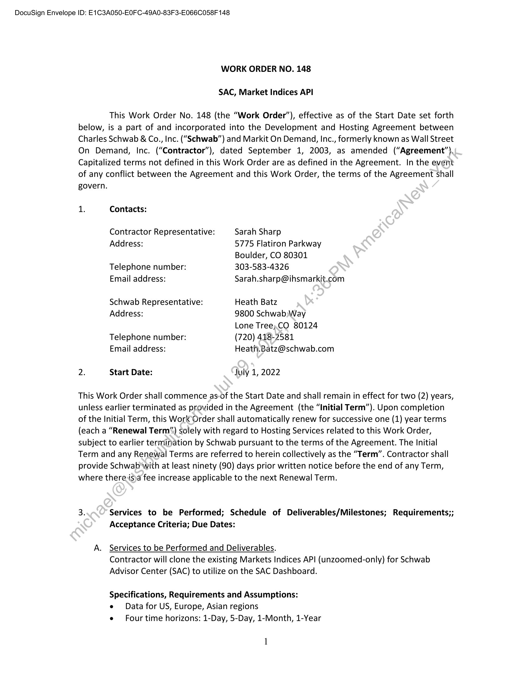
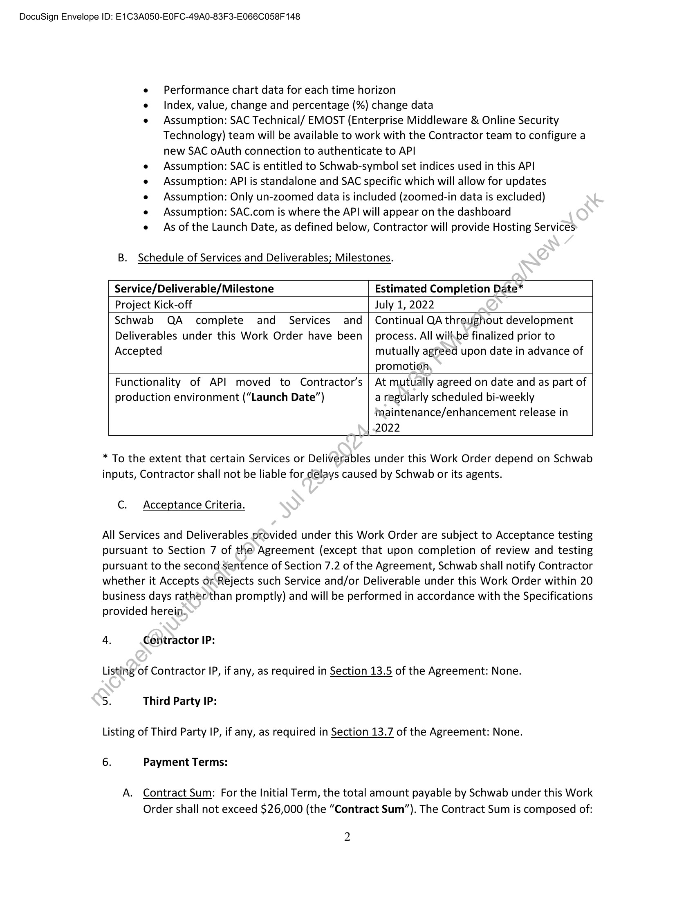
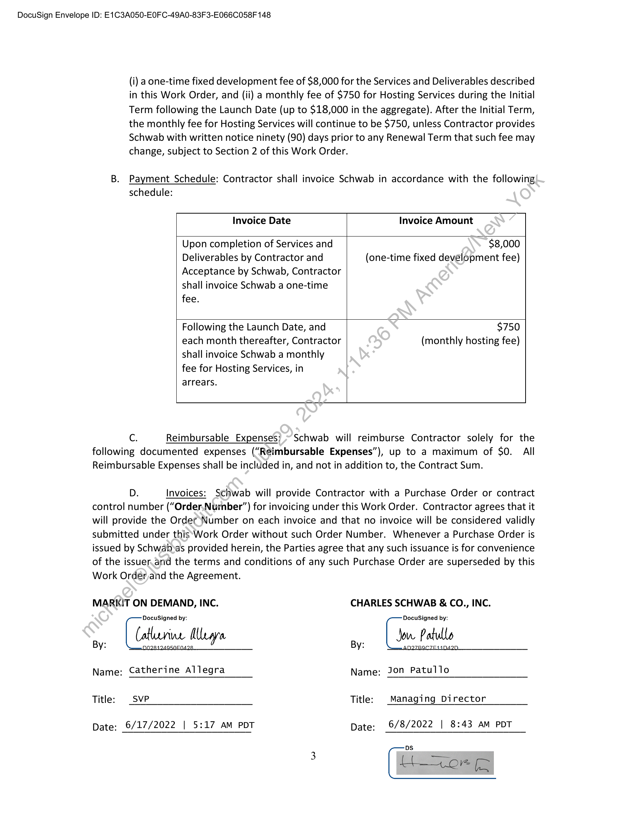

##### Work Order No. 148 for SAC Market Indices API]

  
````col
```col-md
flexGrow=.5
===
> [!info] [Page 1](_attachments/images_Schwab-3.6.1.18.3500150222.pdf_210541/page_1.png)
> 
```  
```col-md
DocuSign Envelope ID: E1C3A050-EOFC-49A0-83F3-E066C058F 148  
WORK ORDER NO. 148  
SAC, Market Indices API  
This Work Order No. 148 (the  
“Work Order”), effective as of the Start Date set forth  
below, is a part of and incorporated into the Development and Hosting Agreement between
Charles Schwab & Co., Inc. (“Schwab”) and Markit On Demand, Inc., formerly known as Wall Street
On Demand, Inc. (“Contractor”), dated September 1, 2003, as amended (“Agreement”).
Capitalized terms not defined in this Work Order are as defined in the Agreement. In the event
of any conflict between the Agreement and this Work Order, the terms of the Agreement shall  
govern.
1. Contacts:  
Contractor Representative:
Address:  
Telephone number:
Email address:  
Schwab Representative:
Address:  
Telephone number:
Email address:  
2. Start Date:  
Sarah Sharp  
5775 Flatiron Parkway
Boulder, CO 80301
303-583-4326
Sarah.sharp@ihsmarkit.com  
Heath Batz  
9800 Schwab);Way  
Lone Tree,CO 80124
(720) 418-2581
Heath.Batz@schwab.com  
July 1, 2022  
This Work Order shall commence as-of the Start Date and shall remain in effect for two (2) years,
unless earlier terminated as provided in the Agreement (the “Initial Term”). Upon completion
of the Initial Term, this Work Order shall automatically renew for successive one (1) year terms
(each a “Renewal Term”) solely with regard to Hosting Services related to this Work Order,
subject to earlier termination by Schwab pursuant to the terms of the Agreement. The Initial
Term and any Renewal Terms are referred to herein collectively as the “Term”. Contractor shall
provide Schwab'with at least ninety (90) days prior written notice before the end of any Term,
where there is)a fee increase applicable to the next Renewal Term.  
3. Services to be Performed; Schedule of Deliverables/Milestones; Requirements;;
Acceptance Criteria; Due Dates:  
Services to be Performed and Deliverables.  
Contractor will clone the existing Markets Indices API (unzoomed-only) for Schwab
Advisor Center (SAC) to utilize on the SAC Dashboard.  
Specifications, Requirements and Assumptions:
e Data for US, Europe, Asian regions
e Four time horizons: 1-Day, 5-Day, 1-Month, 1-Year  
```
````
Notes:    
````col
```col-md
flexGrow=.5
===
> [!info] [Page 2](_attachments/images_Schwab-3.6.1.18.3500150222.pdf_210541/page_2.png)
> 
```  
```col-md
DocuSign Envelope ID: E1C3A050-EOFC-49A0-83F3-E066C058F 148  
e Performance chart data for each time horizon  
e Index, value, change and percentage (%) change data  
e Assumption: SAC Technical/ EMOST (Enterprise Middleware & Online Security
Technology) team will be available to work with the Contractor team to configure a
new SAC oAuth connection to authenticate to API  
e Assumption: SAC is entitled to Schwab-symbol set indices used in this API  
e Assumption: API is standalone and SAC specific which will allow for updates  
e Assumption: Only un-zoomed data is included (zoomed-in data is excluded)  
e Assumption: SAC.com is where the API will appear on the dashboard  
e As of the Launch Date, as defined below, Contractor will provide Hosting Services  
B. Schedule of Services and Deliverables; Milestones.  
Service/Deliverable/Milestone Estimated Completion Date*  
Project Kick-off July 1, 2022  
Schwab QA complete and Services and | Continual QA threughout development
Deliverables under this Work Order have been | process. All willbe finalized prior to  
Accepted mutually agreed upon date in advance of
promotion,  
Functionality of API moved to Contractor’s | At mutually agreed on date and as part of  
production environment (“Launch Date”) a regularly scheduled bi-weekly
Mmaintenance/enhancement release in
2022  
* To the extent that certain Services or Deliverables under this Work Order depend on Schwab
inputs, Contractor shall not be liable for délays caused by Schwab or its agents.  
C. Acceptance Criteria.  
All Services and Deliverables provided under this Work Order are subject to Acceptance testing
pursuant to Section 7 of the Agreement (except that upon completion of review and testing
pursuant to the second sentence of Section 7.2 of the Agreement, Schwab shall notify Contractor
whether it Accepts or Rejects such Service and/or Deliverable under this Work Order within 20
business days rathér’than promptly) and will be performed in accordance with the Specifications
provided herein.  
4. Centractor IP:  
Listing of Contractor IP, if any, as required in Section 13.5 of the Agreement: None.
5. Third Party IP:  
Listing of Third Party IP, if any, as required in Section 13.7 of the Agreement: None.
6. Payment Terms:  
A. Contract Sum: For the Initial Term, the total amount payable by Schwab under this Work
Order shall not exceed $26,000 (the “Contract Sum”). The Contract Sum is composed of:  
2  
```
````
Notes:    
````col
```col-md
flexGrow=.5
===
> [!info] [Page 3](_attachments/images_Schwab-3.6.1.18.3500150222.pdf_210541/page_3.png)
> 
```  
```col-md
DocuSign Envelope ID: E1C3A050-EOFC-49A0-83F3-E066C058F 148  
(i) a one-time fixed development fee of $8,000 for the Services and Deliverables described
in this Work Order, and (ii) a monthly fee of $750 for Hosting Services during the Initial
Term following the Launch Date (up to $18,000 in the aggregate). After the Initial Term,
the monthly fee for Hosting Services will continue to be $750, unless Contractor provides
Schwab with written notice ninety (90) days prior to any Renewal Term that such fee may
change, subject to Section 2 of this Work Order.  
B. Payment Schedule: Contractor shall invoice Schwab in accordance with the following  
schedule:
Invoice Date Invoice Amount
Upon completion of Services and $8,000
Deliverables by Contractor and (one-time fixed development fee)
Acceptance by Schwab, Contractor
shall invoice Schwab a one-time
fee.
Following the Launch Date, and $750
each month thereafter, Contractor (monthly hosting fee)
shall invoice Schwab a monthly
fee for Hosting Services, in
arrears.
Cc. Reimbursable Expenses; ~ Schwab will reimburse Contractor solely for the  
following documented expenses (“Reimbursable Expenses”), up to a maximum of $0. All
Reimbursable Expenses shall be included in, and not in addition to, the Contract Sum.  
Dz. Invoices: Schwab will provide Contractor with a Purchase Order or contract
control number (“Order,.Number”) for invoicing under this Work Order. Contractor agrees that it
will provide the Order Number on each invoice and that no invoice will be considered validly
submitted under this‘Work Order without such Order Number. Whenever a Purchase Order is
issued by Schwabvas provided herein, the Parties agree that any such issuance is for convenience
of the issuer.and the terms and conditions of any such Purchase Order are superseded by this
Work Order,and the Agreement.  
MARKIT ON DEMAND, INC. CHARLES SCHWAB & CO., INC.
DocuSigned by: DocuSigned by:  
by Catherine Myra By Jove Patulle  
Name: Catherine Allegra Name: Jon Patullo  
Title: SVP Title: | Managing Director  
Date: 6/17/2022 | 5:17 Am PDT Date: 6/8/2022 | 8:43 AM PDT  
DS  
3 Eto fj  
```
````
Notes:  


![[_attachments/Schwab-3.6.1.18.35 00150222.pdf]