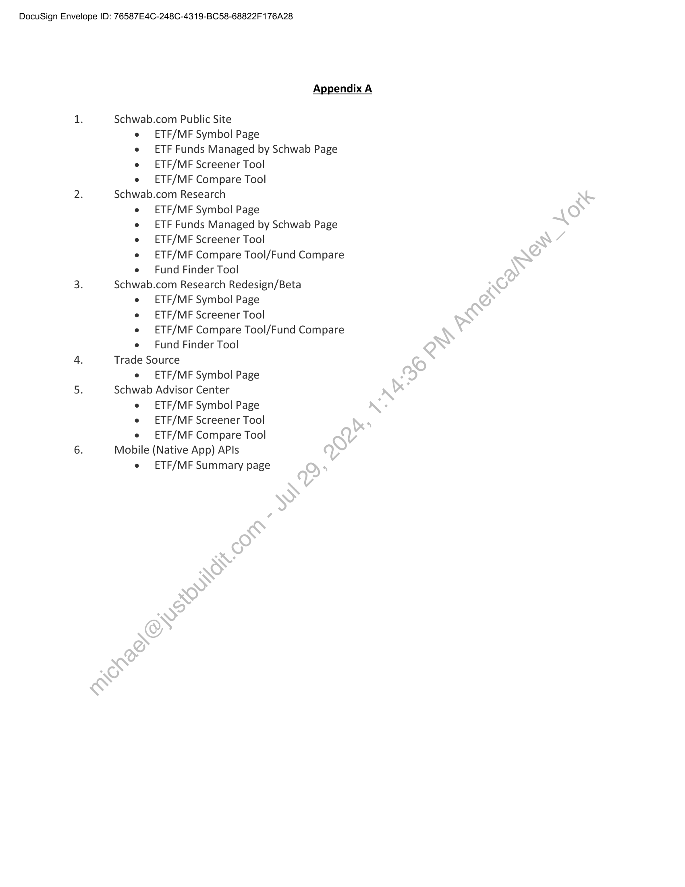

##### Work Order No. 160: Fund Launches]

  
````col
```col-md
flexGrow=.5
===
> [!info] [Page 1](_attachments/images_Schwab-3.6.1.18.3600152854.pdf_211307/page_1.png)
> 
```  
```col-md
DocuSign Envelope ID: 76587E4C-248C-4319-BC58-68822F 176A28  
WORK ORDER NO. 160: Fund Launches  
This Work Order No. 160 (the “Work Order”), effective as of the Start Date set forth below, is made
pursuant to the Development and Hosting Agreement between Charles Schwab & Co., Inc. and Markit On
Demand, Inc., formerly known as Wall Street On Demand, Inc. (“Contractor”), dated September 1, 2003, as
amended (“Agreement”). Capitalized terms not defined in this Work Order are as defined in the
Agreement. In the event of any conflict between the Agreement and this Work Order, the terms of the
Agreement shall govern.  
Charles Schwab Investment Management, Inc. (“Schwab”) is entering into this Work Order as a’Business
Unit of Charles Schwab & Co., Inc. pursuant to Section 6.1 of the Agreement. By executing this\Work Order,
Charles Schwab Investment Management, Inc. shall not become a party to the Agreemerit. Rather, the
terms of the Agreement are incorporated herein and this Work Order shall constitute,a, separate, distinct,
and independent contract between Charles Schwab Investment Management, In¢wand Contractor (i.e.,
neither Charles Schwab & Co., Inc. nor its other Business Units will be deemed’a party to the separate
agreement created by this Work Order). Neither Charles Schwab Investment_Management, Inc. on the one
hand, nor Charles Schwab & Co., Inc. and its other Business Units, on the other, shall have any liability or
responsibility for the other’s acts, omissions, or performance of its duties'and responsibilities pursuant to
this Work Order or the Agreement, respectively.  
1. Contacts:
Contractor Representative: Sarah Sharp
Address: 5775 Flatiron Parkway
Boulder, €CO°80301
Telephone number: 303-583-4326
Email address: Sarah,sharp@ihsmarkit.com
Schwab Representative: Nicohl Bogan
Address: 211 Main St., San Francisco, CA 94105
Telephone number: (415) 667-7056
Email address: nicohl.bogan@schwab .com
2. Term of Work Order:
Start Date: June 1, 2023  
ThisWork Order shall commence on the Start Date and shall remain in full force and effect for a
period of one (1) year (the “Initial Term”), unless earlier terminated in accordance with the
Agreement. Following the Initial Term, this Work Order shall automatically renew for successive
renewal terms of one (1) year each (each, a “Renewal Term”), unless Schwab notifies Contractor in
writing of its decision not to renew no later than ninety (90) days prior to the expiration of the then
current Term (the Initial Term and any Renewal Term shall collectively be referenced herein as the
“Term”).  
3. Services to be Performed; Schedule of Deliverables/Milestones; Specifications; Acceptance Criteria;
Due Dates:  
```
````
Notes:    
````col
```col-md
flexGrow=.5
===
> [!info] [Page 2](_attachments/images_Schwab-3.6.1.18.3600152854.pdf_211307/page_2.png)
> 
```  
```col-md
DocuSign Envelope ID: 76587E4C-248C-4319-BC58-68822F 176A28  
Contractor shall incorporate details of one or more new Schwab funds (“New Fund(s)”) on websites and
locations listed in Appendix A in accordance with specifications, timelines and other terms specified herein  
(“Fund Launch”). For  
the avoidance of doubt, each Fund Launch can include one or more New Funds  
launching on the same date. Additionally, Contractor shall perform more than one Fund Launch throughout
the Term of this Work Order, and each such launch will be considered it’s own “Fund Launch”. Schwab will
provide Fund Launch details in accordance with the timeline specified in section 3(C).  
A. Services to be Performed, Deliverables and Specifications. With respect to each Fund¢taunch,  
Contractor shall complete the following:  
vi.  
vii.  
viii.  
ix.  
B. Assumptions:  
Addition of New Fund (the “New Fund”) (Ticker: TBD)
Each New Fund will be based on an existing fund template, subject-to approval by
Schwab in each case (no new template will be created)
Contractor will integrate new non-proprietary index that will‘be made available via
the index provider
Index name: INSERT NAME OF INDEX — as required under section 3(C) below
Each New Fund will be displayed under an existingtab within Schwab Funds pages,
subject to approval by Schwab in each case.
New sections (e.g. Global Equity) will be added*to currently existing tabs. For the
avoidance of doubt, new tabs are not included in this Work Order.
Users will be able to screen for the New.Fuind on Schwab.com prospect, Schwab.com
Client (legacy and redesign (SPA)), Schwab Advisor Center (SAC), and mobile using:  
e  ETF/MF Screener  
e Fund Finder
SAC and Mobile will utilize) already existing templates to make the New Fund
available for advisors (i.e.no new templates are expected to be created)
The New Fund will be acided to all locations listed in Appendix A  
Schwab will provide written approval from index provider for new index in
accordance with the timeline set forth in section 3.C below. Such written approval
will‘specify that Contractor is able to redistribute the index data onto and through
schwab.com and SAC.com.
Data delivered to Contractor from Schwab will be delivered to the existing FTP via
existing processes: FTP: ftp://ftp.wallst.com/FTP/SchwabCSIMSFTP/ >
SchwabIndexDocuments
Schwab will provide final disclosure language location to be added to all locations
(including directions as to where the disclosure language is to be placed on each
page)
The New Fund must be in Schwab’s ESM and ITEM to be recognized in Schwab.com
The New Fund must be included in ETF/MF files from Schwab to Contractor to
populate various fields:  
e = Availability  
e Minimum Investment  
e Schwab Funds (Commission Free)
Select List (once it meets CSIA/SCFR eligibility requirements)  
```
````
Notes:    
````col
```col-md
flexGrow=.5
===
> [!info] [Page 3](_attachments/images_Schwab-3.6.1.18.3600152854.pdf_211307/page_3.png)
> 
```  
```col-md
DocuSign Envelope ID: 76587E4C-248C-4319-BC58-68822F 176A28  
All Services and Deliverables provided under this Work Order are subject to a separate Acceptance testing
pursuant to Section 7 of the Agreement (except that upon completion of review and testing pursuant to
the second sentence of Section 7.2 of the Agreement, Schwab shall notify Contractor whether it Accepts or
Rejects such Service and/or Deliverable under this Work Order within 20 business days rather than  
C. Schedule of Services, Deliverables and Dependencies; Milestones.  
Services/Deliverables and Dependencies  
Schwab to provide a New Fund launch notice to
Contractor  
*Schwab to provide New Fund specifications
(ticker, CUSIP, Performance ID and other data
attributes)  
Required
Timeline/Milestone/Completion Date
12 weeks in advance of launch date of
each New Fund (each launch date a
“Launch Date”)  
8 weeks in advance of each Launch Date  
*Schwab to provide written approval from index
provider for new index  
*Schwab to provide final requirements (text,
disclosure and compliance updates)  
Contractor QA complete for template and any
disclosure/compliance code updates required on
Schwab research sites in Acceptance  
*Schwab QA complete for template and any
disclosure/compliance code updates required on
Schwab research sites  
6 weeks in advance of each Launch Date
4 weeks in advance of each-taunch Date  
1 week in advance of-each Launch Date  
5 days inadvance of each Launch Date  
Functionality moved to production for all Schwab
research sites.  
* To the extent that certain Services or Deliverables under this Work Order depend on Schwab inputs,  
“Launch Date”  
Contractor shall not be liable for delays caused by Schwab or its agents.  
D. Acceptance Criteria.  
promptly) and will be:berformed in accordance with the Specifications provided herein.  
4.  
ContractonIP:  
Listing of Contractor IP, if any, as required in Section 13.5 of the Agreement: None.  
5.  
Third Party IP:  
Listing of Third Party IP, if any, as required in Section 13.7 of the Agreement: None.  
6.  
Payment Terms:  
A. Contract Sum; Launch Fee(s):  
```
````
Notes:    
````col
```col-md
flexGrow=.5
===
> [!info] [Page 4](_attachments/images_Schwab-3.6.1.18.3600152854.pdf_211307/page_4.png)
> 
```  
```col-md
DocuSign Envelope ID: 76587E4C-248C-4319-BC58-68822F 176A28  
The total amount payable under this Work Order shall note exceed $331,649. Subject to Section 2 above,
Schwab shall pay the Launch Fee(s), as set forth below, for each Fund Launch separately. Such Launch Fee
is based on the number of New Funds included in each Fund Launch and is calculated in accordance with  
the fee table below. The fee table includes an annual 4% increase.  
Number of New Initial First Second Third Fourth Fifth  
Funds included in | Term Renewal Renewal Renewal Renewal Renewal  
each Fund(s) 2023-2024 | Term Term Term Term Term  
Launch* 2024-2025 | 2025-2026 | 2026-2027 2027-2028 | 2028
2029**  
1 New Fund $46,000 | $47,840.00 | $49,753.60 | $51,743.74 | $53,813.49 |\°$55,966.03  
2-3 New Funds  
with same Launch $50,000 $52,000 $54,080 $56,243 $58)493 $60,833  
Date  
Pater ene To be reviewed and mutually agreed by the parties in writing on a case-by-case  
basis.
Launch Date  
*No ongoing hosting, maintenance or support fees shall apply.  
** After the fifth Renewal Term (2028-2029) Parties will rutually agree in writing on revised pricing
applicable to subsequent Renewal Terms.  
B. Payment Schedule:  
Contractor shall invoice Schwab following each.Launch Date.  
C. Reimbursable Expenses:\Schwab will reimburse Contractor solely for the following
documented expenses (“Reimbursable Expenses”), up to a maximum of $0. All Reimbursable Expenses
shall be included in, and not in addition to, the Contract Sum.  
Dz. Invoices: Schwab will provide Contractor with a purchase order or contract control
number (“Order Number”)-for invoicing under this Work Order. Contractor agrees that it will provide the
Order Number on eachsirivoice and that no invoice will be considered validly submitted under this Work
Order without suchCOrder Number. Whenever a purchase order is issued by Schwab as provided herein,
the Parties agree‘that any such issuance is for convenience of the issuer and the terms and conditions of
any such purchase order are superseded by this Work Order and the Agreement.  
eR RR RK  
```
````
Notes:    
````col
```col-md
flexGrow=.5
===
> [!info] [Page 5](_attachments/images_Schwab-3.6.1.18.3600152854.pdf_211307/page_5.png)
> 
```  
```col-md
DocuSign Envelope ID: 76587E4C-248C-4319-BC58-68822F 176A28  
MARKIT ON DEMAND, INC. CHARLES SCHWAB INVESTMENT MANAGEMENT,
DocuSigned by: INC. DocuSigned by:
py: | Remee Spampinato py; | Mark 0. Fislur
Name: Renee Spampinato Name: Mark D. Fischer
Title: Head of Markit Digital Title: CFO
18/202 :40 AM PDT :
Date: 5/18/2023 | 9:40 Date: 5/16/2023 | 2:57 PM PDT  
```
````
Notes:    
````col
```col-md
flexGrow=.5
===
> [!info] [Page 6](_attachments/images_Schwab-3.6.1.18.3600152854.pdf_211307/page_6.png)
> 
```  
```col-md
DocuSign Envelope ID: 76587E4C-248C-4319-BC58-68822F 176A28  
Appendix A  
1. Schwab.com Public Site
e ETF/MF Symbol Page
e ETF Funds Managed by Schwab Page
e ETF/MF Screener Tool
e ETF/MF Compare Tool
2. Schwab.com Research
e ETF/MF Symbol Page
e ETF Funds Managed by Schwab Page
e ETF/MF Screener Tool
e ETF/MF Compare Tool/Fund Compare
e Fund Finder Tool
3. Schwab.com Research Redesign/Beta
ETF/MF Symbol Page
ETF/MEF Screener Tool
ETF/MF Compare Tool/Fund Compare
Fund Finder Tool  
4. Trade Source
e ETF/MF Symbol Page
5. Schwab Advisor Center  
e ETF/MF Symbol Page  
e ETF/MF Screener Tool  
e ETF/MF Compare Tool
6. Mobile (Native App) APIs  
e _ETF/MF Summary page  
```
````
Notes:  


![[_attachments/Schwab-3.6.1.18.36 00152854.pdf]