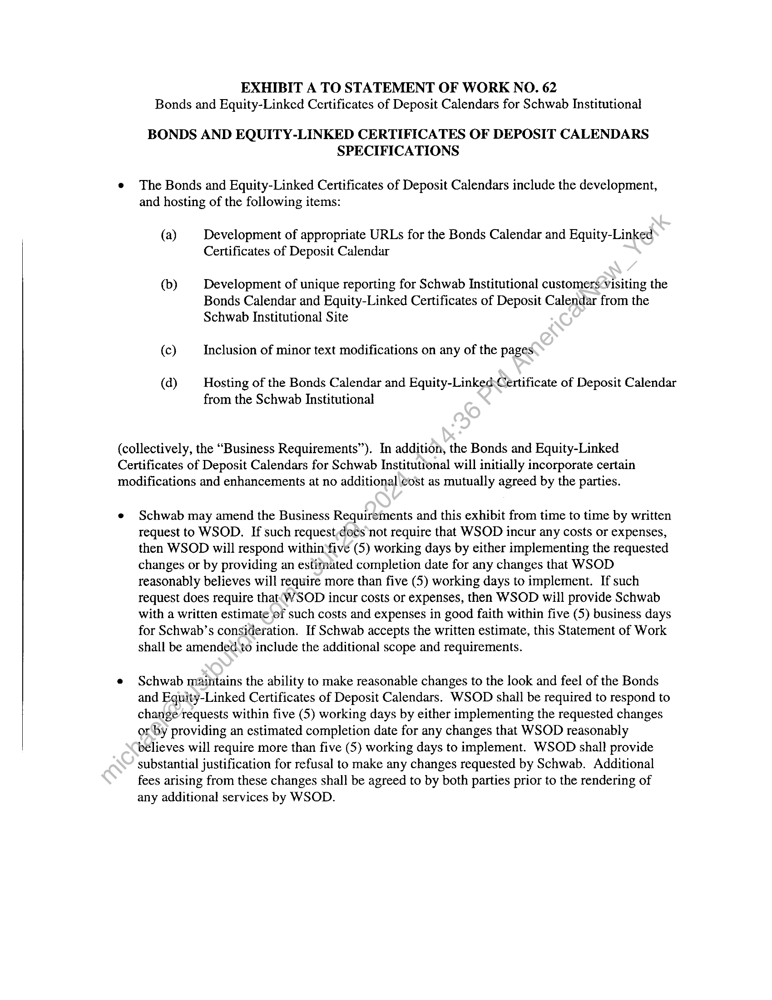
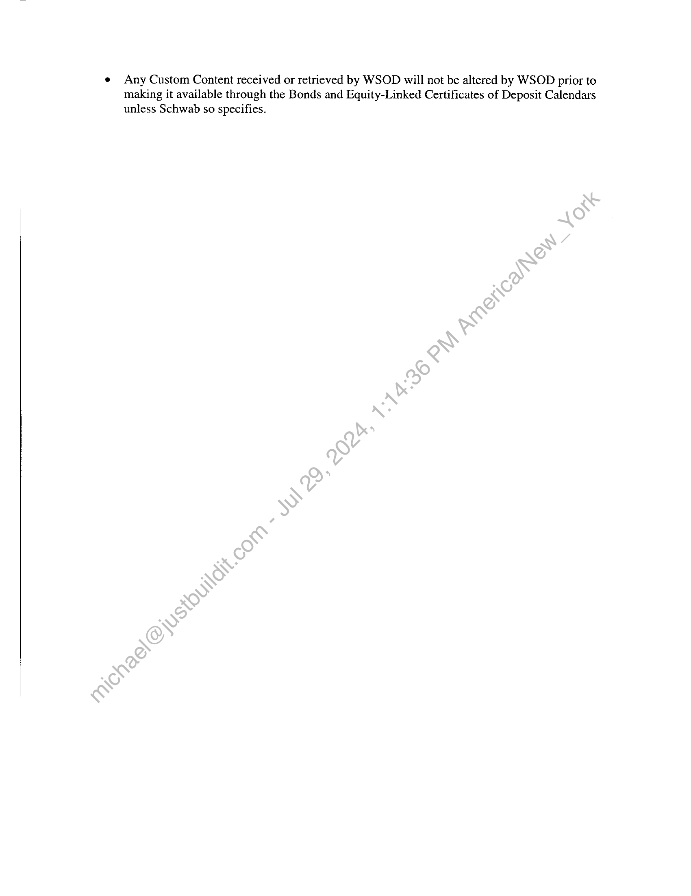

##### Statement of Work No. 62: Bonds and Equity-Linked Certificates of Deposit Calendars for Schwab Institutional]

  
````col
```col-md
flexGrow=.5
===
> [!info] [Page 1](_attachments/images_Schwab-3.6.1.18.3800147794.pdf_210937/page_1.png)
> 
```  
```col-md
STATEMENT OF WoRK NO. 62
Bonds and Equity-Linked Certificates of Deposit Calendars for Schwab Institutional  
Wall Street on Demand, Inc. (“WSOD”), and Charles Schwab & Co., Inc. ("Schwab"),
hereby agree to supplement their Master Internet Site Agreement effective as of February 1,
2001, (the "Agreement") with the following Statement of Work (the “SOW”), effective as of
June 1, 2003 (the “SOW Effective Date”).  
This SOW will incorporate by reference the Agreement upon exccution hereof by both
parties. In the event of any conflict between the terms and conditions of this SOW and the
Agreement, this SOW will control only with respect to the products and services provided
herein; otherwise the Agreement will control.  
The Agreement and this SOW are the entire agreement between the parties concerning
WSOD’s provision of the products and services described in this SOW. Except for the
Agreement, this SOW supersedes, and its terms govern, any prior agreements (including without
limitation any nondisclosure agreements), proposals or other communications, oral or written,
between the parties with respect to the products and services provided by WSOD under this
SOW. This SOW may be modified by mutual written agreement of the parties from time to time
to reflect the required performance of, and the corresponding responsibilities for, the services
described herein as it continues to be proven in a production environment.  
This SOW is composed of the following:
Exhibit A: Bonds and Equity-Linked Certificates of Deposit Calendars Specifications  
Exhibit B: Service Level and Support(Obligations
Exhibit C: Term, Fees and Expenses  
In witness whereof, the parties to this Agreement execute it through their duly authorized  
representatives. The parties hereby acknowledge that they have read this SOW, including all  
exhibits and the Agree ent, and understand and agree to be bound by its terms and conditions.
ELS  
ie  
James Tanner  
President  
(Date) /  
```
````
Notes:    
````col
```col-md
flexGrow=.5
===
> [!info] [Page 2](_attachments/images_Schwab-3.6.1.18.3800147794.pdf_210937/page_2.png)
> 
```  
```col-md
EXHIBIT A TO STATEMENT OF WORK NO. 62
Bonds and Equity-Linked Certificates of Deposit Calendars for Schwab Institutional  
BONDS AND EQUITY-LINKED CERTIFICATES OF DEPOSIT CALENDARS
SPECIFICATIONS  
e The Bonds and Equity-Linked Certificates of Deposit Calendars include the development,
and hosting of the following items:  
(a) Development of appropriate URLs for the Bonds Calendar and Equity-Linked
Certificates of Deposit Calendar  
(b) Development of unique reporting for Schwab Institutional customers<visiting the
Bonds Calendar and Equity-Linked Certificates of Deposit Calendar from the
Schwab Institutional Site  
(c) Inclusion of minor text modifications on any of the pages  
(da) Hosting of the Bonds Calendar and Equity-LinkedCertificate of Deposit Calendar
from the Schwab Institutional  
(collectively, the “Business Requirements”). In addition, the Bonds and Equity-Linked
Certificates of Deposit Calendars for Schwab Institutional will initially incorporate certain
modifications and enhancements at no additional\cost as mutually agreed by the parties.  
e Schwab may amend the Business Requirements and this exhibit from time to time by written
request to WSOD. If such request,does not require that WSOD incur any costs or expenses,
then WSOD will respond withinsfive (5) working days by either implementing the requested
changes or by providing an estimated completion date for any changes that WSOD
reasonably believes will require more than five (5) working days to implement. If such
request does require that‘WSOD incur costs or expenses, then WSOD will provide Schwab
with a written estimate of such costs and expenses in good faith within five (5) business days
for Schwab’s consideration. If Schwab accepts the written estimate, this Statement of Work
shall be amended.to include the additional scope and requirements.  
e Schwab maintains the ability to make reasonable changes to the look and feel of the Bonds
and Equity-Linked Certificates of Deposit Calendars. WSOD shall be required to respond to
change requests within five (5) working days by either implementing the requested changes
or by providing an estimated completion date for any changes that WSOD reasonably
believes will require more than five (5) working days to implement. WSOD shall provide
substantial justification for refusal to make any changes requested by Schwab. Additional
fees arising from these changes shall be agreed to by both parties prior to the rendering of
any additional services by WSOD.  
```
````
Notes:    
````col
```col-md
flexGrow=.5
===
> [!info] [Page 3](_attachments/images_Schwab-3.6.1.18.3800147794.pdf_210937/page_3.png)
> 
```  
```col-md
e Any Custom Content received or retrieved by WSOD will not be altered by WSOD prior to
making it available through the Bonds and Equity-Linked Certificates of Deposit Calendars
unless Schwab so specifies.  
```
````
Notes:    
````col
```col-md
flexGrow=.5
===
> [!info] [Page 4](_attachments/images_Schwab-3.6.1.18.3800147794.pdf_210937/page_4.png)
> 
```  
```col-md
EXHIBIT B TO STATEMENT OF WORK NO. 62
Bonds and Equity-Linked Certificates of Deposit Calendars for Schwab Institutional  
SERVICE LEVEL AND SUPPORT OBLIGATIONS  
Support and training:  
1. WSOD will provide reasonable training to certain representatives of Schwab as requested
by Schwab from time to time, including but not limited to its Technical Client Services
group.  
2. WSOD will provide documentation as deemed necessary by Schwab.  
3. All calls relating to Schwab content or functionality received by WSOD»will be referred  
to representatives of Schwab.  
4. The Bonds and Equity-Linked Certificates of Deposit Calendars will be available 24
hours a day, 7 days a week, excluding scheduled maintenamice'as mutually agreed by the
parties.  
5. If the Bonds and Equity-Linked Certificates of Deposit Calendars become unavailable for
any reason, WSOD will use its best efforts to remedy the problem immediately. WSOD
will immediately notify the designated point*of-contact at Schwab of any outages that
cannot be resolved within the time limits\stated in the Master Internet Site Agreement.  
6. WSOD will provide a 24x7x365 contact to communicate any failures or outages of the
Bonds and Equity-Linked Certificates of Deposit Calendars with a fifteen (15) minute
response time.  
7. WSOD will keep the Bonds and Equity-Linked Certificates of Deposit Calendars updated
with most current Custom Content available to it.  
8. WSOD will supply weekly usage data to Schwab regarding the Bonds and Equity-Linked
Certiticates.of Deposit Calendars Pages, including, but not limited to those listed in the
Business Requirements.  
```
````
Notes:    
````col
```col-md
flexGrow=.5
===
> [!info] [Page 5](_attachments/images_Schwab-3.6.1.18.3800147794.pdf_210937/page_5.png)
> 
```  
```col-md
EXHIBIT C TO STATEMENT OF WORK NO. 62
Bonds and Equity-Linked Certificates of Deposit Calendars for Schwab Institutional  
TERM, FEES AND EXPENSES  
The Initial Term of this SOW will commence on its effective date and last until twelve (12)
months following the date that Bonds and Equity-Linked Certificates of Deposit Calendars for
Schwab Institutional are first made generally available to Schwab (“Launch Date”), at which
time it shall renew for additional thirty (30) day periods (“Automatic Renewal Periods”) until
terminated by Schwab on thirty (30) days’ prior written notice to WSOD.  
WSOD agrees to wave the one-time development fee for the development of the Bonds and
Equity-Linked Certificates of Deposit Calendars for Schwab Institutional.  
For hosting and maintaining the Bonds and Equity-Linked Certificates of Deposit Calendars for
Schwab Institutional, Schwab will pay WSOD: (1) two thousand five hundred ($2,500) per
month beginning for June 2003 during the Initial Term, and (2) two thousand five hundred
($2,500) per month during any Automatic Renewal Periods, unless otherwise agreed to by the
parties in writing.  
Schwab is responsible for all license and other fees payable.to the third-party information
providers for the use of their information or content forthe Bonds and Equity-Linked Certificates
of Deposit Calendars.  
```
````
Notes:  


![[_attachments/Schwab-3.6.1.18.38 00147794.pdf]