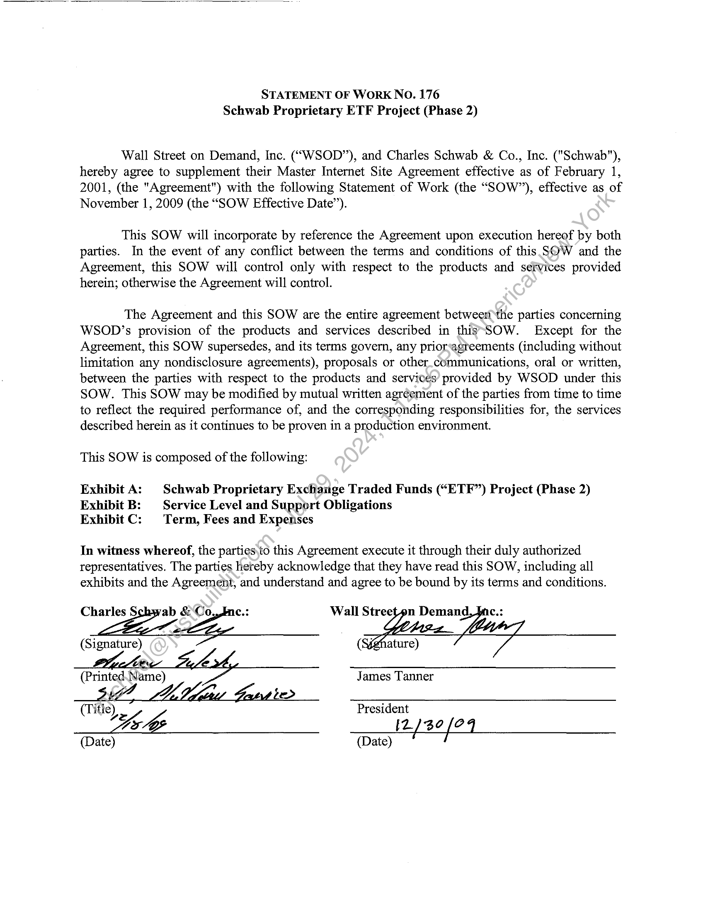
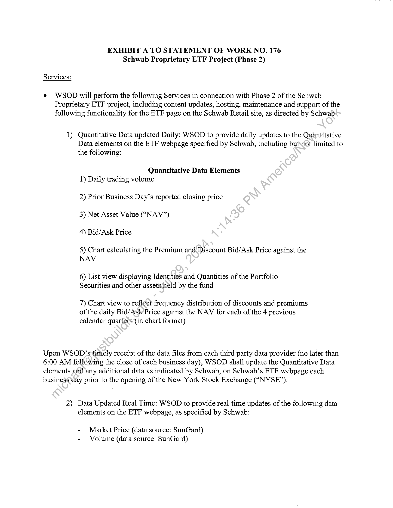
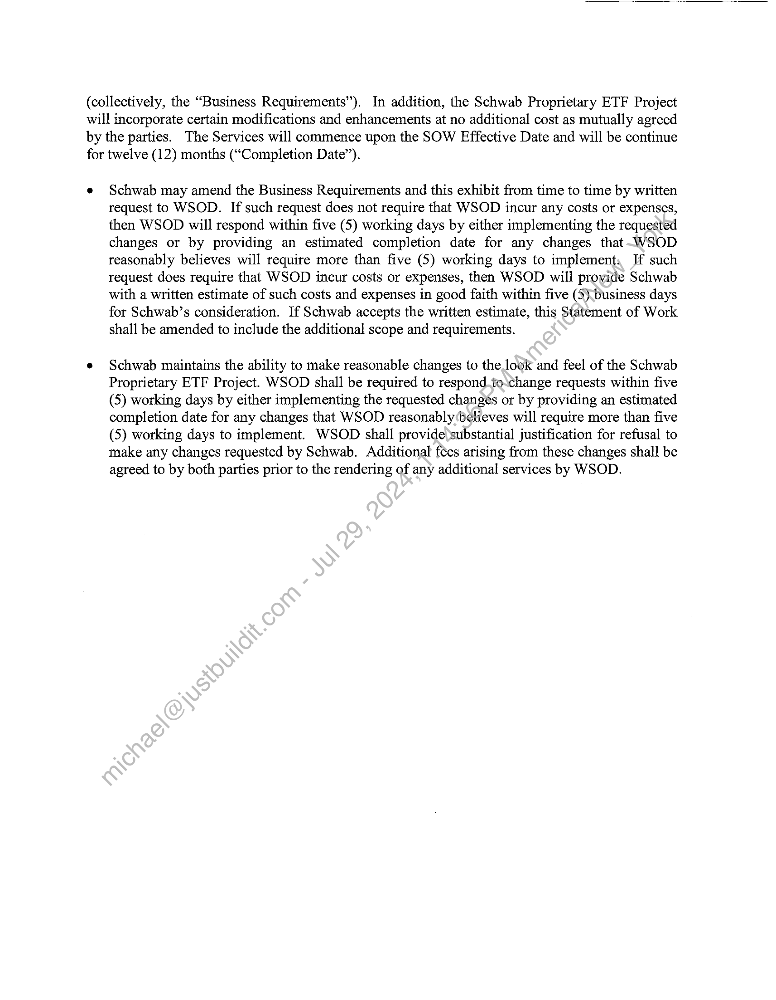
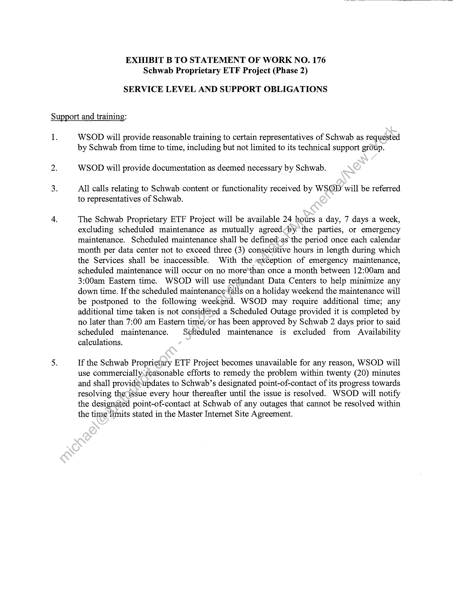
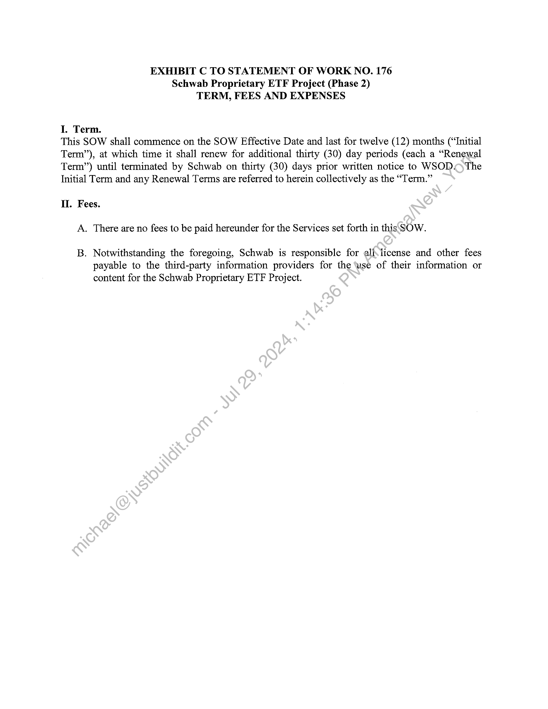

##### Statement of Work No. 176: Schwab Proprietary ETF Project (Phase 2)]

  
````col
```col-md
flexGrow=.5
===
> [!info] [Page 1](_attachments/images_Schwab-3.6.1.18.3900147706.pdf_212600/page_1.png)
> 
```  
```col-md
STATEMENT OF WORK NO. 176
Schwab Proprietary ETF Project (Phase 2)  
Wall Street on Demand, Inc. (“WSOD”), and Charles Schwab & Co., Inc. ("Schwab"),
hereby agree to supplement their Master Internet Site Agreement effective as of February 1,
2001, (the "Agreement") with the following Statement of Work (the “SOW”), effective as of
November 1, 2009 (the “SOW Effective Date”).  
This SOW will incorporate by reference the Agreement upon execution hereof by both
parties. In the event of any conflict between the terms and conditions of this SOW and the
Agreement, this SOW will control only with respect to the products and services provided
herein; otherwise the Agreement will control.  
The Agreement and this SOW are the entire agreement between the parties concerning
WSOD’s provision of the products and services described in thissSOW. Except for the
Agreement, this SOW supersedes, and its terms govern, any priorsagreements (including without
limitation any nondisclosure agreements), proposals or other.communications, oral or written,
between the parties with respect to the products and services’ provided by WSOD under this
SOW. This SOW may be modified by mutual written agreement of the parties from time to time
to reflect the required performance of, and the corresponding responsibilities for, the services
described herein as it continues to be proven in a production environment.  
This SOW is composed of the following:  
Exhibit A: | Schwab Proprietary Exchange Traded Funds (“ETF”) Project (Phase 2)
Exhibit B: | Service Level and Support Obligations
Exhibit C: Term, Fees and Expenses  
In witness whereof, the parties,to this Agreement execute it through their duly authorized
representatives. The parties hereby acknowledge that they have read this SOW, including all
exhibits and the Agreement, and understand and agree to be bound by its terms and conditions.  
Charles Ow & Zo
(Signature)  
e.
(Printed. Name) James Tanner  
de>  
(Title) President
ee 12/39 [24  
(Date) (Date)  
```
````
Notes:    
````col
```col-md
flexGrow=.5
===
> [!info] [Page 2](_attachments/images_Schwab-3.6.1.18.3900147706.pdf_212600/page_2.png)
> 
```  
```col-md
EXHIBIT A TO STATEMENT OF WORK NO. 176
Schwab Proprietary ETF Project (Phase 2)  
Services:  
e WSOD will perform the following Services in connection with Phase 2 of the Schwab
Proprietary ETF project, including content updates, hosting, maintenance and support of the
following functionality for the ETF page on the Schwab Retail site, as directed by Schwab:  
1) Quantitative Data updated Daily: WSOD to provide daily updates to the Quantitative
Data elements on the ETF webpage specified by Schwab, including butwiot limited to
the following:  
Quantitative Data Elements
1) Daily trading volume  
2) Prior Business Day’s reported closing price
3) Net Asset Value (“NAV”)
4) Bid/Ask Price  
5) Chart calculating the Premium and Discount Bid/Ask Price against the
NAV  
6) List view displaying Identities and Quantities of the Portfolio
Securities and other assets:held by the fund  
7) Chart view to reflect frequency distribution of discounts and premiums
of the daily Bid/Ask Price against the NAV for each of the 4 previous
calendar quartets (in chart format)  
Upon WSOD’s timely receipt of the data files from each third party data provider (no later than
6:00 AM following the close of each business day), WSOD shall update the Quantitative Data
elements and any additional data as indicated by Schwab, on Schwab’s ETF webpage each
business day prior to the opening of the New York Stock Exchange (“NYSE”).  
2) Data Updated Real Time: WSOD to provide real-time updates of the following data
elements on the ETF webpage, as specified by Schwab:  
- Market Price (data source: SunGard)
- Volume (data source: SunGard)  
```
````
Notes:    
````col
```col-md
flexGrow=.5
===
> [!info] [Page 3](_attachments/images_Schwab-3.6.1.18.3900147706.pdf_212600/page_3.png)
> 
```  
```col-md
(collectively, the “Business Requirements”). In addition, the Schwab Proprietary ETF Project
will incorporate certain modifications and enhancements at no additional cost as mutually agreed
by the parties. The Services will commence upon the SOW Effective Date and will be continue
for twelve (12) months (“Completion Date”).  
Schwab may amend the Business Requirements and this exhibit from time to time by written
request to WSOD. If such request does not require that WSOD incur any costs or expenses,
then WSOD will respond within five (5) working days by either implementing the requested
changes or by providing an estimated completion date for any changes that -WSOD
reasonably believes will require more than five (5) working days to implement, Jf such
request does require that WSOD incur costs or expenses, then WSOD will prowide Schwab
with a written estimate of such costs and expenses in good faith within five (5)-business days
for Schwab’s consideration. If Schwab accepts the written estimate, this Statement of Work
shall be amended to include the additional scope and requirements.  
Schwab maintains the ability to make reasonable changes to the look and feel of the Schwab
Proprietary ETF Project. WSOD shall be required to respond.to\change requests within five
(5) working days by either implementing the requested changes or by providing an estimated
completion date for any changes that WSOD reasonably believes will require more than five
(5) working days to implement. WSOD shall provide)substantial justification for refusal to
make any changes requested by Schwab. Additional fees arising from these changes shall be
agreed to by both parties prior to the rendering of any additional services by WSOD.  
```
````
Notes:    
````col
```col-md
flexGrow=.5
===
> [!info] [Page 4](_attachments/images_Schwab-3.6.1.18.3900147706.pdf_212600/page_4.png)
> 
```  
```col-md
EXHIBIT B TO STATEMENT OF WORK NO. 176
Schwab Proprietary ETF Project (Phase 2)  
SERVICE LEVEL AND SUPPORT OBLIGATIONS  
Support and training:  
1.  
WSOD will provide reasonable training to certain representatives of Schwab as requested
by Schwab from time to time, including but not limited to its technical support group.  
WSOD will provide documentation as deemed necessary by Schwab.  
All calls relating to Schwab content or functionality received by WSOD will be referred
to representatives of Schwab.  
The Schwab Proprietary ETF Project will be available 24 hours a day, 7 days a week,
excluding scheduled maintenance as mutually agreed<by the parties, or emergency
maintenance. Scheduled maintenance shall be defined-as the period once each calendar
month per data center not to exceed three (3) consecutive hours in length during which
the Services shall be inaccessible. With the »exception of emergency maintenance,
scheduled maintenance will occur on no more*than once a month between 12:00am and
3:00am Eastern time. WSOD will use redundant Data Centers to help minimize any
down time. If the scheduled maintenance-falls on a holiday weekend the maintenance will
be postponed to the following weekend. WSOD may require additional time; any
additional time taken is not consideted a Scheduled Outage provided it is completed by
no later than 7:00 am Eastern timeyor has been approved by Schwab 2 days prior to said
scheduled maintenance. Scheduled maintenance is excluded from Availability
calculations.  
If the Schwab Proprietary ETF Project becomes unavailable for any reason, WSOD will
use commercially-reasonable efforts to remedy the problem within twenty (20) minutes
and shall provide-updates to Schwab’s designated point-of-contact of its progress towards
resolving theissue every hour thereafter until the issue is resolved. WSOD will notify
the designated point-of-contact at Schwab of any outages that cannot be resolved within
the tine limits stated in the Master Internet Site Agreement.  
```
````
Notes:    
````col
```col-md
flexGrow=.5
===
> [!info] [Page 5](_attachments/images_Schwab-3.6.1.18.3900147706.pdf_212600/page_5.png)
> 
```  
```col-md
EXHIBIT C TO STATEMENT OF WORK NO. 176
Schwab Proprietary ETF Project (Phase 2)
TERM, FEES AND EXPENSES  
I. Term.  
This SOW shall commence on the SOW Effective Date and last for twelve (12) months (“Initial
Term”), at which time it shall renew for additional thirty (30) day periods (each a “Renewal
Term’) until terminated by Schwab on thirty (30) days prior written notice to WSOD.The
Initial Term and any Renewal Terms are referred to herein collectively as the “Term.”  
II. Fees.
A. There are no fees to be paid hereunder for the Services set forth in this SOW.
B. Notwithstanding the foregoing, Schwab is responsible for ali.license and other fees  
payable to the third-party information providers for the ‘use of their information or
content for the Schwab Proprietary ETF Project.  
```
````
Notes:  


![[_attachments/Schwab-3.6.1.18.39 00147706.pdf]