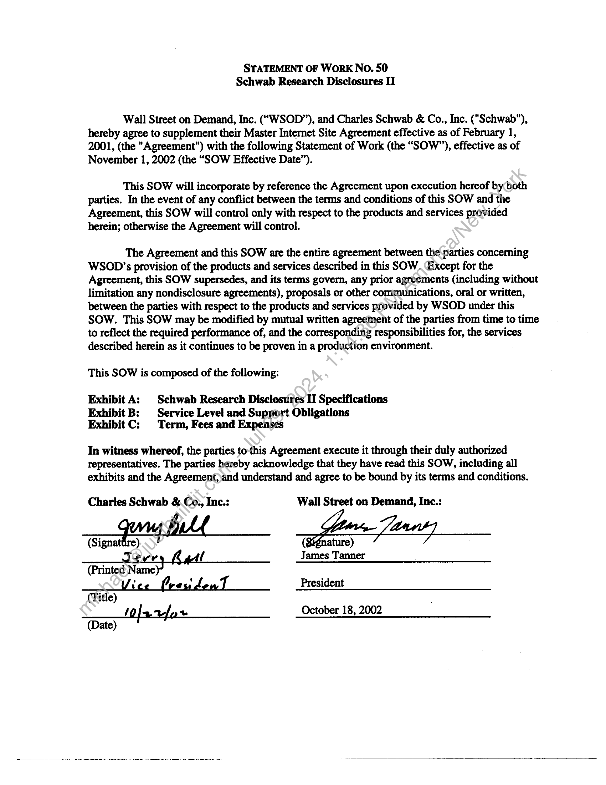
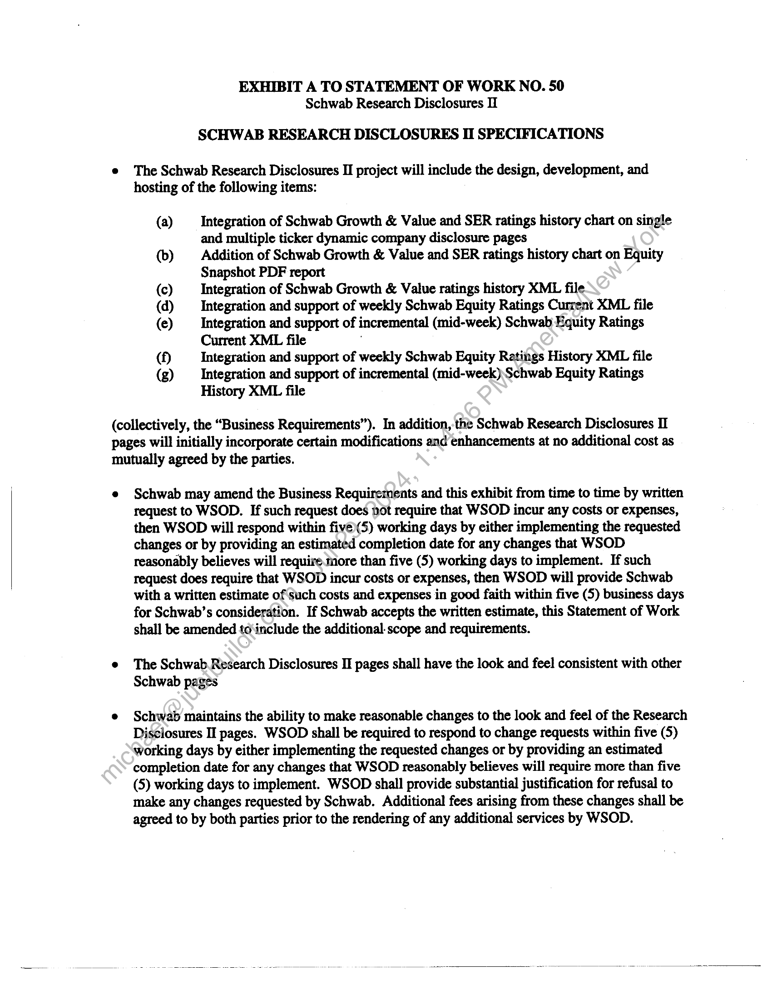
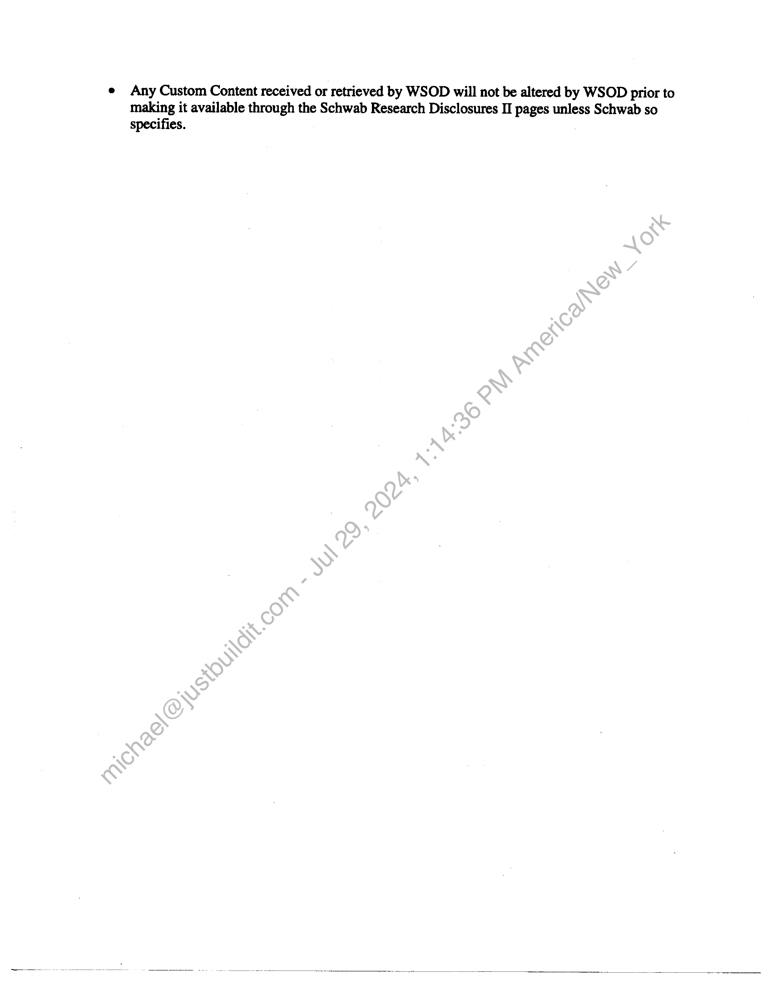
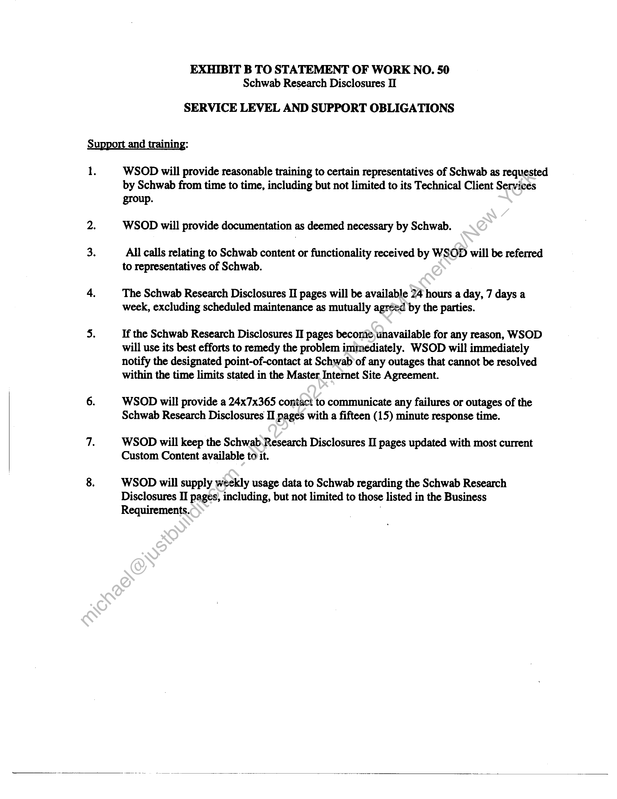
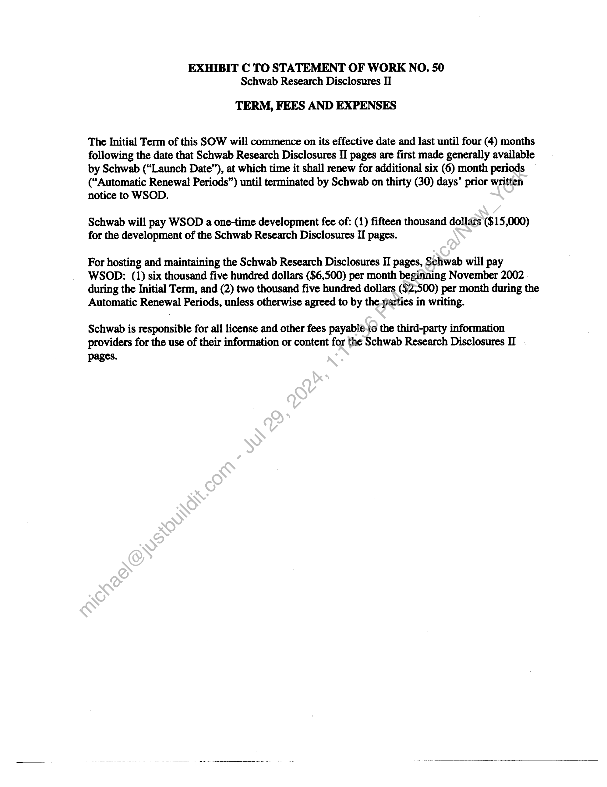

##### STATEMENT OF WORK No. 50
Schwab Research Disclosures II]

  
````col
```col-md
flexGrow=.5
===
> [!info] [Page 1](_attachments/images_Schwab-3.6.1.18.400147691.pdf_210416/page_1.png)
> 
```  
```col-md
STATEMENT OF WORK No. 50
Schwab Research Disclosures II  
Wall Street on Demand, Inc. (“WSOD”), and Charles Schwab & Co., Inc. ("Schwab"),
hereby agree to supplement their Master Internet Site Agreement effective as of February 1,
2001, (the "Agreement") with the following Statement of Work (the “SOW”), effective as of
November 1, 2002 (the “SOW Effective Date”).  
This SOW will incorporate by reference the Agreement upon execution hereof by both
parties. In the event of any conflict between the terms and conditions of this SOW and the
Agreement, this SOW will control only with respect to the products and services provided
herein; otherwise the Agreement will control.  
The Agreement and this SOW are the entire agreement between the parties concerning
WSOD’s provision of the products and services described in this SOW. Except for the
Agreement, this SOW supersedes, and its terms govern, any prior agreements (including without
limitation any nondisclosure agreements), proposals or other communications, oral or written,
between the parties with respect to the products and services provided by WSOD under this
SOW. This SOW may be modified by mutual written agreement of the parties from time to time
to reflect the required performance of, and the corresponding responsibilities for, the services
described herein as it continues to be proven in a production environment.  
This SOW is composed of the following:  
Exhibit A: | Schwab Research Disclosures II Specifications
Exhibit B: Service Level and Support Obligations
Exhibit C: Term, Fees and Expenses  
In witness whereof, the parties to-this Agreement execute it through their duly authorized
representatives. The parties hereby acknowledge that they have read this SOW, including all
exhibits and the Agreement,)and understand and agree to be bound by its terms and conditions.  
Charles Schwab &.Co., Inc.: Wall Street on Demand, Inc.:
ak” wm 7 ;
v James Tanner
(Printed N amey?
: oss President
(Title)
/ ~ October 18, 2002  
(Date)  
```
````
Notes:    
````col
```col-md
flexGrow=.5
===
> [!info] [Page 2](_attachments/images_Schwab-3.6.1.18.400147691.pdf_210416/page_2.png)
> 
```  
```col-md
EXHIBIT A TO STATEMENT OF WORK NO. 50
Schwab Research Disclosures I  
SCHWAB RESEARCH DISCLOSURES II SPECIFICATIONS  
e The Schwab Research Disclosures II project will include the design, development, and
hosting of the following items:  
(a) _ Integration of Schwab Growth & Value and SER ratings history chart on single
and multiple ticker dynamic company disclosure pages  
(b) Addition of Schwab Growth & Value and SER ratings history chart on Equity
Snapshot PDF report  
(c) _ Integration of Schwab Growth & Value ratings history XML file  
(d) _ Integration and support of weekly Schwab Equity Ratings Current XML file  
(e) Integration and support of incremental (mid-week) Schwab Equity Ratings
Current XML file .  
(f) Integration and support of weekly Schwab Equity Ratings History XML file  
(g) Integration and support of incremental (mid-week),Schwab Equity Ratings
History XML file  
(collectively, the “Business Requirements”). In addition, the Schwab Research Disclosures II
pages will initially incorporate certain modifications and enhancements at no additional cost as
mutually agreed by the parties.  
e Schwab may amend the Business Requirements and this exhibit from time to time by written
request to WSOD. If such request does not require that WSOD incur any costs or expenses,
then WSOD will respond within five)(5) working days by either implementing the requested
changes or by providing an estimated completion date for any changes that WSOD
reasonably believes will require.more than five (5) working days to implement. If such
request does require that WSOD incur costs or expenses, then WSOD will provide Schwab
with a written estimate of such costs and expenses in good faith within five (5) business days
for Schwab’s consideration. If Schwab accepts the written estimate, this Statement of Work
shall be amended to ‘include the additional-scope and requirements.  
e The Schwab Research Disclosures II pages shall have the look and feel consistent with other
Schwab pages  
e Schwab maintains the ability to make reasonable changes to the look and feel of the Research
Disclosures II pages. WSOD shall be required to respond to change requests within five (5)
working days by either implementing the requested changes or by providing an estimated
completion date for any changes that WSOD reasonably believes will require more than five
(5) working days to implement. WSOD shall provide substantial justification for refusal to
make any changes requested by Schwab. Additional fees arising from these changes shall be
agreed to by both parties prior to the rendering of any additional services by WSOD.  
```
````
Notes:    
````col
```col-md
flexGrow=.5
===
> [!info] [Page 3](_attachments/images_Schwab-3.6.1.18.400147691.pdf_210416/page_3.png)
> 
```  
```col-md
e Any Custom Content received or retrieved by WSOD will not be altered by WSOD prior to
making it available through the Schwab Research Disclosures II pages unless Schwab so
specifies.  
```
````
Notes:    
````col
```col-md
flexGrow=.5
===
> [!info] [Page 4](_attachments/images_Schwab-3.6.1.18.400147691.pdf_210416/page_4.png)
> 
```  
```col-md
EXHIBIT B TO STATEMENT OF WORK NO. 50
Schwab Research Disclosures II  
SERVICE LEVEL AND SUPPORT OBLIGATIONS  
Support and training:  
1.  
WSOD will provide reasonable training to certain representatives of Schwab as requested
by Schwab from time to time, including but not limited to its Technical Client Services  
group.
WSOD will provide documentation as deemed necessary by Schwab.  
All calls relating to Schwab content or functionality received by WSOD will be referred
to representatives of Schwab.  
The Schwab Research Disclosures H pages will be available 24 hours a day, 7 days a
week, excluding scheduled maintenance as mutually agreed by the parties.  
If the Schwab Research Disclosures II pages become unavailable for any reason, WSOD
will use its best efforts to remedy the problem immediately. WSOD will immediately
notify the designated point-of-contact at Schwab of any outages that cannot be resolved
within the time limits stated in the Master Internet Site Agreement.  
WSOD will provide a 24x7x365 contact to communicate any failures or outages of the
Schwab Research Disclosures II pages with a fifteen (15) minute response time.  
WSOD will keep the Schwab Research Disclosures II pages updated with most current
Custom Content available to it.  
WSOD will supply weekly usage data to Schwab regarding the Schwab Research
Disclosures II pages, including, but not limited to those listed in the Business
Requirements. :  
```
````
Notes:    
````col
```col-md
flexGrow=.5
===
> [!info] [Page 5](_attachments/images_Schwab-3.6.1.18.400147691.pdf_210416/page_5.png)
> 
```  
```col-md
EXHIBIT C TO STATEMENT OF WORK NO. 50
Schwab Research Disclosures II  
TERM, FEES AND EXPENSES  
The Initial Term of this SOW will commence on its effective date and last until four (4) months
following the date that Schwab Research Disclosures II pages are first made generally available
by Schwab (“Launch Date”), at which time it shall renew for additional six (6) month periods
(“Automatic Renewal Periods”) until terminated by Schwab on thirty (30) days’ prior written
notice to WSOD.  
Schwab will pay WSOD a one-time development fee of: (1) fifteen thousand dollars ($15,000)
for the development of the Schwab Research Disclosures II pages.  
For hosting and maintaining the Schwab Research Disclosures II pages, Schwab will pay
WSOD: (1) six thousand five hundred dollars ($6,500) per month beginning November 2002
during the Initial Term, and (2) two thousand five hundred dollars ($2,500) per month during the
Automatic Renewal Periods, unless otherwise agreed to by the parties in writing.  
Schwab is responsible for all license and other fees payable-to the third-party information
providers for the use of their information or content for the Schwab Research Disclosures II  
pages.  
```
````
Notes:  


![[_attachments/Schwab-3.6.1.18.4 00147691.pdf]